# 重磅｜详细解读神经网络十大误解，再也不会弄错它的工作原理

选自 TuringFinance

**作者： Stuart Reid**

**机器之心编译**

**参与：吴攀，chenxiaoqing，赵天昊，原野，微胖**

> *神经网络是机器学习算法中最流行和最强大的一类。但在作者看来，因为人们对神经网络工作原理存在误解，导致网络设计也很糟糕。所以这篇文章就对其中一些误解进行了讨论。*

神经网络是机器学习算法中最流行和最强大的一类。在计量金融中，神经网络常被用于时间序列预测、构建专用指标、算法交易、证券分类和信用风险建模。它们也被用于构建随机过程模型和价格衍生品。尽管神经网络有这些用处，但它们却往往有一个坏名声，因为它们的表现是「不可靠的」。在我看来，原因在于对神经网络工作原理存在误解，导致网络设计也很糟糕。本文将对其中的一些误解进行讨论。

**核心要点**

*   神经网络不是人类大脑的模型

*   神经网络并不是统计学的「弱形式」

*   神经网络流行许多不同的架构

*   规模很重要，但并不是越大越好

*   神经网络的训练算法有很多种

*   神经网络并不总是需要大量数据

*   神经网络不能基于任何数据训练

*   神经网络需要被再训练

*   神经网络不是黑箱

*   神经网络不难实现

**1\. 神经网络不是人类大脑的模型**

人类大脑，是我们这个时代最大的奥秘之一，科学家还未对其工作方式达成共识。目前已有的关于大脑的两个理论分别叫做祖母细胞理论（grandmother cell theory）和分布式表征理论。前一个理论认为，单个神经元具有很高的信息容量，能够表征复杂的概念，如你的祖母或甚至 Jennifer Aniston（《老友记》女主角之一——译者）。后一个理论则认为，神经元要简单得多，而复杂的表征分布在许多神经元上。人工神经网络受到了第二种理论不够精确的启发。

我认为，目前这一代神经网络不具备感知（sentience，一个与智能不同概念）能力的一个原因在于，生物神经元远比人工神经元复杂。

> *大脑中的一个单个神经元就是一个极其复杂的机器，即使在今天，我们也还不能理解它。而神经网络中的一个「神经元」只是一个极其简单的数学函数，它只能获取生物神经元复杂性中极小的一部分。所以，如果要说神经网络模拟大脑，那也只在不够精确的启发水平上是对的，但事实上人工神经网络和生物大脑没什么相似之处。——吴恩达*

大脑和神经网络之间的另一个巨大不同：大小和组织性。人类大脑包含的神经元和突触数量远多于神经网络，而且它们是自组织和自适应的。相对地，神经网络是根据一个架构进行组织的。神经网络的「自组织」非常和大脑的自组织并不是一个意思，它更类似于一张图标，而不是一张有序的网络。

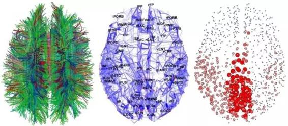*最先进的大脑成像技术生成的有趣大脑视图*  

所以，那是什么意思？可以这样想：神经网络受到大脑启发，就像北京的奥运体育场的设计灵感源自鸟巢。这并不意味着，该奥运体育场就是一个鸟巢，只是说，鸟巢的一些元素存在于该体育场的设计中。换句话说，大脑的元素存在于神经网络的设计中，但它们的相似程度比你想象的低得多。

事实上，比起人类大脑，神经网络更接近于曲线拟合（curve fitting）和回归分析（regression analysis）等统计方法。我认为，在计量金融的背景中记住这一点很重要，虽说某件事物是「由大脑启发的」可能听起来很酷，但是，这一表述可能会导致不切实际的期望或担忧。

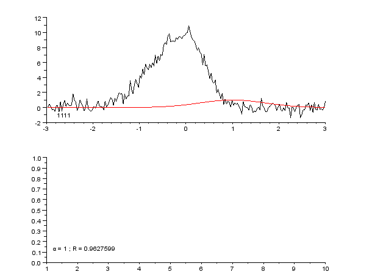*曲线拟合，亦即函数逼近。神经网络常被用来逼近复杂的数学函数*

**2\. 神经网络并不是统计学的「弱形式」**

神经网络由互连节点层组成。单个节点被称为感知器（perceptron），类似于一个多元线性回归（multiple linear regression）。多元线性回归和感知器之间的不同之处在于：感知器将多元线性回归生成的信号馈送进可能线性也可能非线性的激活函数中。在多层感知器（MLP）中，感知器按层级排布，层与层之间互相连接。在 MLP 中有三种类型的层，即：输入层（input layer）、隐藏层（hidden layer）和输出层（output layer）。输入层接收输入模式而输出层可以包含一个分类列表或那些输入模式可以映射的输出信号。隐藏层调整那些输入的权重，直到将神经网络的误差降至最小。对此的一个解释是，隐藏层提取输入数据中的显著特征，这些特征有关于输出的预测能力。

**映射输入：输出**

感知器接收输入向量，z=(z1,z2,…,zn)z=(z1,z2,…,zn)，包含 n 个属性。该输入向量被称为输入模式（input pattern）。这些输入再通过属于感知器的权重向量 v=(v1,v2,…,vn) 进行加权。在多元线性回归的背景中，这些可被认为是回归系数或 β 系数。感知器的净输入信号通常是输入模式和其权重的总和产物。使用该总和产物得到净值(net)的神经元被称为求和单元（summation unit）。

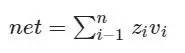

净输入信号减去偏差 θ 后被输入一些激活函数 f()。激活函数通常是单调递增函数，其值位于 (0,1) 或 (-1,1) 之间（本文后面将进一步对此进行讨论）。激活函数可以是线性的，也可以是非线性的。

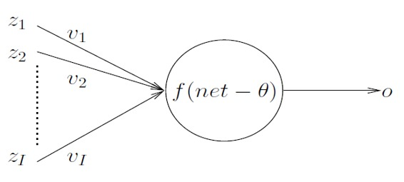 下面是神经网络中一些常见的激活函数：

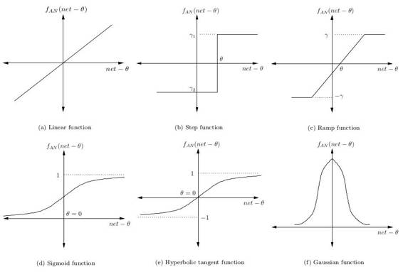*依次为：线性函数、阶跃函数、斜坡函数、S 型函数、双曲正切函数、高斯函数*

最简单的神经网络只有一个映射输入到输出的神经元。对于给定模式 p，该网络的目标是相对一些给定的训练模式 tp 的一些一只的目标值来最小化输出信号 op 的误差。比如，如果该神经元应该映射 p 到 -1，但却将其映射到了 1，那么，根据距离的求和平方测定，神经元的误差为 4，即 (-1-1)².

**分层**

**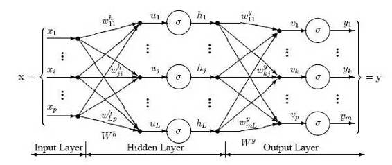** 

如上图所示，感知器被分层进行组织。感知器的第一层被称为输入层，它接收训练集 PT 中的模式 p. 最后一层映射到这些模型的预期输出。举一个输出的例子：模式可以是关于安全性的不同技术指标的数量列表，而潜在的输出则可能是 {买进、持有、卖出} 这样的分类。

隐藏层则将前一层的输出作为下一层的输入；而下一层的输出又会作为另一层的输入。所以，这些隐藏层到底在做什么？一个解释是，它们提取输入数据中的显著特征，这些特征可以预测输出。这个过程被称为特征提取（feature extraction），而且在某种程度上，其和主成分分析（PCA）等统计技术具有相似的功能。

深度神经网络具有大量隐藏层，有能力从数据中提取更加深层的特征。最近，深度神经网络在图像识别问题上取得了异常优异的表现。图像识别中的特征提取的图示如下：

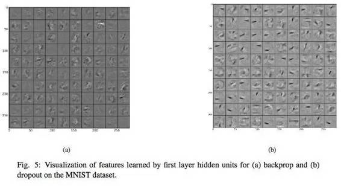 

除了过拟合（overfitting）的明显风险，我认为，用于交易的深度神经网络，在使用上所面临的一个问题是该神经网络的输入几乎总是经过了严重的预处理，这意味着实际可以提取的特征可能非常少，因为输入已经是某种程度的特征了。

**学习规则**

正如前面提到的那样，神经网络的目标是最小化一些错误度量（measure of error） ε. 最常见的错误度量是误差平方和（Sum squared error (SSE)）；尽管在金融市场的应用中，这种度量对异常值很敏感，而且可能没有跟踪误差（tracking error）那样合适。

误差平方和：

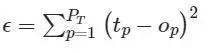

鉴于该网络的目标是最小化 ε，我们可以使用一种优化算法调整该神经网络中的权重。神经网络最常见的学习算法是梯度下降算法，尽管也可能使用其它算法和潜在更好的优化算法。梯度下降算法的工作方式是，计算相对于神经网络中每一层的权重的误差偏导数，然后在与梯度相反的方向上移动（因为我们想最小化神经网络的误差）。通过最小化误差，我们可以最大化神经网络在样本中的表现。

数学表示神经网络(v)中的权重更新规则由下式给出：

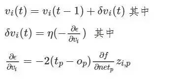 

其中 η 是指学习率，控制着神经网络收敛的快慢程度。f 相对于模式 p 的净输入信号的偏导数的计算是所有非连续激活函数所面临的问题，这不值一提；这也是可能使用可选优化算法的一个原因。学习率的选择对神经网络的表现有很大的影响。较小值的 η 可能导致非常慢的收敛，而较高值的 η 则可能导致训练中的大量偏差。

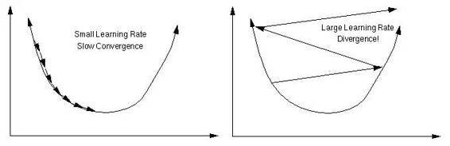*小学习率慢收敛，大学习率发散*  

**总结**

不管我遇见过的一些统计学家相信什么，神经网络不只是「懒人分析师的弱形式的统计学」（之前确实有人跟我这么说，而且这还挺有趣）；神经网络代表了一种可追溯到几百年前的可靠统计方法的抽象。对于神经网络背后的统计学，我推荐阅读超棒的这一章（http://page.mi.fu-berlin.de/rojas/neural/chapter/K9.pdf）。话虽如此，但我同意，一些从业者喜欢将神经网络看作是「黑箱」，这样就可以在没有花时间了解问题的本质和神经网络是否是合适的选择的前提下，将神经网络应用于任何问题。在交易使用神经网络就是其中一例；市场是动态变化的，但是，随着时间的过去，神经网络假设输入模式的分布仍然保持静止。在《All Models are Wrong, 7 Sources of Model Risk》中可看到更详细的讨论。

**3.神经网络流行许多不同的架构**

到目前为止，我们已经讨论了最简单的神经网络结构，也就是多层感知器（multi-layer perception）。还有很多不同的神经网络结构（太多了，以至于难以在此提及），而且，任何神经网络的性能，是其结构和权重的一个函数。如今在机器学习领域中取得的许多进步，并非源自重新思考感知器和优化算法工作原理，而是创造性地思考如何融合这些组分。在下面，我会讨论一些非常有趣且富创造性的神经网络结构，递归神经网络（RNN）——一些或所有的连接倒流，意味着反馈环路存在于网络中。人们相信，这些网络能够在时间序列数据上表现得更好。照此说来，在金融市场的语境中，他们可能会特别相关。更多信息，请参见这篇很棒的文章《The unreasonable performance of recurrent [deep] neural networks.》

这张图表展示了三个流行的递归神经网络结构，即 Elman 神经网络，Jordan 神经网络与 Hopfield 单层神经网络。

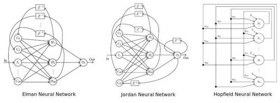

一个更新近、有趣的递归神经网络结构是神经图灵机器（Neural Turing Machine），结合了存储器与一个递归神经网络。事实已经证明，这些神经网络是图灵完全（Turing complete）的，并能够学习分类算法和其他计算任务。

Boltzmann 神经网络——最早的全连接神经网络之一，也就是 Boltzmann 机。这些网络是第一批能够学习内部表征、解决非常难的组合数学问题的网络。对 Boltzmann 机的一个解释是这样的：Hopfield 递归神经网络的蒙特卡洛版。尽管如此，很难训练神经网络，但是，受到约束时，会比传统神经网络更有效。给 Boltzmann 机施加限制，最流行的做法就是不准许隐藏神经元之间建立直接联系。这一特殊结构被称为受限 Boltzmann 机（Restricted Boltzmann Machine），被用于深度受限 Boltzmann 机（Deep Botlzmann Machines）。

 

*图表展示了不同的波兹曼机（带有不同节点连接），如何能显著影响神经网络结果*

深度神经网络——有着多层隐藏层的神经网络。近些年，深度神经网络已经成为最流行的网络，因为在图像和声音识别方面，它们取得了前所未有的成功。深度神经网络架构数量正在迅速增长，一些最受欢迎的架构包括深度信任网络（Deep Belief Networks），卷积神经网络，深度受限波兹曼机，栈化自动编码器，等等。深度神经网络最大问题之一，尤其是不稳定的金融市场环境下，是过度拟合。

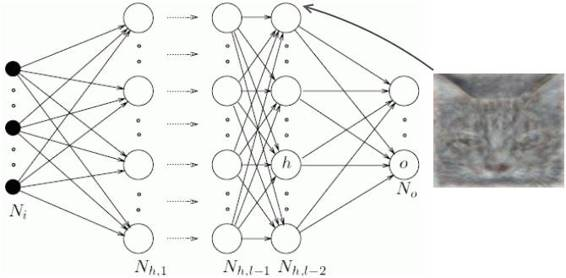 

*多个隐藏层组成的深度神经网络*

自适应神经网络（Adaptive Neural Networks）——能够在学习中同时自适应、并优化自身结构的神经网络。实现这一点，要么是靠发展结构（添加更多隐藏层）或压缩结构（修剪不必要的隐藏层）。我相信，自适应神经网络是最适合金融市场的网络，因为市场具有动态性。之所以这么说，是因为神经网络所读取的特征可能会随着时间和市场的变化而有所加强或减弱。这意味着，过去收效很好的架构也需要修改，才能在今天达到最好的效果。

两个不同类型的自适应神经网络结构。左图是级联神经网络（cascade neural network），右图是自组织映射。

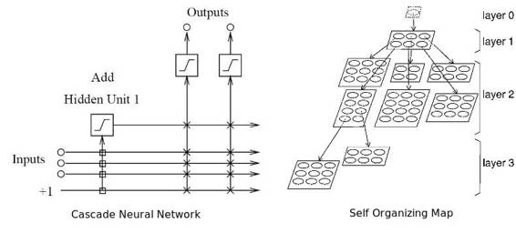 

径向基函数网络（Radial basis networks）——尽管从感知与连接上来说并不是一个不同类型的结构，径向基函数网络利用径向基函数作为它们激活功能，这些是真实的重要功能，其输出从一个特定的角度来看取决于距离。最常用的径向基函数是高斯分布。由于径向基函数可以采用更加复杂的形式，他们最初用于执行函数插值。因此径向基函数神经网络可以有一个更高的信息能力。径向基函数还用于支持向量机（Support Vector Machine）的内核。

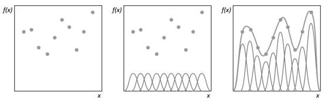*利用径向基函数，如何实现曲线拟合*

总之，有数百个神经网络结构，而且一个神经网络性能可以会显著优于另一个。有兴趣使用神经网络进行量化分析的人，可能要测试多个神经网络结构，并结合它们的输出一起考虑，要从总体上最大化他们的投资成绩。利用神经网络进行交易之前，我建议先阅读我写的《All Your Models are Wrong，7 Sources of Model Risk》，因为里面谈到的不少问题仍然有用。

**4.规模很重要，但并不是越大越好**

选择了一个架构后，你还要决定神经网络的规模大小。多少输入？应该使用多少隐藏神经元？又有多少要用的隐藏层（如果我们用的是深度神经网络的话）？多少输出神经元？这些问题之所以十分重要是因为如果神经网络太大（或太小），神经网络可能会出现过度拟合（或拟合不够），也就是说，网络无法顺利泛化样本。

**该利用多少或哪些输入？**

输入的数量取决于待决问题、可提供数据的数量和质量，或许还需要一些创造力。输入是一些简单的变量，我们相信，这些变量具有一些预测能力，可以根据被预测的因变量进行一些预测。如果不清楚某个问题的输入，你可以系统地决定哪个变量应该被包括在内，方法就是观察潜在自变量和因变量之间的相关性和互相关。这种方法在《What Drives Real GDP Growth？》中有详细介绍。

利用相关性去选择输入变量，存在两个问题。首先，如果你正在使用一个线性相关矩阵，你也许会不小心排除了有用的变量。第二，两个相对不相关变量，结合在一起，可能会产生一个强相关变量。如果孤立观察变量，你也许会错失这一良机。为了克服第二种问题，你应该利用主成分分析去获取有用的特征向量（变量的线性结合），并将它们作为输入。这里的问题是，特征向量也许不能很好地泛化，而且它们还假设输入模式分布是固定的。

选择变量过程中会遇到的另一个问题，就是多重共线性。多重共线性是指，正被输入到模型中的独立变量中，有两个或更多的独立变量是高度相关的。在回归模型的语境下，这种情况可能会引发回归系数根据模型或数据的细微改变而不规律地变化。鉴于神经网络和回归模型是相似的，我怀疑神经网络也会存在这个问题。

最后，但并非不重要的是，当选择变量是基于省略变量的偏见时，或许会引发统计学上的偏见。当创建一个模型，这个模型遗漏了一个或者更加重要的原因变量时，省略变量偏见会出现。

当模型通过过度或低估某个其他变量影响的方式，不正确地补偿漏掉的变量时，也会制造偏见。比如，权重会变得过大，或 SSE（误差平方和）会过大。

**我该使用多少隐藏神经元？**

隐藏单元的最佳数目，是个细节问题。这也就是说，作为一条经验法则，隐藏层越多，过度拟合风险越大。当神经网络并没有学习数据的重要统计特征，而是「记忆」模式与他们可能收集到的任何噪音，过度拟合就会发生。在样本中，这个结果不错，但是，离开样本，这个结果没有说服力。如何避免过度拟合？在产业领域，有两种流行的方法：早期停止（early stopping）和规则化（regularization），而我个人最喜欢的方法——全程检索。

早期停止，包括将训练组分为主要训练组和一个验证组。然后，不是以固定的迭代量来训练神经网络，而是训练网络，直到它在验证组上的表现成绩开始恶化。本质上，这能防止神经网络使用所有可以接触到的参数，并限制它简单记忆每一个所见模式的能力。这幅图显示了两个潜在的停止点（a 和 b）。

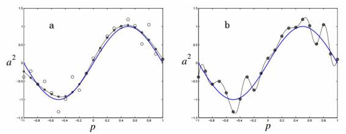 

*图片展示了神经网络在 a 到 b 进行阻止后的效果与过度拟合*

规范化是指，神经网络利用复杂结构时，对其进行惩罚。可以根据神经网络权重大小来衡量这一方法的复杂性。可以这样实现规范化，添加一个条件（term），求平方误差目标函数，这个函数取决于权重大小。这相当于添加一个先验（prior），让神经网络相信它正在逼近的函数是平滑的。

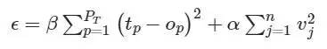 

n 是神经网络中的权重数值。参数α与β控制着神经网络过度拟合或拟合不足程度。

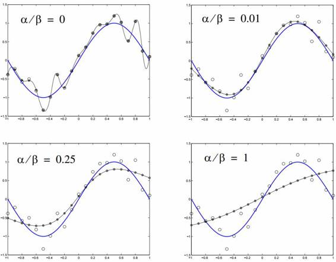

我最喜欢的技术，也是到目前为止计算最昂贵的，就是全程搜索。在这一方法中，搜索算法被用来尝试不同的神经网络结构，最终做出一个近乎最佳的选择。人们经常使用基因算法来实现这个。

**什么是输出？**

神经网络能被用于回归或分类。在回归模型中，一个简单输出值可能被会被隐射到一组真实数字，这意味着只需要一个输出神经元。在分类模型中，针对模式可能被归入的每个潜在类别，系统需要一个输出神经元。如果类别是未知的，我们就要使用无监督神经网络技术，比如自组织映射。

总而言之，最好的办法是遵守奥卡姆剃刀原理。奥卡姆剃刀原理主张，对于两个性能相当的模型，自由参数更少的模型，其泛化效果越加。另一方面，绝不能通过牺牲效果，来选择过度简化的模型。类似地，人们不能去假设，仅仅因为神经网络有更多的隐藏层与隐藏神经元，它就一定优于更简单的网络。不幸的是，在我看来，人们似乎太重视大型网络，很少强调做一个好的设计决策。就神经网络而言，规模更大并不意味着效果更好。

**5\. 神经网络的训练算法有很多种**

神经网络的学习算法不断尝试优化神经网络的权重，直到遇到必须停止的情况。这种情况通常发生在网络的误差率降到了可接受水平时、验证集的误差率开始变差时、或指定的计算资源预算已被耗尽时。目前最常见的神经网络学习算法是反向转播（backpropagation）算法，这种算法使用了前文提到过的随机梯度下降。反向转播包括两个步骤：

前向传播——将训练数据集通过网络，记录下神经网络的输出并计算出网络的误差。

反向转播——将误差信号反向通过网络，使用梯度下降优化神经网络的权重。

这种算法存在一些问题：一次性调整所有权重将会导致权重空间中的神经网络出现明显的变化、随机梯度下降算法非常慢、对局部最小值敏感。对于一些特定的神经网络（包括所有的 product link 神经网络）局部最小值是一个问题。反向转播算法的前两个问题可以通过使用梯度下降算法的变体来解决，例如动量梯度下降（QuickProp）、Nesterov 加速动量（NAG）梯度下降、自适应梯度算法（AdaGrad）、弹性反向传播（RProp）和均方根反向传播（RMSProp）。下图可以看到，变体算法相比经典梯度下降算法可以有明显的提高。

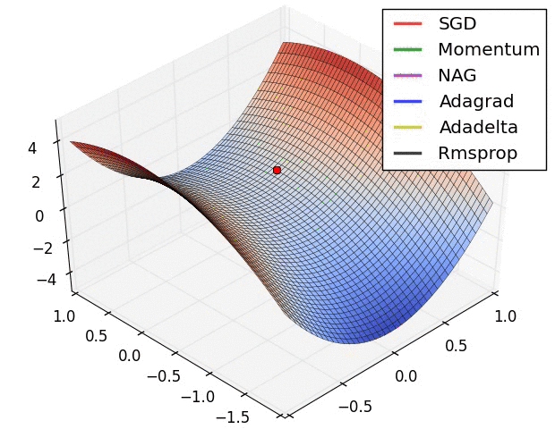

需要指出的是，这些算法并不能完全解决局部最小值问题，而且在同时优化神经网络的架构和权重时用处也不大。为了得到所需的全局优化算法。两种流行的全局优化算法是粒子群优化算法（PSO）和遗传算法（GA）。下面是两者可被用来训练神经网络的方式：

神经网络向量表示—— 通过将神经网络编码为权重向量，每一个向量代表神经网络中一个连接的权重，我们可以使用大部分元启发式（meta-heuristic）搜索算法来训练这种神经网络。因为向量会变得太，这种算法在训练深度神经网络上效果不佳。

下图展示了将神经网络表示为向量并与搜索空间或适应度曲面的概念相联系的方式：

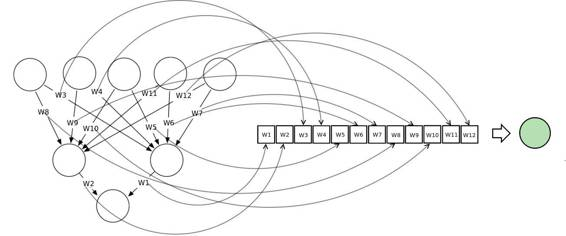 

粒子群优化算法（PSO）——使用 PSO 训练神经网络可以构建一个这些神经网络的群体/集群。每个神经网络都可表示为权重的向量，并根据它在全局最优粒子中的位置和它自身最优的情况来进行调整。

在训练数据集一次前向传播之后，适应度函数将作为重构的神经网络的误差平方和进行计算。这个方法主要考虑的是权重更新的波动性。因为如果权重调整的太快，神经网络的误差平方和的变化将停滞，不会产生学习行为。

下图示出了在单一群体的粒子群优化算法中粒子是如何被其它粒子吸引的。

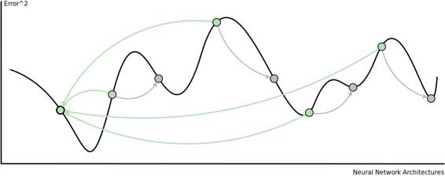 

遗传算法——使用遗传算法训练神经网络，首先构建一个表示神经网络的向量的群体。然后对群体应用三项遗传因子以使其逐步进化成越来越好的神经网络。这三项遗传因子是：

1.选择——使用一次前向传播之后的误差平方和，对神经网络群体进行排序。群体中排名前 x %的神经网络可「生存」至下一轮，被用于杂交。

2.杂交——将排名前 x %的神经网络相互混合。这个过程生成了「子代」。这种情况下，每个后代都代表一个新的神经网络，其权重来自「亲代」神经网络。

3.变异 ——这个过程是为了保持群体的基因多样性。一小部分的群体被选中进行变异。这些神经网络的部分权重将在一个特定范围内随机调整。

下图展示了选择、杂交、变异遗传因子应用至由向量表示的神经网络群体的过程：

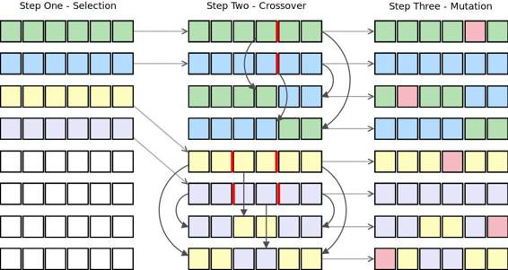 

除了基于群体的元启发式搜索算法，用来训练神经网络的算法还包括加入动量的反向传播、差分进化法、Levenberg Marquardt 算法、模拟退火法等。我个人推荐将局部最优算法和全局最优算法相结合，来克服两者的短处。

**6\. 神经网络并不总是需要大量数据**

神经网络可以使用的三种学习策略，包括监督学习策略、无监督学习策略、增强学习策略。监督学习需要至少两个数据集，其中训练集由输入数据和预期输出数据组成，测试集只包含输入数据。这两个数据集的数据必须有标记，即数据模式是已知的。无监督学习策略一般用在没有标记的数据中以发现隐藏结构（例如隐藏的马尔科夫链）。其行为模式与聚类算法相似。增强学习基于对神经网络好的行为奖赏，对坏的行为惩罚这样一个简单前提。因为无监督学习和增强学习策略不需要带有标记的数据，所以它们可以应用在正确输出结果未知的非规范化问题上。

**无监督学习**

最流行的无监督神经网络架构之一是自组织映射（Self Organizing Map，也称为 Kohonen 映射）。自组织映射本质上是一个多维量度技术，其可在保存该数据集的拓扑结构的同时，构建一个基础数据集 Z 的概率密度分布函数的近似值。这是通过将数据集 Z 中的输入向量 zi 映射到特征映射 V 中的权重向量 vj （神经元）实现的。保存拓扑结构意味着如果两个输入向量在 Z 中是相邻的，那么这些输入向量用 V 所映射神经元也是相邻的。

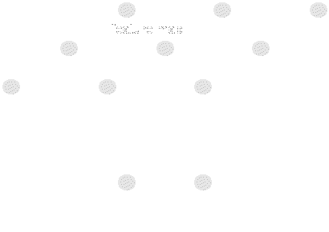 

自组织映射的另一个有趣的应用是对股票交易的时间序列图表进行上色。这是为了显示在某一时间点的市场情况。

**强化学习**

强化学习策略由三个部分组成：一个指定神经网络如何进行决策的规则，例如使用技术分析和基本面分析；一个区分好坏的奖赏功能，例如挣钱 vs. 赔钱；一个指定长期目标的价值函数。在金融市场（和游戏领域）环境中，强化学习策略特别有用，因为神经网络可以学习对特定量化指标进行优化，例如对风险调整收益的合适量度。

下图展示了神经网络可以负面或正面增强。

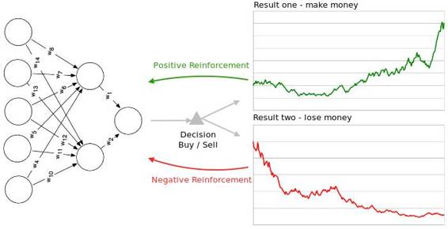

**7\. 神经网络不能基于任何数据训练**

神经网络可能不能工作的一个最大的问题是使用者没有对注入神经网络的数据做适当的预处理。数据标准化、冗余信息消除和异常点移除都应该被用以提高性能良好的神经网络的可能性。

数据标准化——神经网络由多层感知器组成，感知器由经过加权的连接相互连接。每个感知器包含一个拥有特定的「激活范围」的激活函数（ 径向基函数除外）。进到神经网络的输入需要被调整到激活范围内以使神经网络可以区分不同输入模式的差别。

举例来说，给定一个神经网络交易系统，该系统接收证券组合中提示需要售出或买入证券的输入和输出的指示信息。其中一个输入是证券的价格，我们使用 S 型激活函数。然而，大多数证券的成本在每股 5 美元和 15 美元之间，在 S 型激活函数输出值接近 1.0。这样的话，所有证券的 S 型激活函数的输出值都将为 1.0，所有的感知器都会失效，神经网络也无法学习。

通过未处理的数据获得训练的神经网络会产生类似「the lights are on but nobody's home（灯亮着但无人在家）」的模型。

异常点移除——一个异常点是指数据组中远大于或远小于其它数据的值。异常点会因为回归分析和曲线拟合等统计技术而出现问题，因为当该模型试图「容纳」异常值时，模型在所有其它数据上的表现都将下降。

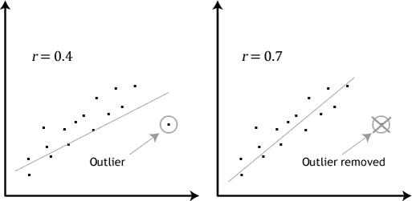 

上图展示了试图将异常值纳入线性回归模型所导致的数据集的糟糕匹配。异常点对包括神经网络在内的线性回归分析模型的影响是相似的。因此将异常点移出训练数据组是非常有必要的。

冗余消除——当两个或更多被注入神经网络的独立变量高度相关时（多元共线性），这将对神经网络的学习能力产生负面影响。高度相关的输入数据也说明了每个变量具有的独特信息是较少的，所以更无关紧要的输入可以被移除。移除冗余变量的另一个好处是更快的训练时间。适应性的神经网络可以用来精简冗余的连接和感知器。

**8\. 神经网络需要被再训练**

假定你可以训练一个在样本中成功买进和卖出的神经网络，这个神经网络也可能会随时间逐渐失效。这并非是神经网络的功能有限的体现，而是金融市场的准确反映。金融市场是复杂的自适应系统，这意味着它们是实时变化的，所以在过去有效的模型在未来可能就可能失效。这种特性被称作非稳态或动态优化问题，神经网络并不很擅长于解决此类问题。

类似于金融市场的动态环境对神经网络而言是非常难以建模处理的。现有两种解决的方式要么是随时间持续再训练神经网络，要么是使用动态神经网络。动态神经网络「跟踪」环境随时间产生的变化并相应地调整它们的架构和权值。它们是自适应变化的。对于动态问题，多重解的启发式优化算法可被用于追踪本地最优解随时间的变化。其中一个这样的算法是多集群优化算法（multi-swarm optimization algorithm），这是粒子群优化算法衍生算法。另外，增强了多样性和内存的基因算法在动态系统中被证明是稳健的。

下图展示了基因算法是如何随时间演化而找到动态系统的最优解的。该图也说明了模仿（从众）交易群( mimic trade crowding)——市场参与者争相选择一个可观的市场交易策略的情景，因此争抢交易机会让交易变得不那么有利可图。

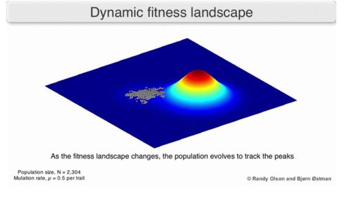 

**9\. 神经网络不是黑箱**

神经网络本身并不是黑箱。这将问题抛给了那些想要使用神经网络工具的人，比如，基金经理不会知道一个神经网络如何做出交易决策，因此也不可能评估这个神经网络学习到的交易策略的风险。类似地，那些使用神经网络为信用风险建模的银行也没法合理说明为什么一位客户有着特殊的信用评级。这是一个监管要求。话虽如此，但最先进的规则提取算法已被开发出来以透明化一些神经网络架构。这些算法从作为数学公式、符号逻辑、模糊逻辑或决策树的神经网络中提取知识。

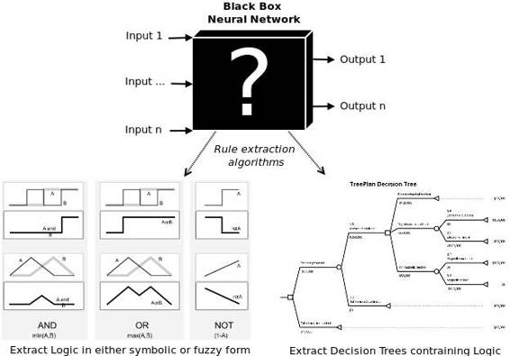 

数学规则——可以从神经网络中提取多重线性回归线的算法已被开发出来。这些技术的问题在于，这些规则往往是很难理解的，因此这些方法还是没有解决黑箱问题。

命题逻辑——命题逻辑是处理在离散值变量上完成的操作的数学逻辑的一个分支。这些变量， 比如 A  或者  B ，通常要么为「真」，要么为「假」；但它们能覆盖一个离散范围里的值，如  {买进，持有，卖出}这样的范围。

逻辑运算可以被应用于那些变量，比如 OR, AND 以及 XOR 。这些结果被称为谓词（predicates），可以用量词量化。这就是谓词和命题逻辑的区别。如果有个简单神经网络，其中，价格（P） , 简单易懂均数 SMA，指数移动均数 EM 作为输入，从命题逻辑神经网络中提取出一个遵从策略的趋势，或许可以得到类似这样的规则：

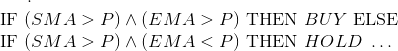 

模糊逻辑—模糊逻辑就是概率与命题逻辑相遇之处。命题逻辑的问题在于那是一种绝对处理。比如，买入或者出售，真或伪，0 或 1。 因此，交易者没有办法确定这些结果的可信度。模糊逻辑克服了这一局限性，因为引入了从属函数（membership function），详细说明了一个变量多大程度上属于某个特定域。比如，一家公司（谷歌）可能属于一个域（买入）的可信度为 0.7， 属于另一个域（出售）的可信度为 0.3。将神经网络与模糊逻辑结合起来，就是神经—模糊系统。这种研究调查讨论了各种模糊规则的提取技术。

决策树——决策树向我们展示了，给定信息后，如何做出决策。决策树推导是一个术语，指的是从神经网络中提取决策树这个过程。

例如，使用决策树来表示一个简单的交易策略。三角型表示决策节点，可以是买入、持有或者出售一家公司。每个长方块表示一个元组 <indicator, inequality,="" value="">。例如 <sma,>, 25> or <ema, <="," 30="">。

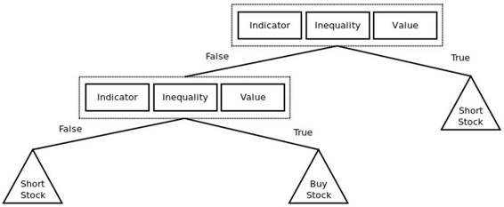 

**10\. 神经网络不难实现**

从经验角度来说，白手起家进行编码，这样搭建神经网络很有挑战性。幸运的是，现在有数以百计的开源和专有包，使得使用神经网络工作起来简单多了。以下就是相关列表，数量分析专家可能会觉得对计量金融有用。

**H20**

H2O 并不只是提供机器学习的算法包，也为使用大数据的智能应用提供了一套处理速度更快，更具可拓展性的机器学习 API 。他们的 API 提供了深度学习模型，通用加速模型和通用线性模型以及更多人工智能模型。

**谷歌 TENSORFLOW**

TensorFlow 是一项用于使用数据流图的数值计算的开源软件库。数据流图中的节点代表数学运算符，图像边缘则代表着在此间流动的多维数据数组(tensors)。这种灵活的架构帮助你在桌面电脑，服务器以及移动设备的 CPU 和 GPU 上部署计算任务，而不需要重写代码以适应各平台。

**微软 DMTK**

DMTK 包括以下项目：DMTK 框架(Mutiverso)——分布式机器学习的参数服务器框架。LightLDA ——可拓展，快速，轻量的大规模主题建模系统。分布式词嵌入：词嵌入的分布式算法。分布式 skipgram 混合物：分布式多感知词嵌入算法。

**微软 Azure 机器学习**

这个基于微软云服务机器学习/预测分析平台，是一个完全托管的云服务系统，可以帮助你轻松地创建，配置和分享预测分析解决方案。该软件允许你拖放预设的组件（包括机器学习模型），用于操作流程中数据组的自定义组件。该流程图之后将被编译为可以配置为互联网服务的程序。它和更早的 SAS 公司的数据挖掘解决方案相似，除了它更现代化，更实用，支持深度学习模型，以及为客户提供 Python 和 R 语言。

**MXNET**

MXNet 是一为兼顾效率和灵活性而设计的深度学习框架。它允许用户混合符号式编程和指令式编程的特点，最大化程序执行效率和你的生产效率。它的核心，是一个自动并行化符号和指令操作符的动态依赖调度器。构建在顶层的图形优化层，使符号运算快速且节省内存。该算法库便携且轻量化，并且适配多种 GPU 和多种机器。

**Neon**

Neon 是 Nervana 的基于深度学习框架的 Python 库，在很多常见的如 AlexNet, VGG 以及 GoogLeNet 深度神经网络取得了最快速的运算表现。我们按照以下功能设计:1)支持常用模型和样例: convnets, MLPs, RNNs, LSTMs, autoencoders。2)和用于 fp16 和 fp32 (benchmarks)的基于 Maxwell 架构的 nervanaGPU 内核密切联合。3)基本的自动微分支持。4)可视化框架。5)可交换的硬件后端...

**Theano**

Theano 是一个允许用户高效地定义、优化和评估包含多维数组的数学表达式的 Python 库。它可以利用 GPU 来完成高效地符号区分。

Theano 和 TensorFlow 及 Torch 一样，得到了比神经网络更加广泛的应用：它是一个整合现存的或利用现成的数据结构以及算法创建的机器学习模型的人工智能框架。

**Torch**

Torch 是一个广泛支持机器学习算法的科学计算框架...其核心特性的摘要包括一个 N 维数组，索引流程，切片，转置，面向 C 的接口，通过 LuaJIT，线性代数流程，神经网络，基于能源的模型，数值加速例程，快速和高效的 GPU 支持，嵌入式，面向 iOS,Andriod 和 FPGA 的端口。

像 Tensorflow 和 Theano，Torch 得到了比神经网络更加广泛的应用：它是一个整合现存的或利用现成的数据结构以及算法创建的机器学习模型的人工智能框架。

**SciKit Learn**

SciKit Learn 是一个用于机器学习的 Python 包，非常受欢迎。基于 NumPy, SciPy, 和 matplotlib 开源，而且用于各种机器学习模型的实施：分类，回归，聚类，降维，模型选择和数据预处理等。

正如上文提及的，现在有数以百计的机器学习包和框架。讨论解决方案之前，我建议做个适当分析，看看哪种开源或者专属机器学习包或者软件最适合你的应用案例。总的说来，在软件工程以及针对计量金融的模型研发中，有一个需要遵循的好规则：不要重复造车轮。已经有了足够先进的模型，就不要再写自己的代码了。

**结  论**

神经网络是一种强大的机器学习算法。建立在可靠的统计基础上，多年来，已被成功用于金融模型以及交易策略。尽管如此，由于许多失败的应用尝试，这些算法的名声依然不好。在绝大多数案例中，我们可以将那些不成功的使用案例归因于不合理的神经网络设计决策以及错误理解了这些网络的运作原理。这篇文章指出了这些误解中的一部分。当你需要了解神经网络以及它们在金融模型和算法交易中的作用时，可以看看这些书。

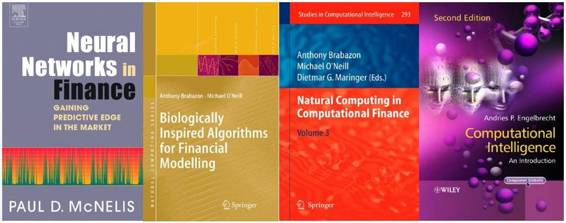 

***©本文由机器之心编译，***转载请联系本公众号获得授权***。***

✄------------------------------------------------

**加入机器之心（全职记者/实习生）：hr@almosthuman.cn**

**投稿或寻求报道：editor@almosthuman.cn**

**广告&商务合作：bd@almosthuman.cn**