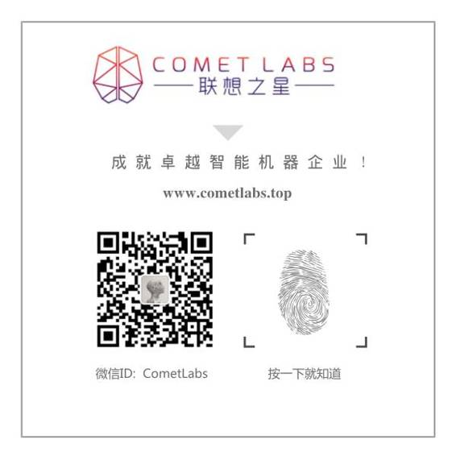

# 深度 | 基于图的机器学习技术：谷歌众多产品和服务背后的智能

选自 Google Research

**作者：Sujith Ravi**

**机器之心编译**

**参与：吴攀**

> *近来机器学习领域实现了很多重大的进展，这些进展让计算机系统具备了解决复杂的真实世界问题的能力。其中之一是谷歌的大规模的、基于图（graph-based）的机器学习平台，该平台由 Google Research 的 Expander 团队打造。*

基于图的机器学习支持着你可能每天都在使用的谷歌产品和功能，这项技术是一种强大的工具，可以被用于驱动 Inbox 的提醒功能和 Allo 的智能回复，或者与深度神经网络联合使用以驱动 Google Photos 最新的图像识别系统。

 

**用最少的监督进行学习**

深度学习以及广义上的机器学习领域内的许多近来的进步都可归功于经过了在有标注的大数据集上的训练之后具有高度预测能力的模型——其训练样本数量往往数以亿计。这常常被称为监督学习（supervised learning），因为它需要监督（以有标注数据的形式）来训练机器学习系统。（相对地，一些机器学习方法则是直接运行在原始数据上，不需要任何监督，这种范式被称为无监督学习（unsupervised learning）。）

但是，任务越困难，获得足够的高质量有标注数据的难度就越大。为每一个新问题都收集足够的有标注数据在人力消耗和时间消耗上都是让人无法接受的。这促使了 Expander 研究团队研发只需最少的监督就能驱动大规模机器学习应用的新技术。

Expander 的技术灵感来自于人类学习归纳和将从未见过的新信息（无标注的信息）与他们已经知道的信息（有标注的信息）联系起来的方式。这被称为半监督学习（semi-supervised learning），这种强大的技术让我们可以打造出能工作在训练数据可能很稀疏的情况下的系统。基于图的半监督机器学习（graph-based semi-supervised machine learning）方法这一进步的关键是：

(a) 利用数据中的底层结构，可以在学习过程中对有标注和无标注数据联合建模；

(b) 可以轻松地将多种类型的信号（如来自知识图谱的关系信息和数据的原始特征）结合成一个单一的图表征（graph representation）并在那些数据上进行学习。

这与神经网络等其它机器学习方法不一样——其它方法通常是首先先使用带有特征的有标注数据训练出一个系统，然后将训练出的系统应用于无标注数据。

**图学习：工作方式**

在 Expander 的平台的核心，它通过构建数据的一个多图表征（multi-graph representation）而将半监督机器学习和大规模的基于图的学习结合到了一起；在这个多图表征中，节点（node）对应于物体或概念，边（edge）则对应于具有相似之处的概念之间的连接。这种图（graph）通常既包含了有标注数据（与已知输出类别和标签关联的节点）和无标注数据（没有被提供标签的节点）。然后 Expander 的框架执行半监督学习以通过在整个图中传播标签信息而联合地给所有的节点进行标注。

但是，说起来比做起来容易！我们必须：

1\. 使用最少的监督（即：极少有标注数据）实现有效的规模化学习；

2\. 运行在多模态数据上（即：异构的表征和各种类型的数据源）；

3\. 解决涉及可能带有噪声的高维数据的高难度预测任务（即：大而复杂的输出空间）。

整个学习过程中的一个主要成分是图和连接的选择。图有各种规模大小和形状，可以从多个数据源结合而成。我们已经观察到从结合了多种数据表征（如：图像像素、物体类别和用于 Allo 中 PhotoReply 的聊天回应信息）的信息的多图（multi-graphs）中学习往往是有利的。Expander 团队的图学习平台可以基于数据元素之间推理出的和已知的关系直接从数据中自动生成图。其数据可以是结构化的（如关系数据），也可以是非结构化的（如从原始数据集提取出的稀疏或稠密的特征表征）。

要理解 Expander 的系统的学习方式，让我们思考一下下面这个例子。

该图中有两种类型的节点：「灰色」代表无标注数据，而其它颜色则代表有标注数据。节点数据之间的关系通过边表示，每条边的厚度代表连接的强度。我们可以将这个简单图的半监督学习问题描述成：预测图中每个节点的颜色（红色或蓝色）。注意：图的结构和颜色的特定选择是根据任务确定的。比如，正如我们在研究论文《Smart Reply: Automated Response Suggestion for Email》中提到的，我们为 Inbox 的 Smart Reply 功能构建的图可将电子邮件信息表示成节点，而颜色则可代表用户回应的语义类别（如，「yes」、「awesome」、「funny」。）

Expander 图学习框架通过将这个标注任务当作是一个优化问题进行处理而解决了这个问题。从最简单的层面上讲，它会为图的每个节点分配一个颜色标签，并根据节点之间的连接强度给相邻的节点分配相似的颜色。解决这个问题的一种天真的方式是尝试一次性为所有节点学习一个标签分配——但这种方法无法扩展到大型的图。相反，我们可以通过将有标注节点的颜色传播到它们的相邻节点，并不断重复这个过程来优化这个问题的形式。在每一步中，都会通过检查一个无标注节点的相邻节点的颜色配置而给其分配一个标签。我们可以以这种方式更新每一个节点的标签，并不断迭代直到整个图都被标注上颜色。在优化这种问题上，这个过程是一种远远更为有效的方法；而且在这个案例中，迭代的序列会收敛成一个特定的解决方案。在图传播的最后的解决方案看起来像是这样的：

 

**在一个图上的半监督学习**

实际上，我们可以使用根据图结构定义的复杂优化函数，其整合了额外的信息和限制，使半监督学习可以应对困难的非凸问题。但是，真正的难题是将其有效地扩展到包含了数十亿个节点和数万亿条边，用于处理涉及到数十亿不同标签类型的复杂任务的图。

为了解决这一难题，我们创造了一种被称为「使用流逼近的大规模分布式半监督学习（Large Scale Distributed Semi-Supervised Learning Using Streaming Approximation）」的方法，该论文发表于去年。它介绍了一种流算法（streaming algorithm），该算法可以以一种分布式的方式处理从相邻节点传播来的信息，这种方式使其能够工作在非常大型的图上。此外，它还能解决其它实际的问题，其中值得注意的是它能够确保系统的空间复杂性或内存需求保持恒定，而且不论任务的难度如何都可以；即：不论预测标签的数量是 2（如上面示意的图）还是 100 万甚至是 10 亿，整个系统所使用的内存量都一样。这能使自然语言处理、机器感知、用户建模和甚至联合多模态学习在涉及文本、图像和视频输入等多模态数据的任务上的广泛应用成为现实。

**用于学习幽默的语言图**

情绪标注（emotion labeling）是基于图的机器学习的一个应用案例，这也是 Inbox 的 Smart Reply 功能的一个语言理解任务，其目标是使用它们经过精细调节的情绪分类标记自然语言文本中出现的词。首先是在文本语料库上应用一个神经网络模型来学习词嵌入（word embeddings），这是每个词的含义的数学向量表示。然后这个稠密的嵌入向量被用于构建一个稀疏的图，其中的节点对应于词，而边对应于词之间的语义关系。边的强度通过嵌入向量之间的相似度计算得到——忽略低相似度的边。我们使用先前已知的几个节点的情绪标签（例如：laugh 被标注为「funny」）作为图的基础，然后在整个图上应用半监督学习来发现剩余词的情绪类别（如：ROTFL（滚地大笑）被标注为「funny」，因为它有与「laugh」的多跳语义连接（multi-hop semantic connection）。

*使用构建于词嵌入向量的图学习情绪关联*

对于涉及大型数据集或稠密表征（可被观察到（如图像的像素）或使用神经网络学习到（如嵌入向量））的应用而言，计算所有物体之间的成对的相似度来构建图中的边是不可行的。Expander 团队通过利用近似的线性时间图构建算法（linear-time graph construction algorithms）解决了这个问题。

**基于图的机器智能在行动**

Expander 团队的机器学习系统现在已经被用在了大型图（包含数十亿节点和数万亿边）上，以识别和理解自然语言、图像、视频和查询中的概念，并支撑着谷歌的许多应用和产品，其中包括：提醒、问答、语言翻译、视觉物体世界、对话理解等等。

随着近期 Allo 的发布，数百万聊天用户现在已经可以体验 Expander 团队的系统所驱动的智能消息技术了，这些技术可以理解和协助多种语言的聊天会话。另外，这项技术不只被用在了云端的大规模模型中——正如上周宣布的那样，Android Wear 已经向开发者开放了设备本地的 Smart Reply 功能，让开发者可以为任何消息应用提供智能回复。我们很期待在未来几年内通过 Expander 解决更多充满挑战性的互联网规模级的问题。

******©本文由机器之心编译，***转载请联系本公众号获得授权******。***

✄------------------------------------------------

**加入机器之心（全职记者/实习生）：hr@almosthuman.cn**

**投稿或寻求报道：editor@almosthuman.cn**

**广告&商务合作：bd@almosthuman.cn**

