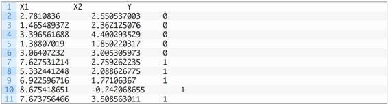
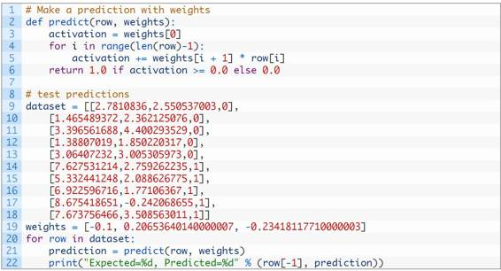

# 基础 | 机器学习入门必备：如何用 Python 从头实现感知器算法

选自 machinelearningmastery

**机器之心编译**

**参与：Terrence L、武竞、Xavier Massa**

> *感知器算法是最简单的人工神经网络形式之一。感知器是一个单神经元的模型，可以用于两个类别的分类问题，也能为以后开发更大的神经网络奠定基础。在本教程中，你将了解到如何利用 Python 从头开始实现感知器算法。*

在完成本教程后，你将学会：

*   如何训练感知器的网络权重

*   如何利用感知器做出预测

*   如何对于现实世界的分类问题实现感知器算法

让我们开始吧。

**概述**

本节简要介绍了感知器算法和 Sonar 数据集，我们将会在后面应用。

**感知器算法**

感知器的灵感来自于被称为神经元的单个神经细胞的信息处理过程。

神经元通过其树突接受输入信号，并将电信号向下传递到细胞体内。

通过类似的方式，感知器从训练数据的样本中接受输入信号，训练数据被加权并在称为激活（activation）的线性方程中进行组合。

 

然后，使用诸如阶跃传递函数（step transfer function）的传递函数将激活变换为输出值或预测。

 

以这种方式，感知器是用于具有两个类（0 和 1）的问题的分类算法，其中可以使用线性方程来分离这两个类。

它与以类似方式进行预测的线性回归和 logistic 回归密切相关（例如输入的加权和）。

感知器算法的权重必须使用随机梯度下降算法从训练数据中估计。

**随机梯度下降**

梯度下降是通过跟随成本函数（cost function）的梯度来最小化函数的过程。

这涉及了解成本的形式以及导数，使得从给定的点你可以知道梯度并且可以在该方向上移动，比如下坡到最小值。

在机器学习中，我们可以使用一种技术来评估和更新称为随机梯度下降的每次迭代的权重，以最小化我们的训练数据模型的误差。

这种优化算法的工作方式是每次向模型显示每个训练实例。模型对训练实例进行预测，计算误差并更新模型以便减少下一预测的误差。

该过程可以用于在模型中找到能使训练数据上模型误差最小的权重集合。

对于感知器算法，每次迭代，权重（w）使用以下等式更新：

 

其中 w 是正在被优化的权重，learning_rate 是必须配置的学习速率（例如 0.01），（expected - predicted）是在归因于权重的训练数据上的模型的预测误差，x 是输入值。

**S****onar 数据集**

我们将在本教程中使用的数据集是 Sonar 数据集。

这是一个描述了声呐啾啾叫声并返回不同服务的试探的数据集。60 个输入变量是在不同角度的返回强度。这是一个二元分类问题，需要一个模型来区分金属圆柱体和岩石。

它是一个很好理解的数据集。所有的变量是连续的，通常在 0 到 1 的范围内。因此，我们不必对输入数据进行归一化，这通常是使用感知器算法的一个好地方。输出变量是字符串「M」（表示矿 mine）和「R」（表示岩石 rock），我们需要将其转换为整数 1 和 0。

通过在数据集（M 或 Mines）中预测具有最多观测值的类，零规则算法（Zero Rule Algorithm）可以实现 53％的精度。

你可以在 UCI Machine Learning repository：

https://archive.ics.uci.edu/ml/datasets/Connectionist+Bench+(Sonar,+Mines+vs.+Rocks)）中了解有关此数据集的更多信息。你也可以免费下载数据集，并将其放在工作目录中，文件名为 sonar.all-data.csv。

**教程**

这个教程分为三个部分：

1.作出预测

2.训练网络权重

3.将 Sonar 数据集建模

这些步骤将带给你实现和应用感知器算法到你自己的分类预测建模问题的基础。

**1\. 作预测**

第一步是开发一个可以进行预测的函数。

这将会需要在随机梯度下降中的候选权重值的评估以及在模型被最终确定之后，我们希望开始对测试数据或新数据进行预测。

下面是一个名为 predict() 的函数，用于预测给定一组权重的行的输出值。

第一个权重始终是偏差，因为它是独立的，不负责特定的输入值。

我们可以设计一个小数据集来测试我们的预测函数。

我们也可以使用之前准备好的权重来为这个数据集做预测。

将所有这些集中起来，我们就可以测试我们的 predict() 函数了，如下：

该函数有两个输入值 X1、X2 和三个权重参数 bias、w1 及 w2。该问题的激活函数有如下的形式：

或者，我们能够手动地选择权重值：

运行这个函数，我们将会得到与期望输出值 (**y**) 相符合的预测值。

现在，我们已经准备好使用随机梯度下降法（SGD）来最优化我们的权重值。

**2\. 训练神经权重**

我们可以使用 SGD，来估计出对于训练集的权重值。

SGD 有两个参数：

*   学习率（Learning Rate）：用来限制每次更新中权重项修正值的大小。

*   迭代次数（Epochs）：在训练集上训练同时更新权重项的次数。

这两个参数，和训练集一起，都将会是预测函数的输入参数。

在这个函数中，我们需要运行三个循环：

1\. 对于每次迭代进行循环；

2\. 对于一次迭代中，训练集的每一行进行循环；

3\. 对于每一行中，每一个值进行循环。

如你所见，我们在每一次迭代中，对训练集每一行中每一个权值都进行更新。

我们基于现有情况模型预测的「误差」，来对权重值进行更新。误差，是由候选权值计算出来的预测值与（数据集中的）期望值的差。

对每一个输入属性，都有一个权重值，并且这些权 _ 重值都连续更新 _。如：

 

偏差项以一种相似的方式更新，不过因为它本身就不与特定的输入值有关，因而在式子中没有输入值的项。

 

现在，我们把所有的内容组合到一起。如下所示，在 train_weights() 函数中，它使用 SGD 方法，计算对于给定训练集的权重值。

 

如你所见，我们也在每次迭代中，记录下了平方误差之和（这始终是一个正值）。因而我们能在外循环的每次迭代中，print 一些有用的信息。

我们也可以在我们上面创建的小规模数据集上，对该函数进行测试。

 

我们将使用 0.1 的学习率和 5 次迭代，也就是把参数在训练集上更新五次，来训练这个模型。

运行这个案例，它将会在每一次迭代结束后，显示出该次迭代后的平方误差和，并在完成所有迭代后，显示最后的权重集。

 

你可以看到，这个算法很快学会了「解决」这个问题。

现在我们来试试看，如何在一个实际的数据集上应用这个算法。

**3\. 对声纳数据集进行建模**

在这一节中，我们将使用 SGD 方法，对一个声纳数据集，训练一个感知器模型。

在该例子中，我们假定，在当前的工作目录下，有一名为**sonar.all-data.csv** 的文件，存储着该数据集。

首先该数据集被载入。数据集中字符串格式的数据被转换为数值型，同时输出值从字符串被转换了 0 或 1 的两个整数值。

通过 **load_csv(), str_column_to_float()及 str_column_to_int()** 三个函数，我们实现了对数据集的读取及预处理。

我们使用「k 倍交叉验证法」（k-fold cross validation）来对学习后的模型在未知数据集上的表现进行评估。也就是说，我们需要建立 k 个模型并估计各模型的平均误差。分类准确性将被用于模型的评估工作中。这些工作在 **cross_validation_split(), accuracy_metric() 及 evaluate_algorithm()** 函数中被完成。

我们将会使用上面设置的 **predict()** 和 **train_weights()**函数来训练该模型。同时，我们将会用一个新函数 **perceptron()** 来将它们组合在一起。如下是完整的例子。

在交叉验证中，我们取 k 为 3——也就是对每一块数据，都有 208/3 约 70 个记录，会在每次迭代中被用于计算。我们取 0.1 的学习率及 500 的训练迭代次数，来训练模型。

你可以尝试你自己的参数，并且看看你的结果能否战胜我的分数。运行这个例子，将会显示对 3 倍交叉验证中每一块的分数，以及平均的分类正确率。

我们可以看到，这个正确率约为 73%，高于由仅考虑主要类的零规则算法（Zero Rule Algorithm）得到的 50% 的正确率基准值。

**拓展**

这一节列举了关于该入门指导的拓展内容，你可以考虑深入探究其中的一些内容。

*   **调试样例参数。**尝试着去调整包括学习率、迭代次数乃至于数据预处理的方法，以使模型在该数据集上，得到更高的分数。

*   **批量化进行随机梯度下降。**修改随机梯度下降的算法，使得我们能记录下每一次迭代的更新值，并且在迭代结束的时候再基于记录的更新值来更新权重值。

*   **额外的分类问题。**将文中提到的技巧，应用于 UCI 机器学习数据集中其他数据。

**回顾**

在该教程中，你学习了如何从零开始，用 Python 实现，基于随机梯度下降的感知器算法。

你学会了：

*   如何对一个二元分类问题进行预测。

*   如何使用随机梯度下降，对一系列的权重值进行最优化。

*   如何将这个技巧，应用到一个实际的分类预测模型。

******©本文由机器之心编译，***转载请联系本公众号获得授权******。***

✄------------------------------------------------

**加入机器之心（全职记者/实习生）：hr@almosthuman.cn**

**投稿或寻求报道：editor@almosthuman.cn**

**广告&商务合作：bd@almosthuman.cn**