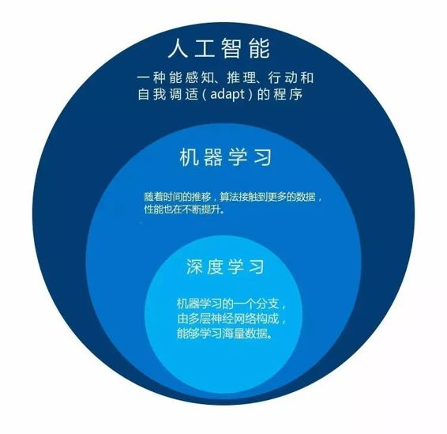
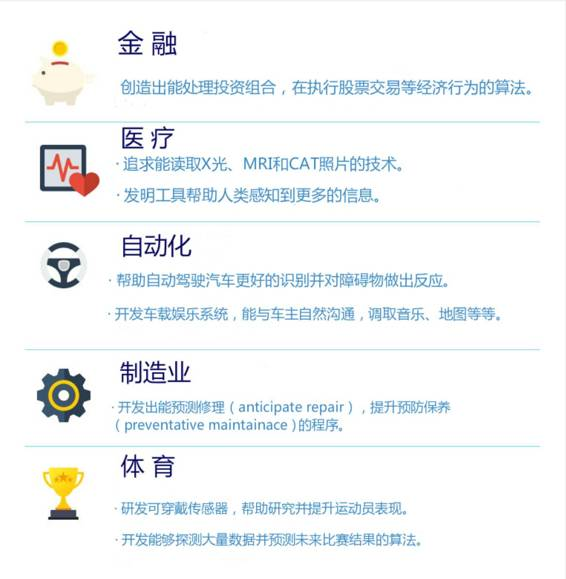
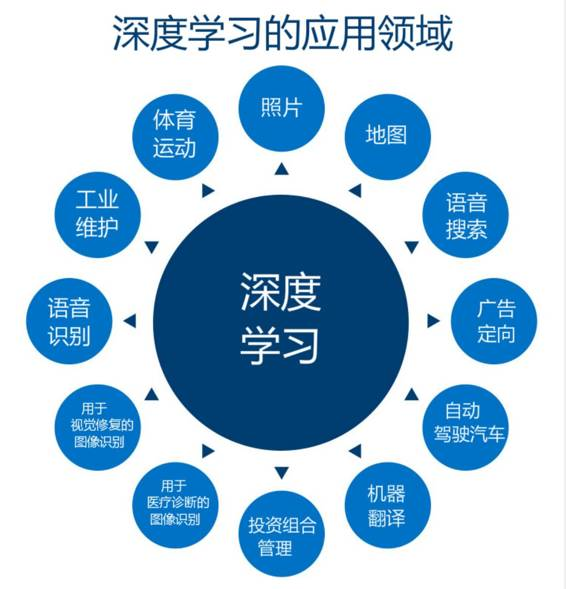

# 业界 | 人工智能开发者的入门指南

选自 Intel

**作者：Niven S**

**机器之心编译**

**参与：杜夏德**

自上世纪 50 年代以来，人类对人工智能前景的想象从未停止过，计算机科学家创造出更加复杂的新技术，也为普通消费者打造出一个令人向往的未来。虽然对人工智能的理解几十年来一直在变化，但我们也有理由相信人工智能时代最终会到来。那么想要成为一名人工智能开发者，怎样才能踏入这一领域呢？

**首先要搞清楚，人工智能到底是什么？**

*   感知——在大量数据中鉴定和识别有意义的物体或概念。比如说前方的物体是红绿灯吗？或者它是肿瘤还是普通的身体组织？

*   推理——理解更大的语境，然后做出计划以达到目标。如果目标是避免碰撞，那么自动驾驶车就必须基于汽车的行为、车距、速度和交通状况计算出撞车的可能性。

*   执行——推荐或者直接启用最佳的行动程序。基于汽车和交通状况分析，它可以做到刹车、加速或者进入安全模式。

*   自我调试（adapt）——最终，我们一定能在每一阶段基于经验来调试算法，让它们越来越智能。自动驾驶算法需要重复训练来识别更多的盲点，将新的变量纳入语境中作为参考因素，并在基于之前的事故来调试行动。

**今天的人工智能达到了什么程度？**

当下，人工智能是一个总称，可以表示任何一种能感知、推理、行动、自我调试（adapt）的程序。开发者可以通过机器学习和深度学习两种方式来实现机器的上述行为。

 

在机器学习中，从数据中学习算法来建立一个模型，并且随着时间的推移接触到的数据越来越多，算法也会不断提升。现在四种主要类型的机器学习：监督学习、无监督式学习、半监督学习和强化学习。在监督学习中，算法学习通过处理和分类大量经过标签的数据来识别数据。在无监督学习中，算法识别的是模式并对大量无标签的数据进行分类，往往比人脑要快得多。你可以阅读这篇文章（（https://software.intel.com/en-us/articles/why-should-you-care-about-machine-learning）(https://software.intel.com/en-us/articles/why-should-you-care-about-machine-learning%EF%BC%89)）了解更多机器学习的知识。

**人工智能的运行：机器学习的工作流程**

上文讨论过，人工智能可以基于经验来感知、推理和行动。但是，它们是怎么做到的呢？下面是机器学习的一般流程。

1\. 数据获取——首先需要大量数据，可以从任意数量的数据源中收集，包括可穿戴设备上的传感器和其他物体、云以及网络。

2\. 数据聚合与策展——数据收集过后，就可以进行聚合和打标签工作（监督学习）。

3\. 模型开发——下一步，用这些数据来开发模型，利用数据训练出到达某种精确度的模型并优化其性能。

4\. 模型部署和评分——模型被部署进应用中，然后基于新的数据进行预测。

**人工智能开发者的机遇**

人工智能最令人激动的地方就是具备变革我们生活触及的每个产业的潜力，不仅仅是计算和软件产业。它会像工业革命、技术革命、数字革命那样改造社会颠覆我们的日常生活。对于开发者来说，人工智能领域的扩张意味着你可以将人工智能的专业知识应用到你感兴趣的领域中。

 

 

******©本文由机器之心编译，***转载请联系本公众号获得授权******。***

✄------------------------------------------------

**加入机器之心（全职记者/实习生）：hr@almosthuman.cn**

**投稿或寻求报道：editor@almosthuman.cn**

**广告&商务合作：bd@almosthuman.cn**

