# 深度 | 从入门到精通：卷积神经网络初学者指南（附论文）

选自 Github.io

**作者：Adit Deshpande**

**机器之心编译**

**参与：牛春雨、Quantum、原野、吴攀、李亚洲**

> *这是一篇向初学者讲解卷积神经网络的系列文章，机器之心编译了已经发表了的 Part 1 和 Part 2，并下载了作者在文章中推荐的多篇论文，读者可点击阅读原文进行下载。此系列文章若有更新，机器之心依然会分享给大家。*

**Part 1：图像识别任务**

**介绍**

卷积神经网络，听起来像是计算机科学、生物学和数学的诡异组合，但它们已经成为计算机视觉领域中最具影响力的革新的一部分。神经网络在 2012 年崭露头角，Alex Krizhevsky 凭借它们赢得了那一年的 ImageNet 挑战赛（大体上相当于计算机视觉的年度奥林匹克），他把分类误差记录从 26% 降到了 15%，在当时震惊了世界。自那之后，大量公司开始将深度学习用作服务的核心。Facebook 将神经网络用于自动标注算法、谷歌将它用于图片搜索、亚马逊将它用于商品推荐、Pinterest 将它用于个性化主页推送、Instagram 将它用于搜索架构。

 

然而，应用这些网络最经典最流行的案例是进行图像处理。在图像处理任务中，让我们看一下如何使用卷积神经网络进行图像分类。

**问题空间**

图像分类是对输入图像的操作，最终输出一组最好地描述了图像内容的分类（如猫、狗等）或分类的概率。对人类来说，识别是打出生便开始学习的技能之一，对成人来说更是信手拈来，毫不费力。我们只需一眼便能快速识别我们所处的环境以及环绕在我们身边的物体。当我们看到一张图片或是环看四周的时候，无需刻意观察，多数时候也能立即描述出场景特征并标记出每一个对象。快速识别不同模式、根据早前知识进行归纳、以及适应不同的图像环境一直都是人类的专属技能，机器尚未享有。

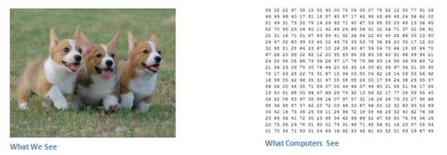 

**输入与输出**

当计算机看到一张图像（输入一张图像）时，它看的是一大堆像素值。根据图片的分辨率和尺寸，它将看到一个 32 x 32 x 3 的数组（3 指代的是 RGB 值）。为了讲清楚这一点，假设我们有一张 JPG 格式的 480 x 480 大小的彩色图片，那么它对应的数组就有 480 x 480 x 3 个元素。其中每个数字的值从 0 到 255 不等，其描述了对应那一点的像素灰度。当我们人类对图像进行分类时，这些数字毫无用处，可它们却是计算机可获得的唯一输入。其中的思想是：当你提供给计算机这一数组后，它将输出描述该图像属于某一特定分类的概率的数字（比如：80% 是猫、15% 是狗、5% 是鸟）。

**我们想要计算机做什么**

现在我们知道了问题所在以及输入与输出，就该考虑如何处理了。我们想要计算机能够区分开所有提供给它的图片，以及搞清楚猫猫狗狗各自的特有特征。这也是我们人类的大脑中不自觉进行着的过程。当我们看到一幅狗的图片时，如果有诸如爪子或四条腿之类的明显特征，我们便能将它归类为狗。同样地，计算机也可以通过寻找诸如边缘和曲线之类的低级特点来分类图片，继而通过一系列卷积层级建构出更为抽象的概念。这是 CNN（卷积神经网络）工作方式的大体概述，下面是具体细节。

**生物学连接**

首先介绍些背景。当你第一次听到卷积神经网络这一术语，可能会联想到神经科学或生物学，那就对了。可以这样说。CNN 的确是从视觉皮层的生物学上获得启发的。视觉皮层有小部分细胞对特定部分的视觉区域敏感。Hubel 和 Wiesel 于 1962 年进行的一项有趣的试验详细说明了这一观点，他们验证出大脑中的一些个体神经细胞只有在特定方向的边缘存在时才能做出反应（即放电）。例如，一些神经元只对垂直边缘兴奋，另一些对水平或对角边缘兴奋。Hubel 和 Wisesl 发现所有这些神经元都以柱状结构的形式进行排列，而且一起工作才能产生视觉感知。这种一个系统中的特定组件有特定任务的观点（视觉皮层的神经元细胞寻找特定特征）在机器中同样适用，这就是 CNN 的基础。

**结构**

回到细节上来。更为详细的 CNN 工作概述指的是你挑一张图像，让它历经一系列卷积层、非线性层、池化（下采样（downsampling））层和完全连接层，最终得到输出。正如之前所说，输出可以是最好地描述了图像内容的一个单独分类或一组分类的概率。如今，难点在于理解其中每一层的工作方法。我们先来看最重要的部分。

**第一层——数学部分**

CNN 的第一层通常是卷积层（Convolutional Layer）。首先需要了解卷积层的输入内容是什么。如上所述，输入内容为一个 32 x 32 x 3 的像素值数组。现在，解释卷积层的最佳方法是想象有一束手电筒光正从图像的左上角照过。假设手电筒光可以覆盖 5 x 5 的区域，想象一下手电筒光照过输入图像的所有区域。在机器学习术语中，这束手电筒被叫做过滤器（filter，有时候也被称为神经元（neuron）或核（kernel）），被照过的区域被称为感受野（receptive field）。过滤器同样也是一个数组（其中的数字被称作权重或参数）。重点在于过滤器的深度必须与输入内容的深度相同（这样才能确保可以进行数学运算），因此过滤器大小为 5 x 5 x 3。现在，以过滤器所处在的第一个位置为例，即图像的左上角。当筛选值在图像上滑动（卷积运算）时，过滤器中的值会与图像中的原始像素值相乘（又称为计算点积）。这些乘积被加在一起（从数学上来说，一共会有 75 个乘积）。现在你得到了一个数字。切记，该数字只是表示过滤器位于图片左上角的情况。我们在输入内容上的每一位置重复该过程。（下一步将是将过滤器右移 1 单元，接着再右移 1 单元，以此类推。）输入内容上的每一特定位置都会产生一个数字。过滤器滑过所有位置后将得到一个 28 x 28 x 1 的数组，我们称之为激活映射（activation map）或特征映射（feature map）。之所以得到一个 28 x 28 的数组的原因在于，在一张 32 x 32 的输入图像上，5 x 5 的过滤器能够覆盖到 784 个不同的位置。这 784 个位置可映射为一个 28 x 28 的数组。

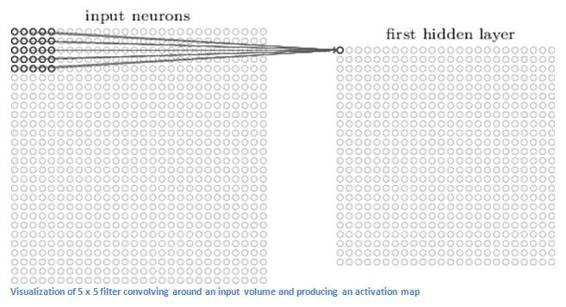

（注意：包括上图在内的一些图片来自于 Micheal Nielsen 的 「神经网络与深度学习（ Neural Networks and Deep Learning）」一书。我强烈推荐这本书。这本书可免费在线浏览：http://neuralnetworksanddeeplearning.com/）

当我们使用两个而不是一个 5 x 5 x 3 的过滤器时，输出总量将会变成  28 x 28 x 2。采用的过滤器越多，空间维度（ spatial dimensions）保留得也就越好。数学上而言，这就是卷积层上发生的事情。

**第一层——高层次角度**

不过，从高层次角度而言卷积是如何工作的？每个过滤器可以被看成是特征标识符（ feature identifiers）。这里的特征指的是例如直边缘、原色、曲线之类的东西。想一想所有图像都共有的一些最简单的特征。假设第一组过滤器是 7 x 7 x 3 的曲线检测器。（在这一节，为了易于分析，暂且忽略该过滤器的深度为 3 个单元，只考虑过滤器和图像的顶层层面。）作为曲线过滤器，它将有一个像素结构，在曲线形状旁时会产生更高的数值（切记，我们所讨论的过滤器不过是一组数值！）

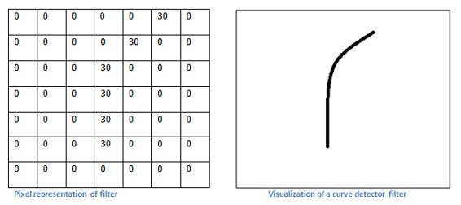 

*左图：过滤器的像素表示；右图：曲线检测器过滤器的可视化；对比两图可以看到数值和形状的对应*

回到数学角度来看这一过程。当我们将过滤器置于输入内容的左上角时，它将计算过滤器和这一区域像素值之间的点积。拿一张需要分类的照片为例，将过滤器放在它的左上角。

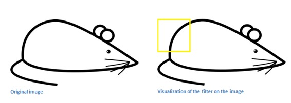 

*左图：原始图像；右图：图像上过滤器的可视化*

切记，我们要做的是将过滤器与图像的原始像素值相乘。

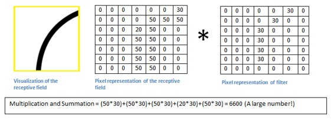 

*左图：感受野的可视化；右图：感受野的像素表示 * 过滤器的像素表示*

简单来说，如果输入图像上某个形状看起来很像过滤器表示的曲线，那么所有点积加在一起将会得出一个很大的值！让我们看看移动过滤器时会发生什么。

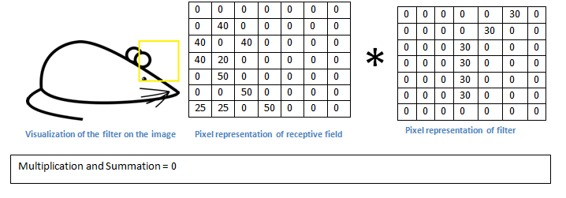 

这个值小了很多！这是因为图像的这一部分和曲线检测器过滤器不存在对应。记住，这个卷积层的输出是一个激活映射（activation map）。因此，在这个带有一个过滤器卷积的例子里（当筛选值为曲线检测器），激活映射将会显示出图像里最像曲线的区域。在该例子中，28 x 28 x 1 的激活映射的左上角的值为 6600。高数值意味着很有可能是输入内容中的曲线激活了过滤器。激活地图右上角的值将会是 0，因为输入内容中没有任何东西能激活过滤器（更简单地说，原始图片中的这一区域没有任何曲线）。这仅仅是一组检测右弯曲线的过滤器。还有其它检测左弯曲线或直线边缘的过滤器。过滤器越多，激活映射的深度越大，我们对输入内容的了解也就越多。

声明：我在本小节中描绘的过滤器（filter）只是为了描述卷积中的数学过程。在下图中你可以看到训练后的网络中第一个卷积层的过滤器的实际可视化。尽管如此，主要观点仍旧不变。当在输入内容中寻找特定特征时，第一层上的过滤器在输入图像上进行卷积运算和「激活」（即计算高数值）。

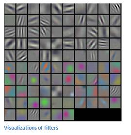

上图来自于斯坦福大学由 Andrej Karpathy 和 Justin Johnson 授课的 CS 231N 课程，推荐给渴望更深层理解 CNN 的人们：http://cs231n.stanford.edu/

**网络中的更深处**

在传统卷积神经网络架构中，卷积层之间还有其它类型的层。我强烈建议有兴趣的人阅读和它们有关的材料，并理解相应的功能和作用；但总的来说，它们提供的非线性和维度保留有助于提高网络的稳健性（robustness）并控制过拟合。一个典型的 CNN 结构看起来是这样的：

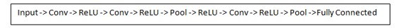 

*输入→卷积→ReLU→卷积→ReLU→池化→ReLU→卷积→ReLU→池化→全连接*

我们稍后再来讨论关键的最后一层，先回顾一下学到了哪些。我们讨论了过滤器是如何在第一个卷积层检测特征的。它们检测边缘和曲线一类的低级特征。正如想象的那样，为了预测出图片内容的分类，网络需要识别更高级的特征，例如手、爪子与耳朵的区别。第一个卷积层的输出将会是一个 28 x 28 x 3 的数组（假设我们采用三个 5 x 5 x 3 的过滤器）。当我们进入另一卷积层时，第一个卷积层的输出便是第二个卷积层的输入。解释这一点有些困难。第一层的输入是原始图像，而第二卷积层的输入正是第一层输出的激活映射。也就是说，这一层的输入大体描绘了低级特征在原始图片中的位置。在此基础上再采用一组过滤器（让它通过第 2 个卷积层），输出将是表示了更高级的特征的激活映射。这类特征可以是半圆（曲线和直线的组合）或四边形（几条直线的组合）。随着进入网络越深和经过更多卷积层后，你将得到更为复杂特征的激活映射。在网络的最后，可能会有一些过滤器会在看到手写笔迹或粉红物体等时激活。如果你想知道更多关于可视化卷积网络中过滤器的内容，可以查看 Matt Zeiler 和 Rob Fergus 的一篇讨论该问题的颇为杰出的研究论文。在 YouTube 上，Jason Yosinski 有一段视频十分视觉化地呈现了这一过程（如下）。有趣的是，越深入网络，过滤器的感受野越大，意味着它们能够处理更大范围的原始输入内容（或者说它们可以对更大区域的像素空间产生反应）。

**完全连接层**

检测高级特征之后，网络最后的完全连接层就更是锦上添花了。简单地说，这一层处理输入内容（该输入可能是卷积层、ReLU 层或是池化层的输出）后会输出一个 N 维向量，N 是该程序必须选择的分类数量。例如，如果你想得到一个数字分类程序，如果有 10  个数字，N 就等于 10。这个 N 维向量中的每一数字都代表某一特定类别的概率。例如，如果某一数字分类程序的结果矢量是 [0 .1 .1 .75 0 0 0 0 0 .05]，则代表该图片有 10% 的概率是 1、10% 的概率是 2、75% 的概率是 3、还有 5% 的概率是 9（注：还有其他表现输出的方式，这里只展示了 softmax 的方法）。完全连接层观察上一层的输出（其表示了更高级特征的激活映射）并确定这些特征与哪一分类最为吻合。例如，如果该程序预测某一图像的内容为狗，那么激活映射中的高数值便会代表一些爪子或四条腿之类的高级特征。同样地，如果程序测定某一图片的内容为鸟，激活映射中的高数值便会代表诸如翅膀或鸟喙之类的高级特征。大体上来说，完全连接层观察高级特征和哪一分类最为吻合和拥有怎样的特定权重，因此当计算出权重与先前层之间的点积后，你将得到不同分类的正确概率。

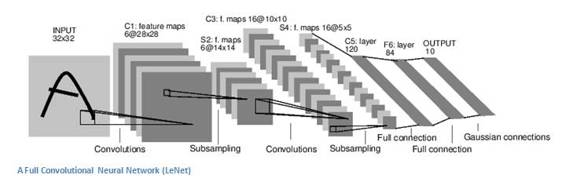 

一种全卷积神经网络（LeNet），从左至右依次为卷积→子采样→卷积→子采样→全连接→全连接→高斯连接

**训练（也就是：什么能让其有效）**

下面是神经网络中的一个我尚未提及但却最为重要的部分。阅读过程中你可能会提出许多问题。第一卷积层中的滤波器是如何知道寻找边缘与曲线的？完全连接层怎么知道观察哪些激活图？每一层级的滤波器如何知道需要哪些值？计算机通过一个名为反向传播的训练过程来调整过滤器值（或权重）。

在探讨反向传播之前，我们首先必须回顾一下神经网络工作起来需要什么。在我们刚出生的时候，大脑一无所知。我们不晓得猫啊狗啊鸟啊都是些什么东西。与之类似的是 CNN 刚开始的时候，权重或过滤器值都是随机的。滤波器不知道要去寻找边缘和曲线。更高层的过滤器值也不知道要去寻找爪子和鸟喙。不过随着年岁的增长，父母和老师向我们介绍各式各样的图片并且一一作出标记。CNN 经历的便是一个介绍图片与分类标记的训练过程。在深入探讨之前，先设定一个训练集，在这里有上千张狗、猫、鸟的图片，每一张都依照内容被标记。下面回到反向传播的问题上来。

反向传播可分为四部分，分别是前向传导、损失函数、后向传导，以及权重更新。在前向传导中，选择一张 32×32×3 的数组训练图像并让它通过整个网络。在第一个训练样例上，由于所有的权重或者过滤器值都是随机初始化的，输出可能会是 [.1 .1 .1 .1 .1 .1 .1 .1 .1 .1]，即一个不偏向任何数字的输出。一个有着这样权重的网络无法寻找低级特征，或者说是不能做出任何合理的分类。接下来是反向传播的损失函数部分。切记我们现在使用的是既有图像又有标记的训练数据。假设输入的第一张训练图片为 3，标签将会是 [0 0 0 1 0 0 0 0 0 0]。损失函数有许多种定义方法，常见的一种是 MSE （均方误差）。

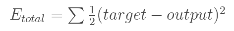 

假设变量 L 等同该数值。正如所料，前两张训练图片的损失将会极高。现在，我们直观地想一下。我们想要预测标记（卷积网络的输出）与训练标记相同（意味着网络预测正确）。为了做到这一点，我们想要将损失数量最小化。将其视为微积分优化问题的话，也就是说我们想要找出是哪部分输入（例子中的权重）直接导致了网络的损失（或错误）。

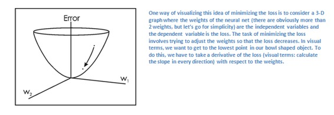 

这是一个 dL/dW 的数学等式，W 是特定层级的权重。我们接下来要做的是在网络中进行后向传导，测定出是哪部分权重导致了最大的损失，寻找调整方法并减少损失。一旦计算出该导数，将进行最后一步也就是权重更新。所有的过滤器的权重将会更新，以便它们顺着梯度方向改变。

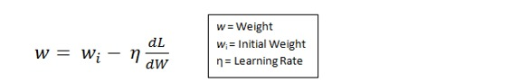 

学习速率是一个由程序员决定的参数。高学习速率意味着权重更新的动作更大，因此可能该模式将花费更少的时间收敛到最优权重。然而，学习速率过高会导致跳动过大，不够准确以致于达不到最优点。

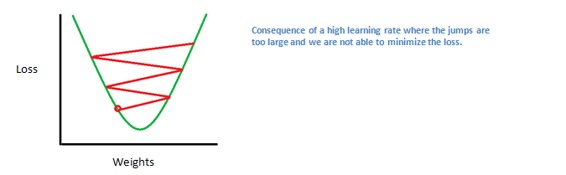 

总的来说，前向传导、损失函数、后向传导、以及参数更新被称为一个学习周期。对每一训练图片，程序将重复固定数目的周期过程。一旦完成了最后训练样本上的参数更新，网络有望得到足够好的训练，以便层级中的权重得到正确调整。

**测试**

最后，为了检验 CNN 能否工作，我们准备不同的另一组图片与标记集（不能在训练和测试中使用相同的！）并让它们通过这个 CNN。我们将输出与实际情况（ground truth ）相比较，看看网络是否有效！

**企业如何使用 CNN**

数据、数据、数据。数据越多的企业在竞争中越发彰显优势。你提供给网络的训练数据越多，你能进行的训练迭代也越多，紧接着权重更新也多，那么当用于产品时调整出的网络自然就好。Facebook （和 Instagram）可以使用它如今拥有的十几亿用户的图片，Pinterest 可以使用它站点上 500 亿花瓣的信息，谷歌可以使用搜索数据，亚马逊可以使用每天销售的数以百万计的商品数据。而你现在也知道它们使用数据背后的神奇之处了。

**Part 2：卷积神经网络中的部分问题**

**引言**

在这篇文章中，我们将更深入地介绍有关卷积神经网络（ConvNet）的详细情况。声明：我确实知道本文中一部分内容相当复杂，可以用一整篇文章进行介绍。但为了在保持全面性的同时保证简洁，我会在文章中相关位置提供一些更详细解释该相关主题的论文链接。

**步幅和填充**

好了，现在来看一下我们的卷积神经网络。还记得过滤器、感受野和卷积吗？很好。现在，要改变每一层的行为，有两个主要参数是我们可以调整的。选择了过滤器的尺寸以后，我们还需要选择步幅（stride）和填充（padding）。

步幅控制着过滤器围绕输入内容进行卷积计算的方式。在第一部分我们举的例子中，过滤器通过每次移动一个单元的方式对输入内容进行卷积。过滤器移动的距离就是步幅。在那个例子中，步幅被默认设置为 1。步幅的设置通常要确保输出内容是一个整数而非分数。让我们看一个例子。想象一个 7 x 7 的输入图像，一个 3 x 3 过滤器（简单起见不考虑第三个维度），步幅为 1。这是一种惯常的情况。

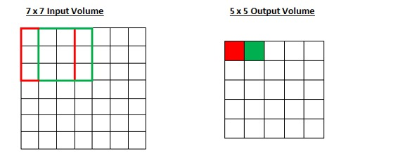

还是老一套，对吧？看你能不能试着猜出如果步幅增加到 2，输出内容会怎么样。

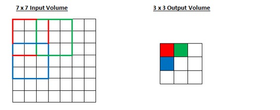

所以，正如你能想到的，感受野移动了两个单元，输出内容同样也会减小。注意，如果试图把我们的步幅设置成 3，那我们就会难以调节间距并确保感受野与输入图像匹配。正常情况下，程序员如果想让接受域重叠得更少并且想要更小的空间维度（spatial dimensions）时，他们会增加步幅。

现在让我们看一下填充（padding）。在此之前，想象一个场景：当你把 5 x 5 x 3 的过滤器用在 32 x 32 x 3 的输入上时，会发生什么？输出的大小会是 28 x 28 x 3。注意，这里空间维度减小了。如果我们继续用卷积层，尺寸减小的速度就会超过我们的期望。在网络的早期层中，我们想要尽可能多地保留原始输入内容的信息，这样我们就能提取出那些低层的特征。比如说我们想要应用同样的卷积层，但又想让输出量维持为 32 x 32 x 3 。为做到这点，我们可以对这个层应用大小为 2 的零填充（zero padding）。零填充在输入内容的边界周围补充零。如果我们用两个零填充，就会得到一个 36 x 36 x 3 的输入卷。

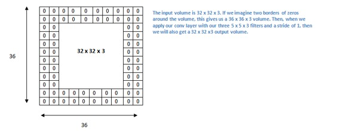 

*如果我们在输入内容的周围应用两次零填充，那么输入量就为 32×32×3。然后，当我们应用带有 3 个 5×5×3 的过滤器，以 1 的步幅进行处理时，我们也可以得到一个 32×32×3 的输出*

如果你的步幅为 1，而且把零填充设置为

K 是过滤器尺寸，那么输入和输出内容就总能保持一致的空间维度。

计算任意给定卷积层的输出的大小的公式是

 

其中 O 是输出尺寸，K 是过滤器尺寸，P 是填充，S 是步幅。

**选择超参数**

我们怎么知道要用多少层、多少卷积层、过滤器尺寸是多少、以及步幅和填充值多大呢？这些问题很重要，但又没有一个所有研究人员都在使用的固定标准。这是因为神经网络很大程度上取决于你的数据类型。图像的大小、复杂度、图像处理任务的类型以及其他更多特征的不同都会造成数据的不同。对于你的数据集，想出如何选择超参数的一个方法是找到能创造出图像在合适尺度上抽象的正确组合。

**ReLU（修正线性单元）层**

在每个卷积层之后，通常会立即应用一个非线性层（或激活层）。其目的是给一个在卷积层中刚经过线性计算操作（只是数组元素依次（element wise）相乘与求和）的系统引入非线性特征。过去，人们用的是像双曲正切和 S 型函数这样的非线性方程，但研究者发现 ReLU 层效果好得多，因为神经网络能够在准确度不发生明显改变的情况下把训练速度提高很多（由于计算效率增加）。它同样能帮助减轻梯度消失的问题——由于梯度以指数方式在层中消失，导致网络较底层的训练速度非常慢。ReLU 层对输入内容的所有值都应用了函数 f(x) = max(0, x)。用基本术语来说，这一层把所有的负激活（negative activation）都变为零。这一层会增加模型乃至整个神经网络的非线性特征，而且不会影响卷积层的感受野。

*   参见 Geoffrey Hinton（即深度学习之父）的论文：Rectified Linear Units Improve Restricted Boltzmann Machines

**池化层**

在几个 ReLU 层之后，程序员也许会选择用一个池化层（pooling layer）。它同时也被叫做下采样（downsampling）层。在这个类别中，也有几种可供选择的层，最受欢迎的就是最大池化（ max-pooling）。它基本上采用了一个过滤器（通常是 2x2 的）和一个同样长度的步幅。然后把它应用到输入内容上，输出过滤器卷积计算的每个子区域中的最大数字。

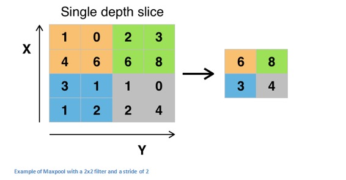 

*带有 2×2 和过滤器的且步幅为 2 的最大池化的例子*

池化层还有其他选择，比如平均池化（average pooling）和 L2-norm 池化 。这一层背后的直观推理是：一旦我们知道了原始输入（这里会有一个高激活值）中一个特定的特征，它与其它特征的相对位置就比它的绝对位置更重要。可想而知，这一层大幅减小了输入卷的空间维度（长度和宽度改变了，但深度没变）。这到达了两个主要目的。第一个是权重参数的数目减少到了 75%，因此降低了计算成本。第二是它可以控制过拟合（overfitting）。这个术语是指一个模型与训练样本太过匹配了，以至于用于验证和检测组时无法产生出好的结果。出现过拟合的表现是一个模型在训练集能达到 100% 或 99% 的准确度，而在测试数据上却只有 50%。

**Dropout 层**

如今，Dropout 层在神经网络有了非常明确的功能。上一节，我们讨论了经过训练后的过拟合问题：训练之后，神经网络的权重与训练样本太过匹配以至于在处理新样本的时候表现平平。Dropout 的概念在本质上非常简单。Dropout 层将「丢弃（drop out）」该层中一个随机的激活参数集，即在前向通过（forward pass）中将这些激活参数集设置为 0。简单如斯。既然如此，这些简单而且似乎不必要且有些反常的过程的好处是什么？在某种程度上，这种机制强制网络变得更加冗余。这里的意思是：该网络将能够为特定的样本提供合适的分类或输出，即使一些激活参数被丢弃。此机制将保证神经网络不会对训练样本「过于匹配」，这将帮助缓解过拟合问题。另外，Dropout 层只能在训练中使用，而不能用于测试过程，这是很重要的一点。

*   参考 Geoffrey Hinton 的论文：Dropout: A Simple Way to Prevent Neural Networks from Overfitting

**网络层中的网络**

网络层中的网络指的是一个使用了 1 x 1 尺寸的过滤器的卷积层。现在，匆匆一瞥，你或许会好奇为何这种感受野大于它们所映射空间的网络层竟然会有帮助。然而，我们必须谨记 1x1 的卷积层跨越了特定深度，所以我们可以设想一个 1 x 1 x N 的卷积层，此处 N 代表该层应用的过滤器数量。该层有效地使用 N 维数组元素依次相乘的乘法，此时 N 代表的是该层的输入的深度。

*   参阅 Min Lin 的论文：Network In Network

**分类、定位、检测、分割**

本系列第一部分使用的案例中，我们观察了图像分类任务。这个过程是：获取输入图片，输出一套分类的类数（class number)。然而当我们执行类似目标定位的任务时，我们要做的不只是生成一个类标签,而是生成一个描述图片中物体 suo 所在位置的边界框。

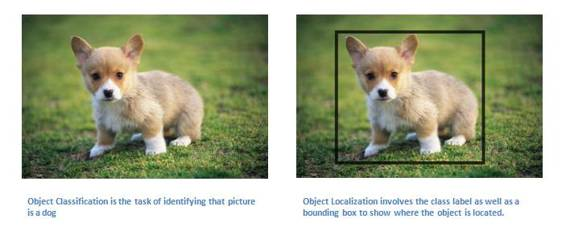

我们也有目标检测的任务，这需要图片上所有目标的定位任务都已完成。

因此，你将获得多个边界框和多个类标签。

最终，我们将执行目标分割的任务：我们需要输出类标签的同时输出图片中每个目标的轮廓。

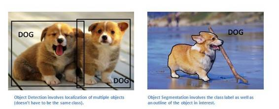 

关于目标检测、定位、分割的论文有很多，这里就不一一列出了。

**迁移学习**

如今，深度学习领域一个常见的误解在于没有谷歌那样的巨量数据，你将没有希望创建一个有效的深度学习模型。尽管数据是创建网络中至关重要的部分，迁移学习的思路将帮助我们降低数据需求。迁移学习指的是利用预训练模型（神经网络的权重和参数都已经被其他人利用更大规模的数据集训练好了）并用自己的数据集将模型「微调」的过程。这种思路中预训练模型扮演着特征提取器的角色。你将移除网络的最后一层并用你自有的分类器置换（取决于你的问题空间）。然后冻结其他所有层的权重并正常训练该网络（冻结这些层意味着在梯度下降/最优化过程中保持权值不变）。

让我们探讨一下为什么做这项工作。比如说我们正在讨论的这个预训练模型是在 ImageNet （一个包含一千多个分类，一千四百万张图像的数据集）上训练的 。当我们思考神经网络的较低层时，我们知道它们将检测类似曲线和边缘这样的特征。现在，除非你有一个极为独特的问题空间和数据集，你的神经网络也会检测曲线和边缘这些特征。相比通过随机初始化权重训练整个网络，我们可以利用预训练模型的权重（并冻结）聚焦于更重要的层（更高层）进行训练。如果你的数据集不同于 ImageNet 这样的数据集，你必须训练更多的层级而只冻结一些低层的网络。

*   Yoshua Bengio （另外一个深度学习先驱 ）论文：How transferable are features in deep neural networks?

*   Ali Sharif Razavian 论文：CNN Features off-the-shelf: an Astounding Baseline for Recognition 

*   Jeff Donahue 论文：DeCAF: A Deep Convolutional Activation Feature for Generic Visual Recognition 

**数据增强技术**

现在我们对卷积网络中数据的重要性可能已经感到有些麻木了，所以我们来谈下如何利用一些简单的转换方法将你现有的数据集变得更大。正如我们之前所提及的，当计算机将图片当作输入时，它将用一个包含一列像素值的数组描述（这幅图）。若是图片左移一个像素。对你和我来说，这种变化是微不可察的。然而对计算机而已，这种变化非常显著：这幅图的类别和标签保持不变，数组却变化了。这种改变训练数据的数组表征而保持标签不变的方法被称作数据增强技术。这是一种人工扩展数据集的方法。人们经常使用的增强方法包括灰度变化、水平翻转、垂直翻转、随机编组、色值跳变、翻译、旋转等其他多种方法。通过利用这些训练数据的转换方法，你将获得两倍甚至三倍于原数据的训练样本。

***©本文由机器之心编译，***转载请联系本公众号获得授权***。***

✄------------------------------------------------

**加入机器之心（全职记者/实习生）：hr@almosthuman.cn**

**投稿或寻求报道：editor@almosthuman.cn**

**广告&商务合作：bd@almosthuman.cn**