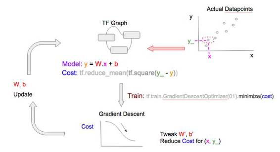

# 深度 | 机器学习敲门砖：任何人都能看懂的 TensorFlow 介绍

选自 kdnuggets

**作者：Soon Hin Khor**

**机器之心编译**

**参与：Rick、吴攀、李亚洲**

> *本文是日本东京 TensorFlow 聚会联合组织者 Hin Khor 所写的 TensorFlow 系列介绍文章的前两部分，自称给出了关于 TensorFlow 的 gentlest 的介绍。这两部分谈到单一特征问题的线性回归问题以及训练（training）的含义，机器之心将继续关注本系列文章的后续更新。*

**第一部分**

**引言**

我们要解决的是一个过于简单且不现实的问题，但其好的一面是便于我们了解机器学习和 TensorFlow 的概念。我们要预测一个基于单一特征（房间面积/平方米）的单标量输出（房价/美元）。这样做消除了处理多维数据的需要，使我们能够在 TensorFlow 中只专注于确定、实现以及训练模型。

**机器学习简介**

我们从一组收集到的数据点开始（见下图），每个数据点代表两个值之间的关系——输出（房价）与影响因素（房子面积）。

 

然而我们无法预测没有数据点的特征的值（见下图）。

我们可以使用机器学习来挖掘它们之间的关系（见下图的「最佳拟合预测曲线」），即给定一个不属于数据点的特征值，我们可以准确地预测出输出（特征值和预测线的交点）。

**步骤一：选择一个模型**

**1.模型种类**

为了使用机器学习来做预测，我们需要选择一个能够拟合收集到的数据的最佳模型。

我们可以选择一个线性（直线）模型，并通过改变其陡度/梯度和位置对其进行调整，从而匹配数据点。

 

我们也可以选择一个指数（曲线）模型，并通过改变其曲率（curvature）和位置对其进行调整，从而匹配同一数据点集。

 

**2.成本函数**

为了比较哪个模型拟合得更严密，数学上我们将最佳拟合定义为一个需要被最小化的成本函数。 成本函数的一个简单样例是每个数据点所代表的实际输出与预测输出之间偏差的绝对值总和（实际结果到最佳拟合曲线的垂直投影）。用图表表示，成本函数被描述为下表中蓝色线段的长度和。

 

注意：更准确地说，成本函数往往是实际输出和预测输出之间的方差，因为差值有时是负数；这也称为最小二乘法。

**3.线性模型简介**

秉持简洁精神，我们将使用线性模型来对数据点进行建模。线性模型的数学表示是：

> *** y = W.x + b***
> 
> ***   Where:***
> 
> ***   x: house size, in sqm***
> 
> ***   y: predicted house price, in $***

为了调整模型来更好地拟合数据点，我们可以这样做：

*   调整 W 来改变线性模型的梯度

 

*   调整 b 来改变线性模型的位置

通过使用许多个 W、b 的值，最终我们可以找到一个最佳拟合线性模型，能够将成本函数降到最小。

除了随机尝试不同的值，有没有一个更好的方法来快速找到 W、b 的值？

**4.梯度下降**

如果你试图从山上下降到最低点，你的视角就是这个样子。

 

下降趋势并不明显！其最佳方式是执行梯度下降：

*   在当前位置以最陡的下降梯度确定方向

*   在该方向上采取步长 X

*   重复 & 刷新；这就是训练过程

最小化成本函数是类似的，因为成本函数就像是起伏的山，我们想要找到其中的最低点，我们可以通过梯度下降类似地实现。

现在我们有了线性模型、成本函数和梯度下降的概念，可以开始使用 TensorFlow 了。

**步骤二：在 TensorFlow 中建立模型**

**1.TensorFlow 中的线性模型**

TensorFlow 的 2 个基本组件是：

*   占位符（Placeholder）：表示执行梯度下降时将实际数据值输入到模型中的一个入口点。例如房子面积  (x) 和房价 (y_)。

 

*   变量：表示我们试图寻找的能够使成本函数降到最小的「good」值的变量，例如 W 和 b。

然后 TensorFlow 中的线性模型 (y = W.x + b) 就是：

 

**2.TensorFlow 中的成本函数**

与将数据点的实际房价 (y_) 输入模型类似，我们创建一个占位符。

 

成本函数的最小方差就是：

**3.数据**

由于没有房价(y_) 和房子面积 (x) 的实际数据点，我们就生成它们。

简单起见，我们将房价 (ys) 设置成永远是房子面积 (xs) 的 2 倍。

**4.梯度下降**

有了线性模型、成本函数和数据，我们就可以开始执行梯度下降从而最小化代价函数，以获得 W、b 的「good」值。

 

0.00001 是我们每次进行训练时在最陡的梯度方向上所采取的「步」长；它也被称作学习率（learning rate）。

**步骤三：训练模型**

训练包含以预先确定好的次数执行梯度下降，或者是直到成本函数低于某个预先确定的临界值为止。

**1.TensorFlow 的怪异**

所有变量都需要在训练开始时进行初始化，否则它们可能会带有之前执行过程中的残余值。

**2.TensorFlow 会话**

虽然 TensorFlow 是一个 Python 库，Python 是一种解释性的语言，但是默认情况下不把 TensorFlow 运算用作解释性能的原因，因此不执行上面的 init 。相反 TensorFlow 是在一个会话中进行；创建一个会话 (sess) 然后使用 sess.run() 去执行。

 

类似地我们在一个循环中调用 withinsess.run() 来执行上面的 train_step。

 

你需要将由 x, y_ 所组成的实际数据输入再提供给输入，因为 TensorFlow 将 train_step 分解为它的从属项：

 

从属项的底部是占位符 x，y_；而且正如我们之前提到的，tf.placeholders 是用来表示所要提供的实际数据点值房价 (y_) 和房子面积  (x) 的位置。

**结果**

循环中的 print 语句将显示 TensorFlow 如何在每次迭代中学习 W 和 b 的「good」值。

**小结**

我们已经以最简单的形式学习了机器学习；从一个单一特征预测结果。（为简单起见）我们选择了一个线性模型来拟合我们的数据点，定义一个成本函数来表示最佳拟合，并通过反复调整其梯度变量 W 与位置变量 b 来训练我们的模型，使成本函数降到最小。

**第二部分**

**简单回顾**

在上一部分，我们使用 TensorFlow 构建并学习了一个带有单一特征的线性回归模型——给定一个特征值（房屋面积/平方米），我们可以预测输出（房价/美元）。

下面是一些总结：

1.  我们有一些房屋面积和房价的数据（灰色点）

2.  我们使用线性回归对这些数据进行了建模（红色虚线）

3.  我们通过训练该线性回归模型的 W（权重）和 b（偏置）找到了最小化「成本」（竖直蓝色实线的长度总和，这些蓝线代表了预测和实际输出之间的差异）的「最好」模型

4.  给定任意房屋面积，我们可以使用该线性模型预测房价（带箭头的蓝色虚线）

*一张图解释线性回归*

在机器学习文献中，我们常常看到「训练（training）」这个词。在这一部分，我们将在 TensorFlow 中理解「训练」的含义。

**线性回归建模**

> ***Linear Model (in TF notation): y = tf.matmul(x,W) + b***

线性回归的目标是寻找 W 和 b，这样对于给定的任意特征值 x，我们可以通过将 W、b 和 x 的值代入到模型中得到预测 y。

但是为了找到能准确做出预测的 W 和 b 的值，我们需要使用可用的数据（许多实际特征 x 和实际输出 y_ 的配对，注意下划线）来「训练」该模型。

**解释「训练」**

为了找到最佳的 W 和 b 值，我们可以从任意的 W 和 b 值开始。我们也需要定义一个成本函数，该函数可以衡量对于一个给定特征值 x 预测输出 y 和实际输出 y_ 之间差异。为了简单起见，我们使用最简单的最小均方误差（MSE：minimum squared error）作为我们的成本函数。

> ***Cost function (in TF notation): tf.reduce_mean(tf.square(y_ - y))***

通过最小化成本函数，我们可以得到很好的 W 和 b 值。

我们的训练代码实际上非常简单，并且用 [A, B, C, D] 进行了注释，后面我们还会谈到这些代码。完整代码请访问：https://github.com/nethsix/gentle_tensorflow/blob/master/code/linear_regression_one_feature_using_mini_batch_with_tensorboard.py

> ***# ... (省略) 变量/常量声明 ...***
> 
> ***# [A] TensorFlow 图***
> 
> ***y = tf.matmul(x,W) + b***
> 
> ***cost = tf.reduce_mean(tf.square(y_-y))***
> 
> ***# [B] 用固定「学习率（learn_rate）」训练***
> 
> ***learn_rate = 0.1***
> 
> ***train_step =***
> 
> ***    tf.train.GradientDescentOptimizer(learn_rate).minimize(cost)***
> 
> ***for i in range(steps):***
> 
> ***  # [C] 准备数据点***
> 
> ***  # ... (省略) 准备作为 x 和 y 的数据点的代码 ...***
> 
> ***  # [D] 在每个步骤/epoch 将数据送入'train_step'***
> 
> ***  feed = { x: xs, y_: ys }***
> 
> ***  sess.run(train_step, feed_dict=feed)***

我们的线性模型和成本函数[A]可以表示成下面的 TensorFlow 图：

 

创造一个带有模型和成本函数的 TensorFlow 图，并使用一些值初始化 W 和 b

接下来，我们选择一个数据点 (x, y_) [C]，然后将其送入[D] TensorFlow 图，从而得到预测 y 和相应的成本。

*使用单个数据点计算预测 y 和成本*

为了得到更好的 W 和 b，我们使用 TensorFlow 的 tf.train.GradientDescentOptimizer [B]执行梯度下降以降低成本。用非技术的术语来说：给定当前成本，并基于成本岁其它变量（即 W 和 b）的变化方式，优化器（optimizer）将对 W 和 b 执行一些小调整（递增或递减）以使我们的预测更好地契合那个单个数据点。

 

*基于当前的成本，决定如何调整 W 和 b 以提升预测 y 和降低成本*

训练周期中的最后步骤是在调整 W 和 b 对它们进行更新。注意这里的「周期」用机器学习的术语来说是「epoch」。

*在下一训练 epoch 的迭代前，通过调整 W 和 b 对它们进行更新*

在下一训练 epoch 中，重复这些步骤，但使用一个不同的数据点！

*使用不同的数据点进行训练*

使用各种数据点泛化（generalize）我们的模型，即学习可被用于预测任何特征值的 W 和 b 值。注意：

*   在大部分情况下，数据点越多，模型的学习和泛化就越好

*   如果你训练的 epoch 比数据点还多，你可以重复使用数据点，这不成问题。梯度下降优化总是会同时使用数据点及其成本（根据该 epoch 的 W 和 b 值从数据点中计算得到）来对 W 和 b 值进行调整；该优化器也许之前已经见过了这个数据点，但成本并不一样，因此它还是可以学到新的东西，并以不同的方式调整 W 和 b 值。

你可以用固定数量的 epoch 训练一个模型，直到其达到令人满意的成本阈值。

**训练变量**

**1.随机、mini-batch、batch**

在上面的训练中，我们在每个 epoch 送入单个数据点。这被称为随机梯度下降（stochastic gradient descent）。我们也可以在每个 epoch 送入一堆数据点，这被称为 mini-batch 梯度下降，或者甚至在一个 epoch 一次性送入所有的数据点，这被称为 batch 梯度下降。请看下图的比较，注意这 3 张图的 2 处不同：

*   每个 epoch 送入 TensorFlow 图（TF.Graph）的数据点的数量（图右上方）

*   梯度下降优化在调整 W 和 b 值时所考虑的数据点的数量（图右下方）

*随机梯度下降*

*mini-batch 梯度下降*

*batch 梯度下降*

每张图中的数据点的数量有 2 个含义。当数据点更多时：

*   计算成本和执行梯度下降所需的计算资源（减法、平方、加法）会增加

*   模型的学习和泛化的速度增加

选择随机、mini-batch、batch 梯度下降的优缺点总结在下图中：

*选择随机、mini-batch、batch 梯度下降的优缺点*

要在随机/mini-batch/batch 梯度下降之间切换，我们只需要在将数据点送入训练步骤[D]之前将这些数据点分成不同的 batch 大小，即为 [C] 使用如下的代码片段：

> ***# * all_xs: 所有的特征值***
> 
> ***# * all_ys: 所有的输出值***
> 
> ***# datapoint_size: all_xs/all_ys 中点/项的数量***
> 
> ***# batch_size: 配置如下:***
> 
> ***#             1: 随机模型***
> 
> ***#             integer < datapoint_size: mini-batch 模式***
> 
> ***#             datapoint_size: batch 模式***
> 
> ***# i: 当前 epoch 数量***
> 
> ***if datapoint_size == batch_size:***
> 
> ***  # Batch 模式，所以选择所有数据点从 index 0 开始***
> 
> ***  batch_start_idx = 0***
> 
> ***elif datapoint_size < batch_size:***
> 
> ***  # 不可能***
> 
> ***  raise ValueError(“datapoint_size: %d, must be greater than         ***
> 
> ***                    batch_size: %d” % (datapoint_size, batch_size))***
> 
> ***else:***
> 
> ***  # 随机/mini-batch 模式: 从所有可能的数据点中分批选择数据点***
> 
> ***  batch_start_idx = (i * batch_size) % (datapoint_size — batch_size)***
> 
> ***  batch_end_idx = batch_start_idx + batch_size***
> 
> ***  batch_xs = all_xs[batch_start_idx:batch_end_idx]***
> 
> ***  batch_ys = all_ys[batch_start_idx:batch_end_idx]***
> 
> ***# 将分批的数据点定义为 xs, ys, 它们会被送入 'train_step'训练步骤***
> 
> ***xs = np.array(batch_xs)***
> 
> ***ys = np.array(batch_ys)***

**2.学习率变化**

学习率（learn rate）是指梯度下降调整 W 和 b 递增或递减的速度。学习率较小时，处理过程会更慢，但肯定能得到更小成本；而当学习率更大时，我们可以更快地得到最小成本，但有「冲过头」的风险，导致我们没法找到最小成本。

为了克服这一问题，许多机器学习实践者选择开始时使用较大的学习率（假设开始时的成本离最小成本还很远），然后随每个 epoch 而逐渐降低学习率。

TensorFlow 提供了 2 种方法可以做到这一点，详细解释可参考：http://stackoverflow.com/questions/33919948/how-to-set-adaptive-learning-rate-for-gradientdescentoptimizer；但这里进行了总结。

*   使用梯度下降优化的变体

TensorFlow 带有多种支持学习率变化的梯度下降优化器，例如  tf.train.AdagradientOptimizer 和 tf.train.AdamOptimizer.

*   使用 tf.placeholder 调整学习率

如同前面所看到的，如果我们在这个例子中声明了 tf.placeholder 来设置学习率，然后在 tf.train.GradientDescentOptimizer 中使用它，我们可以在每个训练 epoch 向其送入一个不同的值，这很像我们给 x 和 y_ 送入不同的数据点，这也是每个 epoch 的 tf.placeholders.

我们需要 2 个小修改：

> **# 修改 [B] ，将 'learn_rate' 设置为'tf.placeholder'**
> 
> **# 并将其提供给'learning_rate'参数名 tf.train.GradientDescentOptimizer**
> 
> **learn_rate = tf.placeholder(tf.float32, shape=[])**
> 
> **train_step = tf.train.GradientDescentOptimizer(**
> 
> **    learning_rate=learn_rate).minimize(cost)**
> 
> **# 修改[D]，包含送入一个'learn_rate'值,**
> 
> **# 即 'initial_learn_rate'（初始学习率）除以'i' (当前 epoch 数)**
> 
> **# 注: 这是过于简化的，仅用作示例**
> 
> **feed = { x: xs, y_: ys, learn_rate: initial_learn_rate/i }**
> 
> **sess.run(train_step, feed_dict=feed)**

**小结**

我们解释了机器学习中「训练（training）」的含义，以及在 TensorFlow 中通过模型和成本定义、然后循环通过训练步骤（将数据点送入梯度下降优化器）来进行训练的方式。我们还讨论了训练中的常见变量，即改变模型学习时每个 epoch 所用的数据点的大小和改变梯度下降优化器的学习率。

**后续内容**

*   创建 Tensor Board 来可视化 Tensorflow 的执行，从而检测我们的模型、成本函数或梯度下降中的问题

*   使用多个特征表达线性回归

***©本文由机器之心编译，***转载请联系本公众号获得授权***。***

✄------------------------------------------------

**加入机器之心（全职记者/实习生）：hr@almosthuman.cn**

**投稿或寻求报道：editor@almosthuman.cn**

**广告&商务合作：bd@almosthuman.cn**