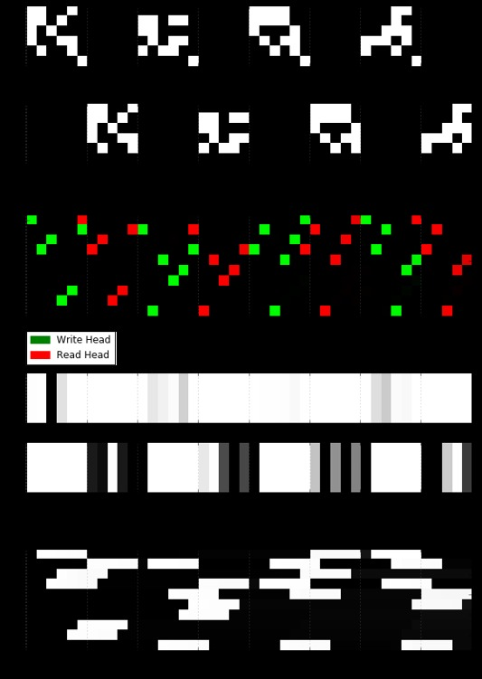
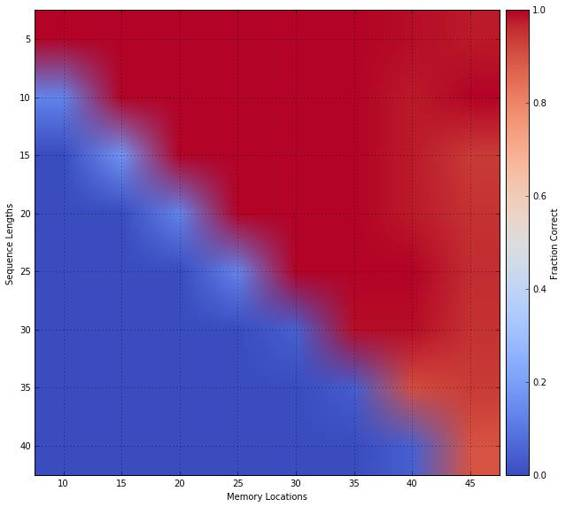

# 资源 | DeepMind 提出的可微神经计算机架构的 TensorFlow 实现

选自 GitHub

**机器之心编译**

**参与：李亚洲**

> *本篇文章介绍了对 DeepMind 最近在 Nature 上介绍的可微神经计算机（DNC）架构的 TensorFlow 实现。关于 DNC 的介绍，可参考机器之心文章《[业界 | DeepMind 深度解读 Nature 论文：可微神经计算机](http://mp.weixin.qq.com/s?__biz=MzA3MzI4MjgzMw==&mid=2650719745&idx=2&sn=242eda88fa9a5572e60b43e451a1549b&chksm=871b027fb06c8b693cff17f43553625f008fcb7965582119b651dbbd17e116e35dc801ebeec3&scene=21#wechat_redirect)》。*

**项目地址：https://github.com/Mostafa-Samir/DNC-tensorflow**

该实现不包括论文中介绍的所有任务，但它注重对该架构一般的独立任务的关键特性的探索与重现。然而，在设计上该实现具有可延展性，因此适应到其他任务时也会很简单。

**本地实现环境**

所有的实验和测试都在下面的机器上实现：

*   一个 Intel Core i5 2410M CPU @ 2.30GHz (2 physical cores, with hyper-threading enabled)

*   4GB SO-DIMM DDR3 @ 1333MHz

*   No GPU.

*   Ubuntu 14.04 LTS

*   TensorFlow r0.11

*   Python 2.7

**实验**

**动态记忆机制**

设计该实验是为了证明外部记忆访问机制各种功能，比如顺序检索（ in-order retrieval）和 allocation/deallocation。

一个类似于论文中的方法是训练一个 2 层前馈模型，具体方法参见：https://github.com/Mostafa-Samir/DNC-tensorflow/tree/master/tasks/copy。

该模型能够学习如何成功复制输入，而且它确实学会了使用记忆机制，下图就展示了这一点：

在 Visualization Notebook 中，你可以重现类似的图。

*   在该图的 Memory Locations 部分，可以明显看到该模型能够以被编写的顺序读取记忆位置(memory location)。

*   在该图的 Free Gate 和 Allocation Gate 部分，展示了在 memory location 被读取之后可被完全激活，且变得过时，虽然在编写阶段有较少激活。Memory Locations Usage 也证明了 memory location 是如何被一次又一次的使用、释放（freed）、再使用的。

在门的激活程度上，该图与 DeepMind 论文中图有些不同。这可能是由于该模型比较小，以及相对较少的训练时间。然而，这并不影响模型的操作。

**泛化和记忆可扩展性（ Memory Scalability）**

设计该实验是为了检查：

*   训练模型是否已经学习了一个可被泛化到更大输入长度的隐形复制算法；

*   学习模型是否不依赖训练记忆的大小且可被扩展到更大的记忆大小。

为了做到这些，在复制问题上训练了一个带有 15 个 memory location 的 2 层前馈模型，训练流程的细节可参加：https://github.com/Mostafa-Samir/DNC-tensorflow/tree/master/tasks/copy。

虽然对该模型进行测试，结果显示它确实能够没有再训练的情况下高效的归纳并使用可用 memory location。下图中的描述类似于 DeepMind 论文中的 Extended Data 图 2：

类似的图可在 Visulizaiton Notebook 中重现。

**To-Do**

**核心：**

1.  稀疏关联矩阵

2.  跨越同样 batch 的可变序列长度

**任务：**

1.  bAbI 任务

2.  图形推断任务

3.  Mini-SHRDLU 任务

**作用：**

一个忽略了所有关于迭代、学习率等细节的任务建立器，将它们提取到了命令行参数的配置中，用户只需要考虑定义计算图就行。

******©本文由机器之心编译，***转载请联系本公众号获得授权******。***

✄------------------------------------------------

**加入机器之心（全职记者/实习生）：hr@almosthuman.cn**

**投稿或寻求报道：editor@almosthuman.cn**

**广告&商务合作：bd@almosthuman.cn**