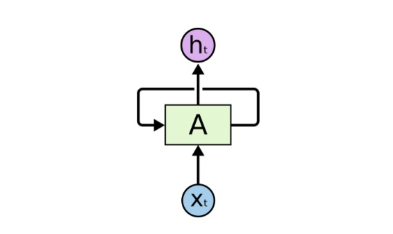
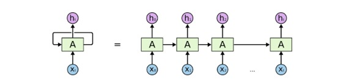
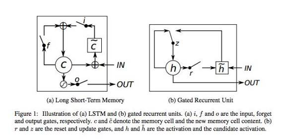
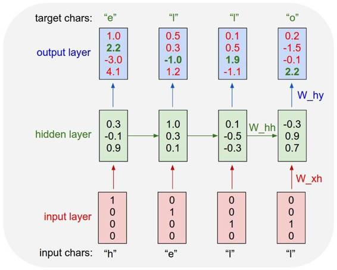
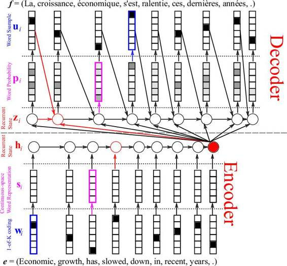

# 学界 | RNN 怎么用？给初学者的小教程

选自 medium

**作者：Camron Godbout**

**机器之心编译**

**参与：杜夏德**

> *什么是循环神经网络（RNN），如何使用它们？本文所讨论的就是关于循环神经网络的基础内容，RNN 是变得日益流行的深度学习模型。本文不打算深入讲解其晦涩的数学原理，而是旨在让读者获得关于 RNN 的抽象理解。*

**一般的循环神经网络信息** 循环神经网络出现于 20 世纪 80 年代，最近由于网络设计的推进和图形处理单元上计算能力的提升，循环神经网络变得越来越流行。这种网络尤其是对序列数据非常有用，因为每个神经元或者单元能用它的内部存储来保存之前输入的相关信息。在语言的案例中，「I had washed my house」这句话的意思与「I had my house washed」大不相同。这就能让网络获取对该表达更深的理解。

注意到这点很重要，因为当阅读一个句子甚至是一个人时，你就是要从它之前的单词中提出每个词的语境。

**一个卷起的循环神经网络**

一个循环神经网络里有很多个环，这些环能允许带着信息通过神经元，同时在输入中读取它们。 

**一个展开的循环神经网络**

 在这些图表中， xt 是某些输入，A 是这个循环神经网络的一部分，而 ht 是输出。基本上，你能输入句子中的词或者甚至是像 xt 这样的字符串中的字符，然后通过该循环神经网络它会得出一个 ht。

目标是用 ht 作为输出，并将它与你的测试数据（通常是原始数据的一个小子集）比较。然后你会得出你的误差率。比较完之后，有了误差率，你就能使用一种叫随时间反向传播（BPTT）的技术。BPTT 返回检查这个网络，并基于误差率调整权重。这样也调整了这个网络，并让它学习去做得更好。

理论上说，循环神经网络能从句子开头处理语境，它允许对一个句子末尾的词进行更精确的预测。在实践中，对于 vanilla RNN 来说，这并不是真正需要的。这就是为什么 RNN 在出现之后淡出研究圈一段时间直到使用神经网络中的长短期记忆（LSTM）单元取得了一些不错的结果后又重新火起来的主要原因。加上 LATM 后的网络就像是加了一个记忆单元，能记住输入的最初内容的语境。 

这些少量记忆单元能让 RNN 更加精确，而且是这种模型流行的最新原因。这些记忆单元允许跨输入以便记住上下文语境。这些单元中，LSTM 与 门控循环单元（GRU）是当下使用比较广泛的两个，后者的计算效率更高，因为它们占用的计算机内存比较少。 

**循环神经网络的应用**  

RNN 有很多应用。一个不错的应用是与自然语言处理（NLP）的合作。网上已经有很多人证明了 RNN，他们创造出了令人惊讶的模型，这些模型能表示一种语言模型。这些语言模型能采纳像莎士比亚的诗歌这样的大量输入，并在训练这些模型后生成它们自己的莎士比亚式的诗歌，而且这些诗歌很难与原作区分开来。

下面是莎士比亚式诗歌。

> *PANDARUS:*
> 
> *Alas, I think he shall be come approached and the day*
> 
> *When little srain would be attain'd into being never fed,*
> 
> *And who is but a chain and subjects of his death,*
> 
> *I should not sleep.*
> 
> *Second Senator:*
> 
> *They are away this miseries, produced upon my soul,*
> 
> *Breaking and strongly should be buried, when I perish*
> 
> *The earth and thoughts of many states.*
> 
> *DUKE VINCENTIO:*
> 
> *Well, your wit is in the care of side and that.*
> 
> *Second Lord:*
> 
> *They would be ruled after this chamber, and*
> 
> *my fair nues begun out of the fact, to be conveyed,*
> 
> *Whose noble souls I'll have the heart of the wars.*
> 
> *Clown:*
> 
> *Come, sir, I will make did behold your worship.*
> 
> *VIOLA:*
> 
> *I'll drink it.*

这首诗完全是一个 RNN 写出来的。这里有一篇好文章更深入地介绍了 Char RNNs 。  

 这种特殊类型的 RNN 是在一个文本数据集中喂养的，它要逐字读取输入。与一次投喂一个词相比，这种方式让人惊讶的地方是这个网络能创造出它自己独特的词，这些词是用于训练的词汇中没有的。 

*一个 char RNN 的例子*

这张从以上参考文章中摘取的图表展示了这个模型将会如何预测「Hello」这个词。这张图很好地将网络如何逐字采纳每个词并预测下一个字符的可能性可视化了。

 另一个让人惊喜的 RNN 应用是机器翻译。这种方法很有趣，因为它需要同时训练两个 RNN。在这些网络中，输入的是成对的不同语言的句子。例如，你能给这个网络输入意思相同的一对英法两种语言的句子，其中英语是源语言，法语作为翻译语言。有了足够的训练后，你给这个网络一个英语句子，它就能把它翻译成法语！这个模型被称为序列到序列模型（Sequence to Sequences model ）或者编码-解码模型（Encoder- Decoder model）。 

*英法翻译的例子*

这张图表展示了信息流是如何通过编码-解码模型的，它用了一个词嵌入层（ word embedding layer ）来获取更好的词表征。一个词嵌入层通常是 GloVe 或者 Word 2 Vec 算法，能批量采纳词，并创建一个权重矩阵，让相似的词相互连接起来。用一个嵌入层通常会让你的 RNN 更加精确，因为它能更好的表征相似的词是什么样的，以便减少网络的推断。 

**结论**

RNN 现在很流行。它们是自然语言处理中最有效的模型之一。这些模型会一直出现新的应用。

***©本文由机器之心编译，***转载请联系本公众号获得授权***。***

✄------------------------------------------------

**加入机器之心（全职记者/实习生）：hr@almosthuman.cn**

**投稿或寻求报道：editor@almosthuman.cn**

**广告&商务合作：bd@almosthuman.cn**