# 深度 | 深度学习教程：从感知器到深层网络

来自 toptal

****作者：IVAN VASILEV****

****机器之心编译出品****

**参与：Ben、郑劳蕾、Angulia、柒柒**

> 本文作者 Ivan Vasilev 是一名具有创业精神的高级开发人员。他的经验范围跨越多个领域和技术，但他的主要焦点在 Java、JavaScript 及机器学习上。

近些年来，人工智能重新兴起。它已超出学术领域范畴， Google、Microsoft 和 Facebook 几大玩家创建了自己的研发团队，并取得了了一些令人瞩目的成果。

这些可以归功于社交网络用户产生的丰富原始数据（大多仍需要再分析）以及通过 GPGPUs（通用计算图形处理器）获得的廉价计算能力。

但在这些现象之外，人工智能的重新兴起很大程度上得力于 AI 的一种新趋势，确切地说是在机器学习领域，被称为「深度学习」。在这篇教程中，我将向你介绍深度学习背后一些关键性概念和算法，从最简单的组成单元开始，以此为基础构造 Java 中机器学习的概念。

（充分说明：我同时也是 Java 深度学习库的作者，这篇文章中的例子也有使用到上述文库。如果你喜欢它，你可以在 GitHub 上给它一颗星表示支持，我对此深表感激。主页上有使用说明。）

****机器学习 30 秒教程****

如果你不太熟悉，你可以浏览以下网址（http://www.toptal.com/machine-learning/machine-learning-theory-an-introductory-primer）阅读机器学习入门介绍。

一般的步骤如下：

1.  我们有一些算法给定了少量带标签的素材，比如有 10 张有狗的图片，为标签 1（「狗」），10 张其他事物的照片，为标签 0（「非狗」）——请注意这篇文章中我们主要采用监督式两类分类法。

2.  算法学习去识别含有狗的图片，当给它一张新图片时，希望算法可以产生正确的标签。（如果是含有狗的图片标签则为 1，其他则为 0）。

这种设定非常普遍：你的数据可以是疾病症状，标签设为病态；或者数据是手写字母的图片，标签为所写的实际字母。

****感知器：早期的深度学习算法****

最早的一个监督式训练算法就是感知器，是一个基本的神经网络构造块。

假设平面上有 n 个点，分别标记为「0」和「1」。给出一个新的点，我们想要猜出它背后的标签（这类似于上面情景中的「狗」和「非狗」）。我们怎么做呢？

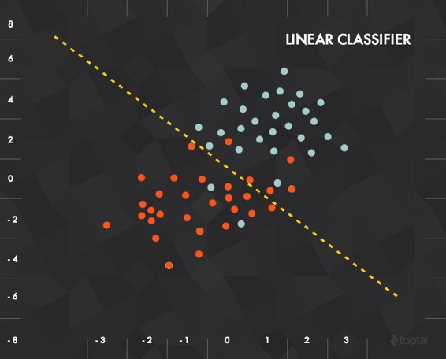

方法之一也许是观察它的最邻近区域，并得出这个点的标签。但是略为聪明的一个方法是选择一条可以最优隔开这些被标记过的数据的线，把它作为你的分类器。  

在这种情况下，每条输入的数据都可以用一个向量 x = (x_1, x_2)来表示，而应变量为「0」（如果 x 在这条线以下）或「1」（x 在线以上）。

如果在数学上表示，这个分类器可以用一个含有权重 w 的向量和垂直偏移（或偏差）量 b 来定义。然后，我们将输入、权重和偏移结合可以得到一个如下的传递函数：

这个传递函数的结果将被输入到一个激活函数中以产生一个标签。在上述例子中，我们的激活函数是阀值中止的（即大于某个阈值后输出 1）：

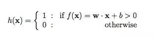

**训练感知器**

感知器的训练包括多个训练样本的输入和计算每个样本的输出。每个样本的权重 w 都要调整以便最小化输出误差，这个误差由需求目标与实际输出的差异得出。还有其他误差计算方法，比如均方差，但是基本的训练原则保持不变。

**单个感知器缺陷**

深度学习的这种单个感知器有一个明显的缺陷：它只能学习线性可分函数。这个缺陷重要吗？比如 XOR（异或运算），这是一个相当简单的函数，但它却不能被线性分离器分类（如下图，分类尝试失败）：

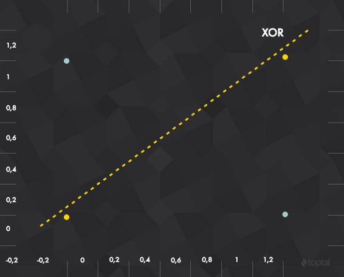

为了解决这个问题，我们需要使用一个多层感知器，也就是前馈神经网络：事实上，我们将把这些感知器组合在一起来创建一个更强大的学习机器。

****深度学习中的前馈神经网络****

神经网络实际上就是将感知器进行组合，用不同的方式进行连接并作用在不同的激活函数上。

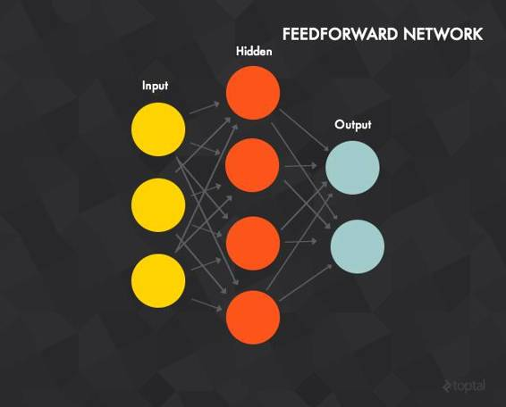

对于初学者，让我们看看前馈神经网络，它有以下几大特性：

1.一个输入层、一个输出层、一个或多个隐藏层。上图中展示的神经网络含有一个三神经元输入层，一个四神经元隐藏层和一个二神经元输出层。

2.每个神经元都是上文提到的感知器。

3.输入层的神经元作为隐含层的输入，同时隐含层的神经元也是输出层的输入。

4.每条建立在神经元之间的连接都有一个权重 w （与感知器的权重类似）。

5.在 t 层的每个神经元通常与前一层（ t – 1 层）中的每个神经元连接（尽管你可以通过将权重设为 0 来断开这条连接）。

6.为了处理输入数据，将输入向量赋到输入层中，把向量的值设为每个输入神经元的输出。在这个特例中，这个网络可以处理一个 3 维输入向量（因为有 3 个输入神经元）。假如输入向量是 [7, 1, 2]，那么你将第一个输入神经元输入 7，中间的输入 1，第三个输入 2。这些值将被传播到隐含层，通过加权传递函数传给每一个隐藏层神经元（这就是前向传播），隐藏层神经元再计算输出（激活函数）。

7.输出层计算输出的方式与隐藏层相同，输出层的计算结果就是整个神经网络的输出。

**超线性**

如果我们的每个感知器都只允许使用线性激活函数会怎样呢？那么，网络的最后输出值将仍是这些输入量的线性函数，只是随着整个网络中与之相关的大量不同权重而有所调整。换句话说，一个线性函数的线性组合仍只是线性函数。如果我们受限于线性激活函数，那么前馈神经网路并不会比感知器更强大，无论它是多少层。

正是这个原因，大多数神经网络都是使用的非线性激活函数，如对数函数、双曲正切函数、阶跃函数、整流函数等。不用这些非线性函数的神经网络只能学习输入数据的线性组合这种形式的函数。

**训练感知器**

对于多层感知器的监督式训练最常见的深度学习算法是反向传播。基本的过程是 ：

1、将训练样本通过神经网络进行前向传播计算。

2、计算输出误差，通常用均方差：

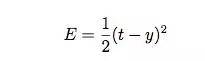

其中 t 是目标值，y 是实际的神经网络输出。其它的误差计算方法也可以，但 MSE（均方差）通常是一种比较好的选择。

3.网络误差通过随机梯度下降法来最小化。

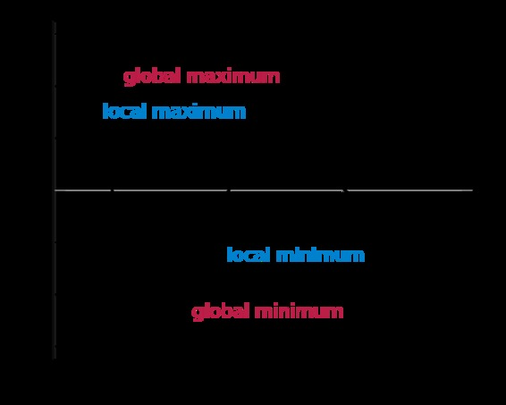

梯度下降很常用，但在神经网络中，它相当于是一条具有输入参数功能的训练误差的曲线。每个权重的最佳值应该是误差曲线中的全局最小值（上图中的 global minimum）。在训练过程中，权重以非常小的步幅改变（在每个训练样本或每小组样本训练完成后）以找到全局最小值，但这不是轻松的任务，训练通常会结束在局部最小值上（上图中的 local minima）。举例来说，如果权重值为 0.6，那么它需要要向 0.4 方向移动。

这个图表示的是最简单的情况，在这种情况下误差只依赖于单个参数。但是，网络误差依赖于每一个网络权重，误差函数非常、非常复杂。

幸运的是，反向传播算法提供了一种通过利用输出误差来修正两个神经元之间权重的方法。这样的微分本身十分复杂，但对于一个给定结点的权重修正有如下（简单）方法：

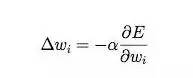

其中 E 是输出误差， w_i 是神经元输入 i 的权重。

实质上这么做的目的是利用权重 i 来修正梯度的方向。关键的地方是误差的导数，当然，这通常不那么容易计算：你如何能给一个大型网络中一个随机隐藏结点中的随机权重求导呢？

答案是：通过反向传播。误差首次在公式很简单的输出神经元进行计算（计算预期值和目标值的差），然后通过一种巧妙的方法反向传回至网络，让我们在训练过程中有效地修正权重并（期望）得到一个最小值。

**隐藏层**

隐藏层十分有趣。根据通用逼近定理，含有有限数量神经元的单个隐层网络可以被训练为类似任意的随机函数。换句话说，单个隐藏层强大到可以学习任何函数。这说明我们在多隐藏层（如深度网络）的实践中可以得到更好的结果。

隐藏层就是网络存储它的训练数据的内部抽象表征的地方，类似于我们大脑（大大简化的类比）有个对真实世界的内部表征。回到教程前面，我们将观察玩味隐藏层的不同方式。

**一个示例网络**

你可以在这里看到 Java 语言通过 testMLPSigmoidBP 方法，用一个简单的（4-2-3 层次）前馈式神经网络对 IRIS 数据集（译者注：经典的分类鸢尾花数据集）进行分类。IRIS 数据集包括三个种类的鸢尾花的特征集合，比如叶萼长度，花瓣长度等等。网络需要从每个种类的鸢尾花中抽取 50 个样本，这些特征值被作为输入元输入网络，而每个输出元对应着数据集中一个单独的种类：「1/0/0」表示这株植物的种类是 Setosa,「0/1/0」表示为 Versicolour 种类，而[0/0/1]表示为 Virginica 种类。它的分类错误率为 2/150（即，它在 150 个实例植株分类过程中出现了两个分类错误）。

****大型神经网络的问题****

一个神经网络可以有不止一个隐藏层：这就是说，更加高级一些的层次会基于前一层「创建」新的抽象概念。正如之前提到过的，你总是可以用更大的网络在实际应用中学习的更好。

然而，持续增长隐藏层的数目会带来以下两个显著的问题：

1.梯度消失。当我们添加了一个又一个的隐藏层时，反向传播将有用信息反向传回前面层次起的作用就变得越来越小。实际上，当信息被反向传回，梯度开始消失，并且与网络的权重相关性也更加小。

2.过拟合。这可能也是机器学习的核心难题。简单来说，过拟合描述了网络模型过于贴近训练数据的现象，这可能是模型太过复杂导致的。在这样的例子下，你的学习模型最终确实能够很好的拟合数据，但是会拟合地过了头，在真实的测试实例上表现更加糟糕。

让我们看一些深度学习算法如何解决这个问题的。

**自编码器**

大多数引导性机器学习都停止在前馈神经网络这一步。但是可能的网络空间远非如此——所以让我们继续。

自编码器是典型的前馈型神经网络，旨在学习一个经过压缩的、分布表示（编码）的数据集。

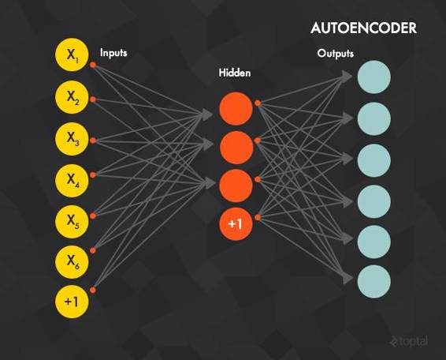

概念上来说，网络被训练成「重新生成」输入，比如，输入以及目标数据都是一样的。换句话说：你尝试着输出跟你输入的一模一样的东西，但是在某种程度上经过了压缩。这是个容易让人迷糊的方法，所以让我们来看一个实例。

**压缩输入：灰度图片**

如果说训练数据由像素 28*28 的灰度图片组成而且每一个像素值都赋给一个输入层的神经元中（即输入层将有 784 个神经元）。之后，输出层也将同输入层一样有 784 个单元，并且每个输出元的目标值都将是图像中每一个像素的灰度值。

这样的结构背后是网络将不会在它的训练数据和标签之间，学习建立一个「映射」关系，而是学习数据本身的内部结构和特征。（也因此，隐藏层也被叫做特征探测器）。通常，隐层神经元的个数要小于输入/输出层，这也就迫使神经网络只学习那些最为重要的特征，同时实现一个维度的减少。

实际上，我们希望中间一些节点能在概念层次上学习数据，从而产生一个简洁的表征，这样在一定程度上能够捕捉到我们输入的关键特征。

**流感疾病**

为了更进一步验证自编码器，让我们再来看一个应用。

在这个实例中，我们将使用一个简单的数据集组成流感症状。如果你有兴趣，这个实例的代码可在 testAEBackpropagation 方法中找到。

如下就是这个数据集如何被分解的：

这里有六个二进制输入特征。

前三个表示疾病的症状。比如，1 0 0 0 0 0 指这名患者体温过高，0 1 0 0 0 0 代表咳嗽，1 1 0 0 0 0 暗示着咳嗽和高体温，等等。

后三个特征是「相反」特征，当一名病人有其中一项症状，她或他就有更少的可能性患病。例如， 0 0 0 1 0 0 暗示这名病人接种过流感疫苗，同时也存在将两个数据集特征结合起来的情况：0 1 0 1 0 0 暗示着一个接种过疫苗的病人同时在咳嗽，诸如此类。

我们将考虑如下情况，当一个患者拥有前三种患病症状中至少两种症状时，他/她是患病的，同时如果有后三种「相反」症状里的两种，我们认他/她是健康的，比如：

111000, 101000, 110000, 011000, 011100 = 生病

000111, 001110, 000101, 000011, 000110 = 健康

我们将会利用 6 个输入元忽和 6 个输出元但仅 2 个隐藏元来训练自编码器（通过反向传播）。

在经过数百次迭代之后，我们观察到当每一个「生病」样本被机器学习的网络表示出来时，两个隐层神经元中的一个（和每个「生病」样本相同的单元）总是表现出比其他神经元更高的激活值。相反的，当一个「健康」样本被表示，另一个隐藏神经元有更强的激活反应。

****回到机器学习****

本质上，我们的两个隐层神经元都是从流感症状数据集中学到了数据的压缩表示。为了看看这如何与学习相关联，我们返回到过拟合的问题上来。通过训练我们的网络来进行数据的压缩表示，我们更偏爱一个较为简单的表示方法而不是一个十分复杂、有可能在训练数据上过拟合的理论模型。

一定程度上，由于偏好这样更为简单的表示方法，我们也会尝试从一个更加真实的意义上去学习数据。

**有限玻尔兹曼机(RBM)**

下一个逻辑步骤是看看有限玻尔兹曼机(RBM)，一个可以从它自身输入来学习概率分布的随机生成神经网络。

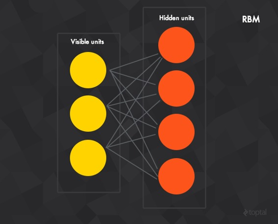

RBMS 由隐藏层、可见层、以及偏移层所组成。不同于前馈神经网络，在可见层和隐层之间的连接是无向的（值可以同时从隐层传到可见层，反之亦然）同时还是全连接的（给定层的每个神经元都会和下一层的每个神经元相连接——如果我们允许任意层次的任意神经元来连接到其他任何层次，那么就是玻尔兹曼机（并非有限玻尔兹曼机））。

标准的 RBM 有二进制隐藏元和可见元：即是说在伯努利分布下神经元的激活值为 0 或者 1，但是这里也有其他非线性的变量。

研究者们知晓 RBMs 已经有一定的年月，但最近关于对比分歧无监督训练算法的介绍又重新挑起了研究者们的兴趣。

**对比分歧**

单步对比分歧算法（CD-1）的运行原理如下：

正相位：

1.一个输入样本 v 赋给输入层

2.v 以前馈神经网络中相类似的规则被传输到了隐藏层，隐藏层最终激活的结果是 h

负相位：

1.将 h 反向传播到可见层得到结果 v’（在隐藏层与可见层之间的连接是无向的，所以两个方向之间的移动都是可以进行的。）

2.将新的 v’反向传播给给隐藏层得到激励结果 h’

**权值更新**

注：这里 a 是学习速率，v,v’,h,h’都是向量。

隐藏在这个算法之后的思想就是正相位传播（h 得到 v）反映了网络对真实数据的内部表达。同时，负相位代表了尝试基于内部表达重构数据的过程（v’到 h）。主要目的都是为了生成的数据能够尽可能接近真实世界并且反映在权值更新的公式上。

换句话来讲，这个网络拥有一些如何将输入数据表示出来的认知观念，所以它尝试重新生成基于这个表示的数据。如果重新生成的数据不能与实际情况足够接近，这将使得它重新做出调整，再次尝试学习。

**再谈流感**

为了证明对比分歧，我们将使用之前那个症状数据集。用于测试的网络是一个有着 6 个可见元与 2 个隐藏元的 RBM。我们将运用对比分歧把症状 v 赋给可见层之中训练网络，测试过程中，症状再一次被赋予到可见层，之后，数据被传播到隐藏层。隐藏元代表着生病/健康状态，这是一个与自编码器非常相似的结构（从可见层到隐藏层传输数据）。

在经过上百次的迭代之后，我们可以观测到与自编码器相同的结果。当任意一个「生病」样本被赋予系统时，其中一个隐藏元有着比其他神经更加高的激活值，而另一些在面对「健康」样本时显得更加的积极。

你可以在 https://github.com/ivan-vasilev/neuralnetworks/blob/master/nn-core/src/test/java/com/github/neuralnetworks/test/RBMTest.java）方法中看到它的具体行为。

**深度网络**

我们已经展示了自编码器隐藏层和 RBMs 如何作为有效的特征检测器，但其实很少会直接使用这些特征。事实上，上面的数据集更多的只是个例，而不是规则。相反，我们需要找到一些间接使用这些特征的方法。

幸运的是，人们发现这些结构可以透过堆叠来形成深度网络。这些网络可被一层层的训练以克服正在消失的梯度及与经典反向传播引起的过适度问题。

由此产生的模型往往是相当强大的，并且有不错的成绩。举例来说，谷歌著名的「猫」论文，他们使用特殊的深度自动编码器基于无标签数据来「学习」人类和猫脸检测。

让我们来仔细看一下。

**堆叠式自编码器**

正如其名所暗示，这个网络由多个堆叠式自编码器所组成。

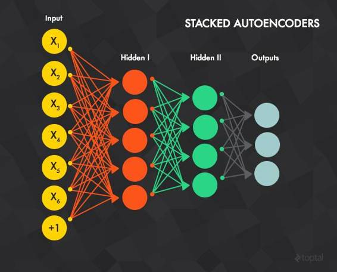

自编码器的隐藏层 t 充当自编码器 t＋1 的输入层。第一个自编码器的输入层是整个网络的输入层。逐层贪婪训练法是这样运作的：

使用反向传播的方法及所有可用的训练数据，单独地训练第一个自编码器（t＝1，或是上图中的红色连接，但需要一个额外的输出层）。

训练第二个自编码器 t＝2（绿色连接）。由于 t＝2 的输入层是 t＝1 的隐藏层，我们对 t＝1 的输出层不再感兴趣，将其从网络中剔除。训练开始于将输入样本赋到 t＝1 的输入层，并向前传播到 t＝2 的输出层。接着 t＝2 的权重（输入-隐藏及隐藏-输出）通过反向传播得到更新。与 t＝1 相似，t＝2 使用所有训练样本。

所有层都重复前面的过程（即移除前一个自编码器的输出层，用另外一个自编码器替换，然后用反向传播进行训练。）

步骤 1-3 被称为预训练（pre-training），并留下正确初始化的权重。然而，输入数据和输出标签之间是没有映射的。例如，如果一个网络被训练来识别手写数字，它仍然无法将最后一个特征检测器（即最后一个自编码器的隐藏层）与图像的数字类别做匹配。在这种情况下，最常见的解决方法是为最后一层（蓝色连接）加上一个或以上的完全连接层。整个网络可被看作是一个多层感知器，并使用反向传播来训练（这个步骤也称为优化）。

那么堆叠式自编码器，完全是对网络权重的初始化提供一个有效的预训练，并留下了一个复杂、多层且随时可以训练（或优化）的感知器。

**深度信念网络**

有了自编码器，我们也可以堆叠玻尔兹曼机来创建一个称之为深度信念网络（deep belief networks ，DBNs)的类别。

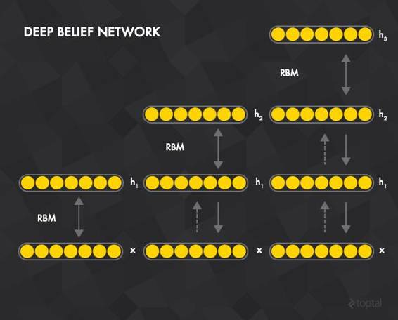

在这种情况下，RBM 的隐藏层 t 充当其 t+1 层的可见层。第一个 RBM 的输入层是整个网络的输入层，逐层贪婪欲训练法（The greedy layer-wise pre-training ）是这样运作的：

利用所有的训练样本和对比分歧法训练第一个 RBM t=1。

训练第二个 RBM t=2。因为 t=2 的可见层是 t=1 的隐藏层，训练始于将训练样本赋给 t=1 的可见层，接着向前传播到 t=1 的隐藏层。这个数据可作为对比分歧法对于 t=2 的初始化训练。

以此类推，为所有层重复前面的过程。

类似于堆叠式自编码器，经过预训练以后，我们可透过连接一个或多个完全连接层（fully connected layers）至最后一个 RBM 的隐藏层来扩充整个网络。这形成了一个多层感知器，并且可使用反向传播进行优化。

这个过程类似于堆叠式自编码器，不同的是 RBMs 代替了自编码器，对比分歧算法代替了反向传播。

（注：如果希望进一步了解创建及训练堆叠式自编码器及深度信念网络，可在 https://github.com/ivan-vasilev/neuralnetworks/blob/d2bbc296eca926d07d09b860b29c5a5a3f632f63/nn-core/src/test/java/com/github/neuralnetworks/test/DNNTest.java 查看样本代码。）

****卷积网络****

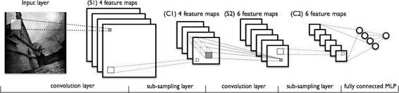

在看卷积网络的实际结构之前，让我们先定义一个图像过滤器，或是一个与权重相关的方形区域。这个过滤器被应用在整个输入图像当中，并且会经常应用多个过滤器。例如，你可能会在一个图像输入中应用四个 6×6 的过滤器。然后，一个坐标为（1，1）的输出像素其实就是一个左上角为 1，1 的 6×6 的输入像素加权和即过滤器的权重（也为 6×6）。输出像素（2，1）是产自于左上角为（2，1）的输入方形，以此类推。

根据以上所述，我们可以这样定义这些网络：

卷积层将一定数量的过滤器应用于输入上。例如，图像的第一个卷积层有四个 6×6 的过滤器。一个过滤器应用在图像上的结果被称为特征图（feature map, FM），并且特征图的数量等于过滤器的数量。如果前一层也是卷积的，它就会被应用在其所有的特征图上，并且有不同的权重。因此，每个输入特征图就与每个输出特征图相连接了。在图像共享权重背后的是不论位置如何，特征都将被检测到，而过滤器的多样性允许它们之间的每一个去检测不同的特征集。

子采样层（subsampling layer）减少输入的大小。例如，如果输入包含了一个 32×32 的图像，并且这个图层有一个 2×2 的子采样层区域，输出值就会是一个 16×16 的图像，也就是说：输入图像的 4 个像素（每个 2×2 的平方）被组合为单个输出像素。子采样的方法有不少，但最受欢迎的包括 max pooling， average pooling 及 stochastic pooling。

最后一个子采样（或是卷积）层通常与一个或多个完全连接层相连接，其中最后一个代表着目标数据。

训练使用改良的反向传播进行，而这个反向传播是以子采样层作为考虑的，并基于应用过滤器时的所有值更新卷积过滤器的权重。

你可以在 MNIST 数据集里（手写信件的灰階图像）看到多个卷积网络（使用反向传播）被训练的样本，特别是在 testLeNet* 的方法里（我建议使用 testLeNetTiny2，因为它在一个相对较短的时间内实现了约 2%的低误差率的成果）。这儿还有一个类似的网络，它有一个不错的可视化 JavaScript。

**实施**

现在我们已经概述了最常用的神经网络变种，我希望再写一点有关落实这些深度学习模型时会遇到的困难。

概括地说，我的目标是创建一个以神经网络为基础架构的深度学习库（Deep Learning library），并且满足以下条件：

一个足以代表不同模型的常见架构（正如我们在以上看到的所有神经网络的变种）。

使用不同训练算法的能力（反向传播，对比分歧等）。

具有不错的表现。

为了满足这些要求，我使用了层次（或模块）的方式来设计软件。

**结构**

让我们从基础开始：

NeuralNetworkImpl 是所有神经网络模型的基础。

每个网络都包含有一组层。

每层都具有一系列连接任意两层的连接，使得所述的网络成为一个有向非循环图形（directed acyclic graph, or DAG）

这种结构用于经典的前馈网络足够灵活，也可以用于 RBMs 和更复杂的结构，如 ImageNet。

它也允许一层作为多个网络而不仅是一种网络的一部分。例如，在深度信念网络里的层也可以是与其相应的 RBMs 里的层。

此外，这种结构允许深度信念网络在预训练的阶段中被视为一列堆叠的 RBMs，也在优化的阶段中被视为前馈网络，这样既直观也便于编程的。

**数据传播**

下一个模块负责通过网络传播数据，这是一个两步骤的过程：

确定层的顺序。例如，为了从一个多层感知器获得结果，数据会被「赋」到输入层（因此，这成了要被计算的第一层），并传播至输出层。为了在反向传播中可以更新权重，输出误差需要从输出层开始被传播，经过所有层，并以广度作为优先顺序被传播。这可以通过使用 LayerOrderStrategy 的各种实施来取得，它利用了网络图像结构并应用了不同的图像遍历方法。这些方法包括广度优先策略（breadth-first strategy）及特定层的定位（targeting of a specific layer）。顺序实际上是由层与层之间的连接来决定的，所以这策略返回了一系列有序的连接。

计算激活值。每一层都有一个相关的连接计算器（ConnectionCalculator），连接计算器需要一系列的连接（来自之前的步骤）及输入值（来自其它层）以计算激活值。例如在一个 S 形的前馈网络中，隐藏层的连接计算器使用输入值、偏移层的值（即输入数据和 1 的阵列）及单元之间的权重（当这些层在完全连接的情况下，权重实际上是以矩阵形式存储在一个完全连接的连接中），以此计算出加权和，并将结果反馈给 S 形函数。连接计算器实现多种传输（例如加权和及卷积）及激活（例如逻辑斯蒂和正切的多层感知器，二进制 RBM）。它们之间的大多数可以在 GPU 上使用 Aparapi 得到执行，还可以进行小批量训练。

**Aparapi GPU 计算与 Aparapi**

正如我前面提到的，神经网络在近几年取得复苏的其中一个原因是他们的训练方法非常有利于并行计算，使人们在使用 GPGPU 时显著提高训练速度。在这种情况下，为了增加对 GPU 的支持，我选择了与 Aparapi 库合作。

Aparapi 强加在连接计算器上的一些重要限制：

仅一维阵列（和变量）的基本数据类型是允许的。

只有 Aparapi Kernel 或类似方法（member-methods）是允许从 GPU 可执行代码中被召集的。

因此，大部分的数据（权重、输入与输出数组）都被储存在矩阵当中，其中在内部会使用一维浮点数组。所有 Aparapi 连接计算器要么使用 AparapiWeightedSum（用于完全连接层及加权和输入函数），要么使用 AparapiSubsampling2D（用于子取样层），或者 AparapiConv2D（用于卷积层）。当中的一些限制可以在引入异质系统架构（Heterogeneous System Architechure）后被克服。Aparapi 允许在 CPU 或 GPU 上运行一样的代码。

**训练**

这个训练模块可实现各种训练算法。它依赖于先前的两个模块。例如，反向传播训练器（BackPropagationTrainer，所有训练器都在使用训练器基类）使在前馈阶段用前馈层计算器，在传播误差和更新权重时使用广度优先层计算器。

我最新的作品关于支持 Java 8 及其他一些改善方法，这些都可以在这里查得到，并且很快会被融合到我主要的著作里面。

****结论****

这个 Java 深度学习教程旨在给你提供一个有关深度学习算法的简单介绍，我们由最基本的组成单元（感知器）开始，进而介绍了几个有效并流行的架构，如有限玻尔兹曼机(RBM)。

神经网络背后的想法其实存在了很长一段时间，并且随着 GPGPU 计算能力的提升及由 Geoffrey Hinton, Yoshua Bengio, Yann LeCun 与 Andrew Ng 等学者所做出的努力，此领域已经挺有成果。所以今天你不能只停留在机器学习的领域，而不对深度网络及其他相关的课题有一些了解了。现在是最好的时机了。

***©本文由机器之心原创编译，***转载请联系本公众号获得授权***。***

✄------------------------------------------------

**加入机器之心（全职记者/实习生）：hr@almosthuman.cn**

**投稿或寻求报道：editor@almosthuman.cn**

**广告&商务合作：bd@almosthuman.cn**

机器之心是**Comet Labs**旗下的前沿科技媒体。Comet Labs 是由联想之星发起、独立运作的全球人工智能和智能机器加速投资平台，携手全球领先的产业公司和投资机构，帮助创业者解决产业对接、用户拓展、全球市场、技术整合、资金等关键问题。旗下业务还包括：Comet 旧金山加速器、Comet 北京加速器、Comet 垂直行业加速器。

↓↓↓点击「**阅读原文**」查看机器之心网站，获取更多精彩内容。