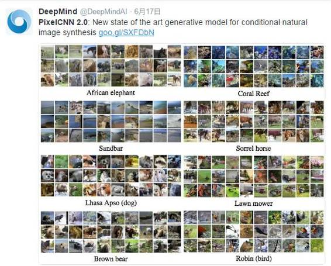
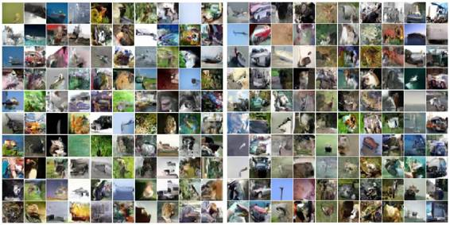
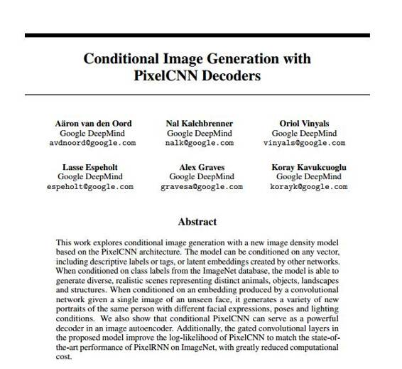
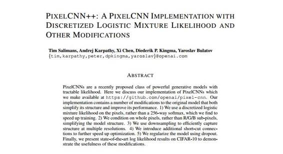

# 开源 | OpenAI 的 PixelCNN++实现：基于 Python3 和 TensorFlow

选自 Github

**机器之心编译**

**参与：朱思颖、蒋思源**

 

今年 6 月 DeepMind 的一条官方推文里，公布了他们当时运用 PixelCNN 所生成的条件自然场景合成图，并称这种方法将艺术生成模型提升到一个新的水准。DeepMind 运用 PixelCNN 实现条件图像生成的论文也被今年的 NIPS 所收录（见文末附录）。6 个月之后，近日，OpenAI 在 GitHub 公开了 TensorFlow 框架里用 Python3 实现的 PixelCNN 优化版——PixelCNN++的源码，其论文已被 ICLR 2017 接收。

所公开的源码是 PixelCNN++的具体代码实现，是在 TensorFlow 框架里用 Python3 编写的。PixelCNN++的具体阐述在以下论文：

PixelCNN++：A PixelCNN Implementation with Discretized Logistic Mixture Likelihood and Other Modifications, by Tim Salimans, Andrej Karpathy, Xi Chen, Diederik P. Kingma, and Yaroslav Bulatov.

我们的研究是建立在 van der Oord 等人今年 6 月份最初提出来的 PixelCNN（所附论文一）上。PixelCNN 是一类强大的生成模型，它有易处理似然性（tractable likelihood）从而容易进行抽样。其核心的卷积神经网络计算在一个像素值上的概率分布，且受左侧和上侧的像素值约束。下面是在 CIFAR-10 上训练的模型里面的示例样本，其实现了每维度 2.92 bits（van der Oord 等人的 PixelCNN 是 3.03 bits）：

来自模型（左）的样品和来自以 CIFAR-10 类标签为约束的模型的样本（右）：

此代码支持将我们改进的 PixelCNN 在 CIFAR-10 和 Small ImageNet 上进行多 GPU 训练，并很容易适应额外的数据集。在具有 8 个 Maxwell TITAN X GPU 的机器上进行训练在大约 10 小时内能实现每个维度 3.0 bits，并且需要大约 5 天才能收敛到 2.92 bits。

开源地址：*https://github.com/openai/pixel-cnn*

**设置**

你需要以下环境运行该代码:

*   多 GPU 计算机

*   Python3

*   Numpy, TensorFlow

**训练模型**

使用 train.py 脚本进行模型的训练，在 CIFAR-10 上训练默认模型只需要简单键入：

python3 train.py

你可能希望至少可更改 --data_dir 和 --save_dir，它们指向系统下载数据的路径（如果是无效的）和保存点的位置。

我想使用更少的 GPU 进行训练。为了在更少的 GPU 上训练，我们建议使用 CUDA_VISIBLE_DEVICES 缩小 GPU 可用（the visibility of GPUs）数量，然后再运行脚本。不要忘记相应地调制 flag： --nr_gpu。

我想训练自己的数据集。看看 data/ 文件夹中的 DataLoader 类，必须为你自己的数据集写一个类似的数据迭代器，然后代码才能从那边正常运行。

预训练模型检查点（checkpoint）

你可以下载（http://alpha.openai.com/pxpp.zip）(http://alpha.openai.com/pxpp.zip%EF%BC%89) 中我们已训练的模型（TensorFlow），它在 CIFAR-10 上实现了 2.92bpd。

**引用**

如果你发现代码很有用，请在你的研究中引用我们：

@inproceedings{Salimans2016PixeCNN,

 title={PixelCNN++: A PixelCNN Implementation with Discretized Logistic Mixture Likelihood and Other Modifications},

 author={Tim Salimans and Andrej Karpathy and Xi Chen and Diederik P. Kingma and Yaroslav Bulatov},

 booktitle={Submitted to ICLR 2017},

 year={2016}

}

**附录：**

论文：Conditional Image Generation with PixelCNN Decoders

 

摘要：

本研究探索了使用条件图像生成与基于 PixelCNN 架构的新的图像密度模型。该模型可以以任何矢量为条件，包括描述性标签或标签，或由其他网络创建的隐嵌入。当使用来自 ImageNet 数据库的类标签时，该模型能够生成表示不同动物，对象，风景和结构的多样化、形象逼真的场景。当对由未知的面部的单个图像给出的卷积网络产生的嵌入进行调节时，它可以生成不同面部表情，姿势和光照条件下同一个人的各种新肖像。我们还展示了条件 PixelCNN 可以作为图像自动编码器中的强大的解码器。此外，提出的模型中的门控卷积层提高了 PixelCNN 的对数似然度，以匹配 ImageNet 上的 PixelRNN 的最新性能，大大降低了计算成本。

论文：PIXELCNN++: A PIXELCNN IMPLEMENTATION WITH DISCRETIZED LOGISTIC MIXTURE LIKELIHOOD AND OTHER MODIFICATIONS

 

摘要：

PixelCNN 是最近提出的一类具有易处理似然性（tractable likelihood）的强大生成模型。本文将讨论我们怎样实现 PixelCNN，同时在 Github 上开源。我们的实现方法包含对原始模型的多个修改，不仅精简了结构，还提高了性能。主要从以下几个角度完成：1\. 我们使用像素上的离散逻辑混合似然（discretized logistic mixture likelihood），而不是 256 阶的 softmax 回归（256-way softmax），这能大大加快训练。2\. 我们对整个像素而不是 R/G/B 子像素进行约束，从而简化模型结构。3\. 我们使用下采样（downsampling）有效地捕获多种分辨率结构。4\. 我们引入额外的快捷连接，以进一步加速优化。5\. 我们使用 dropout 对模型进行正则化。最后，我们在 CIFAR-10 上呈现最先进的对数似然（log likelihood）结果，以证明这些改进的有用性。

***©本文由机器之心编译，***转载请联系本公众号获得授权***。***

✄------------------------------------------------

**加入机器之心（全职记者/实习生）：hr@almosthuman.cn**

**投稿或寻求报道：editor@almosthuman.cn**

**广告&商务合作：bd@almosthuman.cn**