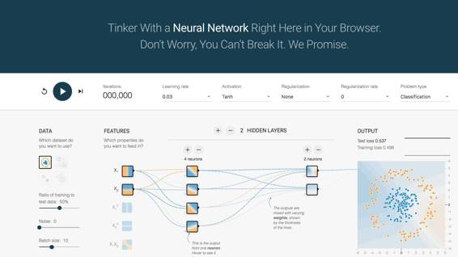

# 深度 | 谷歌官方指南：如何通过玩 TensorFlow Playground 来理解神经网络

选自 cloud.google

**作者： Kaz Sato**

**机器之心编译**

**参与：吴攀、李亚洲**

> *单个神经元的数学机制很简单，它所能做的只是将数据点分成两类。而众多神经元组成的深度神经网络能提取更多特征，解决更复杂更抽象的问题。（之前相关报道：[业界 | 想揭开深度学习隐藏层的神秘面纱？试试 Tensor Flow 的神经网络游乐场](http://mp.weixin.qq.com/s?__biz=MzA3MzI4MjgzMw==&mid=2650715679&idx=1&sn=0722624d88f17a70d9663bc918f9ac82&scene=21#wechat_redirect)）**源码：https://github.com/tensorflow/playground*

神经网络和深度学习近来已经变成了互联网上的热词，你可能也想一探究竟。但是当很多人拿起教科书准备自学成才时，却最后发现自己被数学模型和公式搞得晕头转向。反正我就是这样的。

 对于和我一样的人来说，我们还有一种不需要太过艰深的数学知识就能理解神经网络的方法：TensorFlow Playground，这是一个用 JavaScript 写的网页应用，能让你把玩在你的浏览器中运行的真实的神经网络，并且可以让你点击按钮和调整参数，从而了解它是怎么工作的。体验地址：http://playground.tensorflow.org/

在这篇文章中，我会向你介绍如何使用 TensorFlow Playground ，因而你能够理解神经网络背后的核心思想。然后你就能理解为什么最近这么多人会变得对这项技术感到如此地兴奋。 

## **让计算机解决问题**

计算机编程需要程序员。人类通过一行行的代码制定计算机执行的每一个步骤，从而指示计算机解决问题。但有了机器学习和神经网络，你就可以让计算机自己去解决问题了。一个神经网络就是一个函数，能够学会训练数据集中的给定输入所对应的预期输出。

** *神经网络就是能够从训练数据集中学习的函数*

比如，为了构建能够识别猫的图像的神经网络，你可以使用大量猫图像样本训练网络。最终得到的网络就和一个函数一样，其将猫图像作为输入，然后输出「cat（猫）」标签。或者更实用的情况是——你可以向其中输入来自游戏服务器的大量用户活动日志，然后输出有较高转化概率的用户。

这是怎么办到的？让我们来看一个简单的分类问题。假设你有一个如下的数据集。其中每一个数据点都有两个值：x1（横坐标）和 x2（纵坐标）。这里有两组数据点：橙色组和蓝色组。

要区分一个数据点是橙色的还是蓝色的，你该如何编写代码？也许你会像下面一样任意画一条对角线来分隔两组数据点，定义一个阈值以确定每个数据点属于哪一个组。

你的 IF 语句的条件应该看起来是这样：  

其中 b 是确定线的位置的阈值。通过分别为 x1 和 x2 赋予权重 w1 和 w2，你可以使你的代码的复用性更强。

此外，如果你调整 w1 和 w2 的值，你可以按你喜欢的方式调整线的角度。你也可以调整 b 的值来移动线的位置。所以你可以重复使用这个条件来分类任何可以被一条直线分类的数据集。  

 但问题的关键是程序员必须为 w1、w2 和 b 找到合适的值——即所谓的参数值，然后指示计算机如何分类这些数据点。 

## **一个神经元：将一个数据点分为两类**

现在，让我们看看 TensorFlow Playground 背后的计算机是如何解决这个特定问题的。在 Playground 上，点击左上角的「Play（播放）」按钮。蓝色和橙色数据点之间的线开始缓慢移动。点击复位（reset）按钮然后再点击播放几次，观察有不同初始值的线是如何移动的。你看到的是计算机正在试图找到权重和阈值的最佳组合，从而画出两组之间的直线。 

 *TensorFlow Playground 上一个简单的分类问题*

 TensorFlow Playground 使用了一个人工神经元进行这个分类。什么是人工神经元？这是由人类大脑中生物神经元的行为所启发的一种概念。

 

*生物神经元之间的网络*

对于生物神经网络的机制的详细描述，可以参见维基百科「神经元」页面：当神经元接收到来自其相连的神经元的电信号时，它会变得兴奋（激活）。神经元之间的每个连接的强度不同。一些神经元之间的连接很强，足以激活其它神经元，而另一些连接则会抑制激活。你大脑中的数千亿神经元及其连接一起构成了人类智能。

对生物神经元的研究导致了一种新的计算模式的诞生——人工神经网络。使用人工神经网络，我们可以使用简单的数学方式模拟生物神经元的行为。为了解决上述的分类问题，你可以使用下面的简单神经网络，它只具有一个神经元（即感知器（Perceptron））。

 

x1 和 x2 是输入值，w1 和 w2 是权重——代表了输入与神经元连接的强度。b 是所谓的偏置（bias），表示一个神经元是否可被输入激活的阈值。这个单一的神经元可以通过下面的公式计算。

 

是的，这也就是前面提到的用一条直线分类数据集时所需的公式。而且实际上这也是一个神经元所能做的唯一事情：使用权重和偏置检查输入值，将一个数据点分到两类中的一类。带有两个输入时，一个神经元可以使用一条直线将一个数据点在一个二维空间中分成两类。如果有三个输入，一个神经元可以使用一个平面将一个三维空间分成两部分，以此类推。这就是所谓的「使用一个超平面分割 n 维空间（dividing n-dimensional space with a hyperplane）」。

*一个神经元可以将任何数据点分为两类*

**使用单个神经元执行图像识别**

一个「超平面（hyperplane）」如何解决日常问题呢？举个例子，假设你有大量如下的手写文本图像： 

*手写文本的像素图像*

你可以训练一个神经元将一组图像分类为「数字 8 的图像」和「其它」两类。

你该怎么做呢？首先，你需要准备数万张用于训练的样本。假设单张图像是 28×28 像素的灰度图像，它可对应于一个 28×28=784 个数字的数组。假设给定 55,000 张样本图像，那就将得到一个带有 784×55000 个数字的数组。

对于这 5.5 万个样本中的每一张样本图像，你都可以将 784 个数字输入到一个神经元中，这些每个样本都带有一个训练标签——是否表示了「8」。

正如你在 Playground 演示中看到的那样，该计算机会尝试寻找权重和偏置的最优组合，进而分辨每张图像是否是「8」。

在经过了 5.5 万个样本的训练之后，该神经元会生成如下的一个权重集合，其中蓝色代表正值，红色代表负值。

就是这样的。即使是这样非常原始的单个神经元，你也可以在手写文本图像的识别上实现 90% 的准确度[1]。要识别 0-9 这 10 个数字，你只需要 10 个神经元就能达到 92% 的准确度。

再说一次，这个神经元所能做的只是将数据点分成两类：「8」或「其它」。什么才能算作是一个「数据点」？在这个案例中，每一张图像包含 28×28=784 的数字。从数学的角度上说，你可以说每张图像都代表了 784 维空间中的一个点。该神经元用一个超平面将这个 784 维空间分成了两个部分，从而将每张图像（每个数据点）分为了「8」或「其它」。（是的，我们几乎不可能想象维度空间和超平面看起来是怎样的。还是不要去想了。）

在上述例子中，我们所用的样本数据是手写文本的图像，但你也可以使用神经网络分类其它许多类型的数据。比如，网络游戏提供商可以通过检查玩家活动日志来识别作弊的玩家；电子商务提供商可以通过网页服务器访问日志和交易历史识别优质客户。换句话说，你可以将任何可以转换成数字表示的数据表示成 n 维空间中的数据点，然后让神经元找到所需的超平面，看它是否能帮你有效地分类你的问题。 

## **怎么训练神经网络？**

如你所见，神经网络是用基础数学实现的简单机制。神经网络和传统编程之间的唯一不同是：你让计算机通过学习训练数据集来确定参数（权重和偏置）。换句话说，我们的样本中训练出的权重模式不是由人类编程的。

在这篇文章中，我不会详细地讨论你可以如何使用反向传播和梯度下降等算法训练参数。我只想说，训练过程中的计算机会尝试一点点增大或减小每个参数，看其能如何减少相比于训练数据集的误差，以望能找到最优的参数组合。 

你可以将计算机看作一个学生或初级员工。开始的时候，计算机会犯很多错，它需要一些时间才能找到解决真实世界问题（包括可能的未来问题）的实际方法并最小化误差（即所谓的泛化（generalization））。

*在其可以最小化误差之前，一个神经网络需要训练时间*

我们可能会在未来的一篇文章中重新谈到这一主题。至于现在，你只需要知道 TensorFlow 这样的神经网络库已经囊括了大部分训练必需的数学知识，而不必过于担心。 

## **更多神经元，更多提取特征**

我们已经展示了单个神经元进行简单分类的方式，但你可能也想知道如何使用单个神经元建立能够识别数千张不同图像、以及能与专业围棋手对抗的网络。有一个原因可以解释为什么神经网络能变得比我们上面描述的更聪明。让我们看一下来自 TensorFlow Playground 的另一个样例。

这个数据集不能被单个神经元分类，因为两组数据点不能被一条直线分开。这就是所谓的非线性分类问题。在现实世界中，非线性和复杂的数据集是无限的，比如上面这个，而问题是如何捕捉这种类型的复杂模式？  

 答案是在输入值与输出神经元之间增加一个隐含层（hidden layer ）。 

 *TensorFlow Playground 上的非线性分类问题*

 **这里发生了什么？如果你点击隐含层中的每一个神经元，你就会看到它们每一个都在进行简单的单条直线的分类：

*   第一个神经元检查数据点是在左边还是在右边

*   第二个神经元检查它是否在正右方

*   第三个检查它是否在右下方 

这三个结果被称为数据的特征。这些神经元的输出表示相应特征的强度。

最终，输出层的神经元使用这些特征对数据分类。如果你绘制一张包含这些特征值的三维空间图，这个最终神经元能用一个平面简单的划分该空间。这里有一个将原始数据转换为特征空间的例子。

 

*一个隐层将输入变换为特征空间，使其可线性分类*

在 Playground 的演示例子中，这样的变换导致多种特征对应一个三角形或矩形区域。如果你通过点击「plus」按钮加入更多神经元，你将看到输出神经元能捕捉数据集中更多复杂的多边形。

回到工作者的类比，你可以说这种变换是一个经验丰富的专家在日常工作中提取见解。一个新职员会被来自邮件、手机、老板、消费者等各方的任意信号所困惑，但高级职员在从这些输入中提取关键信号却很高效，并且能根据一些重要原则组织这些杂乱事项。

神经网络同样如此，试图提取数据集中最重要的特征解决问题。这也是为何有时神经网络在处理一些复杂的任务上能够相当聪明。

*神经网络（看起来）似乎可以从随机信号中提取见解* 

## **我们需要更深入：建立抽象的层次结构**

一个单隐含层有更多的神经元，你就能捕捉更多的特征。而且有更多隐层，意味着你能从数据集中提取更多复杂的构造。在下一例子中，你可以看到它是如何的强大。

分类此数据集你会编写什么样的代码？几十个 IF 语句带有大量的条件和阈值，每一个都会给定的数据点应该位于哪个小区域。我个人是不想这么做。

这个是机器学习和神经网络超过人类程序员表现的展示。

*在 TensorFlow Playground 上的双螺旋问题*

 很酷，不是吗？你刚才看到的是计算机试图建立深度神经网络的抽象层次结构（ hierarchy of abstraction）。第一张隐层中的神经元正在进行同样简单的分类，然而第二、第三隐含层中的神经元正在从简单特征中组合出复杂特征，并最终产出双螺旋模式。

更多神经元 + 更深的网络 = 更复杂的抽象。这也是简单的神经元如何变得更聪明，并在图像识别、围棋这些特定问题上表现如此之好的原因。

*Inception：谷歌公开的一个图像识别模型*

一些公开的深度网络可视化样例展示了它们进行训练、建立识别模式的层级结构的方式——从简单的边缘和斑点，到目标的部分部位以及整体类别。

**两大挑战：计算能力和训练数据**  

在此文章中，我们看到了一些 TensorFolw Playground 演示解释了神经网络的机制和能力。就像你看到的那样，这一技术的基础非常简单。每一个神经元只将一个数据点分类成两个类别中的一个。然而，通过有更多的神经元和深度层，一个神经网络能提取出训练数据集中隐藏的见解和复杂模式，并且建立抽象的层级结构。

接下来的问题是，为什么如今还不是每个人都在使用这一伟大的技术？这是因为神经网络还有两大挑战。第一个是训练深度神经网络需要大量的算力。第二，它们需要大量的训练数据集。一个强力的 GPU 服务器可能要花费数天、甚至数周的时间，才能使用数百万张图像的数据集训练出一个深度网络。

而且，为了得到最好的训练结果，需要结合不同的网络设计与算法，并进行大量的试错。如今，一些研究者会使用几十个 GPU 服务器，甚至超级计算机来进行大规模分布式的训练。

但在不久的将来，全面管理的分布式训练与预测服务——比如谷歌 TensorFlow 云机器学习平台——可能会解决这些问题，为大家提供成本合理的基于云的 CPU 和 GPU，而且也可能会把大型的或深度的神经网络的能力开放给每一个人。 

***©本文由机器之心编译，***转载请联系本公众号获得授权***。***

✄------------------------------------------------

**加入机器之心（全职记者/实习生）：hr@almosthuman.cn**

**投稿或寻求报道：editor@almosthuman.cn**

**广告&商务合作：bd@almosthuman.cn****