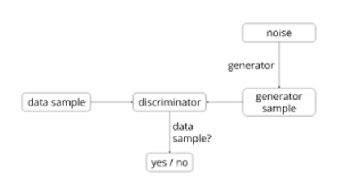
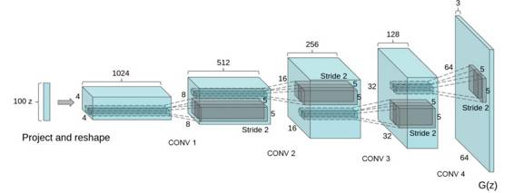
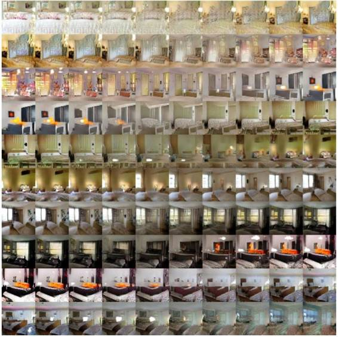
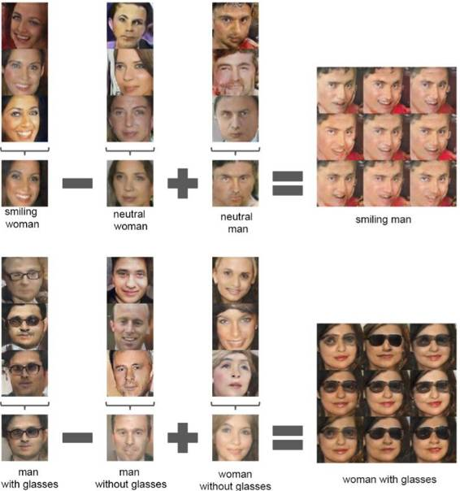
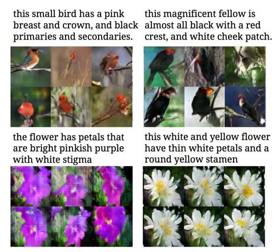
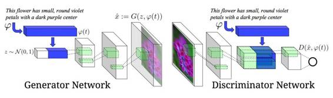

# 深度 | 一篇文章带你进入无监督学习：从基本概念到四种实现模型（附论文）

选自 Eugenio Culurciello's blog

**作者：Eugenio Culurciello**

**机器之心编译**

**参与：李亚洲、武竞**

> *这是今年 6 月份普渡大学副教授 Eugenio Culurciello 写的一篇关于无监督学习的概述性文章。除了基本概念，本文还介绍了无监督学习的四种实现模型：*聚类学习、自动编码器、生成模型、PredNet。*前几日，Culurciello 教授根据最近无监督学习的发展对此篇文章进行了更新与调整，机器之心对此进行了编译。文中提到的论文可点击「阅读原文」下载。*

注：刘帝伟（译者）、刘翔宇（审校）两位老师对 6 月份的版本进行了编译并发布到了 CSDN 极客头条上，此篇编译文章借用了两位老师之前的翻译（有部分调整），如有不允，请联系机器之心，谢谢！

无监督学习可谓是深度学习的圣杯，其目标是建立可兼容小数据集进行训练的通用系统，即便是很少的数据。

如今深度学习模型往往在大型监督型数据集上训练。所谓监督型数据集，即每条数据都有一个对应的标签。比如流行的 ImageNet 数据集，有一百万张人为标记的图像。一共有 1000 个类，每个类有 1000 张图像。创建这样的数据集需要花费大量的精力，同时也需要很多的时间。现在想象创建一个有 1M 个类的数据集。试想一下，对有 100M 数据帧的视频数据集的每一帧进行分类。该任务量简直不可估量。

现在，回想一下你在小时候是如何进行学习的。是的，那时候会有人指导你，你的父母会告诉你这是一个「猫」，但是他们不会在你余生的每一分每一秒都告诉你这是一只「猫」！如今的监督学习也是这样：我一次一次地告诉你，什么是「猫」，也许高达 100 万次。然后你的深度学习模型就学会了。

理想情况下，我们希望有一个模型，它的表现与我们的大脑非常相似。只需少量的标签便可理解这个多类的世界。这里所说的类，主要是指对象类、动作类、环境类、对象组成类等等。

**基本概念**

无监督学习研究的主要目标是预训练一个模型（称作「识别」或「编码」）网络，供其他任务使用。编码特征通常能够用到分类任务中：例如在 ImageNet 上训练会表现出很好的结果，这与监督模型非常接近。

迄今为止，监督模型总是比无监督的预训练模型表现的要好。其主要原因是监督模型对数据集的特性编码的更好。但如果模型运用到其他任务，监督工作是可以减少的。在这方面，希望达到的目标是无监督训练可以提供更一般的特征，用于学习并实现其它任务。

**自动编码器（auto-encoders）**

该理论主要源于 1996 年 Bruno Olshausen 和 David Field（参见论文：Sparse Coding with an Overcomplete Basis Set：A Strategy Employed by V1）发表的文章。此文表明，编码理论可应用于视觉皮层感受野。他们发现，我们大脑的主要视觉皮层（V1）使用稀疏原理来创建可以用来重建输入图像的最小基函数子集。

YannLeCun 团队在该领域也做了很多工作。在余下的文章中，你将看到一个很好的例子来解释类似 V1 的稀疏滤波器是如何学习的。

栈式自动编码器也会被用到，以贪婪式的方式逐层重复训练。

自动编码器方法也被称为「直接映射」方法。

**自编码器/稀疏编码/堆栈自编码器的优点与缺点**

优点：

*   简单技术：重建输入

*   可堆栈多层

*   直觉型，且基于神经科学研究

缺点：

*   贪婪训练每一层

*   没有全局优化

*   比不上监督学习的表现

*   层一多会失效

*   输入的重建可能不是学习通用表征的理想度量（metric）

**聚类学习（Clustering Learning）**

一种技术是使用 K-均值聚类来学习多层的 filters。

我们团队将这种技术命名为：聚类学习（参见论文：Clustering Learning for Robotic Vision）、聚类联结（参见论文：An Analysis of the Connections Between Layers of Deep Neural Networks）和卷积聚类（参见论文：Convolutional Clustering for Unsupervised Learning），最近它们在 STL-10 无监督数据集上取得了非常好的结果。

我们在此领域的研究独立于 Adam Coates 和吴恩达（参见论文：Learning Feature Representations with K-means）的研究。

众所周知，受限玻尔兹曼机（RBMs）、深度玻尔兹曼机（DBMs）、深度信念网络（DBNs）难以训练，因为解决其配分函数（partition function）的数值难题。因此它们还未被普遍用来解决问题。

**聚类学习的优缺点**

优点：

*   简单技术：聚类相似输出

*   可被多层堆栈

*   直觉型，且基于神经科学研究

缺点：

*   贪婪训练每一层

*   没有全局优化

*   在一些情况下，比不上监督学习的表现

*   层数增加时会失效，收益递减

**生成模型（generative models）**

生成模型，尝试在同一时间创建一个分类（识别器或编码器）网络和一个生成图像（生成模型）模型。这种方法起源于 Ian Goodfellow 和 Yoshua Bengio（参见论文：Generative Adversarial Networks）的开创性工作。

Alec Radford、Luke Metz 和 Soumith Chintala 的 DCGAN（参见论文：Unsupervised Representation Learning with Deep Convolutional Generative Adversarial Networks）是一种生成对抗模型，实例化这种模型，能够得到很好的结果。

下面是系统框架图：

DCGAN 识别器的目的是识别输入图像是否真实，或来自数据集，或是生成器生成的伪图。该生成器需要一个随机噪声向量（用 1024 个数值表示）作为输入，并产生一个图像。

在 DCGAN 中，生成器网络如下：

识别器是一个标准的神经网络。详情请见下文。

关键是以并行的方式训练两个网络而不是完全地过度拟合，从而复制数据集。学习特征需要推广到未知的实例，因此用于学习的数据集将不能再用。

Torch7 提供了 DCGAN 训练代码（代码地址:https://github.com/soumith/dcgan.torch），可用于实验中。

在生成器和识别器网络训练好之后，两者便可使用了。主要目标是为其它任务训练一个很好的识别器网络，例如对其它数据集进行分类。生成器则可用于生成随机向量的图像。这些图像有着非常有趣的特性。首先，他们提供了输入空间的平滑转换。看下面这个例子，它展示了在 9 个随机输入向量之间进行移动产出的图像：

 

输入向量空间还提供数学特性，表明学习特征是根据相似性进行组织的：

 

由生成器学到的光滑空间表明识别器也具有类似的性质，使它成为图像编码出色的特征提取器。这在不连续图像数据集训练 CNN 网络的经典问题上很有帮助，在这些数据集，对抗性噪声往往致使其走向失败（参见论文：Intriguing properties of neural networks）。

近期对 GAN 训练的一次更新（参见论文：Improved Techniques for Training GANs）取得了在 CIFAR-10（只有 1000 个标记样本）上的 21% 错误率。

最近关于 infoGAN（参见论文：InfoGAN: Interpretable Representation Learning by Information Maximizing Generative Adversarial Nets）的一篇论文能够产生带有可被松解（disentangled）和有更多尤其意义的图片特征的非常锐利的图像。然而他们没有报告在任务或数据集上学习特征的表现，从而作为对比。

另一个有趣的例子是作者使用生成式对抗训练来学习如何产生图像的文本描述。如下图：

我对此工作的赞赏之处在于它使用文本描述作为生成器的输入，这与随机向量完全不同，因此能够准确控制生成器的输出。如下图：

 

优点：

*   整个网络的全局训练（global training）

*   代码和应用简单明了

缺点：

*   难以训练和转化（conversion）

*   在某些情况下，与有监督学习的表现相似

*   需论证展示方法（representation）的可用性（这是所有无监督算法面临的问题）

通过设定不需要标签的无监督学习任务，并设立训练目标解决任务，这些模型直接从无标签的数据学习。

解决拼图谜题的无监督学习的视觉展示是一个很好的例子。作者将图像拆分，并以拼图谜题的形式呈现，最后通过训练一个深度神经网络来解决这个谜题。训练得到的网络是产生最好结果的预训练网络之一。

图像块（patch）和局部（locality）的无监督学习的视觉展示的也是一个很好的例子。这里，他们使用同一张图像上的两个位置相近的图像块。从统计数据来看，这 2 个图像块反映的是同一个对象。第 3 个图像块是随机从图片的任意位置获取的，从统计数据来看，与其它 2 个图像块反映的不是同一个对象。

然后，将这 3 种图像块传入一个深度神经网络进行训练，以区分相同对象和不同对象。训练得到的网络是产生最好结果的预训练网络之一。

立体图像重建的无监督学习的视觉展示，例如通过左视图重建右视图。虽然这不是无监督学习的特有工作，但它可以使用无监督学习！

使用替代类别（surrogate category）的无监督学习的视觉展示，使用图像块来创建大量的替代类别。增强这些图像块，然后用于训练基于增强替代类别的有监督网络。这给出了无监督特征学习的最好结果之一。

使用视频的无监督学习的视觉展示，使用 LSTM 作为编码/解码器。LSTM 编码器通过运行一组视频帧（video frame）序列，来生成内部图像。这个内部图像然后通过另一个 LSTM 解码器，来产生一组目标序列。为了达到无监督学习，一种方法是预测与输入序列相同的序列。另一种方式是预测未来的视频帧。

另一篇论文（MIT：Vondrick 和 Torralba）的视频有令人非常信服的结果。这项工作从 2015 年 4 月就开始了！这个思路的亮点是从视频输入来预测未来帧的图像。它使用的模型如下：

**PredNet**

PredNet 是一个用于预测视频未来帧的网络。这个网址有很好的例子：https://coxlab.github.io/prednet/

PredNet 是一个非常聪明的神经网络模型，在我们看来，它将在未来的神经网络中的发挥重要的作用。PredNet 的神经网络架构超越了单个有监督的 CNN 框架。PredNet 结合了生物启发和生物导向模型 [ 模拟人类大脑模型 ]（参见论文 https://papers.nips.cc/paper/1083-unsupervised-pixel-prediction.pdf）。它使用预测编码和使用 [ 神经模型中的反馈连接 ]（参见论文 http://arxiv.org/abs/1608.03425）。以下是 PredNet 模型和 2 个堆叠层（stacked layer）的示例：

该模型还具有以下优点：

*   使用无标签数据训练！

*   每层纳入损失函数（loss function）计算误差

*   通过监视错误信号来在线学习（online-learning）：当它不能正确预测输出时，它知道模型需要学习更新了

**未来**

未来由你创造。无监督学习是一个非常开放的主题，你可以通过以下方式做出巨大贡献：

*   创建一个新的无监督任务来训练神经网络，例如：解决一个谜题，对比图像块，生成图像，等等。

*   思考创建更好的无监督特征训练任务，例如：什么是对象以及什么是背景，立体图像的相同物体识别，视频帧的相同物体识别…… 这与人类的视觉系统的进化相似。

******©本文由机器之心编译，***转载请联系本公众号获得授权******。***

✄------------------------------------------------

**加入机器之心（全职记者/实习生）：hr@almosthuman.cn**

**投稿或寻求报道：editor@almosthuman.cn**

**广告&商务合作：bd@almosthuman.cn**

