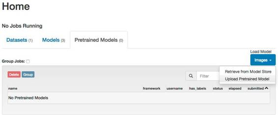
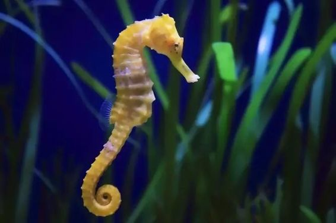

# 机器学习初学者入门实践：怎样轻松创造高精度分类网络

选自 Github

**机器之心编译**

这是一个为没有人工智能背景的程序员提供的机器学习上手指南。使用神经网络不需要博士学位，你也不需要成为实现人工智能下一个突破的人，你只需要使用现有的技术就行了——毕竟我们现在已经实现的东西已经很突破了，而且还非常有用。我认为我们越来越多的人将会和机器学习打交道就像我们之前越来越多地使用开源技术一样——而不再仅仅将其看作是一个研究主题。在这份指南中，我们的目标是编写一个可以进行高准确度预测的程序——仅使用图像本身来分辨 data/untrained-samples 中程序未见过的样本图像中是海豚还是海马。下面是两张图像样本：


为了实现我们的目标，我们将训练和应用一个卷积神经网络（CNN）。我们将从实践的角度来接近我们的目标，而不是阐释其基本原理。目前人们对人工智能有很大的热情，但其中很多都更像是让物理学教授来教你自行车技巧，而不是让公园里你的朋友来教你。

为此，我（GitHub 用户 humphd/David Humphrey）决定在 GitHub 上写下我的指南，而不是直接发在博客上，因为我知道我下面的写的一切可能会有些误导、天真或错误。我目前仍在自学，我发现现在还很缺乏可靠的初学者文档。如果你觉得文章有错误或缺失了某些重要的细节，请发送一个 pull 请求。下面就让我教你「自行车的技巧」吧！

指南地址：https://github.com/humphd

**概述**

我们将在这里探索以下内容：

*   设置和使用已有的、开源的机器学习技术，尤其是 Caffe 和 DIDITS

*   创建一个图像数据集

*   从头开始训练一个神经网络

*   在我们的神经网络从未见过的图像上对其进行测试

*   通过微调已有的神经网络（AlexNet 和 GoogLeNet）来提升我们的神经网络的准确度

*   部署和使用我们的神经网络

***问：我知道你说过我们不会谈论神经网络理论，但我觉得在我们开始动手之前至少应该来一点总体概述。我们应该从哪里开始？***

对于神经网络的理论问题，你能在网上找到海量的介绍文章——从短帖子到长篇论述到在线课程。根据你喜欢的学习形式，这里推荐了三个比较好的起点选择：

*   J Alammar 的博客《A Visual and Interactive Guide to the Basics of Neural Networks》非常赞，使用直观的案例介绍了神经网络的概念：https://jalammar.github.io/visual-interactive-guide-basics-neural-networks/

*   Brandon Rohrer 的这个视频是非常好的卷积神经网络介绍：https://www.youtube.com/watch?v=FmpDIaiMIeA

*   如果你想了解更多理论上的知识，我推荐 Michael Nielsen 的在线书籍《Neural Networks and Deep Learning》：http://neuralnetworksanddeeplearning.com/index.html

**设置**

**安装 Caffe**

Caffe 地址：http://caffe.berkeleyvision.org/

首先，我们要使用来自伯克利视觉和学习中心（Berkely Vision and Learning Center）的 Caffe 深度学习框架（BSD 授权）。

***问：稍等一下，为什么选择 Caffe？为什么不选现在人人都在谈论的 TensorFlow？***

没错，我们有很多选择，你也应该了解一下所有的选项。TensorFlow 确实很棒，你也应该试一试。但是这里选择 Caffe 是基于以下原因：

*   这是为计算机视觉问题定制的

*   支持 C++ 和 Python（即将支持 node.js：https://github.com/silklabs/node-caffe）(https://github.com/silklabs/node-caffe%EF%BC%89)

*   快速且稳定

但是我选择 Caffe 的头号原因是不需要写任何代码就能使用它。你可以声明性地完成所有工作（Caffe 使用结构化的文本文件来定义网络架构），并且也可以使用命令行工具。另外，你也可以为 Caffe 使用一些漂亮的前端，这能让你的训练和验证过程简单很多。基于同样的原因，下面我们会选择 NVIDIA 的 DIGITS。

Caffe 的安装有点麻烦。这里有不同平台的安装说明，包括一些预构建的 Docker 或 AWS 配置：http://caffe.berkeleyvision.org/installation.html

注：当我在进行练习的时候，我使用了来自 GitHub 的尚未发布的 Caffe 版本：https://github.com/BVLC/caffe/commit/5a201dd960840c319cefd9fa9e2a40d2c76ddd73

在 Mac 要配置成功则难得多，这个版本有一些版本问题会在不同的步骤终止你的进度。我用了好几天时间来试错，我看了十几个指南，每一个都有一些不同的问题。最后发现这个最为接近：https://gist.github.com/doctorpangloss/f8463bddce2a91b949639522ea1dcbe4。另外我还推荐：https://eddiesmo.wordpress.com/2016/12/20/how-to-set-up-caffe-environment-and-pycaffe-on-os-x-10-12-sierra/，这篇文章比较新而且链接了许多类似的讨论。

到目前为止，安装 Caffe 就是我们做的最难的事情，这相当不错，因为你可能原来还以为人工智能方面会更难呢！

如果安装遇到问题请不要放弃，痛苦是值得的。如果我会再来一次，我可能会使用一个 Ubuntu 虚拟机，而不是直接在 Mac 上安装。如果你有问题要问，可以到 Caffe 用户讨论组：https://groups.google.com/forum/#!forum/caffe-users

***问：我需要一个强大的硬件来训练神经网络吗？要是我没法获取一个强大的 GPU 怎么办？***

是的，深度神经网络确实需要大量的算力和能量……但那是在从头开始训练并且使用了巨型数据集的情况。我们不需要那么做。我们可以使用一个预训练好的网络（其它人已经为其投入了数百小时的计算和训练），然后根据你的特定数据进行微调即可。我们后面会介绍如何实现这一目标，但首先我要向你说明：后面的一切工作都是在一台没有强大 GPU 的一年前的 MacBook 上完成的。

另外说明一点，因为我有一块集成英特尔显卡，而不是英伟达的 GPU，所以我决定使用 OpenCL Caffe 分支：https://github.com/BVLC/caffe/tree/opencl，它在我的笔记本电脑上效果良好！

当你安装完 Caffe 之后，你应该有或能够做下列事情：

*   一个包含了你构建的 Caffe 的目录。如果你是按标准方式做的，应该会有一个 build/ 目录包含了运行 Caffe 所需的一切、捆绑的 Python 等等，build/ 的父目录将是你的 CAFFE_ROOT（后面我们会用到它）

*   运行 make test && make runtest，应该会通过

*   安装了所有的 Python 依赖包之后（在 python/ 中执行 for req in $(cat requirements.txt); do pip install $req; done；运行 make pycaffe && make pytest 应该会通过

*   你也应该运行 make distribute 以在 distribute/ 中创建一个带有所有必要的头文件、二进制文件等的可分发的 Caffe 版本

在我的机器上，Caffe 完全构建后，我的 CAFFE_ROOT 目录有以下基本布局：

> *caffe/*
> 
> * build/*
> 
> * python/*
> 
> * lib/*
> 
> * tools/*
> 
> * caffe ← this is our main binary *
> 
> * distribute/*
> 
> * python/*
> 
> * lib/*
> 
> * include/*
> 
> * bin/*
> 
> * proto/*

到现在，我们有了训练、测试和编程神经网络所需的一切。下一节我们会为 Caffe 增加一个用户友好的基于网页的前端 DIGITS，这能让我们对网络的训练和测试变得更加简单。

**安装 DIGITS**

DIGITS 地址：https://github.com/NVIDIA/DIGITS

英伟达的深度学习 GPU 训练系统（Deep Learning GPU Training System/DIGITS）是一个用于训练神经网络的 BSD 授权的 Python 网页应用。尽管我们可以在 Caffe 中用命令行或代码做到 DIGITS 所能做到的一切，但使用 DIGITS 能让我们的工作变得更加简单。而且因为 DIGITS 有很好的可视化、实时图表等图形功能，我觉得使用它也能更有乐趣。因为你正在尝试和探索学习，所以我强烈推荐你从 DIGITS 开始。

在 https://github.com/NVIDIA/DIGITS/tree/master/docs 有一些非常好的文档，包括一些安装、配置和启动的页面。我强烈建议你在继续之前通读一下。我并不是一个使用 DIGITS 的专家，如果有问题可以在公开的 DIGITS 用户组查询或询问：https://groups.google.com/forum/#!forum/digits-users

安装 DIGITS 的方式有很多种，从 Docker 到 Linux 上的 pre-baked package，或者你也可以从源代码构建。我用的 Mac，所以我就是从源代码构建的。

注：在我的实践中，我使用了 GitHub 上未发布的 DIGITS 版本：https://github.com/NVIDIA/DIGITS/commit/81be5131821ade454eb47352477015d7c09753d9

因为 DIGITS 只是一些 Python 脚本，所以让它们工作起来很简单。在启动服务器之前你要做的事情是设置一个环境变量，告诉 DIGITS 你的 CAFFE_ROOT 的位置在哪里：

> *export CAFFE_ROOT=/path/to/caffe*
> 
> *./digits-devserver*

注：在 Mac 上，这些服务器脚本出现了一些问题，可能是因为我的 Python 二进制文件叫做 python2，其中我只有 python2.7。

你可以在 /usr/bin 中 symlink 它或在你的系统上修改 DIGITS 启动脚本以使用合适的二进制文件。

一旦服务器启动，你可以在你的浏览器中通过 http://localhost:5000 来完成一切后续工作。

**训练一个神经网络**

训练神经网络涉及到几个步骤：

1\. 准备一个带有分类图像的数据集

2\. 定义网络架构

3\. 使用准备好的数据集训练和验证这个网络

下面我们会做这三个步骤，以体现从头开始和使用预训练的网络之间的差异，同时也展示如何使用 Caffe 和 DIGITS 上最常用的两个预训练的网络 AlexNet、 GoogLeNet。

对于我们的训练，我们将使用一个海豚（Dolphins）和海马（Seahorses）图像的小数据集。这些图像放置在 data/dolphins-and-seahorses。你至少需要两个类别，可以更多（有些我们将使用的网络在 1000 多个类别上进行了训练）。我们的目标是：给我们的网络展示一张图像，它能告诉我们图像中的是海豚还是海马。

**准备数据集**

> *dolphins-and-seahorses/*
> 
> * dolphin/*
> 
> * image_0001.jpg*
> 
> * image_0002.jpg*
> 
> * image_0003.jpg*
> 
> * ...*
> 
> * seahorse/*
> 
> * image_0001.jpg*
> 
> * image_0002.jpg*
> 
> * image_0003.jpg*
> 
> * ...*

最简单的开始方式就是将你的图片按不同类别建立目录：

在上图中的每一个目录都是按将要分类的类别建立的，所建文件夹目录下是将以用于训练和验证的图片。

***问：所有待分类和验证的图片必须是同样大小吗？文件夹的命名有影响吗？***

回答都是「否」。图片的大小会在图片输入神经网络之前进行规范化处理，我们最终需要的图片大小为 256×256 像素的彩色图片，但是 DIGITS 可以很快地自动裁切或缩放（我们采用缩放）我们的图像。文件夹的命名没有任何影响——重要的是其所包含的图片种类。

***问：我能对这些类别做更精细的区分吗？***

当然可以。详见 https://github.com/NVIDIA/DIGITS/blob/digits-4.0/docs/ImageFolderFormat.md。

我们要用这些图片来创建一个新的数据集，准确的说是一个分类数据集（Classification Dataset）。

 

我们会使用 DIGITS 的默认设置，并把我们的训练图片文件路径设置到 data/dolphins-and-seahorses 文件夹。如此一来，DIGITS 将会使用这些标签（dolphin 和 seahorse）来创建一个图像缩放过的数据集——图片的大小将会是 256×256，其中 75% 的为训练图片，25% 的为测试图片。

给你的数据集起一个名字，如 dolphins-and-seahorses，然后鼠标点击创建（Create）。

 

通过上面的步骤我们已经创建了一个数据集了，在我的笔记本上只需要 4 秒就可以完成。最终在所建的数据集里有 2 个类别的 92 张训练图片（其中 49 张 dolphin，43 张 seahorse），另外还有 30 张验证图片（16 张 dolphin 和 14 张 seahorse）。不得不说这的确是一个非常小的数据集，但是对我们的示范试验和 DIGITS 操作学习来说已经足够了，因为这样网络的训练和验证就不会用掉太长的时间了。

你可以在这个数据库文件夹里查看压缩之后的图片。


**训练尝试 1：从头开始**

回到 DIGITS 的主页，我们需要创建一个新的分类模型（Classification Model）：

 

我们将开始用上一步所建立的 dolphins-and-seahorses 数据集来训练模型，仍然使用 DIGITS 的默认设置。对于第一个神经网络模型，我们可以从提供的神经网络架构中选取一个既有的标准模型，即 AlexNet。AlexNet 的网络结构在 2012 年的计算机视觉竞赛 ImageNet 中获胜过（ImageNet 为计算机视觉顶级比赛）。在 ImageNet 竞赛里需要完成 120 万张图片中 1000 多类图片的分类。

 

Caffe 使用结构化文本文件（structured text files）来定义网络架构，其所使用的文本文件是基于谷歌的 Protocol Buffer。你可以阅读 Caffe 采用的方案：https://github.com/BVLC/caffe/blob/master/src/caffe/proto/caffe.proto。其中大部分内容在这一部分的神经网络训练的时候都不会用到，但是了解这些构架对于使用者还是很有用的，因为在后面的步骤里我们将会对它们进行调整。AlexNet 的 prototxt 文件是这样的，一个实例： https://github.com/BVLC/caffe/blob/master/models/bvlc_alexnet/train_val.prototxt。

我们将会对这个神经网络进行 30 次 epochs，这意味着网络将会进行学习（运用我们的训练图片）并自行测试（运用我们的测试图片），然后根据训练的结果调整网络中各项参数的权重值，如此重复 30 次。每一次 epoch 都会输出一个分类准确值（Accuracy，介于 0% 到 100% 之间，当然值越大越好）和一个损失度（Loss，所有错误分类的比率，值越小越好）。理想的情况是我们希望所训练的网络能够有较高的准确率（Accuracy）和较小的损失度（Loss）。

初始训练的时候，所训练网络的准确率低于 50%。这是情理之中的，因为第一次 epoch，网络只是在随意猜测图片的类别然后任意设置权重值。经过多次 epochs 之后，最后能够有 87.5% 的准确率，和 0.37 的损失度。完成 30 次的 epochs 只需不到 6 分钟的时间。

 

我们可以上传一张图片或者用一个 URL 地址的图片来测试训练完的网络。我们来测试一些出现在我们训练和测试数据集中的图片：


 

网络的分类结果非常完美，当我们测试一些不属于我们训练和测试数据集的其他图片时：

 

分类的准确率直接掉下来了，误把 seahorse 分类为 dolphin，更糟糕的是网络对这样的错误分类有很高的置信度。

事实是我们的数据集太小了，根本无法用来训练一个足够好的神经网络。我们需要数万乃至数百万张图片才能训练一个有用的神经网络，用这么多的图片也意味着需要很强劲的计算能力来完成所有的计算过程。

**训练尝试 2：微调 AlexNet**

怎么微调网络

从头设计一个神经网络，收集足量的用以训练这个网络的数据（如，海量的图片），并在 GPU 上运行数周来完成网络的训练，这些条件远非我们大多数人可以拥有。能够以更加实际——用较小一些的数据集来进行训练，我们运用一个称为迁移学习（Transfer Learning）或者说微调（Fine Tuning）的技术。Fine tuning 借助深度学习网络的输出，运用已训练好的神经网络来完成最初的目标识别。

试想使用神经网络的过程就好比使用一个双目望远镜看远处的景物。那么当你第一次把双目望远镜放到眼前的时候，你看到的是一片模糊。当你开始调焦的时候，你慢慢可以看出颜色、线、形状，然后最终你可以分辨出鸟的外形，在此之上你进一步调试从而可以识别出鸟的种类。

在一个多层网络中，最开始的几层是用于特征提取的（如，边线），之后的网络层通过这些提取的特征来识别外形「shape」（如，一个轮子，一只眼睛），然后这些输出将会输入到最后的分类层，分类层将会根据之前所有层的特征积累来确定待分类目标的种类（如，判断为猫还是狗）。一个神经网络从像素、线形、眼睛、两只眼睛的确定位置，这样的步骤来一步步确立分类目标的种类（这里是猫）。

我们在这里所做的就是给新的分类图片指定一个已训练好的网络用于初始化网络的权重值，而不是用新构建网络自己的初始权重。因为已训练好的网络已经具备「看」图片特征的功能的，我们所需要的是这个已训练的网络能「看」我们所建图片数据集——这一具体任务中特定类型的图片。我们不需要从头开始训练大部分的网络层——我们只需要将已训练网络中已经学习的层转接到我们新建的分类任务上来。不同于我们的上一次的实验，在上次实验中网络的初始权重值是随机赋予的，这次实验中我们直接使用已经训练网络的最终权重值作为我们新建网络的初始权重值。但是，必须去除已经训练好的网络的最后分类层并用我们自己的图片数据集再次训练这个网络，即在我们自己的图片类上微调已训练的网络。

对于这次实验，我们需要一个与经由与我们训练数据足够相似的数据集所训练的网络，只有这样已训练网络的权重值才对我们有用。幸运的是，我们下面所使用的网络是在海量数据集（自然图片集 ImageNet）上训练得到的，这样的已训练网络能满足大部分分类任务的需要。

这种技术已经被用来做一些很有意思的任务如医学图像的眼疾筛查，从海里收集到的显微图像中识别浮游生物物种，给 Flickr 上的图片进行艺术风格分类。

完美的完成这些任务，就像所有的机器学习一样，你需要很好的理解数据以及神经网络结构——你必须对数据的过拟合格外小心，你或许需要调整一些层的设置，也很有可能需要插入一些新的网络层，等等类似的调整。但是，我们的经验表明大部分时候还是可以完成任务的「Just work」，而且用我们这么原始的方法去简单尝试一下看看结果如何是很值得的。

上传预训练网络

在我们的第一次尝试中，我们使用了 AlexNet 的架构，但是网络各层的权重是随机分布的。我们需要做的就是需要下载使用一个已经经过大量数据集训练的 AlexNet。

AlexNet 的快照（Snapshots）如下，可供下载：https://github.com/BVLC/caffe/tree/master/models/bvlc_alexnet。我们需要一个二进制文件 .caffemodel，含有训练好的权重，可供下载 http://dl.caffe.berkeleyvision.org/bvlc_alexnet.caffemodel。在你下载这些与训练模型的时候，让我们来趁机多学点东西。2014 年的 ImageNet 大赛中，谷歌利用其开源的 GoogLeNet (https://research.google.com/pubs/pub43022.html)（一个 22 层的神经网络）赢得了比赛。GoogLeNet 的快照如下，可供下载： https://github.com/BVLC/caffe/tree/master/models/bvlc_googlenet。在具备了所有的预训练权重之后，我们还需要.caffemodel 文件，可供下载：http://dl.caffe.berkeleyvision.org/bvlc_googlenet.caffemodel.

有了 .caffemodel 文件之后，我们既可以将它们上传到 DIGITS 当中。在 DIGITS 的主页当中找到预训练模型（Pretrained Models）的标签，选择上传预训练模型（Upload Pretrained Model）：



对于这些预训练的模型，我们可以使用 DIGITS 的默认值（例如，大小为 256×256 像素的彩色图片）。我们只需要提供 Weights (.caffemodel) 和 Model Definition (original.prototxt)。点击这些按钮来选择文件。

模型的定义，GoogLeNet 我们可以使用 https://github.com/BVLC/caffe/blob/master/models/bvlc_googlenet/train_val.prototxt，AlexNet 可以使用 https://github.com/BVLC/caffe/blob/master/models/bvlc_alexnet/train_val.prototxt。我们不打算使用这些网络的分类标签，所以我们可以直接添加一个 labels.txt 文件：

 

在 AlexNet 和 GoogLeNet 都重复这一过程，因为我们在之后的步骤当中两者我们都会用到。

***问题：有其他的神经网络能作为微调的基础吗？***

回答：Caffe Model Zoo 有许多其他预训练神经网络可供使用，详情请查看 https://github.com/BVLC/caffe/wiki/Model-Zoo

使用预训练 Caffe 模型进行人工神经网络训练就类似于从头开始实现，虽然我们只需要做一些调整。首先我们需要将学习速率由 0.01 调整到 0.001，因为我们下降步长不需要这么大（我们会进行微调）。我们还将使用预训练网络（Pretrained Network）并根据实际修改它。

 

在预训练模型的定义（如原文本）中，我们需要对最终完全连接层（输出结果分类的地方）的所有 references 重命名。我们这样做是因为我们希望模型能从现在的数据集重新学习新的分类，而不是使用以前最原始的训练数据（我们想将当前最后一层丢弃）。我们必须将最后的全连接层由「fc8」重命名为一些其他的（如 fc9）。最后我们还需要将分类类别从 1000 调整为 2，这里需要调整 num_output 为 2。

下面是我们需要做的一些调整代码：

```py
@@ -332,8 +332,8 @@
 }
 layer {-  name: "fc8"+  name: "fc9"
   type: "InnerProduct"
   bottom: "fc7"-  top: "fc8"+  top: "fc9"
   param {
     lr_mult: 1@@ -345,5 +345,5 @@
   }
   inner_product_param {-    num_output: 1000+    num_output: 2
     weight_filler {
       type: "gaussian"@@ -359,5 +359,5 @@
   name: "accuracy"
   type: "Accuracy"-  bottom: "fc8"+  bottom: "fc9"
   bottom: "label"
   top: "accuracy"@@ -367,5 +367,5 @@
   name: "loss"
   type: "SoftmaxWithLoss"-  bottom: "fc8"+  bottom: "fc9"
   bottom: "label"
   top: "loss"@@ -375,5 +375,5 @@
   name: "softmax"
   type: "Softmax"-  bottom: "fc8"+  bottom: "fc9"
   top: "softmax"
   include { stage: "deploy" }
```

我已经将所有的改进文件放在 src/alexnet-customized.prototxt 里面。

这一次，我们的准确率由 60% 多先是上升到 87.5%，然后到 96% 一路到 100%，同时损失度也稳步下降。五分钟后，我们的准确率到达了 100%，损失也只有 0.0009。

 

测试海马图像时以前的网络会出错，现在我们看到完全相反的结果，即使是小孩画的海马，系统也 100% 确定是海马，海豚的情况也一样。

 


 

即使你认为可能很困难的图像，如多个海豚挤在一起，并且它们的身体大部分在水下，系统还是能识别。


**训练尝试 3：微调 GoogLeNet**

像前面我们微调 AlexNet 模型那样，同样我们也能用 GoogLeNet。修改这个网络会有点棘手，因为你已经定义了三层全连接层而不是只有一层。

 

在这个案例中微调 GoogLeNet，我们需要再次创建一个新的分类模型：我们需要重命名三个全连接分类层的所有 references，即 loss1/classifier、loss2/classifier 和 loss3/classifier，并重新定义结果类别数（num_output: 2）。下面是我们需要将三个分类层重新命名和从 1000 改变输出类别数为 2 的一些代码实现。

```py
@@ -917,10 +917,10 @@
   exclude { stage: "deploy" }
 }
 layer {-  name: "loss1/classifier"+  name: "loss1a/classifier"
   type: "InnerProduct"
   bottom: "loss1/fc"-  top: "loss1/classifier"+  top: "loss1a/classifier"
   param {
     lr_mult: 1
     decay_mult: 1@@ -930,7 +930,7 @@
     decay_mult: 0
   }
   inner_product_param {-    num_output: 1000+    num_output: 2
     weight_filler {
       type: "xavier"
       std: 0.0009765625@@ -945,7 +945,7 @@
 layer {
   name: "loss1/loss"
   type: "SoftmaxWithLoss"-  bottom: "loss1/classifier"+  bottom: "loss1a/classifier"
   bottom: "label"
   top: "loss1/loss"
   loss_weight: 0.3@@ -954,7 +954,7 @@
 layer {
   name: "loss1/top-1"
   type: "Accuracy"-  bottom: "loss1/classifier"+  bottom: "loss1a/classifier"
   bottom: "label"
   top: "loss1/accuracy"
   include { stage: "val" }@@ -962,7 +962,7 @@
 layer {
   name: "loss1/top-5"
   type: "Accuracy"-  bottom: "loss1/classifier"+  bottom: "loss1a/classifier"
   bottom: "label"
   top: "loss1/accuracy-top5"
   include { stage: "val" }@@ -1705,10 +1705,10 @@
   exclude { stage: "deploy" }
 }
 layer {-  name: "loss2/classifier"+  name: "loss2a/classifier"
   type: "InnerProduct"
   bottom: "loss2/fc"-  top: "loss2/classifier"+  top: "loss2a/classifier"
   param {
     lr_mult: 1
     decay_mult: 1@@ -1718,7 +1718,7 @@
     decay_mult: 0
   }
   inner_product_param {-    num_output: 1000+    num_output: 2
     weight_filler {
       type: "xavier"
       std: 0.0009765625@@ -1733,7 +1733,7 @@
 layer {
   name: "loss2/loss"
   type: "SoftmaxWithLoss"-  bottom: "loss2/classifier"+  bottom: "loss2a/classifier"
   bottom: "label"
   top: "loss2/loss"
   loss_weight: 0.3@@ -1742,7 +1742,7 @@
 layer {
   name: "loss2/top-1"
   type: "Accuracy"-  bottom: "loss2/classifier"+  bottom: "loss2a/classifier"
   bottom: "label"
   top: "loss2/accuracy"
   include { stage: "val" }@@ -1750,7 +1750,7 @@
 layer {
   name: "loss2/top-5"
   type: "Accuracy"-  bottom: "loss2/classifier"+  bottom: "loss2a/classifier"
   bottom: "label"
   top: "loss2/accuracy-top5"
   include { stage: "val" }@@ -2435,10 +2435,10 @@
   }
 }
 layer {-  name: "loss3/classifier"+  name: "loss3a/classifier"
   type: "InnerProduct"
   bottom: "pool5/7x7_s1"-  top: "loss3/classifier"+  top: "loss3a/classifier"
   param {
     lr_mult: 1
     decay_mult: 1@@ -2448,7 +2448,7 @@
     decay_mult: 0
   }
   inner_product_param {-    num_output: 1000+    num_output: 2
     weight_filler {
       type: "xavier"
     }@@ -2461,7 +2461,7 @@
 layer {
   name: "loss3/loss"
   type: "SoftmaxWithLoss"-  bottom: "loss3/classifier"+  bottom: "loss3a/classifier"
   bottom: "label"
   top: "loss"
   loss_weight: 1@@ -2470,7 +2470,7 @@
 layer {
   name: "loss3/top-1"
   type: "Accuracy"-  bottom: "loss3/classifier"+  bottom: "loss3a/classifier"
   bottom: "label"
   top: "accuracy"
   include { stage: "val" }@@ -2478,7 +2478,7 @@
 layer {
   name: "loss3/top-5"
   type: "Accuracy"-  bottom: "loss3/classifier"+  bottom: "loss3a/classifier"
   bottom: "label"
   top: "accuracy-top5"
   include { stage: "val" }@@ -2489,7 +2489,7 @@
 layer {
   name: "softmax"
   type: "Softmax"-  bottom: "loss3/classifier"+  bottom: "loss3a/classifier"
   top: "softmax"
   include { stage: "deploy" }
 }
```

我己经将完整的文件放在 src/googlenet-customized.prototxt 里面。

***问题：这些神经网络的原文本（prototext）定义需要做什么修改吗？我们修改了全连接层名和输出结果分类类别数，那么在什么情况下其它参数也能或也需要修改的？***

回答：问得好，这也是我有一些疑惑的地方。例如，我知道我们能「固定」确切的神经网络层级，并保证层级之间的权重不改变。但是要做其它的一些改变就涉及到理解我们的神经网络层级是如何起作用的，这已经超出了这份入门向导的范围，同样也超出了这份向导作者现有的能力。

就像我们对 AlexNet 进行微调，将下降的学习速率由 0.01 减少十倍到 0.001 一样。

***问：还有什么修改是对这些网络微调有意义的？遍历所有数据的次数（numbers of epochs）不同怎么样，改变批量梯度下降的大小（batch sizes）怎么样，求解器的类型（Adam、 AdaDelta 和 AdaGrad 等）呢？还有下降学习速率、策略（Exponential Decay、Inverse Decay 和 Sigmoid Decay 等）、步长和 gamma 值呢？***

问得好，这也是我有所疑惑的。我对这些只有一个模糊的理解，如果你知道在训练中如何修改这些值，那么我们很可能做出些改进，并且这需要更好的文档。

因为 GoogLeNet 比 AlexNet 有更复杂的网络构架，所以微调需要更多的时间。在我的笔记本电脑上，用我们的数据集重新训练 GoogLeNet 需要 10 分钟，这样才能实现 100% 的准确率，同时损失函数值只有 0.0070。

 

正如我们看到的 AlexNet 微调版本，我们修改过的 GoogLeNet 表现得十分惊人，是我们目前最好的。


 

**使用我们的模型**

我们的网络在训练和检测之后，就可以下载并且使用了。我们利用 DIGITS 训练的每一个模型都有了一下载模型（Download Model）键，这也是我们在训练过程中选择不同 snapshots 的一种方法（例如 Epoch #30）：

 

在点击 Download Model 之后，你就会下载一个 tar.gz 的文档，里面包含以下文件：

```py
deploy.prototxt
mean.binaryproto
solver.prototxt
info.json
original.prototxt
labels.txt
snapshot_iter_90.caffemodel
train_val.prototxt
```

在 Caffe 文档中对我们所建立的模型使用有一段非常好的描述。如下：

> *一个网络是由其设计，也就是设计（prototxt）和权重（.caffemodel）决定。在网络被训练的过程中，网络权重的当前状态被存储在一个.caffemodel 中。这些东西我们可以从训练/检测阶段移到生产阶段。在它的当前状态中，网络的设计并不是为了部署的目的。在我们可以将我们的网络作为产品发布之前，我们通常需要通过几种方法对它进行修改：*
> 
> *1\. 移除用来训练的数据层，因为在分类时，我们已经不再为数据提供标签了。*
> 
> *2\. 移除所有依赖于数据标签的层。*
> 
> *3\. 设置接收数据的网络。*
> 
> *4\. 让网络输出结果。*

DIGITS 已经为我们做了这些工作，它已经将我们 prototxt 文件中所有不同的版本都分离了出来。这些文档我们在使用网络时会用到：

*   deploy.prototxt -是关于网络的定义，准备接收图像输入数据

*   mean.binaryproto - 我们的模型需要我们减去它处理的每张图像的图像均值，所产生的就是平均图像（mean image）。

*   labels.txt - 标签列表 (dolphin, seahorse)，以防我们想要把它们打印出来，否则只有类别编号。

*   snapshot_iter_90.caffemodel -这些是我们网络的训练权重。

利用这些文件，我们可以通过多种方式对新的图像进行分类。例如，在 CAFFE_ROOT 中，我们可以使用 build/examples/cpp_classification/classification.bin 来对一个图像进行分类：

> ***$ cd $CAFFE_ROOT/build/examples/cpp_classification***
> 
> ***$ ./classification.bin deploy.prototxt snapshot_iter_90.caffemodel mean.binaryproto labels.txt dolphin1.jpg***

这会产生很多的调试文本，后面会跟着对这两种分类的预测结果：

> ***0.9997 -「dolphin」***
> 
> ***0.0003 -「seahorse」***

你可以在这个 Caffe 案例中查看完整的 C++ 源码：https://github.com/BVLC/caffe/tree/master/examples

使用 Python 界面和 DIGITS 进行分类的案例：https://github.com/NVIDIA/DIGITS/tree/master/examples/classification

最后，Caffe 的案例中还有一个非常好的 Python 演示：https://github.com/BVLC/caffe/blob/master/examples/00-classification.ipynb

我希望可以有更多更好的代码案例、API 和预先建立的模型等呈现给大家。老实说，我找到的大多数代码案例都非常的简短，并且文档介绍很少——Caffe 的文档虽然有很多，但也有好有坏。对我来说，这似乎意味着会有人为初学者建立比 Caffe 更高级的工具。如果说在高级语言中出现了更加简单的模型，我可以用我们的模型「做正确的事情」；应该有人将这样的设想付诸行动，让使用 Caffe 模型变得像使用 DIGITS 训练它们一样简单。当然我们不需要对这个模型或是 Caffe 的内部了解那么多。虽然目前我还没有使用过 DeepDetect，但是它看起来非常的有趣，另外仍然还有其他我不知道的工具。

**结果**

文章开头提到，我们的目标是编写一个使用神经网络对 data/untrained-samples 中所有的图像进行高准确度预测的程序。这些海豚和海马的图像是在训练数据或是验证数据时候从未使用过的。

**未被训练过的海豚图像**


**未被训练过的海马图像**





接下来，让我们一起来看看在这一挑战当中存在的三次尝试的结果：

模型尝试 1： 从零开始构建 AlexNet（第 3 位）

| Image | Dolphin | Seahorse | Result |
| --- | --- | --- | --- |
| dolphin1.jpg | 71.11% | 28.89% | <g-emoji alias="expressionless" fallback-src="https://assets-cdn.github.com/images/icons/emoji/unicode/1f611.png" ios-version="6.0">😑</g-emoji> |
| dolphin2.jpg | 99.2% | 0.8% | <g-emoji alias="sunglasses" fallback-src="https://assets-cdn.github.com/images/icons/emoji/unicode/1f60e.png" ios-version="6.0">😎</g-emoji> |
| dolphin3.jpg | 63.3% | 36.7% | <g-emoji alias="confused" fallback-src="https://assets-cdn.github.com/images/icons/emoji/unicode/1f615.png" ios-version="6.0">😕</g-emoji> |
| seahorse1.jpg | 95.04% | 4.96% | <g-emoji alias="disappointed" fallback-src="https://assets-cdn.github.com/images/icons/emoji/unicode/1f61e.png" ios-version="6.0">😞</g-emoji> |
| seahorse2.jpg | 56.64% | 43.36 | <g-emoji alias="confused" fallback-src="https://assets-cdn.github.com/images/icons/emoji/unicode/1f615.png" ios-version="6.0">😕</g-emoji> |
| seahorse3.jpg | 7.06% | 92.94% | <g-emoji alias="grin" fallback-src="https://assets-cdn.github.com/images/icons/emoji/unicode/1f601.png" ios-version="6.0">😁</g-emoji> |

模型尝试 2：微调 AlexNet（第 2 位）

| Image | Dolphin | Seahorse | Result |
| --- | --- | --- | --- |
| dolphin1.jpg | 99.1% | 0.09% | <g-emoji alias="sunglasses" fallback-src="https://assets-cdn.github.com/images/icons/emoji/unicode/1f60e.png" ios-version="6.0">😎</g-emoji> |
| dolphin2.jpg | 99.5% | 0.05% | <g-emoji alias="sunglasses" fallback-src="https://assets-cdn.github.com/images/icons/emoji/unicode/1f60e.png" ios-version="6.0">😎</g-emoji> |
| dolphin3.jpg | 91.48% | 8.52% | <g-emoji alias="grin" fallback-src="https://assets-cdn.github.com/images/icons/emoji/unicode/1f601.png" ios-version="6.0">😁</g-emoji> |
| seahorse1.jpg | 0% | 100% | <g-emoji alias="sunglasses" fallback-src="https://assets-cdn.github.com/images/icons/emoji/unicode/1f60e.png" ios-version="6.0">😎</g-emoji> |
| seahorse2.jpg | 0% | 100% | <g-emoji alias="sunglasses" fallback-src="https://assets-cdn.github.com/images/icons/emoji/unicode/1f60e.png" ios-version="6.0">😎</g-emoji> |
| seahorse3.jpg | 0% | 100% | <g-emoji alias="sunglasses" fallback-src="https://assets-cdn.github.com/images/icons/emoji/unicode/1f60e.png" ios-version="6.0">😎</g-emoji> |

模型尝试 3：微调 GoogLeNet（第 1 位）

| Image | Dolphin | Seahorse | Result |
| --- | --- | --- | --- |
| dolphin1.jpg | 99.86% | 0.14% | <g-emoji alias="sunglasses" fallback-src="https://assets-cdn.github.com/images/icons/emoji/unicode/1f60e.png" ios-version="6.0">😎</g-emoji> |
| dolphin2.jpg | 100% | 0% | <g-emoji alias="sunglasses" fallback-src="https://assets-cdn.github.com/images/icons/emoji/unicode/1f60e.png" ios-version="6.0">😎</g-emoji> |
| dolphin3.jpg | 100% | 0% | <g-emoji alias="sunglasses" fallback-src="https://assets-cdn.github.com/images/icons/emoji/unicode/1f60e.png" ios-version="6.0">😎</g-emoji> |
| seahorse1.jpg | 0.5% | 99.5% | <g-emoji alias="sunglasses" fallback-src="https://assets-cdn.github.com/images/icons/emoji/unicode/1f60e.png" ios-version="6.0">😎</g-emoji> |
| seahorse2.jpg | 0% | 100% | <g-emoji alias="sunglasses" fallback-src="https://assets-cdn.github.com/images/icons/emoji/unicode/1f60e.png" ios-version="6.0">😎</g-emoji> |
| seahorse3.jpg | 0.02% | 99.98% | <g-emoji alias="sunglasses" fallback-src="https://assets-cdn.github.com/images/icons/emoji/unicode/1f60e.png" ios-version="6.0">😎</g-emoji> |

**结论**

我们的模型运作非常好，这可能是通过调整一个预训练的网络完成的。很显然，海豚 vs. 海马的例子有一些牵强，数据集也非常的有限——如果我们想拥有一个强大的网络，那我们确实需要更多、更好的数据。但因为我们的目标是去检测神经网络的工具和工作流程，所以这其实是一种很理想的情况，尤其是它不需要昂贵的设备或是花费大量的时间。

综上所述，我希望这些经验能够让那些一直对机器学习望而却步的人摆脱对开始学习的恐惧。在你看到它的作用之后，再决定是否要在学习积极学习和神经网络理论中投入时间要简单很多。现在你已经对它的设置和工作方法都已经有所了解，之后你便可以尝试去做一些分类。你也可以利用 Caffe 和 DIGITS 去做一些其他的事情，例如，在图像中寻找物体，或是进行图像分割。

*原文链接：https://github.com/humphd/have-fun-with-machine-learning/blob/master/README.md*

***©本文由机器之心编译，***转载请联系本公众号获得授权***。***

✄------------------------------------------------

**加入机器之心（全职记者/实习生）：hr@almosthuman.cn**

**投稿或寻求报道：editor@almosthuman.cn**

**广告&商务合作：bd@almosthuman.cn**