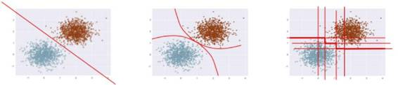

# 深度 | 解决真实世界问题：如何在不平衡类上使用机器学习？

选自 SVDS

**作者： TOM FAWCETT**

**机器之心编译**

**参与：孙睿、吴攀、李亚洲**

> *本文作者 Tom Fawcett 在机器学习和数据挖掘的实践应用上已有 20 多年的研究历史，曾就职于 Verizon 和惠普实验室（HP Labs）等机构，也曾在斯坦福大学语言和信息的研究中心从事过研究工作；现任 Silicon Valley Data Science 首席数据科学家兼 Machine Learning Journal 编辑，著有《Data Science for Business》一书。文中提到的论文可点击「阅读原文」下载。*

如果你是机器学习课程的新手，那么你使用过的数据库很大程度上都是非常简单的。其中一个原因就是，当你构建分类器时，样本类都是平衡的——也就是说，每个类中的样本数量是大致相同的。在教学中，数据库通常是净化过的，这样老师才能够把注意力集中在教授特定算法或技巧上，而不被其它问题干扰。一般情况下，你遇到的样本类似下方的二维图表，其中的点代表样本、点的不同颜色（或形状）代表类：

 

分类算法的目标是尝试学习出一个能够分辨二者的分离器（分类器）。根据不同的数学、统计或几何假设，达成这一目标的方法很多：

 

然而，当你开始面对真实的、未加工过的数据时，你会马上注意到，这些数据要嘈杂且不平衡得多。真实数据的散点图看起来更像是这样的：

最主要的问题是这些类是不平衡的：蓝点的数量远超红点。

对于不平衡类的研究通常认为「不平衡」意味着少数类只占 10% 到 20% 。而在现实中，数据库甚至能够比上面的例子更加不平衡。以下是一些例子：

1.  每年，约 2% 的信用卡账户是伪造的 [1]。（多数的欺诈检测领域是极其不平衡的）

2.  针对某一病征的医学筛查通常涵盖了许多没有此病征的人，以检查出少数患者（例：美国的 HIV 感染率约为 0.4%）

3.  每年，硬盘驱动器故障的发生率约为 1%

4.  在线广告的转化率在 10^-3 到 10^-6 的范围区间内

5.  工厂的产品缺陷率一般在 0.1% 左右

以上的许多领域都是不平衡的，因为它们是被我称为「大海捞针问题」的那一类。在这种情况中，机器学习分类器要从庞大的负面（不相关）样本中，寻找少量的正面（相关的、值得注意的）样本。

当你遇到类似的问题时，使用传统的算法将会面临困难。传统的算法通常是偏向数量占优的类，因为它们的损失函数会试图最优化相关数量，例如错误率，而没有将数据分布纳入考虑范围内。[2]在最坏的情况中，少数类样本会被视为多数类的异常点而被忽略，然后学习算法将生成一个简单的分类器，并将所有样本分类到多数类下。

这看起来像是一种不正常的行为，但它真的不是。事实上，如果你的目标是最大化精确度（也可以说，最小化错误率），这是一个完全可以接受的解决方案。但是，如果我们假设那极其少量的类的样本更需要被分类，那么我们不得不更将谨慎，并采取更复杂的方法来解决问题。

如果你正在被这样的问题困扰，并希望得到实用的解决建议，往下看。

注：这篇博文的重点是提供解决此类问题的实用建议。然而，这并不是一个手把手教你的代码教程。我的 Jupyter Notebooks （https://silicon-valley-data-science.github.io/learning-from-imbalanced-classes/ImbalancedClasses.html ）中有我测试这些想法的记录，但在这篇文章中，我将只解释一些基本的想法和原则。

**处理不平衡的数据**

从不平衡数据中学习，是一项已被研究了 20 年之久的问题。它曾是许多论文、研讨会、特别议程的主题（一项最近的调查就有大约 220 个引用）。人们尝试了许多方法，但结果各不相同，所以至今没有得到明晰的答案。当数据科学家们第一次遇到这个问题，他们往往会问：「如果我的数据是不平衡的，我该怎么做？」而这一问题是没有固定答案的，就像你问「哪个学习算法是最好的」一样：答案取决于数据。

由此，我列出了一些方法的大致总结，它们是以困难程度排序的：

*   什么也不做。有时好运就这样降临在你的头上：你什么都不需要做。你可以使用所谓的自然（或分层）分布来进行训练，有时不需任何修改就能正常运行。

*   通过某些方法使得数据更加平衡：

*   对少数类进行过采样

*   对多数类进行欠采样

*   合成新的少数类

*   舍弃所有少数类，切换成一个异常检测框架。

*   在算法层面之上（或之后）：

*   调整类的权重（错误分类成本）

*   调整决策阈值

*   使已有的算法对少数类更加敏感

*   构造一个在不平衡数据上表现更好的全新算法。

**题外话：评估方面的可做与不可做**

首先我要小小地跑题一下。在讨论如何用不平衡数据训练分类器之前，我们必须先探讨一下如何正确评估。这是最重要的一点，因为如果你不知道该如何正确度量你的成果，你也就不能取得进展。

*   不要使用准确度（错误率）来评估你的分类器！因为这方面存在两个显著的问题。准确度使用天真的 0.50 的阈值来确定所属的类别，而当类不平衡时，这常常会出错。第二，分类准确度基于对错误的简单计数，而你应该对此有更深入的了解。你应该知道哪些类在哪些地方（得分的顶端、底端还是整体）出现了混淆？如果你对这些概念还不太了解，推荐阅读：http://www.svds.com/classifiers2/ 。你应该使用一个 ROC 曲线、准确度召回曲线（precision-recall curve）、Lift 曲线或利润（收益）曲线（profit (gain) curve）对分类器的表现进行可视化。

 

*ROC 曲线*

** 

*Precision-recall curve*

*   不要在你的分类器中使用困难的分类（标签）（使用 score[3]或 predict）。而是应该使用 proba 或 predict_proba 进行概率估计。

*   当你得到概率估计之后，不要盲目地使用 0.50 的决策阈值来区分类别。应该再检查表现曲线之后再自己决定使用哪个阈值（下一节会谈到更多）。因为研究者曾天真地使用了 0.5 作为截止线，所以早期的一些论文中出现了很多错误。

*   不管你是用什么做训练的，你总是应该在你的分类器将要运行其上的自然的（分层的）分布上进行测试。参考：sklearn.cross_validation.StratifiedKFold

*   不使用概率估计你也可能能够成功，但如果你需要它们，要使用校准。（参考：sklearn.calibration.CalibratedClassifierCV）

上面的两幅二维图总是比单纯的数字所包含的信息更丰富，如果你需要单纯的数字指标，下面这几个可以很好地对应准确度：

1.  ROC 曲线下的面积（AUC）是一个很好的一般统计。它等于一个随机的正面样本将得到比一个随机的负面样本更高排名的概率。

2.  F1 分数是（F1 Score）是准确度（precision）和召回率（recall）的调和平均值。它常被用于寻找聚合度量（aggregate measure）时的文本处理中。

3.  Cohen’s Kappa 系数是一种评估统计，其考虑了偶然预期的协议的多少。

**过采样（oversampling）和欠采样（undersampling）**

最简单的方法只需要对处理步骤进行一点点修改，并简单地涉及到调整样本集直到它们达到平衡。过采样会随机复制少数样例以增大它们的规模。欠采样则随机地少采样主要的类。一些数据科学家（天真地）认为过采样更好，因为其会得到更多的数据，而欠采样会将数据丢掉。但请记住复制数据不是没有后果的——因为其会得到复制出来的数据，它就会使变量的方差表面上比实际上更小。而过采样的好处是它也会复制误差的数量：如果一个分类器在原始的少数类数据集上做出了一个错误的负面错误，那么将该数据集复制五次之后，该分类器就会在新的数据集上出现六个错误。相对地，欠采样会让独立变量（independent variable）的方差看起来比其实际的方差更高。

因为所有这些原因，不同的机器学习文献在过采样、欠采样和使用自然分布之间也做出了不同的选择。

大部分机器学习软件包都可以进行简单的采样调整。R 中的 unbalanced 中实现了很多专用于不平衡数据集的采样技术，scikit-learn.cross_validation 也有一些基本的采样算法。

**Wallace 等人的贝叶斯论证**

 Wallace、Small、Brodley 和 Trikalinos 的论文《Class Imbalance, Redux》中提出的关于类不平衡（class imbalance）的理论论证和使用建议可能是这方面做得最好的[4]。他们支持对多数类进行欠采样。他们的论证是数学的且彻底的，但这里我只给出他们用来证明自己观点的一个例子。

他们认为两个类必须在一些解释变量的一些分布的尾部能明显区分开。假设你有两个带有单个独立变量 x 的类。其中每个类都是由标准差为 1 的高斯分布生成的。类 1 的均值是 1，类 2 的均值是 2\. 我们任意地将类 2 定为多数类。它们看起来是这样：

给定一个 x 值，你会使用什么阈值来确定其来自哪一个类？很显然这两者之间最好的分割线是它们的中点 x=1.5，如下图中间的竖线所示：如果新样本 x 的值低于 1.5，那它可能属于类 1，否则其属于类 2。在从样本中进行学习时，我们期望在 1.5 处的分辨分割线是我们将会得到的结果；而且如果这两个类是平衡的的话，那么这就会接近于我们应该得到的结果。x 轴上的点表示从每个分布中生成的样本。

但我们已经说过类 1 是少数类，所以假设我们从其中得到了 10 个样本，而从类 2 得到了 50 个样本。那我们就很可能学习到一个有所偏移的隔离线，就像这样：

为了匹配少数类，我们可以通过欠采样多数类来做到更好。问题是我们所学习到的隔离线将具有较高的可变性（因为样本更小的），如下所示（这里展示了 10 个样本，得到了 10 条竖线）：

所以最后还要使用 bagging 来讲这些分类器结合起来。整个流程看起来是这样：

这种技术还没有在 Scikit-learn 中实现，尽管已经有一个名叫 blagging.py （balanced bagging）的文件可用——实现了一个  BlaggingClassifier，可以平衡聚合（aggregation）之前的自举样本（bootstrapped samples）。

**基于临近的方法（Neighbor-based approaches）**

过采样和欠采样都随机选择要调整的样本的比例。其它方法则仔细地检测实例空间（instance space）和决定在它们的邻域（neighborhood）上做什么。

比如说， Tomek link 是指相反分类中实例的配对，这些相反分类之间是最为临近的。换句话说，它们是整体上非常接近的相反实例对。

Tomek 的算法可以寻找这样的配对，并移除配对中的多数实例。其中的思想是要明确少数类和多数类之间的界线，从而使少数类的区域更明显。下图给出了一个简单的 Tomek Link 移除的例子。R 包中的 unbalanced 能实现 Tomek Link 移除，另外还有很多专用于不平衡数据集的采样技术也可以。Scikit-learn 没有做这件事的内置模块，但也有一些独立的包可用（如：TomekLink：https://github.com/ojtwist/TomekLink）。

**合成新样本：SMOTE 及其衍生技术**

研究的另一项技术不涉及对样本的重采样（resampling），而是合成新的样本。这种方法最好的例子是 Chawla 的 SMOTE（Synthetic Minority Oversampling TEchnique：合成少数类过采样技术）系统。其思想是通过在已有的样本间插值来创造新的少数类样本。这项技术的大概过程如下图所示。和前面一样，假设我们有一个多数类样本集和一个少数类样本集：

SMOTE 取得了普遍的成功并衍生出了很多变体、扩展和对不同概念的学习算法的适配。SMOTE 及其变体封装在 R 语言的 unbalanced 包和 Python 中的 UnbalancedDataset 包中。

这里还要指出 SMOTE 的一个重大限制。因为它是在稀有的样本之间插值，所以它只能生成可用样本范围内的样本——永远不会生成例外的样本。形式上，SMOTE 只能填入已有少数类样本的凸包（Convex Hull）中，但不能创造在少数类样本域之外的新样本。

**调整类的权重**

许多机器学习工具包都有调整类的「重要性」的方法。比如 Scikit-learn 有许多可以使用可选的 class_weight 参数（可以设置成大于 1）的分类器。这里有一个直接从 scikit-learn 文档中引用的例子，展示了将少数类的权重增加为 10 倍时的效果。黑色实线是使用默认设置（所有类权重相等）时得到的分割边界，而虚线则是少数类（红色）的 class_weight 参数改变到 10 倍时的效果。

如你所见，少数类的重要程度增加了（它的误差被认为比其它类的误差的成本更高），分离的超平面（hyperplane）得到调整以降低损失。

应该指出的是调整类的重要性通常只能影响类的误差（假阴性（False Negatives），如果少数类是阳性的话）成本。它会调整一个分离的平面并借此降低这些误差。当然，如果该分类器在训练集误差上没有错误，那也就不需要调整，所以调整类权重可能就没有效果。

**更进一步**

这篇文章集中于相对简单的、方便的从不平衡数据中学习分类器的方式。大部分这些都涉及到在应用标准学习算法之前或之后对数据进行调整。这里还有一些其它方法值得一提。

**新算法**

从不平衡类进行学习一直是机器学习使用每年引入的新算法进行研究的一个领域。在总结之前，我先提几个看起来有希望的算法进展。

在 2014 年，Goh 和 Rudin 发表了论文《Box Drawings for Learning with Imbalanced Data》[5]，该论文介绍了两种从样本偏斜的数据中学习的新算法。这些算法意图围绕少数类样本集群创建「box」：

他们的目标是开发出对少数类的一个简明、智能的表征。他们的方程式会惩罚 box 的数量，而惩罚则被用作是一种正则化的形式。

他们介绍了两种算法，一个（Exact Boxes）使用混合整数程序提供精确但相当昂贵的解决方案；另一个（Fast Boxes） 使用一个更快的集群方法生成初始 box，而后进行精炼。实验结果表明在大量测试数据集上，两种算法都表现相当好。

前面我提到解决不平衡问题的一种方法是丢弃少数类样本，把它当成单独分类（或异常检测）问题。近期的一项异常检测技术在该问题上表现惊人。Liu、Ting 和 Zhou 介绍了一项名为 Isolation  Forests 的技术，识别数据中异常的方式是通过学习随机森林，然后测量将每个特定数据点孤立所需的决策分类的平均值。结果得到的值能被用于计算每个数据点的异常得分，这个得分可被解释为样本所属少数类的似然度。的确，作者们使用高度不平衡的数据测试了他们的系统，并报告出了很好的结果。由 Bandaragoda、Ting、Albrecht、Liu 和 Wells 继而完成的一篇论文介绍的 Nearest Neighbor Ensembles 是类似的思路，而且能够解决  Isolation Forests 的一些短板。

**购买或者创造更多数据**

本文的最后一部分的重点是在默认给定不平衡数据并且需要解决该不平衡的情况下的不平衡类的问题。在一些情况下，比如 Kaggle 竞赛，你会被给定固定的数据集，不能再要更多的数据。

但你可能面临一个相关的、更难的问题：你在少数类数据上没有足够的样本。上面的介绍的技术没有一个可行，你该怎么做？

现实中，你可以购买或者创建一些领域中的少数类的样本。这是机器学习领域也正在研究的一个领域。如果少数类数据需要人们进行可靠的标记，一个常用方法是通过 Mechanical Turk 这样的服务众包出去。人类标记的可靠性可能是一个问题，但也有将人类标记与可靠性优化结合起来的研究。最后，Claudia Perlich 在她的演讲（All The Data and  Still Not Enough）中给出了一些例子：如何通过使用替代变量或问题（surrogate variable  or problems）修正数据缺乏或者没有数据的问题，或者如何使用代理和隐变量使看起来不可能的问题变得可能。与之相关的还有迁移学习（transfer learning）的方法：将在一个问题上学习到的结果迁移到另一个带有稀少样本的问题上，参看论文《Machine learning for targeted display advertising: Transfer learning in action》。

**资源和拓展阅读**

这里有数个说明不平衡学习不同方面的 Jupyter notebooks 可用：

*   一个说明高斯采样的（sampled Gaussians）的 notebook 是在 Gaussians.ipynb：https://github.com/silicon-valley-data-science/learning-from-imbalanced-classes/blob/master/Gaussians.ipynb

*   一个 Wallace 方法的简单实现 blagging.py：https://github.com/silicon-valley-data-science/learning-from-imbalanced-classes/blob/master/blagging.py。这是 sklearn 现有的 bagging 实现的简单交叉，特别是./sklearn/ensemble/bagging.py.

*   使用这一方法的一个 notebook 在  ImbalancedClasses.ipynb （https://github.com/silicon-valley-data-science/learning-from-imbalanced-classes/blob/master/ImbalancedClasses.ipynb）是开放的。它可装载于数个领域，并且在不同分布下与其他方法进行了 blagging 对比。

*   在 MATLAB 上 Box Drawings 的源代码：http://web.mit.edu/rudin/www/code/BoxDrawingsCode.zip

*   基于 R 语言的 Isolation Forests 源代码：https://sourceforge.net/projects/iforest/

***参考文献：***

*1\. Natalie Hockham makes this point in her talk Machine learning with imbalanced data sets, which focuses on imbalance in the context of credit card fraud detection.*

*2\. By definition there are fewer instances of the rare class, but the problem comes about because the cost of missing them (a false negative) is much higher.*

*3\. The details in courier are specific to Python’s Scikit-learn.*

*4\. “Class Imbalance, Redux”. Wallace, Small, Brodley and Trikalinos. IEEE Conf on Data Mining. 2011.*

*5\. Box Drawings for Learning with Imbalanced Data.” Siong Thye Goh and Cynthia Rudin. KDD-2014, August 24–27, 2014, New York, NY, USA.*

*6\. “Isolation-Based Anomaly Detection”. Liu, Ting and Zhou. ACM Transactions on Knowledge Discovery from Data, Vol. 6, No. 1\. 2012.*

*7\. “Efficient Anomaly Detection by Isolation Using Nearest Neighbour Ensemble.” Bandaragoda, Ting, Albrecht, Liu and Wells. ICDM-2014*

******©本文由机器之心编译，***转载请联系本公众号获得授权******。***

✄------------------------------------------------

**加入机器之心（全职记者/实习生）：hr@almosthuman.cn**

**投稿或寻求报道：editor@almosthuman.cn**

**广告&商务合作：bd@almosthuman.cn**