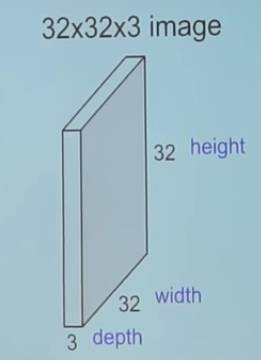
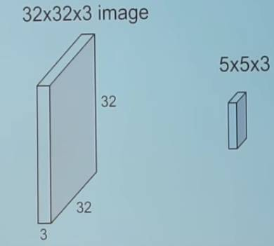
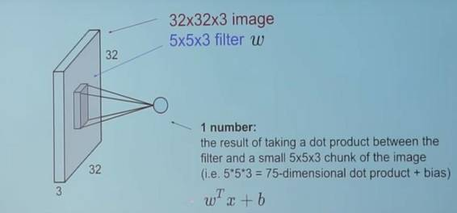
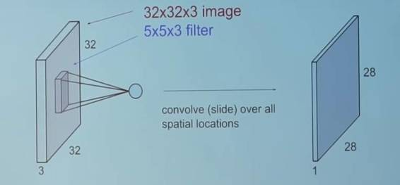
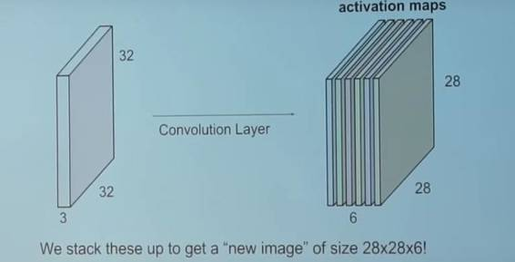
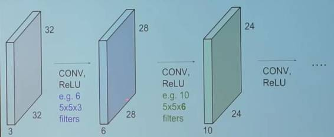
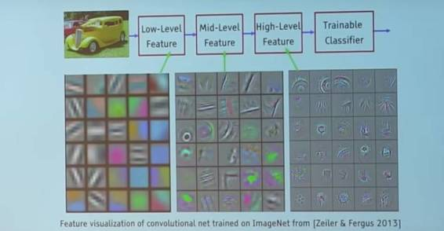
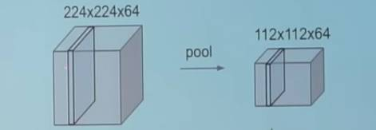
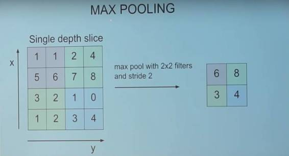
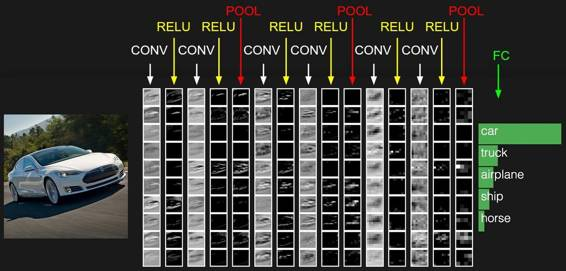

# 深度 | 卷积神经网络架构详解：它与神经网络有何不同？

选自 Medium

**作者： Harsh Pokharna**

**机器之心编译**

**参与：杜夏德**

> *这是作者在 Medium 上介绍神经网络系列文章中的一篇，他在这里详细介绍了卷积神经网络。卷积神经网络在图像识别、视频识别、推荐系统以及自然语言处理中都有很广的应用。如果想浏览该系列文章，可点击阅读原文查看原文网址。*

跟神经网络一样，卷积神经网络由神经元构成，这些神经元带有可学习的权重和偏差（bias）。每个神经元接收若干输入，并对输入进行加权求和，然后通过一个激活功能将它们传递出去，再用一个输出作为反应。整个神经网络有一个损失函数，我们为神经网络开发的所有贴士和技巧，仍然适用于卷积神经网络。

那么，卷积神经网络是怎么不同于神经网络的呢？

**卷积神经网络运行过量**

这是什么意思？

*1.一个 RGB 图像的例子（称它为『输入图像』）*

在神经网络中，输入是一个向量，但是在卷积神经网络中，输入是一个多通道图像（这个例子中的图像有 3 个通道）。

**卷积**

*2.用滤波器来卷积图像*

我们用了一个 5×3×5 的滤波器在整个图像上滑动，在滑动过程中，采集在滤波器与输入图像的块之间的点积。

*3.看上去就是这样子*

对于采集到的每个点积来说，其结果都是一个标量。

所以当我们用这个滤波器卷积一个完整的图像时会发生什么呢？

*4.就是这个！*

你可以自己想想这个『 28 』是怎么来的。（提示：有 28×28 个独特的位置，在这些位置上，滤波器可以被放在这个图像上）

**现在，回到卷积神经网络**

这个卷积层是卷积神经网络的主构建块。

*5.卷积层*

卷积层包括一组独立的滤波器（该例子中有 6 个）。每个滤波器都独立地与图像卷积，我们以 6 个形状为 28×1×28 的特征图结束。

假设我们有一个序列卷积层。那么会发生什么呢？

*6.序列卷基层*

所有这些滤波器都被随机初始化，并成为我们的参数，随后将被这个网络学习。

下面是一个训练过的网络的例子：

*7.一个训练过的网络中的滤波器*

看下最表层的滤波器（这些都是我们的 5×3×5 的滤波器。）通过反向传播，他们将自己调整为彩色片和边缘的斑点。在我们深入到其他卷积层时，这些滤波器在做之前的卷积层的输入的点积。所以，它们正在采集这些较小的彩色片或边缘，并通过这些小的彩色片和边缘做出较大的彩色片。

看看图 4 ，并将这个 28×1×28 的网格想象成 28×28 个神经元。对于一个特定的特征图来说（在卷积带有一个滤波器的图像上接受的输出被称为一个特征图），每个神经元只连接这个输入图像的一小块，而且所有的神经元都具有相同的连接权重。因此，再次回到卷积神经网络和神经网络之间的差异。

**卷积神经网络的一对概念：参数共享和局部连通性**

参数共享，通过一张特定的特征图中所有神经元来共享权重。

局部连通性的概念是每个神经只连接一个输入图像的子集（不像神经网络中的所有神经元都完全连接在一起）。

这帮助减少了整个系统中的参数数量，让计算变得更有效。

为了简单一些，这里不讨论零填充（zero padding）的概念。有兴趣的可以自己去阅读相关资料。

**池化层**

一个池化层是卷积神经网络的另一个构建块

*池化*

它的功能是通过逐步减小表征的空间尺寸来减小参数量和网络中的计算。池化层在每一个特征图上独立操作。

*最大池化*

**一个卷积神经网络的典型架构**

*卷积神经网络的典型架构*

我们已经讨论过卷积层（用 CONY 表示）和池化层（用 POOL 表示）

RELU 只是一个被应用的非线性特征，类似于神经网络。

这个 FC 与神经元层完全相连在卷积神经网络的末端。完全连接层中的神经元连接着之前层中的所有激活，这在常规的神经网络中能看到，并以相似的方式运行。

希望你现在能理解一个卷积神经网络的这种架构了。这种架构还要很多变体，但是之前提到过，基本的概念都是相同。

***©本文由机器之心编译，***转载请联系本公众号获得授权***。***

✄------------------------------------------------

**加入机器之心（全职记者/实习生）：hr@almosthuman.cn**

**投稿或寻求报道：editor@almosthuman.cn**

**广告&商务合作：bd@almosthuman.cn**