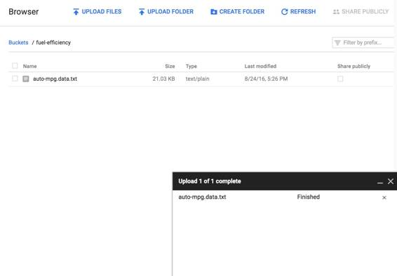
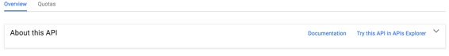
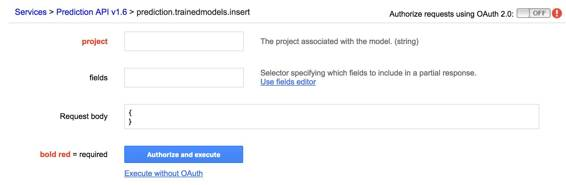
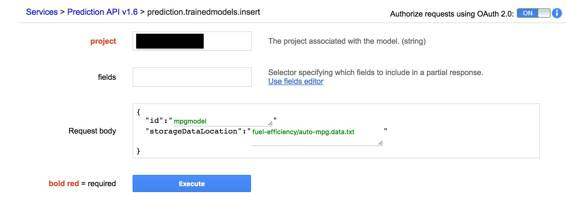
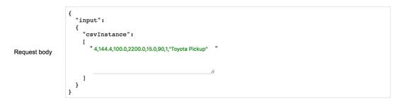

# 业界 | 基础教程：门外汉如何使用谷歌的 Prediction API 做机器学习

选自 Mother Board

**作者： MICHAEL BYRNE**

**机器之心编译**

**参与：郑阳、李亚洲**

在普通吃瓜群众眼中，机器学习乃至整个人工智能领域通常是晦暗和深奥的代名词，又或许仅仅是时髦的术语。然而可惜的是，它并不是大家想象中的那样遥不可及。机器学习和人工智能仅仅是工具，作为工具，它们既可以应用于像神经操控假肢或机器感知这样极端复杂看似神秘莫测的任务，也能用于像分类垃圾邮件这样的日常工作。

换句话说，机器学习并不一定像「脑外科」一样让人望尘莫及，虽然它也能应用于脑外科手术。然而，深入研究谷歌的 TensorFlow 开源机器学习库又让人望而却步。庆幸的是，谷歌在它的云服务中提供了一个极其易用的机器学习平台，叫做 Prediction API。因为它隐藏了很多内部的算法和原理，所以也被称作是一个机器学习「黑箱」。它提供了一个整洁简单的接口，可以被用来训练机器学习模型，然后使用它来预测新的数据。

你甚至不需要会写代码来使用 Prediction, 然而会使用它的编程接口将会极大的增加 Prediction 的能力。所以，在接下来的这篇指南，笔者将会介绍如何在谷歌网页端的 API Explorer 中使用 Prediction，在适当的时候，笔者也会向大家展示什么时候使用代码可能会更有帮助。

**预测是什么意思**

粗略的讲，机器学习就是用收集来的数据建立数学模型描述某种现象。然后利用这些数学模型在新的数据中发现有用的东西。向模型提供的数据越多，模型的预测能力就会被「训练」得越好。

例如在一个垃圾邮件分类算法中，我有两个数据点，一个代表普通邮件，另一个代表垃圾邮件，我的模型不会发挥什么作用。因为数据太少，它只能瞎猜。但是假设现在有 1000 万封邮件，那么它就能开始明白究竟是那些特质使得垃圾邮件成为垃圾邮件，比如垃圾邮件的哪些特征决定了他们的「垃圾性」。最终这个模型会准确的分类垃圾邮件，错误率几乎为零。因此，机器学习离不开大量的高质量数据。

**我们能够预测什么？**

我们可以使用 Prediction 来预测两大类事物：

**分类**

我们可以问谷歌类似「这是啥？」的问题。我们给谷歌几个选择并且告诉它对于每个选择我们所观察到的数据。接下来，谷歌会用这些已知的信息来生成一个模型。然后我们给谷歌一些新观察到的数据并问它这些数据是什么。谷歌会返回它认为的最佳猜测以及对这个猜测有几成的把握。

想象下面的一组数据：

> ***蝴蝶, 翅膀, 1 英寸, 黄色, 橙色***
> 
> ***鸟, 翅膀, 5 英寸, 蓝色***
> 
> ***飞机, 翅膀, 300 英尺, 银色***
> 
> ***蝴蝶, 翅膀, 1.5 英寸, 橙色, 红色***
> 
> ***狗, 尾巴, 24 英寸, 棕色***

我想要用以上数据来预测某种新的动物或事物是蝴蝶，鸟，飞机，还是狗。

我让它来预测。要向一个模型问问题，我需要将观察到特征提供给模型。

我会问谷歌拥有以下特征的东西是什么？

> ***翅膀, 3 英寸, 黑色, 棕色***

然后它会给出预测。但是结果不会很准确，因为我们没有提供足够的数据。

**回归**

谷歌也可以预测数字。这是另外一种模型，叫做回归模型。譬如我们有一些人的银行存款余额，并且我们知道他们的三个信息：职业，性别，年龄。我们把这些数据添加到一个电子表格中，如下（真实表格中会有更多的记录）：

> ***$2100, 学生, 男, 28***
> 
> ***$10,000, 律师, 男, 55***
> 
> ***$7005, 工程师, 女, 33***

我们把这些数据输入到谷歌的预测 API 中，然后谷歌会生成一个模型。这个模型能够根据以下信息预测出一个从未见过的人的银行存款余额：

> **调酒师, 女, 40**

这时候谷歌会返回一个数字。注意是一个数字，不是若干分类中的一类。它不是有限个选择中的一个，而是范围无限的有理数集合中的一个。这个范围太大了！

**谷歌的 API**

Prediction 是谷歌云平台提供的众多 API 的一部分。这些 API 基本上是谷歌不同服务的入口或接口，比如谷歌地图，谷歌翻译，或者 YouTube。我们通常把 YouTube 当成一个整体来访问，但其实 YouTube 提供了一个 API 层，使我们可以在底层直接获取 YouTube 的视频、评论、分析以及其他的数据。你甚至可以把 YouTube 网站想象成仅仅是众多实现中的一种。这就是对 API 的一个不错的理解，一般来说， API 就是一个提供某种服务，并且可以用多种不同方式来实现的底层接口。

**上传数据**

假如你已经成功的完成了上面的步骤，那我们就可以进入机器学习部分了。我们需要一些简单的数据：

> ***物品, 特征 1, 特征 2, 特征 3, 特征 4 ...***

这里「物品」代表我们想让机器学习模型学习的东西。在这一行数据中，它在学习一个有四个特点（特征），真实存在的实体。如果有大量数据和大量特征，它将会更准确的根据特征判断这个未知物体的种类。你也可以把这里的「物品」想成是这类物品的共同「标记」。

我们现在需要寻找一些数据。网上有大量的样本数据集供我们使用，其中很多可以在加州大学的 Irvine's Machine Learning Repository 中找到。 需要注意的是，他们中很多格式和我们刚才说到的不一样。比如有些标记栏在行尾，不在行首。其实以编程的方式来解决格式问题并不太难，但具体细节超出本文的范围。

我找到了一个格式完美的数据集。它是关于不同种类汽车的耗油量的特征。以下是一些样例：

> ***18.0 8 307.0 130.0 3504\. 12.0 70 1 "chevrolet chevelle malibu"***
> 
> ***15.0 8 350.0 165.0 3693\. 11.5 70 1 "buick skylark 320"***
> 
> ***18.0 8 318.0 150.0 3436\. 11.0 70 1 "plymouth satellite"***

第一竖排是实际的每加仑里程数，接下来的竖排依次代表气缸数，排气量，马力，车重，加速度，车型年份，产地以及车名。

这个数据集中有 398 行这样的数据，我们应该可以利用数据中的一些（或全部）特征来预测一个未知汽车的燃料效率。你可以在这里下载这组数据（.txt 格式）：https://archive.ics.uci.edu/ml/machine-learning-databases/auto-mpg/auto-mpg.data。

首先，用文本编辑器打开你刚刚下载的文件。随便什么文本编辑器都可以，只要有「查找并替换」 功能就行。打开文件后你将会看到文件中的纵列用的是空格和制表符排版，文件中并没有使用逗号作为分隔符。我花了大概一分钟的时间设法把不同长度的空格用逗号替换了一遍。最后你还要替换掉多余的制表符。大多数使用数据集的时候都是以清理和格式化结尾，但是这不难。

现在我们本地有一份合格的数据了，下面我们要把它上传到谷歌上去。这就是为什么刚才我们授权了谷歌的云存储平台。

首先，我们在浏览器中打开云存储控制台。在 Storage 页面，创建一个「bucket」。这里「bucket」（桶）非常形象的代表了它的功能，就是一个可以盛装各种文件的虚拟容器。你必须给你的桶命名，而且这个名字在整个 Google Cloud 上必须是唯一的。因此你可能在起名的时候要有点创意。我已经抢注了「fuel-efficiency」这个名字了，抱歉 ;-)

创建完桶后，就可以上传你的 .txt 文件了。现在你就了一个稍后可以引用的云端数据集了。使用起来很简单，引用「桶名/文件名」就可以定位到这个文件了。

**训练日**

下面我们就要搞一个机器学习模型了。对于像我们这样的机器学习的门外汉来说，Prediction API 最酷炫的一点就是我们几乎完全将机器学习的内部细节外包给谷歌了。

为了访问 Prediction API，我们接下来要使用谷歌 API Explorer。这是一个不需要编写任何代码就能使用的、基于浏览器的用户接口。我们只需要填写一个网页表单，然后 Explorer 会把表单中的信息组合成适当 API 请求并帮助我们发送给服务器。Explorer 帮助我们省略了请求的细节，很方便，但也很局限。

要找到 API Explorer，先从谷歌云控制台（主界面）去到 API manager，然后点击列表中的 Prediction API。 你会看到一个类似下面这幅图中的页面：

 

点击「Try this」链接，然后你会被定向到 API Explorer。

下面你会看到一个服务列表。选中「insert」，它会把你带到下图中的界面：

 

填写你的项目名称（刚才创建的项目名称），然后点击「request body」文本框。它会显示一个下拉菜单。我们需要给即将创建的模型一个 id，并且告诉它我们的数据集在哪。看上去如下：

 

点击执行，你应该会收到一个「200」回应，代表请求成功，没有出错。同时它也会返回给你新创建的模型的 URL：就是「selfLink」。

**预测！**

我们一直期盼的时候终于到了。我们要在 API Explorer 中来进行预测。回到列出所有 Prediction API 服务的页面，和刚才选择 insert 相反，这此我们选择 predict。填写好项目的名称和刚才创建的模型 ID。在「request body」文本框的下拉菜单中选择 input，然后在接下来的下拉菜单中选择「csvInstance」。或许你能猜出来下面需要填写什么：逗号分隔的一组值。我们想要让谷歌来预测这些值所描述的某个未知的汽车的燃料性能。我要让它预测一下我自己的车，至少应该比我瞎编的值准吧。

这是我提供的数据：

 

这是谷歌预测的结果：

> ***"outputValue": "19.181282"***

结果偏低，但是我也捏造了一点我的数据。

**使用代码**

在代码中使用 Prediction API 比在 API Explorer 用难不了多少。以下是用 Python 语言在现有的模型上预测（如同刚才我们所做的）， 代码如下（实际数据来自另外一个项目，所以不用介意它）：

> ***data = '11.1,1.0,2.0,19.1,98,4,2,2.5,37,2.0,4.0,1.0,2.0,670'***
> 
> ***prediction = api.trainedmodels().predict(project='your project id here', id='your model id here', body={***
> 
> ***'input': {***
> 
> ***'csvInstance': data***
> 
> ***},***
> 
> *** }).execute()***

非常简单，对吗？难点在于用户的身份认证。身份认证是必要的，因为大量使用 API 可能会超过免费的限额，用户可能会因他人的使用而付费。但凡遇到和钱相关的问题，你一定要使用身份认证。这在 API Explorer 中很简单，但是在代码实现中这点还是挺烧脑的。

**未来**

我喜欢把 Prediction API 想成是一种激励我们向前深入了解机器学习的途径，又或许是很酷的机器学习应用灵感的来源。但是无论如何，从不可思议的艺术课题到网站流量的分析，它都可以直接的被应用。我目前在用它分析不同环境下的背景噪音。最终我想要通过环境噪音数据来预测你在哪里。Prediction 让这项工作变得简单多了。

最后要注意的一点是，使用 Prediction 时偶尔会遇到比较棘手的问题。也许你提供的文件格式出错，又或者有些数据被遗漏掉了。特别是在处理大量的数据时，纠正这些问题会比较繁琐乏味。大多数情况下 Excel 或者 Google Sheets 可以帮上忙，但一般还是要试错几次之后才能成功。总而言之，为了预测未来，做这些还是值得的。

******©本文由机器之心编译，，***转载请联系本公众号获得授权******。***

✄------------------------------------------------

**加入机器之心（全职记者/实习生）：hr@almosthuman.cn**

**投稿或寻求报道：editor@almosthuman.cn**

**广告&商务合作：bd@almosthuman.cn**