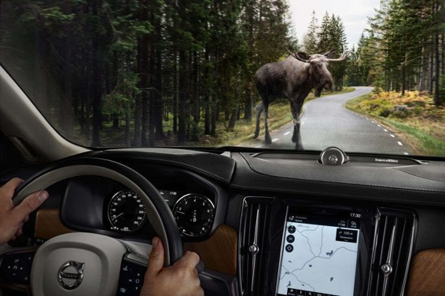

# 业界｜如何用图像识别技术来变革商业？这里有份操作指南

选自 Techcrunch

**作者： ****Ken Weiner**

**机器之心编译**

**参与：iCombinator** 

近期 Facebook F8 开发者大会上，马克·扎克伯格发布了一项野心勃勃的人工智能计划「建立一套在感知方面比人类更好的系统」。此外，他还展示了一项令人印象深刻的图像识别技术——通过用语音解说的方式让盲人「看到」图片里的内容。

从帮助视觉受损的人到识别大型动物的车内安全功能（注：沃尔沃开发的自动化安全技术），再到自动组织无标签的图片集以及从社交网络分享的图片中提取出商业洞见，图像识别或计算机视觉的好处才刚刚开始展现——但它们正在变得更快更深入。

即将到来的 LDV Vision 峰会是展示所有视觉技术的年度会议，从虚拟现实到医疗成像和内容分析。「最近，计算机视觉的进步在图像分析领域创造了巨大机会，给每个垂直商业领域带来的影响呈指数级增长，包括自动化、广告和增强现实等。」LDV Capital（本次峰会组织者）的 Evan Nisselson 说到。

像自然语言处理、生物信息学、博弈论等其他人工智能形式一样，计算机视觉也在很大程度上得益于开源、深度学习、用户友好的编程工具，以及更快、更便宜的计算能力。

很多人都认为深度学习和人工智能将成为下一个重大突破，但从更加具体和实用的角度来说，这些不同的工具应该如何工作？应该通过何种方式将可商用的图像技术带给全世界？谷歌的 TensorFlow 与 Facebook 的 DeepFace 或者微软的「牛津计划」一样吗？为了帮大家分辨这些东西，下面是对当前图像技术工具和商业使用方法的简要说明。

**训练素材：公开数据**

得益于深度学习，计算机能够比以往更快更精准的识别图片，但它们需要大量数据。

ImageNet 和 Pascal VOC 经过多年积累建立了包含几百万张图片的庞大且免费的数据集，用描述图片内容的关键词为图片做好了标签，包括猫、山、披萨和体育活动等。这些开源数据集是使用机器学习进行图像识别的基础。

ImageNet 每年一度的图像识别挑战赛众所周知，ImageNet 由斯坦福大学和普林斯顿大学的计算机科学家在 2009 年发起，当时有 80,000 张打好标签的图片，到今天这个数据已经增加到 140 万张，这些数据可以随时被用来进行机器训练。

Pascal  VOC 由英国的几所大学支持，他们的图片数量较少，但每张图片有着更加丰富的释文。这提升了机器学习的准确度和应用范围，加快了整个过程，因为它可以省略掉一些繁重的子任务。

如今，谷歌、Facebook 等科技巨头、创业公司、高校等都在使用这些开源图片集来喂养他们的机器学习「猛兽」，但科技巨头还享受另外一项优势，谷歌和 Facebook 可以从 Google Photos 社交网络上获取数百万张用户已经标记好的图片。你之前有没有考虑过，为何谷歌和 Facebook 会让你免费上传如此多图片？原因就在于这些图片可以将他们的深度学习网络训练的更加准确。

**建筑模块：开源软件库和框架**

在你有了数据之后，就需要建立一台能够从数据中进行学习的机器，从开源软件库可以免费获得开发框架，这是建立服务于各种不同计算机视觉功能的机器学习系统的起点，包括人脸和情绪识别、医疗筛查和汽车中的大型动物障碍物探测。之后，再拿从 ImageNet 等其处获得的图片去训练这些机器学习系统。

谷歌 TensorFlow 是众多周知的几个软件库之一，它的覆盖面比较广，而且部分内容在去年开源。TensorFlow 的一些内容依然是归谷歌专用，被用来开发公司的多个人工智能项目，比如自动驾驶汽车、Google Now 和 Google Photos 。

TensorFlow 不是第一个开源框架，加州大学伯克利分校的 Caffe 自 2009 年发布，到今天依然很流行，原因是它的高度可定制化以及大规模的创新者社区，Pinterest 、雅虎/Flickr 都是 Caffe 的重度用户，甚至谷歌也将 DeepDream 等特定项目放在 Caffe 上进行开发。

另外一个创建于 2002 年的开源软件库 Torch 也很流行，因为 Facebook 的人工智能实验室在使用它，并在 2015 年初开源了一些模块。其中一些工具经过优化后，能够在多个图像处理器或者多台计算机上运行，从而增强性能，加速深度学习过程。类似的， NVIDIA 的 cuDNN 也是一个开源软件库，能够对计算机的 GPU 表现进行优化，使机器学习更加快速。

这些灵活强健的工具需要公司配备专门的计算机视觉工程师及相应的硬件资源，因此，只有那些希望将计算机视觉作为产品策略中重要一环的公司才会采取这样方式，他们在应用中需要自己的软件。

**立即可用的云端 API 服务**

并不是每个公司都有资源和意向在这个领域进行投资，组建一支计算机视觉工程队伍。甚至即便你找到了合适的团队，在做到应用之前也依然还有大量困难工作需要去做，云端 API 服务适时出现了。通过在云端实施，这些解决方案提供了立即可用的图像识别服务菜单，这些服务能够很轻易的被整合进现有 APP 中，也可以被用来开发一个特定工具，或者一项完整业务。

比如，旅行网站 Travel Channel 需要「地标检测」在登陆页面上展示与特定路标相关的照片；婚恋交友网站 eHarmony 希望将用户上传的「不安全」照片过滤掉。这些公司都不想、也没有必要开设基于深度学习的图像识别开发业务，但他们依然可以从这些功能中获益。

Google Cloud Vision 就是一款提供图像识别功能的 API，它提供一系列图片分析服务，从人脸识别到 OCR ，再到位置标记和内容识别，该服务按张计费。微软认知服务（牛津计划）提供了一套图像识别 API 服务，包括人脸识别、名人识别和情绪识别，收费模式是每 1000 次图片处理乘以一个特定比例。同时，Clarifai 等创业公司也在提供计算机视觉 API 服务，帮助客户整理内容、过滤不安全图片和视频、基于照片提供购买建议等等。

**定制化计算机视觉技术**

当然，这并不是非黑即白的问题。计算机视觉工程团队不需要达到谷歌的规模，那些不希望自行开发人工智能系统的大大小小的公司也依然能够获得强健的、个性化的图像识别解决方案。比如，如果一家化妆品公司想要找到一些头发浓密客户的照片，用于造型洗发水广告，它需要团队建立一套个性化算法来搜索浓密头发的照片，因为他们需要立即可用的商业化解决方案，这种应用场景已经司空见惯了。

对于 Logo ，目前这些依然是有利可图的商业应用，它们近期还无法从开源社区中找到解决方案。如果我们无法轻易获取封闭的数据集，那也没关系，因为还可以从社交媒体上拿到数量可观的图片，成为饲养这头机器学习「猛兽」的重要食物来源。

如果一些公司有工程师团队，那他们就可以将开源框架和公开数据结合起来。如果他们没有把整个业务都押注在计算机视觉上，也可以使用托管在服务器端上的 API 服务。

对于那些有着广泛具体应用的公司来说，也有定制化解决方案。不管采取何种途径，很显然易见的是图像识别很少会孤立存在；通过接触更多的图片、实时数据、特定应用和更快的处理速度，图像识别将变得越发强大。各类公司需要最大限度的将这些整合起来，才能为下一步的成功做好准备。

***©本文由机器之心编译，***转载请联系本公众号获得授权***。***

✄------------------------------------------------

**加入机器之心（全职记者/实习生）：hr@almosthuman.cn**

**投稿或寻求报道：editor@almosthuman.cn**

**广告&商务合作：bd@almosthuman.cn**