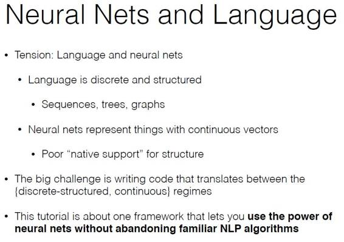

# 深度 | 自然语言处理顶级会议 EMNLP 2016 干货：从原理到代码全面剖析可用于 NLP 的神经网络（附获奖论文）

选自 EMNLP

**机器之心编辑整理**

**参与：杜夏德、李泽南、李亚洲、吴攀**

> *今年的自然语言处理实证方法会议（EMNLP 2016）正在（11 月 1 日-5 日）美国德克萨斯奥斯汀市举行。作为自然语言处理领域的顶级大会，EMNLP 一直以来都在为自然语言处理的发展提供强大的助力。在此文中，机器之心整理了大会的最佳论文、荣誉论文、最佳短篇论文和最佳资源论文。此外，还把 Chris Dyer 等三人在大会上做的一个 tutorial 演讲《Practical Neural Networks for NLP》作为资源分享给大家，该 tutorial 较为全面地覆盖了用于自然语言处理的神经网络的基础，是自然语言处理入门的必备良品。机器之心还整理了相关论文和幻灯片，读者也可点击文末「阅读原文」下载。*

**第一部分：获奖论文**

本届 EMNLP 一共选出了 6 篇获奖论文，包括 2 篇最佳论文、2 篇荣誉论文、1 篇最佳短篇论文和 1 篇最佳资源论文。下面是对这 6 篇论文的摘要介绍。

**最佳论文**：

1.Improving Information Extraction by Acquiring External Evidence with Reinforcement Learning

摘要：大部分成功的信息提取系统运行时都接入一个大型的文件集。在这个研究中，我们探索了获取并结合外部证据的任务，以在训练数据量稀缺的领域中提高提取的精确度，这个过程需要重复发布搜索查询，从新的来源中提取以及使提取值一致，直到收集到足够的证据。我们使用强化学习框架来解决这个问题，在此框架中，我们的模型可以学习基于上下文来选择最优行动。我们应用了一个深度 Q-network，训练它来优化能反应提取精度同时还能惩罚多余工作的奖励函数。我们的试验用到了两个数据库——枪击事件数据和食品掺假情况数据——证明了我们的系统明显优于传统的提取器和一个元分类基准。

2.Global Neural CCG Parsing with Optimality Guarantees

.png")

摘要：我们介绍了第一种全局递归神经解析模型，它是实时解码的最佳保证。为了支持全局特性，我们放弃了动态程序，用直接在所有可能子树中搜索的方式代替。尽管这样会导致句长指数性地增长，我们展示了达到学习效率 A 解析器的可能性。我们增大了已知解析模型，它存在外界评分的信息界限，通过一个宽松界限并只需非局性现象建模的全局模型。全局模型因此在新的目标下进行训练，这可以鼓励解析器更精确有效地进行搜索。这种方式适用于 CCG 解析，通过 0.4F1 获得了可观的精确性提升。解析器可为 99.9% 的停止句（held-out sentence）找到最佳解析，仅需搜索平均 190 个子树。

**最佳论文荣誉提名：**

1.Span-Based Constituency Parsing with a Structure-Label System and Provably Optimal Dynamic Oracles

.png")

摘要：由于神经网络的出现，使用有效的转换系统的解析精确度已得到巨大提升。尽管依存关系语法分析的结果惊人，神经模型还没有超过 constituency 分析中的最佳方法。为了弥补这个缺陷，我们引进了一个新的位移减少系统，该系统的堆栈只包含了句子跨度，通过最低限度的长短期记忆网络特征来表征。我们还为 constituency 分析方法设计出首个可查验的最优的 dynamic oracle，相比于进行依存分析的 O(n3)oracles，它在 amortized O(1)time 内运行。在此 Oracle 上训练，我们在英语和法语中任何不适用 reranking 和外部数据的解析器上，都取得了最好的 F1 得分。

2.Sequence-to-Sequence Learning as Beam-Search Optimization

.png")

摘要：Sequence-to-Sequence（seq2seq）建模已经成为了一种重要的多用途自然语言处理工具，它已被证明在很多文本生成和排序任务中被证明有效。Seq2seq 建立在深度神经语言建模之上，并在局部的下一个词分布的估计中延续了其良好的精确度。在本研究中，我们介绍了一种模型和训练方式，基于 Daum'e III 和 Marcu（2005）的成果，同时扩展了 seq2seq 方式，使它可以学习全局序列分数。这种结构方式在证明了已有 seq2seq 模型架构能够进行有效训练的情况下，避免了传统方式上局部训练（local training）的常见偏差，同时通过测试使用时间使训练损失一致。我们发现与高度优化的基于注意的 seq2seq 系统以及其他系统相比，在三种不同的 sequence to sequence 任务中（词序，解析和机器翻译），我们的系统存在明显优势。

**最佳短篇论文：**

Learning a Lexicon and Translation Model from Phoneme Lattices

.png")

摘要：语言文件始于对语音的收集。在词上的手动或自动转录几乎不可能实现，因为缺乏正字法（orthography）或先前词汇，而且尽管手动音素转录是可能的，却相当的慢。此外，将小语种转译为主要语言更容易掌握。我们提出一种方法能掌握这样的翻译技能，从而改进自动音素识别。该方法假设没有先前词汇或翻译模型，而是从音素网格和被转录的语音翻译中进行学习。实验表明在两个基线上对音素错误率有了极大改进，也改进了该模型学习有用双语词汇入构项的能力。

**最佳资源论文：**

SQuAD: 100,000+ Questions for Machine Comprehension of Text

.png")

摘要：我们展现了斯坦福问答数据集（SQuAD），这是一个新的包含 10 万条问题的阅读理解数据集，由众包工作人员在一系列 Wikipedia 文章上提出，面向每个问题的答案是相应阅读文章的分割文本。我们分析了该数据集来理解回答这些问题所需的推理类型，及其依赖 dependency 和 constituency 树。我们建立了一个逻辑回归模型，取得了 51% 的 F1 得分，这是对基线成果（20%）的极大改进。然而，人类水平却更高（86.8%），表明该数据集展示了未来研究的一大挑战。数据集免费开放地址：https://stanford-qa.com/。

**第二部分：自然语言处理实际应用的神经网络**

语言是离散的和结构化的，可以用序列、树、图来表示。神经网络以连续的向量表示，天生缺乏结构性。所以神经网络进行自然语言识别的最大的挑战是：如何在语言和神经网络不同结构间进行合理的转换。Chris Dyer、Yoav Goldberg 和 Graham Neubig 三位研究者在本届 EMNLP 上做一个题为《Practical Neural Networks for NLP》的 tutorial 演讲，其概括解释了在不抛弃普通算法的情况下如何使用神经网络进行自然语言识别的方法。同时，三人还展示了使用 DyNet 工具包在神经网络训练中的优势。

**该 tutorial 的幻灯片及相关代码地址：https://github.com/clab/dynet_tutorial_examples**

以下是对该 tutorial 的幻灯片内容框架的整理：

第一部分大纲：

*   计算图结构

*   DyNet 中的神经网络

*   循环神经网络

*   Minibatching

*   加入新函数

第二部分大纲

*   DyNet 的优势——动态结构网络

*   其他架构不擅长的领域。

*神经网络与语言*

*   语言是离散的和结构化的，可以用序列、树、图来表示

*   神经网络以连续的向量表示，天生缺乏结构性。所以神经网络进行自然语言识别的最大的挑战是如何在语言和神经网络不同结构间进行合理的转换。这篇讲义概括解释了在不抛弃普通算法的情况下如何使用神经网络进行自然语言识别。

 

*算法*

*   图结构

*   前向传播

以拓扑次序在节点中正向遍历，计算节点中的输入值，通过输入给出预测（或者计算出「错误」提出一个「输出目标」）

*   反向传播

反拓扑次序在节点中逆向遍历，以找到最终目标节点并从该位置开始，计算最终目标节点的分支节点，并逐渐扩展至尾节点。

 

*两种软件模型*

*   静态声明：第一步定义架构（可以是基本流控制，如循环和条件）；第二步输入大量数据进行模型训练，给出预测

*   动态声明：在计算的进行过程中隐性定义图谱（如使用操作符重载）

 

DyNet 是一种通用自动微分（autodiff）库与深度学习工具的结合，兼具 AD 库的灵活性与深度学习的简洁。DyNet 的 C++后端基于 Eigen（TensorFlow 也基于 Eigen），提供自定义内存管理，在 Python 中有轻量的 C++API。

******©本文由机器之心编译，***转载请联系本公众号获得授权******。***

✄------------------------------------------------

**加入机器之心（全职记者/实习生）：hr@almosthuman.cn**

**投稿或寻求报道：editor@almosthuman.cn**

**广告&商务合作：bd@almosthuman.cn**

