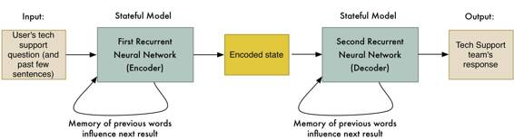

# 深度 | 使用机器学习进行语言翻译：神经网络和 seq2seq 为何效果非凡？

选自 medium

**作者：Adam Geitgey**

**机器之心编译**

**参与：吴攀、李亚洲、杜夏德**

> *此篇是系列文章 machine learning is fun 的第五部分，讲解了深度学习和 sequence-to-sequence 在机器翻译中的应用。此系列之前的文章机器之心也做过传播（[深度 | 如何掌握 Facebook 自动人脸识别技术？这篇文章为你提供生动指南](http://mp.weixin.qq.com/s?__biz=MzA3MzI4MjgzMw==&mid=2650717418&idx=1&sn=0b41e7fa9ee92535541f7e09ad1b519d&scene=21#wechat_redirect)），可点开链接浏览。英文原文章可点击阅读原文查看。*

我们都知道而且喜欢谷歌翻译（Google Translate），这个网站可以几乎实时地在 100 多种不同的人类语言之间互相翻译，就好像是一种魔法。我们还可以通过手机和智能手表使用谷歌翻译：

 

谷歌翻译背后的技术被称为机器翻译（Machine Translation），它已经在通过帮助人们互相交流而改变了世界。

但我们知道 15 年来，高中学生已经使用谷歌翻译……呃……辅助他们的西班牙语作业。这还算什么新鲜事吗？

 

事实上，过去两年来，深度学习已经改写了我们进行机器翻译的方法。对语言翻译一窍不通的深度学习研究者拿出的相对简单的机器学习解决方案正在击败由最好的人类专家打造的语言翻译系统。

这种突破背后的技术被称为序列到序列学习（sequence-to-sequence learning）。这是一种可被用来解决许多类型问题的非常强大的技术。在我们了解了该技术可以如何被用于翻译之后，我们也将理解该算法如何被用于编写人工智能聊天机器人和描述图片。

那就开始吧！

**让机器做翻译**

所以为了让计算机能翻译人类语言，我们该如何对其编程呢？

最简单的方法是使用目标语言中对应的词替换要翻译的句子中的每个词。下面是一个西班牙语到英语的逐词翻译的简单例子：

*我们只是简单地将每个西班牙语词用对应的英语词替换了。*

这是很容易做到的，因为这么做只需要一本可以查找每个词的翻译的词典。但得到的结果非常糟糕，因为其没有考虑任何语法和上下文。

所以下一步可能就是添加一些特定语言的规则以改善所得到的结果。比如说，也许需要将常见的 2 词短语作为单个词组进行翻译。另外你也许还要交换名词和形容词的顺序，因为它们在西班牙语中的顺序和在英语中的是相反的：

这种方法有用！如果我们不断增加更多规则，直到我们可以处理语言的每一部分，那我们的程序应该就能够翻译任何句子了，对吗？

这就是最早期的机器翻译系统的工作方式：语言学家想出复杂的规则，然后将它们逐一编程到系统中。在冷战期间，为了创造出能够更轻松地解读苏联通信的翻译系统，世界上一些最聪明的语言学家辛苦工作了很多年。

不幸的是，这种方法只对天气报道这样简单的和结构平直的文档有效。对于真实世界文档，它没法可靠地工作。

其问题在于人类语言并不遵循一组固定的规则。人类语言中充满了特例、地区差异、以及纯粹的打破规则。比起坐下来定义语法规则的人，影响我们说英语方式更多的是几百年前入侵英国的人。

**使用统计学让计算机更好地翻译**

在基于规则的系统失败之后，人们开始使用基于概率和统计学（而非语法规则）的模型开发新的翻译技术。

打造一个基于统计学的翻译系统需要大量训练数据，其中包含了同样的文本在至少两种语言中的表达。这种对应的翻译文本被称为平行语料库（parallel corpora）。与 1800 年代科学家使用罗塞塔石碑（Rosetta Stone）根据希腊语解读古埃及象形文字的方法类似，计算机可以使用平行语料库猜测将一种语言的文本转换成另一种语言的方式。

幸运的是，在很多奇怪的地方存在着大量这种几种语言的对应文本。比如说，欧洲议会（European Parliament）会将他们的程序（ proceedings）翻译成 21 种语言。所以研究者可以使用这些数据来帮助开发翻译系统。

*训练数据这么激动人心！但这不过是几万亿行枯燥的政府公文而已……*

**以概率的方式思考**

使用统计翻译系统的根本不同之处在于它们不会尝试生成一个确切的翻译。相反，它们会生成数千个可能的翻译，然后根据它们正确的可能性对这些翻译进行排序。它们通过检查翻译与训练数据的相似程度来确定其的「正确」程度。下面是它的工作方式：

**第 1 步：将原句子分解成块（chunk）**

首先，我们将我们的句子分解成简单的块，其中每一块都可以简单地翻译出来：

**第 2 步：找到每一块的所有可能的翻译**

接下来，我们会检查训练数据中人类对这一词块的所有翻译，然后翻译每一块。

有必要强调我们不仅是在简单的翻译词典中查找这些块，我们还会看真实的人是如何翻译真实世界中的这些同样的词块的。这可以帮助我们获取它们在不同上下文中的不同使用方式：

*即使最常见的短语也有很多可能的翻译方式*

其中一些可能的翻译比另一些更常用。基于我们的训练数据集中每种翻译出现的频率，我们可以对其进行评分。

比如说，当人们说「Quiero」时，表达「I want」的意思比「I try」的意思要常见得多。这样我们就可以根据训练数据中「Quiero」表示「I want」的频率给予这种翻译更高的权重（ weight）。

**第 3 步：生成所有可能的句子，然后找到其中最有可能的一个**

接下来，我们将使用这些块的每种可能的组合来生成一堆可能的句子。光是从第 2 步我们列出的块翻译中，我们就可以通过不同的块组合方式生成近 2500 个不同的句子变体！下面是一些例子：

> *I love | to leave | at | the seaside | more tidy.*
> 
> *I mean | to be on | to | the open space | most lovely.*
> 
> *I like | to be |on | per the seaside | more lovely.*
> 
> *I mean | to go | to | the open space | most tidy.*

但在真实世界系统中，块的可能组合方式甚至会更多，因为我们也会尝试不同的词序和句子中不同的词块划分方式：

> *I try | to run | at | the prettiest | open space.*
> 
> *I want | to run | per | the more tidy | open space.*
> 
> *I mean | to forget | at | the tidiest | beach.*
> 
> *I try | to go | per | the more tidy | seaside.*

现在需要扫描所有生成的句子以找到其中看起来「最人类」的翻译。

要做到这一点，我们需要将生成的句子和来自英语书籍和新闻故事的数百万个真实句子进行比较。我们所能获取的英语文本越多，效果就会越好。

以下面这个可能的翻译为例：

> *I try | to leave | per | the most lovely | open space.*

很可能之前从没有人用英语写过这样的句子，所以它与我们数据集中的任何句子都不会非常相似。我们给予这个可能的翻译一个较低的概率得分。

但再看下面这个可能的翻译：

> *I want | to go | to | the prettiest | beach.*

这个句子将与我们的训练集中的一些东西很相似，所以它会得到一个高概率得分。

在尝试了所有可能的句子之后，我们选出的句子将既包含最有可能的块翻译，也在整体上与真实的英语句子最相似。

我们最后的翻译结果将会是「I want to go to the prettiest beach.」还不错！

**统计机器翻译是一个巨大的里程碑**

如果有足够的训练数据，统计机器翻译系统的表现就将远远优于基于规则的系统。Franz Josef Och 改进了这些思想，并在 2000 年代早期使用它们开发出了谷歌翻译。这个世界终于可以使用机器翻译了！

这种基于概率的「愚蠢的」翻译方法效果比语言学家设计的基于规则的系统更好，在早期时所有人都对此感到惊讶。这带来了 80 年代在研究者之间广为流传的一句话：

每次我开除一个语言学家，我的准确度就会上升。

> *“time I fire a linguist, my accuracy goes up.”*
> 
> *— Frederick Jelinek*

**统计机器翻译的局限**

统计机器翻译系统效果很好，但它们的开发和维护却相当复杂。你想翻译的每一组语言对都需要专家对一个新的多步骤翻译流程进行调整和优化。

因为开发这些不同的翻译流程所需的工作实在太多了，所以必须要做出一些权衡。如果你想让谷歌将格鲁吉亚语翻译成泰卢固语，它必须先在内部将其翻译成英语作为中间步骤，因为世界上并没有那么多的格鲁吉亚语到泰卢固语的翻译，在这个语言对的互相翻译上投入巨资是不明智的。而如果你想做的是更常见的法语到英语的翻译，你所使用的翻译流程就可能会更简单一点。

如果我们让计算机把所有这些烦人的开发工作都做了，不是很赞吗？

**让计算机更好地翻译——不再需要所有这些昂贵的人**

机器翻译的圣杯是能自己学习如何翻译的黑箱系统（black box system）——只需要查看训练数据。即使有了统计机器翻译，还是需要人类来开发和调整多步骤统计模型（multi-step statistical model）。

2014 年，Kyung Hyun Cho 的团队取得了突破。他们发现了一种运用深度学习来建立黑箱系统的方法。他们的深度学习模型利用了一个平行语料库来学习如何在没有人的介入下翻译两种语言。

该方法的背后有两个关键思路——循环神经网络和编码。我们可以结合这两种方法建立一种自学习翻译系统。

**循环神经网络**

我们已经讨论过循环神经网络，现在快速回顾一下。

一个常规的（非循环）神经网络是一种通用的机器学习算法——输入一个数字列表，并计算出结果（基于之前的训练）。神经网络能作为一个黑箱来解决大量问题。比如，我们可以用它来基于一座房子的属性计算房子的大概价值。

但是像大多数机器学习算法一样，神经网络不会保存使用信息。你让输入一条数字列表，然后这个神经网络就能计算出结果。如果你在给它看同样的数字，它还会计算出同样的结果。这不是对之前的结果的记忆，换句话说，2+2 总是等于 4。

一个循环神经网络（RNN）是一种稍稍调整过的神经网络，在 RNN 中，之前的网络状态是下一次计算的输入之一  ，也就是说之前的计算会改变未来的计算结果。

 *人类讨厌他：一种让机器更聪明的奇怪小把戏！*

为什么我们想要这么做？难道说不论我们最后计算的是什么，2+2 不应该总是等于 4 吗？

这种技巧能让神经网络学习数据序列中的模式。例如，你能用它来基于一句话中前面几个词来预测后面最有可能的那个词。

*这是智能手机键盘应用实现「自动更正」的一种方式。*

任何时间你都可以用 RNN 来学习数据中的模式。因为人类语言就是一个大且复杂的模式，RNN 被越来越多地用于自然语言处理的多个领域。

**编码（Encodings）**

另一个需要回顾的是编码，我们在 Part 4 中的脸部识别中讨论过。要解释编码，让我们先绕道看看如何用一台计算机来分辨两个人。

当你用计算机区分两个不同的人时，你可以收集每张脸的不同度量，并使用这些度量来对脸进行比较。例如，我们可以测量每只耳朵的大小、眼间距，然后比较测量结果来判定他们是否是同一个人。

你可能已经在《犯罪现场调查》这种热播侦探节目中熟悉了这个方法：

 

我非常喜欢这个来自《犯罪现场调查》的蠢蠢的 gif，所以我还会使用它，因为它能清楚的证明这个方法，虽然完全可能没有道理。

将一张脸转变成测量的方法是一种编码的方法。我们输入原始数据（一张脸的图像）然后将它转换成一系列测量数据来表示它（编码）。

但是就像我们在 Part4 中看到的那样，我们没必要拿出一个特定的面部特征列表来测量自己，用一个神经网络从一张脸上生成测量数据就可以了。在找出哪种测量能最好地区分两个长相相似的人方面，计算机比我们做的更好。

*经过训练的神经网络生成的面部特征测量可以用于确保不同的人脸生成不同的测量数字。*

这就是编码（encoding）。用简单的事物（128 个数字）来表征非常复杂的东西（一张人脸图）。现在比较两张不同的脸更加容易了，因为我们只要去比较每张脸的 128 个数字就行了，不需要比较整张图像。

猜猜这种方式还能做什么？我们可以同样的方式来处理句子！我们也可以生成一系列独特数字的编码来表征每可能的不同句子：

 *这个数字列表表示英文句子 「Machine learning is Fun！」不同的句子可以表示成不同的数据集合。*

为了生成这个编码，我们会把这条句子放入这个 RNN 中，一次放入一个词。最后一个词处理后的最终结果将是代表整个句子的值：

 

*因为这个 RNN 对通过它的每个词都会形成一种「记忆」，它计算出来的最后编码表征了一条句子中的所有词。*

好，现在我们有了一种方法能够将整个句子表示为一系列独特的数字！我们不知道编码中每个数字的意义， 但这并不重要。只要每个句子能够根据自己的数字集合被识别出来，我们不需要知道这些数字具体是怎么生成的。

**让我们开始翻译！**

我们知道了如何使用一个 RNN 将一个句子编码为一系列独特的数字，这对我们有什么帮助？这里事情才开始变得有趣！

如果我们采用两个 RNN 并将它们端到端的连接起来会怎样？第一个 RNN 会生成代表句子的编码。然后，第二个 RNN 会采用这些编码，并对这同样的逻辑进行反向，从而再次解码原始句子：

 

当然，能够编码且再次解码原始语句不是非常有帮助。但如果我们能够训练第二个 RNN 将原英语解码成西班牙语会怎样呢？我们可以使用平行语料库训练数据对它们进行训练：

 

就像这样，我们有了一个将英语词序列转换为对应的西班牙语的通用方法。

这是一个有用的想法：

*   这一方法最大的限制是你拥有的训练数据的数量以及你所能投入的计算能力。机器学习研究者仅在两年前才创造出了这种方法，但其表现就已经能够比肩已经发展了 20 年的统计机器翻译系统了。

*   这种方法并不依赖于对人类语言规则的了解。算法自己能搞清楚这些规则。这意味着你不需要专家调整翻译流程中的每一步，计算机就能做到这些。

*   这种方法几乎对所有类型的序列到序列（sequence-to-sequence）问题都有效！而且事实上很多有趣的难题都是序列到序列问题。

注意我们没有谈到一些使其能在真实世界数据上有效的工作。例如，还有一项额外的工作就是处理不同长度的输入和输出句子。另外还有翻译罕见词的问题。

**打造你自己的序列到序列翻译系统**

如果你想要建立自己的语言翻译系统，这是一篇使用 TensorFlow 做英法翻译的讲解文章：https://www.tensorflow.org/versions/r0.10/tutorials/seq2seq/index.html。然而，这里面的内容不适合于新手或者预算有限的人，该技术还很新并且需要资源。即使你有一个带有高端视频卡的超快计算机，可能也要花费一个月的处理时间训练自己的语言翻译系统。

同样，序列到序列机器翻译技术进展迅速，让人难以跟上。很多近期取得的进展（像增加一个 attention mechanism 或 tracking context）极大的改进了结果，但也因为成果太新以至于连维基百科页面都还没有。如果你确实想使用序列到序列学习，你需要时刻与这些新研究保持同步。

**序列到序列模型的强大能力**

所以，我们还能使用序列到序列模型做什么呢？

大约一年前，谷歌的研究者表示你能使用序列到序列模型开发人工智能 bot。想法很简单，但惊人的是它竟然有效。

首先，他们抓取了谷歌员工和谷歌技术支持团队间的聊天日志。然后，他们训练一个序列到序列模型，把员工的问题作为输入句，技术支持团队的回答作为输入句的「译文」。

 

当用户与该 bot 交互时，他们可以使用该系统「翻译」用户的每条消息，从而得到 bot 的应答。

最终结果是一个半智能的 bot，它可以（有时）回答真正的技术支持难题。下面是来自他们论文（https://arxiv.org/pdf/1506.05869.pdf）的一个对话样本：

> *人：连接拒绝或者类似的事情* 
> 
> *机器：我可以知道你连接的网络连接的版本吗？*
> 
> *人：我不太确信版本是多少*
> 
> *机器：网络连接是否提示需要任何用户证书？*
> 
> *人：是的*
> 
> *机器：当时你是在家还是在工作？在办公室吗？*
> 
> *人：我在家*
> 
> *机器：试下这个。转到<URL redacted>页，并输入你的用户名和密码*
> 
> *人：完成*
> 
> *机器：试着输入<NAME redacted>，检查现在是否正常*
> 
> *人：yes，能工作了*
> 
> *机器：很好。还需要帮你做什么吗？*

他们也尝试基于数百万条电影字幕建立一个聊天机器人。其思路是使用字幕间的对话训练 bot ，使其能像人一样讲话。输入句是一个角色的讲白，「译文」是下个角色的对白：

产生的结果真的很有趣。不只是 bot 像人一样交谈，它也展现出了一些智能：

> *人：我的名字是 David，我的名字是什么？*
> 
> *机器：David*
> 
> *人：我的名字是 John，我的名字是什么？*
> 
> *机器：John*
> 
> *人：你是领导者还是追随者？*
> 
> *机器：领导者*
> 
> *人：你是追随者还是领导者？*
> 
> *机器：领导者*

这只是一切可能的开始。我们并不限制于将一个句子转化为另一个句子。你也可以做一个 image-to-sequence（图像到序列）模型，将一个图像转换为文本。

谷歌的另一个团队使用卷积神经网络取代第一个 RNN 就做到了这一点。这使得输入可以是一张图片而非句子。剩下的工作基本一样：

 

就像这样，我们能将图片转化为文字内容（只要我们有大量的训练数据）！

通过单独处理一张图片的多个不同区域，Andrej Karpathy 对这些思路进行了拓展，建立了一个能够极其具体地描述图片内容的系统。

这使得建立图片搜索引擎成为了可能，能够找到匹配搜索查询的图片：

也有研究者在研究其反向的问题——基于文本描述生成一张完整图片。

从这些例子中，你就可以想象未来的可能有多大。如今，从语音识别到计算机视觉，都有着序列到序列的应用。我敢说明年将会有大量更多的应用出现。

***©本文由机器之心编译，***转载请联系本公众号获得授权***。***

✄------------------------------------------------

**加入机器之心（全职记者/实习生）：hr@almosthuman.cn**

**投稿或寻求报道：editor@almosthuman.cn**

**广告&商务合作：bd@almosthuman.cn**