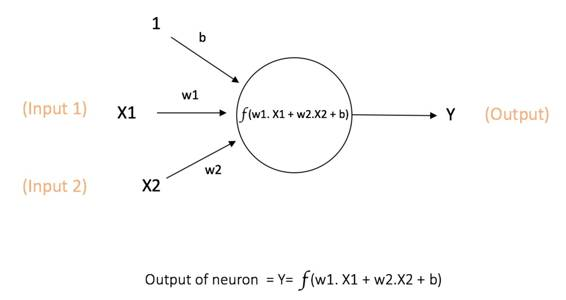
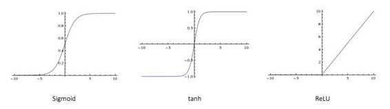
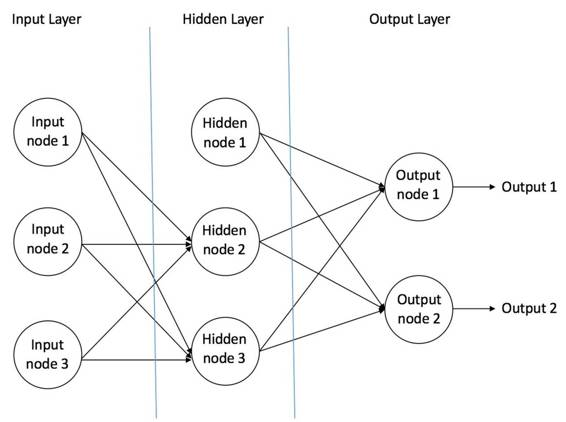
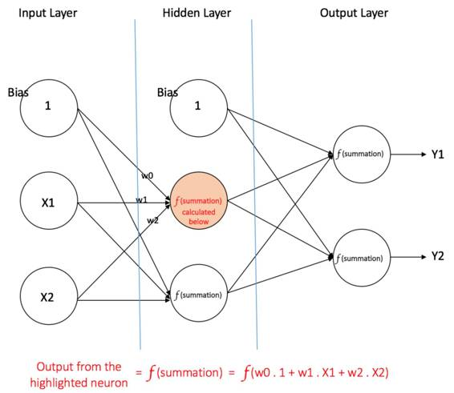
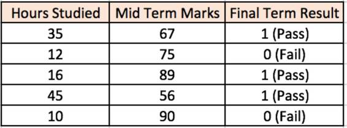
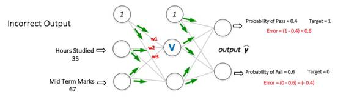
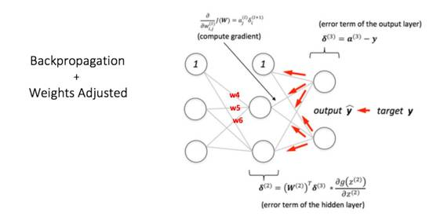
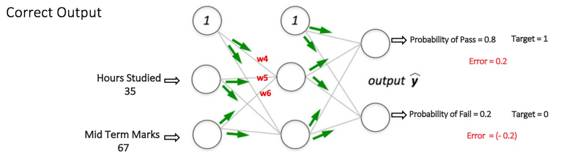
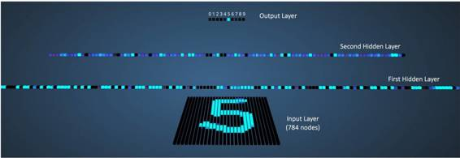

# 基础 | 神经网络快速入门：什么是多层感知器和反向传播？

选自 KDnugget

**作者：Ujjwal Karn**

**机器之心编译**

**参与：Leonardo Luke**

> *本文对多层感知器和反向传播进行入门级的介绍。作者 Ujjwal Karn 在机器学习领域有三年的从业和研究经验，对深度学习在语音和视觉识别上的应用非常感兴趣。*

人工神经网络是一种计算模型，启发自人类大脑处理信息的生物神经网络。人工神经网络在语音识别、计算机视觉和文本处理领域取得了一系列突破，让机器学习研究和产业感到了兴奋。在本篇博文中，我们将试图理解一种称为「多层感知器（Multi Layer Perceptron）」的特定的人工神经网络。

**单个神经元**

神经网络中计算的基本单元是神经元，一般称作「节点」（node）或者「单元」（unit）。节点从其他节点接收输入，或者从外部源接收输入，然后计算输出。每个输入都辅有「权重」（weight，即 w），权重取决于其他输入的相对重要性。节点将函数 f（定义如下）应用到加权后的输入总和，如图 1 所示：

*图 1：单个神经元*

此网络接受 X1 和 X2 的数值输入，其权重分别为 w1 和 w2。另外，还有配有权重 b（称为「偏置（bias）」）的输入 1。我们之后会详细介绍「偏置」的作用。

神经元的输出 Y 如图 1 所示进行计算。函数 f 是非线性的，叫做激活函数。激活函数的作用是将非线性引入神经元的输出。因为大多数现实世界的数据都是非线性的，我们希望神经元能够学习非线性的函数表示，所以这种应用至关重要。

每个（非线性）激活函数都接收一个数字，并进行特定、固定的数学计算 [2]。在实践中，可能会碰到几种激活函数：

*   Sigmoid（S 型激活函数）：输入一个实值，输出一个 0 至 1 间的值 σ(x) = 1 / (1 + exp(−x))

*   tanh（双曲正切函数）：输入一个实值，输出一个 [-1,1] 间的值 tanh(x) = 2σ(2x) − 1

*   ReLU：ReLU 代表修正线性单元。输出一个实值，并设定 0 的阈值（函数会将负值变为零）f(x) = max(0, x)

下图 [2] 表示了上述的激活函数

 

*图 2：不同的激活函数。*

偏置的重要性：偏置的主要功能是为每一个节点提供可训练的常量值（在节点接收的正常输入以外）。神经元中偏置的作用，详见这个链接：http://stackoverflow.com/q/2480650/3297280

**前馈神经网络**

前馈神经网络是最先发明也是最简单的人工神经网络 [3]。它包含了安排在多个层中的多个神经元（节点）。相邻层的节点有连接或者边（edge）。所有的连接都配有权重。

图 3 是一个前馈神经网络的例子。

 

*图 3： 一个前馈神经网络的例子*

一个前馈神经网络可以包含三种节点：

1\. 输入节点（Input Nodes）：输入节点从外部世界提供信息，总称为「输入层」。在输入节点中，不进行任何的计算——仅向隐藏节点传递信息。

2\. 隐藏节点（Hidden Nodes）：隐藏节点和外部世界没有直接联系（由此得名）。这些节点进行计算，并将信息从输入节点传递到输出节点。隐藏节点总称为「隐藏层」。尽管一个前馈神经网络只有一个输入层和一个输出层，但网络里可以没有也可以有多个隐藏层。

3\. 输出节点（Output Nodes）：输出节点总称为「输出层」，负责计算，并从网络向外部世界传递信息。

在前馈网络中，信息只单向移动——从输入层开始前向移动，然后通过隐藏层（如果有的话），再到输出层。在网络中没有循环或回路 [3]（前馈神经网络的这个属性和递归神经网络不同，后者的节点连接构成循环）。

下面是两个前馈神经网络的例子：

1\. 单层感知器——这是最简单的前馈神经网络，不包含任何隐藏层。你可以在 [4] [5] [6] [7] 中了解更多关于单层感知器的知识。

2\. 多层感知器——多层感知器有至少一个隐藏层。我们在下面会只讨论多层感知器，因为在现在的实际应用中，它们比单层感知器要更有用。

**多层感知器**

多层感知器（Multi Layer Perceptron，即 MLP）包括至少一个隐藏层（除了一个输入层和一个输出层以外）。单层感知器只能学习线性函数，而多层感知器也可以学习非线性函数。

*图 4：有一个隐藏层的多层感知器*

图 4 表示了含有一个隐藏层的多层感知器。注意，所有的连接都有权重，但在图中只标记了三个权重（w0,，w1，w2）。

输入层：输入层有三个节点。偏置节点值为 1。其他两个节点从 X1 和 X2 取外部输入（皆为根据输入数据集取的数字值）。和上文讨论的一样，在输入层不进行任何计算，所以输入层节点的输出是 1、X1 和 X2 三个值被传入隐藏层。

隐藏层：隐藏层也有三个节点，偏置节点输出为 1。隐藏层其他两个节点的输出取决于输入层的输出（1，X1，X2）以及连接（边界）所附的权重。图 4 显示了隐藏层（高亮）中一个输出的计算。其他隐藏节点的输出计算同理。需留意 *f *指代激活函数。这些输出被传入输出层的节点。

输出层：输出层有两个节点，从隐藏层接收输入，并执行类似高亮出的隐藏层的计算。这些作为计算结果的计算值（Y1 和 Y2）就是多层感知器的输出。

给出一系列特征 X = (x1, x2, ...) 和目标 Y，一个多层感知器可以以分类或者回归为目的，学习到特征和目标之间的关系。

为了更好的理解多层感知器，我们举一个例子。假设我们有这样一个学生分数数据集：

 

两个输入栏表示了学生学习的时间和期中考试的分数。最终结果栏可以有两种值，1 或者 0，来表示学生是否通过的期末考试。例如，我们可以看到，如果学生学习了 35 个小时并在期中获得了 67 分，他 / 她就会通过期末考试。

现在我们假设我们想预测一个学习了 25 个小时并在期中考试中获得 70 分的学生是否能够通过期末考试。

这是一个二元分类问题，多层感知器可以从给定的样本（训练数据）进行学习，并且根据给出的新的数据点，进行准确的预测。在下面我们可以看到一个多层感知器如何学习这种关系。

**训练我们的多层感知器：反向传播算法**

> ***反向传播误差，****通常缩写为「BackProp」，是几种训练人工神经网络的方法之一。这是一种监督学习方法，即通过标记的训练数据来学习（有监督者来引导学习）。*
> 
> *简单说来，BackProp 就像「从错误中学习」。监督者在人工神经网络犯错误时进行纠正。*
> 
> *一个人工神经网络包含多层的节点；输入层，中间隐藏层和输出层。相邻层节点的连接都有配有「权重」。学习的目的是为这些边缘分配正确的权重。通过输入向量，这些权重可以决定输出向量。*
> 
> *在监督学习中，训练集是已标注的。这意味着对于一些给定的输入，我们知道期望 / 期待的输出（标注）。*
> 
> ***反向传播算法****：**最初，所有的边权重（edge weight）都是随机分配的。对于所有训练数据集中的输入，人工神经网络都被激活，并且观察其输出。这些输出会和我们已知的、期望的输出进行比较，误差会「传播」回上一层。该误差会被标注，权重也会被相应的「调整」。该流程重复，直到输出误差低于制定的标准。*
> 
> *上述算法结束后，我们就得到了一个学习过的人工神经网络，该网络被认为是可以接受「新」输入的。该人工神经网络可以说从几个样本（标注数据）和其错误（误差传播）中得到了学习。*

现在我们知道了反向传播的原理，我们回到上面的学生分数数据集。

*图 5：多层感知器的前向传播*

图 5 中的多层感知器（修改自 Sebastian Raschka 漂亮的反向传播算法图解：https://github.com/rasbt/python-machine-learning-book/blob/master/faq/visual-backpropagation.md）的输入层有两个节点（除了偏置节点以外），两个节点分别接收「学习小时数」和「期中考试分数」。感知器也有一个包含两个节点的隐藏层（除了偏置节点以外）。输出层也有两个节点——上面一个节点输出「通过」的概率，下面一个节点输出「不通过」的概率。

在分类任务中，我们通常在感知器的输出层中使用 Softmax 函数作为激活函数，以保证输出的是概率并且相加等于 1。Softmax 函数接收一个随机实值的分数向量，转化成多个介于 0 和 1 之间、并且总和为 1 的多个向量值。所以，在这个例子中：

概率（Pass）+概率（Fail）=1

第一步：前向传播

网络中所有的权重都是随机分配的。我们现在考虑图 5 中标注 V 的隐藏层节点。假设从输入连接到这些节点的权重分别为 w1、w2 和 w3（如图所示）。

神经网络会将第一个训练样本作为输入（我们已知在输入为 35 和 67 的情况下，通过的概率为 1）。

*   网络的输入=[35, 67]

*   期望的网络输出（目标）=[1, 0]

涉及到的节点的输出 V 可以按如下方式计算（*f* 是类似 Sigmoid 的激活函数）：

V = f(1*w1 + 35*w2 + 67*w3)

同样，隐藏层的其他节点的输出也可以计算。隐藏层两个节点的输出，是输出层两个节点的输入。这让我们可以计算输出层两个输出的概率值。

假设输出层两个节点的输出概率分别为 0.4 和 0.6（因为权重随机，输出也会随机）。我们可以看到计算后的概率（0.4 和 0.6）距离期望概率非常远（1 和 0），所以图 5 中的网络被视为有「错误输出」。

第二步：反向传播和权重更新

我们计算输出节点的总误差，并将这些误差用反向传播算法传播回网络，以计算梯度。接下来，我们使用类似梯度下降之类的算法来「调整」网络中的所有权重，目的是减少输出层的误差。图 6 展示了这一过程（暂时忽略图中的数学等式）。

假设附给节点的新权重分别是 w4，w5 和 w6（在反向传播和权重调整之后）。

*图 6：多层感知器中的反向传播和权重更新步骤*

如果我们现在再次向网络输入同样的样本，网络应该比之前有更好的表现，因为为了最小化误差，已经调整了权重。如图 7 所示，和之前的 [0.6, -0.4] 相比，输出节点的误差已经减少到了 [0.2, -0.2]。这意味着我们的网络已经学习了如何正确对第一个训练样本进行分类。

*图 7：在同样的输入下，多层感知器网络有更好的表现*

用我们数据集中的其他训练样本来重复这一过程。这样，我们的网络就可以被视为学习了这些例子。

现在，如果我们想预测一个学习了 25 个小时、期中考试 70 分的学生是否能通过期末考试，我们可以通过前向传播步骤来计算 Pass 和 Fail 的输出概率。

我回避了数学公式和类似「梯度下降（Gradient Descent）」之类概念的解释，而是培养了一种对于算法的直觉。对于反向传播算法更加注重数学方面讨论，请参加此链接：http://home.agh.edu.pl/~vlsi/AI/backp_t_en/backprop.html

**多层感知器的 3D 可视化**

Adam Harley 创造了一个多层感知器的 3D 可视化（http://scs.ryerson.ca/~aharley/vis/fc/），并已经开始使用 MNIST 数据库手写的数字进行训练。

此网络从一个 28 x 28 的手写数字图像接受 784 个数字像素值作为输入（在输入层有对应的 784 个节点）。网络的第一个隐藏层有 300 个节点，第二个隐藏层有 100 个节点，输出层有 10 个节点（对应 10 个数字）[15]。

虽然这个网络跟我们刚才讨论的相比大了很多（使用了更多的隐藏层和节点），所有前向传播和反向传播步骤的计算（对于每个节点而言）方式都是一样的。

图 8 显示了输入数字为「5」的时候的网络

*图 8：输入为「5」时的视觉化的网络*

输出值比其它节点高的节点，用更亮的颜色表示。在输入层，更亮的节点代表接受的数字像素值更高。注意，在输出层，亮色的节点是如何代表数字 5 的（代表输出概率为 1，其他 9 个节点的输出概率为 0）。这意味着多层感知器对输入数字进行了正确的分类。我非常推荐对这个可视化进行探究，观察不同节点之间的联系。

**深度神经网络**

1\. 深度学习和一般的机器学习有什么区别？https://github.com/rasbt/python-machine-learning-book/blob/master/faq/difference-deep-and-normal-learning.md

2\. 神经网络和深度神经网络有什么区别？http://stats.stackexchange.com/questions/182734/what-is-the-difference-between-a-neural-network-and-a-deep-neural-network?rq=1

3\. 深度学习和多层感知器有有怎样的不同？https://www.quora.com/How-is-deep-learning-different-from-multilayer-perceptron

**结论**

在这篇文章中，我跳过了部分概念的重要细节，以促进理解。为了全面理解多层感知器，我推荐阅读斯坦福神经网络教程的第一、第二、第三和案例研究部分。如果有任何问题或者建议，请在下方评论告诉我。

第一：http://cs231n.github.io/neural-networks-1/

第二：http://cs231n.github.io/neural-networks-2/

第三：http://cs231n.github.io/neural-networks-3/

案例研究：http://cs231n.github.io/neural-networks-case-study/

**参考文献**

1\. Artificial Neuron Models (https://www.willamette.edu/~gorr/classes/cs449/ann-overview.html)

2\. Neural Networks Part 1: Setting up the Architecture (Stanford CNN Tutorial) (http://cs231n.github.io/neural-networks-1/)

3\. Wikipedia article on Feed Forward Neural Network (https://en.wikipedia.org/wiki/Feedforward_neural_network)

4\. Wikipedia article on Perceptron (https://en.wikipedia.org/wiki/Perceptron)

5\. Single-layer Neural Networks (Perceptrons) (http://computing.dcu.ie/~humphrys/Notes/Neural/single.neural.html)

6\. Single Layer Perceptrons (http://www.cs.stir.ac.uk/courses/ITNP4B/lectures/kms/2-Perceptrons.pdf)

7\. Weighted Networks – The Perceptron (http://page.mi.fu-berlin.de/rojas/neural/chapter/K3.pdf)

8\. Neural network models (supervised) (scikit learn documentation) (http://scikit-learn.org/dev/modules/neural_networks_supervised.html)

9\. What does the hidden layer in a neural network compute? (http://stats.stackexchange.com/a/63163/53914)

10\. How to choose the number of hidden layers and nodes in a feedforward neural network? (http://stats.stackexchange.com/a/1097/53914)

11\. Crash Introduction to Artificial Neural Networks (http://ulcar.uml.edu/~iag/CS/Intro-to-ANN.html)

12\. Why the BIAS is necessary in ANN? Should we have separate BIAS for each layer? (http://stackoverflow.com/questions/7175099/why-the-bias-is-necessary-in-ann-should-we-have-separate-bias-for-each-layer)

13\. Basic Neural Network Tutorial – Theory (https://takinginitiative.wordpress.com/2008/04/03/basic-neural-network-tutorial-theory/)

14\. Neural Networks Demystified (Video Series): Part 1, Welch Labs @ MLconf SF (https://www.youtube.com/watch?v=5MXp9UUkSmc)

15\. A. W. Harley, "An Interactive Node-Link Visualization of Convolutional Neural Networks," in ISVC, pages 867-877, 2015 (link (http://scs.ryerson.ca/~aharley/vis/harley_vis_isvc15.pdf))

******©本文为机器之心编译文章，***转载请联系本公众号获得授权******。***

✄------------------------------------------------

**加入机器之心（全职记者/实习生）：hr@almosthuman.cn**

**投稿或寻求报道：editor@almosthuman.cn**

**广告&商务合作：bd@almosthuman.cn**