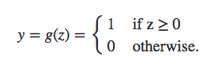

# 学界 | 神经网络中激活函数的作用

选自 kdnuggets

**作者： Sebastian Raschka**

**机器之心编译**

**参与：Chen Xiaoqing、 Genping Zhao**

> *神经网络中的激活函数的真正功能是什么？请在 kdnuggets 阅读这篇概述文章（What is the Role of the Activation Function in a Neural Network?）并查看下最下面的速查表吧。本文作者是来自密歇根州立大学的 Sebastian Raschka，她是《Python Machine Learning》一书的作者。*

尽管看起来似乎会太过琐碎，但我还是想先从「 最初的地方」开始：线性回归（Linear regression）。

（常规的最小二乘法）线性回归的目的是找到最优权重——与输入线性组合——可得出一个能够最小化目标与解释变量之间垂直偏移的模型，但是在此我们并不会讨论模型拟合，因为这是另一个话题。

因此，在线性回归中，我们会计算权重与输入的线性组合（让我们把这个函数称为「净输入函数（net input function）」）。

net(x)=b+x1w1+x2w2+...xnwn = z

接下来，我们来讲逻辑回归（logistic regression）。我们让净输入量 z 通过一个非线性「激活函数（activation function）」——即逻辑 S 型函数(logistic sigmoid function)。

.png")

把它想象成线性的净输入量被「挤压」入一个拥有良好特性的非线性方程，可以返回条件概率 P(y=1 | x)（即样本 x 隶属于类别 1 的概率）。现在，如果我们添加一个阶跃函数，例如：

*   如果 S 型函数输出大于或等于 0.5 预测为类别 1，反之为类别 0；

.png")

*   （等价于：当净输入 z 大于等于 0 → 预测为类别 1，反之为类别 0。）

这样就可以得到如图所示的逻辑回归分类器：

.png")

但逻辑回归（一种泛化的线性模型）其决策面（decision surface）是线性的，从这个层面上来看它仍然是一种线性分类器：

.png")

如果数据类别可以线性划分，逻辑回归分类器对此可以工作的很好，但我们考虑一个棘手的例子：

.png")

数据类别非线性可分。对于此处这个例子，一个非线性的分类器可能会是更好的选择，如一个多层神经网络。接下来，我训练了一个简单的多层感知器，其有一个包含 200 个这种逻辑 S 型激活函数的隐藏层。让我们从下图看一下现在决策面看起来是怎样的：

.png")

 *（注意这里我可能有点过拟合（overfitting ），但过拟合是另外的一个话题）*

全连接的前馈神经网络，看起来基本如下图这样：

.png")

在这个特例中，我们的输入层只有 3 个单元（分别为 x0 = 1 作为偏置单元， x1 和 x2 作为两个特征）；隐藏层有 200 个这样的 S 型激活函数 （am），而输出层有一个 S 型函数。其之后被送入一个单位阶跃函数（图中没有展示）产生预测的输出类别标签 y^。

总结一下，逻辑回归分类器有一个非线性激活函数，但是该模型的权重系数本质上是一个线性组合，也因此逻辑回归是一个泛化的线性模型。现在可以得到，激活函数在神经网络中的功能即通过对加权的输入进行非线性组合产生非线性决策边界（non-linear decision boundary）。

（如果你们感兴趣，更多可参考 Sebastian Raschka 在 Quora 上对「后向传播算法对于神经网络最好的可视化解译是什么？（What is the best visual explanation for the back propagation algorithm for neural networks?）」的回答并查看这种情况下的权重学习。)

为了大家方便，我增加了最常用的激活函数列表如下：

.png")

******©本文由机器之心编译，***转载请联系本公众号获得授权******。***

✄------------------------------------------------

**加入机器之心（全职记者/实习生）：hr@almosthuman.cn**

**投稿或寻求报道：editor@almosthuman.cn**

**广告&商务合作：bd@almosthuman.cn**