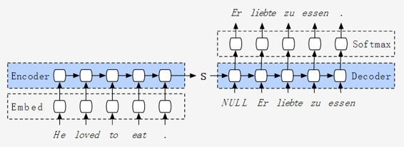
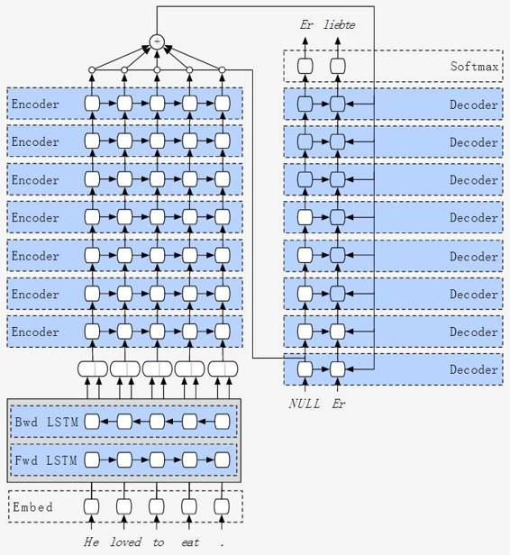

# 深度 | 逐层剖析，谷歌机器翻译突破背后的神经网络架构是怎样的？

选自 SMERITY

**机器之心编译**

谷歌神经机器翻译（GNMT）论文《Google's Neural Machine Translation System: Bridging the Gap between Human and Machine Translation》描述了一种将深度学习融入产品的有趣方法。该论文和架构是不标准的，在很多情况下偏离学术论文中的架构。通过典型但计算密集型的调整，谷歌这个系统的重点是保证系统的实用性而并非追求顶尖结果。

**架构**

为了理解 GNMT 中使用的模型，我们将从传统的编码器-解码器机器翻译模型开始，持续变化该模型直到匹配 GNMT 中的模型。看起来，GNMT 进化的东西是改进准确率，同时维持实际产品化时的训练与预测速度。

**V1：编码器-解码器**

编码器-解码器架构开始了近期的神经机器翻译趋势，出现于数年前。如同名字中的含义，该架构包含两个组件：一个解码器和一个编码器。

一个词级的编码器-解码器机器翻译系统，如同下面所描述的：

*   采用一个循环神经网络，通常是 LSTM 来编码用语言 A（英语）写出的语句。

*   该 RNN 吐出一个隐态（hidden state），我们称之为 S。

*   该隐态有希望表征前面编码出的语句的所有内容。

*   然后 S 被应用到解码器，一个单词一个单词的生成 B 语言（德语）句子。

编码器-解码器展示了基于神经的机器翻译可能提供的潜力。即使有了如今复杂的神经机器翻译架构，大部分还是根据解码器-编码器架构分解出的产物。

该架构有两个主要的缺点，都和长度有关。第一个，像人类一样，该架构记忆有限。LSTM 最后的隐态，也就是 S，要死记硬背需要翻译的句子的全部内容。S 通常只有数百个 unit（读取：浮点数），你越是尝试挤入固定维数向量，该神经网络也被迫有更多损失。可以将神经网络的这个过程看作是一种有损压缩，有时候这是很有用的。

第二，根据经验法则，神经网络越深，越难以训练。对循环神经网络而言，序列越长，神经网络随着时间维度越深。这造成了梯度的消失，也就是随着反向传输，循环神经网络学到的目标的梯度信号会消失。即使 RNN 是专门用来帮助防止梯度消失的，比如 LSTM，这仍然是个根本性的问题。

*图：来自 Bahdanau 等人的论文 "Neural Machine Translation by Jointly Learning to Align and Translate" (2014)，展示了在翻译得分（评分形式为 BLEU 得分）随着语句变长后的影响。*

虽然它在短句上有效，但当句子变得更长时就开始失效了。记忆问题的一种解决方案是增加 LSTM 隐态的大小。不幸的是，如果我们这么做训练速度也变得不够现实了。随着增加 LSTM 的隐藏大小，参数的数量也次方数的增加。你会耗尽 GPU 的存储或训练时间过长。这种方法也无法解决梯度消失问题。

**V2：基于注意力的编码解码器 **

我们如何解决上面那些问题？或许会尝试一个人类天生会使用的技能——反复关注源句的相关部分。如果你在翻译一条长句子，你可能会回头看一看源句，确定你捕捉到了所有细节信息。我们能让神经网络也做到这些。我们可以通过存储和指定 LSTM 之前的输出来增加神经网络的存储，同时不用改变 LSTM 的操作。此外如果我们知道对句子的某个特定部分感兴趣，那么注意力机制就会做一个「shortcut」，因此我们就能提供出一个无需遍历大量时间步的监督信号，而遍历时间步会导致梯度消失。这就类似于一个人在读完指环王所有的书后可能会回答的一个问题。如果我想问一个关于这本书开头的特定问题，比如夏尔袋底洞（Bag End），这个人就知道在这部系列小说的第一本中的哪一一页能找到答案。系列小说的长度不会影响你查找答案的能力。

 

简单来说（由于注意力机制已经很好地覆盖到其他地方）这个想法就是，一旦你有了从存储的编码器获取的 LSTM 输出，你就可以通过问询它们是如何与解码器端的电流计算相关的来查询每一条输出。编码器的每一条输出后面都会获得一个相关性得分，我们可以将这个相关性得分转换成一个概率分布，再通过 softmax 激活来归一。然后我们可以提取一个语境向量（context vector），这是一个编码器输出的加权求和，其结果取决于我们认为它们是如何相关的。

注意力机制的一个缺点是我们现在必须为每一个解码器的输出执行所有经过编码的源句的计算。虽然这有利于句子之间的翻译，但可能给长输出带来问题。在计算术语中，如果你的源句与 NN 的长度相当，同时你的目标句与 MM 的长度相当，我们就可以将编码器-解码器架构中的 O(M)O(M) 的解码器带入注意力架构中的 O(MN) O(MN) 中。虽然不是最好的方法，但至少在这个任务上，注意力机制优点远远大于缺点。

注：你或许会注意到编码器和解码器（之前架构中的 S）之间的直接连接已经消失了。虽然很多标准的编码器-解码器结构维持了这个直接连接，但是 GNMT 架构会消除这个连接。GNMT 架构会以信息能从编码器端转移到解码器端的方式来形成注意机制。

 

*图：Bahdanau 等人的论文「Neural Machine Translation by Jointly Learning to Align and Translate"(2014) 中的图像。显示了使用注意力对翻译成绩的影响（以 BLEU 得分的形式）。RNN 搜索是带有注意力的架构，后面的数字指的是训练样本的长度。*

**V3：双向编码器层（BI-DIRECTIONAL ENCODER LAYER）**

虽然注意力机制允许根据解码上下文检索句子的不同部分，但还是有一个问题。注意机制基本上会问这个编码器的存储输出「你是不是跟这个相关？」并用答案来决定提取什么样的信息。如果编码器输出自己没有充分的语境，它们就不太可能给出一个好答案。

加上后面的单词的相关信息，例如编码器输出由左右两边的词决定，显然是有益的。如果有一个完整的句子可用，人类几乎肯定会用完整的语境来决定一个词的意思和语境。那为什么我们要强迫计算机不去使用所有的信息呢？而且这对它们真的是一个障碍。

 

加上这个双向性的最简单的方法是运行两个 RNN，一个在句子中前进，一个在句子中后退。然后，对每一个词，我们连接（concatenate）或者添加所产生的向量输出，从两边产生一个带有语境的向量。在你翻译一种有不同排序（例如从左向右）的语言时（例如无论用另外一种语言翻译这个语言，还是把这个语言翻译成另一种语言），双向的编码器就会变得更重要。GNMT 架构连接（concatenate）它们，潜在的优势是向前和向后的 RNN 的结果只有一半大小。由于双向层最终会成为 GNMT 中的一个瓶颈，同时 RNN 中的参数数量也会几何增长，所以这不是一个不重要的节省。

**V4：「为深度学习增加深度」**

对于许多神经机器翻译的架构而言，增加深度是精确模型中的关键组成部分。GNMT 架构也通过添加大量的层来增加模型的精度——研究者们使用了 8 层编码器与 8 层解码器的 16 层结构，令目前大多数最好的机器翻译系统望尘莫及。

 在编码器中，谷歌的模型具有一个双向的 RNN 层，随后是七个单向的 RNN 层。解码器则是八个单向 RNN 层。

在大多数文章的翻译中，全部层都是双向的可以增加准确性。具有全部双向层的模型可以获得相同或更好的结果，谷歌并没有这么做，我们将在下一部分解释 GNMT 这么做的理由。

 

循环神经网络在训练中有很多不确定性。事实上，这种深度的标准神经网络需要进行大量的训练，和其他类型的系统不同，它相对简单，不会出现许多时间步。我们会在未来的尝试解决这个问题。

**V5：并行**

GNMT 构架最主要的动力就是它的实用性。这个令其在和标准编码器（解码器架构 decoder architectures）相比较的时候显得有些局限和奇怪。为了将像 GNMT 那样的系统转化为产品，并行化就是必要的了。它不仅仅训练地更快、允许更多的试验，同时也让产品部署得更快。

我们现在看到的这幅图表不仅仅是机器翻译模型的构架，它更是个相关图（dependency graph）。在一个结点开始计算，所有接近你的结点都需要是已经计算过了的。即使你有无限的计算量，但仍然需要符合相关图表流。同样的，你想最小化相关性就可能相比于相似层级需要更多的计算量。

 

注：无遮盖结点（Unshaded nodes）还没有完成的时候，白遮盖节点（nodes shaded white）已经完成了它的计算。蓝遮盖层（Layers shaded blue）也处于计算的过程或已经完成了计算。这也就是为什么只使用了单一双向的循环神经网络（RNN）。双向层是两个循环神经网络组成的，一个从左至右另一个从右至左。这意味着计算第一个输出需要等待从右边到你现在位置共 N 个计算量（N 是序列的长度）

如果层级是双向的，全部这一层就会在任何后面的相关性层开始计算前完成计算。但是如果使用的是单向层级，我们的计算就能有够多的灵活性与并行性。在上面的例子中，仅仅关注编码部分，最前面的四层网络全都是同时计算结点。这是上层神经网络不依赖于所有下层网络节点唯一可能性，只要是直属下层的。如果是双向神经网络，那就不可能了。

 

**并行（解码器侧）**：由于使用解码器侧的所有输出的注意机制，解码器侧必须等待，直到所有编码器完成处理。但在编码器完成时，解码器能以和编码器侧相同的并行方式执行任务。通常，注意机制将使用解码器的最顶部输出来查询注意机制，但 GNMT 架构使用最低的解码器层来查询注意机制以最小化依赖图，并且允许最大并行化。在上面的例子中，如果我们使用最高的解码器层作为注意（attention），我们将无法开始计算解码器的第二输出，因为解码器的第一个输出仍在进行中。

**旁注（强制教育和训练对生产）**：在训练期间，我们已经知道英语句子需要翻译成什么。这允许我们具有比在预测时更高的并行性水平。由于我们已经有了所有正确的词（在右下角的「已知」翻译），我们可以强迫系统使用它。强制教育是你给神经网络下一个词的正确答案，即使它实际上已经预测出错误的词。这种方式是有效的，训练将继续迫使神经网络输出正确的词，系统最终会输出正确的结果。这种方式允许你在计算第一个输出字的过程中「作弊」并计算第二个输出字。在原有情况下，我们需要等待系统逐词输出，而且不能加入「已知」的翻译。

**旁注（多 GPU）**：这种并行化只有在多 GPU 情况下才有效率。在 GNMT 论文中，他们的图示实际上是根据 GPU 的数量来标记每个图层的。对于编码器和解码器而言，谷歌的方法使用了八个 GPU——每层一个。它对单 GPU 有没有意义？通常，在计算给定图层时，GPU 应该达到高利用率（假设你能够设置合理的批量大小，网络大小和序列长度）。这项工作有关重新排序的依赖性，重新排序允许立即进行更多的计算，允许更好地利用更多的设备。在 GPU 情况下，并行计算并不会提高效率，而在多 GPU 的情况下，这种重新排序能够显著加快速度。

**V6：残差是新的热点**

八层神经网络至少对循环神经网络已经是很深了，从一般经验法则来看，除了一些异常情况或特定结构外，更深的神经网络是更难以训练的。当然这有许多原因，最直观的就是有更深的梯度需要计算路径，它消失或爆炸（vanishing or exploding）的风险就越高。幸运的是，现在有很多很有潜力的方式来解决这一问题。

一个解决梯度消失（vanishing gradients）的方法就是使用残差网络（residual networks），著名的卷积神经网络（CNN）就是训练数百层深度残差网络组成神经网络。想法是相当简单的，通过默认一层神经网络计算一个恒等函数（identity function）。这是很有道理的，如果你在一层上面做得挺好，就不会期望二或三层运行得差。最坏的情况也是第二层和第三层只会不加修改地「复制」第一层输出。所以每层只需要学习一个恒等函数。

不幸的是，学习这样的恒等函数（identity function）好像对多数神经网络不算太麻烦。更糟的是后面的的层级作为监督信号会打乱前面层级的训练，也就是它打算要去方向是持续改变的。同样地，第一层在有很多层级在它下面的情况下也就根本不会训练地很好。

 

为了解决这个问题，我们侧重构建这些层级在表达恒等函数时不同权重的表现。

 

**集众家所长的谷歌神经机器翻译 **

GNMT 文章中所描述的架构建立在之前算法的迭代之上。尽管十分复杂，它仍然遵循编码器-解码器的流程。它看起来可能让人望而生畏，但每个变化都是由一个简单的想法驱动的。

**总结**

谷歌神经网络翻译的架构非常有趣，它在算法上没有太多创新，真正精妙的地方在于架构设计。如果把它比作一条船，它的船型是如此的完美，能快速穿过充斥波浪的水域而不受一点阻力。以上我们已经讨论了执行各种任务的架构——有关翻译和自然语言生成，它们完全可以应用到其他大计算量的密集型任务中。我们希望很快就会见到这些方式的更多应用。

本文是谷歌新论文的一小部分介绍，没有详细讨论 BLEU 的细节，词汇级粒度（granularity）如何改进词级别的翻译效果，BLEU 的优缺点，在快速部署中量化模型，在各种优化算法中选择以获得更好收敛，以及在数据集过大情况下不要使用 dropout 等话题。

******©本文为机器之心编译文章，***转载请联系本公众号获得授权******。***

✄------------------------------------------------

**加入机器之心（全职记者/实习生）：hr@almosthuman.cn**

**投稿或寻求报道：editor@almosthuman.cn**

**广告&商务合作：bd@almosthuman.cn**