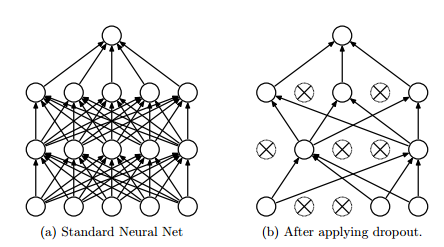
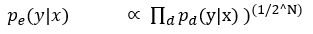

# 深度 | 深度学习与神经网络全局概览：核心技术的发展历程

选自 AnalyticsVidhya

**作者： Syed Danish Ali、Rahul Ahuja**

**机器之心编译**

**参与：吴攀、李亚洲**

随着神经网络的进化，许多过去曾被认为不可想象的任务现在也能够被完成了。图像识别、语音识别、寻找数据集中的深度关系等任务现在已经变得远远更加简单了。在此向这一领域的杰出的研究者致以真诚的谢意，正是他们的发现和成果帮助我们利用上了神经网络的真正力量。

如果你真正对追求机器学习这一门学科感兴趣，你必需要对深度学习网络有透彻的理解。大部分机器学习算法在处理具有多个变量的数据集时往往会有准确度下降的问题，而深度学习模型则能在这些情形中产生「奇迹」。因此，了解深度学习模型的工作方式对我们来说是非常重要的。

在这篇文章中，我会解释用于深度学习的一些核心概念，即哪些类型的后台的计算导致了模型准确度的提升。此外，我也会分享各种建模的技巧，并简单论述一下神经网络的发展历史。

 

**目录**

一、神经网络的历史

二、单层感知器

三、多层感知器

*   参数初始化

*   激活函数

*   反向传播算法

*   梯度下降

*   成本函数

*   学习率

*   动量

*   Softmax

*   多层感知器：总结

四、深度学习概览

*   受限玻尔兹曼机和深度信念网络

*   Dropout

*   处理类不平衡的技术

*   SMOTE：合成少类过采样技术

*   神经网络中对成本敏感的学习

**一、神经网络的历史**

神经网络是当今深度学习领域技术突破的基石。神经网络可被看作是一种大规模并行的简单处理单元，它能够存储知识（knowledge）并使用这种知识来做出预测。

神经网络需要通过学习过程来从其环境中获取知识，这个过程模拟了生物大脑的工作方式。然后，被称为突触权重（synaptic weight）的干涉连接强度可被用于存储获取到的知识。在学习过程中，神经网络的突触权重会以一种有序的方式进行修改，从而实现所需的目标。1950 年，神经心理学家 Karl Lashley 发表了一篇将大脑视作分布式系统的论文。

人们将神经网络与人脑进行比较的另一个原因是它们的运行方式都像是非线性的并行信息处理系统，可以执行模式识别和感知这样的计算。因此，这些网络在语音、音频和图像识别等本质上是非线性的输入/信号上可以具有非常良好的表现。

神经网络先驱 McCulloch 和 Pitts 在 1943 年发表了一篇对一个有两个输入和一个输出的模型的研究文章。该模型具有以下特性：

要一个神经元被激活，必需满足以下条件：

*   其中一个输入是激活的

*   每个输入的权重相等

*   该模型的输出是二元的

通过对输入值求和得到的输出要么是 1，要么是 0；所以这样的计算存在一个特定的阈值。

Hebb 在其 1949 年的著作《The Organization of Behaviour（行为组织）》中第一次提出了这一思想：为了应对任务的变化，大脑中的连接会不断发生改变。这样的规则意味着两个神经元之间的连接在这同一时间内是激活的。这一思想很快就变成了开发学习的计算模型和自适应系统的灵感来源。

人工神经网络有能力从被提供的数据中学习，这被称为自适应学习（adaptive learning），而神经网络创造其自己的组织或信息表征的能力则被称为自组织（self-organisation）。

15 年后，Rosenblatt 于 1958 年开发出了感知器（perceptron），成为了神经元的下一个模型。感知器是最简单的神经网络，能将数据线性地分为两类。后来，他随机地将这些感知器互相连接，并使用了一种试错方法来改变权重以进行学习。

1969 年，在数学家 Marvin Minsky 和 Seymour Parpert 发表了一篇对感知器的数学分析后，这个方向的研究在接下来的 15 年里陷入了停滞。他们的研究发现感知器无法表征很多重要的问题，比如异或函数（XOR）。其实，那时的计算机还没有足够的处理能力来有效地处理大型神经网络。

1986 年，Rumelhart、Hinton 和 Williams 报告他们所开发的反向传播（back-propagation）算法能够解决 XOR 这样的问题，并由此开启了第二代神经网络。同一年，Rumelhart 和 McClelland 编辑的两卷知名著作《Parallel Distributed Processing: Explorations in the Microstructures of Cognition（并行分布式处理：认知的微结构中的探索）》发表。这本书在反向传播的应用上产生了很大的影响，而反向传播也已经在多层感知器的训练上成为了最为流行的学习算法。

**二、单层感知器（SLP）**

感知器的最简单形式是在输入和输出之间有一个单层的权重连接。这种形式可被看作是最简单的前馈网络（feed-forward network）。在一个前馈网络中，信息总是向一个方向移动，永不回头。

*图 1*

图 1 就是一个单层感知器，可用来更轻松地理解前面所解释的多层感知器的概念基础。单层感知器表示了网络中一个层和其它层之间的连接的 m 权重，该权重可被看作是一组突触或连接链。这个参数表示了每个特征 xj 的重要性。下面是输入乘以它们各自的突触连接这一功能的加法器函数：

其偏置 bk 用作对加法器函数 uk 得到 vk 的输出的仿射变换（ affine transformation），其诱导局部域（induced local field）为：

 

**三、多层感知器（MLP）**

多层感知器也被称为前馈神经网络（feed-forward neural network），由每一层都完全连接到下一层的层序列组成。

一个多层感知器在输入和输出层之间有一个或多个隐藏层，其中每一层都包含多个通过权重链接彼此互连的神经元。输入层中神经元的数量即为数据集中属性的数量，输出层中神经元数量是对数据集的给定类别的数量。

*图 2*

图 2 是一个至少有三层的多层感知器，其中每一层都和前一层相连。要使这个架构做到深度，我们需要引入多个隐藏层。

**参数的初始化**

在参数的初始化中，权重（weight）和偏置（bias）在确定最终模型的过程中发挥了重要的作用。关于初始化策略的文献资料有很多。

一个好的随机初始化策略可以避开局部极小值的困境。局部极小值（local minima）问题是指网络在训练过程中受困于错误的表面而不能深入，即使该网络还仍有学习的能力。

使用不同的初始化策略进行实验已经超出了本文的研究范围。

初始化策略应该根据所使用的激活函数进行选择。对于双曲正切函数，初始化区间应该为

 

其中 fan in 是第 i-1 层的单元的数量，fan out 是第 i 层的单元的数量。类似地，对于 S 型激活函数，初始化区间应该为

 

这些初始化策略能在网络训练的早期阶段确保信息向上和向后传播。

**激活函数**

激活函数将诱导局部域 v 下的神经元的输出定义为：

 

其中 φ( ) 是该激活函数。激活函数有很多种，下面给出常用的一些：

1.阈值函数（Threshold Function）

上图表示该神经元要么是激活的，要么就是非激活的。但是，该函数是不可微分的，这在使用反向传播算法时非常重要（稍后解释）。

2\. S 型函数（Sigmoid Function）

和阈值函数一样，S 型函数是一个取值在 0 到 1 之间的逻辑函数，但该激活函数是连续可微的。

其中 α 是该函数的斜率参数（slope parameter）。此外，该函数在本质上是非线性的，这有助于确保权重和偏置中的较小改变能在神经元的输出中产生较大的变化。

3.双曲正切函数（Hyperbolic Tangent Function）

φ(v) = tanh (v)

该函数可让激活函数的取值在 -1 到 +1 之间。

4.修正线性激活函数（ReLU）

ReLU 是许多逻辑单元之和的平滑近似，能够产生稀疏的活动向量。下面是该函数的方程式：

 

*图 3*

在图 3 中

是对修正器（rectifier）的平滑逼近

5\. Maxout 函数

2013 年，Goodfellow 发现使用了一种新的激活函数的 Maxout 网络是 dropout 的天然搭档。

Maxout 单元能促进 dropout 的优化以及提升 dropout 的快速近似模型平均技术（fast approximate model averaging technique）的准确度。单个 Maxout 单元可被理解为是对一个任意凸函数的片（piece）形式的线性近似。

Maxout 网络不仅能学习隐藏单元之间的关系，还能学习每个隐藏单元的激活函数。下面是关于其工作方式的图形化描述：

*图 4*

图 4 展示了带有 5 个可见单元、3 个隐藏单元和每个隐藏单元 2 个片的 Maxout 网络。

其中 W...ij 是通过获取矩阵

 

中第二个坐标 i 和第三个坐标 j 的输入大小的平均向量。中间单元 k 的数量被称为 Maxout 网络所用的片（piece）的数量。

**反向传播算法**

反向传播算法可用于训练前馈神经网络或多层感知器。这是一种通过改变网络中的权重和偏置来最小化成本函数（cost function）的方法。为了学习和做出更好的预测，会执行一些 epoch（训练周期）；在这些 epoch 中，由成本函数所决定的误差会通过梯度下降被反向传播，直到达到足够小的误差。

**梯度下降（Gradient descent）**

1.mini-batch 梯度下降

比如说在 100 大小的 mini-batch 中，会有 100 个训练样本被展示给学习算法，权重也会据此更新。在所有的 mini-batch 都依次呈现之后，每个 epoch 的准确度水平和训练成本水平的平均都会计算出来。

2.随机梯度下降

随机梯度下降被用在实时在线处理中，其中参数仅在呈现一个训练样本时才更新，所以准确度水平和训练成本的平均是从每个 epoch 的整个训练数据集上获得的。

3.full batch 梯度下降

在这种方法中，所有的训练样本都会被展示给学习算法，然后再更新权重。

**成本函数（Cost Function）**

成本函数有很多种，这里给出几个例子：

1.均方误差函数

 

其中 yi 是预测的输出，oi 是真实的输出。

2.交叉熵函数

其中 f 函数是模型在输入 xi's 的标签是 li 时的预测概率，W 是它的参数，n 是训练 batch 的大小。

3.负对数似然损失（NLL）函数

NLL 是用于本报告的所有实验中的成本函数：

其中 y(i) 是输出的值，x(i) 是特征输入的值，θ 是参数，D 是训练集。

**学习率（Learning rate）**

学习率控制着权重从一次迭代到另一次迭代的变化。一般来说，更小的学习率被认为是稳定的，但学习速度也更慢。另一方面，更高的学习率可能不稳定，会引起振荡和数值误差，但会加速学习过程。

**动量（Momentum）**

动量为避免局部极小值提供了惯性；其思想简单来说就是为当前的权重更新增加特定比例的先前的权重更新，这有助于避免受困于局部极小值。

 

其中 α是动量。

**Softmax**

Softmax 是一种神经传递函数，其是可将向量变成概率的输出层中实现的 logistic 函数的广义形式。这些概率的总和为 1 且限定于 1。

 

**多层感知器（MLP）：总结**

对于分类任务，输出层可能会整合一个 softmax 函数用来给出每个发生类（occurring class）的概率。激活函数使用输入、权重和偏置在每个层中计算每个神经元的预测输出。

反向传播方法一种训练多层神经网络的方法，该方法通过修改层之间的突触连接权重以在纠错学习函数（需要是连续可微的）的基础上提升模型的性能。以下的参数在本实验中进行了评估：

*   隐藏层的数量

*   隐藏层中神经元的数量

*   学习率和动量

*   激活函数的类型

**四、深度学习概览**

在 2006 年之前，有各种各样的训练深度监督前馈神经网络的失败尝试是由在不可见的数据上的性能的过拟合导致的；即在训练误差降低的同时验证误差却在增长。

深度网络通常是指拥有超过 1 个隐藏层的人工神经网络。训练深度隐藏层许多更多算力。更深似乎是更好的，因为直观上来说，神经元可以利用其下面的层中的神经元所得出的结果，这可以得到数据的分布式表征。

Bengio 认为隐藏层中的神经元可被看作是其下面的层中的神经元所学到的特征检测器（feature detector）。这个结果处于作为一个神经元子集的更好泛化（generalization）中，而这个神经元子集可从输入空间中的特定区域的数据上进行学习。

此外，更深度的架构可以更加高效，因为表现相同的功能所需的计算单元更少，从而能实现更高的效率。分布式表征背后的核心思想是统计优势的共享，其中该架构的不同组件会根据不同的目的而被复用。

深度神经架构是由多个利用非线性操作的层组成的，例如在带有许多隐藏层的神经网络中。数据集中常常存在各种变化的因素，例如数据各自的性质经常可能独立地变化。

深度学习算法可以获取解释数据中统计变化的因素和它们交互的方式，从而生成我们观察的那种类型的数据。较低层次的抽象更直接依赖于特定的观察；而更高层次的也更抽象，因为它们感知数据的连接也更加遥远。

深度架构学习的重点是自动发现这样的抽象——从低水平的特征到更高水平的概念。可以预期，这样的学习算法可以在没有人工定义必要的抽象的情况下进行这样的发现。

数据集中的训练样本的多样性必须至少和测试集一样，否则学习算法就不能归纳。深度学习方法的目的是学习特征层次，将更低层次的特征组成更高水平的抽象。

带有大量参数的深度神经网络是非常强大的机器学习系统。但是，过拟合（over-fitting）是深度网络的一个严峻难题。过拟合是指当验证误差开始增长时，训练误差却在下降。Dropout 是一种用于解决这一问题的正则化技术，将在后面介绍。

今天深度学习技术成功增长的两个最重要因素的其中之一是计算算力的进步。图形处理单元（GPU）和云计算对深度学习在许多问题上的应用是至关重要的。

云计算可实现计算机的集群和按需处理，这有助于通过并行化神经网络的训练来减少训练时间。另一方面，GPU 是为高性能数学计算设计的专用芯片，可以加速矩阵的计算。

在 2006-2007 年间，有三篇论文对深度学习这一学科产生了革命性的影响。他们的成果的关键原理是每一层都可通过无监督学习的方式进行预训练，一次处理一层。最后，使用误差的反向传播的监督训练可被用于精确调节所有的层，使得这种通过无监督学习进行的初始化比随机初始化更好。

**受限玻尔兹曼机和深度信念网络**

受限玻尔兹曼机（RBM）是一种无监督算法，可被用于预训练深度信念网络。RBM 是玻尔兹曼机的简化版本，受到了统计力学的启发。这种方法是基于给定数据的潜在分布的概率对能量（ energy）建模，这些给定的数据集来自可以派生出的条件分布。

玻尔兹曼机是随机处理可见单元和隐藏单元的双向连接网络。其原始数据（ raw data）对应于「可见」神经元和被观察状态的样本，而且特征检测器对应于「隐藏」神经元。在玻尔兹曼机中，可见神经元为网络和其所在的操作环境提供输入。在训练过程中，可见神经元受到了钳制（调到固定值，由训练数据确定）。另一方面，隐藏神经元自由运行。

然而，玻尔兹曼机因为其连通性而非常难以训练。一个 RBM 限制了连通性从而使得学习变得简单。在组成二分图（bipartite graph）的单层中，隐藏单元没有连接，如图 2。它的优势是隐藏单位可以独立更新，并且与给定的可见状态平行。

这些网络受到了一个能量函数的管控，它决定了隐藏/可见状态的概率。隐藏/可见单位的每个可能的连接结构（ joint configurations ）都有一个由权重和偏差决定的 Hopfield 能量。连接结构的能量由吉布斯采样优化，它可通过最小化 RBM 的最低能量函数学习参数。

*图 5*

在图 5 中，左边的层表示可见层，而右边的层表示隐藏层

在深度信念网络（DBN）中，RBM 是通过带有重要特征的输入数据进行训练的，这些输入数据是由隐藏层中的随机神经元获取的。在第二层，训练特征的激活（activation）被当作输入数据处理。第二层 RBM 层中的学习过程可被看作是学习特征的特征，每次当一个新的层被添加到深度信念网络中时，原始训练数据的对数概率上的可变的更低的界限就会获得提升。

 

*图 6*

图 6 展示了 RBM 将它的数据分布转变成了隐藏单元上更后面的分布

RBM 的权重是被随机初始化的，造成了分布中 p(x) 和 q(x) 的不同。在学习过程中，权重被迭代调整，从而最小化 p(x) 和 q(x) 之间的误差。在图 2 中，q(x)是源数据的近似，p(x) 是源数据。

调整来自一个神经元和其他神经元的突触权重的原则不受是否是隐藏还是可见神经元的支配。通过 RBM 层更新的参数可被用于 DBN 的初始值，DBN 可通过反向传播的监督训练精调所有的层。

在 KDD Cup 1999 的 IDS 数据上，适合使用多模态（Bernoulli-Gaussian）RBM 作为包含混合数据类型的 KDD Cup 1999，这些数据类型特别连续且明确。在多模态 RBM 中，有两个不同的信道输入层，一个用于连续特征的高斯输入单元，另一个是其中使用到了二元特征的 Bernoulli 输入单元层。多模态 RBM 的使用不在本文的讨论范围之中。

**DROPOUT**

近期的一些进展已经引入了强大的正则化矩阵（regularizers）来减少神经网络的过拟合。在机器学习中，正则化是附加信息，通常作为一种惩罚机制被引入——惩罚导致过拟合的模型的复杂性。

Dropout 是 Hinton 引入的一种深度神经网络的正则化技术，通过在每一个训练迭代上随机关掉一部分神经元，而是在测试时间使用整个网络（权重按比例缩小），从而防止特征检测器的共适应。

Dropout 通过等同于训练一个共享权重的指数模型减少过拟合。对于给定的训练迭代，存在不同 dropout 配置的不同指数，所以几乎可以肯定每次训练出的模型都不一样。在测试阶段，使用了所有模型的平均值，作为强大的总体方法。

 

*图 7*

图 7 中，dropout 随机舍弃神经网络层级之间的连接

*图 8*

图 8 中，在训练时间，连接有一定的概率被舍弃，同时在训练时间中权重按比例缩小到 ρw

在很多机器学习竞赛中，平均众多模型（Averaging many model）总是获胜的关键。很多不同类型的模型被使用，然后结合起来在测试阶段做预测。

随机森林是一个非常强大的 bagging 算法，它是通过平均很多决策树，给它们不同的带有重置的训练样本集创造的。众所周知，决策树非常容易拟合数据，而且在测试时间进行得非常快，所以通过给它们不同的训练集来平均不同的决策树是负担得起的。

然而，使用同样的深度神经网络方法的计算成本是非常昂贵的。训练单独的神经网络和多种神经网络的成本已经很高了，再平均它们看起来是不现实的。此外，我们需要的是在测试时间有效的单个网络，而不是有大量的大型神经网络。

Dropout 是平均很多大型神经网络的有效方式。每次训练模型的隐藏单元的时候都能像图 8 中那样以一定的概率漏掉一些。这个概率通常是 ρ=0.5 时。因此，带有减半的开支权重（outgoing weight）的「平均网络」模型可以在测试时间像图 4 中那样使用。平均网络等同于采用概率分布的几何平均数，该分布是通过所有带有单隐层单位和 Softmax 输出层的网络进行标记预测的。

依照数学证明 dropout 如何可被视为一个集成方法：

是总效果的预测，使用几何平均数。

 

是单个子模型的预测。

d 是区分将哪个输入包括到 softmax 分类器中的二元向量。

假设有不同的单元，将会有 2^N 的可能分配到 d。

其中 y 是单个的，也是类目录（class index）的向量。

由单个子模型输出的概率综合被用于正则化。 

依照 softmax 的定义

所以预测概率肯定与这成比例。为了重新正则化上面的表述，它被

相除，这意味概率分布是

另一种看待 dropout 的方式是，它能防止特征检测器间的共适应（co-adaption）。特征检测器间的共适应意味着如果一个隐藏单位知道其他隐藏单位所代表的内容，它就能在训练数据上与它们共适应。然而，在测试数据集上复杂的共适应可能会难以泛化。

Dropout 也能以一种低概率应用于输入层，典型的是 20% 的概率。这里的概念和降噪自动编码器发展出的概念相同。在此方法中，一些输入会被遗漏。这会对准确性造成伤害，但也能改善泛化能力，其方式类似于在训练时将噪声添加到数据集中。

在 2013 年 dropout 的一个变体出现，叫做 Drop connect。它不再是以特定的概率权重舍弃隐藏单位，而是以一定的概率随机舍弃。在 MNIST 数据集上，看起来 Drop connect 网络的表现要比 dropout 好。

**处理类别不均衡问题的技术**

当一个类别（少数类）相比于其他类别（多数类）明显代表性不足的时候就会产生类别不均衡问题。这个难题有着现实意义，会对误分类少数类造成极高的代价，比如检测欺诈或入侵这样的异常活动。这里有多种技术可以处理类别不均衡难题，如下面解释的这一种：

**SMOTE：合成少数类过采样技术（Synthetic Minority Over-sampling Technique）**

解决类别不均衡问题的一个普遍使用的方法是数据集的重新采样。采样方法包含预处理和通过调整少数类和多数类的先验分布均衡训练数据集。SMOTE 是一种过采样方法，其中少数类通过创造「合成」样本过采样，而非通过替换（replacement）进行过采样。

已经有人提出说通过替换进行的少数类过采样不能显著改进结果，不如说它趋于过拟合少数类的分类。SMOTE 算法反而是在「特征空间」进行操作，而非「数据空间」。它通过过采样少数类创造合成样本，这能更好地泛化。

这一思路受到了通过在真实数据上操作创造额外训练数据的启发，以便于有更多的数据帮助概括归纳预测。

在此算法中第一个最近邻（neighbours）是为了少数类计算的。然后，就可以以下列方式计算少数类的合成特征：选择最邻近的一个随机数字，然后使用这一数字与原始少数类数据点的距离。

这一距离乘以 0 和 1 之间的一个随机数字，然后将结果增加到原始少数类数据的特征向量中作为一个额外的样本，如此就创造出了合成少数类样本。

**神经网络中的成本敏感学习**

成本敏感性学习似乎是一种解决分类问题中类别不均衡的相当有效的方式。特定于神经网络的三种成本敏感方法已经做了介绍。

在测试未见过的样本时，整合神经网络输出层中类别的先验概率

基于成本调整学习率。更好的学习率应该被分配给有着高误分类（misclassification）成本的样本，为这些样本在权重变化上产生更大的影响

修改均方误差函数。结果是，反向传播完成的学习将最小化误分类成本，新的误差函数是：

 

其成本因子是 K[i,j]。

新的误差函数会引出一个用于更新网络权重的新德尔塔定律

其中第一个等式代表输出神经元的误差函数，第二个等式代表隐层神经元的误差函数。

***©本文由机器之心编译，***转载请联系本公众号获得授权***。***

✄------------------------------------------------

**加入机器之心（全职记者/实习生）：hr@almosthuman.cn**

**投稿或寻求报道：editor@almosthuman.cn**

**广告&商务合作：bd@almosthuman.cn**