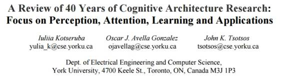
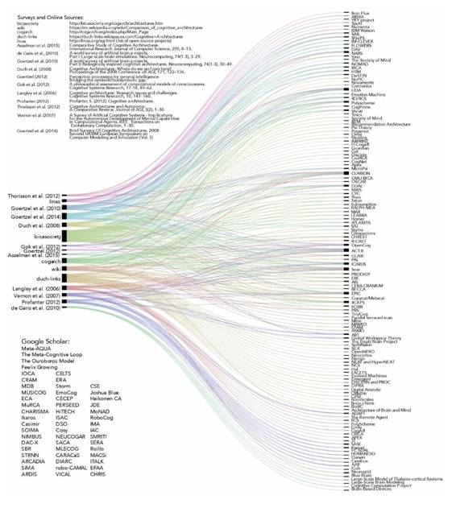
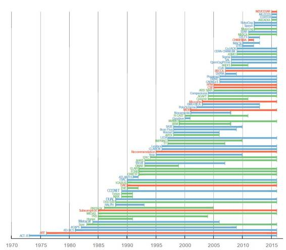
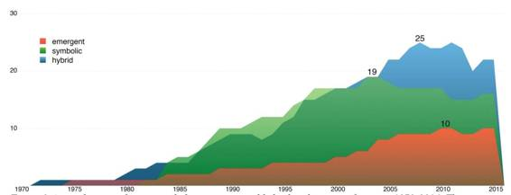
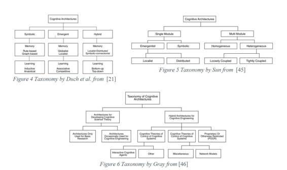
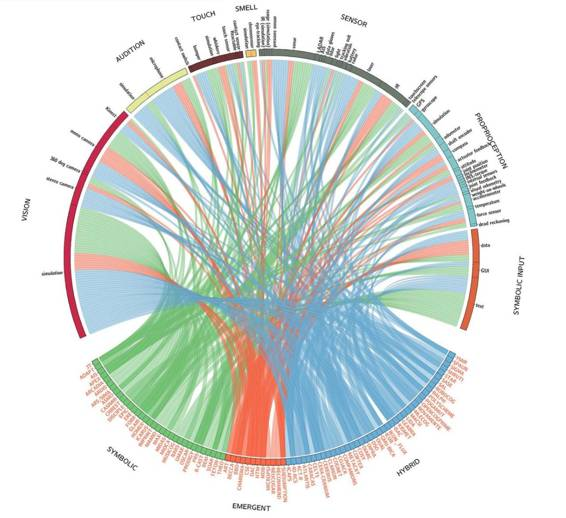
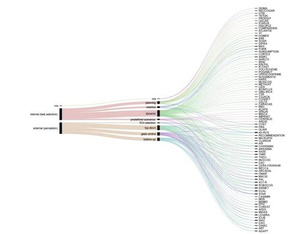
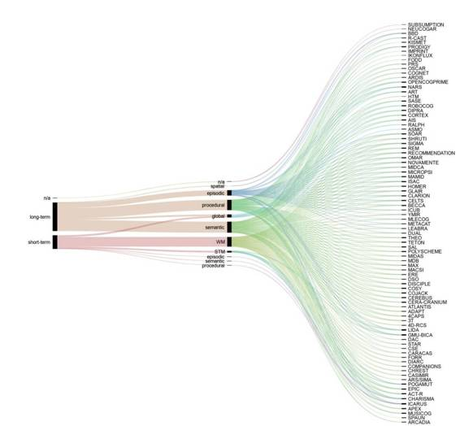
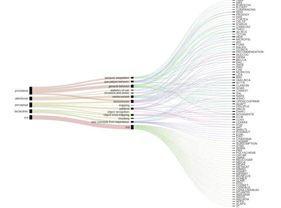
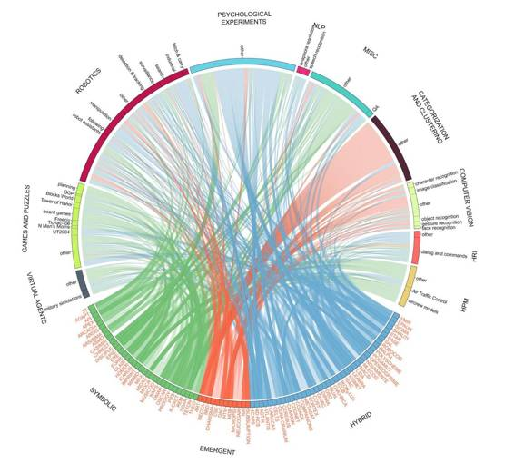

# 深度 | 40 年认知架构研究概览：实现通用人工智能的道路上我们走了多远？（附论文）

选自 arxiv.org

**机器之心编译**

**参与：机器之心编辑部**

> *今日，加拿大约克大学（York University）电气工程与计算机科学系在 arXiv 上发表了一篇关于认知架构研究的概览性论文，在感知、注意、学习和应用四个方面对认知架构方面的研究和应用进行了概述性的总结。机器之心对该论文进行了略有删减的编译，原论文可点击文末「阅读原文」下载。另外，作者还为本项目开发了直观的交互示意图，连同相关的额外资料可以在这里查看：*
> 
> *http://www.data.nvision2.eecs.yorku.ca/cognitive-architecture-survey/*

 

**摘要**

在这篇论文中，我们呈现了关于过去 40 年认知架构（cognitive architecture）研究的宏观概述。尽管目前已有架构的数量已经有数百种了，但绝大多数已有的调研都没有反映出这种增长，而只是重点强调了一小部分地位稳固的架构。虽然它们的贡献是不可否认的，但它们只能代表该领域研究的一部分。因此，在这篇调研中，我们将超越对重点的关注，而将我们的范围扩展成对认知架构研究的更具包容性和高层面的概述。我们最终的集合有 86 种架构，其中包括 55 种仍在活跃发展的架构，另外还从一些不同的学科（涵盖从心理分析学到神经科学等）中借用了一些。为了保证本论文长度合理，我们仅讨论了核心的认知能力，比如感知（perception）、注意机制（attention mechanism）、学习（learning）和记忆（memory）结构。为了评估认知架构的实际应用的广度，我们收集了超过 700 个使用了我们列表中的认知架构的实际项目的信息。

我们使用多种可视化工具重点突出了该领域发展的整体趋势。我们对实际应用的分析表明大部分架构都非常关注于一个特定的应用领域。因此，在机器人和计算机视觉领域的一般研究和在认知架构领域内的研究之间存在一个明显的鸿沟。可以非常明显地看到：生物启发的模型与基于工程原理和启发式的系统相比，在范围和效率上都不一样。我们观察到的另一个情况是合作的普遍缺乏。有几个因素妨碍了人们的交流沟通，比如许多项目封闭的本质（这里审查的架构中仅有三分之一是开源的）和术语差异。

**1 介绍**

本论文的目标是提供关于过去 40 年认知架构研究的宏观概述，并重点关注了感知、注意和实际应用。尽管认知架构领域一直以来都在稳健地增长，但过去 10 年来发表的大多数调研都没有反映出这种增长，而基本上只是关注了十几个最成熟的架构。上一次大规模的研究是在 2010 年由 Samsonovich et al. [1] 进行的，他们试图编目已经实现的认知架构。他们的调查包含了 54 种由它们各自的作者提交的认知架构。这些信息以「认知架构对比表」的形式发表到了网上（http://bicasociety.org/cogarch/architectures.htm）。当然，也还有其它认知架构的列表，但它们通常只是一个简短描述加上一个项目网址或软件库的链接而已。

由于目前还没有详尽的认知架构列表，所以它们的准确数字还是未知的，但是据估计应该有大约 300 种左右，而且其中至少有三分之一的项目目前是活跃的。为了为我们的研究得到这份最初的列表，我们组合了其它调查（发表于最近 10 年内）中提及的架构以及一些大型的在线编目。我们还包含了这些调研文献未提及的最近的架构。图 1 展示了来自 17 个来源（调查、在线编目和谷歌学术）的 195 种认知架构的可视化。很明显可以看到 ACT-R、Soar, CLARION、ICARUS、EPIC、RCS 和 LIDA 等一小部分架构出现在了许多来源中，而所有其它项目只是在在线编目中有简短的提及。尽管这些主要架构的理论和实际贡献是不可否认的，但它们只能代表该领域研究的一小部分。因此，在这篇概述中，我们将避开对重量级架构的特别关注（其他人已经做了很多了），而是将对这整个领域进行一次高层面的概述。

*图 1\. 来自调查、在线编目和谷歌学术的认知架构的组合列表。左侧的节点表示架构的调查和在线编目，右侧的节点表示单独的项目。节点的厚度表示连接到该节点的边（edge）的数量，即该架构出现的次数（右侧）或所包含的架构的数量（左侧）。*

为了使这次调研足够可操作，我们将原有架构列表缩减到了 86 项。因此，我们重点是至少有一个实际应用和多篇有同行评议的论文的已经实现的架构，我们没有考虑一些哲学上的架构（如 CogAff、Society of Mind、Global Workspace Theory、Pandemonium theory）。我们也排除了大规模脑建模项目（brain modeling project），这是较低层面的，不能轻易映射到由其它认知架构所建模的认知能力的广度上。另外，许多脑模型尚还没有任何实际的应用，因此也不满足本调查的参数。图 2 显示了本调查给出的所有架构和它们根据发表情况得出的大概时间表。它们中有 55 个项目目前是活跃的。

正如我们早些时候提到的，给已经实现的认知架构创建一个广泛的和有组织的编目的第一步是 [1]。这个概述包含了 26 个项目的扩展描述，其中包含的信息有：简要概述、主要元素的原理图、共同组分和特征（记忆类型、注意、意识等）、学习和认知发展、认知建模和应用、扩展性和局限性。这一类的调查将一些不相交的社区的研究者聚集到了一起，并帮助建立了这些不同方法和他们所使用的术语之间的映射。但是，这种描述性的和表格式的格式让我们无法对这些架构轻松地进行比较。因为我们的架构样本很大，所以我们实验了可做替代的可视化策略，例如冲积图（alluvial diagram）和圆图（circular diagram），它们常常被用于组织复杂的表格数据。这些图的交互式版本让我们可以探索这些数据和查看相关索引。

在后续的章节中，我们将提供关于认知的定义和分组认知架构方法的整体概述。作为我们的贡献之一，我们会根据认知架构的感知模式（perception modality）、注意的实现机制、记忆组织、学习类型和实际应用对它们进行映射。认知架构的其它特征，比如元认知（metacognition）、意识（consciousness）和情绪（emotion），不在本次调查的范围内。在准备这篇论文的过程中，我们广泛地审阅了文献，这项活动让我们得到了一个包含 2000 项的相关发表情况的参考目录（bibliography）。我们提供了这份参考目录，同时还带有每篇论文的简短摘要作为补充材料（发布地址：http://www.data.nvision2.eecs.yorku.ca/cognitive-architecture-survey/bib_html/index.html）

**2 什么是认知架构？**

认知架构是通用人工智能（general AI）的一个研究分支，它起源于 20 世纪 50 年代，其目标是创建能够解决不同领域问题的程序、培养洞察力、能自己适应新情况并做出反应。同样，认知架构研究的最终目标是实现人类水平的人工智能。根据 Russell 和 Norvig [2]，这样的人工智能可以以四种不同的方式实现：像人类一样思考的系统，能理性思考的系统，像人类一样行动的系统，以及能理性行动的系统。现有的认知架构已经探索了所有四种可能性。例如，像人类一样的思想是源于认知模型的架构所追求的。因此，只要智能系统造成的错误如同相似情况下人类通常做出的错误，则它们的错误是可以容忍的。这与理性思维系统相反，理性思维系统需要为任意任务作出一致和正确的结论。像人类一样行动的机器和理性行动的机器之间的区别也与之相似。在后两种情况中，机器并不期望能像人类一样思考，我们关注的只是它们的行动或反应。

*图 2 此次调查的 86 种认知架构的时间表。每条线对应一个认知架构。认知架构按照开始日期排序，因此最老的认知架构在图的最下部。由于只明确知道几个项目的开始和结束日期，因此我们按照项目网页的发布和活动日期还原了时间表。颜色对应于不同类型的架构：symbolic（符号式，绿色），emergent（层创式，红色）和 hybrid（混合式，蓝色）。*

然而，由于认知没有明确的定义和一般理论，每个架构都是基于不同的前提和假设，使得比较和评估不同的认知架构变得困难。几篇论文试图解决这种不确定性，最著名的是 Sun 对认知架构的期望 [3] 和 Newell 的实用性标准（最初发表在论文 [4] 和 [5] 中，后来重新被 Anderson 和 Lebiere 提及 [6]）。Newell 的标准包括灵活的行为、实时操作、理性、海量知识库、学习能力、发展能力、语言能力、自我意识和大脑觉悟。Sun 的期望更广泛，包括生态、认知和生物进化现实主义、适应性、模块化、常规化和协同互动。除了定义标准，并把它们应用到认知架构的范围，Sun 也指出，明确界定认知的假设和方法存在缺失，这种缺失阻碍了智能研究的进展。他也提到了关于基本二分法（essential dichotomy）（隐式/显式，程序化/声明化等）、模块化认知和结构化记忆，存在一种不确定性。但是，快速浏览一下这些已有的认知架构就可以发现，这些架构在研究目标、结构、操作和应用方面长久存在分歧。

 

*图 3 1973 至 2016 年间，活跃的符号式（symbolic）、层创式（emergent）和混合式（hybrid）架构的可视化。在图上显示了同时活跃的项目的最大数量。*

相比于为智能寻求一个特定的定义，也许将智能定义为一个系统所体现的能力和行为的集合更为实际。虽然不存在一个智能所要求的能力的综合列表，但一些已经被认可的宽泛的方向也许可以作为目前认知架构领域工作的指导。例如，Adams 等 [7] 提议了 14 个方向，分别是感知、记忆、注意、社会交互、规划、动机、驱动、推理、交流、学习、为自身/他人建模、建造/创造以及算术能力（perception, memory, attention, social interaction, planning, motivation, actuation, reasoning, communication, learning, emotion, modeling self/other, building/creation and arithmetic abilities.）。这些可以进一步划分为更小的领域。可以说，其中一些类别也许看起来比其他的更重要，且历史上也受到更多关注。比如，根据 Metzler 和 Shea[8]，在近期认知架构的发表中最常被提到的认知功能仅包括感知、学习、推理、决策、计划和行动。

然而，即使在一个单一架构中仅实现一个缩减的功能集合，也是一个任务繁重的工程。因此，目前只有一小部分架构（如：Soar, ACT-R, NARS [9], LIDA [10]）和几个最近的项目（SiMA [11] 和 OpenCogPrime [12]）在追求通用人工智能（Artificial General Intelligence，AGI）。其他架构则专注某一特定的认知功能，例如注意（ARCADIA [13], STAR [14]）、情绪（CELTS [15]），对称感知（认知对称引擎（Cognitive Symmetry Engine）[16]）或者问题解决（FORR [17], PRODIGY [18]）。还有一些为特定应用设计的专门的架构，比如为平面视觉检测设计的 ARDIS[19]，以及为音乐理解和分类设计的 MusiCog[20]。

使得一个软件系统能够被称为认知架构的标准也鲜被强调。大多数综述宽泛地定义认知架构为智能的一个蓝图，更具体地，是一个关于心智表征以及运行在这些表征之上的计算过程的设想，它们使得一定范围内的智能行为成为可能（[21], [22], [23], [24], [25]）。总的来说，新的认知架构不需要包括已有的认知架构，例如 Soar，ACT-R，EPIC，LIDA，ICARUS 等。然而，当它并不是那么常见或是一个全新的项目时，我们并不知道考虑现有的这些认知架构是否必要。举个例子，AKIRA 是一个明显的不能自我统一地认为其是一个认知架构 [26]，但是它的特性仍然被很多综述提及 [27]。类似的，知识库 Cyc [28] 从未对任何通用智能有所声称，却仍然在一篇论文中被总结为一个 AGI 架构 [29]。

Larid [30] 讨论了认知架构与其他软件系统有何不同。虽然它们都有记忆存贮、控制部件、数据表示和输入/输出设备，但其它软件系统只提供了一个用于一般计算的固定模型。而认知架构则必须随着发展而改变，并且高效地运用知识完成新的任务。此外，他认为用工具包（toolkit）和框架（framework）建立的代理（agent）架构也不能被当做认知架构，因为它们缺乏理论支持。这是一个相当严格的条件，除了 Soar 和 ACT-R，只有很少的架构能够符合这个要求。这一观点在综述论文里也不常见，通常代理架构和用来建造它们的工具包也会被包括在内。例如，代理架构 3T、PRS 和 ERE 被包括在了 [31] 内；Pogamut，一个用于建立智能代理的框架，也被包含在了 [1] 中。

最近，谷歌（DeepMind）声称深度学习能够「解决人工智能（solving AI）」。类似地，Facebook 人工智能研究实验室（FAIR）及其它一些公司也在这个方向上活跃地进行研究。这些研究在认知架构方面具有怎样的地位呢？在目前，深度学习一些最广为人知的成就包括用于自动驾驶汽车的视觉处理（Mobileye）和谷歌的能够下围棋 [32] 和玩多种视频游戏 [33] 的神经网络。

另一方面，DeepMind 发表的论文（没有在媒体上打广告）涵盖了范围很广的主题。比如说，许多论文都致力于与循环神经网络和深度神经网络相关的理论问题。此外，神经网络也被用来构建复杂的视觉注意和记忆（visual attention and memory）模型，比如：一种用于识别图像中多个对象（如门牌号序列）的基于注意的模型 [34]。记忆（memory）在深度学习领域具有特殊的重要性，因为为了寻找和利用数据中的复杂模式，网络应该要能执行链式的顺序计算。但是，在深度网络中，来自过去的计算的信息会受到新信息的影响。网格式长短期记忆（Grid Long Short-Term Memory/Grad LSTM）通过提供一种动态式选择或忽略输入的方式而解决了这个问题，从而可以在学习过程中保留重要的记忆 [35]。

整体上看，DeepMind 的研究解决了人工智能领域里一些重要的问题，比如自然语言理解、感知处理、通用学习和用于评估人工智能的策略。尽管特定的模型已经证明了在有限领域内的认知能力，但目前它们还无法代表一种统一的智能模型。

和 DeepMind 不一样，Facebook 的研究团队是在开发智能机器的更广阔的语境中明确讨论他们的成果 [36]。他们的主要观点是：人工智能是在太复杂了，以至于不能一次性开发出来，而是应该首先定义智能的通用特征。他们已经定义出了两个智能的通用特征：交流（communication）和学习（learning），并且还提出了一个逐渐发展它们的具体的路线图。这个方向的第一步是人工生态系统（artificial ecosystem，或称「幼儿园」），其被提出用于教育智能代理（intelligent agent），从而强调了这个过程的发展性本质。他们的计划是从更简单的模拟环境开始，然后逐渐增加其复杂度，直到最后它能够将人工代理和真实世界连接起来。鉴于这种对交流和学习的强调，这种智能机器的一种主要应用就是电子助理。作者承认类似的想法在过去已经得到过尝试（如，常被符号架构用于学习的 Blocks World 模拟），但它们都过于依赖于其创造者所提供的数据。

目前没有文献提及这样的系统，但 FAIR 追求的研究主题与其人工智能展望也与各家公司的商业利益相一致。常见的相关话题包括可视化处理，特别是分割和目标探测、数据挖掘、自然语言处理、人机交互和网络安全。目前深度学习技术主要用于解决实际问题，并不代表一个统一框架，所以不包括在此次调查的范围内。当然，鉴于深度学习的潜力，这一方法将来可能会在认知架构中发挥作用。

对于其他架构，我们定义了以下选择标准，努力实现包容和一致：自我识别作为认知，机器人或代理架构，已有实现（不必是开源的），以及用于感知、注意和学习的机制。为了进一步缩小调查的范围，我们需要至少存在同行评审的论文和应用，而不能只有简单的演示。但为包括一些仍在开发中的新架构，其中的部分条件得到了放宽。

**3 认知架构的分类**

过去十年发表的许多论文提出的多是认知架构的评估而非分类。像之前提到的，Newell 的标准和 Sun's Desiderata 就属于评估这一类。相似的，Langley 等人将认知架构的能力，性能和评估标准定义成一个综合的列表。认知能力的建议集合包括识别，作出决定，感知，预测，计划，行动，交流和学习。为了评估构架，提出了例如通用性，多能性，自主性的标准。与此同时，Vernon 等人列出了比较认知和浮现式方法的 12 个特征，包括体现，感知，行为，适应，动机，自主化和其他。相似的，Asselman 等人则通过 7 个标准（认知，记忆，学习，模块化，目标设定，基本模型和解决问题）评估构架。Thorisson 和 Helgasson 基于 4 个标准（实时操作，学习，注意和元学习）来决定自主化的水平。

许多标准可以被用来划分架构，但它们应用在一般的构架时会显得过于细致。因此，基于它们表现出的信息加工的种类来划分认知架构是更为常见的方法。三个分类方法被称作：符号式（认知主义），层创式（联结主义），混合式。这种基于信息加工的分类方法被 Duch 等人 [21] 拓展到含每个类别的典型记忆和学习性能（[38], [39])）。

符号式系统通常在一系列可用于表现世界的真相的符号中作为 if-then rules（也被称作 production rules）执行。因为它是知识的一种自然而直观的表达方式。符号式操作十分普遍。尽管经过设计，但符号式系统在计划和推理方面有优势，而在被要求处理变化的环境和感知过程时缺乏灵活性和坚固性。

层创式方法通过建立大量的并行模型，类比神经网络（此处信息流是通过从输入节点的信号波及表现的）解决了上述问题。但是，这样的系统也丧失了它的透明性。因为知识不再是一系列符号化的实体而是分布在网络中。因而同样，传统意义上的推理在层创式架构中存在问题。

自然地，每个范例都有着它的优缺点。例如，任何符号式架构都需要大量的工作去建立一个初始的知识基础。但一旦它建立好，整个架构就会变得十分有效。而另一方面，层创式架构更容易设计，但它们必须经过训练才能完成有效的动作。更重要的是，它们的已存在网络可能会因为接下来学习的新行为而被摧毁。

由于没有任何一个范式（paradigm）可以单独处理全部的人工智能问题，混合架构试图结合符号式和层创式两种元素。总的来说，两者如何混合没有一个明确的限制，但有的方法更加直观且易于执行。例如，CLARION 基于不同知识类型有不同的表现形式：明确的事实知识用符号式，程序中暗含的知识用亚符号式 [40]。4CAPS 将传统的符号式生产系统用联结主义的计算机制：如阈值、激活、权重和并行处理来诠释 [41]。这种混合方式被 Duch 等人 [21] 称作符号式联结主义（symbolicconnectionist）。同时他们也定义了一种替代的地区性分布方法。后者很好的例子就是 Leabra，它在学习不变事物的检测时用到了标签的地方主义（localist）表征和特征的分布式表征 [42]。在 [43] 中，这两种混合式的表征被分别称作平行和垂直的整合。一个混合联结主义-符号化模型的更为细致的分类方法在 [44] 中呈现。

*图 4：Duch et al. 在 [21] 中提出的分类方式；*

*图 5：Sun 在 [45] 中提出的分类方式；*

*图 6：Gray 在 [46] 中提出的分类方式*

有趣的是，层创式架构只在最近时期才获得更多的比重，尽管这一方向的研究至少与传统人工智能一样活跃。例如 Langley 等人 [22] 在他们的调查中没有加入联结主义模型，因为他们没有发现这一架构与符号模型和混合模型相同的功能。

考虑到混合方式的优点，这样的架构有最高的增长趋势便不足为奇了（图 3）。所以，我们的数据证明了 Duch 等人 [21] 在 10 年前的预测。

文献资料中仍没有多少其他的分类方法。Sun[47]（图 5）的方案强调模块化和模块之间的通信。然而，遵循此类方法需要所有架构的实现方式细节，这些信息经常不能获得。其他分类方案也很具体，如 Gray[46] 提出的方案，其重点在于架构的目的及使用。

因此，在本次研究中，我们遵循符号、层创和混合架构的传统区分方式。由于我们介绍的架构的背景跨越从哲学到神经生物学的广泛研究领域，我们不会试图创立一个单一的体系来适应它们。我们不会对每一个认知功能分别进行讨论，而是以功能（即：感知、注意、记忆和学习）进行分类的讨论。我们从发表情况中提取了数据，并按频率进行了分组。

**4\. 感知 **

*图 7 显示了认知架构的感知通道（sensory modalities）。该架构分成三组： 符号式（绿色），层创式（红色）和混合式（蓝色），位于图底端。图中其他部分对应不同的感知通道，包括视觉、听觉、触觉、嗅觉和本体感觉。这个感知分类还包含了不对应任何人类感官的多种感知。「符号输入」类别表示的是认知架构中的输入只限于文本形式，或者需要通过 GUI。这不包括文本输入模拟音频、视觉或其他类型的信息。图中每个大类别扇形中的带表示的是这些感知通道的子类别（例如视觉类别下包括 Kinect、单眼相机、模拟等）。感知通道与架构之间的条形是用来表示它们之间的连接。如果一个架构控制多个感官，条形就越不透明。每个认知架构的感知方式列表都带有相关文献，被包括在补充材料和图形的互动版本中。*

**5\. 注意**

**** 

*图 8 显示了认知架构中不同类型的注意。*

**6\. 记忆**

*图 9 显示了认知架构中不同类型的短期记忆（STM）和长期记忆（LTM）*

**7\. 学习**

*图 10 显示了认知架构中的学习机制。*

**8\. 认知架构的应用**

本论文中的回顾的大部分认知架构都是研究工具几乎很少被开发到学界之外的应用。然而，还是可以讨论一下他们的实际应用的，因为不同情境下有用的行为被认为是许多认知结构的目标。

彻底研究过这些发表的论文后，我们使用 86 个认知架构确定了 700 多条 project，如图 11 显示。所有的应用都可以划分到几个大组（group）中，即人类表现建模（human performance modeling，HPM）、游戏和拼图（puzzles）、机器人、心理学实验，自然语言处理和其他杂项，还包括了不属于任何大组的项目，它们由于太少所以无法独立成大组。这样的分组强调了每个 project 的应用，即便每个研究者有不同的目的。

一些应用可能会被划分到多个组。例如，装上一只机器手臂的 Soar 一直被用来玩棋盘游戏，这就同时关涉到机器人、游戏和拼图以及心理学实验。为了避免让这张图过于复杂，在这些案例中我们只将 project 放在了主要的组中考虑，在 Soar 的例子被划为游戏，因为它在机器人上的应用并不是很大，而且心理学实验组主要是使用 ACT-R 的 fMRI 实验。

**人类表现模型（HPM）**

人类表现模型是一个与建立某个特定任务环境中的人类表现的量化模型相关的研究领域。这些模型主要用于几个工程领域，在这些领域中，设计可能性的空间非常大，导致实证的评估方式不可行或者成本太高。

这种建模类型一直用于军事应用，例如，Apache 直升机机组人员的负荷分析，战场感知中通信任务的影响建模 [230]，AAW 领域的决策制定 [231] 等等。普通的民用包括空中交通管制任务的模型（例如，COGNET[232]）, 飞机滑行失误 [233]，911 调度员 HPM 用的是少数专用架构，包括 OMAR、 APEX、COGNET,、MIDAS 和 IMPRINT。Soar 在大规模分布式军事模拟战中用于部署某个飞行员模型 

例如，导航中会用到一个机器人，无论是从推理上还是作为某个学习算法的演示，它都会被归为机器人组。唯一的例外是心理学试验组，其中还包括心理社会学、fMRI 和 EEG 试验。这个组中的 project 是由认知架构执行的，用于与人类数据对比的特定的心理实验（例如倒数 n 任务、调节或注意的盲目性）。游戏和拼图类别包括不同领域中的棋盘游戏、视频游戏、拼图和逻辑推理的应用。HPM 对关于机组人员（aircraft crew）、核电站的操作员以及执行其他复杂任务的人的建模很有用，例如电话接线员和空中交通运维人员。大部分自然语言处理应用都关涉到对说出或打出来的命令的理解，也与社交机器人有关。然而该组中也有一些 project 用于意义排歧和句子整体意义理解的。

**人机交互（HRI）**

HRI 是研究人与机器人对话中不同方面的多学科领域。这些互动大部分都发生在社交式的、辅助式的或发展式的机器人语境中。根据机器人的自动化水平，互动可以扩展到从直接控制机器人（遥控）到其完全自动化的任务中，实现人机对等合作。虽然该项研究中的系统还没有一个能达到完全自动化的水平，但它们可以实现一定程度上的监控，从用单韵母表示机器人的运动方向 [SASE236] 到自然语言指令（例如 Soar[237]，HOMER[88]、iCub[238]）。通常的假设是，一个命令有一个特定的形式，而且使用的词汇有限。

某些架构也用于 HRI 的非口语（non-verbal）方面，例如对话的自然轮转（Ymir[239]，Kismet[240]，改变面部表情（Kismet [241]）或者转向护理机器人（MACsi[242]）。

*图 11\. 认知架构的实际应用图。这些架构被分成了三组：符号式（绿色）、层创式（红色）和混合式（蓝**色）。应用被分成了代表不同领域的组。其中每一个应用都是使用了一种认知架构实现的特定项目，并且还得到了相关论文、软件或视频演示的支持。其中不包括仅有部分结果或实物模型的项目。另外，涉及与该架构中其它部分隔开的特定算法的例子也没有被包括进来。可视化使用 http://www.circos.ca (http://www.circos.ca/) 完成。关于每种认知架构的应用列表及相关索引可见于补充材料中，也可以在该图的交互式版本中查看。*

**自然语言处理（NLP）**

这一组的应用是关于理解书面语言和口头语言。尽管使用现成的软件来进行语音识别和文本解析对认知架构来说很常见，但也有一些架构为 NLP 研究做出了贡献。特定的例子包括：照明分辨率（Polyscheme [243]，NARS [244]，DIARC [245]）、语音识别基准（Sigma [246]，[247]，SASE [248]）和学习英语被动语态（NARS [244]）。

**归类和聚类（Categorization and Clustering）**

归类（categorization）、分类（classification）、模式识别和聚类是从大数据集中提取概括信息（general information）的常见方式。在认知架构的背景中，这些方法可被用于处理嘈杂的感官数据。这一组的应用几乎完全都是用层创式架构（emergent architectures）实现的，比如 ART 和 HTM，它们被用作是复杂的神经网络。尤其是 ART 网络已经在范围广泛的领域的分类问题上得到了应用，包括电影推荐（Netflix 数据集 [249]）、医疗诊断（Pima-Indian 糖尿病数据集 [250]）、错误诊断（气动系统分析 [251]）、元音识别（Peterson and Barney 数据集 [252]）、气味识别 [253] 等等。HTM 架构面向时序数据分析（analysis of time series data），例如预测 IT 故障（grokstream.com）、监测库存（numenta.com/htm-for-stocks）、预测出租车乘客需求 [254] 和基于按键模式识别手机使用类型（电子邮件、电话等等）[255]。

一些非层创式架构（non-emergent architecture）的例子包括根据追踪套装识别手势（Ymir [256]）、电信网络故障诊断（PRS [257]）和基于关于作者和引用的信息分类文档（OpenCogPrime [258]）。

**计算机视觉**

这一新兴的认知架构也被应用于解决典型的计算机视觉问题。目前只有一些独立的例子，例如笔记特征识别（HTM[259],[260]）、图像分类基准（HTM[261],[262]）、视角无关性字母识别（ART[263]）、纹理分类基准（ART[264]）、不变目标识别（Leabra[265]），等。计算机视觉的的应用经常是任务处理的一部分，如机器人导航，这在本论文的相关章节也有谈及。

**游戏和解谜**

该分类内的应用包括棋盘游戏、视频游戏以及解决有限领域内的难题。简单的包含重叠旗子的棋盘游戏如井字棋，八数码和五数码问题经常被用来证明知识迁移（例如 Soar[227]，FORR[266]）。

视频游戏也是认知架构应用的虚拟领域。在最受欢迎的游戏《虚幻竞技场 2004》（UT2004）中有一个开源工具包 Pogamut[267] 可以自由创建智能的虚拟角色。另外，它还有许多同类型的竞争者，玩家们在这些游戏中不仅需要关注得分和效率，同时也得保持与游戏中虚拟角色的关系（2K BotPrize Contest7）。Pogamut 不仅 实现了很多认知功能，它还是 BotPrize 比赛推荐的软件，可以经过修改实现更多的特性（[268], [269], [270], [271], [271], [272]）。其他的此类游戏包括《Freeciv（REM [273]）》，《Atari Frogger II（Soar [274]）》，《Infinite Mario（Soar[275]）》，网页端游戏（Star[276]）和一些定制游戏。

**心理实验**

心理实验的应用是使用认知架构的多种心理生理学研究，包括 fMRI 和 EEG 实验。此类实验利用认知架构可以对人类指标进行数字化建模，或对心理现象给出合理的解释。如果由模拟产生的数据在一些或大多数方面与人类数据匹配，则说明给定认知架构可以模仿人类生理机制。随后，认知模型可以用于对不同情况下的行为进行预测或进一步分析，最后可帮助人们对已知现象背后的心理机制进行解释。

大多数实验在模拟环境中进行，尽管在实体机器人中也存在一些例子（例如，在 DarwinVII 机器人上的感知分类模型 [181]）。

**机器人**

在机器人中，认知架构有许多应用。导航和避障是基础的行为，对机器人自身有帮助，也可作为更复杂行为的一部分，比如辅助机器人。

在机器人早期研究中，做杂务是非常的流行的用来有效证明机器人能力的方式。一些著名的样例包括垃圾收集移动机器人（3T [277]）、苏打罐收集机器人（Subsumption [278]）。通过结合简单的视觉技术（比如边缘检测和模板匹配）和传感器技术（导航），这些机器人能够在未知环境中发现感兴趣的目标。

最近的认知架构倾向于分开解决搜索和目标操控任务。典型的，有的实验是在可控环境中完成视觉搜索，对明亮颜色或者可识别的形状的喜好可用来最小化视觉处理任务。有时会使用到标记（markers），比如将条形码附属到目标上进行更轻松的识别（Soar[279]）。需要主要的是，这些案例中的视觉搜索通常是更复杂任务的一部分，比如通过指令进行学习。在视觉搜索和定位是最终目标时，环境更为真实（例如，通过传感器和 SIFT 特征的结合，CoSy 控制机器人在书架上找到一本书 [280]）。

目标操控涉及到控制机械臂触碰并抓取（reach and grasp）目标。虽然触碰是相对简单的一个问题，且许多架构部署不同形式的机械臂控制，在模拟环境中抓紧目标却更具挑战性。抓取的复杂性由多种因素决定，包括抓手的类型、目标的特性。一种变通方案是用软体目标进行试验，比如毛绒玩具（ISAC [281]）。近期的研究涉及到通过 DIARC [282], [282]控制的机器人证明可以抓取不同类型的目标（在顶部或边缘有抓手的目标）。另一个例子是 iCub[283] 根据抓取瓶罐的大小、抓取的箱子和直尺等不同目标进行适应。

其他应用包括机器人销售员、教师、医疗机器人等。工业应用由单个架构 4D-RCS 所代表，已经被远程控制的吊机机器人 [284]、架桥机器人[285]、自动清洗和去毛刺工作站机器人[286]和美国邮局自动邮票分发中的机器人[287]等使用。

**虚拟代理**

模拟和虚拟现实总是被频繁用为物理化身的替代。例如，在军事领域，危险情境下军人的模拟模型行为不会对身体造成伤害。其他例子包括在自杀式炸弹袭击场景中建模代理（CoJACK [73]）、维和部队训练（MAMID [190]）、在复杂的城区地形的指令和控制（RCAST[288]）、坦克战模拟（CoJACK[289]）。

在民用领域，模拟建模智能代理的行为也非常常见。虚拟环境的一个优势是它能提供关于代理任意时间点的状态信息。这对学习临场情感影响非常有帮助，例如在社交环境（ARS/SiMA[290]）或学习场景中，比如与虚拟的狗狗玩耍（Novamente[291]）。

**9 讨论（略）**

参考文献见下载论文

******©本文由机器之心编译，***转载请联系本公众号获得授权******。***

✄------------------------------------------------

**加入机器之心（全职记者/实习生）：hr@almosthuman.cn**

**投稿或寻求报道：editor@almosthuman.cn**

**广告&商务合作：bd@almosthuman.cn**

