# 第四范式联合创始人陈雨强：机器学习在工业应用中的新思考

机器之心整理发布

**编辑：虞喵喵、蒋思源**

> *第四范式联合创始人、首席研究科学家陈雨强是世界级深度学习、迁移学习专家，曾在 NIPS、AAAI、ACL、SIGKDD 等顶会上发表论文，并获 APWeb2010 Best Paper Award，KDD Cup 2011 名列前三，其学术工作在 2010 年作被全球著名科技杂志 MIT Technology Review 报道。*

陈雨强也是机器学习工业应用全球领军人物，在百度凤巢任职期间主持了世界首个商用深度学习系统、在今日头条期间主持了全新的信息流推荐与广告系统的设计实现。陈雨强目前担任第四范式首席研究科学家，第四范式在人工智能领域科研技术领先，刚刚揭晓的「第六届吴文俊人工智能科学技术奖」，第四范式荣获一等奖，该奖项代表国内最高科研实力。

此前，陈雨强在机器之心精品线下活动中，给业内人士分享了其对于机器学习在工业应用中的新思考。以下为活动现场的速记整理。

我是来自第四范式的陈雨强，负责人工智能算法研究、开发等相关工作。就我此前在工业界的经历，今天跟大家分享的是——「机器学习在工业应用中的新思考」。

**正在改变的公司和行业**  

**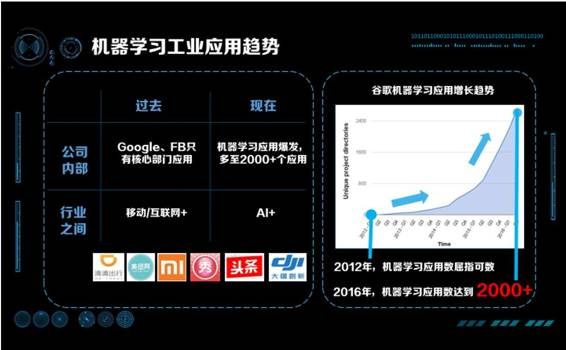** 

人工智能在工业界越来越火，过去五年火热程度以指数的方式上升。不管是在公司内部，还是在公司之间、行业之间，人工智能正在变成一个炙手可热的名词。从公开资料上可以看到，Google 和 Facebook 在 2012 年时，只有搜索和推荐等几个少数核心项目使用了机器学习。随着时间推移，到 2016 年第二季度，Google 已经有超过 2000 个项目和产品正在使用深度学习。同时也有报道称，Facebook 已经有超过 17 个大团队、超过 25% 的工程师正在使用机器学习。也就是说，在互联网行业巨头里、公司内，机器学习的影响力正在从少数几个产品迅速扩展到更多的场景。另外，我们发现一个很有意思的现象，就是 AI 慢慢扩展到全行业的影响，当前的趋势正在从之前的「互联网+」或者「移动+」，慢慢转向为「AI+」。比如滴滴是「互联网+打车」，美团是「互联网+O2O」，很多公司之前做的是「怎么用互联网改变传统行业」。但是现在，他们纷纷转向「如何用积累下来的数据提供更多的价值」。还有一些公司，从创立初始就是「AI+」，比如今日头条是「AI+新闻」、大疆是「AI+无人机/机器人」。我们可以看到，AI 正在慢慢渗透到并且改变所有的行业。

在跟大家分享之前，介绍一下我的个人经历。AI 大潮的热度从 2010 年初开始呈指数上升，我非常幸运地赶上了这个大潮。我在学校时主要做人工智能和机器学习的相关研究，具体包括迁移学习等，也在 AAAI 、NIPS、SIGKDD 等会议上有论文发表。

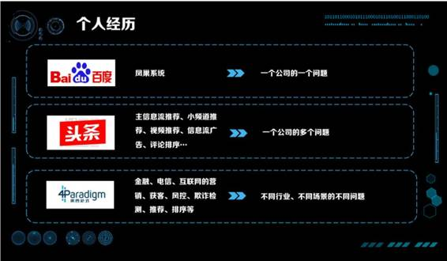

毕业之后我去了百度，所在的部门负责百度的搜索广告系统——凤巢系统。**这个阶段面对的是解决一个公司的一个问题，**即「如何提升搜索广告的点击率」这个问题。当时我做的事情比较偏纯技术，即怎么让深度学习应用到大规模的机器学习中。我们有上千亿个特征，怎样设计一个模型应用深度学习。我们当时上线了世界上第一个使用深度学习的商用系统。

从百度离职之后我去了今日头条。在头条时面对的产品线更多了，除了主信息流推荐以外，小频道推荐、视频推荐，包括信息流广告、评论排序等等，有非常非常多的应用方向。**所以在今日头条，我面对的是一个公司内很多很多的业务与问题。**对当时的头条来说，时效性是非常重要的。除了在技术上设计一个追求极致的时效性以及极致的性能与规模的机器学习系统之外，我还做了一件很重要的事情，是设计了很多机制，让这些人工智能技术能用在头条的各个产品线之中。举个例子，人工智能或者机器学习的算法其实是一个发动机引擎，机制是传动的齿轮，怎样把引擎的动力以最有效的方式传动到各个部件，这是机制所做的事情。所以除了需要关心技术之外，还要关心产品与机制创新。

从今日头条离开后来到第四范式，我们面对的业务、行业会更多。金融、电信、互联网，各种各样的行业，包含营销、获客、风控、推荐、排序等各种各样的问题。**在第四范式我面对的，是各行各业不同场景的不同问题。**

可以看到，我的经历是从解决一个公司的一个问题，到解决一个公司的很多问题，到解决各行各业的各种问题。这些经历给了我很多思考，比方说**如何做一个追求极致的人工智能系统？如何在一个公司内让更多的产品使用人工智能？**如何让更多的行业使用人工智能？在人工智能在公司内与行业间爆发的现在，这个是我想分享给大家的。

**人工智能成功必要的五个必要条件**

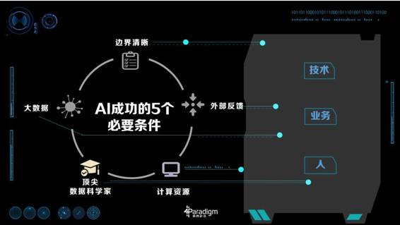 

为什么人工智能在最近的一段时间非常火？为什么人工智能在 20 年前、10 年前没有这么火？为什么 AlphaGo 能在今年打败李世石而不是更早？我们直观的会认为是因为算法创新。但是算法创新只是其中一点，国内外很多专家分析总结出了人工智能成功的五个必要条件，这里跟大家分享一下：

第一，边界清晰。问题需要定义得非常清晰，比如 AlphaGo 做的是围棋，围棋是在 19×19 的棋盘上，黑白两方轮流下子的问题，有吃有打劫。如果变成一个开放的问题，变成 20×20 的棋盘，变成黑白灰三方下棋，或者把打劫规则变一下，都会导致人工智能的失败。

第二，外部反馈。算法要不断的有外部输入，知道我们在什么样的情况、算法做出什么样的行为下，外部给出的反馈是什么，这样才能促进提高，比方说需要 AlphaGo 不断地进行对弈，并且告诉它对弈的输赢。

第三，计算资源。近些年算法虽然有很大的进步，但计算资源也是产生智能的关键。最近业界在分布式计算上的成功，让我们相对于几十年前有了飞跃的基础。举个非常有趣的例子，Google 在描述 AlphaGo 不同版本的时候，为了简洁明了，直接使用计算能力来分类，而不是使用算法来分类。简版的 AlphaGo 被称作「单机训练的 AlphaGo」，复杂、更高智能的 AlphaGo 称为「多机、并行训练的 AlphaGo」，从这里也可以看出，计算资源起着至关重要的作用。

第四，顶尖的数据科学家和人工智能科学家。增强学习、深度学习最近重新被提出，需要很多科学家大量的工作，才能让这些算法真正的推行，除了围棋、视觉、语音之外，还有非常多的领域等待被探索。

第五，大数据。AlphaGo 的成功，关键的一点是 KGS 棋社的流行，KGS 上有数十万盘高手对战的棋谱，没有这些数据 AlphaGo 绝对不可能这么短的时间内打败人类。

这些要素总结起来只有三点：一方面是技术，计算资源和大数据方面的支持；一方面是业务，边界要清晰，业务有反馈；另一方面是人，包括科学家，包括应用到场景需要和人打交道。所以如果一个 AI 要成功的话总结起来三点，要关注技术、要关注业务、要关注人。

**工业界需要可扩展的机器学习系统**

人工智能的兴起是计算能力、机器学习以及分布式计算发展的结果。在实际的工业界之中，我们需要一个可扩展的机器学习系统（Scalable Machine Learning System），而不仅仅是一个可扩展系统（Scalable System），那什么是可扩展的机器学习系统？

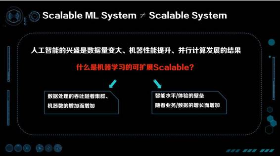 

第一点，数据处理的能力随机器的增加而增加，这是传统的可扩展。第二点，智能水平和体验壁垒要随着业务、数据量的增加而同时增加。这个角度的 Scalable 是很少被提到的，但这个层面上的可扩展性才是人工智能被推崇的核心原因。

举个例子，过去建立竞争壁垒主要通过业务创新快、行业内跑马圈地，或是通过借助新的渠道（比方说互联网）提升效率。在这样的方式中，由于产品本身相对容易被抄袭，那么资本投入、运营与渠道是关键。但随着数据的增加与 AI 的普及，现在有了一种新的方式，就是用时间与数据创造壁垒。举个简单的例子，如果现在去做一个搜索引擎，即使有百度现成的技术现在也很难做得过百度，因为百度积累了长时间的数据，用同样的算法也很难跑出一个比百度更好的搜索结果。这样如果拥有能用好数据的人工智能，就会获得更好的体验，反过来更好的体验又会带来更多的用户，进一步丰富数据，促进人工智能的提高。可以看出，由人工智能产生的竞争壁垒是不断循环迭代提升、更容易拉开差距的高墙。

**可扩展的机器学习系统需要高 VC 维**

那么，我们怎么能获得一个既拥有高智能水平又能 Scalable 的学习系统呢？

60 年代 Vapnik 和 Chervonenkis 提出了 **VC 维理论**，形式化的描述了机器学习算法对复杂函数拟合的能力。对 VC 维的理解，可以举个简单的例子就类似于人大脑内的神经元，神经元数量越多，这个人可能就越聪明。当然，这个不是绝对的，智商高的人比一定做出来的成就是最高的，这里关键的一点是个人的经历也要多，之后经历过很多事情、并且有思考的能力，才能悟出道理。在机器学习中，VC 维度讲的也是这个道理。

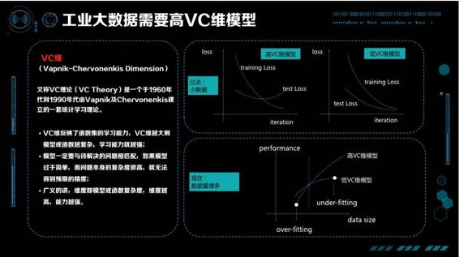 

 教科书上的 VC 维都是上面这样的一张图。因为过去的数据不大，训练损失函数在不断下降，测试损失函数在不断的上升，要避免过拟合，VC 维就不能太高。比如你是个很聪明的孩子，但是在很小的时候不能让你过多的思考瞎琢磨，否则很有可能走火入魔。过去对我们教导是在你经历不多、数据不多时干脆傻一点，就没有那么多精力去思考乱七八糟的事情。这是当时大家觉得比较好的解法，控制 VC 维，让训练数据的 Test Loss、Training Loss 同时下降。

但随着时代的不断发展，数据也是在不断增多的，我们的观点有了新的变化。在数据量比较小的时候，高 VC 维的模型比低 VC 维的模型效果要差，产生了 over-fitting，这只是故事的一部分；有了更多数据以后，我们发现低 VC 维模型效果再也涨不上去了，但高的 VC 维模型还在不断上升。这就是刚才说的智能 Scalable 的概念，在我们有越来越多数据的时候，要关心的是 under-fitting 而不是 over-fitting，要关心的是怎样提高 VC 维让模型更加聪明，悟出大数据中的道理。

总结成一句话，**如果要成功在工业界使用人工智能，VC 维是非常重要的问题。**

工业界怎么提升 VC 维呢？我们知道「机器学习=数据+特征+模型」，如果已经有很多数据，提升 VC 维的方法有两条：一种是从特征提升，一种是从模型提升。我们把特征分为两类：一类特征叫宏观特征，比如描述类特征如年龄、统计类特征如整体的点击率、或整体的统计信息；另一类为微观特征，最典型的是 ID 类的特征，每个人都有特征，每个物品也有特征，人和物品组合也有特征。相应的模型也分为两类，一部分是简单模型如线性模型，另一类是复杂模型如深度学习模型。这里，我们可以引出工业界机器学习四个象限的概念。

**模型 X 特征，工业界机器学习的四个象限**

**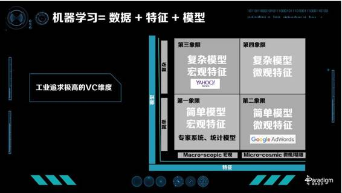** 

工业界具体怎么做的？第一象限是简单模型加上宏观特征，在现在的工业界比较难以走通，很难得到极致化的优化效果。这个象限内，有七八十年代专家系统，还有一些统计模型。大家比较熟悉的 UCI Data 就是支持这个时代研究的典型数据，每个数据集有 1000 个左右的训练数据，分的类数也不多，特征也不多。对于这样的数据统计模型比较盛行，要解决的问题是怎样找出特征之间的关系与各自的统计特性。

第二象限是简单模型、复杂特征，最成功的典型案例是 Google AdWords。Google 在很多技术上都是开山鼻祖，包括整个计算广告学。Google AdWords 有上千亿的特征，每个人、每个广告、每个 Query 的组合都在其中。这种模型非常成功，给 Google 带来了非常大的收益。Google AdWords 占 Google 70% 以上的收入，Google 的展示广告也是用的这样的技术，占了 Google 大概剩下的 20% 左右的收入。

第三象限是复杂模型、宏观特征典型的应用，比如 Bing ads，2013 年他们提出 BPR（Bayesian Probit Regression）来 Model 每个特征的置信度。雅虎也是第三象限忠实的传道士之一，大家所熟知的 COEC（Click Over Expected Click）这个算法就是雅虎提出的，在上面做了很多模型。其次他们还设计了很多模型解决增强学习问题，比如多臂老虎机等等算法。很多雅虎出去创业的同事最常使用的机器学习技术就是统计特征加 GBDT（Gradient Boosting Decision Tree），通常能获得非常好的效果。

第四象限，复杂模型和微观特征，现在还是热门研究的领域，它最难的一点是模型的规模实在太大。比如广告有上千亿的特征，如果做深度学习模型一个隐层有 1000 个特征，可能会有万万亿级别的参数。虽然数据很多，但万万亿的数据还是难以获得的。所以怎么解决这个角度的模型复杂问题、正则化问题，目前研究还是一个热点的研究方向。

**如何沿着模型优化？**

**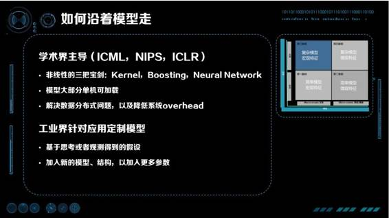** 

沿着模型优化主要由学术界主导，新的模型主要来自于 ICML、NIPS、ICLR 这样的会议。他们主要的研究是非线性的，总结起来有「三把宝剑」：Kernel、Boosting、Neural Network。Boosting、Neural Network 现在非常流行，Boosting 最成功的是 GBDT，而 Neural Network 也在很多行业产生了颠覆性的变化。大约十年前，Kernel 也是很流行的。借助 Kernel，SVM 有了异常强大的非线性能力，让 SVM 风靡了 10-15 年。优化模型的科学家们为了实验的方便，对工程实现的能力要求并不是特别高，大部分模型是可以单机加载的。要解决的实际问题主要是数据分布式，降低数据分布式带来的通讯 overhead 等问题。

对于工业界中的具体问题，基于思考或观察得到新的假设，加入新的模型、结构，以获得更多的参数，这是工业界优化这一项限的步骤。

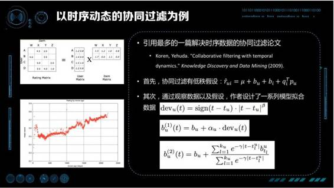 

以时序动态的协同过滤为例，我们这里引用的是 Koren, Yehuda 在 2009 年在 KDD 上发表的论文 Collaborative filtering with temporal dynamics，这是时序动态协同过滤被应用最多的一篇经典论文。在这篇论文里，首先协同过滤的问题有一个低秩假设，作者认为由 User，Item 组成的稀疏矩阵是由两个低秩矩阵相乘得到预估评分。第二，通过观察数据，作者观察到 IMDB 对某些电影的打分是随着时间的加长，分数不断上升（对那些经典的电影）。根据这样线性的关系，设计「现在的时间」减去「首次被打分时间」作为偏置，拟合斜率就是一个好的模型。考虑到更复杂的情况下，打分随时间的变化并不是单纯的线性，作者进一步提出将线分成很多小段，每个小段做分段线性。

总结一下，通过机器学习优化的套路是什么？**首先，观察数据；第二，找到规律；第三，根据规律做模型的假设；第四，对模型假设中的参数用数据进行拟合；第五，把拟合的结果用到线上，看看效果怎么样。**这是模型这条路在工业界上优化的方法。

**如何沿特征优化？**

**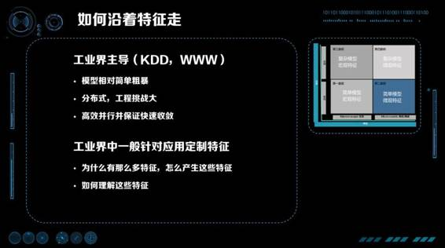**

特征优化主要是工业界主导的，成果主要发表在 KDD、ADKDD 或者 WWW 上，这些模型相对简单粗暴。主要是 LR，比较简单，粗暴是说它的特征会特别多。就像刚才提到的，Google 使用了上千亿的特征，百度也使用了上千亿的特征，这些特征都是从最细的角度描述数据。

沿模型优化这条路的主要特点是什么？模型一定是分布式的，同时工程挑战是非常大的。上千亿的特征是什么概念？即使一个参数用一个 Float 存储，也需要上百 G 到上 T 的内存，是单机很难存储下来的。这还只是模型所占的内容空间，训练起来还有其他中间参数与变量、数据也还要占内存，所以这些算法一定是模型分布式的。针对这些难点，学术界中 KDD 和 WWW 等会议上都在研究如何高效并行，以及如何保证高效并行的时候快速收敛。ASP、BSP 等模型和同步、异步的算法，都是为了保证高效分布式的同时能快速收敛。

应为线性模型理论较为成熟，工业界对模型本身的优化相对没有那么多，其更主要的工作是针对具体的应用提取特征。为什么会有那么多特征？因为我们对所有观察到的微观变量都进行建模。以搜索广告为例，每个 User ID、每个 Query、 每个广告都有特征。同时为了个性化，User+Query、User+广告 ID、Query+广告 ID，甚至 User+Query+广告 ID 都能产生特征。通过组合，特征会发生爆炸，原来可能上亿的特征会变成上千亿特征。

初听这样的思路会觉得有点奇怪，把用户历史上搜过关键词或者看过广告 ID 作为特征，如果这个用户从来没有搜索过这个关键词或者没有看过这个广告，那是不是就不能获取特征了呢？这个问题正是 LR+大规模特征这条路最常被攻击的一点，即如何进行模型泛化。在大规模离散特征机器学习系统里，解决泛化的方法是设计加入层次化特征，保证在细粒度特征无法命中的时候，层次化的上位更粗粒度特征可以生效。比方说如果一个用户是一个新用户的话，我们没有 UserID 特征，但是我们有更高层次的性别、地域、手机型号等特征生效，在预估中起作用。回到说之前的例子中，我们设计「Query+UserID」特征，到「Query」与「UserID」特征，再到更高级的性别属性「男/女」、使用的设备「安卓/ iOS」，可以组成一个完成的特征体系，无论缺失什么都可以用更高级的特征帮助预估进行弥补。

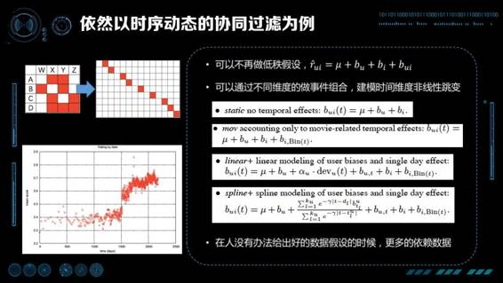

以之前提到的时序动态的协同过滤为例，我们看看如果走特征这条路，该怎么解决协同过滤的问题。首先我们不再做低秩假设，我们把所有的二阶项可以展平成组合特征。其次，我们会发现发现不是所有的数据都是呈线性的，特别有时候会产生一些突变，甚至都不能通过分段线性描述。还是在 Collaborative filtering with temporal dynamics 的论文中，由于作者也不知道什么原因造成了突变，他的方法是把不同维度的数据与时间进行组合，对时间维度的非线性进行建模。加入 Item 把时间分成比较细的桶，做分段线性的拟合。同样把 User 按时间进行分桶，保证对突变也能有比较好的拟合。

所以，当你不能给出比较好的数据假设时，不知道为什么产生突变时，可以更多的依赖数据，用潜在参数建模可能性，通过数据学到该学的知识。

**宽度还是深度？**

大家都会比较好奇，沿着宽度走好还是沿着深度走好？并没有那个模型在所有情况下都更好，换一句话说机器学习没有免费的午餐（No Free-Lunch）：不存在万能模型。

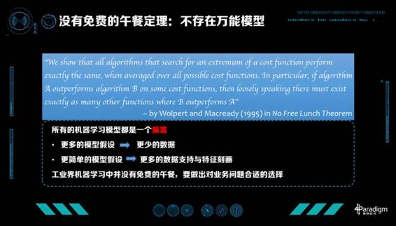

No Free-Lunch Theory 是由 Wolpert 和 Macready 在 95 年提出的一个定理。他们证明对于任意算法或优化算法 A 与 B，如果在某一种损失函数上 A 好于 B，则一定存在另一个损失函数保证 B 好于 A。更直观的描述是，总能找出一个损失函数让任何算法都不比随机猜更好。

这告诉了我们什么？所有的机器学习都是一个偏置，这个偏置是代表你对于数据的假设，偏置本身不会有谁比谁更好这样的概念。如果使用更多的模型假设，就需要更少的数据，但如果模型本身越不符合真实分布，风险就越大。当然我们也可以使用更少的模型假设，用数据支持模型，但你需要更多的数据支持，更好的特征刻画，然后表示出分布。总结起来对于我们工业界来说，机器学习并没有免费的午餐，一定要做出对业务合适的选择。

**宽与深的大战 **

**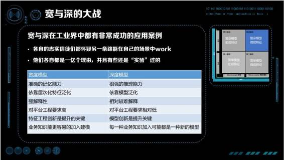** 

追求更高的 VC 维有两条路：一个是走宽的、离散的那条路，即 Google AdWords 的道路；也可以走深的那条路，比如深度学习或者 YAHOO！News 那条路。这就是深与宽的大战，因为宽与深在工业界都有非常成功的应用案例，坚信宽与深的人很长一段时间是并不互相理解的，各自忠实的信徒和粉丝们都会去拥护自己坚信的算法，质疑另一条路走不通。坚信深度学习、复杂模型的人认为，宽的道路模型太简单了，20 年就把所有的理论研究透彻，没有什么更多的创新，这样的技术不可能在复杂问题上得到好的结果。坚信宽的模型的人，攻击深度模型在某些问题上从来没有真正把所有的数据都用好，从来没有发挥出数据全部的价值，没有真正的做到特别细致的个性化。的确深度模型推理做得好，但个性化、记忆方面差很多。

非常有幸的是，我自己在宽和深两边都在工业界做过实际的探索与研究。吴恩达还没正式加盟来百度之前，曾到百度访问交流，当时我在凤巢，有机会与他探讨机器学习在工业界的一些进展与尝试。在那时我们就发现在工业界中，**宽与深有很强融合趋势。**Google 作为宽度模型的发起者，正在在广告上尝试使用深度模型，而我在百度也在已经做了同样的事，不谋而合，Google 和百度这些宽模型的拥护者正在向深的方向走。同时吴恩达分享他在 Facebook 交流的时候，发现 Facebook 走的是复杂模型宏观特征，虽然效果不错，但也非常急切的想要尝试怎样使用更宽的模型，对广告与推荐进行建模。

宽与深的模型并没有谁比谁好，这就是免费午餐定理：不同业务使用不同的模型，不同的模型有不同的特点。我们对比一下宽度模型与深度模型：宽度模型有比较准确的记忆能力，深度模型有比较强的推理能力；宽度模型可以说出你的历史，在什么情况下点过什么广告，深度模型会推理出下次你可能喜欢哪一类东西。宽度模型是依靠层次化特征进行泛化的，有很强的解释性，虽说特征很多，但是每一个预估、为什么有这样的预估、原因是什么，可以非常好的解释出来；深度模型是非常难以解释的，你很难知道为什么给出这样的预估。宽度模型对平台、对工程要求非常高，需要训练数据非常多、特征非常多；深度模型对训练数据、对整个模型要求相对较低一点，但现在也是越来越高的。还有一个非常关键的区别点，如果你是 CEO、CTO，你想建一个机器学习的系统与团队，这两条路有非常大的区别。宽度模型可以比较方便与统一的加入业务知识，所以优化宽度模型的人是懂机器学习并且偏业务的人员，把专业的知识加入建模，其中特征工程本身的创新是提升的关键；如果走深度模型，模型的创新是关键，提升模型更关键来自于做 Machine Learning 的人，他们从业务获得知识并且得到一些假设，然后把假设加入模型之中进行尝试。

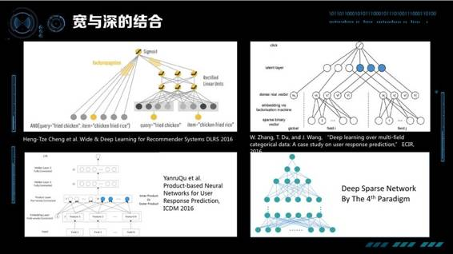

宽度和深度的大战，就我看来各自都有各自的缺点，我们要各取所长做宽与深的结合。宽与深的结合已经逐渐成为一个研究热点，Google 在今年 4 月份发表的一篇论文，介绍他们的最新工作「Deep & Wide Model」。模型分为 Deep 与 Wide 两部分，好处是它既能对比较细的特征有记忆，同时也有推理的能力。我们认为将来的方向都应该朝这路走。

除此之外，近期还有不少工作在探索这个方向，张伟楠 2016 年 ECIR 发表论文论述如何通过底层输入加上因子分解机让一个稀疏矩阵的深度学习可解，随后在 ICDM 上发表论文进一步加入 Inner Product 和 Outer Product 希望更好的刻画特征之间的关系。**第四范式最近也有一些新进展，今年 7 月我们发布了 DSN 算法，算法底层是上千亿大小的宽度网络，上层是一个全连接的网络。**难点在于如何解决它的可计算性以及如何解决模型的分布式，如何保持模型的稀疏与避免过拟合。总的来说这方面还是非常前沿的、非常热门的研究领域。

**如何上线：从监督学习到强化学习**

不管是宽也好、深也好、又宽又深也好，有这么多厉害模型，是不是欢欢喜喜搞好模型、做好特征，线下评估 AUC 涨了，我们就赶快上线？不要高兴太早，线下做好的模型实际上是一个监督学习模型，并不能保证它线上效果好。

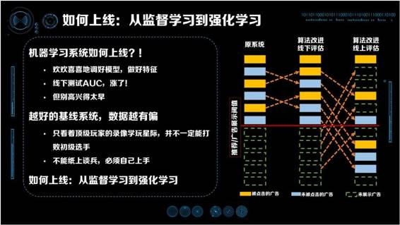 

 以搜索广告为例，上图中最左边表示的是原系统对广告进行排序产生的结果，线上系统展示 6 条广告，还有一些是没有被展示的广告。展示的广告中有被点击的广告（黄色）和没被点击的广告（蓝色）。我们使用展示过的广告研发下一代机器学习模型，如上图中间所示，优化之后发现被点击的广告线下预估得点击率更高，位置向上提升，没有被点击的广告位置向下变化。但是真正的应用到线上的时候（上如最右边所示），面对的侯选广告不止是它展示出来的广告，而是所有的广告。可能之前根本就没被原系统排上来的广告被排到了非常高的位置，这些广告可能很多根本就不会被点击。这样以来，展示过的广告虽然保持了原来的顺序，但是中间插入了很多不会被点击、原来没被排上的广告，占用广告展示位，使得系统 AUC 很差。

这里说一下我当年在百度搜索广告上线深度学习的的故事。那时百度凤巢还是在使用大规模离散 LR 系统，上千亿的个性化的特征让广告效果有长足的进步，刚获得百度最高奖。而这个时候，我是在这个 LR 系统的基础上，尝试使用深度学习的技术进一步提升效果。怎么让一个上千亿特征的宽度系统变身深度系统在但是还是一个没被研究过非常困难的问题，我们花了大半年的时间历经千辛万苦在线下获得了非常显著的指标提升，欢天喜地的想要上线，但刚一上线，我们就发现，线下模型训练的越好，线上获得的效果反而越差。这使我们当时非常沮丧，找了很久原因，定位到发现不是模型不对，也不是深度、宽度的问题，而是监督学习的问题——线上系统并不是问题封闭的监督学习系统，而是开放的不断变化的系统。这就好比你去学打《星际争霸》，不能通过顶级玩家的录像来学，因为学到套路并不一定能打败初级玩家，而必须以赛代练，自己上手，才可以把学到的知识真的用起来，面对变化的现实世界。

回过来看，如何上线其实是从监督学习到强化学习的问题。强化学习一般是闭环系统，系统里会不断的有外部反馈，这个反馈又是由系统产生的输出带来的结果。那如何更好的用系统输出产生的结果进行强化学习？强化学习面临的空间是一个未知空间，在 PPT 的广告的例子中，可以看到的空间是原系统产生出来的空间（只有黄、蓝色广告），但是线上面对的空间其实是黄、蓝加上绿这些广告构成的空间。怎么更好的探索黄、蓝、绿的空间，是强化学习要解决的问题。有很多工作在尝试解决这方面的问题，包括多臂老虎机、UCB 等等很多算法，最近这些强化学习技术也被用到了搜索广告与推荐系统。**总结起来，一定不要开心的太早，线上系统越强数据越有偏，学习越有偏的数据取得的效果，越不能代表上线的效果。**

**拆解复杂目标到单一目标，逐个优化**

有这么多好的技术，怎么更好的服务业务？机器学习做的是单目标优化问题，并没有能做多目标优化的机器学习算法。虽然有研究在做尝试，但在工业界还处于研究的初步阶段。在真正出现多目标机器学习算法之前，我们要更多的解决单目标优化的问题。

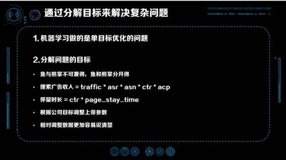 

比方说新闻推荐就是一个多目标复杂的问题，想要优化的指标极多——我们想优化留存、想优化时长、想优化点击率、想优化转发、想减少低俗、想优化时效性、想加速新用户冷启动等等，只优化某一个目标并不能让我们一劳永逸。那这里回想到以前有一个做推荐的朋友就因此特别的苦恼，因为每天面对这么多的要考虑的因素，每天都在自己跟自己左右互搏，非常的分裂。他在优化点击率时就很担心，是不是变低俗了？优化低俗的时候是不是降低了用户的参与？优化参与时又想阅读时长是不是会受到影响？但是，**如果一心想一次优化所有的目标，那么没有一个目标最终能被优化。机器学习解决问题的套路是通过把目标分解，逐个进行优化。**

举搜索广告的例子，搜索广告的收入可以拆解成：流量 * 有广告展示的流量比例 (asr) * 平均页面广告展示条数 (asn) * 点击率 (ctr) * 广告平均计费价格 (acp)。拆解成这么多目标后，优化点击率时就不用考虑其他的因素，点击率用模型优化，价格、条数用竞价机制优化，流量通过产品与渠道优化。把目标拆开后可以非常舒服的优化每一项，每一项都优化得非常极致，整个系统就能做到极致了。再举一个停留时长的例子。如果我们想优化阅读的整体停留时长，并不是去按照直观优化每个页面的停留时常，而是将停留时长分解成点击率 * 点击后页面停留时长，然后分开进行优化。

如果进行了合理的拆解，我们实际上可以有更多基础模型，利用这些基础模型，我们可以定义出针对业务目标的机制，比如说指数加权乘法或者逐级阈值门限机制等。利用设计好的机制，我们可以调整各个目标之间的关系，做出取舍，还可以定量的观察与获得指标间的兑换比例，比方说在模型不进行变化的前提下，多少点击率的降低能兑换出多少总时长的增加。应为每个指标都是独立的，我们只需要用 ABTest 就可以根据公司目标调整这些机制参数了。这样的方法相对于根据目标调整数据更能解释清楚，调整数据是我把目标的拆解直接加到数据中，认为什么目标重要就把那个目标对应的数据加倍、权重加倍。但困难在于加倍数据后模型需要重新训练，也很难说清楚处于连续变化状态中的目标，各个分指标是怎么互换的。

**关注人**

最后分享一下我们在工业界应用中，关注人的一些经验。关注人其实是一件我之前很少想的事情。如果你专注做机器学习，你可能认为与你交流的人、用你的技术的人或多或少懂得机器学习。但如果我们的目标是让所有人都能用上人工智能、让工业界更多的产业用上人工智能，你面对的人关于机器学习的水平参差不齐，就是一个非常现实的问题。在这样的情况下，关注人在其中就是至关重要的事。

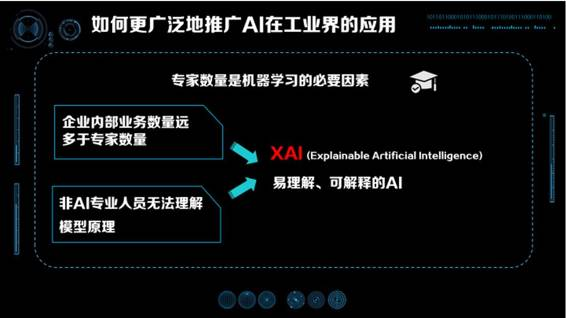 

 开头提到的机器学习成功必要条件的五点中，专家数量是机器学习成功的必要因素。困难之一是在更广阔的工业界，专家教授并没有那么多，企业内部需要优化的业务数量也远远大于专家数量。第二是非专业 AI 人员在无法理解（至少宏观上、直观上理解）模型原理之前，他们是不相信模型能够更好的优化他的业务的。比如你要把司机替换成自动驾驶，会发现人有非常非常多的顾虑，因为人不知道为什么机器会做出左右、前后、刹车的判断，也不知道背后的机器学习会在什么时候失效、什么时候能应用。这些问题在当前的技术前提下都是很难被直接定义、描述清楚的，那么这就会导致人工智能很难被推广到更大的领域中。

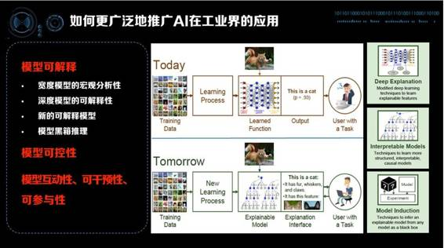 

 **如果要让更多的人能使用上这样的技术，首先是要解决模型的可解释性。**对应研究中的下一代技术叫 XAI（Explainable Artificial Intelligence），是一个更易理解的、更可解释的 AI 系统。XAI 是 DARPA 今年的 6 月份提出的项目，被美国认为是攸关国家安全高度的人工智能的技术。

模型的可解释非常有用，更好的可解释性、可理解性可以把人工智能算法或技术推广到更多公司、以及推广到公司其他部门，否则会碰到很多不同层面的问题。模型的可解释有很多研究方向，做图片分类时通过深度学习给出一个 Output，说图片是猫的概率是 0.93。这会令人疑惑，图片中的确是一只猫，但并不知道为什么机器认为它是一只猫。将来的学习过程可能是，图片放进来不仅会给出一个结果说它是猫，还会给出它是一只猫的原因——两个毛茸茸的耳朵、还有爪子、脚上还有很多毛、还有小肉垫，因此认为它是猫。**这样能更好的理解模型能做什么、不能做什么，这是应用人工智能至关重要的点。**

要解决可解释性的问题，我们可以有多个思路，第一个思路是对于重要的模型，我们针对性的设计解释机制。比方说考虑如何去解释一个大规模特征 LR 模型的问题，虽然 LR 模型天生是个解释性很好的模型，但是特征特别多的情况下，由于它是微观模型，并不容易看到模型整体。就像观察全国 14 亿人每个人的行为，我们可以了解很多事情的发生，但是这还是不够的的，我们需要从微观特征中得到宏观的统计和宏观的分析。这条思路其他重要的工作包括如何可视化以及解释深度学习的内部机制。第二个思路是我们也可以设计出一些全新的模型，这些模型最重要的设计目标就是在高可解释性的同时不丢失预测效果。最后一个思路是做模型的黑箱推理，不管是深度模型、宽度模型或者其他模型，通过黑盒的输入输出来窥探模型内部的运行机制。

除了模型可解释，在实际应用中，模型可控也是非常重要的一点。越重要的领域对模型可控的要求越强，因为不能出错。推荐和广告出错一次没什么问题，如果贷款判断失误或是无人驾驶判断失误，后果可能会关系到国计民生。为什么模型可控是一个难的问题呢？因为刚才说到模型要好 VC 维就一定要高、一定要有足够的自由度，但可控是要限制解空间的自由度，让模型满足很多规则与约束。这就相当于想要造一个超音速的飞行器，但同时要求能用绳子牵着像风筝一样被控制方向。这方面，我们也在进行探索，针对具体的问题，比方说定价，我们可以设计出一些既满足规则、VC 维又足够高的模型。

最后一点，模型的互动性、可干预性、可参与性。机器学习更多的是通过观历史预测未来，如果是历史上没有发生过的事情，还是需要通过专家更好的预测。一方面我们不能把人全部替掉，另一方面人在人工智能时代可以产生更重要的作用。怎样设计一个模型把专家的知识加进来，在数据不够充分的时候更相信专家，有了足够的积累就更相信数据和事实，是非常重要研究的话题。

**Take-Home Message**

 **最后，总结一下这次分享，有这么几个关键信息：

第一点， 我们要设计一个开放的可扩展的机器学习系统。它一定需要是高 VC 维的系统，才能保证随着业务增长，效率与效果也不断提升。 

第二点， 没有免费的午餐，也没有万能的模型。 

第三点， 宽度模型和深度模型各有利弊，根据场景、根据团队选择最合适你的。 

第四点， 模型从线下走到线上其实是强化学习的过程，你（和你的老板）最好做好半年抗战的准备。这个时间不是指写算法、做工程的时间，而是做强化学习、不断的迭代积累数据，让模型越来越好的时间。这点非常重要，否则新的模型很难用到实际的工作中。无数死于襁褓的模型都是惨遭缺乏强化学习之痛。 

第五点， 关注业务，设定更专注的目标解决更宽泛的问题。不要妄想一个机器学习模型能解决所有问题，要解决所有的问题就设计更多的模型，用机制让这些模型共同工作。 

第六点， 关注产品和业务人员，因为他们会最终决定 AI 能使用的深度和宽度。

今天我的分享就到这里。谢谢大家！

* * *

**问答环节**

***听众：第四范式的 Deep Sparse Networks 适合解决什么问题？***

**陈雨强**：解决既要求数据有很强的离散性或很强的个性化，同时又要求有很强的推理的问题。Deep Sparse Networks 能从更细的角度能把特征进行组合，挖掘出特征之间不同的关系，个性化的推荐、广告、排序，包括要做预估的场景都是 Deep Sparse Networks 适合的。 

***听众：第四范式的商业模式是什么，是给这些中小型企业提供人工智能服务，还是给大公司提供服务？大企业可能都有自己的团队，那第四范式是做一个平台性的工具，还是将来也做产品？要一直做送水人，还是跟 BAT 这种传统互联网去结合？***  

**陈雨强**：我觉得最关键一点是，BAT 解决的问题和各行各业要解决的 AI 问题并不一样。各行各业都有使用 AI 的需求，我们的商业模式是提供一个 AI 的平台，让客户有 AI 的能力、让客户自己使用人工智能。

我们最近开放的公有云上，面对的目标客户是有很高的人工智能质量诉求，但是现在并没有能力建立这样的团队的公司，诸如一些互联网公司，他们的发展目标也是关注在业务上的。另外一方面，我们会服务金融、保险、电信等领域的一些巨头，他们其实有非常强烈的使用 AI 的场景和诉求，但在技术上没有完全接轨最新的技术。通过平台的方式，我们让他们的人员用上最新的技术产生更好的价值。 

能做的事情太多，并且 BAT 和其他科技公司没有一家完全覆盖这部分业务。大数据公司很多，真正让大数据产生价值的公司很少，目前看还是相对不饱和的市场。 

***听众：我好奇的一点是，广点通是一个机器系统吗？投放的时候通过选择年龄、性别这样的标签可以代替监督学习的部分吗？以及，为了提升投放效果，是应该把它当成黑盒子去反复测试吗？***

**陈雨强**：首先，广点通是一个非常好的机器学习系统。第二，选择年龄、性别能不能代替监督学习，这是两个不同的概念。年龄、性别、地域是用户画像，选择的标签是可被验证的、与产品最息息相关的。比如针对女性用户的产品虽然男性用户点击率会非常高，可你根本不希望任何男性点进来。所以这部分是点击率模型不能解决的问题，一定要经过 Targeting 解决。 

还有一类是用户画像是并不必需的。比如来定义他喜欢车还是喜欢金融，这是一个很宽泛的概念，每家公司定义都不同。比方说高端客户、低端客户这样的标签，游戏公司的高端客户是每天玩 20 个小时游戏的人，但金融公司的高端客户很可能不是每天玩 20 小时游戏的人，所以通用、含糊的标签一般没有特别大的意义。 

第三，如何优化。我觉得 ABtest 是最好的方式，如果平台支持，可以通过出价、通过组合观察如何获得最佳的 ROI，是现有比较有效的方法。如果说怎么结合机器学习，可以把 ROI 与数据做一个结合，这样更清楚哪些标签或者哪些投放的关键词更有可能获得更高的 ROI。 

***听众：去年吴恩达写了一篇文章叫「每个企业都需要一个首席智能官」，第四范式不在任何一个企业里，但可能也起到一个智能官的作用。对于怎么把机器学习变成可解释的东西，能和我们分享讲一个具体的故事，或者跟企业打交道面临需要解释的困难吗？***

**陈雨强**：首席智能官需要做的事情有很多，涉及到如何在公司发挥人工智能的价值、推进人工智能、让人工智能更好的被接受、对趋势的判断、对技术的理解以及平台的搭建，还包括技术的推广。 

我们在某个比较大的国有股份制银行做好了一个模型，仅用一个月的时间就让某一个具体的业务提升了 60% 的收入，换算成钱一年是十几亿的收入。银行就非常急想上线，但是需要让我们解释我们的模型为什么能工作，为什么比他们之前的算法和模型好。我们模型其实是一个宽模型，有上亿的特征，特征是可以一个一个拿出来看的，但是并不能了解模型为什么起作用。我们设计了一个可解释模型，用树模型这个相对容易解释的方式，你和我们的宽模型，让客户了解我们模型的背后在做什么事情。同时业务人员看了我们的模型，也获得一些启发，帮他们找到了一些新的业务规律。这个模型最终一是被用来做可解释模型，第二是用来做他们审计的模型，应对银行的监管诉求。 

***听众：深度模型和宽度模型的选择是应该发生在项目开始之前，还是以结果为导向，这两个模型都会去做，最终实际效果哪个更好我选择哪个模型？***

**陈雨强**：这个问题在于选择建设适合你的机器学习系统。比如说这个系统面对的是不断变化的业务，宽度模型是非常好的能结合业务知识和专家意见的机制。如果是一个技术为主、模型为主的团队，走深度这条路也是可以获得非常大的提升的。说到底不只是技术选型的问题，还是管理、架构的问题。选择什么样的路决定将来怎么搭建团队、怎么获得持续的提升，因为机器学习一定不是一次就能完成的，是不断提升的。 

***听众：在模型角度出发，什么情况下即使数据是非常充足的，我们也认为专家的意见更可靠？***

**陈雨强**：如果数据比较充分，专家的意见又比较靠谱，它们两个是高度一致的。专家更大的作用还是在于宏观上，可以非常容易的加入宏观的外部信息。这些信息如果计入模型相对会有滞后性，这是没有办法克服的，专家的及时性会更加好。 

***听众：假设数据的情况非常理想，在模型方面您会做哪些努力保证这个模型的可控性是最强的？***  

**陈雨强**：模型可控性不是所有的方方面面都被控制住，可控是模型达到的业务目标。举用机器学习解决智能定价的问题为例，对信用卡分期产品进行定价，3 期、6 期、9 期、12 期有不同的手续费，一个合理的假设或者一个正常的要求可控的规则是，期数越高单期手续费应该越低。如果机器学习解决这个问题，不能保证期数越高手续费就一定越低。

所以具体方法是什么？先设计一个部分强可控的模型，控制它的单调性、一致性和参数范围；另一部分不需要可控的参数，让它自由的学习，通过这种方式来达到可控。

***听众：过去人工智能研究专家系统，现在深度学习和专家系统是不是能够结合？***

**陈雨强**：这方面研究还是挺活跃的，近期的马尔科夫逻辑网把逻辑和神经网络在一起，还有在贝叶斯方法最近也相对更热了一点。大家也意识到深度学习很难解释，所以通过逻辑、推理、概率这种方式能得到更可解释的模型。我们自己也在思考，怎样能更好的把专家的知识结合进来。过去其实分两块，一块就是说 KR（Knowledge Representation)，一种就是做推理，现在有了深度学习、有了各种学习方向，可能会有更多的发展。

******©本文为机器之心整理发布，***转载请联系本公众号获得授权******。***

✄------------------------------------------------

**加入机器之心（全职记者/实习生）：hr@almosthuman.cn**

**投稿或寻求报道：editor@almosthuman.cn**

**广告&商务合作：bd@almosthuman.cn****