# 技术 | 词嵌入系列博客 Part1：基于语言建模的词嵌入模型

选自 SebastianRuder Blog

**作者：Sebastian Ruder**

**机器之心编译**

**参与：冯滢静**

> *本文是词嵌入系列博客的 Part1，全面介绍了词嵌入模型，接下来几天机器之心将继续发布 Part2、Part3，希望能对大家了解词嵌入有所帮助。*

> **目录：**
> 
> 1.  词嵌入简史
>     
>     
> 2.  词嵌入模型
>     
>     
> 
> *   语言模型的简介
>     
>     
> *   经典的自然语言模型
>     
>     
> *   C&W 模型
>     
>     
> *   C&W model
>     
>     
> *   CBOW
>     
>     
> *   Skip-gram
>     
>     
> 
> 无监督学习词嵌入（word embeddings）在许多自然语言处理的任务中都取得了前所未有的成功，因此它常被视为自然语言处理的万灵药。实际上，在许多自然语言处理架构中，它们确实几乎替代了诸如布朗聚类（Brown clusters）和 LSA 特征等传统型分布式特征。
> 
> 去年 ACL（计算机语言学会）和 EMNLP（在自然语言处理中实证方法会议）的会议论文很大程度都是词嵌入的研究，有些人还认为词嵌入这种嵌入方法比 EMNLP 更加适合的自然语言处理。今年的 ACL 会议有了不仅一个，而是两个的词嵌入模型的研讨会。
> 
> 词嵌入之间的语义关系在外行人看起来就像变魔术。深度自然语言处理的讲座常以「国王－男人＋女人≈女王」的幻灯片来做开场白，一篇最近在 Communications of the ACM 的文章向词嵌入模型致敬，并称之为自然语言处理实现突破的主要原因。
> 
> 这篇博文将会是本系列第一篇全面介绍词嵌入模型的文章，将讨论词嵌入模型的热度是否会持续下去及其原因。在这个介绍里，我们将尝试把在这个领域分散的论文串联起来，强调很多模型、应用和有趣的特征，并将在后续的文章中重点关注多语言环境下的词嵌入模型和词嵌入评估任务。
> 
> 这第一篇文章将呈现目前的基于语言建模的词嵌入模型。在我们深度讨论很多的模型时，我们会挖掘它们的优点，希望能够在过去和当前的研究的背景下提供新的见解。
> 
> 对于命名方式的简单小结：接下来我们将使用当前热门的「词嵌入（word embeddings）」术语，来指代词语在低维度向量空间的稠密表示。「词嵌入」和「分布式表征（distributed representations）」是两种可互换的表示方法。我们将特别强调「神经词嵌入（neural word embeddings）」，即运用神经网络训练的词嵌入。
> 
> **词嵌入简史**
> 
> 从上世纪九十年代开始，向量空间模型就已在分布式语义中得到了应用。当时，许多用于预测连续空间的词表征的模型已经被研究了出来，其中包括隐含语义分析（LSA：Latent Semantic Analysis）和隐狄利克雷分布（LDA：Latent Dirichlet Allocation）。想要详细了解词嵌入背景下的分布式语义的历史的读者可以看看这篇文章：https://www.gavagai.se/blog/2015/09/30/a-brief-history-of-word-embeddings/
> 
> Bengio 等人在 2003 年创造了词嵌入这个名词，并且在自然语言模型中将其与模型参数一起联合训练。据了解 Collobert 和 Weston 于 2008 年首次展示了预训练的词嵌入的实际应用。他们里程碑式的论文《A unified architecture for natural language processing》不仅将词嵌入确立成了一种可用于下游任务的有用工具，还引入了现在已经成为了许多方法的基础的神经网络架构。但是让词嵌入最终能流行起来的是 Mikolov 等人在 2013 年创立的 word2vec，这是一个允许无缝训练和使用预训练嵌入的工具套件。在 2014 年，Pennington 发布了一个具有竞争力的预训练的词嵌入集 GloVe，标志着词嵌入已经成为了主流。
> 
> 词嵌入是目前无监督学习的成功应用之一。它们最大的好处无疑是它们不需要昂贵的人工标注，而是从未标注的现成大数据集中派生的。然后预训练的词嵌入就可以运用在仅使用少量有标注数据的下游任务中了。
> 
> **词嵌入模型**
> 
> 自然而然地，每个前向传播的神经网络都把在词汇表中的词语当成输入，并把它们表示成低维空间中向量。然后，它们再通过反向传播进行调整，得出词嵌入作为第一层的权重。通常，这称之为「嵌入层（Embedding Layer）」。
> 
> 产生词嵌入作为副产物的神经网络和 word2vec 这样的以生成词嵌入为特定目标的方法之间的主要区别是它们的计算复杂度。对于一个大的词汇集来说，使用非常高深度的架构来生成词嵌入的计算成本太高。
> 
> 这就是为什么直到 2013 年词嵌入才进入自然语言处理的舞台。计算复杂度是词嵌入模型的一个关键权衡，也是我们这篇概述中会重复出现的主题。
> 
> 另一个区别就是训练目标：word2vec 和 GloVe 都是用来生成广泛语义关系的词嵌入模型，这对许多下游任务有用；而这种方式训练的词嵌入对不依赖于这种语义关系的任务并无太多帮助。相反，常规的神经网络对于某个特定任务生成的词嵌入在别的任务往往功能有限。值得注意的是，一个依赖于语言建模这样的语义关系的任务能够生成类似于词嵌入模型的嵌入，这一点我们将在下节探讨。
> 
> 额外说明一点，word2vec 和 Glove 之于自然语言处理，也许就像是 VGGNet 之于计算机视觉，亦即一个普通的权重初始化——它能提供有用特征，而且无需长时间训练。
> 
> 比较不同的模型，我们可以设想如下的标准：我们设想一串来自词汇库 V（其大小为|V|）的包含 T 个训练单词的的字符序列 w_1,w_2,w_3,⋯,w_T。
> 
> 想象我们的模型是一段包含 n 个单词的文段。我们将每一个单词与一个 d 维的输入向量 v_w（嵌入层中的同名词嵌入）和一个输出向量 v_w'（另一个词表征，其作用下面很久就会介绍）联系在一起。最终，对于每一个输入 x，我们相对于模型参数θ和模型输出分数 f_θ(x) 来优化目标函数 J_θ。
> 
> **语言建模上的一项注意**
> 
> 词嵌入模型和语言模型联系紧密。对语言模型的质量评价基于它们学习 V 词汇库的词语概率分布的能力。事实上，许多最新的词嵌入模型一定程度上尝试预测序列下一个会出现的词。另外，词嵌入模型的评价通常运用困惑度（perplexity）——一个从语言建模借来的基于交叉熵的评价标准。
> 
> 在我们进入词嵌入模型的众多细节之前，让我们简单介绍一些语言建模的基础知识。
> 
> 总体而言，语言建模力求在给定之前的词语的情况下，计算一个词语 w_t 的出现概率，也就是 p(w_t|w_{t−1},⋯w_}t−n+1})。运用链式法则和马尔可夫假设，我们就可以近似地通过之前出现的 n 个词得到每个词的概率乘积，从而得到整个句子或整篇文章的乘积：
> 
> 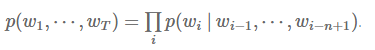 
> 
> 在基于 n 元的语言模型中，我们可以用一个词的组分的 n 元的频率（frequency）来计算这个词的概率：
> 
> 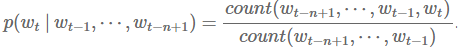 
> 
> 设置 n=2 产生二元模型，而 n=5 和 Kneser-Ney 则一同呈现平滑的五元模型——平滑的五元模型在语言建模中是公认的的一个强有力基准线。更多的细节，敬请参照斯坦福大学的演讲课件。
> 
> 在神经网络中，我们通过大家熟知的 Softmax 层来计算相同的目标函数：
> 
> 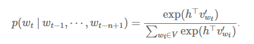 
> 
> 内积 h^T v'_{w_t} 计算了词 w_t 的未标准化的对数－概率（log-probability），我们用在词汇库 V 中的所有词的对数－概率之和来把它标准化。h 是它的倒数第二层（见图 1 前向传播网络的隐藏层）的输出向量，而 v'_w 就是词 w 的输出嵌入，亦即在 softmax 层的权重矩阵中的表征。注意虽然 v'_w 可以表征词 w，但它是从输入词嵌入 v_w 独立学习的，因为向量 v'_w 和向量 v_w 的相乘对象是不同的（v_w 和索引向量相乘，v′_w 和 h 相乘）。
> 
> 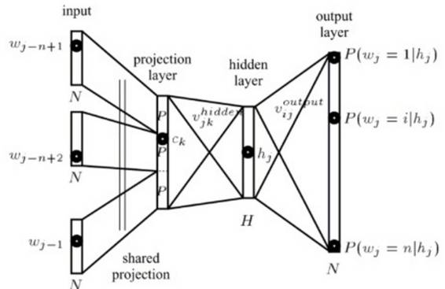
> 
> *图 1: 一个自然语言模型（Bengio 等人，2006 年）*
> 
> 我们需要计算每个词 w 在神经网络输出层的概率。想要高效地做到这一点，我们将 h 和一个权重矩阵相乘，这个权重矩阵每行都是对于在 V 中出现的词 w 所得的 v′_w。我们随后将得到的向量（我们通常称之为 logit，也就是前一层的输出）以及 d=|V| 传入到 softmax 层，softmax 层则把词嵌入「压扁」成一个词汇库 V 里面词的概率分布。
> 
> 注意 softmax 层（对比于之前的 n 元计算）仅仅隐式地考虑之前出现的 n 个词。长短时记忆模型（Long Short-term Memory, 英文简称 LSTM），通常用来作自然语言处理模型，将这些词编码成状态 h。我们在下一章将会介绍的 Bengio 的自然语言模型，则是把之前的 n 个词通过一个前向传播层传入。
> 
> 请大家记住这个 softmax 层，许多后续介绍的词嵌入模型都将或多或少地运用它。运用这个 softmax 层，模型将尝试着在每一时刻 t 都最大化正确预测下一词的概率。于是，整个模型尝试最大化整个数据集的平均对数－概率:
> 
> 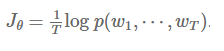 
> 
> 相似地，运用链式法则，模型的训练目标通常是最大化整个语料库的所有词相对于之前 n 个词的平均对数－概率：
> 
> 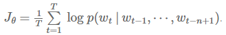 
> 
> 如果想在试验阶段从这个语言模型取样词，我们可以在每一时刻 t 贪婪地选择最高概率的词 p(w_t \: | \: w_{t-1} \cdots w_{t-n+1})，或者用定向搜索。举个例子，我们可以用它来生成像运用了 LSTM 作为解码器的 Karpathy 的 Char-CNN 中的任意文本序列。
> 
> **经典神经语言模型**
> 
> Bengio 等人在 2013 年 [1] 提出的经典神经语言模型包含一个前向传播神经网络，它有一个隐藏层，用来预测文本序列的下一个单词，如图 2 所示。
> 
> 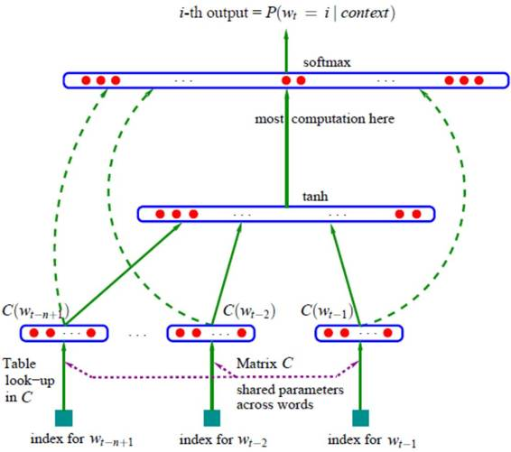
> 
> *图 2: 经典神经语言模型（Bengio 等人，2013 年）*
> 
> 他们的模型的最大化目标函数就是我们在上文中介绍的典型的神经语言模型的目标（为了简洁，我们忽略规范化（regularization）这一项）：
> 
> 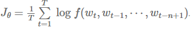 
> 
> f(w_t , w_{t-1} , \cdots , w_{t-n+1}) 是这个模型的输出，即 softmax 计算出的概率 p(w_t \: | \: w_{t-1} , \cdots , w_{t-n+1})。n 在这里就是传入这个模型的之前 n 个词的数量。
> 
> Bengio 等人首先提出词嵌入模型，它是一个在实数范围 R 内的词特征向量。他们的架构非常经典，是目前各种改进方法的原型。他们原始模型中的基础模块依然能在现在的许多神经网络和其他词嵌入模型中找到。
> 
> *   嵌入层：一个用索引向量和词嵌入矩阵相乘得出的词嵌入层；
>     
>     
> *   中间层：一个可包含一层或多层的中间层，例如，一个可以将之前出现的 n 个词非线性地组合在一起的全连接层（fully－connected layer）；
>     
>     
> *   Softmax 层：一个最终层，输出词汇库 V 中词的概率分布。
>     
>     
> 
> 另外，Bengio 等人发现了目前最先进模型中存在的两个核心问题：
> 
> *   他们发现 2\. 中间层可以由一个 LSTM 替代，这个已被最新神经语言模型使用。
>     
>     
> *   他们发现最后的 softmax 层（更确切地说，是标准化项）是神经网络的瓶颈，因为计算 softmax 的计算复杂度与词汇库 V 中词的数量成正比，而个数量通常为成百上千，乃至几百万。
>     
>     
> 
> 因此，如何在一个大词汇库中用较低的计算成本计算 softmax，成为了建立神经语言模型和词嵌入模型的一个关键挑战。
> 
> **C&W 模型**
> 
> 在 Bengio 等人对神经语言模型的的最初探索以后，计算机计算能力和算法还尚不允许在大词汇库上的训练。词嵌入模型的研究因而止步不前。
> 
> Collobert 和 Weston [4]（因此被称为 C&W）在 2008 年展示了词嵌入模型在一个充分大的数据库中如何向下游任务携带语法和语义，并且提升性能。他们 2011 年的论文充分解释了他们的做法。
> 
> 他们的解决方法避免了对于 softmax 层的昂贵计算，其方法是采用另一个目标函数：Collobert 和 Weston 的神经网络输出是正确词序列相对于不正确词序列高出的分数 f_θ，而不是 Bengio 等人的论文中用来最大化基于之前的词出现的下一个词概率的的交叉熵标准。他们为了这个目标函数采用了一个成对排名的标准，如下所示：
> 
> 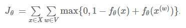 
> 
> 他们的模型从所有包含 n 个词的窗口 X 中取样得到正确的窗口 x。对于每一个窗口 x，用 V 中的 w 代替 x 的中间词来产生一个不正确的版本 x(w)，而模型的目标就是最大化模型对于正确的窗口和不正确窗口的分数的距离。如图 3 所示，他们的模型架构类似于 Bengio 等人的模型。
> 
> 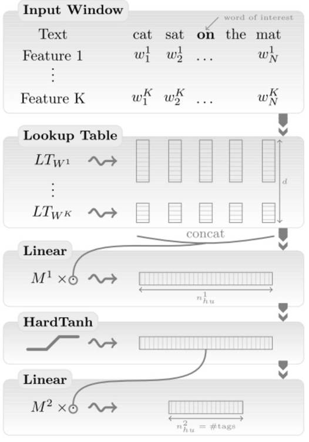 
> 
> *图 3: 去掉了排名目标的 C&W 的模型（Collobert 等人，2011 年）*
> 
> 计算后的语言模型能够生成具有许多语义关系的词嵌入，例如国家能够聚类在一起，语法上接近的词在向量空间上相邻。他们的排名函数避免了 softmax 的复杂计算，且保持了 Bengio 等人论文中计算同样昂贵的完全相连的中间层（2.）（见图 3 中的 HardTanh 层）。他们对于 130000 个词的模型需要花费 7 周来训练的有一部分原因在于此。
> 
> 让我们现在介绍当今毫无疑问最为流行的词嵌入模型 word2vec，它源于 Mikolov 等人在 2013 年中两篇论文，且催生了上千篇词嵌入的论文。正因为词嵌入模型是自然语言处理中深度学习的一个关键的模块，word2vec 通常也被归于深度学习。然而严格上来说，word2vec 并不属于深度学习，因为它的架构并非多层，也不像是 C&W 模型一般运用非线性模型。
> 
> 在他们的第一篇文章 [2] 中，Mikolov 等人提出了更低计算成本的学习词嵌入的两个架构。他们的第二篇论文 [3] 通过加入更多的提升了训练速度和准确度的策略来提升了模型。
> 
> 这些架构提供了对比于 C&W 模型和 Bengio 模型具有如下两大优点：
> 
> *   他们去掉了昂贵的中间层。
>     
>     
> *   他们运用语言模型来更多地考虑上下文。
>     
>     
> 
> 我们等等会讲到，他们的模型之所以成功不仅是因为这些改变，而更是因为某些特定的训练策略。
> 
> 接下来，我们会来看这两个架构：
> 
> **连续的词袋（CBOW）**
> 
> 言模型只能通过观察之前出现的词来进行预测，且对于此类模型的评价只在于它在一个数据集中预测下一个词的能力，训练一个可以准确预测词嵌入的模型则不受此限。Mikolov 等人运用目标词前面和后面的 n 个词来同时预测这个词，见图 4。他们称这个模型为连续的词袋（continuous bag-of-words，或者 CBOW），因为它用连续空间来表示词，而且这些词的先后顺序并不重要。
> 
> 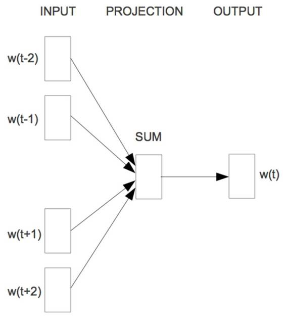 
> 
> *图 4：连续的词袋（Mikolov 等人，2013 年）*
> 
> CBOW 的目标函数和语言模型仅有着细小差异：
> 
> 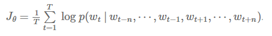 
> 
> 这个模型并没有传入 n 个之前的词，而是在每个时刻 t 接收目标词的前后 n 个词的窗口 w_t。
> 
> **Skip-gram**
> 
> CBOW 可以看作一个具有先知的语言模型，而 skip-gram 模型则完全改变将语言模型的目标：它不像 CBOW 一样从周围的词预测中间的词；恰恰相反，它用中心语去预测周围的词，如图 5 所示。
> 
> 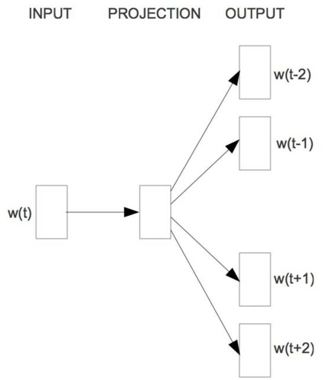 
> 
> *图 5：Skip-gram（Mikolov 等人，2013）*
> 
> skip-gram 模型的目标因此用目标词前后的各 n 个词的对数──概率之和计算如下的目标：
> 
> 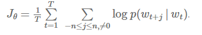 
> 
> 为了更直观地解释 skip-gram 模型是怎样来计算 p(w_{t+j}|w_{t}) 的，让我们先来回顾 softmax 的定义：
> 
> 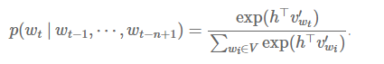 
> 
> 我们不计算目标词 w_t 基于前面出现的词的概率，而是计算周围词 w_{t+j} 对于 w_t 的概率。于是，我们可以简单地替换掉这些变量：
> 
> 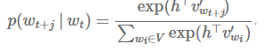 
> 
> 因为 skip-gram 架构并不包括能够产出中间状态向量 h 的中间层，h 自然地成为对于输入词 w_t 的词嵌入 v_{w_t}。这也是我们为什么想给输入向量 v_w 和输出向量 v′_w 以用不同的表示，因为我们想要将词嵌入和自己相乘。用 v_{w_t} 替换 h，我们得到：
> 
> 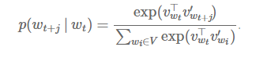 
> 
> 注意 Mikolov 论文中的代号和我们的有细微差别，他们标注词语为 w_I，而周围的词为 w_O。如果我们用 w_I 替换 w_t，用 w_O 替换 w_{t+j}，然后根据乘法交换律交换内积的向量位置，我们能够得到和它们论文中一样的公式表示：
> 
> 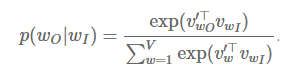 
> 
> 下一篇博文，我们将要讨论近似昂贵的 softmax 函数的不同方式，以及令 skip-gram 成功关键的训练决策。我们也会介绍 GloVe[5]，一个基于矩阵乘法分解的词嵌入模型，并讨论词嵌入和分布式语义的关系。
> 
> ***References***
> 
> *Bengio, Y., Ducharme, R., Vincent, P., & Janvin, C. (2003). A Neural Probabilistic Language Model. The Journal of Machine Learning Research, 3, 1137–1155\. http://doi.org/10.1162/153244303322533223*
> 
> *Mikolov, T., Corrado, G., Chen, K., & Dean, J. (2013). Efficient Estimation of Word Representations in Vector Space. Proceedings of the International Conference on Learning Representations (ICLR 2013), 1–12\.*
> 
> *Mikolov, T., Chen, K., Corrado, G., & Dean, J. (2013). Distributed Representations of Words and Phrases and their Compositionality. NIPS, 1–9\.*
> 
> *Collobert, R., & Weston, J. (2008). A unified architecture for natural language processing. Proceedings of the 25th International Conference on Machine Learning - ICML ’08, 20(1), 160–167\. http://doi.org/10.1145/1390156.1390177*
> 
> *Pennington, J., Socher, R., & Manning, C. D. (2014). Glove: Global Vectors for Word Representation. Proceedings of the 2014 Conference on Empirical Methods in Natural Language Processing, 1532–1543\. http://doi.org/10.3115/v1/D14-1162*
> 
> *Kim, Y., Jernite, Y., Sontag, D., & Rush, A. M. (2016). Character-Aware Neural Language Models. AAAI. Retrieved from http://arxiv.org/abs/1508.06615*
> 
> *Jozefowicz, R., Vinyals, O., Schuster, M., Shazeer, N., & Wu, Y. (2016). Exploring the Limits of Language Modeling. Retrieved from http://arxiv.org/abs/1602.02410*
> 
> *Collobert, R., Weston, J., Bottou, L., Karlen, M., Kavukcuoglu, K., & Kuksa, P. (2011). Natural Language Processing (almost) from Scratch. Journal of Machine Learning Research, 12 (Aug), 2493–2537\. Retrieved from http://arxiv.org/abs/1103.0398*
> 
> *Chen, W., Grangier, D., & Auli, M. (2015). Strategies for Training Large Vocabulary Neural Language Models, 12\. Retrieved from http://arxiv.org/abs/1512.04906*
> 
> ******©本文由机器之心编译，***转载请联系本公众号获得授权******。***
> 
> ✄------------------------------------------------
> 
> **加入机器之心（全职记者/实习生）：hr@almosthuman.cn**
> 
> **投稿或寻求报道：editor@almosthuman.cn**
> 
> **广告&商务合作：bd@almosthuman.cn**
> 
> 