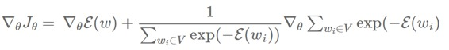
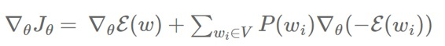

# 技术 | 词嵌入系列博客 Part2：比较语言建模中近似 softmax 的几种方法

选自 SebastianRuder Blog

**作者：Sebastian Ruder**

**机器之心编译**

**参与：冯滢静**

> *本文是词嵌入系列博客的 Part2，全面介绍了词嵌入模型， Part1 请点击*[*技术 | 词嵌入系列博客 Part1：基于语言建模的词嵌入模型*](http://mp.weixin.qq.com/s?__biz=MzA3MzI4MjgzMw==&mid=2650719971&idx=2&sn=c7e0d1f6dd4e9ddce291e9bc2c85c65f&chksm=871b029db06c8b8b7557095989dd3fdb57b86a1d7923c388ca1e74255d07f08992bb0461d958&scene=21#wechat_redirect)

*   **基于 Softmax 的方法**

*   多层次 Softmax

*   微分 Softmax

*   CNN-Softmax

*   **基于采样（Sampling）的方法**

*   重要性采样

*   具有适应的重要性采样

*   目标采样

*   噪音对比估计

*   负采样

*   自标准化

*   低频的标准化

*   其他方法

*   **选择哪一种方法？**

*   **结论**

这篇博文是我们词嵌入及其表示系列的第二篇。在上一篇博文里，我们提供了词嵌入模型的概述，并介绍了 Bengio 等人在 2003 年提出的经典神经语言学习模型、Collobert 和 CWeston 在 2008 年提出的 C&W 模型，以及 Mikolov 在 2013 年提出的 word2vec 模型。我们发现，设计更好的词嵌入模型的最大挑战，就是如何降低 softmax 层的计算复杂度。而且，这也是机器翻译（MT）（Jean 等人[10 ]）和语言建模（Jozefowicz 等人[6 ]）的共通之处。

在这篇博文里，我们将要重点介绍过去几年的研究中 softmax 层的不同近似方法，它们其中的一些被运用在语言建模和机器学习。在下一篇博文里，我们才会介绍别的超参数。

为了统一以及便于比较，让我们简单重新介绍一下上一篇博文的重点：我们假设训练集是一串包括 T 个训练词的字符序列 w1,w2,w3,⋯,wT ，每一个词来源于大小为 |V| 的词汇库 V。模型大体上考虑 n 个词的上下文 c。我们将每一个词和一个 d 维度的输入向量（也就是表示层的词嵌入）vw 以及输出向量 v′w（在 softmax 层的权重矩阵的对于词的表示）联系在一起。最终，我们相对于我们的模型参数 θ 来优化目标函数 Jθ。

我们一起来回顾一下，softmax 层对于一个词 w 在上下文 c 出现的概率的计算公式如下：

其中，h 是倒数第二层的输出向量。注意到和之前提到的一样，我们用 c 来表示上下文，并且为了简洁，舍弃目标词 wt 的索引 t。计算 softmax 的复杂度很高，因为计算 h 和 V 里每个词 wi 的输出向量的内积需要通过一部分的分母的求和来获得，从而得到标准化后目标词 w 在上下文 c 的概率。

接下来我们将会讨论近似 softmax 所采用的不同方法。这些方法可以分成两类：一类是基于 softmax 的方法，另一类则是基于采样的方法。基于 softmax 的方法保证 softmax 层的完好无损，但是修改了它的结构来提升它的效率。基于采样的方法则是完全去掉 softmax 层，优化其它目标函数来近似 softmax。

**基于 softmax 的方法**

**多层次的 softmax 方法**

多层次的 softmax（H－Softmax）是 Morin 和 Bengio[3]受到二叉树启发的方法。根本上来说，H-softmax 用词语作为叶子的多层结构来替代原 softmax 层的一层，如图 1 所示。

多层次的 softmax（H－Softmax）是 Morin 和 Bengio[3]受到二叉树启发的方法。根本上来说，H-softmax 用词语作为叶子的多层结构来替代原 softmax 层的一层，如图 1 所示。

这让我们把对一个词出现概率的计算分解成一连串的概率计算，我们将无需对所有词作昂贵的标准化。用 H-Softmax 来替代单一的 softmax 层可以把预测词的任务带来至少 50 倍的速度提升，因此适用于要求低延迟的任务，比如 Google 的新通讯软件 Allo 的实时沟通功能。

 

*图 1：多层词的 softmax*

我们可以把常规的 softmax 想成是只有一层深度的树，每个 V 中的词都是一个叶子节点。计算一个词的 softmax 的概率则需要标准化所有 |V| 个叶子的概率。反之，如果我们把 softmax 当成一个每个词都是叶子的二叉树，我们只需要从叶子节点开始沿着树的路径走到那个词，而无序考虑其它的词。

因为一个平衡的二叉树的深度为 log2(|V|)，我们只需要通过计算最多 log2(|V|) 个节点来取得一个词最终的概率。注意到这个概率都已经经过了标准化，因为二叉树中所有叶子节点的概率之和为 1，所以形成了一个概率分布。想要粗略地验证它，我们可以推理一个树的根节点（图 1 中的节点 0），它的所有分支必须相加为 1。对于每个接下来的节点，概率质量分解给它的分支，直到最终到达叶子节点，也就是词。因为这其中没有损失概率，而且所有词都是叶子，所有词的概率的总和必须为 1，所以分层次的 softmax 定义了在 V 上所有词的一个标准化的概率分布。

具体而言，当我们遍历树的时候，我们需要计算每个分支点的左右两个分支来计算这个节点的概率。正因如此，我们要为每个节点指定一个表示。对比于规律的 softmax，对于每个词，我们因此不需要 v'w 的输出词嵌入——反之，我们用给每个节点 n 都指定词嵌入 v′n。因为我们有 |V|−1 个节点，而每一个都拥有一个唯一的表示，H-Softmax 参数都和普通的 softmax 几乎一样。我们现在可以计算给定上下文 c 一个节点 n 的右分支（或左分支）的概率了，方式如下：

这个方法和普通的 softmax 的计算方式几乎一致。现在，我们不计算 h 和词嵌入 v′w 的点乘积，而是计算每个树节点的 h 和词嵌入 v′w。另外，我们不计算整个词汇库里所有词的概率分布，我们仅仅输出一个概率，在这个例子中这个概率是 sigmoid 函数的节点 n 的右分支的概率。相反地，左分支的概率是 1−p(right|n,c)。

 

*图 2：多层次的 softmax 计算 *

由此易得一个词 w 在上下文 c 中的为左右分支的概率之积。举个例子，在上下文「the」、「dog」、「and」、「the」之中，在图 2 中词「cat」的概率可以通过计算从节点 1 向左，经过节点 2 转右，再在节点后转右所得的概率来计算。Hugo Lachorelle 在他的课程视频 (https://www.youtube.com/watch?v=B95LTf2rVWM)中提供了一个更详细的介绍。Rong[7] 也很好地解释了这些概念，并且推导了 H-Softmax 的导数。

显然，树的结构十分重要。直观上来说，如果我们让模型在每个节点都来学习二元分类，比如我们可以让相似的路径获得相似的概率，我们的模型应该可以获得更好的表现。基于这一点，Morin 和 Bengio 给树提供 WordNet 中的 synsets 的聚类。然而，他们的模型表现却不如常规的 softmax。Mnih 和 Hinton [8] 用一个聚类算法来训练树结构来低轨地把词分成两堆，并且他们的模型在一部分的计算中表现和常规的 softmax 相当。

值得注意的是，只有在我们提前知道想要预测的那个词（以及它的路径）时，我们才能够加速训练。在测试阶段，当我们需要预测最可能出现的词时，尽管缩小了范围，我们仍然需要计算所有词的概率。

实际上，我们不需要用「左」和「右」来指定子节点，我们可以用一个对应路径的位向量来索引节点。在图 2，如果我们假设用比特 0 来表示向左和比特 1 来表示向右，我们可以用 0-1-1 来表示一条左－右－右的路径。

让我们回顾一下，一个平衡二叉树的路径长度是 log2|V|。如果我们设置 |V|=10000，这就相当于一条大约长度为 13.3 的路径长度。相似的，我们可以用平均长度为 13.3 的路径的位向量来表示每一个词。在信息论中，这指代一串信息长度为 13.3 比特的字。

字的信息内容小结

首先回忆，一个词 w 的信息量（信息熵）I(w)是它的概率的负对数 I(w)=−log2p(w)。

在数据集中所有词的熵 H 就是在一个单词库的所有词的信息熵的期望：H=∑i∈Vp(wi)I(wi)

我们也可以把一个信息源的信息熵想成是用来编码这部分信息所用的比特数。对于抛掷一枚公平的硬币，每次需要 1 比特；而对于一个总是输出相同符号的信息源，我们只需要 0 比特。对于一个平衡二叉树，我们平等对待每一个词，每个词 w 的熵 H 将拥有同样的信息量 I(w)，因为每个词都有同样的概率。在一个 |V|=10000 大小的平衡二叉树中平均的词信息熵 H 就恰好是它的平均路径长度：

 

我们之前讲过，树的结构十分重要。值得注意的是，利用树的结构不但可以获得更好的表现，更可以加速运算：如果我们将更多信息加载进树中，那么更少信息的词将不意味着更短的路径，因为有些词出现频率更高，就可以用更少的信息去编码它。一个 |V|=10,000 长度的信息库的词信息熵大约为 9.16。

因此，考虑到出现频率，我们可以减少一个词汇库中每个词中的平均比特数。在这个例子中，我们从 13.3 减少到 9.16，相当于加速了 31%。Mikolov 等人 [1]把哈夫曼树运用在多层次 softmax，把更少的比特赋给更常出现的词。比如，「the」这个最常见的英语单词，在树中只需要最少比特数的编码，而第二常见的单词将会被指定第二少比特数的编码，以此类推。虽然我们仍然需要用相同数量的词去编码一个数据集，然而有更高频率出现短的编码，所以平均而言，去给每个词编码只需用更少的比特数。

一个类似于哈夫曼编码的编码又被称为信息熵编码，因为每个编码词的长度大约是和我们观察到的每个符号的熵成正比。Shannon [5] 在他的实验中建立了英语的信息率的下界，每个字母大约是 0.6 到 1.3 比特；根据每个词的长度为 4.5，这相当于每个单词为 2.7 到 5.85 比特。

将这个和语言建模（我们在上一篇博文中讲到的那样）联系起来：语言模型的评价标准的困惑度应该是 2H，其中 H 就是信息熵。一个一元的熵是 9.16，因此它有一个非常高的困惑度 2⁹.16=572.0。我们可以将这个值更加具体化，观察一个困惑度为 572 的模型就像从一个信息源中选择单词，而每个单词有 572 种选择，每种选择概率相等，且互相独立。

这么说吧：Jozefowicz 等人在 2016 年开发的这个最新的语言模型，在 1B Word Benchmark 中，每个词拥有 24.2 的困惑度。这个模型因此需要大约 4.60 比特来编码一个词，因为 2⁴.60=24.2，非常接近于 Shannon 描述的实验下界。我们能否，以及如何使用这个模型去建立一个更好的多层次 softmax 层？这些问题仍留待我们去探索。

**微分 Softmax 方法**

Chen 等人[9]介绍了一个经典 softmax 层的变形—— 微分 Softmax（Differentiated Softmax，英文缩写为 D-Softmax）。D-Softmax 基于不是所有的单词都需要同样多的参数：许多高频词可以拟合许多参数，而非常低频词则只能拟合很少的参数。

为了做到这一点，他们不用常规 softmax 层的 d×|V| 大小的包含输出词嵌入

的稠密矩阵，而用一个稀疏矩阵。然后他们把 v′w 排列成块，根据他们的频率排列，而每块的词嵌入的维度都是 dk。块的数量和他们的向量大小均为可以优化的超参数。

*图 3：微分 softmax（Chen 等人(2015)）*

图 3 中，分区 A 的词嵌入的维度是 dA（这些是高频词的词嵌入，因为它们被赋予更多的参数），而分区 B 和 C 的词嵌入分别有 dB 和 dC 维度。注意到所有不属于任何分区的区域，也就是图 1 中的这些没有阴影的区域，都设为 0。

之前的隐藏层 h 都被当成是把每个对应维度的分区的特征串在一起。在图 3 中的 h 由大小分别为 dA、dB 和 dB 的分区组成。D-Softmax 不计算矩阵－向量的乘积，而是计算每个分区的乘积和它们在 h 的分区。

因为许多词只需要相对来说较少的参数，计算 softmax 的复杂度降低了。对比 H-Softmax，这个加速在测试阶段仍然存在。Chen 等人（2015）发现 D-Softmax 是在测试阶段最快的方法，而且是最准确的模型之一。然而，因为它给低频词赋予了更少的参数，D-Softmax 对于低频词的建模效果并不好。

**CNN-Softmax 方法**

另一个对经典 softmax 层的改进受到了 Kim 等人最近的对于通过一个字母层次（character-level）的 CNN 的输入词嵌入 vw 的研究启发。Jozefowicz 等人（2016）建议对输出词嵌入做相同的事情，即通过一个字母层次的 CNN。注意到如果我们像在图 4 中的在输入和输出有一个 CNN，生成输出词嵌入 v′w 的 CNN 必须和生成输入词嵌入 vw 的 CNN 不一样，就像是输入词嵌入和输出词嵌入必须不一样。

*图 4: CNN-Softmax（Jozefowicz 等人 ，2016 年）*

虽然这个仍然需要计算常规 softmax 的标准化，这个方法很大程度上减少了模型参数的数量：我们现在不存储 d×|V|的词嵌入矩阵，而仅仅是追踪 CNN 的参数。在测试阶段，输出向量 v′w 可以提前计算，所以模型的表现不会受损。

然而，因为字母都在练习空间中表现，且因为得到的矩阵都倾向于学习一个把字母映射到词的平滑函数，基于字母的模型常常会难以区分拼写相似而意思迥异的词。为了避免这个问题，研究者们加上一个通过每个词学习的连接系数，就能很大程度地减少常规的 softmax 和 CNN-softmax 的表现差异。调整修正项（correction term）的维度，研究者就可以取得模型大小和表现好坏的平衡。

研究者也强调不需要用 CNN-softmax，而是把前一层 h 的输出传入一个字母层次的 LSTM，它输出词语的方式可以是一次输出一个字母。因此，每一个时间步中，softmax 输出的并不是词，而是字母的概率分布。然而，他们不能得到和这一层相当的表现效果。Ling 等人[14] 为机器翻译采用一个相似的层，得到了具有竞争力的效果。

**基于采样的方法**

上文中讨论的这些方法仍然保持着 softmax 大体的结构，而基于采样的方法则完全和 softmax 层无关。它们的方式是近似其它的损失函数的 softmax 的分母的正则化来。然而，基于采样的方法只是在训练时有效——在推断（inference）中，完全的 softmax 仍然需要计算来获得一个正则化后的概率。

为了直观上看 softmax 分母在损失函数的影响，我们将会推导我们相对于我们模型 θ 的损失函数 Jθ 的梯度。

在训练过程中，我们希望给训练集中的每个词 w 减少模型的交叉熵损失函数（cross-entropy loss）。这就是我们的 softmax 的输出的负对数。如果您不确定 softmax 和 cross-entropy 的关系，请看看 Karpathy 的解释 (http://cs231n.github.io/linear-classify/#softmax-classifier)。我们的损失函数如下：

请注意在实际操作中，Jθ 就是在整个数据集的所有负对数概率的平均值。为了获得这个推导，我们可以把 Jθ 分解成 ：

的和：

 

为了简洁，并且和 Bengio 和 Senécal [4 , 15]的标号对应起来（注意到第一篇文章中，他们计算了正对数的梯度），我们用 −E(w) 来代替 h⊤v′w 的点积。我们的损失函数于是看起来像这个形式：

为了反向传播，我们现在可以计算相对于我们的模型参数 θ 的 Jθ 的梯度 ∇：

 

因为 logx 的梯度是 1x，运用链式法则可得：

 

我们现在可以在和中移动梯度：

 

因为 exp(x) 的梯度就是 exp(x)，再一次运用链式法则可得：

 

我们可以把它写成：

 

注意到：

 

只是 wi 的 softmax 概率 P(wi)（为了简洁，我们忽略它对上下文 c 的依赖）。替换它，我们得到：

 

最后，重新把负系数放到和前面，可得：

 

Bengio 和 Senécal（2003）发现了梯度最终由两部分组成：一个是给目标词 w 的正反馈（上一个式子中的第一项），一个是给其它词 wi 的负反馈，由它们的概率 w（第二项）反映出来。我们可以发现，这个负反馈只是对于所有 V 中的词 wi 的梯度 E 的 

 

的期望：

 

现在大多数的基于采样方法的难点是去近似负反馈，让它更容易地去计算，因为我们不想将所有在 V 中的词的概率加起来。

**重要性采样方法**

我们现在可以用蒙特卡洛方法去近似任何概率分布的期待值 E，也就是所有概率分布的随机样本的平均值。如果我们知道网络的分布，即 P(w)，我们就可以从中采样 m 个词 w1,⋯,wm ，然后近似得到如上的期望：

 

然而，为了从概率分布 P 中采样，我们需要计算 P，但这其实是我们最开始想要避免的。于是，我们找到另一个概率分布 Q，我们称之为建议分布（proposal distribution）。Q 应该便于从中采样，而且可以用来作为蒙特卡洛抽样法的基础。我们偏向于选取和 P 相近的概率作为 Q，因为我们希望得到的近似期望能够尽量准确。在语言建模中一个非常直接的选择就是用一元文法分布（unigram distribution）作为 Q 的训练集。

这也就是经典的重要性抽样方法（Importance Sampling，英文缩写 IS)：它使用蒙特卡洛抽样，通过一个提议分布 Q 来近似一个目标概率分布 P。然而，这仍然需要给每个采样的词 w 计算 P(w)。为了避免这个，Bengio 和 Senécal (2003 年) 用 Liu [16]中提出的有偏估计量（biased estimator）。这个预测函数可以在 P(w) 当成乘积计算时使用，这正是我们要处理的情况，因为每个除法都可以转化成乘法。

从根本上来说，我们不必花大代价计算 Pwi 并得到梯度 ∇θE(wi) 的权重，我们只需要利用提议分布 Q 来得到权重的一个因子。对于一个有偏见的 IS，这个因子就是

 

其中

 

且

 

请注意，我们用 r 和 Q 而非 Bengio 和 Senécal (2003 年, 2008 年) 论文中的 w 和 W 来避免重名。因为我们可以发现，我们仍然计算 softmax 的分母，但是用提议分布 Q 来替换分母的标准化。因此，我们的用以近似期望的有偏差的预测函数如下：

请注意，我们用越少的样本，我们的预测就会越差。另外，我们需要在训练阶段调整我们的样本数量，因为如果样本数量太小，在训练阶段，网络的分布 P 可能和一元分布 Q 分岔，导致整个模型无法收敛。因此，Bengio 和 Senécal 为了防止可能的分岔采用了一个计算有效样本大小的方法。最后，研究者们声称这个方法相对于传统的 softmax 能够加速 19 倍。

**自适应性重要性采样方法**

Bengio 和 Senécal (2008 年) 注意到对于重要性采样方法，替换掉越多复杂的概率分布，比如二元（bigram）和三元（trigram）分布，那么接下来在训练阶段，将对于从模型的真实分布 P 来对一元分布 Q 的分岔的对抗将无效，因为 n 元（n-gram）分布看起来和训练好的神经语言模型的分布挺不一样。作为替代模型，他们提出了一个用在训练阶段调整适应过的 n 元分布来更好地跟随目标分布 P。最后，他们根据一些混合方程来插值（interpolate）一个二元分布和一个一元分布，而这些混合方程的参数都是他们用不同频率组的 SGD 训练的，训练目标为最小化目标分布 P 和提议分布 Q 的 Kullback-Leibler 差异。在实验中，他们声称训练效果提高了大约 100 倍。

**目标采样方法**

Jean 等人（2015 年）提出了在机器翻译中运用具有适应性的重要性采样方法。为了让模型更好地适应 GPU 上的并行计算及有限内存，他们将目标单词的数量限制到采样最少必须达到的数量。他们将训练集分区，在每个分区只保留一定数量的单词，形成了总词汇表的一个分集 V′。

这根本上表现了一个独立的提议分布 Qi 可以在训练集的每个分区 i 中运用，这给所有词汇表分集 V′i 内的词赋予同等的概率，而其它的词则概率为 0。

**噪音对比估计方法**

噪音对比估计 （NCE）（Gutmann 和 Hyvärinen） [17] 由 Mnih 和 Teh [18] 作为一个比重要性采样方法（IS）更稳定的采样方法提出，因为我们发现 IS 具有一定风险出现建议分布 Q 和分布 P 分岔的情况，而这就是需要优化的地方。不同于之前的方法，NCE 并没有试图直接预测一个词的概率，而是用一个辅助性的损失函数来同时最大化正确词的概率。

请回忆 Collobert 和 Weston（2008 年）的成对排序标准，它将正数窗口排列在「受损的」窗口之前，这一点我们在上一篇博文已经讲到。NCE 做类似的事：我们训练一个用来从噪音区分目标词的模型。因此，我们可以将预测正确词的任务简化到一个二元分类任务，其中模型试图从噪音样本中区分正确、真实的数据，如图 4 所示。

*图 4:噪音对比估计*

对于每个词，给定了 n 个在训练集之前出现的词 wt−1,⋯,wt−n+1，我们可以从噪音分布 Q 来生成 k 个噪音样本

。

因为在 IS 中，我们可以从训练集的一元分布中采样。因为我们需要数据标签来完成我们的二元分类任务，我们指定在上下文 ci 中所有的正确词 wi 为真（y=1），而所有噪音采样

为假（y = 0）。

我们不去计算我们的噪音样本的期望 

 

因为获得这个期望仍然需要把所有 V 中的词加起来从而预测负标签的标准化的概率，而是再次用蒙特卡洛法近似求平均值：

 

这可以简化为：

 

为每个在上下文 c 中正确的单词 wi 生成 k 个噪音样本，我们有效地从两个不同的分布中生成词：正确的词从训练集 Ptrain 的实际分布中采样且依赖于它们的上下文 c，而噪音样本则来自噪音分布 Q。我们因此可以用两个分布的混合模型来表示采样到正样本或负样本的概率，它们基于分别的样本数量来取得权重：

 

根据这个混合模型，我们现在可以计算一个样本来自于训练分布 Ptrain 的概率，它就是一个 y 对于 w 和 c 的条件概率：

 

它可以简化成：

 

因为我们不知道 Ptrain 的值（正是我们希望计算的），我们用我们的模型 P 的概率来替换 Ptrain：

 

预测噪音样本（y=0）的概率因此就是简单的 P(y=0|w,c)=1−P(y=1|w,c)。请注意计算 P(w|c)，也就是给定它的上下文 c，一个词 w 的概率本质上就是我们对于 softmax 的定义：

 

为了记号简便和不被混淆，让我们把 softmax 的分母命名为 Z(c)，因为这个分母仅依赖于 h，它从 c 中生成（假定一个固定的 V）。Softmax 于是看起来像这样：

 

Mnih 和 Teh（2012 年）和 Vaswani 等人 [20] 实际上将 Z(c) 固定在 1，他们声称这样不会影响模型的表现。这个假设有一个良好的附带效果，那就是可以减少模型的函数数量，同时保证模型可以自己标准化，而不需要依赖特意标准化 Z(c)。确实，Zoph 等人 [19] 发现即使模型学习这个参数，Z(c) 和 1 非常接近，而且具有小的方差。

如果我们在上面的 softmax 算式中可以设 Z(c) 为 1，对于在上下文 c 中的词 w，我们就得到了如下的概率：

我们现在可以插入上式的这一项来计算 P(y=1|w,c)：

插入这一项到我们的 logistic 回归的目标中，就能得到完整的 NCE 损失函数：

 

请注意到 NCE 有一个很好的理论上的保证：可以证明当我们增加噪音样本的数量 k 时，NCE 的梯度趋向于 softmax 函数的梯度。Mnih 和 Teh（2012 年）提出 25 个样本就足够使模型表现能够和常规的 softmax 相当，且能够提升 45 倍的运算速度。对于 NCE 的更多信息，Chris Dyer 发表了一些非常好的笔记 [21]。

一个 NCE 的缺点就是，因为不同的噪音样本来源于对每个训练词 w 的采样，噪音样本和它们的梯度都不能在稠密矩阵中存储，这减少了在 GPU 上使用 NCE 的好处，因为它不能受益于快速稠密矩阵乘法运算。Jozefowicz 等人（2016 年）和 Zoph 等人（2016 年）独立地提出在所有训练词中共享噪音样本，从而 NCE 的梯度可以用稠密矩阵运算来计算，在 GPU 上更加高效。

NCE 和 IS 的相似性

Jozefowicz 等人（2016 年）的研究认为 NCE 和 IS 不仅都是基于采样的方法，同时也高度关联。他们发现 NCE 用一个二元分类的任务，IS 可以类似地用一个代理损失函数（也称上界损失函数，surrogate loss function）表示：IS 并不像 NCE 一样用一个 logistic 损失函数去做二元分类任务，而是优化用一个 softmax 和一个交叉熵损失函数做一个多元分类的任务。他们发现当 IS 做多元分类的任务时，它为语言建模提供了一个更好的选择，因为损失函数带来了数据和噪音样本的共同更新，而不是像 NCE 一样的独立更新。事实上，Jozefowicz 等人（2016 年）用 IS 做语言建模，并在 1B Word Benchmark 数据上却取得了优异表现（就像上文所述）。

**负采样方法**

Mikolov 等人（2013）发现并推广的目标——负采样（NEG），可以被看成是 NCE 的一个近似。就像我们之前所说的，NCE 可以被证明是在样本数量 k 增大后对 softmax 损失函数的近似。NCE 的简化算法 NEG 避开了这个保证，因为 NEG 的目标就是学习高质量的词表征，而不同于在测试集上获得低困惑度这一个语言建模的目标。

NEG 也用一个 logistic 损失函数来最小化训练集内的词的负对数可能性。让我们回忆一下，NCE 计算给定上下文 c 一个来自实际的训练概率分布 Ptrain 的词 w 的概率，如下：

 

NCE 和 NEG 的主要差别在于 NEG 只是用简化 NEG 的计算来近似这一个概率。因此，它将最昂贵的项 kQ(w) 设为 1，我们就得到：

 

当 k=|V| 而且 Q 是一个均等分布时，kQ(w)=1 刚好为真。在这个情况下，NEG 等价于 NCE。我们设 kQ(w)=1 而不是其它常数的原因可以从重写这个算式来得到，因为 P(y=1|w,c) 可以变型成 sigmoid 函数

 如果我们将它插入回之前的 logistic 回归函数中，我们得到：

稍微简化一下，我们得到：

 

设:

 

最终得到 NEG 损失函数：

 

为了和 Mikolov 等人（2013 年）的标号统一起来，h 必须被 vwI 替换，v′wi 需被 v′wO 替换，以及 vw~ij 需被 v′wi 替换。另外，和 Mikolov 的 NEG 的目标相反，我们 a) 在整个词汇集中优化目标，b) 最小化负对数可能性而非最大正对数可能性（如上文所说），和 c) 已经把 

的期望替换成它的蒙特卡洛近似。对于更多推导 NEG 的信息，敬请参见 Goldberg 和 Levy 的笔记 [22]。

我们已经看到 NEG 只是在 k=|V| 而且 Q 是一个均等分布时和 NCE 相等价。在其它情况下，NEG 只是和 NCE 近似，也就是说它并没有直接优化正确词的可能性，这是语言建模的关键。虽然 NEG 可能因此对于学习词嵌入非常有用，但是它不能保证渐近一致性（asymptotic consistency），这使得它不适合语言建模。

**自标准化方法**

虽然 Devlin 等人 [23] 提出的自标准化技术（self-normalisation）不是一个基于样本的方法，它为语言模型的自身标准化技术更直观，我们待会儿会介绍。我们之前提到的把 NCE 的损失函数的分母 Z(c) 设为 1，这个函数实质上自标准化了。这是一个有用的性质，因为它允许我们跳过标准化项 Z(c) 的昂贵计算。

请回忆，我们的损失函数 Jθ 最小化我们的训练数据的所有词 wi 的负对数可能性：

 

我们像之前一样可以把 softmax 分解成和：

如果我们可以限制我们的模型，使得它可以让 Z(c)=1 或 logZ(c)=0，那么我们可以避免计算标准化项 Z(c)。Devlin 等人（2014 年）因此提出给损失函数加上一个平方错误惩罚项，来鼓励模型把 Z(c) 保持着尽量接近 0：

 

这可以写成：

 

其中 α 允许我们去做模型准确度和平均数自标准化的取舍。我们大体就可以保证 Z(c) 将和我们希望的一样非常接近于 1。在它们的 MT 系统的解码时间内，Devlin 等人（2014 年）接着设置 softmax 的分母为 1，而且仅仅使用分母和它们的惩罚项来计算 P(w|c) ：

 

他们称自标准化加速了大概 15 倍，而相比于常规的非自标准化的神经语言模型，在 BLEU 分数上只有少量的退步。

**低频的标准化方法**

Andreas 和 Klein [11] 提出仅仅标准化一部分训练样本已经足够，且仍能获得和自标准化一样的行为。他们由此提出低频的标准化（Infrequent Normalisation，或 IN），仅仅在惩罚项中取小部分样本，来形成一个基于样本的方法。

让我们先来把之前的损失函数 Jθ 分解成两个独立的和：

 

我们现在在训练数据中，通过仅仅计算一个词的子集 C（它包含词 wj）来在第二项中取小部分样本，从而从上下文 cj 采样（因为 Z(c) 仅依赖于上下文 c）：

 

其中，γ 控制着子集 C 的大小。Andreas 和 Klein（2015 年）提出 IF 综合了 NCE 和自标准化的优点，因为它不用给所有的训练样本计算标准化项（NCE 完全不用计算），但是又像自标准化一样允许去做模型准确度和平均数自标准化的取舍。他们观察到当它只用从十分之一的样本中采样时，它能够加速 10 倍，而没有明显的模型表现损失。

**其它方法**

至此，我们已经集中讲解了近似或者完全避免 softmax 分母 Z(c) 的计算的方法，因为它就是计算中最昂贵的一项。我们因此不去特别留意 

，

即倒数第二层 h 和输出词嵌入层 v′w 的点积。Vijayanarasimhan 等人 [12 ] 提出用快速的位置敏感哈希（locality-sensitive hashing）来近似

然而，尽管这个方法在测试阶段可以加速模型，但是在训练阶段，这个加速实际上会消失，因为词嵌入必须重新标号，且批（batch）的数量会增加。 

**选择哪个方法呢？**

看完了最流行的基于 softmax 的和机遇采样的方法，我们展示了对于经典的 softmax 有很多替代品，而且几乎它们所有都在速度上有重要提升，它们大多数也略有模型表现上的不足。所以，这自然引到了一个问题，就是对于某一个特定的任务，哪个方法是最好的方法。

| Approach 方法 | Speed-up factor 加速倍数 | During training?在训练阶段吗？ | During testing?在测试阶段吗？ | Performance (small vocab)表现（小词汇集上） | Performance(large vocab)表现（大词汇集上） | Proportion of parameters 参数的采用百分比 |
| Softmax Softmax 方法 | 1x | - | - | very good | very poor | 100% |
| Hierarchical Softmax 多层次的 softmax 方法 | 25x (50-100x) | X | - | very poor | very good | 100% |
| Differentiated Softmax 微分 Softmax | 2x | X | X | very good | very good | < 100% |
| CNN-Softmax CNN-Softmax 方法 | - | X | - | - | bad - good | 30% |
| Importance Sampling 重要性采样方法 | (19x) | X | - | - | - | 100% |
| Adaptive Importance Sampling 具有适应性的重要性采样方法 | (100x) | X | - | - | - | 100% |
| Target Sampling 目标采样方法 | 2x | X | - | good | bad | 100% |
| Noise Contrastive Estimation 噪音对比估计方法 | 8x (45x) | X | - | very bad | very bad | 100% |
| Negative Sampling 负采样方法 | (50-100x) | X | - | - | - | 100% |
| Self-Normalisation 自标准化方法 | (15x) | X | - | - | - | 100% |
|   | 6x (10x) | X | - | very good | good | 100% |

*表格 1：比较语言建模中近似 softmax 的几种方法*

我们在表格 1 中比较了我们之前介绍的几种方法的表现。加速倍数和表现均来自于 Chen 等人（2015 年）的实验，同时我们在括号中记录了原作者们提出的加速倍数。第三和第四列分别显示了在训练阶段和测试阶段是否达到这个加速倍数。请注意，加速倍数的不同也许是因为没有优化，或者原作者没有用到 GPU，显卡运算常规的 softmax 比一些其它方法更加高效。部分方式没有可用的比较的方法，其表现则大部分参考相似的方法，比如自标准化方法应该和低频标准化相当，重要性采样方法和具有适应性的重要性采样方法与目标采样法相当。Jozefowicz 等人（2016 年）提出的 CNN-Softmax 方法的表现则根据纠正（correction）的大小时好时坏。在所有的方法里，除了 CNN-Softmax 方法中用了明显更少的参数，其它方法仍然需要存储输出词嵌入。微分 Softmax 方法因为能够存储一个稀疏权重矩阵从而减少了参数。

就像一直以来，没有哪个方法对于所有的数据集或者任务来说都是最好的。对于语言建模，常规的 softmax 在小词汇库数据集上仍然有一个非常好的表现，比如说 Penn Treebank，甚至能够在中数据集中也很好，比如 Gigaword，但是在大数据集上则很差，比如 1B Word Benchmark。目标采样方法、多层次 Softmax，和低频标准化方法则在大词汇库上表现更好。

微分 Softmax 方法则大体上对于小词汇库和大词汇库上都表现不错。有趣的是，多层次 Softmax（HS）在小词汇库上表现不好。然而，在所有的方法之中，HS 都是最快的，而且在给定的时间内能够处理最多的训练样本。负采样法则在语言建模任务上表现不佳，却在学习词表示上有非常好的表现，从 word2vec 的成功可以看得出来。请注意，所有的结果都不可尽信：Chen 等人（2015 年）在报告里说到在实际中运用噪音对比估计方法存在困难；Kim 等人（2016 年）用多层次 Softmax 在小词汇库上获得了很好的表现，而重要性采样方法则被 Jozefowicz 等人（2016 年）提出的最先进的语言模型所用在一个大词汇库中。

最后，如果你真的准备去用上述的方法，TensorFlow 实现

(https://www.tensorflow.org/versions/master/api_docs/python/nn.html#candidate-sampling) 了一些基于采样的方法，也解释

(https://www.tensorflow.org/extras/candidate_sampling.pdf) 了其中一部分方法的不同点。

**小结**

这篇对于一些不同近似 softmax 的方法的介绍，不仅可以用于提升和加速词的表示的训练，也对语言建模和机器翻译有所帮助。正如我们看到的，大部分方法都非常相关，且源于同一点：必须找到方法来近似昂贵的 softmax 分母的标准化计算。记住这些方法，我希望你现在能更好地训练且理解你的模型，你甚至可以准备去自学更好的词表示模型。

正如我们看到的，学习词的表示是一个非常广的领域，对于成功有很多相关因素。在之前的博文中，我们学习了流行的模型的建筑，而在这篇博文中，我们着重学习关键部分，softmax 层。在下一篇博文中，我们将介绍 GloVe，一个依赖于模型因素分解，而不是语言建模。我们将把我们的注意力转移到其它的对于成功学习词嵌入起关键作用的一些超参数。

参考文献：

1.  Mikolov, T., Chen, K., Corrado, G., & Dean, J. (2013). Distributed Representations of Words and Phrases and their Compositionality. NIPS, 1–9\.

2.  Mikolov, T., Corrado, G., Chen, K., & Dean, J. (2013). Efficient Estimation of Word Representations in Vector Space. Proceedings of the International Conference on Learning Representations (ICLR 2013), 1–12\.

3.  Morin, F., & Bengio, Y. (2005). Hierarchical Probabilistic Neural Network Language Model. Aistats, 5\.

4.  Bengio, Y., & Senécal, J.-S. (2003). Quick Training of Probabilistic Neural Nets by Importance Sampling. AISTATS. http://doi.org/10.1017/CBO9781107415324.004

5.  Shannon, C. E. (1951). Prediction and Entropy of Printed English. Bell System Technical Journal, 30(1), 50–64\. http://doi.org/10.1002/j.1538-7305.1951.tb01366.x

6.  Jozefowicz, R., Vinyals, O., Schuster, M., Shazeer, N., & Wu, Y. (2016). Exploring the Limits of Language Modeling. Retrieved from http://arxiv.org/abs/1602.02410

7.  Rong, X. (2014). word2vec Parameter Learning Explained. arXiv:1411.2738, 1–19\. Retrieved from http://arxiv.org/abs/1411.2738

8.  Mnih, A., & Hinton, G. E. (2008). A Scalable Hierarchical Distributed Language Model. Advances in Neural Information Processing Systems, 1–8\. Retrieved from http://papers.nips.cc/paper/3583-a-scalable-hierarchical-distributed-language-model.pdf

9.  Chen, W., Grangier, D., & Auli, M. (2015). Strategies for Training Large Vocabulary Neural Language Models. Retrieved from http://arxiv.org/abs/1512.04906

10.  Jean, S., Cho, K., Memisevic, R., & Bengio, Y. (2015). On Using Very Large Target Vocabulary for Neural Machine Translation. Proceedings of the 53rd Annual Meeting of the Association for Computational Linguistics and the 7th International Joint Conference on Natural Language Processing (Volume 1: Long Papers), 1–10\. Retrieved from http://www.aclweb.org/anthology/P15-1001

11.  Andreas, J., & Klein, D. (2015). When and why are log-linear models self-normalizing? Naacl-2015, 244–249\.

12.  Vijayanarasimhan, S., Shlens, J., Monga, R., & Yagnik, J. (2015). Deep Networks With Large Output Spaces. Iclr, 1–9\. Retrieved from http://arxiv.org/abs/1412.7479

13.  Kim, Y., Jernite, Y., Sontag, D., & Rush, A. M. (2016). Character-Aware Neural Language Models. AAAI. Retrieved from http://arxiv.org/abs/1508.06615

14.  Ling, W., Trancoso, I., Dyer, C., & Black, A. W. (2016). Character-based Neural Machine Translation. ICLR, 1–11\. Retrieved from http://arxiv.org/abs/1511.04586

15.  Bengio, Y., & Senécal, J.-S. (2008). Adaptive importance sampling to accelerate training of a neural probabilistic language model. IEEE Transactions on Neural Networks, 19(4), 713–722\. http://doi.org/10.1109/TNN.2007.912312

16.  Liu, J. S. (2001). Monte Carlo Strategies in Scientific Computing. Springer. http://doi.org/10.1017/CBO9781107415324.004

17.  Gutmann, M., & Hyvärinen, A. (2010). Noise-contrastive estimation: A new estimation principle for unnormalized statistical models. International Conference on Artificial Intelligence and Statistics, 1–8\. Retrieved from http://www.cs.helsinki.fi/u/ahyvarin/papers/Gutmann10AISTATS.pdf

18.  Mnih, A., & Teh, Y. W. (2012). A Fast and Simple Algorithm for Training Neural Probabilistic Language Models. Proceedings of the 29th International Conference on Machine Learning (ICML』12), 1751–1758\.

19.  Zoph, B., Vaswani, A., May, J., & Knight, K. (2016). Simple, Fast Noise-Contrastive Estimation for Large RNN Vocabularies. NAACL.

20.  Vaswani, A., Zhao, Y., Fossum, V., & Chiang, D. (2013). Decoding with Large-Scale Neural Language Models Improves Translation. Proceedings of the 2013 Conference on Empirical Methods in Natural Language Processing (EMNLP 2013), (October), 1387–1392\.

21.  Dyer, C. (2014). Notes on Noise Contrastive Estimation and Negative Sampling. Arxiv preprint. Retrieved from http://arxiv.org/abs/1410.8251

22.  Goldberg, Y., & Levy, O. (2014). word2vec Explained: Deriving Mikolov et al.』s Negative-Sampling Word-Embedding Method. arXiv Preprint arXiv:1402.3722, (2), 1–5\. Retrieved from http://arxiv.org/abs/1402.3722

23.  Devlin, J., Zbib, R., Huang, Z., Lamar, T., Schwartz, R., & Makhoul, J. (2014). Fast and robust neural network joint models for statistical machine translation. Proc. ACL』2014, 1370–1380.

******©本文由机器之心编译，***转载请联系本公众号获得授权******。***

✄------------------------------------------------

**加入机器之心（全职记者/实习生）：hr@almosthuman.cn**

**投稿或寻求报道：editor@almosthuman.cn**

**广告&商务合作：bd@almosthuman.cn**

