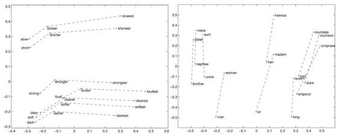
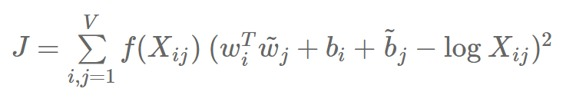
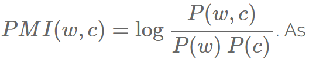
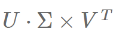
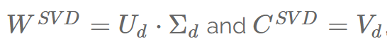
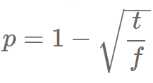

# 技术 | 词嵌入系列博客 Part3：word2vec 的秘密配方

选自 SebastianRuder Blog

**作者：Sebastian Ruder**

**机器之心编译**

**参与：Terrence L**

> *本文是词嵌入系列博客的 Part3，介绍了流行的词嵌入模型全局向量 GloVe。 part2 请点击 [技术 | 词嵌入系列博客 Part2：比较语言建模中近似 softmax 的几种方法](http://mp.weixin.qq.com/s?__biz=MzA3MzI4MjgzMw==&mid=2650720050&idx=2&sn=9fedc937d3128462c478ef7911e77687&chksm=871b034cb06c8a5a8db8a10f708c81025fc62084d871ac5d184bab5098cb64e939c1c23a7369&scene=21#wechat_redirect)；Part1 请点击* *[技术 | 词嵌入系列博客 Part1：基于语言建模的词嵌入模型](http://mp.weixin.qq.com/s?__biz=MzA3MzI4MjgzMw==&mid=2650719971&idx=2&sn=c7e0d1f6dd4e9ddce291e9bc2c85c65f&chksm=871b029db06c8b8b7557095989dd3fdb57b86a1d7923c388ca1e74255d07f08992bb0461d958&scene=21#wechat_redirect)*

** 

*   全局矢量（GloVe）

*   词嵌入量与分布式语义模型

*   模型

*   超参数

*   结果

请原谅之前的噱头。这是一篇我很久之前就想要去写的博客。在这篇文章中，我想要强调那些使得 word2vec 成功的秘密成分。

我特别要专注于通过神经模型训练的词嵌入与通过传统的分布式语义模型（DSMs）产生的词嵌入之间的联系。通过展示这些组分是如何被转移到 DSMs 中的，我将会证明分布式的方法是丝毫不逊色于流行的词嵌入方法的。

虽然没有什么新的见解，但我感觉传统的方法经常被深度学习的热潮所掩盖，它们之间的相关性应该受到更多关注。

因此，这篇博客所依据的文献是 Levy 等人在 2015 年发表的通过词嵌入获得的提升分布式相似性的研究。如果你还没有阅读过，我建议你抓紧搜索。

在这篇公开的博客中，我将首先介绍一个流行的词嵌入模型 GloVe，然后我将突出词嵌入模型和分布式予语义方法之间的联系。

紧接着，我将会介绍用来衡量不同因素影响的四款模型。之后我会给出除了算法选择之外其他学习词表示中额外因素的概述。最终我将呈现 Levy 等人的建议和结论。

**全局矢量（**GloVe**）**

在之前发布的那篇博客中，我们已经对流行的词嵌入模型进行了概述。我们遗漏的一个模型便是 GloVe。

简而言之，GloVe 希望能明确表明 SNGS 的隐式操作：编码含义作为嵌入空间中的向量偏移——看起来只是一个偶然发现的 word2vec 的副产品——才是 GloVe 的特定目标。

具体来说，GloVe 的作者表明两个词同现概率的比值（而不是它们的同现概率本身）是包含信息并计划作为向量差来编码信息。

为了实现这一目标，他们提出了一种加权最小二乘法的物体 J，旨在最小化两个词的向量点积与它们共现次数的对数之间的差异。

当 wi 和 bi 分别作为词语 i 的词向量和偏差，w~j 和 bj 分别作为词语 j 的文本词向量和偏差，Xij 是在词语 j 的文本中出现词语 i 的次数，而 f 是将相对低的权重分配给稀有和频繁共现的加权函数。

共现次数可以被直接编码到词语上下文的共现矩阵中，GloVe 会将这样的矩阵而不是整个语料库作为输入。

如果你想更多地了解 GloVe，最好的参考便是相关的论文或者附属网站

（http://nlp.stanford.edu/projects/glove/）。除此之外，通过 Gensim 的作者，Quora 问答（https://www.quora.com/How-is-GloVe-different-from-word2vec）或是这篇发布的博客

（https://cran.r-project.org/web/packages/text2vec/vignettes/glove.html），你可以对 GloVe 及其与 word2vec 的差异有更多的了解。

**词嵌入与分布式语义模型**

词嵌入模型，尤其是 word2vec 和 GloVe 变得如此流行的原因是它们的表现似乎一直以来都显著优于 DSMs。许多人将此归因于 Word2vec 的神经架构或是它能预测词语这个事实，这看起来要比只靠共现计数有天然的优势。

我们可以将 DSMs 看做计数模型，因为它们通过操作共现矩阵来计算词语的共现次数。相反，神经词嵌入模型可以被看作是一种预测模型，因为它们会去预测周围的词语。

2014 年，Baroni 等人表明预测模型几乎在所有的任务中都优于计数模型，从而为词嵌入模型显而易见的优越性提供了一个清晰的证明。这就是终点了吗？并不是。

我们已经看到和 GloVe 的差异并不是那么明显：当 GloVe 被 Levy 等人认为是一个预测模型时，它显然是正在分解一个词语上下文共现矩阵，这使其更接近于诸如主成分分析（PCA）和潜在语义分析（LSA）等传统的方法。不止如此，Levy 等人还表示 word2vec 隐晦地分解了词语上下文的 PMI 矩阵。

所以，虽然在表面上 DSM 和词嵌入模型使用不同的算法来学习词语表示——前者计数，后者预测——但从根本上来说，两种类型的模型表现了相同的底层数据统计，即词语间的共现次数。

因此，仍然存在同时也是这篇博客剩下的部分想要回答的一个问题是：

为什么词嵌入模型的表现仍然比几乎拥有相同信息的 DSM 更好？

**模型**

继续 Levy 等人 2015 年的成果，我们将分离和鉴定影响神经词嵌入模型的因素并展示它们是如何通过比较以下四个模型来被转移到传统方法中的：

*   PPMI：PMI 是衡量两个词之间相关性强度的一个常用指标。它是两个词 w 和 c 之间联合概率与边际概率乘积之间的对数比：

     PMI(w,c)=logP(w,c)P(w)P(c)。由于词对（w,c）的 PMI(w,c)=log0=−∞从未出现，所以  

     实际上 PMI 经常被 PPMI 替代，其将负值看作是 0，即：PPMI(w,c)=max(PMI(w,c),0)

*   奇异值分解（SVD）：SVD 是最流行的降维方法之一，最初是通过潜在语义分析（LSA）进入自然语言处理（NLP）。SVD 将词文本共现矩阵转化为三阶矩阵  

       的产物，其中 U 和 V 是正交矩阵（即方形矩阵的行和列是正交单位向量），Σ是特征    

       值在减弱过程中的对角矩阵。实际上，SVD 经常被用于因式分解由 PPMI 产生的矩

       阵。一般来说，只有Σ顶端的 d 元素被保存，从而得到：

，

       通常被分别用来表示词语和上下文。

*   基于负采样的 Skip-gram 模型也就是 word2vec：要了解更多 skip-gram 结构和负采样可以参考我之前的博客文章。

*   全局矢量（GloVe）已经在上一节中介绍过。

**超参数**

我们来看看以下这些超参数

*   预处理

*   动态上下文窗口

*   常用词下采样

*   删除罕见词语

*   关联度量

*   转移

*   上下文分布平滑

*   后期处理

*   添加上下文向量

*   特征值加权

*   向量规范化

**预处理**

Word2vec 引入了三种预处理语料库的方法，这三种方法也可以很容易地应用于 DSM。

动态上下文窗口

一般来说，在 DSM 中，上下文窗口并未加权，并且具有恒定大小。然而，SGNS 和 GloVe 使用了一种会将更多权重分配给更接近的词语的方案，因为更接近的词通常被认为对词的意义更重要。此外，在 SGNS 中，窗口大小不是固定的，但实际窗口大小是动态的，并且在训练期间在 1 和最大窗口之间均匀采样。

常用词下采样

SGNS 通过概率：

 

来随机去除频率 f 高于某个阈值 t 的词语，从而获得那些非常频繁出现的词语。由于这种下采样是在实际创建窗口之前完成的，因此 SGNS 在实践中所使用的上下文窗口要大于实际所指示的上下文窗口。

删除罕见词语

在 SGNS 的预处理中，罕见词语也在创建上下文窗口之前被删除，这进一步增加了上下文窗口的实际大小。虽然 Levy 等人在 2015 年发现这并不会对性能产生什么重大的影响。

**关联度量**

PMI 已被证明是用于测量词语之间关联程度的有效方式。Levy 和 Goldberg 在 2014 年已经表示 SGNS 对 PMI 矩阵进行隐含地因式分解，因此可以将该公式的两个变化引入到常规 PMI 中。

PMI 转移

在 SGNS 中，负样本 K 的数量越多，使用的数据就越多，参数的估计也越好。K 影响了有 word2vec 隐性因式分解的 PMI 矩阵偏移，即 k 通过 log k 来转移 PMI 值。

如果我们将其转换为常规 PMI，我们获得 Shifted PPMI（SPPMI）：SPPMI(w,c)=max(PMI(w,c)−logk,0)。

上下文分布平滑

在 SGNS 中，根据平滑的一元分布，即提高到α的幂的一元分布来对负样本进行采样，并根据经验将其设置为 34。这会导致频繁的词语被采样的几率要比它们频率所指示的相对较少。

我们可以通过将上下文词汇 f（c）的频率同等地提高到α的幂来将其传送到 PMI：

PMI（w，c）= log p（w，c）p（w）pα（c）其中 pα（c）= f（c）αΣcf（c）α和 f（x）是字 x 的频率。

**后期处理**

类似于预处理，可以使用三种方法来修改由算法产生的词向量。

添加上下文向量

GloVe 的作者建议添加词嵌入和上下文向量以创建最终输出向量，例如： v⃗cat =w⃗cat +c⃗catv→cat = w→cat + c→cat。这增加了一阶相似性项，即 w⋅v。然而，该方法不能应用于 PMI，因为 PMI 产生的是稀疏向量。

特征值加权

SVD 产生以下矩阵：WSVD = Ud·Σd 和 CSVD = Vd。然而，这些矩阵具有不同的性质：CSVD 是标准正交的，而 WSVD 不是。

相反，SGNS 更对称。因此，我们可以用可调整的附加参数 pp 来对特征值矩阵Σd 加权，以产生以下：

WSVD = Ud·Σpd。

向量规范化

最后，我们还可以将所有向量归一化为单位长度

**结果**

Levy 等人在 2015 年训练了英文维基百科所有转储模型，并基于常用词语的相似性和类比数据集对它们进行了评价。你可以在他们的论文中了解有关实验设置和培训详情的更多信息。我们在下文总结出了最重要的结果和收获。

额外收获

Levy 等人发现 SVD——而不是词嵌入算法的其中一种——在相似性任务上执行得最好，而 SGNS 在类比数据集上执行得最好。他们还阐明了与其他选择相比，超参数的重要性：

1\. 超参数与算法：超参数设置通常比算法选择更重要。没有任意单一的算法能始终胜过其他方法。

2\. 超参数与更多数据：在更大的语料库上训练对某些任务有帮助。在 6 个例子中有 3 个都能说明，调整超参数更有益。

揭露之前的观点

有了这些见解，我们现在可以揭露一些普遍存在的观点：

1.  嵌入式比分布式方法优秀吗？使用正确的超参数，没有一种方法比另一种方法具有持续的优势。

2.  GloVe 是否优于 SGNS？SNGS 在所有任务上都胜过 GloVe。

3.  CBOW 是不是很好的 word2vec 配置？CBOW 在任何任务上都比不上 SGNS。

**建议**

最后——也是这篇文章中我最喜欢的一部分——我们可以给出一些具体的实际建议：

*   不要将迁移的 PPMI 与 SVD 一起使用。

*   不要「正确」使用 SVD，即不使用特征向量加权（与使用 p = 0.5 的特征值加权相比性能下降 15 个点）。

*   请使用具有短上下文（窗口大小为 22）的 PPMI 和 SVD。

*   请使用 SGNS 的许多负样本。

*   对于所有方法，请始终使用上下文分布平滑（将一元分布提高到α= 0.75 的幂）。

*   使用 SGNS 作为基准（训练更加稳健，快速和经济）。

*   请尝试在 SGNS 和 GloVe 中添加上下文向量。

**结论**

这些结果与通常假设的情况背道而驰，即词嵌入优于传统方法，并且表明它通常没有什么区别，无论使用词嵌入还是分布式方法 - 重要的是，你调整超参数并使用适当的预处理和后期处理步骤。

来自 Jurafsky 小组 [5 , 6 ] 的最新论文回应了这些发现，并表明 SVD——而不是 SGNS——通常是当你关心精确词语表达时的首选。

我希望这篇博客对于目前备受关注的，揭示传统分布语义和嵌入模式之间的联系的研究能够有所帮助。正如我们所看到的，分布式语义的知识使得我们可以改进当前的方法并开发现有方法的全新变体。为此，我希望下一次训练词嵌入时，您会将分布式方法纳入考虑范围，或从这些思考中获益。

参考文献： 

Levy, O., Goldberg, Y., & Dagan, I. (2015). Improving Distributional Similarity with Lessons Learned from Word Embeddings. Transactions of the Association for Computational Linguistics, 3, 211–225\. Retrieved from https://tacl2013.cs.columbia.edu/ojs/index.php/tacl/article/view/570 ↩

Pennington, J., Socher, R., & Manning, C. D. (2014). Glove: Global Vectors for Word Representation. Proceedings of the 2014 Conference on Empirical Methods in Natural Language Processing, 1532–1543\. http://doi.org/10.3115/v1/D14-1162 

Baroni, M., Dinu, G., & Kruszewski, G. (2014). Don’t count, predict! A systematic comparison of context-counting vs. context-predicting semantic vectors. ACL, 238–247\. http://doi.org/10.3115/v1/P14-1023 

Levy, O., & Goldberg, Y. (2014). Neural Word Embedding as Implicit Matrix Factorization. Advances in Neural Information Processing Systems (NIPS), 2177–2185\. Retrieved from http://papers.nips.cc/paper/5477-neural-word-embedding-as-implicit-matrix-factorization 

Hamilton, W. L., Clark, K., Leskovec, J., & Jurafsky, D. (2016). Inducing Domain-Specific Sentiment Lexicons from Unlabeled Corpora. Proceedings of the 54th Annual Meeting of the Association for Computational Linguistics. Retrieved from http://arxiv.org/abs/1606.02820 

Hamilton, W. L., Leskovec, J., & Jurafsky, D. (2016). Diachronic Word Embeddings Reveal Statistical Laws of Semantic Change. arXiv Preprint arXiv:1605.09096. 

******©本文由机器之心编译，***转载请联系本公众号获得授权******。***

✄------------------------------------------------

**加入机器之心（全职记者/实习生）：hr@almosthuman.cn**

**投稿或寻求报道：editor@almosthuman.cn**

**广告&商务合作：bd@almosthuman.cn**

