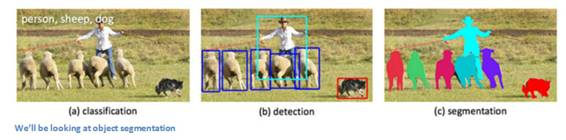
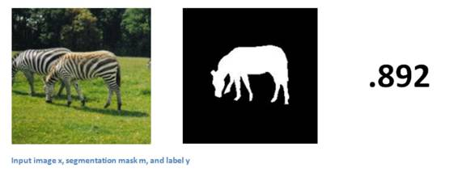
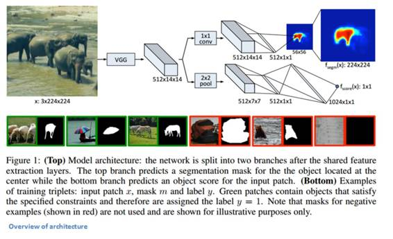
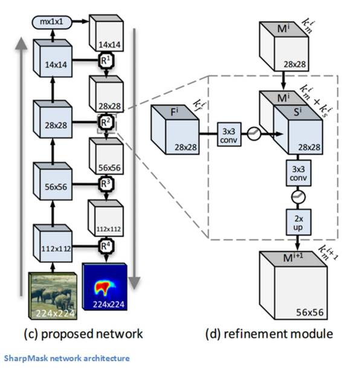
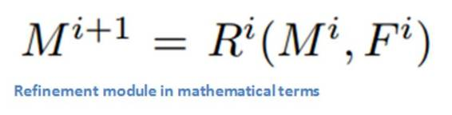
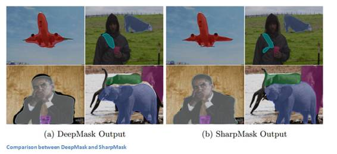
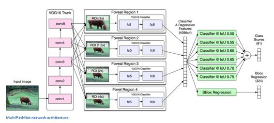

# 深度 | 从分割到识别，全面解析 Facebook 开源的 3 款机器视觉工具（附论文）

选自 adeshpande3.github.io

**作者： Adit Deshpande**

**机器之心编译**

**参与：武竞、Cindy、李亚洲、杜夏德**

> *8 月 26 日，机器之心发布文章[《深度 | Facebook 的图像识别很强大，一次开源了三款机器视觉工具（附论文）》](http://mp.weixin.qq.com/s?__biz=MzA3MzI4MjgzMw==&mid=2650718597&idx=1&sn=56aa4e5deff99620fe6ed42000903849&scene=21#wechat_redirect)介绍 Facebook 在开源上的新动态。在这篇文章中，作者对此次开源的 3 款工具分别进行了深度解析。*

**介绍**

说到分析图象，Facebook 毫无疑问在深度卷积神经网络方面取得了很大成就。一周前，Facebook 人工智能研究团队发表了一个 blog，详细阐述了一些对象分割算法背后的计算机视觉技术。在这篇文章中，我们将会总结并解释 blog 中引用的三篇论文。

Facebook 人工智能研究团队利用的主要渠道如下。图象被输入到 DeepMask 分割构架，被分割的部分通过 SharpMask 模型进行精炼，再通过 MultiPathNet 进行分类。让我们来看看每一个组成部分是怎么单独运行的吧。

**DeepMask**

**简介** 

Pedro Pinheiro, Roman Collobert 与 Piotr Dollar 写了一篇标题为「学习分割候选对象（Learning to Segment Object Candidates）」的论文。作者通过一个模型着手处理对象分割的任务。该模型在给定的一个图像补丁的情况下，首先输出一个分割掩码，然后再输出该图像补丁在完整对象上居中的概率。那个过程被应用在整个图象上以便每一个对象都可以得到一个创造的掩码。而这整个过程仅通过一个 CNN 来完成，因为在该网络中，这两个组件都共享了许多层。

**输入和输出** 

让我们先可视化出我们想让这个模型做什么。给定一个输入图像后，我们希望这个网络可以为每一个对象都输出一组掩码或轮廓。我们可以认为每一个输入图象都包含一组补丁（原图的一小部分）。对于一个输入的补丁而言，输出是一个二进制掩码，它能勾勒出主要对象的形状并对输入补丁有多少可能包括一个对象进行评分（在-1 和 1 之间）。

 

每个训练样本都将要包含这 3 个要素（边注：带有 1 标注的样本需要在给定大小的范围内包含一个在该图像中大致居中的对象）。该模型在多个尺寸刻度和位置上将这个过程应用在图像上（这是一个我们之前讨论过的补丁集）。然后将结果汇总形成一个带有所有掩码的最终图像。现在，让我们看一看这个模型是这么架构起来的。

 

**网络架构**

这个网络是为了 ImageNet（迁移学习。使用它）上的分类而预训练的。图象通过一个含有八个 3x3 的卷积图层和五个 2x2 maxpool 层的类似 VGG 的模型（不含充分连接的层）流入。根据输入图象的尺寸，你将会得到一个确定的输出量（在这个案例中是 512x14x14）。

输入：3 x 高 x 宽

输出：512 x 高/16 x 宽/16

然后，模型分成了之前描述过的 2 个组件。一个主要处理分割，而另一个判定图象中是否有一个对象。

**Segmentation Head** 

现在我们采用输出量，将它穿过一个 network-in-network 层和一个 ReLU 层。然后，我们将会得到一个宽乘高（这个宽和高小于原图的高和宽）像素分类器的层，而这个层将决定已知像素是否是图象中心的对象的一部分（如果你有一个 28x28 大小的原图，那么将会少于 784 个分类器）。然后我们来看看这些分类器的输出，双线性增采样的输出符合完整的原分辨率，取得一个黑白的二进制掩码（1 代表「是」，0 代表「否」）。

**Objectness Head** 

另一个网络组件决定了图象是否包含居中并且比例适中的对象。将 VGG 图层的输出穿过一个 2x2 的 maxpool（一个 dropout 单元）和两个充分相连接的网络层，我们就可以得到「objectness」的得分。

**训练** 

由于损失函数是逻辑回归损失的总和（一个是 objectness head 的损失，一个是 segmentation head 中每个位置的损失），网络的两个组件是同时训练的。反向传播在 segmentation head 和 objectness head 之间交替进行。数据增加技术也被用来改善这个模型。这个模型采用随机梯度下降法在 Nvidia Tesla K40m GPU 上训练了将进 5 天。

**为什么这篇论文很酷**

 **一个单独的卷积神经网络。我们不需要一个额外的图片目标提议步骤或一些复杂的训练渠道。很明确的是，这个模型提高了网络的效率、速度和灵活性。

**SharpMask**

前面的作者（与 Tsung-Yi Lin 合作）也发表了一篇标题为「学习提炼对象分割块（Learning to Refine Object Segments）」的论文。正如标题所示，这篇论文的主旨是提炼 DeepMask 模型生成的分割掩码。DeepMask 的主要问题在于，它使用了一个简单的前馈网络，它在生成「粗糙对象掩码」时是很成功的，却并不能生成「精确到像素的分割」。原因是，这里运用了全图像大小的二元线性采样。这就导致了对象边界的粗糙和不精确对齐。为了解决这个问题，SharpMask 模型把网络中的浅层（early layers）的低级（low-level）特征与深层（layers deeper）的高级（high-level）的对象信息结合起来。这个模型通过首先对每一个输入部分生成一个粗糙掩码，然后将它传入网络中的不同提炼模型来实现这点。现在我们来介绍细节。

**网络的构架 **

SharpMask 模型构架的动机源于高级（high-level）的对象信息对精确的分割掩码十分有用，我们需要一个自上而下的方法：第一步生成粗糙的边界，然后整合浅层（early layers）中重要的低级（low-level）信息。正如你从上图中看到的，原始输入最先传入 DeepMask 通道来得到粗略的分割。然后它通过一系列精炼模型，增采样进而还原图像的原始维度。

**精炼模型**

让我们深入挖掘下该精炼模块的特性。该模块的目标通过增采样将自下而上（你可以认为 DeepMas=bottom-up 和精炼模块=top-down）创造的特征图考虑在内的方式生成的掩码，对抗 DeepMask 通道中池化层的影响。看待它的一种数学方式是精炼模块 R 是一个生成增采样的掩码 M 的函数，掩码 M 是前面层中掩码的函数，也是特征图 F 的函数。使用的精炼模块的数量等于 DeepMask 通道中使用的池化层的数量。

 

现在，函数 R 中到底发生了什么？一个简单方法是只要连接（concatenate) M 和 F，因为它们有同样的宽和高。问题存在于这些每个组件的深度信道中。特征图中深度信道的数量要比掩码的深度信道数量大的多。因此，M 和 F 的连接将过于偏向 F。解决方案是通过应用一个 3×3 卷积层减少 F 深度信道的数量，然后再连接 M，通过另一个 3 ×3 卷积层，最终使用一个双线性增采样。

**训练**

DeepMask 使用的训练数据同样适用于 SharpMask。我们需要输入二进制掩码补丁和标签。DeepMask 层先被训练，然后在精炼模块开始训练的时候，权重会被冻结。

**为什么这篇论文很酷**

在引入一个新的、易于使用的模块的同时，该论文也能够建立在 DeepMask 的方法之上。作者们创造性的认识到通过只融合在 DeepMask 通道的较早层中可用的低层信息，就能获得更精确的分割。

 

**MultiPathNet**

**简介**

DeepMask 用来生成粗糙的分割掩码，SharpMask 用来精炼这些轮廓。而 MultiPathNet 的职责是在这些掩码中进行对象识别或者分类。包括 Sergey Zagoruyko、Adam Lerer、Tsung-Yi Lin、Pedro Pinheiro、Sam Gross、Soumith Chintala、Piotr Dollar 在内的几个人发表了一篇名为「A MultiPath Network for Object Detection」的论文。这篇文章的目的，是通过专注处理尺度变化、高度遮挡、杂乱的图片，以及更高的精度定位，来提高对对象的检测技术。这个模型是以快速 R-CNN（Fast R-CNN）为起点的。总的来讲，这个模型应用了快速 R-CNN 以及 DeepMask 和 SharpMask 的对象检测技术。这篇论文的三个主要贡献之处是：忽略连接（skip connections）、黄斑区域（foveal regions）和一个积分损失函数（integral loss function）。在详细介绍这三个方法之前，我们先来看看这个网络的架构。

 

**网络架构 / 黄斑区域 **

使用快速 R-CNN 时，我们首先将输入图像传入一个层与层之间没有完全连接的 VGG 网络。POI 池化（ROI pooling）被用于提取区域的特征（在 Ross Girshick 的论文中，ROI 池化是一个将图像的特征映射（mapping）到描述图像区域的固定空间的特征图（feature map）的方法）。对于每一个对象，我们接着创建四个不同的区域来从多个角度观察对象。这些区域就是我们在简介中介绍的「黄斑区域」。这些区域被传入完全连接的层中，得到的输出被连接起来，然后网络分成一个分类器和一个回归头文件。基于这个网络架构可以从多个尺度观察图像，并可以注意到目标对象周围的事物，这篇论文的作者推测这些黄斑区域可以帮助精确定位。

**忽略连接 **

由于快速 R-CNN 的架构问题，一张 32x32 大小的输入图像会在最后的 VGG 卷积层迅速缩减到 2x2 的大小。ROI 池化会创建一个 7x7 的映射，但是我们仍然丢失了很多原始空间信息。为了解决这个问题，我们将特征从卷积 3、4、5 层就开始连接，然后把它们传入黄斑分类器（foveal classifier）。这篇论文指出，这些连接「给分类器提供了多种位置的特征信息」。

**积分损失函数 **

我并不想对这个概念深入介绍，在纸上演算数学公式无疑更简明易懂。这个概念的大致意思是，作者发明了一个损失函数，使得在预测有多个交除并（intersection-over-union, IoU）值的图像时有更好的表现。

**为什么这篇论文很酷 **

如果你对快速 R-CNN 感兴趣，那么你一定喜欢这个模型。它运用了 VGG 网络（VGG Net）和 ROI 池化（ROI pooling）的主要思想，同时还介绍了一种通过黄斑区域（foveal regions）、忽略连接（skip connections）和积分损失函数（integral loss function）得到更精确的定位和分类的方法。

******©本文由机器之心编译，***转载请联系本公众号获得授权******。***

✄------------------------------------------------

**加入机器之心（全职记者/实习生）：hr@almosthuman.cn**

**投稿或寻求报道：editor@almosthuman.cn**

**广告&商务合作：bd@almosthuman.cn**

**点击「阅读原文」，下载论文↓↓↓****