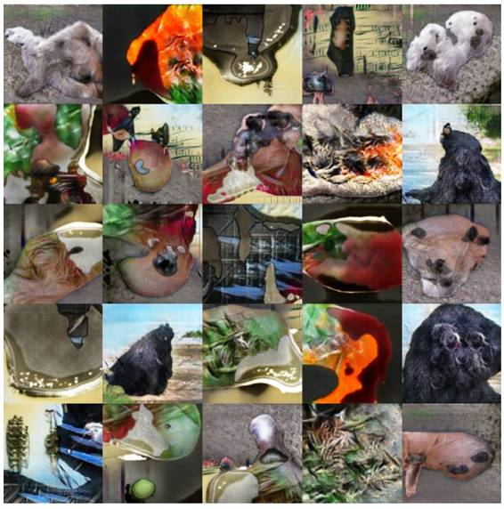

# 深度 | 从硬件到软件：OpenAI 解读自家的深度学习基础架构

选自 OpenAI

**作者：VICKI CHEUNG, JONAS SCHNEIDER,** **ILYA SUTSKEVER, AND GREG BROCKMAN**

**机器之心编译**

**参与：孙宇辰、吴攀**

> *深度学习是一门经验科学，群组基础架构的质量不断地改善。幸运的是，如今的开源生态环境让任何人都可以搭建很出色的深度学习基础架构。*

在这篇文章中，我们将要分享深度学习的研究通常是如何进行的，我们如何选择适当的架构辅助研究以及一个为 Kubernetes 的批优化过的扩展管理器（ batch-optimized scaling manager）开源项目「kubernetes-ec2-autoscaler」。我们希望这篇文章能对你在搭建你自己深度学习基础架构时有所帮助。

**用例**

一个典型的深度学习进展通常从有一个想法，在小问题上进行测试开始。在这个阶段，你想非常快地运行许多 ad-hoc 实验。理想情况是，你通过 SSH 接入机器，在屏幕上运行一个脚本，然后在不到一小时的时间内得到一个结果。

想让一个模型确实可以工作，通常需要观察它在各种可以想象到的方式失败，然后找到某种方式修复这些限制。（这和你搭建一个新的软件系统类似，你需要运行你的代码很多次才能建立对其工作方式的直觉。）

  *你需要从许多角度检查你的模型，从而对它们实际所学习的内容有一种直觉上的认识。Dario Amodei 运用强化学习的代理（agent）（控制右侧的球拍）在 Pong 这个游戏上获得很高的分数，但是当你看它玩的时候，你会认为它就坐在某个地方进行游戏。所以深度学习的基础架构必须允许使用者灵活地检视模型，仅仅显示汇总统计是不够的。*

当模型表现出足够的成效时，你就可以将其扩展到更大的数据集以及更多的 GPU 上。这是一个很耗时的工作，需要用掉许多计算周期并且持续很多天。你需要注意你的实验管理工作，并且对你选择的超参数范围进行认真思考。

早期的研究工作是非结构化的、急促的，而现在是有条理的，还伴随着些许痛苦，但是为了得到一个良好的结果这绝对是必须的。

**一个例子**

论文《Improved Techniques for Training GANs（改进过的训练 GAN 的技术）》开始于 Tim Salimans 构想出的一些用于改进生成对抗网络（Generative Adversarial Network）训练的想法。我们将描述这些想法中最简单的一些（这也碰巧是其中能生成最好看的样本的那些，尽管并不是最好的半监督学习）。

GAN 由一个生成器（generator）网络和一个鉴别器（discriminator）网络构成。其中生成器会尽力欺骗鉴别器，而鉴别器则会尽力分辨出生成的数据和真实数据。

直觉上看，一个能够欺骗每一个鉴别器的生成器是相当好的。但总是存在一个难以修复的故障模式：生成器可以通过一直输出完全一样（很可能非常逼真！）的样本使网络「崩溃」。

*我们的模型学习生成 ImageNet 图像*

有了更大的模型和数据集，Ian 还需要将该模型并行化到多个 GPU 上。即使每一项工作都让多台机器上的 CPU 和 GPU 的使用率达到了 90%，但即便如此，该模型的训练还是花费了许多天的时间。在这种情况下，每一次实验都变得非常宝贵，他也会一丝不苟地记录每一次的实验结果。

最后，尽管结果很不错，但仍然没有我们希望的那么好。为了找到原因，我们已经测试了很多假设，但仍然还没有解决它。这就是科学的本质。

**基础架构**

**软件**

 

*我们的 TensorFlow 代码中的一节*

我们的研究的绝大多数代码都是用 Python 写的，可参见我们的开源项目：https://github.com/openai/imitation 、https://github.com/openai/improved-gan 、 https://github.com/openai/iaf 、https://github.com/openai/vime 。在 GPU 计算上，我们大部分使用的是 TensorFlow（一些特殊案例使用了 Theano）；在 CPU 上我们也使用了这些或 Numpy。研究者有时候还在 TensorFlow 之上使用了 Keras 这样的更上层的框架。

和大部分深度学习社区一样，我们使用的是 Python 2.7。我们通常使用 Anaconda，它有一些方便的软件包；其它情况我们还使用了一些困难的软件包，比如 OpenCV 和针对一些科研方面的库的性能优化：https://docs.continuum.io/anaconda/#high-performance

**硬件**

对于一个完美的 batch 工作，让你的集群中的节点的数量加倍可以让运行时间减半。不幸的是，在深度学习中，人们常常会看到一些来自许多 GPU 的非常次线性（sublinear）的加速。因此顶级的性能需要顶级的 GPU。我们也在模拟器、强化学习环境或小型模型（在 GPU 上运行不会更快）上使用了相当多的 CPU。

 

*nvidia-smi 查看完全负载的 Titan X*

AWS 慷慨地同意向我们捐赠大量的计算。我们现在已在使用它们计算 CPU 实例和水平扩展 GPU 的工作。我们也运行着我们自己的物理服务器——基本上是运行在 Titan X GPU 上。我们预计会有一个用于长期作战的混合云：在不同的 GPU、互连（interconnect）和其它可能会在深度学习的未来变得重要的技术上进行实验是很有价值的。

 

*同样物理基础的 htop（http://hisham.hm/htop/）表现出了大量空余的 CPU。我们通常将我们 CPU 密集型负载和 GPU 密集型负载分开运行。*

**配置**

我们的基础架构方法就和许多公司对待产品一样：它必须有一个简单的界面，而且易用性和功能一样重要。我们使用一套统一的工具来管理我们所有的服务器，并将它们尽可能配置得完全一样。

 

*我们用来管理 Auto Scaling 组的 Terraform 配置的一个片段。Terraform 可以创造、修改或破坏你的运行云资源以匹配你的配置文件。*

我们使用 Terraform 来设置我们的 AWS 云资源（如，网络路由、DNS 记录等）。我们的云和物理节点使用的是 Ubuntu，并配置了 Chef。为了更快的 spinup times，我们使用 Packer 预焙（pre-bake）了我们的集群 AMI。我们所有的集群都使用了互不重叠的 IP 地址范围，并且通过用户笔记本电脑上的 OpenVPN 和物理节点上的 strongSwan（作用类似 AWS Customer Gateways）与公共互联网进行了互连。

我们将人们的主目录、数据集和结果存储在 NFS（物理硬件）和 EFS/S3（AWS）上。

**编排**

可扩展的基础设施往往最后会使简单的情况变得更困难。我们在用于小型和大型工作中的基础设施上投入了同等的努力，而且我们正在积极地充实我们的用于将分布式用例变得本地可访问的工具包。

我们提供了一个用于 ad-hoc 实验的 SSH 节点集群，并使用了 Kubernetes 作为我们的物理和 AWS 节点的集群调度器。我们的集群横跨 3 个 AWS 区域（regions）——我们的工作是很有突发性的，我们将在某个时候达到单个区域的能力。

Kubernetes 要求每项工作都是一个 Docker 容器（container），这给我们带来了依赖隔离（dependency isolation）和代码快照（code snapshotting）。但是，构建一个新的 Docker 容器会给研究者宝贵的迭代周期增加额外的几秒钟时间，所以我们也提供了可以帮助研究者将笔记本中的代码透明地转换成标准图像的工具。

 

*TensorBoard 中的模型学习曲线*

我们直接向研究者的笔记本电脑公开了 Kubernetes 的 flannel network，让研究者可以无缝网络接入他们的运行中的工作。这对于获取 TensorBoard 这样的监控服务尤其有用。（我们最初的方法——从严格的隔离角度来看更清洁——需要人们为每个他们想要公开的端口创建 Kubernetes Service，但我们发现这会带来太多的麻烦。）

**kubernetes-ec2-autoscaler**

我们的工作具有突发性与不可预测性：研究的线路可能很快地从单机实验到需要 1000 个核。例如在几周内，我们的一个实验就从处于在一台 Titan X 上运作的阶段，到了在 60 台 Titan X、需要 1600 块 AWS GPU 上进行实验的阶段。因此我们的云架构需要动态提供 Kubernetes 的节点。

在一个 Auto Scaling 组中运行 Kubernetes 节点是很容易的，但是很难正确管理这些组的大小。在提交一个批任务之后，所在集群（cluster）知道自己需要什么资源，应该直接分配这些资源。（相反的，AWS 的 Scaling Policies（扩展策略）则需要多次迭代，一点点释放新的节点，直到资源不再紧张。）此外，在终止它们以避免丢失正在运行的任务之前，集群还需要消耗节点。

仅使用 raw EC2 来完成大批量的任务是具有吸引力的，这也是我们开始的地方。然而，Kubernetes 生态环境增加了很多内容：低摩擦工具（low-friction tooling）、记录日志、监控、独立于运行实例管理物理节点的能力等等。让 Kubernetes 正确地自动扩展要比在 raw EC2 上重建这个生态系统更加简单。

我们正在发布 kubernetes-ec2-autoscaler （https://github.com/openai/kubernetes-ec2-autoscaler），这是一个 Kubernetes 的批优化过的扩展管理器（batch-optimized scaling manager ）。它作为一个普通的 Pod 运行在 Kubernetes 上，仅仅需要的是你的节点在  Auto Scaling 组中。

 *Kubernetes 集群的启动配置*

自动扩展器（autoscaler）是通过对 Kubernetes master 的状态进行查询的方式工作的，其中包括计算集群资源的询问与容量所需的一切。如果超出容量限制，它将耗尽相应的节点，最终停止它们。如果需要更多的资源，它会计算哪些服务器要被创建，并适当地增加你的 Auto Scaling 组的大小（或就简单地使用 uncordons drained 节点，这可以避免新的 spinup time）。

kubernetes-ec2-autoscaler 可以处理多种 Auto Scaling 组、CPU 之外的资源（内存和 GPU）以及在 AWS 区域以及实例的大小等细节上约束你的任务 。另外，突发的工作负载可以导致 Auto Scaling 组超时、出错，这是因为即使 AWS 也没有无限的容量。在这些情况下，kubernetes-ec2-autoscaler 会检测错误，并将超出部分转移到下一级的 AWS 区域。

***©本文由机器之心编译，***转载请联系本公众号获得授权***。***

✄------------------------------------------------

**加入机器之心（全职记者/实习生）：hr@almosthuman.cn**

**投稿或寻求报道：editor@almosthuman.cn**

**广告&商务合作：bd@almosthuman.cn**