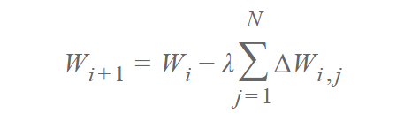

# 深度 | 分布式深度学习：神经网络的分布式训练

选自 skymind

**作者：Alex Black 、Vyacheslav Kokorin**

**机器之心编译**

**参与：Xuwen Wang、Xavier Massa、吴攀、李亚洲**

> *本文编译自 Skymind 的技术博客，作者是深度学习工程师 Alex Black 和 Vyacheslav Kokorin。按照计划，《Distributed Deep Learning》系列文章一共有三篇，本文是其中的第一篇，后续的文章机器之心还将继续跟进。*

这是关于「神经网络的分布训练」的三篇系列文章中的第一部分。

在第一部分，我们将看到如何在 GPU 上用分布式计算大大加速深度学习模型的训练速度，并讨论近期该领域上的一些挑战和近期的研究。同时，我们还要考虑：在什么时候，神经网络的分布式训练是适合或不适合特定的案例的？

在第二部分，我们将上手式地看看在 Apache Spark 上的 Deeplearning4j 的网络训练的实现，并从头到尾展示一个「如何在实践中执行训练」的例子。

最后，在第三部分我们将探索 Deeplearning4j 的 Spark 实现的背后情况，并讨论使用 Apache Spark 时的一些涉及到最大化训练表现的执行和设计挑战。同时，我们还将看看 Spark 如何与本地的高性能的计算库和 Deeplearning4j 所使用的堆外内存（off-heap memory）管理互相配合。

**介绍**

在大型数据集上进行训练的现代神经网络架构可以跨广泛的多种领域获取可观的结果，领域涵盖从语音和图像认知、自然语言处理、到业界关注的诸如欺诈检测和推荐系统这样的应用等各个方面。但是训练这些神经网络模型在计算上有严格要求。尽管近些年来 GPU 硬件、网络架构和训练方法上均取得了重大的进步，但事实是在单一机器上，网络训练所需要的时间仍然长得不切实际。幸运的是，我们不仅限于单个机器：大量工作和研究已经使有效的神经网络分布式训练成为了可能。

 我们将从并行式/分布式的训练计算这两种方法开始说起。

在模型并行（model parallelism）中，在分布式系统中的不同机器分别负责在单个网络的不同部分计算——例如每层神经网络可能会被分配到不同的机器。

在数据并行（data parallelism）中，不同的机器有着整个模型的完全拷贝；每个机器只获得整个数据的不同部分。计算的结果通过某些方法结合起来。

当然，这些方法并不是互相排斥的。想象一个多 GPU 系统的集群，我们可以对每个机器使用模型并行（将模型分拆到各个 GPU 中），并在机器间进行数据并行。

 

尽管在实践中模型并行可以取得良好的效果，但数据并行毫无争议是分布式系统中最适的方法，而且也一直是更多研究的焦点。首先，实现性、容错性和好的集群利用率让数据并行比模型并行更加简单。在分布式系统的情况下模型并行是让人感兴趣且的确有一些优点的（诸如对于大模型的可扩展性）。但这里我们将主要目光放在数据并行上。

**数据并行（Data Parallelism）**

分布式训练中的数据并行方法在每一个 worker machine 上都有一套完整的模型，但分别对训练数据集的不同子集进行处理。数据并行训练方法均需要一些整合结果和在各工作器（worker）间同步模型参数的方法。在文中我们将讨论一些不同的方法，而这些方法间的基本差异在于：

*   参数平均 vs. 基于更新（梯度）的方法

*   同步 v s. 异步的方法

*   集中式 vs. 分布式的同步

Deeplearning4j 最近在 Spark 上的实现是同步的参数平均，其中 Spark 驱动器和规约操作（Spark driver and reduction operations）取代了参数服务器。

**参数平均（Parameter Averaging）**

参数平均化是概念上最为简单的数据并行方法。使用参数平均时，训练按照如下方式执行：

1\. 根据模型配置随机初始化网络参数

2\. 将现有的参数的一个副本分配给每一个 worker machine

3\. 在该数据的一个子集上对每一个 worker 进行训练

4\. 从每一个 worker 的平均参数上设立一个全局参数

5\. 当还需要处理更多数据时，回到第 2 步

第 2 步到第 4 步的过程如下图所示。在这个图表中，W 表示神经网络中的参数（权重，偏置）。下标用作指出参数的版本，以及每个 worker machine 有需求的位置。

事实上，要证明一个参数平均化的受限版本与单个机器上的训练在数学上是完全相同的是十分简单的；这些限制是每个 minibatch 之后的参数平均，没有更新器（updater）（如没有动量等——只是通过学习率加倍），而且每个 worker 会处理同样数量的样本。对于数学爱好者，证明如下。

假设有一个含有 n 个 worker 的集群，其中每个 worker 有 m 个样本，总的在平均化中就有 nm 个样本。如果我们将所有 nm 个样本在同一机器上以学习率α进行处理，那么我们的权重更新规律满足如下：

 

现在，如果我们换做将 m 个样本分配到 n 个 worker 上执行学习（worker 1 拿到样本 1 到 m，worker 2 拿到样本 m+1 到 2m，以此类推），那么就有：

 

当然，这个结果并不能付诸实践（平均化每个 minibatch 和不使用诸如动量或者 RMSProp 这样的 updater 都是欠妥的。因为执行和收敛是分开说明的）。但这提供了第一感觉去思考：为什么参数平均可以有好的效果，特别是当参数频繁平均的时候？

现在，参数平均化在概念上已经十分简单，但我们也略过了一些复杂的地方。

首先，我们如何执行平均化呢？最为简单的方式是在每次迭代后简单均值化参数。尽管这种方法有效，但我们会发现这样做的成本会特别高。网络通信和同步成本会超过我们从额外的机器中所获得好处。因而，参数平均化的实现通常有多于 1 个的平均化周期（veraging period，就每个 worker 的 minibatch 数量而言）逐渐执行。然而，如果我们平均化的频率过低，每个 worker 中的本地参数之间的区别会过大，导致平均化后的模型较差。这里的直观知识是：N 个不同局部极小值的均值不能保证是一个局部极小值

 

是什么导致了平均化周期那么长？这个问题暂时还不能得到决定性的回答。且由于与其他超参数（如学习率、minibatch 大小和 worker 数量）的相互影响，情况变得更为复杂。一些该课题上的初步研究（如[8]）表明：每 10-20 个 minibatch（每个 worker）排序的平均化周期仍然可以很好的执行。不过模型精确性当然会随着平均化周期的增加而降低。

与最优化方法相关的附加难题，例如 adagrad，动量和 RMSProp。这些优化方法（在 Deeplearning4j 又称作更新器（updater））已被证明能在神经网络训练的过程中极大地提升收敛性能。然而，这些更新器也有内部状态（通常一个网络参数中有 1-2 个状态值）。我们应该也将这些状态算入均值吗？将这些内部更新器状态平均会造成每个 worker 的更快速的收敛，但代价是比原来总量多 2 倍或者更多的网络传输。有些研究工作也在试图在参数服务器层面上应用相似的「更新器」机制，而不只是在每一个 worker 上应用。

**异步随机梯度下降**

还有一个概念上同参数平均化相似的方法是：「基于更新的」数据并行化（‘update based’ data parallelism）。两者的基本区别在于：我们不会将参数从 worker 传递给参数服务器，而是传递更新（例如：梯度柱型的学习率和动量（gradients post learning rate and momentum））。这就得到了这样形式的更新：

 

其中λ是比例因子（可类比于学习率超参数）

结构上，该方法和参数平均化相似： 

 

对于训练神经网络中数学熟悉的读者可能会注意到：在参数平均化和基于更新的方法之间有直接的相似之处。如果我们再次定义损失函数为 L，参数向量 W 能以 i+1 的迭代以学习率 α 进行简单 SGD 训练而得到：

其中

 

具有 n 个参数

现在，如果我们采取上述的权重更新规则，对于 n 个执行器让 λ=1/n，同时再次强调（仅使用学习率为 α 的 SGD），其更新是：ΔWi,j=α∇Lj ，那么：

 

结果，在参数平均化和基于更新的数据并行间有一个等式，当参数同步更新时（最后一部分是关键），这个等式也适用于多个平均化步骤以及其他更新器（不仅仅是简单的 SGD）。

当我们放松同步更新的要求时，基于更新的数据并行变得越来越有趣（毫无疑问它更有用）。即在更新∆Wi,j 被计算的时候就应用于参数向量（而不是等待所有 worker 的 N ≥ 1 次迭代）。我们获得了异步随机梯度下降算法（async SGD）。async SGD 有两个主要优点：

*   首先，我们有潜在可能在整个分布式系统中获得更高的通量：worker 可以将更多时间花在执行有用的计算而不是等待参数平均化步骤完成。

*   其次，worker 有可能可以集成来自其它 worker 的信息（参数更新），这比使用同步（每 N 个步骤）更新更快。

这些优点也不是毫无代价的。通过在参数向量中引入异步更新，我们也引入了一个新问题，也就是过期梯度问题（stale gradient problem）。过期梯度问题很简单：梯度（更新）的计算需要时间，在一个 worker 完成这些计算并将结果应用于全局参数向量前，这些参数可能已经更新过许多次了。这个问题以下图展现。

 

一个异步 SGD 的朴素实现会造成梯度的过期值（staleness value）很高。例如，Gupta et al. 2015 [3]表明平均梯度的过期值与执行器的数目相等。若有 N 个执行器，那么就意味着这些梯度在应用到全局参数向量时会晚 N 个步骤。这在现实世界造成的影响是：高梯度过期值会极大减缓网络收敛，甚至完全阻止一些配置的收敛。早期的异步 SGD 实现（例如谷歌的 DistBelief 系统[2]）没有考虑到这个影响，因而导致学习效率很低。

多数的异步随机梯度下降的变体都保持着相同的基本方法，但采取一些不同的策略来最小化过期梯度所造成的影响，同时试图保持高的集群利用率。应该注意的是参数平均化并不是由于算法的同步性本身而受到过期梯度问题的影响。

一些处理处理过期梯度的方法包括：

*   根据梯度值的延迟度，对于每一个更新的 ∆Wi,j，独立缩放每一个λ值。

*   实施「软」同步规则 ( [9] )。

*   利用同步去限制延迟度。例如，在 [4] 中所示的系统中，它会在有必要的情况下对较快的学习器进行延迟，以确保整体最大的延迟度小于一个阀值。

这些方法已被证实，能够改善朴素异步 SGD 算法的收敛情况。其中，最值得注意的是前两个方法：基于延迟度来缩放更新（延时梯度对参数向量影响较小）以及「软」同步法。「软」同步法 [9] 是一个相当简单的方法——它不立即更新全局参数向量，而是会等待以从 n 个学习器中收集 s 个 ∆Wj 更新（s 是一常数，1 ≤ s ≤ n）。参数的更新规则如：

其中λ(ΔWj)是一个基于延迟度的缩放因子，是一个标量。[9] 提出了 

其中 τ 是一个基于延迟度的整数，满足 τ≥1。同时还有其他方法（见 [6] 中的例子）。若将软同步法和基于延迟的缩放法结合，则其表现会好于两者单独的表现。

注意，若给定 s = 1 以及 λ(·) 为宜常数，我们得到朴素异步 SGD 算法 [2]；相似地，若给定 s=n，我们则会得到另外一个与同步参数平均算法相似但不相同的算法。

**分布式异步梯度下降法**

[7] 提出了另一种更为有趣的备选架构，以执行神经网络的分布式训练。我将这个方法称作分布式异步梯度下降法（尽管作者并未使用该术语）。这篇论文在以下两大方面很有趣：

1\. 在该模型中，没有中心的参数服务器——取而代之的，是点对点的参数传输以对于学习器之间进行更新。

2\. 更新被极大地压缩了——以至于网络的通信尺度减小了三个数量级。

 

在一个标准的数据并行执行（使用参数平均或异步 SGD）中，神经网络的转存尺寸与参数向量尺寸大小相同（因为我们要不然传输参数向量的复本，要不然每个参数传输一个梯度值）。尽管压缩参数或更新的想法并非完全新颖，但该方法以一种优于传统的机制（例如应用一个压缩编码或转为 16 浮点表示）实现了压缩。

 这个架构设计的优势在于，更新的向量 δi,j 有以下性质：

1\. 稀疏性：在每个向量 δi,j 中，只有部分的梯度值是相互关联的（也就是其余的值是被设为 0 的）——稀疏项使用整数进行索引。

2\. 量化为一个位：稀疏更新向量每一个分量的值取 +τ 或 −τ。这个 τ 值对向量中的所有分量都相同，因此仅需要一个位就可以区别两个选项。

3\. 整数索引（即 1 中所提到的用来索引稀疏矩阵）部分地被使用熵编码，以进一步缩减更新的大小（作者给出了在额外计算的情况下有额外三倍的缩减，尽管该处获益可能不值得额外的计算）。

此外，考虑到该压缩方法是有损的，因而原更新向量 ΔWi,j 与压缩／量化更新的向量 δi,jδi,j 的差将不被简单地忽略，而是被储存在一个残差向量 rj 中（ j 代表每次执行）。而残差向量将被加到原来的更新上，也就是说，每一步我们量化并传输一个经过压缩的 ΔWi,j+rj 并更新合适的 rj。由此，原始的更新向量 ΔWi,j 中的信息被完整的传输了并没有损失。换句话说，（每个参数的）大更新都将被以比小更新更高的速度动态传输。

由此产生了两个问题：一个是，这种方法能多大程度上压缩神经网络的参数？另一个是，这种方式的精度如何？答案出乎你意料：它能超出你预料地压缩，但精度略低于你预期。

如这个在 strom 论文中呈现的例子：一个有约 1460 万个参数的模型，经过不同程度压缩后的情况：

 

更大的 τ 值，将会带来更大的压缩率。例如， 当 τ= 15 时，对每个数据包，其更新大小仅有 4.5KB！但相应的，模型准确率也会因此而下降。

尽管结论很惊人，但该方法也有如下的问题：

1\. Strom 在论文中写道，收敛情况在训练之初可能出现问题。但使用更少的训练节点和使用一部分案例好像可以帮助解决该问题。

2\. 压缩和量化过程需要消耗时间：在对每个数据包处理的过程中，这些过程导致了额外的计算与储存。

3\. 这一过程引入了需要考的额外的超参数：如何设定 τ值？需要在更新数据的时候使用熵编码吗？（尽管参数平均法和异步 SGD 都引入了额外的超参数。）

最后，就笔者所知，暂时还没有异步 SGD 和分布式异步 SGD 的实验比较。

**分布式神经网络训练：哪种方法最好？**

我们已经看到，有多种方法来训练分布式神经网络，其中每个类型也有不少变体。因此，我们应该在实践中应该使用哪一个？不幸的是，我们没有一个很明确的答案。但我们可以给出如下的评判标准，来确定不同方法中最好的那个：

*   最快的训练速度（每秒最多或最少可以训练多少个例子）

*   在无限样例下可达到的最大精度

*   在有限时间下可达到的最大精度

*   在有限样例下可达到的最大精度

*   最大可达到的准确度对历元的给定数量的

另外，这些问题的答案将可能取决于许多因素，如神经网络的大小和类型、集群的硬件性能，使用特征（如压缩），以及训练方式的具体实施方法和配置。

也就是说，我们能从该研究中总结出如下内容：

同步参数平均法（或等价说，基于同步的更新）在每一次遍历中的与整体的准确率方面，特别是对很小的平均周期，表现更好。参见 [9] 中所示的」硬同步」结果，或在 N＝1 的平均周期下同步平均法在单机训练上的表现。但是，额外的同步花费意味着这个方法在每次迭代中需要花费更多的时间。也就是说，如 InfiniBand 的更快的神经网络连接还需要花费很多精力，以使该同步方法具有竞争力（详见 [5]）。但是，甚至在商业硬件上，我们也能见到基于 DL4J 的同步参数的，很好集群利用。增加压缩步骤，应该会进一步减少网络通讯的花费。

也许参数平均（和一般的同步方法）最大的问题，就是所谓的「最慢执行」效应：即同步系统在完成每次迭代之前，需要等待最慢的执行者。因此，当工作机数量增加时，同步系统的表现不会更好。

在实践中已证明，只要梯度延时被适当处理，异步 SGD 将是一个很好的训练方案。另外一些方法（如前面所述」软同步」的方法），根据其所使用的超参数的不同，可被视为朴素异步 SGD 和同步执行之间的桥梁。

基于集中参数的异步 SGD 实现，可能会引入通信瓶颈（相比之下，同步方法可以利用剪枝或类似算法，能一定程度上避免这方面的沟问题）。将全部的参数分为 N 等份，使用 N 个参数服务器处理每一份数据，从概念上说，这是一个更为直接的解决该问题的方法。

最终，分布式异步 SGD 是一个很有前景的想法，尽管这还需要很多研究才能让我们不容置疑地推荐它，而非」标准」的异步 SGD。此外，许多在 [7] 中所示的想法（如压缩、量化等）可以被用于异步 SGD 中，以优化传统的参数服务器的设置。

**该何时使用分布式深度学习**

对每种使用情况，分布式深度学习往往不都是最好的选择。

分布式学习并非廉价——与在单独的机器上相比，因为诸如同步、数据与参数的网络传输等问题，分布式系统往往有一个日常开销。要使分布式训练变得值得，我们需要利用好分布式系统的计算优势来抵消这笔开销。此外，在分布式训练上，设定（包括准备与载入训练数据）及调参都将会变得更为复杂。因此，我们的建议简单明了：在训练时间可以接受的情况下，都（不使用分布式训练而）在单机上训练神经网络。

神经网络的训练时间因为这两种原因而变得很长：网络的大小非常之大（每次迭代都很费时）及数据量非常之多。通常来说，这两种情况将同时出现——因为「大网络、少数据」或「小网络、大数据」的情况往往导致欠拟合或过拟合，不能有很好的泛化效果。

在某些情况下，多 GPU 系统应该首先被考虑（如 Deeplearning4j 的 Parallel-Wrapper 系统可以让神经网络在单机上轻松进行同步训练）。基于多 GPU 系统对模型进行同步运算对大型网络也是可行的。

另外一个要考虑的方面是，网络传输（耗时）与计算（耗时）之比。分布式训练在网络传输（耗时）与计算（耗时）之比较低时，会比较高效。因为每层的计算量很少，小的、层数少的网络并不适用于分布训练。有参数共享的网络（如 CNN 或 RNN）往往适用于分布式训练：因为它们每个参数计算量远远高于，如多层感知机或自编码体系架构的计算量。

**Part2 预告：在 Apache Spark 上部署 Deeplearning4j 的深度学习网络**

在我们介绍分布式深度学习系列文章中，我们将在第三篇的第二部分仔细探讨 Deeplearning4j 的机遇 Apache Spark 的参数平均法的实现，并通过一个例子来演示如何在 Spark 集群上来训练神经网络。

**参考文献：**

*[1] Kai Chen and Qiang Huo. Scalable training of deep learning machines by incremental block training with intra-block parallel optimization and blockwise model-update filtering. In 2016 IEEE International Conference on Acoustics, Speech and Signal Processing (ICASSP), pages 5880–5884\. IEEE, 2016.*

*[2] Jeffrey Dean, Greg Corrado, Rajat Monga, Kai Chen, Matthieu Devin, Mark Mao, Andrew Senior, Paul Tucker, Ke Yang, Quoc V Le, et al. Large scale distributed deep networks. In Advances in Neural Information Processing Systems, pages 1223–1231, 2012.*

*[3] Suyog Gupta, Wei Zhang, and Josh Milthrope. Model accuracy and runtime tradeoff in distributed deep learning. arXiv preprint arXiv:1509.04210, 2015.*

*[4] Qirong Ho, James Cipar, Henggang Cui, Seunghak Lee, Jin Kyu Kim, Phillip B. Gibbons, Garth A Gibson, Greg Ganger, and Eric P Xing. More effective distributed ml via a stale synchronous parallel parameter server. In C. J. C. Burges, L. Bottou, M. Welling, Z. Ghahramani, and K. Q. Weinberger, editors, Advances in Neural Information Processing Systems 26, pages 1223–1231\. Curran Associates, Inc., 2013.*

*[5] Forrest N Iandola, Khalid Ashraf, Mattthew W Moskewicz, and Kurt Keutzer. Firecaffe: near-linear acceleration of deep neural network training on compute clusters. arXiv preprint arXiv:1511.00175, 2015.*

*[6] Augustus Odena. Faster asynchronous sgd. arXiv preprint arXiv:1601.04033, 2016.*

*[7] Nikko Strom. Scalable distributed dnn training using commodity gpu cloud computing. In Sixteenth Annual Conference of the International Speech Communication Association, 2015.http://nikkostrom.com/publications/interspeech2015/strom_interspeech2015.pdf.*

*[8] Hang Su and Haoyu Chen. Experiments on parallel training of deep neural network using model averaging. arXiv preprint arXiv:1507.01239, 2015.*

*[9] Wei Zhang, Suyog Gupta, Xiangru Lian, and Ji Liu. Staleness-aware async-sgd for distributed deep learning. IJCAI, 2016.*

******©本文由机器之心编译，***转载请联系本公众号获得授权******。***

✄------------------------------------------------

**加入机器之心（全职记者/实习生）：hr@almosthuman.cn**

**投稿或寻求报道：editor@almosthuman.cn**

**广告&商务合作：bd@almosthuman.cn**

