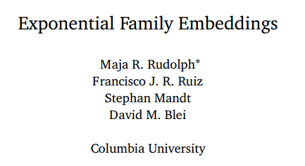

# 学界 | Embedding 新框架模型：Exponential Family Embeddings

机器之心经授权转载

**作者：洪亮劼（微博）**

> 是不是被各种 Embedding 模型弄得眼花缭乱啊？这篇论文统一了很多类似模型，提供了一个简单框架。论文可点击阅读原文下载。

这篇文章来自 David Blei 的实验室。文章的核心思想非常直观，那就是如何把 Word2Vec 的思想能够给 Generalize 到其他应用场景，提供一个比较通用的模型框架。在这个新的框架下，其他的很多类似模型都能够归纳成为这个新框架的特殊形式。

新的框架模型叫做 Exponential Family Embedding（EF-EMB）。其中包含三个要素：

*   A Context Function

*   A Conditional Exponential Family

*   An Embedding Structure

首先，Context Function 是定义如何把当前的数据点（Data Point）和一个 Context 里面的其他数据点联系起来。这是一个建模的选择。比如，对于 Language Data 来说，这个 Context 可以就是周围的字；而对于 Neural Data 来说，这个 Context 则可以是周围的 Neuron；对于 Shopping Data 来说，这个 Context 则可能就是购物车里的其他商品。

其次，Conditional Exponential Family 定义一个合适的 Distribution，来解释数据的产生过程。比如，对于 Language Modeling 来说，这个分布就是 Categorical Distribution；而对于 Real-Valued 数据来说，则就是 Gaussian Distribution。另外，在这个 Conditional Exponential Family 的定义里，每一个 Data Point 有两种 Embeddings：一种叫做 Embedding Vector；另一种叫做 Context Vector。通俗得讲，也就是每个数据点分解成为了 Embedding Vector 和一组 Context Vector（这个被上面的 Context Function 所定义）的乘积形式。

第三个要素 Embedding Structure 定义在建模中，Embeddings 是如何被共享（Shared）的。比如，对于 Language Data 来说，每一个词只有唯一的 Embedding Vector 和唯一的 Context Vector。还有其他的一些 Setting 里，这两者也可以是相同的。

在定义了之前的这些结构以后，Objective Function 则是 Log Conditional Probability 的加和，外加 Log 定义的 Regularizer。

文章讨论了好几个模型的例子，这里就不复述了。总之，现有的一些 Embedding 模型都很容易在这个框架下被重现。

模型的 Inference 则采用了 SGD。文章里还讨论了在 SGD 的情况下，如何得到类似于 Negative Sampling 的结果。同时，文章后面有详细的模型讨论。

总之，这篇文章很值得细看一下。一方面也是因为这里面统一了很多关于 Embedding 模型的讨论；另一方面，从软件工程角度来说，也许也能够设计和实现一个类型的模型框架。  

******©机器之心经授权转载，***转载请联系作者获得授权******。***

✄------------------------------------------------

**加入机器之心（全职记者/实习生）：hr@almosthuman.cn**

**投稿或寻求报道：editor@almosthuman.cn**

**广告&商务合作：bd@almosthuman.cn**