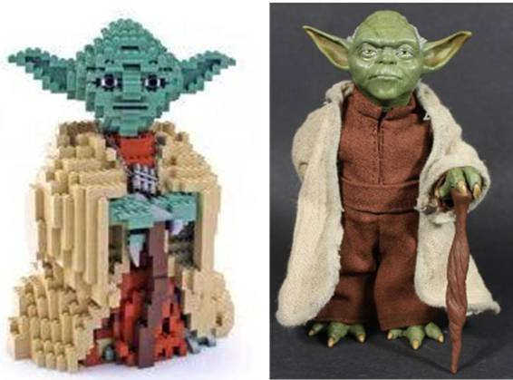
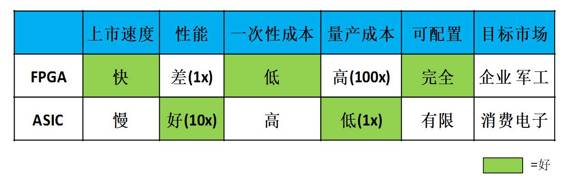

# 专栏 | FPGA vs. ASIC，谁将引领移动端人工智能潮流？

机器之心原创

**作者：李一雷**

**UCLA 博士**

人工智能方兴未艾，无数初创公司和老牌公司都在积极开发以人工智能应用为卖点的智能硬件。目前，强大的云端人工智能服务（如谷歌的 Alpha Go）已经初现端倪，同时，人们也希望能把人工智能也带到移动终端，尤其是能够结合未来的物联网应用。

传统实现移动终端人工智能的方法是通过网络把终端数据全部传送到云端，之后在云端计算后再把结果发回移动端，例如苹果的 Siri 服务。

然而，这样的方式会遇到几个问题。第一，使用网络传输数据会产生延迟，很可能数据计算的结果会需要等待数秒甚至数十秒才能传送回终端（使用过 Prisma app 处理过照片的朋友们应该深有体会）。这样一来，那些需要立刻得到计算结果的应用就不能用这种方式。例如无人机上使用的深度学习躲避障碍物算法，如果它全部在云端执行恐怕计算结果还没送回来无人机已经掉下来了。

第二，一旦使用网络传送数据，那么数据就有被劫持的风险。因此，那些要求低计算延迟以及对于数据安全性非常敏感的应用就需要把人工智能算法全部在终端实现，或者至少在终端完成一些预处理运算然后再把少量运算结果（而不是大量的原始数据）传送到云端完成最终计算，这就需要移动终端硬件能够快速完成这些运算。另一方面，移动端硬件完成这些运算需要的能量又不能太多，否则电池一下就没电了（想在手机上配功耗 200W+的 Nvidia Pascal 显卡肯定不行!）。

目前，许多公司正在积极开发能实现移动端人工智能的硬件。对于移动端人工智能硬件的实现方法，有两大流派，即 FPGA 派和 ASIC 派。FPGA 流派的代表公司如 Xilinx 主推的 Zynq 平台，而 ASIC 流派的代表公司有 Movidius。两大流派各有长短，下面让我来细细分说。

**FPGA vs. ASIC**

首先讲讲 FPGA 和 ASIC 的区别。FPGA 全称「可编辑门阵列」(Field Programmable Gate Array)，其基本原理是在 FPGA 芯片内集成大量的数字电路基本门电路以及存储器，而用户可以通过烧入 FPGA 配置文件来来定义这些门电路以及存储器之间的连线。这种烧入不是一次性的，即用户今天可以把 FPGA 配置成一个微控制器 MCU，明天可以编辑配置文件把同一个 FPGA 配置成一个音频编解码器。ASIC 则是专用集成电路 (Application-Specific Integrated Circuit)，一旦设计制造完成后电路就固定了，无法再改变。

 

 *用于深度学习加速器的 FPGA(Xilinx Kintex 7 Ultrascle, 上) 和 ASIC(Movidius Myriad 2, 下)*

比较 FPGA 和 ASIC 就像比较乐高积木和模型。举例来说，如果你发现最近星球大战里面 Yoda 大师很火，想要做一个 Yoda 大师的玩具卖，你要怎么办呢？

有两种办法，一种是用乐高积木搭，还有一种是找工厂开模定制。用乐高积木搭的话，只要设计完玩具外形后去买一套乐高积木即可。而找工厂开模的话在设计完玩具外形外你还需要做很多事情，比如玩具的材质是否会散发气味，玩具在高温下是否会融化等等，所以用乐高积木来做玩具需要的前期工作比起找工厂开模制作来说要少得多，从设计完成到能够上市所需要的时间用乐高也要快很多。

FPGA 和 ASIC 也是一样，使用 FPGA 只要写完 Verilog 代码就可以用 FPGA 厂商提供的工具实现硬件加速器了，而要设计 ASIC 则还需要做很多验证和物理设计 (ESD，Package 等等)，需要更多的时间。如果要针对特殊场合（如军事和工业等对于可靠性要求很高的应用），ASIC 则需要更多时间进行特别设计以满足需求，但是用 FPGA 的话可以直接买军工级的高稳定性 FPGA 完全不影响开发时间。但是，虽然设计时间比较短，但是乐高积木做出来的玩具比起工厂定制的玩具要粗糙（性能差）许多（下图），毕竟工厂开模是量身定制。

另外，如果出货量大的话，工厂大规模生产玩具的成本会比用乐高积木做便宜许多。FPGA 和 ASIC 也是如此，在同一时间点上用最好的工艺实现的 ASIC 的加速器的速度会比用同样工艺 FPGA 做的加速器速度快 5-10 倍，而且一旦量产后 ASIC 的成本会远远低于 FPGA 方案（便宜 10 到 100 倍）。

**FPGA vs ASIC ：积木 vs 手办**

当然，FPGA 还有另一大特点，就是可以随时重新配置，从而在不同的场合实现不同的功能。但是，当把 FPGA 实现的加速器当作一个商品卖给用户时，要让用户自己去重新配置却要花一番功夫。

回到用乐高积木做玩具的例子，玩具厂商可以宣称这个 Yoda 大师由积木搭起来，所以玩家可以把这些积木重新组合成其他角色（比如天行者路克）。但是一般玩家根本不会拆装积木，怎么办？解决方案要么是把目标市场定为精通积木的专业核心玩家，要么是在玩具后面加一个开关，一般玩家只要按一下就可以让积木自动重新组装。很显然，第二个方案需要很高的技术门槛。

对于 FPGA 加速器来说，如果要把可重配置作为卖点，要么是卖给有能力自己开发 FPGA 的企业用户（如百度，微软等公司确实有在开发基于 FPGA 的深度学习加速器并且在不同的应用场合将 FPGA 配置为不同的加速器），要么是开发一套方便易用能将用户的深度学习网络转化为 FPGA 配置文件的编译器（深鉴等公司正在尝试）。

从目前来看，即使用高端的服务器来做 FPGA 编译都会需要数分钟的时间，如果编译在计算能力较弱的移动终端做需要的时间就更长了。对于移动终端用户来说，如何说服他们尝试重新配置 FPGA 并接受长达数十分钟的时间来编译网络并配置 FPGA 仍然是一个问题。

**小结**

我把 FPGA 和 ASIC 的比较总结在下面表格里。FPGA 上市速度快，但性能较低。ASIC 上市速度慢，需要大量时间开发，而且一次性成本（光刻掩模制作成本）远高于 FPGA，但是性能远高于 FPGA 且量产后平均成本远低于 FPGA。FPGA 可以完全重配置，但是 ASIC 也有一定的可配置能力，只要在设计的时候就把电路做成某些参数可调的即可。

目标市场方面，FPGA 成本太高，所以适合对价格不是很敏感的地方，比如企业应用，军事和工业电子等等（在这些领域可重配置可能真的需要）。而 ASIC 由于低成本则适合消费电子类应用，而且在消费电子中可配置是否是一个伪需求还有待商榷。

我们看到的市场现状也是如此：使用 FPGA 做深度学习加速的多是企业用户，百度、微软、IBM 等公司都有专门做 FPGA 的团队为服务器加速，而做 FPGA 方案的初创公司 Teradeep 的目标市场也是服务器。而 ASIC 则主要瞄准消费电子，如 Movidius。由于移动终端属于消费电子领域，所以未来使用的方案应当是以 ASIC 为主。

 

**SoC+IP 模式**

说到这里，不少读者可能有疑问：现在深度学习的网络结构日新月异，但是 ASIC 上市速度那么慢而且一旦制作完成（流片）就无法更改，如何能跟上深度学习的发展速度呢？针对这个问题，我想首先需要厘清一个概念，即用于深度学习加速的 ASIC 到底要做什么？

有人认为神经网络 ASIC 就是真的实现一个神经网络结构在芯片上，因此网络结构一改（例如从 12 层变成 15 层，或者权重参数变一下）该 ASIC 就不能用了。其实这样的理解是不对的：ASIC 加速器做的是帮助 CPU 快速完成深度学习中的运算（例如卷积），当 CPU 在执行人工智能算法时只要遇到这种运算就交给加速器去做。因此只要神经网络的主要运算不变，则 ASIC 加速器完全可以使用。网络结构会影响 ASIC 加速器的性能，一种 ASIC 加速器可能是针对 GoogleNet 优化过的所以执行 GoogleNet 会特别快；当你换到 VGG Net 的时候这款 ASIC 还是可以用的，只是执行效率相比执行 GoogleNet 时要打个折扣，不过无论如何都要比 CPU 快得多。

至于 ASIC 上市时间慢的问题，目前也是有办法可以解决的，就是使用 SoC+IP 的方法。既然设计 ASIC 一家公司做太花时间，那能不能外包甚至众筹呢？完全可以！许多 SoC 芯片就是这样做出来的。

这里首先要向大家介绍 SoC 的概念。SoC 全称是「片上系统 (System-on-chip)」，亦即集成了许多不同模块的芯片。就拿多媒体应用的芯片举例，早些年每一个多媒体应用的模块（音频编解码，MPEG 播放编解码，3D 加速等等）自己都是一块 ASIC。

后来电子业界发现每个模块都做 ASIC 成本太高，而且最后电子产品的体积也很难做小，不如把所有的模块都集成到同一块芯片上。这块芯片集成了多个模块，并由一个中央控制单元通过总线控制每个模块的运作，就是 SoC。例如，现在高通公司的 Snapdragon 就是一块典型的 SoC，上面集成了 GPU，视频/音频编解码，相机图像信号处理单元（ISP），GPS 以及有线/无线连接单元等等。

SoC 上面的每一个模块都可以称为 IP，这些 IP 既可以是自己公司设计的（如 Snapdragon 上面的调制解调器就是高通自己设计的），也可以是购买其他公司的设计并整合到自己的芯片上，例如苹果 A 系列处理器里用的 GPU 就使用了 Imagination 的 PowerVR IP。SoC+IP 提供了一种灵活而快速的模式，可以想象如果苹果不是购买 IP 而是自己组建团队慢慢做 GPU，其 A 系列处理器芯片上市的时间至少要被延迟一年。

 

* 高通的 Snapdragon SoC，芯片上集成了众多 IP*

对于深度学习加速器而言，做成 IP 也是一个加速上市速度的模式。当深度加速器成为 IP 时，它就不再自己做成 ASIC，而是成为 SoC 的一部分，当 SoC 需要做深度学习相关运算时就交给加速器去做。

而且做成 IP 对于加速器来说能够更灵活地满足客户的需求。例如，某加速器 IP 设计可以实现 100GFlops 的运算速度并消耗功耗 150 mW，这时 A 客户说我们需要算得快一点的加速器（150 Gflops），而且不在乎功耗（300 mW 也可以）和芯片面积，那么 IP 公司可以根据客户的需求快速微调自己的设计并在一两个月内交付（由于并不需要真正生产芯片，只需要交付设计）。

但是如果加速器已经做成 ASIC，那要改动设计就必须重新做一块芯片，这个过程牵扯到耗时巨大的物理设计和验证，改动完的芯片上市时间可能是一年之后了。在 SoC+IP 的模式下，IP 公司可以专注于加速器的前端设计并且根据客户的需求量体裁衣，大公司则做自己擅长的后端以及芯片/封装级验证，可以说是大公司和小公司都可以扬长避短，各取所需，最终实现快速加速器设计迭代（如半年甚至一个季度一次）并跟上深度学习发展的步伐。

从性能角度来说，深度学习加速器如果做成 IP 则和同一芯片上的 CPU 进行数据通讯时可以使用高带宽的片上互联，但是如果做成 ASIC 则必须走带宽比较低功耗也比较大的芯片外互联，因此深度学习加速器作为 IP 成为 SoC 的一部分对于系统的整体性能也有所提升。

目前，做深度学习加速器 IP 的老牌公司有 Ceva，Cadence 等等。这些公司的设计大多是基于已有的 DSP 架构，设计比较保守。当然，也有一些初创公司看到了深度学习加速器 IP 这块市场并试图用全新的加速器架构设计来满足应用的需求，如 Kneron。

对于做 IP 的初创公司我个人持乐观态度，因为首先深度学习相关加速器 IP 确实有市场需求，例如微软在用于 AR 设备 HoloLens 的处理器 HPU 中，主要运算单元都是使用买来的加速器 IP。其次，做 IP 并不和大的芯片公司（如 NVidia，Intel）构成竞争关系，所以压力比较小。最后，由于做 IP 需要的资源较少，产品上市时间较快，因此维持运营对资本的压力比较小，风险也比直接做芯片要小，可以说是一个比较稳妥的方案。

 

*深度加速器 IP 市场既有沿用传统架构的老牌厂商（Ceva, Cadence）也有使用创新架构的初创公司（Kneron）*

**结语**

FPGA 和 ASIC 在实现深度学习加速器方面各有所长，FPGA 的可配置性更适合企业、军工等应用，而 ASIC 的高性能和低成本则适合消费电子领域（包括移动终端）。为了实现快速迭代，ASIC 可以采用 SoC+IP 的模式，而这种模式也使得没有资源量产芯片的中小公司可以专注于深度学习加速器 IP 的架构和前端设计，并在人工智能市场上占有一席之地。

******©本文由机器之心原创，***转载请联系本公众号获得授权******。***

✄------------------------------------------------

**加入机器之心（全职记者/实习生）：hr@almosthuman.cn**

**投稿或寻求报道：editor@almosthuman.cn**

**广告&商务合作：bd@almosthuman.cn**