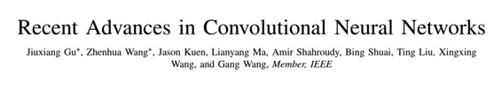

# 学界 | 概述性论文：卷积神经网络的近期研究进展

选自 arXiv.org

**作者：Jiuxiang Gu、Zhenhua Wang 等人**

**机器之心编译**

**参与：吴攀、李亚洲**

**摘要**

最近几年，深度学习在视觉识别、语音识别和自然语言处理等许多不同的问题上取得了非常好的表现。在许多不同类型的深度神经网络中，卷积神经网络得到了最为广泛的研究。因为早些年训练数据集和计算能力的缺乏，训练一个大型的、高容量的、同时没有过拟合的卷积神经网络是很困难的。随着标注数据量级的快速增长和近来在图形处理单元（GPU）的优势上取得了进步之后，对卷积神经网络的研究迅速涌现，并已在多种任务上得到了当前最佳的结果。在本论文中，我们提供了对近来卷积神经网络进展的广泛调查。此外，我们还介绍了一些卷积神经网络在计算机视觉领域的应用。

**1.导语**

卷积神经网络（CNN）是一种广为人知的深度学习架构，其设计灵感来自生物体的自然视觉感知机制。1959 年，Hubel 和 Wiesel [1] 发现动物视觉皮层中的细胞负责检测感受野（receptive field）中的光。受此发现的启发，Kunihiko Fukushima 于 1980 年提出了神经认知机（neocognitron）[2]，其可被看作是 CNN 的前身。1990 年，LeCun 等人发表了建立了现代 CNN 框架的开创性论文 [3]，之后又在 [4] 中对其进行了改进。他们开发了一个名叫 LeNet-5 的可以对手写数字进行分类的多层人工神经网络。和其它神经网络类似，LeNet-5 有多个层、可以使用反向传播算法 [5] 进行训练。它可以获取原图像的有效表征，这让它可以直接从只有较少甚至没有预处理的原始像素中识别视觉模式。但是，因为那时候缺乏大量训练数据和计算能力，LeNet-5 在大规模图像和视频分类等更复杂的问题上表现并不好。

自 2006 年以来，人们开发了很多方法来克服深度 CNN 的训练中所遇到的困难。其中最值得注意的是，Krizhevsky 等人提出了一种经典的 CNN 架构，该架构在图像分类任务中显著超越了之前的方法。他们方法的整体架构 AlexNet [6] 与 LeNet-5 类似，但具有更深的结构。随着 AlexNet 的成功，研究者们也提出了一些成果来提升它的性能。其中比较有代表性的四种是 ZFNet [7]、VGGNet [8]、GoogleNet [9] 和 ResNet [10]。随着这种架构的发展，这些网络也出现了越来越深度的趋势，比如赢得 ILSVRC 2015 比赛冠军的 ResNet 比 AlexNet 深 20 倍、比 VGGNet 深 8 倍。随着深度的增加，网络可以更好地逼近非线性增长了的目标函数并获得更好的特征表示。但是，这同时也使网络的复杂度增长了，这使得这些网络更难优化和更容易出现过拟合。随着这种方法的发展，人们也提出了很多方法来解决这些在各个方面的问题。在本论文中，我们会尝试给出近来研究进展的全面概述并给出一些充分的讨论。

在后续的章节中，我们确定了与 CNN 相关的成果的主要类别。我们在第二节中首次给出了 CNN 基本组件的概述。然后，我们在第三节中介绍了 CNN 不同方面最近的一些进步，这些方面包括：卷积层、池化层、激活函数、损失函数、正则化和优化。然后在第四节中我们介绍快速计算（ fast computing ）技术。接下来的第五节中，我们讨论了一些 CNN 的典型应用，包括：图像分类、目标检测、目标跟踪、姿态估计、文本检测与识别、视觉显着性检测、动作识别和场景标签。最后，我们在第六节对本论文进行了总结。

***©本文由机器之心编译，***转载请联系本公众号获得授权***。***

✄------------------------------------------------

**加入机器之心（全职记者/实习生）：hr@almosthuman.cn**

**投稿或寻求报道：editor@almosthuman.cn**

**广告&商务合作：bd@almosthuman.cn**

**点击阅读原文，下载此论文↓↓↓**