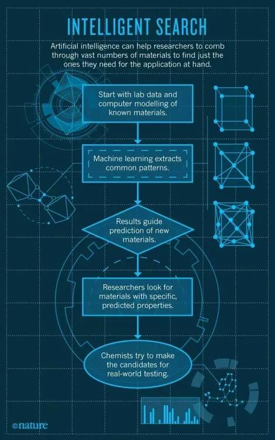

# 前沿 | 《Nature》 封面文章：人工智能引发材料科学变革

选自 Nature

**作者： Nicola Nosengo**

**机器之心编译**

**参与：王紫薇、吴恒、微胖** 

> *一些研究者相信，机器学习技术可以变革材料科学。*

这是对最极客视频前所未有的挑战：一部智能手机的特写，一排排数字和符号正在手机屏幕上滚动着。但是，当拜访者们驻足在 Nicola Marzari 可以俯瞰日内瓦湖的办公室时，他迫不及待得向人们炫耀它了。「从 2010 年就开始了，」他说，「我的手机正在实时计算硅的电子结构！」

Marzari，瑞士洛桑联邦理工学院 （Swiss Federal Institute of Technology in Lausanne,EPFL）的物理学家，解释道，他现在的手机仅用 40 秒就可以执行一个超级计算机需花费数小时的量子力学运算 —— 这个傲人成果不仅展现了过去几十年运算方式的进步，也证实了这些运算方式有望改变未来材料科学研究方式。

Marzari 和志同道合的研究人员正在使用计算机建模技术和机器学习技术，集成由数以万计的候选材料组成的数据库，而不再是用以前开发新材料的老式方法（靠运气碰到一些新材料，然后在实验室精心测试它们的性能）。即使实验失败，其产生的数据也可以做出贡献。虽然许多候选材料是完全被假设出来的，但是，通过搜遍这些材料的性能，工程师们已经开始针对特定用途，筛选那些值得合成和测试的材料——例如，是否是良好的导体或绝缘体、是否有磁性以及熔点和耐压强度如何。

「他们希望这种方法能让材料发现的速度和效率产生巨大飞跃，」加州大学伯克利分校的材料科学家、也是这一领域的先驱者 Ceder 说。Ceder 认为，「我们对现存材料的了解大概只有 1% 」，他提到了锂铁电池(lithium iron phosphate) 的例子：在二十世纪三十年代就被合成出来的化合物，然而一直到 1996 年，人们才承认，它有望替代锂离子电池。「之前，压根没有人想测量它的电压」Ceder 说。

目前，全世界已有至少三个主要的材料数据库，每个数据库包含了数万或数十万种的化合物。Marzari 位于洛桑的材料云项目 （Materials Cloud project）将在今年内开始运行。而且也开始引发更广泛的利益团体关注。Neil Alford，材料科学家，伦敦帝国理工学院（Imperial College London）科研副主任（不过他和数据库项目没有关系）认为，「我们正在见证一个真正汇聚，实验者们想要的东西和理论学家可以传递内容的汇聚」。

然而，这些倡导者们很快发现，从电脑预测到现实世界技术，这条路可以不好走。现存的数据库还远不能包含所有已知的材料，更别说所有有可能性的材料了。对于某些材料而言，数据驱动下的发现很管用，但是，对其他材料而言，未必如此。而且，甚至在电脑挑选出一种有趣的材料后，在实验室里合成它，仍然花费数年。「我们经常更了解应该做什么，胜过如何制造它。」Ceder 说道。

这个领域的研究者们仍然很自信：有一批等去被发现的化合物，这些化合物能推动电子、能源、机器人、医疗保健和交通等领域的创新。「我们正在将许多拼图的不同部分拼凑起来，」Giulia Galli，一名芝加哥大学的计算材料科学家，说「当不同部分组成一幅完整图形时，对材料的预测就会成为现实。」

**基因的灵感**

21 世纪初，Ceder 想到了这种高通量、数据驱动的材料发现研究方法，那时 ，Ceder 还在 MIT 学习并从几近完成的人类基因组计划（ Human Genome Project）中受到启发。「就这个计划本身来说，人类基因组并不是新治疗方案的秘方，」他说，「但是，它为医学研究提供了客观数量的基础、定量信息，作为研究的出发点。」材料科学家可以从基因学家那里学到什么吗？他不禁好奇。他们能不能辨认一种「材料基因组」（materials genome）——如 Ceder 所说的 ——编码各种化合物的性质，就像生物信息被编码进 DNA 碱基对一样？

如果可以，他推理道，编码过程必须发生在组成给定材料的原子和电子中，发生在它们的晶状结构中：亦即空间安排方式。2003 年， Ceder 和他的团队首次展示了一个量子力学计算数据库如何帮助预测了一种金属合金最可能的晶体结构——对于任何从事新材料发明的人来说，这是关键一步。

过去，即使对超级计算机来说，这样的计算也是既耗时又困难的。机器必须经历一系列的试验和错误来寻找到「基态（ground state）」：一种能量最低且受力均衡的电子排布以及晶体结构。但是，在 2003 年发表的论文中， Ceder 的团队描述了一种捷径。研究人员针对一个二元合金（由两种不同合金元素组成的合金）的数据库，计算出常见晶体结构的能量 ，然后设计了一种机器学习算法，这种算法可以从库中提取模式，猜测一种新型合金最可能的基态 。该算法效果很好，削减了计算所需的计算时间（参见下图）。

*智能搜索*

*人工智能帮助研究者们梳理巨量的材料信息，并找到他们手头应用所需要的那几款*

*从已知材料的实验室数据与电脑模型开始*

*机器学习提取共有模式*

*结果引导对新材料的预测*

*研究者们寻找拥有特定的、预测特质的材料*

*化学家们尝试着制造出可以接受真实世界检验的候选材料*

「那篇论文介绍了有关材料性质的公共数据库的想法，以及运用数据挖掘来填补缺失部分的想法，」Stefano Curtarolo 说。他在同一年离开了 Ceder 团队并在杜克大学创建了自己的实验室。这个想法孕育了另外两个独立的项目。 2006 年， Ceder 在 MIT 开始了材料基因组项目（Materials Genome Project），通过运用改良版本的算法，预测电动汽车电池的锂基材料。截止 2010 年，这个项目已经包含了大约两万种预测到的化合物。「我们从已知的材料入手，修改它们的晶体结构 ——也就是先改变其中一个元素，再计算会发生什么，」 Kristin Persson，一位 Ceder 团队的前成员，说道。她在 2008 年加入位于加州的劳伦斯伯克利国家实验室（ Lawrence Berkeley National Laboratory）后，继续与这个项目进行合作。

与其同时，Curtarolo 在杜克大学创办了材料基因组中心（Center for Materials Genomics），研究方向主要是金属合金。他与来自犹他州普若佛市的杨百翰大学（Brigham Young University）和以色列的内盖夫核研究中心（Negev Nuclear Research Center）的研究人员们组建团队，逐渐将 2003 算法数据库扩展为 AFLOW，这个系统可以以已知的晶体结构为基础，完成计算任务，自动预测新的晶体结构。

原团队以外的研究者们也开始对这个高通量计算方式表示兴趣。其中之一便是化学工程师 Jens Nørskov。在位于灵比的丹麦技术大学（Technical University of Denmark）时，他因为要研究将水分解成氢和氧的催化剂而开始接触这个算法，后来以加州斯坦佛大学 SUNCAT 催化剂计算研究中心（SUNCAT Center）总监的身份拓展了这个研究。另一位便是参与开发 Quantum Espresso 软件的 Marzari。2009 年，Quantum Espresso 软件开始用于量子力学运算。这个算法便是文章开始时在他的手机视频上滚动的代码。

**材料基因组学**

尽管如此，直到 2011 年六月，当白宫宣布百万美金的材料基因组倡议（Materials Genome Initiative，MGI）时，计算材料科学才逐渐成为主流。「当白宫的人们开始熟悉 Ceder 的研究时，他们十分得激动，」James Warren，美国国家标准和技术研究所（National Institute of Standards and Technology）的材料科学家、同时也是材料基因组倡议的执行秘书，说道。「在这之前，人们就有了一个大概意识，计算机模拟已经到达了可以对创新和制造带来真实影响的程度，」他说——更别提「基因组」大名，这让人联想到某种宏大叙事。

 2011 年以来，这个倡议已经投入了 2.5 亿美元，对象包括软件工具、收集与报道实验数据的标准化方法、主要大学的计算材料科学中心、以及大学与商业部门就特定用途展开的研究合作等。但是，尚不清楚的是，这笔投资到底在多大程度上推进了科学研究。「这个倡议带来了很多好的东西，同时也有一些偏差，」Ceder 说道。「有人开始说，他们的研究是关于这个基因组或者那个基因组，其实，这些研究跟基因组没什么关系。」

但是，可以确定的是，这个材料基因组倡议意在帮助 Ceder 和其他的人实现材料性质在线数据库的宏大愿望。2011 年末，在白宫要求他们放弃「基因组」这个标签以避免混淆后，Ceder 和 Persson 以材料项目（the Materials Project ）的形式重新开始了他们的材料基因组项目。在接下来的一年，Curtarolo 以他在杜克大学研发的一款软件为基础，发布了他自己的数据库，名为 AFLOWlib。接着在 2013 年，Chris Wolverton, 一位西北大学（Northwestern University）的材料研究者开启了开放量子材料数据库（the Open Quantum Materials Database）。「我们从材料项目和 AFLOWlib 获取到了许多的灵感，」Wolverton 说，「然而，我们的软件和数据是完全原创的。」

所有这三个数据库，共享着约五万种已知材料的核心，这些材料来自一个被广泛使用的实验数据库，无机晶体结构数据库（Inorganic Crystal Structure Database）。这些材料都是至少在实验室中被创造出过一次并在论文中被描述过的固体，但是，它们的电磁性能还没有完全被检测到；它们将会是新型材料衍生的起点。

三个数据库的区别在于它们所包括的假定的材料。The Materials Project 包括的相对较少，始于大约 15,000 个计算结构，这些结构源自 Ceder 和 Persson 对锂电池的研究。「我们只是将它们涵盖在数据库中，如果我们确信计算是准确的，在一个合理条件下，它们是可以被制造的，」Persson 说。另外大约 13 万，是由在明尼苏达的明尼阿波利斯大学的纳米多孔材料基因组中心预测出的结构。后者研究沸石和金属 - 有机骨架：在其晶体结构内有着规律孔的海绵似的材料，可以吸收气体分子，并且可以用来储存甲烷或二氧化碳。

AFLOWlib 是最大的数据库，拥有超过一百万种不同的材料和大约 1 亿的计算性能。这是因为它包含成千上万的假设材料，这其中仅仅只有一小部分存在于现实世界里。Curtarolo 说，「但是，当想要预测一种材料究竟是如何被制造出来时，却要付出很多努力。」例如，他正在从 AFLOWlib 数据库中调取数据，研究为什么一些合金能够形成金属玻璃——一种特殊的金属，有着无序的微观结构，从而表现出特殊的电磁性能。事实证明，能够形成金属玻璃的材料与不能的材料之间的差异，取决于不稳定晶体结构的数量和能量，这些不稳定结构在合金冷却时与基态原子相「竞争」，挣脱基态的束缚从而形成金属玻璃。

沃尔弗顿的 OQMD 数据库包含约 40 万假定材料，通过从自然观察中得出一个晶体结构的列表以及从元素周期表 9 中的每一个部分选择元素「修饰」这些假定材料，从而计算得到的这些数据库。它具有相当宽范围的钙钛矿——其晶体结构通常展示出相当吸引人的特性，例如，超导性和作为微电子开发在太阳能电池中的应用。顾名思义，这个项目在这三个中是最开放的：用户可以下载整个数据库到自己的电脑，而不仅仅是单个搜索结果。

所有数据库都在程序中运行，他们策划人仍然花费相当一部分时间来增加更多的化合物以及完善的计算 。他们认为，这些还是远远不够完善。这些代码往往在预测晶体是否稳定方面性能相当不错，但在预测如何吸收光线或导电性能方面不太好－－有时，预测出的半导体看起来像金属。Marzari 指出，即使是在计算材料学最有成功经验的电池材料领域，标准计算仍然有平均半伏的误差，导致性能方面存在许多差异。「事实是，理论本身存在一些错误：我们可能永远无法改正，」Curtarolo 说。

每个团队都正在开发自己的技术来调整计算以及弥补这些系统误差。然而，在他们已经用数据做科研的同时，来自其他团队的用户也在这么做。The Marerials Project 确定了几个有前景的阴极材料，在锂电池中使用效果比现有的要好一些，同时确定了在太阳能电池中可以提高阳光吸收效率和能量转化效率的几种金属氧化物。今年早些时候，来自都柏林圣三一学院的研究人员使用 AFLOWlib 数据库预测 20 哈斯勒合金，一类可被应用于传感器或电脑记忆体的磁铁，他们成功地合成了两种该类合金，确认了它们的磁特性非常接近预测结果。

**欧洲扩张**

材料基因组学已经传播到欧洲——尽管通常用的是其它名字。例如，瑞士创建了 MARVEL，一个为计算材料科学而成立的机构网络，这个网络由 EPFL 领导，Marzari  做为主管。使用一个新的计算平台，Marzari 创建一个名为材料云的数据库，用来搜索「二维」的材料，如石墨，它仅仅由一层原子或分子构成。这样的材料，应用范围可以从纳米电子扩展到生物医学领域。为了找到更好的候选材料，Marzari 正在对超过 15 万的已知材料进行他所谓的「计算剥皮」：计算从一个普通晶体的表面分离出单层结构会消耗多少能量。截止到今年下半年向公众公布这些数据库的时候，他预计初步可产生 1500 种二维结构，它们有潜在希望用于实验测试。

在 Sion 几公里以外的瑞士阿尔卑斯山之巅，计算化学家 Berend Smit 成立了另一个 EPFL 中心，旨在开发出能够预测成千上万的纳米多孔沸石和金属有机框架的算法。也包括其他一些算法：一个算法使用面部识别软件派生的技术扫描特定气孔的形状，从而挑选出从化石燃料发电厂的烟道吸收二氧化碳最佳的备选材料。

Smit 的工作还表明，材料基因组学也会带来坏消息。许多研究人员曾希望利用纳米多孔材料打造用更小的空间存储更多甲烷的汽车罐。但筛查超过 65 万种计算材料后，Smit 团队得出结论，大部分的最好材料已经投入应用。新的选择可能只带来轻微的改善，而且目前美国机构设置的能源目标（押注重大技术改进甲烷存储）可能是不切实际的。

正如这些耐人寻味的例子，在材料基因组学能够实现其期望以前，仍然有许多障碍需要克服。其中最大的一个障碍就是，计算机模拟只是给出了一些在实验室制造有趣材料的部分线索，更不要提大规模生产了。「我们一直对制造新化合物有一些有趣的想法」Ceder 说，「有时候，花两个星期的时间就可以做出来。但有些时候，半年过去了，我们仍然无法做出来，不知道是我们没有按照正确的方式做，还是它就是不能够被制造出来。」

Ceder 和 Curtarolo 正在努力开发机器学习算法，从而从已知的制造工艺中提取方法，指导化合物的合成。

另一个限制是，迄今为止，材料基因组学一直被专门用于工程师所谓的功能材料－－即可以实现某种功能的化合物，例如太阳能电池吸收光或者让晶体管导通电流。但该技术不被用于研究钢这样的结构材料，而这样的材料是被需要的，例如，飞机机翼、桥梁或发动机都需要钢材。不被用于这种材料是因为材料的弹性和硬度这样的机械性能依赖于加工过程， 这是不能通过量子力学代码描述的。

即使是在功能材料领域，目前的计算机代码只能很好地对完整晶体结构进行分析。 这只是材料领域的一小部分 。「未来最有趣的材料可能会以创造性的方式在微观层面进行组装」Galli 说。它们可能是纳米颗粒和晶体结构中特地布入缺陷的组合物，或者是缠结了不同化合物和相的异质材料。为了预测这种材料，Galli 说，「你需要一次性计算许多性能，以及计算在特定温度和时间下系统如何变化」。「有方法可以做到这一点，」她说，「但在高通量研究中使用计算的方法太过昂贵」。

在短期内，更多的实验数据交换可以对计算进行现实检查，并帮助完善它们。为此，Ceder 正在与麻省理工学院从事软件研究的团队进行合作，这种软件可以读取实验类材料科学的论文，并自动以标准格式提取晶体结构的信息。「我们计划开始在几个月内将这些数据传送到材料项目」他说。

从长远来看，一些帮助将来自摩尔定律：随着计算能力的不断提高，一些超出目前计算的技术可能很快变得可用。

「我们已经摆脱了计算材料科学的手工时代，进入了产业化阶段，」Marzari 说，「我们现在可以创建模拟装配链进行工作，还可以用全新的方法探究问题。」只是现在市场上还没有计算预测的材料。「但是如果 10 年后再说，」Gall 表示，「我认为会出现很多。」

***©本文由机器之心编译，***转载请联系本公众号获得授权***。***

✄------------------------------------------------

**加入机器之心（全职记者/实习生）：hr@almosthuman.cn**

**投稿或寻求报道：editor@almosthuman.cn**

**广告&商务合作：bd@almosthuman.cn**