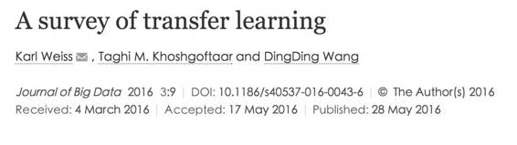

# 学界 | 概述论文：迁移学习研究全貌

选自 IEEE Spectrum

**机器之心编译**

**参与：沈泽江、Rick、吴攀**

> 
> 
> **摘要**
> 
> 机器学习及数据挖掘相关的技术已经被用在了许多现实应用中。训练集和测试集都源自相同的领域，是传统机器学习方法中的一个重要假设（因此，测试集和训练集合的输入特征空间及数据概率分布特征是相同的）。但是，在某些实际应用机器学习的场景中，这个假设并不成立。但在某些情况下，训练集的收集可能非常困难或代价高昂。因此，有必要创造出某种高性能学习机（learner），使得它们能够基于从其他领域易于获得的数据上进行训练，并能够在对另一领域的数据进行预测时表现优异。这种方法，就是所谓的迁移学习（transfer learning）。这篇综述文章，正式地定义了迁移学习，讨论了目前迁移学习的一些做法，并回顾了迁移学习的一些应用。最后，还列举了一些解决不同迁移学习问题软件的下载链接，还有对迁移学习未来可能研究方向的讨论。本文所述的迁移学习应用不受数据规模限制，也就是说你也可以将它们应用在大数据环境中。
> 
> **结论与讨论**
> 
> 迁移学习问题是一个经过了深入研究的领域，因为过去 5 年间有 700 多篇学术论文都在讨论它。本调查论文所提出的解决方案就来自于这些代表着迁移学习当下趋势的文献。据该文的调查结果显示，探讨同构迁移学习的文献论证了基于实例的、基于特征的、基于参数的和基于关系的信息迁移技术；对标记数据和未标记数据有着不同要求的解决方案也被当做一个关键属性提出来；较新的异构迁移学习领域则表明，域适应（domain adaptation）的两种主要研究方法是不对称变换和对称变换（asymmetric and symmetric transformations）。该文列出并讨论了迁移学习的许多实际应用。在某些情况下，文献所提出的迁移学习解决方案针对的是底层应用，不能广泛用在其他应用中。本论文附录中有一个软件下载列表，用于实现该调查论文中的部分解决方案。研究人员的一个巨大福利便是可以从先前的解决方案中获取软件，使实验得以更加高效而可靠地进行。由已发表的迁移学习解决方案集结而成的一个单一开源软件库，对于研究界来说将会是一份宝贵的资产。
> 
> 在迁移学习的许多解决方案中，进行域适应过程的重点要么是校正边际分布（marginal distribution）偏差，要么是校正源域和目标域之间的条件分布（conditional distribution）偏差。校正条件分布偏差由于缺乏标记过的目标数据而具有挑战性，为解决这个问题，一些解决方案的做法是先对目标数据标签做一个估计（称作伪标签/pseudo labels），然后再用它来矫正条件分布偏差。这种方法是有问题的，因为条件分布是在伪标签的帮助下进行校正。校正条件分布偏差的改进方法则是未来研究的一个潜在领域。最近有一些研究工作试图在域适应过程中同时校正边际分布偏差和条件分布偏差。未来研究的一个领域是量化同时校正这两种分布的优势以及同时校正法在什么情况下是最有效的。此外，Long [68] 表示同时校正方式要优于单个校正，因为这降低了过拟合的风险。未来研究的另一个领域是量化同时校正方式的任何性能增益。除了通过解决域适应过程中的分布偏差来提高目标学习器（learner）的性能外，还可以使用域特征的先验知识来探索可能的数据预处理步骤。该先验知识将代表一组标准迁移学习技术多无法解释的复杂规则或复杂关系。多数情况下，这种先验知识将特定于每一个域，因而它不会是一种通用型解决方案。然而，如果这样的预处理步骤提高了目标学习器的性能，那么它就值得研究。
> 
> 在针对迁移学习而提出的各种解决方案中，与两步走（two-stage）策略相反，可观察到实行一步走（one-stage）策略的趋势。两步走策略首先执行域适应过程，然后独立学习最终的分类器。一步走策略在学习最终分类器的同时执行域自适应过程。最近使用一步走策略的解决方案包括 Long [68], Duan [27], Shi [106], Xia [132] 和 Duan [30]。关于一步走策略，Long [68] 声称域适应和分类器学习的同步进行能够相互强化从而提高性能。未来的一个研究领域是更好地去量化一步走策略的影响如何优于两步走策略。
> 
> 该文调查了一些探讨负迁移（negative transfer）主题的研究。负迁移问题仍然是一个未经深入研究的领域。从负迁移技术到迁移学习解决方案的拓展整合是未来研究工作的一个自然延伸。支持多源域的解决方案使得较大源域分裂为较小的域，从而更易区分无关源数据，这些解决方案是一个合乎逻辑的继续研究领域。此外，最优迁移（optimal transfer）是未来研究工作的另一个肥沃领域。负迁移被定义为对目标学习器有负面影响的一个源域。最优迁移的概念是将从一个源域中选取信息的行为转移成尽可能地实现目标学习器的性能。负迁移和最优迁移的概念之间有重叠；但最优迁移试图找到最好的目标执行学习器，这就远远超越了负迁移的概念。
> 
> 随着最近的手机、车辆、建筑、道路和计算机对传感器的使用增加，更多更复杂的信息正被收集起来。数据采集的多样性将异构迁移学习解决方案的重要性不断向前推进。更大的数据收集规模凸显了同步进行大数据解决方案及当下的迁移学习解决方案的潜力。如何将传感器数据的多样性和大体量性集成在迁移学习的解决方案中是未来研究的一个有趣的主题。未来研究工作的另一个领域涉及到域之间输出标签空间不一的情形。随着新数据集被源源不断地捕获并得以使用，该主题可能是未来需要关注的一个领域。最后，文献中很少有解决未标记源和未标记目标数据的迁移学习解决方案，这当然是一个后续研究领域。
> 
> **点击阅读原文查看原论文。**
> 
> ***©本文由机器之心编译，***转载请联系本公众号获得授权***。***
> 
> ✄------------------------------------------------
> 
> **加入机器之心（全职记者/实习生）：hr@almosthuman.cn**
> 
> **投稿或寻求报道：editor@almosthuman.cn**
> 
> **广告&商务合作：bd@almosthuman.cn**