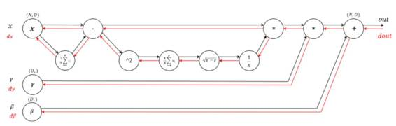
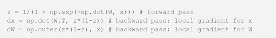
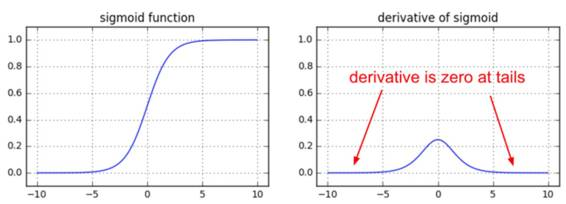
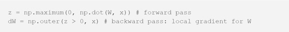
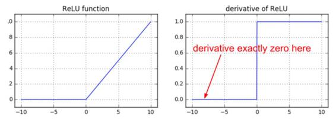
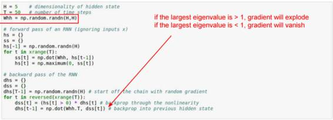
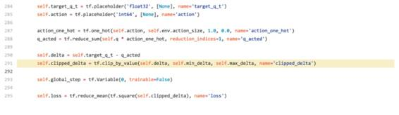
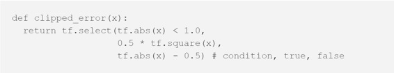

# 学界 | Andrej Karpathy：你为什么应该理解反向传播

选自 Medium

**作者： Andrej Karpathy**

**机器之心编译**

**参与：吴攀、李亚洲、杜夏德**

当我们在斯坦福提供 CS231n（深度学习课程）时，我们有意设计编程任务来将涉及最底层的反向传播的明确的计算包括进来。这些学生必须在原始的 numpy 的每一层中实现前向和反向传播。然而，一些学生在黑板上留下这些抱怨。

> *「在现实世界中，框架（比如 TensorFlow）会自动计算反向传播，为什么我们还一定要写它们？」*

这看起来非常合理，如果课程结束后你永远不会写反向传播，为什么还要练习呢？难道是因为我们自己的兴趣而折磨学生吗？有一个简单的回答可能是「在求知欲下值得我们知道反向传播」，也有回答是「之后你可能想要改进里面的核心算法」，但还有一个更有力、更实际的理由，我会在此文章中展现：

反向传播的问题在于它是一个抽象泄漏（leaky abstraction）。

换言之，你会很容易将学习过程抽象掉——认为自己能非常容易地将任意层堆叠到一起，然后反向传播就会在你的数据上「神奇发挥功效」。所以，让我们来看一些非常清楚的例子，这是一种相当直观的方式。

*带有前向传播（黑色）和反向传播（红色）的 Batch Norm 层的计算图*

**在 S 型函数上的梯度消失**

从这里开始会很简单。以前某段时间，在全连接层中使用 S 型函数（或双曲正切函数 tanh）的非线性（non-linearities）非常流行。当时有一个难点是直到人们想出了反向传播才意识到的：如果不注意权重初始化或数据预处理，这些非线性会「饱和」并完全停止学习——你的训练损失将会趋于平坦，难以下降。例如，带有 S 型非线性的全连接层计算（使用 raw numpy）：

 

如果权重矩阵 W 初始化过大，矩阵相乘的输出范围会非常大（例如 -400 到 400 之间的数值），这会使得向量 z 上的所有输出几乎是二元的：0 或 1。但如果是这样，S 型非线性函数的局部梯度 z*(1-z) 在两种情况下都会是 0（梯度消失），使得 x 和 W 的梯度都是 0。在链式反应下，之后的反向传播相乘之后得到的都会是 0。

 

另一个关于 S 型的不太明显的有趣事实是当 z=0.5 时，它的局部梯度 z*(1-z) 的会达到最小值 0.25。那就意味着这个梯度信号每次通过一个 S 型函数门时，它的大小总会减少四分之一（或更多）。如果你正在使用基本的随机梯度下降法（SGD），这会使某个网络中较低层的训练比较高层慢得多。

注：如果你正在你的网络中使用 S 型或双曲正切非线性并且你理解反向传播，你就总会为确保初始化不会使它们完全饱和而感到紧张。更多解释请参阅这个 CS231 讲座视频（CS231n Winter 2016: Lecture 5: Neural Networks Part 2）。

**垂死的 ReLU**

另一个有趣的非线性是 ReLU，其神经元的阈值范围是 0 以下。对于一个使用了 ReLU 的全连接层，其前向和反向通过需要在其核心包含：

 

如果你研究一下这段代码，你会发现如果一个神经元在前向通过中被嵌位到 0（即 z=0，它不会「fire」），那么它的权重将会得到 0 梯度（zero gradient）。这会导致所谓的「死亡的 ReLU（dead ReLU）」问题，即如果一个 ReLU 神经元不幸被初始化为其永远无法 fire，即如果一个神经元的权重在训练进入这一范围期间被使用一次大更新敲除，那么这个神经元就将永久死亡。这就像是永久的、不可恢复的脑损伤。有时候当你使其整个训练集前向穿过一个训练好的网络，你可能会发现你的神经元中很大一部分（比如 40%）在所有时间都是 0.

 

注：如果你了解反向传播并且你的网络有 ReLU，那么你会常常为死亡的 ReLU 感到焦虑。对于你整个训练集中的任何样本，这些神经元都不会开启，而且会一直保持死亡状态。神经元在训练过程中也会死去，通常是由于激进的学习率所造成的。更详细的解释请参看 CS231n 教学视频：https://youtu.be/gYpoJMlgyXA?t=20m54s

**RNN 中的梯度爆炸**

Vanilla RNN 是反向传播的非直观效应的另一个好例子。我从 CS231n 复制了一张幻灯片，上面有一份简化的 RNN，其没有采用任何的输入 x，只在隐态（相当于输入 x 一直是 0）上计算循环（recurrence）：

这个 RNN 通过 T 时间步展开。当你盯着反向传递在做什么时，你会看到在所有隐藏状态下会及时反向传播的梯度信号总是被同一矩阵（循环矩阵 Whh）相乘，中间穿插着非线性反向传播。

当你拿到某个数字 a 并开始将它与另一个数字 b（例如，a*b*b*b*b...）相乘时会发生什么？|b|<1 时，这个序列会趋近于 0；当|b|>1 时，这个序列会「爆炸」成无限。在某个 RNN 的反向传递中会发生同样的事情，除非 b 是一个矩阵，而不仅仅是一个数，所以我们必须推理出它的最大特征值。

注：如果你理解了反向传播并且你正在使用 RNN，你就总是会为一定要做梯度裁剪而感到焦虑，要不然你就去使用 LSTM。详细解释可以看看这个视频：CS231n Winter 2016: Lecture 10: Recurrent Neural Networks, Image Captioning, LSTM（https://www.youtube.com/watch?v=yCC09vCHzF8）

**自己的发现：DQN Clipping **

让我们再看一个，也是它启发我写出了这篇文章。昨天，我正在浏览 Deep Q Learning 在 TensorFlow 上的实现（看看别人是怎么处理等同于 numpy 的 Q [:, a] 的计算，其中的 a 是个整数向量——发现 TensorFlow 并不支持该繁琐的操作。）总之，我搜索了一下「dqn tensorflow」，点开第一条搜索连接，发现了它的核心代码，下面是引用：

 

如果你熟悉 DQN，你可以看到有一个 target_q_t，也就是 [reward * \gamma \argmax_a Q(s』,a)]，然后有一个 q_acted，也就是采用的该 action 的 Q(s,a)。作者在这里将上面这两个简化到了变量间隔（variable delta），然后他们想要把 295 行的代码中的 L2 loss 用 tf.reduce_mean(tf.square()) 替换掉从而进行缩减，到这里还好。

但问题出在第 291 行。作者想要保持对异常值（outlier）的稳健性，所以如果间隔（delta）过大，它们就使用 tf.clip_by_value 修剪它。意图很好，而且从前向传播的角度来看也是合理的，但如果你考虑一下就会发现它引入了一个大漏洞。

这个 clip_by_value 函数在 min_delta 到 max_delta 的范围之外还有一个 0 的局部梯度，所以无论何时，该 delta 都在 min/max_delta 之上，该梯度会在反向传播过程中变成确定的 0。当作者为了额外增加稳健性而很可能尝试修剪梯度时，他们修剪了原始的 Q delta。在那个案例中，正确的做法是在 tf.square 的位置使用 Huber loss：

在 TensorFlow 中，这有点难办；因为如果梯度超过了一个阈值，我们想做的只是修剪该梯度，但是因为我们不能直接干预梯度，所以我们必须通过定义 Huber loss 这种迂回的方式来做这件事。在 Torch 中，这会简单得多。

我在 DQN repo 中提交了一个问题（https://github.com/devsisters/DQN-tensorflow/issues/16），这已经被及时修复了。

**总结**

反向传播是一个 leaky abstraction；它是一个有着非琐细后果的信用分配机制。如果你试着忽视引擎下面的工作原理，因为「TensorFlow 会自动让我的网络学习」，那么，你就无法应对它会带来的危险，而且在搭建和调试神经网络时，会低效很多。

值得庆幸的是，如果呈现方式合适，反向传播不难理解。我对此深有体会，因为在我看来，95% 的反向传播材料都错误地呈现了反向传播，通篇都是机械化的数学。我不会这么做，在 CS231n 的课堂讲解里，反向传播将会以更加直观的方式展开。如果你愿意花时间完成 CS231n 的课后作业，作为奖励，手动编写反向传播会巩固你的理解。

目前只有这么多。我希望你对反向传播向前（going forward）更加充满疑问了，而且，仔细思考向后传递是在做什么。我也留意到，在这篇 post 里给 CS231n 打了好几次广告（不是故意的！），对此表示歉意：）

*原文链接：https://medium.com/@karpathy/yes-you-should-understand-backprop-e2f06eab496b#.t84o4shhe*

***©本文由机器之心编译，***转载请联系本公众号获得授权***。***

✄------------------------------------------------

**加入机器之心（全职记者/实习生）：hr@almosthuman.cn**

**投稿或寻求报道：editor@almosthuman.cn**

**广告&商务合作：bd@almosthuman.cn**