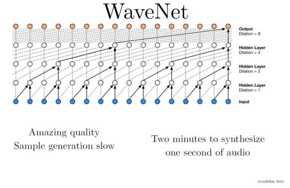
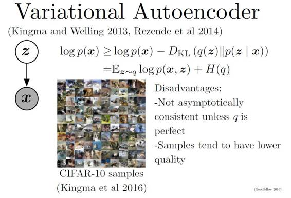
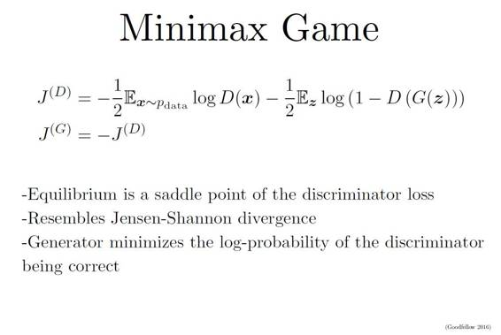
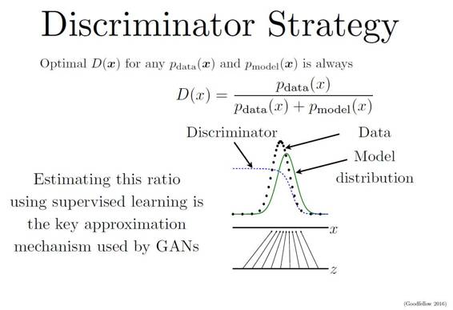
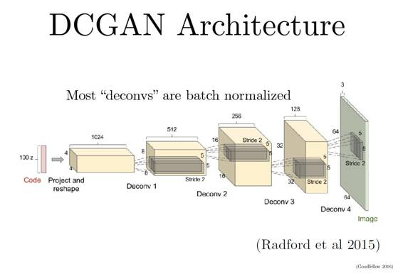
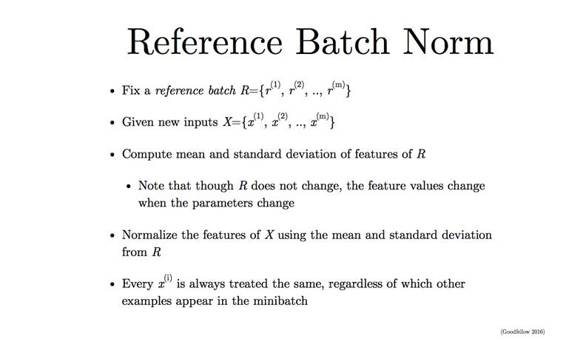
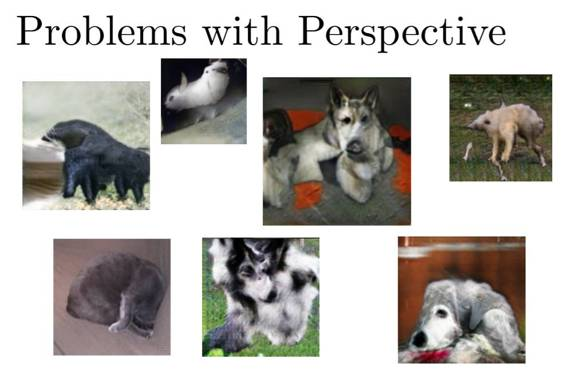

# 独家 | GAN 之父 NIPS 2016 演讲现场直击：全方位解读生成对抗网络的原理及未来（附 PPT）

机器之心原创

**作者：机器之心分析师加号、吴攀**

> *当地时间 12 月 5 日，机器学习和计算神经科学的国际顶级会议第 30 届神经信息处理系统大会（NIPS 2016）在西班牙巴塞罗那开幕。OpenAI 研究科学家 Ian Goodfellow 在会上作为主题为《生成对抗网络（Generative Adversarial Networks）》的演讲，机器之心分析师「加号」也到达了现场，并将演讲内容进行一番整理和解读之后在此进行了分享。（注：为了让复杂的概念更加「新手友好」，本篇所有备注皆为机器之心分析师「加号」自行补全，不代表 Ian Goodfellow 本人的立场与观点。）点击阅读原文可下载 PPT。*

**GAN**

Ian Goodfellow 在 NIPS 2016 上的 tutorial 演讲依旧是聊他的代表作生成对抗网络（GAN/Generative Adversarial Networks），毕竟 Ian 就是「对抗生成网络之父」。这两年，他每到大会就会讲 GAN，并且每次都会有一些新的干货，当然这次也不例外。

可以说，这几年在机器学习领域最亮最火最耀眼的新思想就是生成对抗网络了。这一思想不光催生了很多篇理论论文，也带来了层出不穷的实际应用。Yann LeCun 本人也曾毫不吝啬地称赞过：这是这几年最棒的想法！

大家都知道，LeCun 是无监督学习的头号号召者。生成对抗网络这种靠数据和模型自己的内部对抗来实现无监督学习的模型正好给人工智能的自我学习能力带来了一线曙光！

大神 Ian Goodfellow（这姓本身就很学术）是神经网络奠基人 Yoshua Bengio 的学生（跟相声一样，学术界也讲究个师承和门派。收不收学费就因人而异了。学校的发票应该还是有的）。继承了 Bengio 的步伐，Ian 在 2014 年的一篇 GAN 论文也是震惊世界，被认为是带领人类走向机器学习下一个纪元的开创性方法。Ian 在谷歌带完这一波节奏之后，便加入了「硅谷钢铁侠」Elon Musk 的 OpenAI。

OpenAI 这家酷炫的研究所是非营利的，主要目标就是做深度的人工智能研究来为人类造福，或防止人工智能失控而灭绝人类。当然，这只是个口号，本质上其实就是有钱人撒钱养一帮学界大神来提升自己在圈内的逼格。当然，他们也不计利润和 IP 地开源了大量代码和框架，这也是造福工业界和学术界的好事。GAN 作为 OpenAI 的首个高逼格成果，也在这两年得到了长足的优化和拓展。

生成模型的概念大家应该都很熟悉，大概有两种玩法：

*   密度（概率）估计：就是说在不了解事件概率分布的情况下，先假设随机分布，然后通过数据观测来确定真正的概率密度是怎样的。

*   样本生成：这个就更好理解了，就是手上有一把训练样本数据，通过训练后的模型来生成类似的「样本」。

这堂 tutorial 主要就是讲生成对抗网络以及一些技巧与前沿观点。

**为什么要学习生成模型？**

我们为什么需要生成模型？

*   这是一种对我们处理高维数据和复杂概率分布的能力很好的检测；

*   也可以为了未来的规划或模拟型强化学习做好理论准备（所谓的 model-free RL）；

*   当然，更多的情况是，我们会面临缺乏数据的情况，我们可以通过生成模型来补足。比如，用在半监督学习中；

*   可以输出多模（multimodal）结果；

*   以及很多的一些现实的需要生成模型的问题（比如，看到一个美女的背影，猜她正面是否会让你失望……）

接下来的几页幻灯片给出了一些实际的应用，比如预测影片的下一帧、去除马赛克、神笔马良等等……

**生成模型是如何工作的？GAN 跟其它模型比较有哪些优势？**

该怎么创造生成模型呢？这涉及到概率领域一个方法：最大似然估计。

大家都知道，一组相互独立事件的同时发生概率是：

而现实生活中，我们可能并不知道每个 P（概率分布模型）到底是什么，我们已知的是我们可以观测到的源数据。所以，最大似然估计就是这种给定了观察数据以评估模型参数（也就是估计出分布模型应该是怎样的）的方法。

比如，如果校长想调查全校同学的成绩，假如这个校长很懒但是统计学得很好的话，他会选择通过采样来估计一个靠谱的成绩分布。

首先，假设我们独立采样 X1,X2,......Xn 共 n 个同学的成绩，并且是我们使用的是 f 模型，只是它的参数θ未知，那么这个方程可表示为：

此刻，我们已知的是 X1......Xn，未知的是θ，那么我们的似然就可以定义为：

两边取对数，得到：

 

设

 

log L(θ|x1...xn) 称为对数似然，称为平均对数似然。那么最大的平均对数似然就是：

 

这就是幻灯片中那个公式的含义。

接下来几页幻灯片介绍了整个生成模型的大家族。

大家都同根于最大似然玩法，但是有着显隐密度的区分。大多数你们听过的强大的生成模型都需要用到马尔可夫链，而 GAN 是目前唯一一种直接从数据观测的一步到位的生成模型。（后面会讲具体原因。）

 

  

比如 Fully Visible Belief Nets 就用到了典型的显性密度链：

 

P(X1) 类似于一个先验概率，然后每往后一个数据的概率都是基于前面的已知数据的条件概率。最终得到整个模型的分布。但它的缺点也很明显：对于 N 个数据点，你得跑 N 次。也就是，这是个 O(n) 的算法。

同理，还有其它各种算法，但那些不是本篇重点，在此不做赘述。

与它们不同的是，GAN 的特点是：

*   使用了 latent code（用以表达 latent dimension、控制数据隐含关系等等）；

*   数据会逐渐统一；

*   不需要马尔可夫链；

*   被认为可以生成最好的样本（当然，ian 本人也说，这事儿没法衡量什么是「好」或「不好」）。

**GAN 是如何工作的？**

要理解生成对抗模型（GAN），首先要知道生成对抗模型拆开来是两个东西：一个是判别模型，一个是生成模型。

简单打个比方就是：两个人比赛，看是 A 的矛厉害，还是 B 的盾厉害。比如，我们有一些真实数据，同时也有一把乱七八糟的假数据。A 拼命地把随手拿过来的假数据模仿成真实数据，并揉进真实数据里。B 则拼命地想把真实数据和假数据区分开。

这里，A 就是一个生成模型，类似于卖假货的，一个劲儿地学习如何骗过 B。而 B 则是一个判别模型，类似于警察叔叔，一个劲儿地学习如何分辨出 A 的骗人技巧。

如此这般，随着 B 的鉴别技巧的越来越牛，A 的骗人技巧也是越来越纯熟。

一个造假一流的 A，就是我们想要的生成模型！

这里就是我们的生成模型了。如图所示，它把噪声数据 z（也就是我们说的假数据）通过生成模型 G，伪装成了真实数据 x。（当然，因为 GAN 依旧是一个神经网络，你的生成模型需要是可微的（differentiable））

 

训练的过程也非常直观，你可以选择任何类 SGD 的方法（因为 A 和 B 两个竞争者都是可微的网络）。并且你要同时训练两组数据：一组真实的训练数据和一组由骗子 A 生成的数据。当然，你也可以一组训练每跑一次时，另一组则跑 K 次，这样可以防止其中一个跟不上节奏。

 

同样，既然要用类 SGD 优化，我们就需要一个目标函数（objective function）来判断和监视学习的成果。在这里，J(D) 代表判别网络（也就是警察 B）的目标函数——一个交叉熵（cross entropy）函数。其中左边部分表示 D 判断出 x 是真 x 的情况，右边部分则表示 D 判别出的由生成网络 G（也就是骗子）把噪音数据 z 给伪造出来的情况。

这样，同理，J(G) 就是代表生成网络的目标函数，它的目的是跟 D 反着干，所以前面加了个负号（类似于一个 Jensen-Shannon（JS）距离的表达式）。

这其实就是我们熟悉的最小最大博弈（minimax game）：两个人的零和博弈，一个想最大，另一个想最小。那么，我们要找的均衡点（也就是纳什均衡）就是 J(D) 的鞍点（saddle point）。

对这个过程的更直观解释是这样的：

如图所示，我们手上有真实数据（黑色点，data）和模型生成的伪数据（绿色线，model distribution，是由我们的 z 映射过去的）（画成波峰的形式是因为它们都代表着各自的分布，其中纵轴是分布，横轴是我们的 x）。而我们要学习的 D 就是那条蓝色的点线，这条线的目的是把融在一起的 data 和 model 分布给区分开。写成公式就是 data 和 model 分布相加做分母，分子则是真实的 data 分布。

我们最终要达到的效果是：D 无限接近于常数 1/2。换句话说就是要 Pmodel 和 Pdata 无限相似。这个时候，我们的 D 分布再也没法分辨出真伪数据的区别了。这时候，我们就可以说我们训练出了一个炉火纯青的造假者（生成模型）。

于是，最终我们得到的应该是如下图的结果：

蓝色断点线是一条常数线（1/2），黑色与绿色完美重合了。

但是，这也是有问题的：我们的生成模型跟源数据拟合之后就没法再继续学习了（因为常数线 y = 1/2 求导永远为 0）。

为了解决这个问题，除了把两者对抗做成最小最大博弈，还可以把它写成非饱和（Non-Saturating）博弈：

 

也就是说用 G 自己的伪装成功率来表示自己的目标函数（不再是直接拿 J(D) 的负数）。这样的话，我们的均衡就不再是由损失（loss）决定的了。J(D) 跟 J(G) 没有简单粗暴的相互绑定，就算在 D 完美了以后，G 还可以继续被优化。

在应用上，这套 GAN 理论最火的构架是 DCGAN（深度卷积生成对抗网络/Deep Convolutional Generative Adversarial Network）。熟悉卷积神经网络（CNN）的同学对此应该不会陌生，这其实就是一个反向的 CNN。

卷积神经网络的原理是用一个叫做 convolutinoal filter（卷积过滤器，类似于滤镜）的东西把图片过滤（转化）成各种样式（就好像美图软件里面的滤镜效果）。很多这样的滤镜就可以把图片变成很多种样式。我们假设这些样式是原图片各种不同的特征表达（比如，黑白滤镜可以把图片变黑白，让你可以看出更多彩色世界里关注不到的重点；边缘虚化滤镜是把图片虚化，你也许又能看到不同的端倪。一层层这样跑下去，你就会得到原图片的各种非常详尽的特征表达。注意：这个滤镜也不是人选的，而是被慢慢学习到的，不用你操心）。

 

相反，DCGAN 目的是创造图片，其实就类似于把一组特征值慢慢恢复成一张图片。

所以两者的比较就是：在每一个滤镜层，CNN 是把大图片的重要特征提取出来，一步一步地减小图片尺寸。而 DCGAN 是把小图片（小数组）的特征放大，并排列成新图片。这里，作为 DCGAN 的输入的最初的那组小数据就是我们刚刚讲的噪声数据。

 

下面几页幻灯片给出了一些案例效果。

  

因为图片本身就是个 RGB 的矩阵，所以我们甚至可以通过向量加减来得到一些有趣的运算结果：

*戴墨镜的男人 - 不戴墨镜的男人 + 不戴墨镜的女人 = 戴墨镜的女人*

熟悉 NLP 的同学可能发现了，这就很像 word2vec 里面的：king - man + woman = queen。做个向量/矩阵加减并不难，难的是把加减后得到的向量/矩阵还原成「图义」上代表的图片。在 NLP 中，word2vec 是把向量对应到有意义的词；在这里，DCGAN 是把矩阵对应到有意义的图片。

刚刚我们讲了 J(G) 的两种方法，它们给 GAN 带来了两种不同的求解方式。

除了以上提到的两种书写 J(G) 的方法，最近的几篇论文又提出了一些新观点。熟悉统计学科的同学应该都知道，说到 JS 距离（也就是刚刚在 minimax 处提到的），就会想到 KL 距离；它们都是统计学科中常用的散度（divergence）方程。

散度方程是我们用来创造目标函数的基础。

GAN 作为一个全由神经网络构造并通过类 SGD 方法优化的模型，目标函数的选择是至关重要的。Ian 给我们展示了一下选择好的散度方程（并转化成 GAN 所需的目标函数）的重要性：

这里，Q 指的是我们手头噪音数据的分布，P 指的是需要找寻的目标分布。

首先，我们要知道的是，求最大似然（Maximum Likelihood）可以被看作是使 KL 距离最小化的方法。怎么解释？你自己化简一下 KL 公式就能知道：

 

其中 P、Q 都以 x 为变量；并且 P 是真实数据分类，

 

因此是个常数，

 

之中也只有（logQ）部分是变量，于是我们把公式化简成：

 

即正比于-logQ。

在严肃的表示中，Q 应该写为 P(x|θ)；其中 P 是模型，θ是参数，那么，原式也就是一个负的最大似然（详见前面的相应部分）。

不管是 KL(Q || P) 还是 KL(P || Q)，它们写出来都是一种类 Maximal Likelihood（最大似然）的表达形式。我们会把这类 G 的目标函数的书写方法算作一类。其实，在最近的各种论文中也提出，其实我们可以用类 GAN 的算法来最小化任何 f-divergence 方程。

但是，在之后的几篇论文中，很多学者（包括 Ian 本人）都提到，使用 KL(Q || P) 更能模拟出我们所面临的情景。而本质上讲，标准的 Maximum Likelihood 思维写出来就应该是 KL(P || Q) 的形式。

这是什么意思呢？这个过程与解释比较复杂，高阶玩家可以阅读 GoodFellow 2016 年的新论文，我这里给大家用简单的语言来说明一下：

首先，不管是 Q 在前还是 P 在前，面对无限多的数据的时候，我们都可以最终学到完美符合我们心声的真实数据分布 P。但是问题就在于，现实生活中，我们拿到的数据是有限的。我们的学习过程可能不能持续到最后模型完美的时刻。所以这里，区别就出现了：根据 KL 公式的理论意义，KL(P || Q) 里的 Q 是用来拟合真实数据 P 的，它会极大地想要解释全部 P 的内涵（overgeneralization）。这时候，遇到多模态（multimodal）的情况（比如一张图中的双峰，羞羞），KL(P || Q) 会想要最大地覆盖两座峰。如果此时数据并不够多，它会在覆盖到一半的路上就停了下来。

相反，KL(Q || P) 是一种 undergeneralization 的情况。一个被优化的 Q 一般会先想着去覆盖一个比较大的峰，有空了再去看另一个峰。

再换句话说，它们俩一个是激进派一个是保守派。而因为我们数据是有限的，在复杂的社会环境下，保守派能确保至少算出来的那一部分是靠谱的，而激进派却容易犯错。

先不管 Q 和 P 谁前谁后，我们都把我们 G 的目标函数改造成解最大似然的形式：

此时对 J(G) 求导，得到的就是一个最大似然表达形式。（为什么要求导？请自行搜索 SGD（随机梯度下降））

以上我们讲到的三种生成模型目标函数的方法，效果比较如下：

其中，还是 Maximal Likelihood 最像香港记者，跑得最快。

GAN 不光可以用来生成（复刻）样本，还可以被转型成强化学习模型（Reinforcement Learning）

关于这方面，上海交大的 SeqGAN [Yu et al. 2016] 也是一片很有趣的论文，有兴趣的同学可以阅读。

以上便是这篇教程的前半部分内容，主要是讲解了生成模型和 GAN 的一些理论知识。而后半部分则从实际运用中的技巧开始，延伸到了这个门类发展的前沿，并探索了 GAN 与其它算法结合的可能。

**Tips and Tricks 实战技巧**

**第一个技巧是把数据标签给 GAN**

虽然 GAN 是一种无监督算法。但是，如果要想提高训练学习的效果，有点标签还是会有很大的帮助的。也就是说，学习一个条件概率 p(y|x) 远比一个单独的 p(x) 容易得多。

实际运用中，我们可以只需要一部分有标签数据（如果有的话）就能大幅提升 GAN 的训练效果；我们称之为半监督（semi-supervising）。当然，要注意的是，如果我们用了半监督学习，我们的数据就有三类了：真实无标签数据、有标签数据和由噪音数据生成的数据。它们互相之间是不能混的。同时，我们的目标函数也成了监督方法和无监督方法的结合。

跟其它机器学习算法一样，如果我们给了 GAN 一些有标签的数据，这些标签最好是平滑（smooth）过的，也就是说把要么是 0 要么是 1 的离散标签变成更加平滑的 0.1 和 0.9 等等。

然而，这样又会造成一些数学问题。因为，如果我们的真实数据被标注为 0.9（alpha），假数据被标注为 0.1（beta），那么我们最优的判别函数就会被写成如下图所示的样式。大家发现问题了吗？这个式子的分子不纯洁了，混进了以 beta 为系数的假数据分布。所以，对于假数据，我们还是建议保留标签为 0。一个平滑，另一个不平滑，也就称为 one-sided label smoothing（单边标签平滑）。

**** 

标签平滑化有很多好处，特别对于 GAN 而言，这能让判别函数不会给出太大的梯度信号（gradient signal），也能防止算法走向极端样本的陷阱。

**第二个技巧是 Batch Norm**

 

Batch Norm 的意思就是说，取「一批」数据，把它们给规范化（normalise）一下（减平均值，除以标准差）。它的作用就不用说了：让数据更集中，不用担心太大或者太小的数据，也让学习效率更高。

不过直接用 batch norm 也有问题的。同一批（batch）里面的数据太过相似，对一个无监督的 GAN 而言，很容易被带偏而误认为它们这些数据都是一样的。也就是说，最终的生成模型的结果会混着同一个 batch 里好多其它特征。这不是我们想要的形式。

所以，我们可以使用 Reference Batch Norm：

 

取出一批数据（固定的）当作我们的参照数据集 R。然后把新的数据 batch 都依据 R 的平均值和标准差来做规范化。

这个方法也有一些问题：如果 R 取得不好，效果也不会好。或者，数据可能被 R 搞得过拟合。换句话说：我们最后生成的数据可能又都变得跟 R 很像。

所以，再进阶一点，我们可以使用 Virtual Batch Norm

这里，我们依旧是取出 R，但是所有的新数据 x 做规范化的时候，我们把 x 也加入到 R 中形成一个新的 virtual batch V。并用这个 V 的平均值和标准差来标准化 x。这样就能极大减少 R 的风险。

**第三个技巧：平衡好 G 和 D**

通常，在对抗网络中，判别模型 D 会赢。并且在实际中，D 也比 G 会深很多。Ian 建议大家不要太担心 D 会变得太聪明，我们可以用下面这些方法来达到效果最大化：

*   就像之前说的，使用非饱和（non-saturating）博弈来写目标函数，保证 D 学完之后，G 还可以继续学习；

*   使用标签平滑化。

**研究前沿**

GAN 依旧面临着几大问题。

问题 1：不收敛

现在 GAN 面临的最大问题就是不稳定，很多情况下都无法收敛（non-convergence）。原因是我们使用的优化方法很容易只找到一个局部最优点，而不是全局最优点。或者，有些算法根本就没法收敛。

模式崩溃（mode collapse）就是一种无法收敛的情况，这在 Ian 2014 年的首篇论文中就被提及了。比如，对于一个最小最大博弈的问题，我们把最小（min）还是最大（max）放在内循环？这个有点像刚刚说的 reverse KL 和 maximum likelihood 的区别（激进派和保守派）。minmax V(G,D) 不等于 maxmin V(G,D)。如果 maxD 放在内圈，算法可以收敛到应该有的位置，如果 minG 放在内圈，算法就会一股脑地扑向其中一个聚集区，而不会看到全局分布。

大家觉得这个特性是不是跟我们上面提到的什么东西有点像？对咯，就是 reverse KL！

因为 reverse KL 是一种保守派的损失（loss），有人觉得可能使用 reverse KL 会导致模式崩溃（mode collapse），但 Ian 表示，实际上其他的任何目标函数都可能会造成模式崩溃，这并不能解释问题的原因。

我们可以看到，遇到了模式崩溃，我们的数据生成结果就会少很多多样性，基本上仅会带有部分的几个特征（因为学习出来的特征都只聚集在全部特征中几个地方）。

为了解决这个问题，目前表现最好的 GAN 变种是 minibatch GAN。

把原数据分成小 batch，并保证太相似的数据样本不被放到一个小 batch 里面。这样，至少我们每一次跑的数据都足够多样。原理上讲，这种方法可以避免模式崩溃。（更多的优化方法还有待学界的研究。）

接下来这几页幻灯展示了使用 minibatch GAN 的效果：

当然，还有一些尴尬的问题依旧是「未解之谜」。

这里你们看到的，已经是精挑细选出来的好图片了，然而…

生成的图片的细节数量经常会被搞错：

 

对于空间的理解会搞错。因为图片本身是用 2D 表示的 3D 世界，所以由图片样本生成的图片，在空间的表达上不够好。比如，生成的小狗似乎是贴在墙上的 2D 狗:

 

奇怪的东西会出现：

 

说到这里，Ian 开了一个玩笑，放出了一张真实的猫的姿势奇异的照片（虽然很奇怪，但喵星人还是办到了！）：

 

除了 minibatch 之外，另一种 GAN 的模型变种是 unrolling GAN（不滚的 GAN）。也就是说，每一步并不把判别模型 D 这个学习的雪球给滚起来，而是把 K 次的 D 都存起来，然后根据损失（loss）来选择最好的那一个。它的效果似乎也不错。

 

问题 2：评估

 

对于整个生成模型领域来说，另一个问题是没法科学地进行评估。比如你拿一堆图片生成另一堆图片，可是这两批图片其实可能看起来天差地别。人可以判断出生成的小狗照片对不对，机器却没法量化这个标准。

问题 3：离散输出

到目前为止我们提到的输出或者案例都是连续的情况。如果我们的 G 想要生成离散值，就会遇到一个数学问题：无法微分（differentiate）。当然，这个问题其实在 ANN 时代就被讨论过，并有很多解决方案，比如，Williams(1992) 经典的 REINFORCE、Jang et al.(2016) 的 Gumbel-softmax、以及最简单粗暴地用连续数值做训练，最后框个范围，再输出离散值。

问题 4：强化学习的连接。GAN 在给强化学习做加持的时候，也有点问题。首先，GAN 与强化学习的配合使用，目前大概比较火的有如下几篇论文（这里不做深入了，有兴趣的同学请自行阅读）：

如果把 GAN 加持过的 RL 用在各种游戏的学习中，GAN 该有的问题其实还是会有：

*   无法收敛；

*   面对有限步数的游戏，穷举更加简单粗暴，并且效果好；

*   如果游戏的出招是个连续值怎么办？（比如《英雄联盟》中，Q 下去还得选方向，R 起来还得点位置，等等）；

*   当然，可以用刚刚说的 unrolling 来「探寻」最优解，但是每一步都要记 K 个判别模型，代价太大。

** 将 GAN 与其它方法结合**

GAN 不光自身有变种和优化，也能被其它算法融合吸收，进而发挥出强大的效果：

这就是在 NIPS 几天前刚刚发布的 PPGN（Plug and Play Generative Models/即插即用生成模型）(Nguyen et al, 2016) 了。这是生成模型领域新的 State-of-the-art（当前最佳）级别的论文。它从 ImageNet 中生成了 227*227 的真实图片，是目前在这个数据集上跑得最惊人的一套算法。

Ian 本人也表示惊呆了，目测明年肯定是要被狂推上各种会议。（机器之心也会在第一时间给大家解读）

效果图（跟刚刚 Ian 自己的例子相比，差距确实还是肉眼看得出来的）：

这时候有人要问了：刚刚不是说 minibatch GAN 表现最好吗？

哈哈，这就是一个学术界的分类梗了。不管是加上 minibatch 还是 unrolling，它们本质上还是 GAN。而 PPGN 不是 GAN 构架，它可以说是融合了包括 GAN 在内的很多算法和技巧的有新算法。

Ian 顺便夹了点私活：他说 PPGN 如果不带上 GAN，立马崩。

 

**总结**

*   GAN 是一种用可以利用监督学习来估测复杂目标函数的生成模型（注：这里的监督学习是指 GAN 内部自己拿真假样本对照，并不是说 GAN 是监督学习）。

*   GAN 可以估测很多目标函数，包括最大似然（Maximum likelihood）（因为这是生成模型大家族的标配）。

*   在高维度+连续+非凸的情况下找到纳什均衡依旧是一个有待研究的问题（近两年想上会议的博士生们可以重点关注）。

*   GAN 自古以来便是 PPGN 不可分割的重要部分。（看到自己的理论基础被运用到一个新高度，GAN 之父会心一笑~）

******©本文为机器之心原创文章，***转载请联系本公众号获得授权******。***

✄------------------------------------------------

**加入机器之心（全职记者/实习生）：hr@almosthuman.cn**

**投稿或寻求报道：editor@almosthuman.cn**

**广告&商务合作：bd@almosthuman.cn**