# 深度 | 深度学习能力的拓展，Google Brain 讲解注意力模型和增强 RNN

选自 distill.pub

**机器之心编译**

**参与：吴攀、李亚洲、孙宇辰、Jianyong Wang**

> *本文的作者是 Google Brain 的两位研究者 Chris Olah 和 Shan Carter，重点介绍了注意力和增强循环神经网络，他们认为未来几年这些「增强 RNN（augmented RNN）」将在深度学习能力扩展中发挥重要的作用。*

循环神经网络（recurrent neural networks）是深度学习的重要组成部分，让神经网络可以处理诸如文本、音频和视频等序列数据。它们可被用来做序列的高层语义理解、序列标记，甚至可以从一个片段生产新的序列！

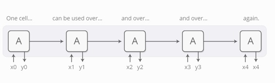 

基本的 RNN 结构难以处理长序列，然而一种特殊的 RNN 变种即「长短时记忆模型（LSTM）」网络可以很好地处理长序列问题。这种模型能力强大，能在翻译、语音识别和图像描述等众多任务中均取得里程碑式的效果。因而，循环神经网络在最近几年已经得到了广泛使用。

正如所发生的一样，我们看到给 RNN 添加新性能的研究工作越来越多。其中有四个特别突出的方向非常激动人心：

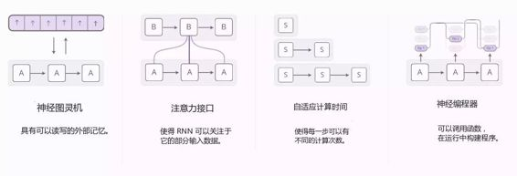 

这些技术都是 RNN 非常有效的扩展，但真正引人注目的是它们可以有效地组合起来，而且似乎正要进入一片更为广阔的天地。此外，它们都依赖于注意力（attention）这样一种同样基础的技术才能有效。

我们认为未来几年这些「增强 RNN（augmented RNN）」将在深度学习能力扩展中发挥重要的作用。

**神经图灵机**

神经图灵机（Graves, et al., 2014）是一个 RNN 和一个外部存储库的结合。由于向量（vector）是神经网络的自然语言，所以这个记忆是一个向量数组：

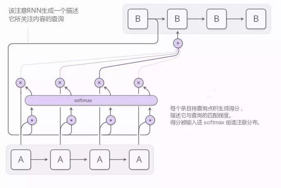

但是，读和写是怎么工作的呢？其难点在于我们想让它们可微分（differentiable）。尤其是，我们想让它们对于我们读或写的位置是可微的，以使得我们可以学习读和写的位置。这是棘手的，因为内存地址似乎从根本上就是离散的。神经图灵机（NTM）运用了一种非常聪明的解决方案：在每一步，它们以不同程度在所有地方都进行读和写。 

让我们举一个关于读的例子。RNN 给出一个「注意力分配」来描述我们在所关心的不同记忆位置展开多少，而不是指定一个位置。因此，读操作的结果是一个加权和（weighted sum）。

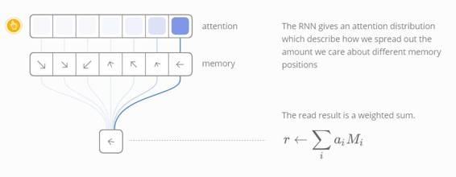 

同样地，我们以不同程度同时在所有地方执行写操作。同时一个注意力分布描述了我们在每个位置写的多少。我们通过获得一个存储位置中的新的值来实现这一点，这个值是由旧记忆和写入值与由注意力权重决定的两者之间位置的凸组合。

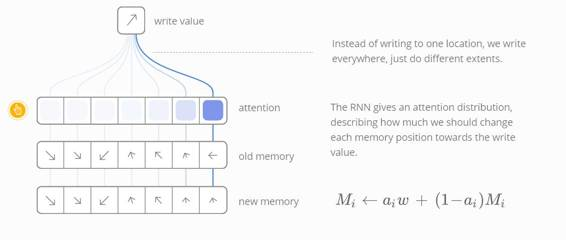 

但是，NTMs 如何决定应该关注记忆中的哪些位置呢？实际上，他们使用了两种方法的组合：基于内容的注意力和基于位置的注意力。基于内容的注意力使 NTMs 可以在记忆中查找并关注与那些与查找相匹配的地方，而基于位置的注意力可以实现记忆中的相对运动，从而使 NTM 可以循环。

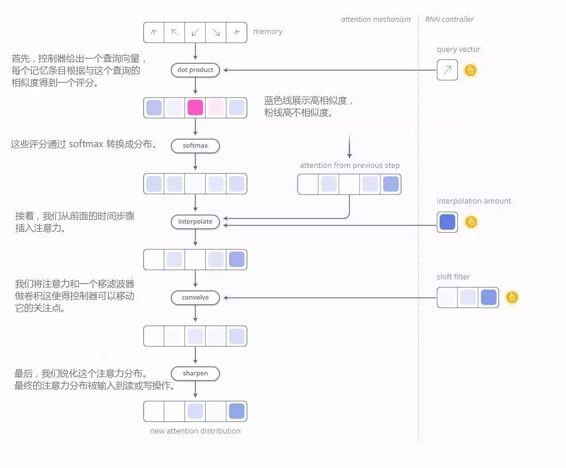 

这种读写能力使得 NTMs 可以执行许多简单的算法，超越以前的神经网络。例如，它们可以学习在记忆中存储一个长序列，然后循环它，不断回答指令。当它们做这些时，我们可以看他们读写的位置，以更好地了解他们在做什么：

他们也可以学习模仿一个查阅表，甚至学习排序（尽管他们有些作弊）！在另一方面，他们始终不能做数字加法、乘法等许多基本的事情。

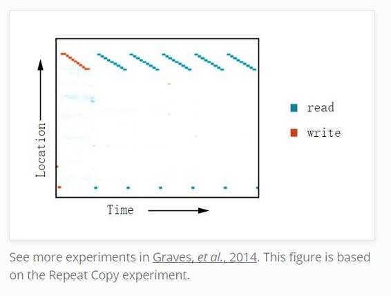 

从原始的 NTM 论文开始，已经有许多令人振奋的论文探讨相似的方向。神经 GPU（Kaiser & Sutskever，2015）克服 NTM 无法处理数字加法和乘法的问题。Zaremba & Sutskever 在 2016 年采用强化学习来训练 NTMs，而不是原始的可微的读/写。神经随机存取机 (Kurach et al., 2015) 基于指针工作。一些论文已经探讨可微的数据结构，如堆栈和队列 (Grefenstette et al. 2015; Joulin & Mikolov, 2015)。另外，记忆网络 (Weston et al., 2014; Kumar et al., 2015) 是攻克类似问题的另一种方式。

在某些客观意义上，这些模型可执行许多任务，如学习如何做数字加法，都不是很难。对传统的程序合成领域来说只是小菜一碟。但是神经网络可以做许多其他事情，而像神经图灵机这样的模型似乎已经打破了对它们能力的极大限制。

**代码**

有一些实现这些模型的开源代码。神经图灵机的开源实现包括 Taehoon Kim (TensorFlow)、Shawn Tan (Theano)、Fumin (Go)、Kai Sheng Tai (Torch)、和 Snip (Lasagne) 做的部署。神经 GPU 公开版的代码是开源的，并放在 TensorFlow 模型库。记忆网络的开源实现包括 Facebook (Torch/Matlab)、YerevaNN (Theano)、和 Taehoon Kim (TensorFlow)。

**注意力接口**

当我翻译一个句子时，我会尤其关注于我正在翻译的单词。当我转录一个音频，我会仔细听我正在写的那一段。如果你让我来描述我所坐的房间，我会随时把目光转移到我正在描述的物体上。

神经网络可以通过注意力来实现同样的行为——关注所收到信息子集的一部分。例如，一个 RNN 参与另一个网络的输出。在每一个时间步骤，它会关注于另一个 RNN 的不同位置。

我们希望注意力是可微的，这样我们就可以学习关注哪里。为了做这个，我们使用了和神经图灵机中一样的 trick：关注所有位置，只是程度不一样。

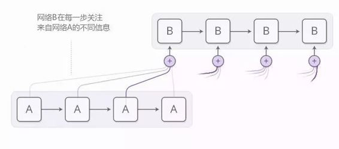 

通常是使用基于内容的注意力生成注意力分布。参与的 RNN 会生成一个描述它想关注内容的查询。每一个条目和这个查询做点乘来产生一个分数，这个分数描述这个条目与查询匹配程度。这些分数被输入一个 softmax 来生成注意力分布。

 

RNNs 之间注意力的一个应用是翻译 (Bahdanau, et al. 2014)。一个传统的序列到序列模型需要将整个输入抽象成一个向量，然后将它展开回复出来。注意力规避了这种做法，它让 RNN 沿着它看见的每个单词信息来处理输入，然后让 RNN 生成输出来关注到具有相关性的单词上。

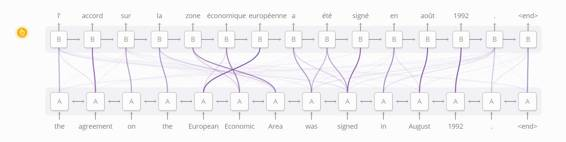
*Diagram derived from Fig. 3 of Bahdanau, et al. 2014*

这种 RNNs 之间的注意力有许多其他应用。它可以用来做语音识别 (Chan, et al. 2015)，使得一个 RNN 处理语音，另一个 RNN 浏览它，使其在生成文本时可以集中在相关的部分上。

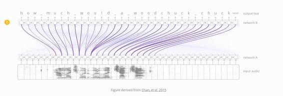 

这种注意力的其他应用包括：文本解析 (Vinyals, et al., 2014)，它使模型在生成解析树时能浏览单词；对话建模 (Vinyals & Le, 2015)，使模型在生成响应时关注于对话的前面部分。

注意力同样可以用在卷积神经网络和 RNN 的接口。它使得 RNN 在每一步可以观察一张图像的不同位置。这种记忆力的一个流行应用就是图片描述（image captioning）。首先，一个卷积网络处理图片提取高层特征。然后一个 RNN 开始运营，生成一段对图像的描述。在生成这个描述的每一个单词时，RNN 关注于图像相关部分的卷积网络解释。如下图：

 

更广泛地说，当希望与一个在输出具有重复结构的神经网络交互时，注意力接口都可以被采用。

我们发现，注意力接口已经是一个非常普遍和强大的技术，并且正变得越来越普遍。

**自适应计算时间**

标准 RNN 在每一个时间步骤完成相同的计算量。这看起来不是很直观。一个人当然在问题变得困难的时候思考的更多，不是么？这也限制了 RNN 在 长度为 n 的链表上完成 O(n) 的运算。

自适应计算时间（Graves，2016），是让 RNN 在每一步有不同计算量的方式。核心想法很简单：允许 RNN 在每一时间步骤做多个计算步骤。

为了让网络学习有多少步骤要做，我们想要步骤的数量是可微分的。我们采用之前用过的技巧完成这项任务：不再是决定运行不连续数量的步骤，而是有一个在运行步骤数量上的注意分布。输出是每个步骤输出的加权求和。

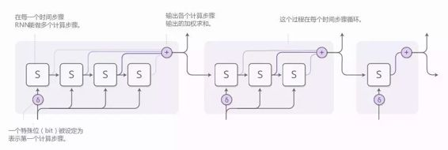

有一些细节在先前的图解中被忽视了。这儿是一个完整的、包含一个时间步骤、三个计算步骤的图解。

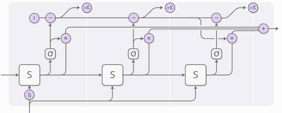 

这里稍有些复杂，所以让我们一步一步解决。在高层次上，我们仍运行着 RNN，并输出状态的加权求和：

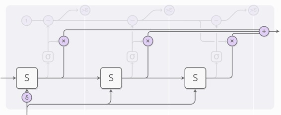 

每一步的权值由「阻止神经元（halting neuron）」所决定。它是一个考察 RNN 状态的 S 型神经元，并产生一个阻止权值，我们可以认为这个权值是我们应该在那个步骤停下来的概率。

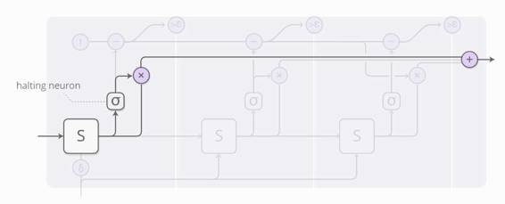

我们对于阻止权重（halting weight）为 1 的有总预算，所以我们顺着顶层跟踪这个预算。当这个值小于 epsilon，我们停止。

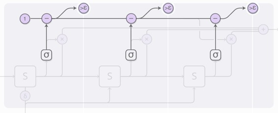

由于我们是当预算值小于 epsilon 的时候停止，当我们停止时可能会剩余一些阻止预算（halting budget）。我们应该用它做什么呢？技术上，它应被赋予给未来的步骤，但是我们不想计算那些，所以我们将它归属于最后一个步骤。

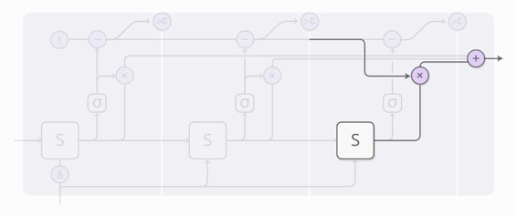 

当在训练自适应计算时间模型时，有人在成本函数中增加了「考虑成本（ponder cost）」这一术语。它对模型使用的计算量予以处罚。这个值越大，在性能和降低计算时间进行更多地权衡。

自适应计算时间是非常新的想法，但是我们相信，与其他类似的想法一样，它们都将是非常重要的想法。

**代码**

如今，部署自适应计算时间的唯一一个开源，看起来是 Mark Neumann（https://github.com/DeNeutoy/act-tensorflow）做的。（TensorFlow）

**神经编程器（Neural Programmer）**

神经网络在许多任务上表现出色，但是它们也在努力做一些基础事情，例如用普通方法计算很琐碎的算数。如果有一种方式能融合神经网络与普通的编程，并吸收各自最好的东西，那真是太好了。

神经编程器（Neelakantan，et al.，2015）是其中一种方式。为了解决一项任务，它学习创建程序。事实上，在不需要正确的程序样本的情况下，它学习生成这样的程序。它发现如何生产程序，并把它作为完成任务的手段。

论文中的实际模型回答了关于产生类 SQL 的程序查询表格的问题。然而，这有很多的细节使得这个问题稍有些复杂，所以让我们从想象一个稍简单的模型开始，给定一个算术表达式，并生成一个程序对其进行评估。

生成程序是一系列的运算。每个运算被定义为在上个运算输出上做运算。所以一个运算可能是例如「在两个步骤前的输出运算和一个步骤前的输出运算相加」这样的事情。这相比与一个有着可被赋值与读取的变量的程序，更像是 Unix 中的管道（pipe）。

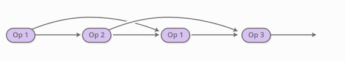 

程序挨次通过控制器 RNN 生成一个运算。在每一步，控制器 RNN 输出一个概率分布，决定下一个运算该是什么。例如，我们可能非常确定我们想要在第一个步骤执行加法，然后要有有一个艰难的时间决定第二步我们应该是乘法还是除法，等等下去......

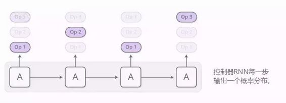

运算上的结果分布可被评估。不再是在每一步运行单个运算，如今我们采用常见的注意技巧运行所有运算，之后平均所有输出，通过我们运行这些运算的概率对其加权。 

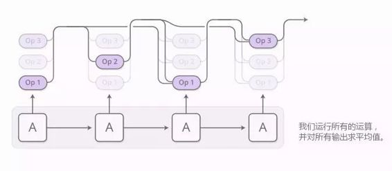

只要我们通过该运算能够定义导数，关于概率的程序输出就是可微分的。之后我们就能定义损失，并训练神经网络生成得到正确答案的程序。在这种方式中，神经编程器在没有正确程序样本的情况下学习产生程序。唯一的监督是程序应该得到的答案。

这就是神经编程器的核心观点，但论文中回答的是关于表格的问题，而不是数学表达式的问题。下面是一些额外的灵活技巧：

*   多类别：神经编程器中的很多预算都是处理类型而不是标量数。一些运算输出表格中选中的列或是选中的单元。只有输出相同类型的会合并在一起。

*   基准输入：在给定人口的城市表格情况下，神经编程器需要回答例如「有多少城市人口超过 1000000？」这样的问题。为了使这项任务更容易，一些运算允许网络参考它们正在回答的问题或是类名中的常量。参考通过注意机制以指针网络的形式（Vinyals，et al.，2015）而产生。

神经编程器不是唯一让神经网络生成程序的方式。另一个令人愉快的方式是神经编程器——解释器（Neural Programmer-Interpreter，Reed & de Freitas，2015），它能够完成许多非常有趣的任务，但是形式上需要正确程序的监督。

我们认为缩小传统编程与神经网络之间的差距是极其重要的。虽然神经编程器显然不是最终的解决方案，但我们认为从它之中能学习到许多重要的思路。

**代码**

现在看起来没有任何神经编程器的开源部署，但是有一个 Ken Morishita（https://github.com/mokemokechicken/keras_npi）部署的神经编程器——解释器。（Keras）

**巨大的蓝图**

拥有一张纸的人在某些意义上比没有的人要更聪明。会使用数字符号的人可以解决一些问题，反之则不然。使用计算机可以使我们掌握超越自身的令人难以置信的技能。

总之，智能很多有趣的形式是人类富有创造力和启发性的直觉与更加脆弱细致的媒介（就像语言和方程式）之间的交互。有时，媒介是物理实体，保存我们的信息，防止我们犯错误，或者处理繁重的计算任务。另一方面，媒介是我们可以控制的大脑里的模型。无论哪种方式，它看起来都是智能的深厚基础。

最近在机器学习的研究结果已经开始呈现这种趋势，将神经网络的直觉与其他事物结合起来。有一种被称为「启发式搜索」的方法。例如，AlphaGo（Silver，et al.，2016）有个关于围棋如何运作的模型，并探索如何在神经网络的直觉指引下完成比赛。相似的，DeepMath（Alemi，et al.，2016）把神经网络作为对处理数学公式的直觉。我们在这篇文章中谈到的「增强递归神经网络」是另一种方式，我们将 RNNs 连接到工程媒介来延伸它们的通用能力。

与媒介自然交互涉及到采取行动、观察、采取更多行动等一系列操作。这给我们带来一项重大挑战——我们如何学习采取哪种行动？这看起来像是一个强化学习问题，我们将毫无疑问采用那种方式。但强化学习的研究确实正在攻克最难的问题，它的解决方案很难用。而注意力的绝妙支出在于它提供给我们一个更容易的方式，通过部分的在不同程度上采取所有去解决这个问题。在这种方法下，我们能够设计媒介——例如 NTM 存储器——允许分数运算以及可微。强化学习让我们走向单一道路，并尝试从中学习。而注意力会尝试岔路口的每一个方向，并将道路合并到一起。

注意力的一个主要弱点是我们必须完成每步中的每个「行动」。当一个神经图灵机中的记忆量增加时，计算开销会呈线性增长。对此你可以想到一个解决方案，即让你的注意力变得稀疏，这样你就可以只接触到一些记忆。然而这仍然是个挑战，因为你可能希望你的注意力完全基于记忆内容，以使你可以轻易的观察到每一个记忆。我们已经观察到一些可以攻克这个问题的初步尝试，例如 Andrychowicz & kurach 所提出的方法，但看起来还有更多的事情要去做。如果我们确实能做到类似次线性时间注意力工作，那将非常强大！

增强式递归神经网络，以及注意力的潜在技术，是非常令人激动的。我们期待看到接下来会发生什么。

**参考文献：**

*   Alemi, A. A., Chollet, F., Irving, G., Szegedy, C., & Urban, J. (2016). DeepMath-Deep Sequence Models for Premise Selection. arXiv preprint arXiv:1606.04442.

*   Andrychowicz, M., & Kurach, K. (2016). Learning Efficient Algorithms with Hierarchical Attentive Memory. arXiv preprint arXiv:1602.03218.

*   Bahdanau, D., Cho, K., & Bengio, Y. (2014). Neural machine translation by jointly learning to align and translate. arXiv preprint arXiv:1409.0473.

*   Chan, W., Jaitly, N., Le, Q. V., & Vinyals, O. (2015). Listen, attend and spell. arXiv preprint arXiv:1508.01211.

*   Graves, A., Wayne, G., & Danihelka, I. (2014). Neural turing machines. arXiv preprint arXiv:1410.5401.

*   Graves, A. (2016). Adaptive Computation Time for Recurrent Neural Networks. arXiv preprint arXiv:1603.08983.

*   Grefenstette, E., Hermann, K. M., Suleyman, M., & Blunsom, P. (2015). Learning to transduce with unbounded memory. In Advances in Neural Information Processing Systems (pp. 1828-1836).

*   Joulin, A., & Mikolov, T. (2015). Inferring algorithmic patterns with stack-augmented recurrent nets. In Advances in Neural Information Processing Systems (pp. 190-198).

*   Kaiser, Ł., & Sutskever, I. (2015). Neural gpus learn algorithms. arXiv preprint arXiv:1511.08228.

*   Kumar, A., Irsoy, O., Su, J., Bradbury, J., English, R., Pierce, B., Ondruska, P., Gulrajani, I. & Socher, R., (2015). Ask me anything: Dynamic memory networks for natural language processing. arXiv preprint arXiv:1506.07285.

*   Kurach, K., Andrychowicz, M., & Sutskever, I. (2015). Neural random-access machines. arXiv preprint arXiv:1511.06392.

*   Neelakantan, A., Le, Q. V., & Sutskever, I. (2015). Neural programmer: Inducing latent programs with gradient descent. arXiv preprint arXiv:1511.04834.

*   Olah, C. (2015). Understanding LSTM Networks.

*   Reed, S., & de Freitas, N. (2015). Neural programmer-interpreters. arXiv preprint arXiv:1511.06279.

*   Silver, D., Huang, A., Maddison, C.J., Guez, A., Sifre, L., Van Den Driessche, G., Schrittwieser, J., Antonoglou, I., Panneershelvam, V., Lanctot, M. & Dieleman, S. (2016). Mastering the game of Go with deep neural networks and tree search. Nature, 529(7587), 484-489.

*   Vinyals, O., Kaiser, Ł., Koo, T., Petrov, S., Sutskever, I., & Hinton, G. (2015). Grammar as a foreign language. In Advances in Neural Information Processing Systems (pp. 2773-2781).Vinyals, O., & Le, Q. (2015). A neural conversational model. arXiv preprint arXiv:1506.05869.

*   Vinyals, O., Fortunato, M., & Jaitly, N. (2015). Pointer networks. In Advances in Neural Information Processing Systems (pp. 2692-2700).

*   Weston, J., Chopra, S., & Bordes, A. (2014). Memory networks. arXiv preprint arXiv:1410.3916.

*   Xu, K., Ba, J., Kiros, R., Cho, K., Courville, A., Salakhutdinov, R., Zemel, R.S. & Bengio, Y., 2015\. (2015). Show, attend and tell: Neural image caption generation with visual attention. arXiv preprint arXiv:1502.03044, 2(3), 5.

*   Zaremba, W., & Sutskever, I. (2015). Reinforcement learning neural Turing machines. arXiv preprint arXiv:1505.00521, 362.

******©本文由机器之心编译，***转载请联系本公众号获得授权******。***

✄------------------------------------------------

**加入机器之心（全职记者/实习生）：hr@almosthuman.cn**

**投稿或寻求报道：editor@almosthuman.cn**

**广告&商务合作：bd@almosthuman.cn**