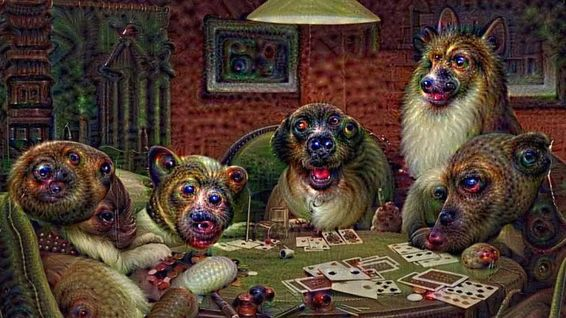

# 深度 | 人工智能改变 MIDI 创作：谷歌 Magenta 项目是如何教神经网络编写音乐的？

选自 FastCompany

**作者：TINA AMIRTHA**

**机器之心编译**

**参与：Rick、李泽南**

> *谷歌和一些科学家正在利用 30 年的的数字音乐标准 MIDI 来教神经网络编写音乐。*

今年 5 月，谷歌研究科学家 Douglas Eck 离开了他在硅谷的办公室，前往北卡罗莱纳州大烟山深处参加 Moogfest 艺术节，那里汇集了音乐、艺术和技术爱好者。Eck 向参加艺术节的资深音乐迷们讲述了其团队通过训练计算机来帮助音乐人编写音乐的新成果——在一首歌中生成和弦、创造过渡，以及精心设计反复的旋律。总有一天，机器可以学会完全靠自己去写一首歌。

Eck 还不能在艺术节上表演——这项活动深受 Moog 合成器的传奇创造者以及音乐人与电音咖们的影响——他只是简单介绍一下其团队充满挑战性的项目。要「学习」如何创造艺术和音乐，Eck 及其同事需要用户们使用 MIDI 来向机器供给大量数据，这是一种通常用来为小体量电子游戏提供背景音乐的数字音乐格式。

多年来，研究人员一直在进行人工智能生成音乐的试验。索尼法国计算机科学实验室中的科学家们最近发布了两首号称首次用人工智能生成的流行歌曲，它们是由其内部的人工智能算法创作（尽管它们是由一位人类音乐家 Benoît Carré 改编和作词的。）。他们的人工智能平台 FlowMachines 在过去也使用 MIDI 创作了爵士乐和古典乐。Eck 在 Moogfest 的讲话揭开了谷歌研究项目 Magenta 的序幕，这项研究旨在从音乐入手编写出可以学习如何生成艺术的代码。

音乐的欣赏与创作是值得追求的，研究人员说，因为这两项活动都可以帮助智能系统夺得智能的圣杯：认知。正如计算机正开始从简单地读取文本发展为理解语音，计算机或许会开始有条不紊地理解并生成自己的音乐。

「通过学习文本，你可以学到很多语言相关的知识。MIDI 则相当于我们的音乐文本。我们对音乐创作和音乐感知了解得越多，我们就越能理解沟通和认知的普遍而重要的方面，」Eck 说，他目前是谷歌 Magenta 项目的研究科学家。

**摧毁计算机，赋予创造性**

由于合成器在 7、80 年代得到普及，工程师们开始尝试在电子乐器之间进行交互的做法。其结果就是乐器数字接口（Musical Instrument Digital Interface/MIDI）的诞生，很快，音乐行业在 1983 年将其作为技术标准。设计者 Dave Smith 和 Ikutaro Kakehashi 免除了它的版税，让世人可以自由使用 MIDI。

「多年以后，我认为我做了正确的事，」Smith 在 2013 年告诉《财富》杂志。「我们希望确保所有人都参与进来，所以我们决定不向任何想要使用它的公司收费。」

很快，个人计算机都获得了读取和存储 MIDI 文件的功能，复杂抽象的音乐作品被缩小成为一种机器可读的紧凑数据格式（一首 4 MB 的 MP3 歌曲在 MIDI 中将仅仅占据几百 KB）。MIDI 已成为从键盘和鼓乐器到 MIDI 吉他、成套的电子鼓乐器这些电子乐器的标准。由 MIDI 创作的音乐带动了舞曲、电子乐、House 音乐和 drum&bass 的兴起，并出现在大多数的电视和电影配乐中。

MIDI 是音乐的符号化表示，就像文本是语言的符号化表示一样。「MIDI 本身不含有声音——它只是乐谱，」精通 MIDI 的音乐人 Jonathan Lee 说道。

一个 MIDI 链接可以携带多达 16 通道的数据，其中信息包含音符、音调和速度、音量、颤音、音频平移、提示和节奏等等。乐器还可以通过预先录制的音轨（SoundFonts）还原声音，它存储在一个单独的文件中。这种格式为音乐人提供了极大的自由度，可以让新手进行复杂的编曲，有些人甚至可以用它来构建复杂的管弦乐曲目。

不仅数字乐器仍然在使用这个 30 岁的、5pin 接口的 MIDI 连接，所有的现代计算机甚至是 Chrome 浏览器都可以通过一个 USB 适配器来从 MIDI 设备中接收数据。这种格式的音乐自 20 世纪 90 年代的 GeoCities 个人主页和 Doom 这样的热门游戏中发展起来。在当今更加先进的硬件条件下，数字采样器和最近类似「Black MIDI」的运动中，像 Lee 一类的 MIDI 音乐人更能够将通常是数千或数百万个音符充满一份数字乐谱，从头到尾只留有少数空白地带。

Lee 曾发布的最受欢迎的歌曲——TheSuperMarioBros2，其 YouTube 频道上有 160 万的点击量——包含 760 万个音符。在 YouTube 上播放听起来就像磕了药的 Philip Glass；在诸如 Piano From Above 或 Synthesia 的 MIDI 软件上播放听起来就像是要把你的计算机炸毁。

「90% 的计算机都无法播放它，」Lee 说。

Lee 是一名来自休斯敦的 17 岁男生，他说自己在试验这些 Black MIDI 音乐的过程中烧坏了父母笔记本电脑的内存和 CPU。最终他不得不为自己买了一台能经受住其考验的游戏主机。

Lee 相信 Black MIDI 音乐及其密集复杂的计算机指令可以促使工程师们开发出高效的软件，占用更少的内存而更多依赖 CPU 的处理能力。这样可以减少计算机在处理大量任务时崩溃的情况。

**深度学习与音乐**

不像录音文件，MIDI 文件是计算机科学家梦想中的学习材料；它们很小，可以在互联网上找到，而且免除了版税，可以成为用于训练人工智能机器的无限资源。

训练计算机的前沿技术是深度学习，即使用神经网络的人工学习，它是一种存储信息的方法，近似于大脑和神经系统处理信息的过程。在计算机视觉中，深度学习已成为其标准的机器学习技术，计算机懂得在图像中寻找什么样的形状，科学家知道计算机在这个过程中会如何通过一个神经网络来学习。你可以在 Deep Dream 算法里看到反向推演的过程。谷歌工程师 Alexander Mordvintsev、Christopher Olah 和 Mike Tyka 使用公司的图像识别软件来产生「幻觉」中脱离日常场景的图像，这种图像是通过该软件在网络上找到的图片进行运算后获得的。

 

*Deep Dream 算法颠倒了图像的识别过程，它以其他图像模式来「观察（seeing）」图像。由 MIDI 音乐和其他输入数据供给的音乐算法可以通过一个模拟方法来编写歌曲。*

令科学家更加困扰的是计算机如何以及是否能够感知一些更主观的东西，比如音乐流派、和弦和情绪。听音乐可以帮助计算机达到这个更高层次的认知级别。

今年七月，伦敦大学玛丽皇后学院的一个科学家团队报告称，他们训练了一个神经网络来判断音乐流派，在输入了 6600 首三种流派（民谣、舞曲、hip-hop）的歌曲后发现，准确度达到 75%。然后他们剖析了计算机的神经网络层，来找出神经网络从巴赫到 Eminem 的歌曲中时在每一层中学到了什么。研究人员发现计算机一开始在神经网络的低层次感受基本节奏，如鼓点，而在最高层次学习更为抽象的概念，比如和声模式。

另外，不使用 MIDI 或其他种类的记谱法，研究者将从 8 千首歌曲中提取的 8 万个原音频信号的样品也输入进其学习算法中。这一决定可能反映了 MIDI 和其他合成音乐方法作为机器训练材料的局限性。

不同人声在 MIDI 中是不存在区别的，「你的波士顿口音，和别人的德克萨斯州或明尼苏达州的口音在其中无法体现。」

「类似 MIDI 这样的数字工具，有时它在建模音乐的古典元素方面（比如和弦、节奏，或者结构和形式）拥有很大潜力，」Eric Humphrey 说，他是纽约大学的音乐和音频研究实验室的前博士研究员，现在是 Spotify 的机器学习高级研究员。「但真正有趣的是，MIDI 并非需要擅长于音色或作品效果方面的建模。」除了其他原因外，这意味着「MIDI 并不能很好地编码很多流行音乐和现代音乐。」

「在表现力和细节表达上，MIDI 存在缺陷，不同人声的区别在其中无法体现。你的波士顿口音，和别人的德克萨斯州或明尼苏达州的口音在其中没有区别。」Humphrey 说。

为了理解在一首歌里出现的多种特性，谷歌研究人员从图像识别领域得到启发，他们开始着手建立新的深度学习模型来生成音乐，而没有考虑从 MIDI 中学到的艺术形式中可能会失去什么。这个夏天，Magenta 项目的研究员 Anna Huang 设计了一个神经网络，让它在巴赫众赞歌小节中进行作曲，在此之前她已删除了部分小节中的声音内容。Huang 及其团队最初希望如果一个音乐家已经写了一首歌的开始和结束，就使用计算机语音生成技术来完成其中间部分。

但研究人员发现，重新使用语音生成机器学习模型后出现了两个新问题。第一，音乐是各式各样的；几台乐器和几种声音即可随意演奏。在语音识别中，计算机基本只需学习一个人的说话方式。第二，音乐家在创作时可能不会以线性方式来谱曲，相反他们会选择回到前面的小节并填补上空白。另一方面，口语以逻辑序列的形式来建立想法。

为了解决第一个问题，研究人员从图像识别领域得到启发。他们构建了一种教计算机重构图像中的空白的机器学习模型，一种称为「图像修复（inpainting）」的方法。他们认为，如果计算机可以同时识别一张图像中的三个 RGB 值，那么他们就在其新模型中把每个声音当做一个单独的 RGB 值来处理。为了解决第二个问题，他们决定写一个使计算机随机生成旋律的算法，而不是按顺序生成。

该团队用几个巴赫众赞歌 MIDI 片段来训练他们的计算机，其中包括女高音、女中音和男中音声部，这是他们从作品的不同节点处随机截取的。在修改后的小节中的任何一个给定时间，该计算机将「听到」1 至 3 个声音。然后研究人员会测试计算机在逐一取走一首巴赫变奏曲中的每一个声部直到取完的过程中学会了什么。该小组保留了计算机的 28 层神经网络用于从之前生成的每一个声音中生成新的声音。

*谷歌的 Magenta 生成的声音*  

最终，谷歌研究人员对计算机的新工作的整个美学标准感到满意。分析巴赫众赞歌的结果使谷歌认识到这种方式可以训练计算机解决音乐的不和谐问题、寻找更好的和弦，最终学会音调。

但他们的模型只对一些现实世界的音乐风格方面进行了数字近似。一方面，他们的模型没有考虑音高范围——比如女高音或男高音歌手等专业歌唱家——的自然限度。在某些方面，计算机反映了声线中的音高与音调保持了一致。该团队正在研究新的方法来更好地将这些人类特征编码为其机器学习模型。

要做到这一点，它需要更多的音乐来「教学」。除了产生可以更广泛地用于人工智能的新研究，Magenta 项目的工程师们还对发展与音乐人群体之间的合作充满热情。

今年八月，该团队更新了音乐人和 Tensorflow（谷歌的开源人工智能软件）之间的一个接口。  

新版本允许音乐人将谷歌的人工智能模型连接到它们自己的合成器和 MIDI 控制器上，以实时制作人工智能生成的音乐。同时软件开发者也可以连接自己的人工智能模型来代替谷歌的模型，以期在 Magenta 社区中注入一些非谷歌的想法从而引发更多试验。

与此同时，Lee 继续做着自己的 Black MIDI 品牌并发布在 YouTube 上。他的 MIDI 创作将一些新奇的「非艺术（note art）」——比如漩涡、字母，甚至摩尔斯电码——编织进乐谱的视觉效果中。一些作品更富自然中的数学韵律——一个叫「Pi」的视频包含了整整 3,141,592 个音符，时长 3 分 14 秒，而另一个视频「Fractal Images」描述了一组称为曼德尔布罗特集的数学方程。

*Lee 的 MIDI 作品「Pi」*

当得知谷歌正在寻找一些人将 MIDI 文件贡献到其新的人工智能项目中时，Lee 非常渴望参与进来。他计划调动整个 Black MIDI 社区将自己的文件上传到该项目中。如果那些超级密集的 MIDI 文件不会使电脑崩溃，也许他们可以教计算机一些有关如何写自己的 Black MIDI 歌曲的知识。「我们要用优质内容把它淹没，」他说。

******©本文由机器之心编译，***转载请联系本公众号获得授权******。***

✄------------------------------------------------

**加入机器之心（全职记者/实习生）：hr@almosthuman.cn**

**投稿或寻求报道：editor@almosthuman.cn**

**广告&商务合作：bd@almosthuman.cn**

