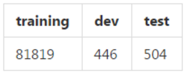
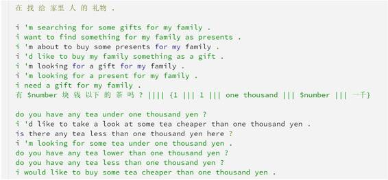

# 资源 | 基于 MXNet 的神经机器翻译实现

选自 GitHub

**机器之心编译**

**参与：李亚洲**

本篇内容是使用 MXNet 对带有注意机制的神经机器翻译的实现。

项目地址：https://github.com/magic282/MXNMT

**数据**

目前的代码使用 IWSLT 2009 中英语料库作为训练、开发与测试数据。请使用这一数据集或其他可用的并行语料库。数据统计如下：

 

**开发/测试数据格式** 

IWSLT 2009 中英数据库的参考数（reference number）是 7，例如：

 

**结果**

根据我自己的测试，在没有 53 次迭代后的后期处理情况下，这些代码能在 IWSLT 开发数据集上达到 44.18 BLEU 得分。特别是 1gram=72.65% 2gram=49.63% 3gram=37.62% 4gram=28.08% BP = 1.0000 BLEU = 0.4418。

**问题周知**

*   兼容性问题。目前的版本会要求使用 Python 3，因为使用 Python2 处理中文代码问题非常恼人。

*   在注意（attention）部分，h.dot(U) 要提前计算（pre-computed），然而我这么做了看起来效果也不是很好。

*   BLEU 评估器是个 exe 文件也不是内藏的，以后需要用 nltk 评估器取代。

*   该模型需要修改，从而在此数据集上能够达到 50 BLEU 得分。

***©本文由机器之心编译，***转载请联系本公众号获得授权***。***

✄------------------------------------------------

**加入机器之心（全职记者/实习生）：hr@almosthuman.cn**

**投稿或寻求报道：editor@almosthuman.cn**

**广告&商务合作：bd@almosthuman.cn**