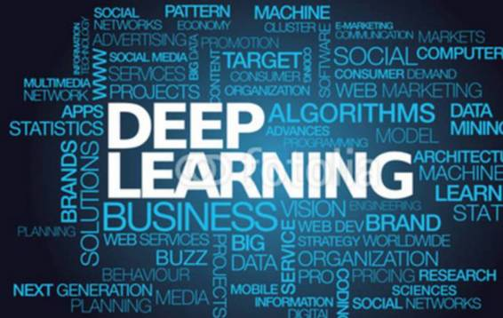
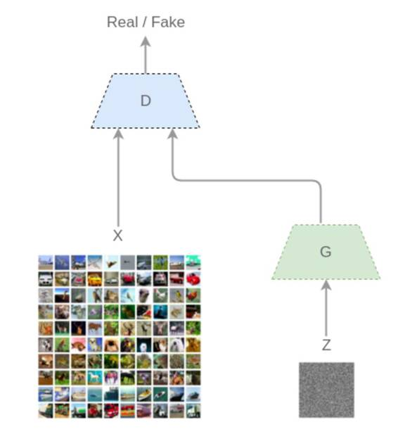
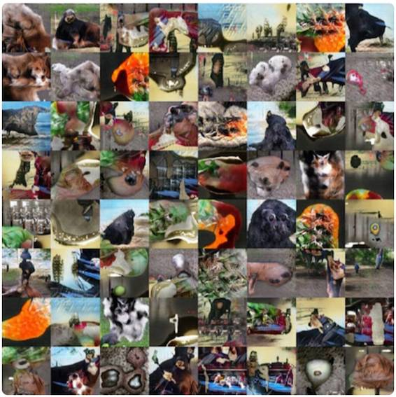
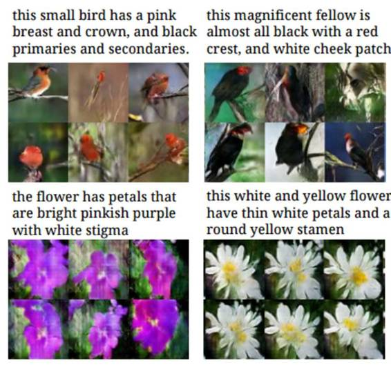
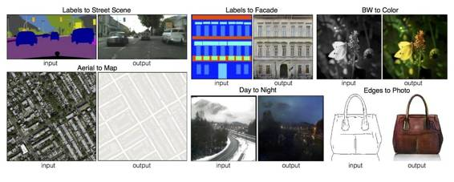
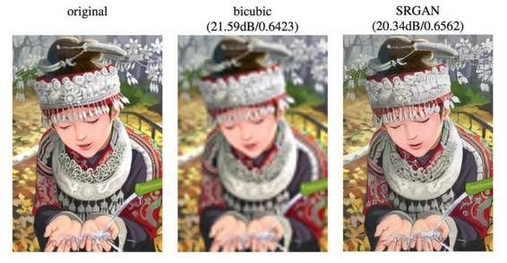

# 盘点 | 2016 深度学习重大进展：从无监督学习到生成对抗网络

选自 tryolabs

**机器之心编译**

> *过去几年，深度学习成为了机器学习社区的核心话题，2016 年更是如此。在 Tryo Labs 的这篇盘点文章中，作者回顾了对该领域贡献最大（或有潜力的）的进展以及组织和社区如何保证这些技术能以一种使所有人都受益的方式被使用。*

 

无监督学习一直以来都是研究人员所面临的一个主要挑战。我们认为该领域在 2016 年真是发展得非常不错，这主要是得益于在生成模型（Generative Model）上大量研究。此外，与机器自然交流的能力也是梦想中的目标之一，谷歌、Facebook 这样的巨头也为此提出了多种实现方法。在这一背景中，我们可以看到许多在自然语言处理（NLP）上的创新，这些问题对我们实现与机器自然交流的目标来说是至关重要的。

**无监督学习**

无监督学习指在没有额外信息的情况下，从原始数据中提取模式和结构的任务，它与需要标签的监督学习相互对立。

使用神经网络解决该问题的经典方法是自动编码器。其基础的版本由多层感知机（Multilayer Perceptron）组成，其中输入层和输出层有同样的大小，并会训练一个较小的隐藏层来恢复输入。一旦训练完成，来自该隐藏层的输出相当于对聚类、降维、改进监督分类以及数据压缩都有用的数据表征。

**生成对抗网络（GAN）**

最近一种被称为生成对抗网络的生成模型被广泛的提及，这个模型是在原生成模型的基础上提出的。GAN 可以实现能解决无监督学习问题的模型。GAN 的网络结构是具有颠覆性的，Yann LeCun 在一次关于这个研究的演讲中如此评论：「GAN 是机器学习过去的 20 年里最重要的思想之一。」

尽管在 2014 年 Ian Goodfellow 就提出了 GAN，研究者们直到现在（2016 年）才看到 GAN 的真正潜力。基于 GAN 的更好的训练模型的方法已经出现了，深度卷积式的 GAN（Deep Convolutional GAN）也在今年被提出，这个更加优化的 GAN 模型已经解决了一些之前限制深度学习发展的难题。不仅如此，一些新的应用（我们稍后提供名单）表明这个模型非常强大且灵活。

**一个直观的例子解说**

试想如下情境，一个很有野心的画家从事名画赝品交易（称之为 G），同时另有一个人（称之为 D）以鉴别画的真伪为生。我们设想先让 D 观摩（即机器学习里的 learning）了一些毕加索的画作，当 D 对毕加索的作品有了一定的认知之后，G 尝试用他的毕加索画作赝品来愚弄 D，让 D 相信他的赝品是毕加索的真作。有时候 G 能够成功的骗过 D，但是随着 D 对毕加索的作品的了解的加深（即机器学习里学习的样本数据越来越多），G 发现越来越难以愚弄 D 了，所以 G 也在不断提升自己仿制赝品的能力。如此多次，不仅 D 已经很精通毕加索作品的鉴别，同时 G 对毕加索作品的伪造技术也大为提升。这就是 GAN 模型的初始想法。

从机器学习的模型构建来说，GAN 模型包涵了两个持续相互博弈的神经网络（这也是被称为「对抗」模型的原因）：一个生成器（G）和一个鉴别器（D）。输入一组训练数据（如图像），并假设这些图像服从某种分布（x）。在 GAN 网络中，G 会输出一组分布结果而 D 则会判定这个分布是否来自于同一个训练集。

刚开始训练的时候，G 会从一些噪声（z）开始生成得到生成的图像 G(z)。D 则会得到来自真实分布（x）的图像和来自 G 生成的图像（G(z)），然后需要将它们分类成 D(x) 和 D(G(z))。

*图：GAN 的工作方式*

D 和 G 同时进行学习，一旦 G 被训练而对训练样本的分布有了足够的了解，它就可以生成有类似特性的新样本：

*GAN 生成的图像*

这些图像由在 CIFAR-10 上训练的一个 GAN 生成。如果你注意细节，你会发现它们并非真正的物体。然而，它们捕捉到了让自己看起来真实的一些概念。

**InfoGAN**

近期的进展对 GAN 的思想进行了延展，让其不仅可以用于近似数据的分布，还能学习数据的可解释的、有用的表征。这些我们希望得到的表征需要捕捉到丰富的信息（和自动编码器中的一样），也需要是可解释的，也就是说我们要能够区分导致了生成的输出中特定类型的变换的向量部分。

InfoGAN 模型由 OpenAI 研究员在 8 月份提出，其目标就是为了解决这个问题。简言之，InfoGAN 能够以无监督的方式生成包含数据集相关信息的表征。例如，当被应用于 MNIST 数据集的时候，它能够在不需要人工标记数据的情况下推断出数字的类型（1、2、3……）、生成的样本的转动（rotation）与宽度（width）。

**条件 GAN（Conditional GAN）**

GAN 的另一种延展是一类被称为 Conditional GAN 的模型。这些模型能够生成考虑了外部信息（类标签、文本、其它图像）的样本，并使用它来迫使 G 生成特定类型的输出。近期出现的一些应用如下：

*   **文本到图像**

采用文本描述（由字符级的 CNN 或 LSTM 将其编码为向量）作为外部信息，然后基于它生成图像。查看论文：Generative Adversarial Text to Image Synthesis

 

*   **图像到图像**

将输入图像映射到输出图像。查看博客：https://phillipi.github.io/pix2pix/

 

*   **超分辨率**

它采用下采样图像（更少细节），生成器试图将它们似然为更自然的图像。查看论文：Generative Adversarial Text to Image Synthesis

 

**自然语言处理**

为了能够和机器流畅地对话，我们首先要解决很多问题，包括：文本理解、问答系统和机器翻译。

**文本理解**

Salesforce MetaMind (http://metamind.io/) 建立了一个叫做 Joint Many-Tasks（JMT）的模型，目标是要创造出一个可以学习五个常见自然语言处理任务的模型：

*   词性标注（Part-of-speech tagging）

    指对句子中的每个词都指派一个合适的词性，比如说名词、动词、形容词等。

*   词块分析（Chunking）

    也叫做浅层句法分析（shallow parsing），其中涉及到很多任务，像是寻找名词和动词词组等。

*   依存关系分析（Dependency parsing）

    识别词语之间的语法关系（比如说形容词修饰名词）。

*   语义相关度（Semantic relatedness）

    衡量两个句子之前的语义相关程度，其结果是用一个实值分数来表示的。

*   文字蕴含（Textual entailment）

    确定前提的句子是否包含一个表示假设的句子。可能出现的句子关系包括：蕴含、矛盾 和中立。

这个模型背后的魔力就在于它是端对端训练的。也就是说它能够让两个不同层面的处理兵种，这样浅层任务（不那么复杂的）可以得到改善，从深层（较复杂的任务）中得出结论。我们之前的想法是只用浅层来改进深层的任务，而不是用其他的方式，所以这个采用不同的方式与之前的思路比较来说是一个新的想法。除了词性标注之外，这个模型在其他方面都取得了很好的成绩。

**问答系统**

MetaMind 同样提出了称之为 Dynamic Coattention Network (DCN) 的新模型来解决疑问解答问题，该模型建立在相当直观的思路之上。

想象下我给你了一篇长文并问你一些问题，你是想先看文章再听问题呢，还是更想先听问题再开始阅读文章？一般提前知道问题是怎么样的就会知道看文章要注意些什么，如果不知道问题，那么你就会将你的注意力平均分配并记下每一点可能会被提问的细节。

DCN 也是在做这样一件事，首先它生成一个内部表征，这个内部表征是基于文本并且由系统将要回答的问题做为约束条件，然后就是按照可能的回答列表迭代，直到收敛到最后的回答。

**机器翻译**

谷歌在今年九月发布了用于翻译服务的新模型，即谷歌神经网络机器翻译系统（Google Neural Machine Translation (GNMT)），这个系统是由如英-汉那样独立的语言对训练的。不过新的 GNMT 系统在 11 月份也发布了，它进一步训练了能实现多语言对互译的单个模型。现在 GNMT 系统与以前唯一不同之处就是它采用了能指定目标语的新型输入方法。它同样能够进行 zero-shot translation，这就意味着它能够翻译一对没有训练过的语言。

GNMT 系统的开发表明了基于多语言对的训练要比基于单语言对的训练效果好得多，这也证明了从一种语言对迁移「翻译知识」到另一种语言对是可行的。

**社区**

一些公司和企业已经建立起非营利性伙伴关系进而讨论机器学习的未来，并确保这些惊人的技术得以正确使用，从而有利于社区。

OpenAI 是一个非营利性组织，它旨在建立学界和工业界之间的合作关系，并将其研究结果免费公开。OpenAI 在 2015 年建立，并在 2016 年开始发表它的研究结果（通过 InfoGAN 出版物、Universe 平台、this one 会议）。OpenAI 的目标就是确保人工智能技术对尽可能多的人来说都是可行的，并且防止出现超人工智能。

另一方面，亚马逊、DeepMind、谷歌、Facebook、IBM 和微软还在人工智能之上达成了一项合作，其目标是提升公众对这一领域的理解、支持最佳的实践和为讨论和参与开发一个开放的平台。

该研究社区另外值得提及的一点是其开放性。你不仅可以在 arXiv（或 arXiv-Sanity）这样的网站上免费找到几乎任何论文，而且还能使用他们同样代码复现他们的实现。GitXiv 是其中一个很有用的工具，其将 arXiv 上的论文和它们对应的开源项目库链接到了一起。

*   arXiv：https://arxiv.org

*   arXiv-Sanity：http://www.arxiv-sanity.com

*   GitXiv：http://www.gitxiv.com

现在，开源工具已经无处不在，并且已经得到了研究者和企业的广泛使用和开发。下面简单列出了 2016 年最受欢迎的深度学习工具：

*   TensorFlow，来自谷歌，地址：https://github.com/tensorflow/tensorflow

*   Keras，来自 François Chollet，地址：https://github.com/fchollet/keras

*   CNTK，来自微软，地址：https://github.com/Microsoft/CNTK

*   MXNET，来自 DMLC，被亚马逊采用，地址：https://github.com/dmlc/mxnet

*   Theano，来自蒙特利尔大学，地址：https://github.com/Theano/Theano

*   Torch，来自 Ronan Collobert, Koray Kavukcuoglu, Clement Farabet，被 Facebook 广泛使用，地址：https://github.com/torch/torch7

**最后的思考**

如今正是参与到机器学习发展中的好时机。正如你所看到的，今年取得的成果尤其令人激动。该领域的研究正在迅猛发展，紧跟进步的步伐都成了一件难事。我们非常幸运生活在一个人工智能民主化的时代。

*原文链接：https://tryolabs.com/blog/2016/12/06/major-advancements-deep-learning-2016/*

******©本文为机器之心编译文章，***转载请联系本公众号获得授权******。***

✄------------------------------------------------

**加入机器之心（全职记者/实习生）：hr@almosthuman.cn**

**投稿或寻求报道：editor@almosthuman.cn**

**广告&商务合作：bd@almosthuman.cn**