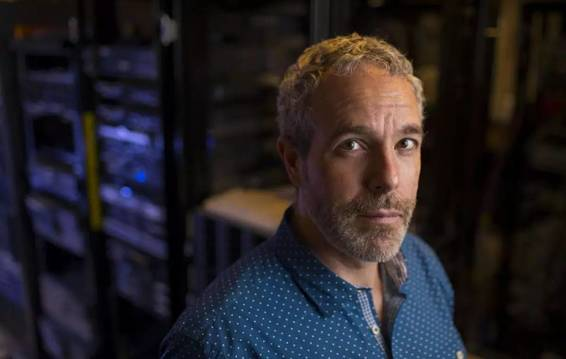

# 深度 | 深度学习遇上基因组，诊断疾病和揭示深层生物原理或迎来突破

选自 O'Reilly

**作者：****David Beyer**

**机器之心编译**

**参与：微胖** 

> *本文选自 O'Rreilly 系列采访集《The Future of Machine Intelligence》（机器之心翻译了此报告的摘要和核心要点，可点击*[*《重磅｜**出现失误的 AlphaGo 让人琢磨不透？快来跟这 10 位顶尖专家学习机器智能（附 78 页报告下载）》*](http://mp.weixin.qq.com/s?__biz=MzA3MzI4MjgzMw==&mid=402722993&idx=1&sn=eb7dbc9eaa379c44111e1b3039cc6d5b&scene=21#wechat_redirect)*查看）。*
> 
> *本期是对 Brenda Frey 的专访，他是 Deep Genomics 联合创始人，多伦多大学教授，也是该大学机器学习团队的联合创始人，CIFAR 神经计算项目的高级学者，加拿大皇家科学院成员。主要关注使用机器学习了解基因组，实现新的基因组医学可能性。*

这篇访谈要点如下：

*   深度学习在基因组医学领域的应用已经迈出通往希望的第一步，这一应用可以对诊断、重症护理、制药和保险方面产生影响。

*   「基因型—表现型」鸿沟——我们能将基因组学与疾病表现型联系起来——正阻碍基因组学深入挖掘医学领域的潜力。

*   深度学习可以弥合「基因型—表现型」鸿沟，通过吸收指数级增长的数据量，解释将基因型与表现型关联起来的复杂生物过程中的多层结构。

*   深度学习已经成功应用于人类天生擅长的领域，比如，图像、文本以及语音理解。然而，人类意识却不能理解基因组。为此，需要使用「超人智能」来解决这个问题。

*   这一领域的研究必须能够解释深层生物学机制；过度简化或者「黑箱」研究方法，价值都将有限。

*Frey 讨论他的团队如何用深度学习来了解基因组以及为什么他相信「这种技术能够革命医疗。」*

**从你的背景开始谈起吧？**

1997 年，我在 Hinton 的指导下完成了自己的博士学位。我们合著了一篇关于深度学习的论文（1995 年发表在《科学》上），也是最早的深度学习研究论文之一。这篇文章可以说是近期许多无监督学习以及自动编码器研究的先驱。当时，我关注的是计算机视觉，语音识别以及文本分析。也研究深度结构中的信息传递算法。1997 年，David MacKay 和我合作了第一篇有关「环路信念传播（loopy belief propagation）」或 「合积算法( sum-product algorithm )」的文章，这篇文章出现在了顶级机器学习会议 NIPS 上。

1999 年，我成为 Waterloo 大学 的一名计算机科学教授。2001 年，加入多伦多大学，与其他几位教授一起，共同成立了机器学习小组。我们的团队研究深度结构中的学习和推论，使用的是以变分方法、信息传送以及马尔可夫链蒙特卡尔理论（MCMCA）模拟为基础的算法。多年来，我教授了十二门有关机器学习和贝叶斯网络的课程，学生总计一千多人。

2005 年，我成为 CIFAR 神经计算项目的高级学者，这是一个与业内带头人分享与合作的良机，比如，Yann LeCun,、Yoshua Bengio、Yair Weiss, 以及项目主管 Geoff Hinton 。

**为什么从基因组学入手？**

与个人经历有关。2002 年，也就是履新多伦多大学教授几年后，当时我得知我妻子怀着的胎儿在基因上可能存在问题。但是，我们的顾问也没把这个问题解释清楚：她只是暗示说，要么没什么问题，要么可能会有严重问题。那次经历，因为很多原因而变得极其困难，也给我职业生涯植入一条深深的信念：我主要研究如何识别 YouTube 视频里的猫，但是，全面考虑一下，它似乎不那么重要。

我从中得到两个启示：首先，我想使用机器学习改善那些面临类似基因问题人群的生活。第二，减少不确定性，价值巨大：给某个人一些信息，好或者坏，让他们做出相应计划。相反，人们很难处理不确定性。因此，我调整了研究目标。我们转向关注使用机器学习理解基因组运作原理。

**为什么你会认为机器学习再加上基因组生物学会很重要？**

基因组生物学这个领域，正在生成大量数据。很快，你就能通过手机大小的设备给自己的基因组排序，整个过程也不长，就是走到街角商店的时间。然而，基因组只是一部分，还有海量描述细胞与组织的数据。我们，作为人类，无法很好领会所有这种数据，仍不十分了解生物学。机器学习有助于解决这个难题。

同时，机器学习界的其他人也承认这一需求。去年机器学习顶级会议上，Yann LeCun、Demis Hassabis、Neil Lawrence（谢菲尔德大学教授）以及 Kevin Murphy（谷歌）也认为，医学领域会是下一个深度学习前沿。

为了成功，我们需要弥合「基因型—表现型的鸿沟」。基因组和表现型数据很丰富。不幸的是，有意义地联接这些数据的最先进的研究，却让文献检索以及湿实验室试验的过程变得缓慢，昂贵而且不准确。为了完成这一闭环，我们需要可以确定间接表现型（亦即，分子表现型 molecular phenotypes）的系统，作为从基因型走向疾病表现型的垫脚石。为此，机器学习必不可少。

> ***相关概念***
> 
> *基因型（Genotype）指的是一个生物体内的 DNA 所包含的基因，也就是说该生物的细胞内所包含的、它所特有的那组基因。基因型对一个生物的发展有极大的影响，但是它不是唯一的因素。*
> 
> *表型（Phenotype），又称表现型，对于一个生物 而言，表示它某一特定的物理外观或成分。一个人是否有耳珠、植物的高度、人 的血型 、蛾的颜色 等等，都是表型的例子。表型主要受生物的基因型和环境影响，表型可分为连续变异或不连续变异的。前者较易受环境因素影响，基因型上则会受多个等位基因 影响，如体重 、智力和身高 ；后者仅受几个等位基因影响，而且很少会被环境改变，如血型、眼睛颜色 和卷舌的能力。*
> 
> *分子表型（molecular phenotype）。我们可以从不同层次的窗口观察生命的表现，从原子水平、分子水平、细胞水平、个体水平、群体水平、生态水平等。通常，观察的记录可以叫做表型（phenotype）。近年来，从我们肉眼看得见或常规仪器可测的表型（比如身高、体重），到肉眼看不到、需要特殊仪器测定的表型，表型的内涵已经有了极大的发展。统计/数学下的表型机理 ，就是分子表型。*

新一代年青的研究人员出现了，他们使用机器学习研究基因如何影响分子表现型，比如，斯坦福的 Anshul Kundaje 团队。这里仅提及几个未来的带头人：多伦多大学和哈佛大学的 Andrew Delong、Babak Alipanahi 以及 David Kelley ，他们研究蛋白质和 DNA 的相互作用；MIT 的 Jinkuk Kim 研究基因表达以及华盛顿大学的 Alex Rosenberg ，他正在研究试验方法，检测数以百万的突变及其对剪接的影响。我也很激动地看到，这个领域创业公司正在兴起，比如 Atomwise, Grail 及其他公司。

**当你开始基因组领域的研究时，当时的研究现状如何？**

研究人员使用着各种简单的「线性」机器学习方法，比如支持向量机和线性回归，后者可以根据病人的基因表达模式预测癌症。这些技术，从设计上看，比较「浅显」。易言之，针对某个类别标签，每个模型输入都会得到一个非常简单的「支持」或者「不支持」。那些方法并不能解释生物学的复杂性。二十世纪九十年代和二十一世纪早期，隐马尔科夫模型和相关分析序列的技术开始流行起来。Richard Durbin 和 David Haussler  带领着这一领域的研究团队。

与此同时，MIT 的  Chris Burge 团队开发了一款马尔科夫模型，可以检测基因，推断基因的开始以及不同部分（基因内区和外显子）的界限。这些方法仅对低层次的「序列分析」有用，无法弥合基因型与表现型之间的鸿沟。一般说来，当时的研究状态就是这些根本浅显的方法驱动的，这些技术无法充分解释深层次的生物学机制，比如基因组文本如何转变为细胞、组织和器官。

**开发足以解释深层生物学的计算模型，意味着什么？**

将基因型与表现型关联起来的最受欢迎的方式之一，就是在所谓的全基因组关联研究（ a genome-wide association study , GWAS）中，寻找与疾病相关的变异。这种方法也比较浅显，在某种意义上，让从某个突变到基因表现型之间还有许多生物学步骤大打折扣。这种研究方法能够识别出可能重要的 DNA 区域，但是，他们识别出的几乎所有突变都不是偶然的。在绝大多数情况下，如果可以纠正突变，它就不会影响到表现型。

还有另一种非常不同的办法，可以解释间接的分子表现型。比如基因表达。在一个活体细胞中，当蛋白质以某种方式与基因的上游序列互动  ——比如，启动子（promoter）。一个尊重生物学的计算模型就能吸收这个启动基因表达的偶然性链条。2004 年， Beer 和 Tavazoie 写了一篇论文，我认为这篇文章很有启发性。他们试图根据启动子序列，通过被当做源自启动子序列的输入特征的逻辑回路，预测每个酵母基因表达水平。最终，他们的方法没有成功，但是一次很棒的尝试。

我们团队的研究方法就是受到这两位研究人员的启发，但是，有三方面的不同：我们检测了哺乳动物细胞，我们使用了更先进的机器学习技术，关注剪接，而不是转录。回想起来，这一最后区别是一次偶然的转变。转录要比剪接难模拟得多。剪接是一个生物学过程，基因的某些部分（基因内区）被去除，剩余的部分（外显子，基因中有编码蛋白质功能的部分）联系在一起。有时，外显子也被敲掉了，这能对表现型产生主要影响 ，包括神经功能障碍和癌症。

为了用机器学习破解剪接规则，我们的团队与优秀实验生物学家 Benjamin Blencowe 领导的团队合作。我们建立了一个框架，从基因序列中提取生物学特征，预处理噪音性质的实验数据，训练机器学习技术预测 DNA 的剪接模式。这项研究工作很成功，有些成果都发表在了《自然》和《科学》上。

**基因组学与其他应用领域有什么不同？**

我们发现，较之视觉、语音以及文本处理，基因组学面对的挑战，与众不同。许多视觉方面的挑战依赖这样一个假设：要被分类的目标占据输入图像的大部分面积。在基因组学方面，相关目标仅占据微小部分——比如，输入的百万分之一，因此，会产生问题。易言之，分类器按照信号总量起作用。其他任何事情都是噪音——有很多噪音。更糟糕的是，这是相对结构化的噪音，包含了其他、更大的与分类任务无关的目标。那就是基因组学给出的难题。

还有更加让人担心的复杂性，我们自己都不清楚基因组。当检查一个典型图像时，我们自然而然地识别出其中的物体，我们也知道想让算法识别什么。这也被应用于文本分析和语音处理，这些领域中，我们都在处理真相问题。与此形成鲜明对比的是，人类本身并不善于解释基因组。实际上，这方面表现的很糟糕。所有这些都是在说，我们必须向真实的超人人工智能求助，克服自身局限性。

**能多介绍一点你在医学领域的研究工作吗？**

我们开始训练系统，让它在不包括任何疾病数据的情况下，预测分子表现型。然而，一旦系统得到训练，我们意识到，我们的系统实际上可以准确预测疾病；它明白细胞如何读取 DNA 序列，如何将它转变为关键分子。一旦有了关于这些情况如何正常运作的计算模型，那么，你就能通过它来侦测什么时候情况走偏了。

然后，我们将系统转向用于大规模的疾病突变数据组。猜测 DNA 里存在某种特殊突变。我们输入了突变的 DNA 序列及其对应的非突变部分，然后比对两组输出，也就是分子表现型。如果观测到了一个大的变化，我们会将这个突变标签为具有潜在致病性。结果表明，这种方法很管用。

但是，当然，这个办法并非完美无缺。首先，变异可能改变分子表现型，但是不会致命。第二，突变可能不会影响我们正在模拟的分子表现型，但会以其他方式致病。第三，当然，我们的系统不是百分百正确。尽管存在这些不足，我们的方法能够准确区分疾病与良性突变。去年我们在《科学》和《自然 生物技术》上发表了论文，证实这一研究方法比其他竞争方法的准确性要高得多。

**你们公司（Deep Genomics）的目标是？**

> ***背景知识***
> 
> *2015 年夏天，Brendan Frey 教授的实验室创立 Deep Genomics 公司。他领导的实验室能使用深度学习技术，筛选海量以前未知的基因突变，找出致病的基因突变。2015 年 11 月，Deep Genomics 公司宣布完成 370 万美元的种子轮融资，由位于湾区 True Ventures 领投，Bloomberg Beta 和其它投资方跟投。目前，这家公司已经与医院，生物科技创业公司以及制药公司展开合作，使用基因疾病患者的基因数据测试公司系统。Human Longevity 也于 2015 年 8 月成为 Deep Genomics 的客户，公司还与 SynapDx，多伦多应用基因组学中心建立了「合作伙伴」关系。*

我们的工作需要各个领域的专业技术，包括深度学习、卷积神经网络，随机森林，GPU 计算，基因组学，转录组学，高通量实验生物学以及分子诊断学。比如，我们有 Hui Xiong , 发明了一种贝叶斯深度学习算法，预测剪接作用；还有 Daniele Merico ，他研发了完整基因组测序诊断系统，这个系统已被用于儿童医院。我们也将继续招募这些领域的人才。 

一般说来，我们的技术能从许多方面影响医学，包括：基因诊断，精炼药物靶点，药物研发，个性化施药，改善健康保险制度甚至合成生物学。目前，我们关注的是诊断方面，因为它是我们技术的直接应用。我们的引擎提供了一个丰富的信息来源，能以更低的成本做出更加可靠的诊断决策。

这个领域里，许多新兴技术会要求具有理解基因组内部工作原理的能力。比如，使用 Cas9 系统进行基因编辑。这个能让我们给 DNA「写信」的技术会是件大事。也就是说，知道如何书写并不等于知道写的内容。编辑 DNA 可能让疾病更糟糕。试想一下，如果你能用一种计算「引擎」显而易见地确定基因编辑后果。平心而论，那还很遥远。然而，那就是我们最终想要做到的。

延伸阅读：

机器学习：解读基因密码「食谱」http://www.almosthuman.cn/2015/10/21/enypo/

***©本文由机器之心编译，***转载请联系本公众号获得授权***。***

✄------------------------------------------------

**加入机器之心（全职记者/实习生）：hr@almosthuman.cn**

**投稿或寻求报道：editor@almosthuman.cn**

**广告&商务合作：bd@almosthuman.cn**