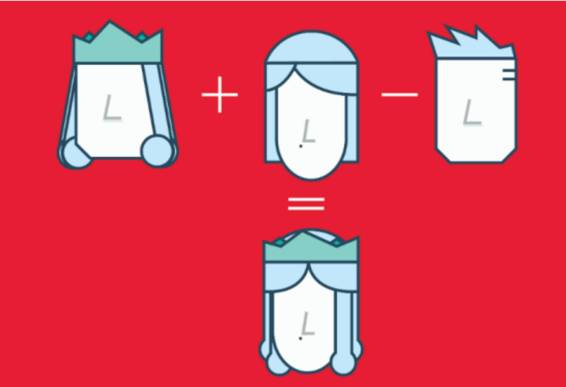

# 业界 | King+Woman-Man=Queen:用基于 Spark 的机器学习来捕捉词意

选自 ibmbigdatahub

**机器之心编译**

**参与：杜夏德**

> *Word2Vec 是一种将词转换成向量的方法。其中文本是非结构化的数据，无论过去还是现在，其在数学中的研究远远少于向量。*

**历史上的数学与文本数据**

物理学家和数学家艾萨克牛顿是第一个在力学情境中研究向量的人呢。向量的概念已经存在了三个世纪，其科学性已非常成熟。而文本数据的数学探索这个概念只有几十年的历史。

现在文本数据的数学思考应用尤其重要。数据的价值已被理解但是还未兑现。大部分商业相关信息最初都是非结构化形式，主要是文本。数据只有读取之后才可见，才能用于商业、教育、政府管理和医疗之中。文本数据的数学探索能够产生洞见提供给医生、企业家、营销人员和教师用来做决策。

我目前正在做数据可读的工作，我使用了 Word2Vec 来生成向量捕捉词意并启用与单词相关联的算术运算。

例如：向量（king）+向量（woman）-向量（man）=一个接近向量（queen）的向量

 

**词计算**

谷歌的 Thomas Mikolos 等人在 2013 提出了 Word2Vec。这个算法是基于网络的，并将一个文本预料库映射到一个矩阵中，在这个矩阵中，每一行都关联到输入文本数据的中一个词上，例如，tweets、产品评价、播放列表等。这些合成向量空间能被用于多种用途，比如测量两个词之间的距离。这样一来，给定一个相关的词，前述的向量空间就能用来计算最接近的前几个词。

例如，我用了 30 天的 Twitter 数据建立了一个模型，生成了最接近 #deeplearning 的 5 个 #（词）

*   #machinelearning

*   #ml

*   #smartdata

*   #predictiveanalytics

*   #datascience

本文中用到的 Word2Vec 部署来源于 Apache Spark ML，一个机器学习包，属于 Apache Spark 的一部分，如果你有兴趣自己建立一个 Word2Vec 模型，可以借鉴一下这里 https://apsportal.ibm.com/analytics/notebooks/43120a9f-afa7-4715-9441-0388cb4f2d49/view?access_token=573d250f944bc0d912a8bb4dac997090dac2074fea07cbb2380bc802683aa60c。  

******©本文由机器之心编译，***转载请联系本公众号获得授权******。***

✄------------------------------------------------

**加入机器之心（全职记者/实习生）：hr@almosthuman.cn**

**投稿或寻求报道：editor@almosthuman.cn**

**广告&商务合作：bd@almosthuman.cn**

