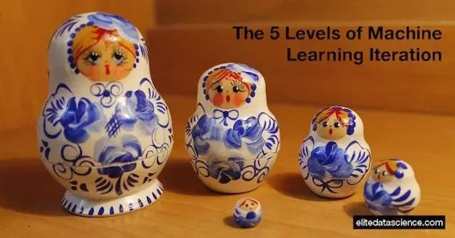

# 基础 | 初学者必读：从迭代的五个层面理解机器学习

选自 Elite Data Science

**机器之心编译**

**参与：Jane W、吴攀**

> 你能猜到这个谜语的答案吗？
> 
> *   如果你学习机器学习，它将随处可见……
>     
>     
> *   如果你是一个程序员，你会用它上千次……
>     
>     
> *   如果你练习过任何技术，这俨然是第二个你……
>     
>     
> 
> 不，答案不是狂饮咖啡……而是「迭代（iteration）」！
> 
> 是的，迭代是为了实现某种结果而重复一组任务的过程。
> 
> 等等，这难道不是词典的定义吗？好吧，是的，这就是迭代真正的意思。我们并不是要揭开一些令人兴奋的秘密。但我们希望以一种对你来说可能是新的方式来构建这个简单的概念。我们的目标是从不同的角度概览机器学习的基本概念，这有别于教科书里的常规方法。
> 
> 我们知道，大多数书都按照正向顺序（sequential）讲解机器学习的过程：加载数据、预处理、拟合模型、预测等。
> 
> 这种顺序方法当然是合理和有帮助的，但现实的机器学习很少如此线性。相反，实用机器学习有一个特殊的循环（cyclical）性质，需要不断的迭代、调整和改进。
> 
> 因此，我们想展示简单的迭代技术是如何在机器学习中具有美丽形式和深刻意义的。这篇文章是针对初学者写的，但更有经验的读者也不妨一读。
> 
> 
> 
> 为什么讨论迭代问题？
> 
> 迭代是机器学习的核心概念，它在许多方面至关重要。了解这个简单的概念在机器学习工作流程中的确切位置，这会带来很多切实的好处：
> 
> 1\. 你能更好地理解算法
> 
> 2\. 你能制定出更实际的项目进度时间表
> 
> 3\. 你会发现更容易实现的模型改进方法
> 
> 4\. 帮助你更容易坚持下去，即使初步结果较差
> 
> 5\. 帮助你进一步解决机器学习中更复杂的问题
> 
> 根据经验，以迭代的角度看机器学习的工作流，能够帮助初学者了解机器学习背后的概念。
> 
> 所以不用多说，让我们开始介绍机器学习迭代的 5 个层面吧。
> 
> **目录**
> 
> *   模型层面：拟合参数
>     
>     
> *   微观层面：调试超参数
>     
>     
> *   宏观层面：解决问题
>     
>     
> *   元数据层面：改进数据
>     
>     
> *   人类层面：提升自己
>     
>     
> 
> **模型层面：拟合参数**
> 
> 迭代能够起到重要作用的第一个层面是模型层面。任何模型，无论是回归模型、决策树还是神经网络，都是由许多（有时甚至数百万）模型参数定义的。
> 
> 例如，回归模型由回归系数定义，决策树由节点分类的方式定义，神经网络由连接各层的权重定义。
> 
> 然而机器是如何学习正确的模型参数值的？其中迭代算法发挥了作用！
> 
> **用梯度下降法拟合参数**
> 
> 梯度下降算法（或随机梯度下降/stochastic gradient descent）是机器学习的巨大成功。
> 
> 梯度下降是一种迭代方法，用于找到函数的最小值。在机器学习中，该函数通常是损失（loss）（或成本/cost）函数。「损失」指的是衡量预测错误代价的量化指标。
> 
> 给定一组参数，梯度下降计算对应模型的预测损失，然后调整这些参数以减少损失。重复这一过程，直到损失不能进一步减少。
> 
> 最小化损失的最后一组参数就是最终的拟合模型。
> 
> **直观的梯度下降算法**
> 
> 我们不会在这里推导梯度下降的数学公式，但我们将直观的给出梯度下降的概念：
> 
> 1\. 设想带有山谷和山峰的山脉（损失函数）；
> 
> 2\. 山脉的每个位置（参数集）都有一个高度（损失）；
> 
> 3\. 现在把一个滚珠放在山脉的某个地方（初始化）；
> 
> 4\. 在任何时刻，球沿最陡的方向（梯度）滚动；
> 
> 5\. 它继续滚动（迭代），直到它卡在某个山谷底部（局部最小）；
> 
> 6\. 理想情况下，你想找到最低的山谷（全局最小）；
> 
> 7\. 有很多聪明的方法来防止球被卡在局部最小值（例如初始化多个球，给它们更多的动量，以便球可以越过小山丘等）；
> 
> 8\. 对了，如果山地形状像碗（凸函数），那么球一定能到达最低点。
> 
> 在下面的视频中，吴恩达进一步讲述了梯度下降算法背后的原理。
> 
> 想要学习更多梯度下降算法的数学推导，我们推荐下面的资料：  
> 
> *   UCLA 的数学优化课程讲义：http://www.math.ucla.edu/~wotaoyin/math164/slides/wotao_yin_optimization_lec07_gradient_methods.pdf
>     
>     
> *   scipy-lectures.org 网站的数学优化学习笔记：http://www.scipy-lectures.org/advanced/mathematical_optimization/
>     
>     
> 
> 在实践中，调用机器学习的应用包（如 Scikit-Learn）时，并不需要从头开始编写梯度下降算法。
> 
> **微观层面：调试超参数**
> 
> 下一个迭代发挥巨大作用的层面是我们所谓的「微观」水平，更通常被称为通用模型或模型族（model family）。
> 
> 你可以将模型族视为广泛类别的具有可定制结构的模型。logistic 回归、决策树、支持向量机（SVM）和神经网络实际上都是不同的模型族。在实际拟合模型参数之前，每个模型族都有一组结构可供选择。
> 
> 例如，在 logistic 回归族中，可以使用 L1 或 L2 正则化惩罚项（regularization penalty）来构建单独的模型。在决策树族中，可以选用不同结构的模型，例如树的深度（depth）、修剪阈值（pruning threshold）或分割标准（splitting criteria）。
> 
> 这些结构选择变量称为超参数（hyperparameter）。
> 
> **为什么超参数很特别**
> 
> 超参数是无法使用梯度下降或其它优化算法直接从数据学习的「更高级」参数。它们描述了在拟合模型参数之前必须确定的关于模型的结构信息。
> 
> 所以当人们说他们要「训练一个 logistic 回归模型」时，他们真正的意思包含了两个阶段的过程。
> 
> 1.  首先，决定模型族的超参数。例如，模型是否应该添加 L1 或 L2 惩罚项以防止过拟合（overfitting）？
>     
>     
> 2.  然后，根据数据拟合模型参数。例如，如何拟合模型系数（coefficient）以最小化损失函数（loss function）？
>     
>     
> 
> 我们之前讨论了梯度下降如何帮助执行步骤 2。但是为了使用梯度下降拟合模型参数，必须首先从模型族入手设置超参数。
> 
> 那么我们如何处理步骤 1，找到模型族的最佳超参数？
> 
> **使用交叉验证调试超参数**
> 
> 交叉验证（cross-validation）是在众多场景最有用的技术之一，在使用它时几乎有一种作弊的感觉。
> 
> 在此背景下，交叉验证也是一种迭代方法，用于评估用给定的一组超参数构建的模型的性能。这是一种重复使用训练数据的聪明方式，将它分割成几块并循环使用它们（详情见下一小节）。
> 
> 使用交叉验证，你可以仅使用训练集来拟合和评估具有各种超参数集的模型。这意味着你可以将测试集单独拿出来（hold-out set）并用于最终模型选择（更多内容将在下一部分中介绍）。
> 
> **交叉验证详细步骤**  
> 
> 以下是使用 10 折交叉验证选择超参数的步骤：
> 
> 1\. 将训练集分成 10 等份，即「折（fold）」；
> 
> 2\. 从备选的所有超参数集中，选择一组超参数；
> 
> 3\. 在给定一组超参数后，用训练数据的前 9 折训练你的模型；
> 
> 4\. 用第 10 折，或单独拿出的数据（hold-out）折去评估模型；
> 
> 5\. 用同一组超参数重复步骤（3）和（4）10 次，每次单独拿出不同的数据折（10 折都要用一次）做评估；
> 
> 6\. 总计所有 10 次循环的结果，并作为该超参数集的性能指标；
> 
> 7\. 对于所有备选的超参数集，重复步骤（2）至（6）；
> 
> 下面是伪代码：
> 
> > *#  pseudocode for cross-validation
> > all_folds = split_into_k_parts(all_training_data)
> > 
> > for set_p in hyperparameter_sets:
> >    model = InstanceFromModelFamily()
> > 
> >    for fold_k in all_folds:
> >        training_folds = all_folds besides fold_k
> >        fit model on training_folds using set_p
> >        fold_k_performance = evaluate model on fold_k
> > 
> >    set_p_performance = average all k fold_k_performances for set_p
> > 
> > select set from hyperparameter_sets with best set_p_performance*
> 
> **宏观层面：解决问题**
> 
> 现在我们要撇开单个模型，甚至模型族。我们将在解决问题层面讨论迭代。
> 
> 通常，第一个构建的模型并不是最好的，即使采用交叉验证调试过参数。这是因为拟合模型参数和调试超参数只是整个机器学习问题解决工作流程的两个部分。
> 
> 还有其它的几种迭代技术，可以利用它们来找到最佳性能的解决方案。我们认为下面的两种技术可以比较容易地提高预测性能。
> 
> **尝试不同的模型族**
> 
> 机器学习中有一个概念称为「无免费午餐定理（NFL/No Free Lunch theorem）」。人们对 NFL 定理有不同的解释，但我们关心的是：没有一个模型族是最适合每一个问题的。
> 
> 由于各种因素，如数据类型、问题域、稀疏数据、甚至收集的数据量，不同的模型族会有不同的表现。
> 
> 因此，为改进给定问题的解决方案，最简单方法之一是尝试几个不同的模型族。这个迭代层面要高于之前其它的层面。
> 
> 下面是伪代码：
> 
> > *# eudocode for selecting model family
> > training_data, test_data = randomly_split(all_data)
> > 
> > list_of_families = logistic regression,
> > decision tree,
> > SVM,
> > neural network, etc...
> > 
> > for model_family in list_of_families:
> > best_model = tuned with cross-validation on training_data
> > 
> > evaluate best_model from each model_family on test_data
> > select final model*
> 
> 请注意，这里的交叉验证步骤与上一节中的交叉验证步骤相同。这种美丽的嵌套迭代（nested iteration）形式是解决机器学习问题的有效方法。
> 
> **组合模型**
> 
> 下一个改进解决方案的方法是将多个模型组合成一个整合模型（ensemble）。这是从拟合这些模型的迭代过程的直接扩展。
> 
> 我们将保存对不同的整合方法的详细讨论，但一个常见的整合形式是简单地取多个模型预测的平均值。当然，还有更先进的方法来组合你的模型，但是拟合多个模型的迭代方法是一样的。
> 
> 这种组合的预测通常有与任何单个模型相比微小的性能提升。下面是构建一个简单的整合模型的伪代码：
> 
> > *# pseudocode for building a simple ensemble modal
> > training_data, test_data = randomly_split(all_data)
> > 
> > list_of_families = logistic regression,
> > decision tree,
> > SVM,
> > neural network, etc...
> > 
> > for model_family in list_of_families:
> > best_model = tuned with cross-validation on training_data
> > 
> > average predictions by best_model from each model_family
> > ... profit! (often)*
> 
> 请注意，该过程的大部分内容与之前的技术完全相同！
> 
> 实际上，这意味着你可以很容易地复制这两种技术。首先，你可以从各种不同的模型族构建最佳模型。然后你可以整合它们。最后，你可以在相同的测试集上评估单个模型和整合模型。
> 
> 作为最后一个忠告：你应该总是单独拿出一个未经测试的测试集，以选择你的最终模型。我们建议在建模过程开始时将数据分成训练集和测试集。不到最后不要使用测试集。
> 
> **元数据层面：改进数据**
> 
> 更好的数据打败更好的算法，但这并不总是意味着更多的数据打败更好的算法。是的，更好的数据通常意味着更多的数据，但它也意味着更清洁的数据、更相关的数据、以及有更好的特征的数据。
> 
> 改进数据也是一个迭代过程。当你面对机器学习的更大挑战时，你会意识到，很难从一开始就完全获得所有数据。
> 
> 也许还有一些你没有想到的关键特征。也许你没有收集到足够的数据。也许你错误理解了数据集中的一个列，需要返回去重新向同事解释它。
> 
> 一个伟大的机器学习从业者总是保持开放的心态，并不断改进数据集。
> 
> **收集更好的数据**
> 
> 收集更好的数据的能力是随时间、经验和更多领域专业知识而发展的技能。例如，如果你正在构建一个房地产定价模型，你应该收集关于房子本身、附近的社区、甚至过去支付的财产税等公开可用的信息。
> 
> 更好的数据的另一个要素是数据的整体清洁度（cleanliness）。这意味着减少丢失数据、降低测量误差，并尽力用主要指标（primary metric）替换代理指标（proxy metric）。
> 
> 这里有几个问题，可以激发你改进数据集的想法：
> 
> *   正在收集的数据是否具有所需的所有特征？
>     
>     
> *   你可以更好地清理数据吗？
>     
>     
> *   你能减少测量误差吗？
>     
>     
> *   是否有可以删除的异常值？
>     
>     
> *   收集更多的数据是否廉价？
>     
>     
> 
> **设计更好的特征**
> 
> 特征工程，或通过利用领域内知识从数据创建新特征，是用以改善模型的最有价值的活动。
> 
> 它通常是困难和耗时的，但它被认为是应用机器学习的关键。因此，作为机器学习的从业者，你有责任在你选择的领域继续学习。
> 
> 这是因为当你了解更多关于该领域的信息时，你将培养对最具影响力的特征更好的直觉。你应该把学习过程也作为一个迭代过程，随着个人专长的增长而改善。
> 
> **人类层面：提升自己**
> 
> 现在我们已经到了机器学习中最重要的层面：人类层面。即使你忘记了这篇文章中的一切，我们希望你从这一节学习到东西。
> 
> 真相是：机器学习和数据科学是非常大和麻烦的主题。特别是如果你是一个初学者，你可能会感到不知所措。有这么多内容，每天都有新的发展在发生。
> 
> 你知道吗？机器学习部分对于我们仍然非常艰难和困惑。但是没关系，因为我们坚信，最重要的迭代层面是在个人层面，即机器学习的实践者。
> 
> 因此，我们要以几块建议来结束这篇冗长的文章。我们希望这最后一部分可以帮助你保持洞察力，而不被这个领域超载的信息所淹没。
> 
> **#1\. 不要停止学习**
> 
> 正像上文所说的，迭代建立在机器学习过程的每一个层面。你的个人技能也不例外。机器学习是一个深刻和丰富的领域，你练习得越多，一切就会变得越容易。
> 
> **#2\. 不要从一开始就期望完美**
> 
> 你不需要赢得你的第一次 Kaggle 比赛。即使你发现建立的模型完全不能用也没有关系，最宝贵的宝藏是你的个人成长和改善，这应该是你的主要关注点。
> 
> **#3\. 什么都不知道也没关系**
> 
> 事实上，一个人几乎不可能知道关于机器学习的一切。关键是建立一个基础，以帮助你根据需要选择新的算法和技术。是的……理解迭代也是基础的一部分。
> 
> **#4\. 至少尝试两次**
> 
> 挣扎在算法或任务之中？花费的时间比你想象的时间长吗？没问题，只记得至少多尝试一次。第二次尝试一切都变得更容易和更快，这是你进步的最佳方式。
> 
> **#5\. 理论、实践和项目三者的循环**
> 
> 我们相信学习机器学习的最有效的方法是在理论、目标实践和更大的项目之间循环。这是掌握理论同时发展应用、实际技能的最快方式。你可以从我们的免费指南了解更多这种方法：https://elitedatascience.com/learn-machine-learning
> 
> **总结**
> 
> 迭代是一个简单而又美丽的概念，它能将机器学习的每一个层面粘合到一起：
> 
> *   人类层面：反复练习以提升技能
>     
>     
> *   元数据层面：持续改进数据和特征
>     
>     
> *   宏观层面：探索不同的模型族和组合方式
>     
>     
> *   微观层面：交叉验证以调试模型超参数
>     
>     
> *   模型层面：梯度下降以拟合模型参数
>     
>     
> 
> *原文地址：https://elitedatascience.com/machine-learning-iteration*
> 
> ***©本文由机器之心编译，***转载请联系本公众号获得授权***。***
> 
> ✄------------------------------------------------
> 
> **加入机器之心（全职记者/实习生）：hr@almosthuman.cn**
> 
> **投稿或寻求报道：editor@almosthuman.cn**
> 
> **广告&商务合作：bd@almosthuman.cn**