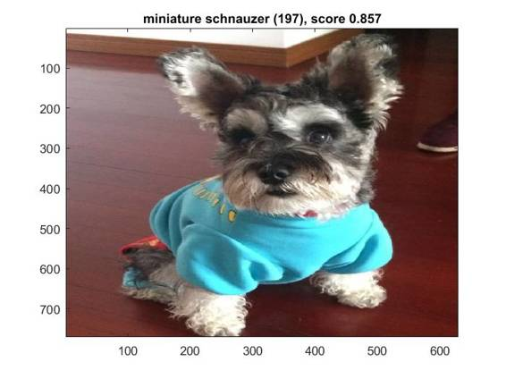
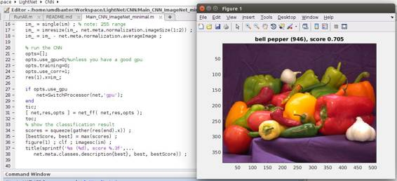

# 资源 | 轻量级 Matlab 深度学习框架 LightNet 的实现（附论文）

机器之心编译

**参与：朱朝阳、吴攀**

> *项目说明及论文摘要：LightNet 是一个轻量级的、多功能的、纯粹的基于 Matlab 的深度学习框架。其设计的目的是为深度学习研究提供一个易于理解、易于使用和高效的计算平台。LightNet 实现的框架支持主要的深度学习架构，例如多层感知网络（MLP）、卷积神经网络（CNN）和循环神经网络（RNN）。LightNet 支持 CPU 和 GPU 进行计算，而且它们之间的切换也非常容易。计算机视觉、自然语言处理和机器人技术中的不同应用作为实验来演示 LightNet。本项目的相关论文可点击文末「阅读原文」下载。*

项目地址：https://github.com/yechengxi/LightNet

**如何使用 LightNet**

在具有 Nvidia GPU（至少 3GB GPU 内存）的计算机上安装最新的 Matlab，并运行 RunAll.m Matlab 脚本。

在这里阅读最新论文：http://arxiv.org/abs/1605.02766（LightNet: A Versatile, Standalone Matlab-based Environment for Deep Learning）

**近期更新**

RNN（带有 skip links）和 GRU 被添加到 RNN 目录。

LightNet 现在支持使用预训练的 ImageNet 网络模型。

查看 CNN/Main_CNN_ImageNet_Minimal()

使用 imagenet-vgg-f 预训练网络的识别示例：

因为 MatConvNet 团队的不懈努力，可以使用 CUDNN 加速卷积运算。

**LightNet 中主要函数**

adagrad：Adagrad 算法的实现

adam：Adam 算法的实现

bnorm：批量规范化层的实现

dropout：dropout 层的实现

fast_conv_layer：卷积层的实现

fast_mlp_layer：线性感知层的实现

generate_output_filename：根据当前参数设置生成输出文件名

im2col_ln：在池化（pooling）层中使用的定制 im2col 函数

Main_Template：用于训练 CNN 和 MLP 网络的模板脚本

lrn：本地响应规范化层的实现

maxpool：最大池化（max-pooling）层的实现

net_bp：在 CNN 和 MLP 网络中使用的反向传播过程的实现

net_ff：在 CNN 和 MLP 网络中使用的前馈过程的实现

pad_data：在 CNN 中使用的填充层

relu：线性修正单元函数的实现

rmsprop：RMSProp 算法的实现

select_learning_rate：Selective-SGD 算法的实现，其在训练的开始或中间自动选择最佳学习速率

sgd：具有动量的随机梯度下降算法的实现

sigmoid_ln：Sigmoid 层的实现

softmax：softmax 层的实现

softmaxlogloss：softmax log loss 层的实现

SwitchProcessor：CPU 和 GPU 之间切换

tanh_ln：tanh 层的实现。

test_net：在测试模式下运行网络以评估当前参数

train_net：在训练模式下运行网络以评估和计算损耗和梯度

TrainingScript：用于 CNN 和 MLP 网络的训练模板

**如何加速 LightNet**

CUDNN 可用于计算卷积。你将需要编译由 MatConvNet 团队提供的 vl_nnconv 函数。

1\. 请访问 http://www.vlfeat.org/matconvnet/install/ 下载。

2\. 将文件夹 MatConvNet_Dir / matlab 复制到 LightNet_Dir / CoreModules / matlab 中。

3\. 尝试在 LightNet 目录中编译 MatConvNet（尽管我们只使用一个卷积函数）。

4\. 在主要测试脚本中设置 opts.use_cudnn = 1。

******©本文为机器之心编译，***转载请联系本公众号获得授权******。***

✄------------------------------------------------

**加入机器之心（全职记者/实习生）：hr@almosthuman.cn**

**投稿或寻求报道：editor@almosthuman.cn**

**广告&商务合作：bd@almosthuman.cn**