# 深度 | 如何在 TensorFlow 中用深度学习修复图像？（附论文）

 **选自 bamos.github.io

**作者：Brandon Amos **

**机器之心编译**

**参与：quantum Cheese、杜夏德**

> *设计师和摄影师用内容自动填补来补充图像中不想要的或缺失的部分。与之相似的技术还有图像完善和修复。实现内容自动填补，图像完善和修复的方法有很多。本文介绍的是 Raymond Yeh 和 Chen Chen 等人的论文「Semantic Image Inpainting with Perceptual and Contextual Losses」中的方法，此论文于 2016 年 7 月 26 日 在 arXiv 上发表。这篇论文演示了如何通过一个 DCGAN 用深度学习进行图像修复。本文面向一般的技术读者，有部分深度内容针对有机器学习基础的人。 加 [ML-Heavy] 这个标记的部分如果你不想知道太多细节就可以跳过。本文案例用的是修补人脸图片缺失像素。*

**目录**

*   介绍

*   第一步：把图像解析成概率分布中的样本点

*   第二步：快速生成伪造图像

*   第三步：找到修复图像的最佳伪造图片

*   结论

完成图像修复需要三步。  

1\. 我们首先要把图像解析成概率分布中的样本点

2\. 这种解析让我们学习如何产生伪图像

3\. 接着我们就能找到补全修复所需的最佳伪图像

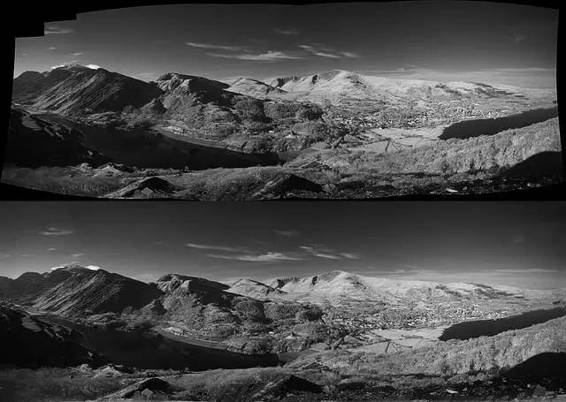
**例如 PS 中自动抹去图像中不想要的部分（图像来源：CC）**

**第一步：把图像解析成概率分布中的样本点**

**如何填补缺失的信息呢？**

在上面的例子中，想象你要构建一个填补缺失碎片的系统。你该怎么做呢？你认为人脑是如何做到的呢？你用到的是何种信息？在本文中我们主要关注两种类型的信息：

1\. 环境信息：你可以通过周围像素点的信息推断出缺失的像素点是什么。

2\. 知觉信息：你会填补一些你认为是「正常」的内容，比如你在现实生活中或其他图像中可能看到的东西。

这两类信息都很重要。没有环境信息，你如何知道该填补什么东西呢？而没有知觉信息的话，那合适的填充内容就太多了。那些机器认为是「正常」的东西也许对人类来说并不正常。

有一个能同时抓住这两点特性的准确又直观的算法是很棒的，这个算法能够逐步展示如何修复一个图像。对特定情形创造这样一个算法也许是可能的，但没有人知道如何写出一个通用的算法。今天最好的方法用的是统计学，并通过机器学习去学习一个接近的技术。

**但统计学怎么能用在这里呢？这些是图像啊！**

为了解决 这个问题，让我们从一种概率分布入手，这种分布已经为人熟知并且可以简洁地用封闭的形式表示：正态分布。这里是正态分布的概率密度函数（probability density function ，PDF） 的。PDF 函数可以这样解释：沿着输入空间的水平方向，纵坐标轴显示的是某个输入出现的概率。（如果你感兴趣，画出这种曲线的代码在 https://github.com/bamos/dcgan-completion.tensorflow/blob/master/simple-distributions.py）

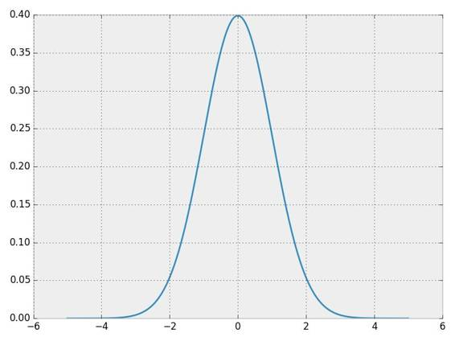 *一个正态分布的概率密度函数（PDF）*

让我们从这个分步中取样以获取一些数据。要确保你理解了 PDF 和这些样本的联系。

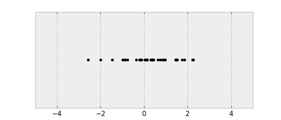 *一个正态分布中取出的样本*

这是一个一维概率分布，因为输入只有一个维度。我们可以对二维分布做同样的事情。

*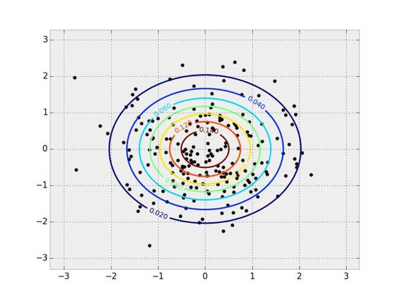*

*一个二维正态分布的 PDF 和样本。PDF 用等值线表示，样本覆盖在它上方。*

图像和统计学之间的关键联系在于，我们可以把图像解析成一个高维概率分布中的样本点。想象一下你正拿着相机拍照。这张照片上有数量有限的像素点。你可以认为你刚拍下的这张照片上的像素点的概率组成了一个概率分布。当你用相机拍这张照片时，你就是在从这个复杂的概率分布中取样。这种分布就是我们用来判断什么样的内容正常或不正常的依据。在本文中，我们要用的是用 RGB 颜色模式表示的彩色图片。我们的图像宽度为 64 像素，高度也为 64 像素，因此我们的概率分布有 64⋅64⋅3≈12k 个维度。图片不像正态分布，我们不知道真正的概率分布，我们只能收集样本点。

**那么该怎样修复图片呢？**

让我们首先考虑下之前的多元动态分布。对于 x=1 ，最有可能的 y 值是多少？我们可以通过 x=1 固定时在所有可能的 y 值上最大化 PDF 的值来找到这个 y 。

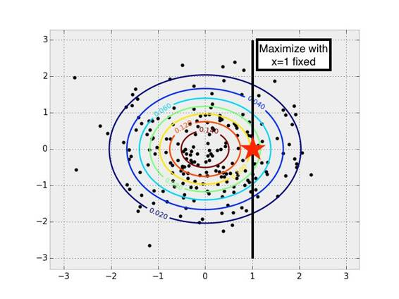*在一个多元正态分布中当 x 为某些固定值时找到对应最有可能的 y 值*

当我们知道一些值并想修复所有缺失值时，这个概念很自然地就延伸到了图像概率分布中。我们在寻找所有可能的缺失值时，就把它当作了一个最大化问题来讨论。修复得到的就是可能性最大的图像。如果直接观察正态分布中那些样本点，只从样本点中找到 PDF 似乎是合理的。挑选你最喜欢的统计模型并且用它来拟合数据就可以了。

虽然很容易能从样本分布中复原出 PDF，但对于图像这种更复杂的分布这其实很困难，而且通常都很棘手。这种复杂性部分来自于复杂的条件相关性：一个像素点的值是由图像中其他点的值决定的。而且在通用 PDF 上进行最大化是一个极其困难而且几乎是难解型非凸优化问题。

**第二步：快速生成伪造图像**

**学习如何从一个未知概率分布中产生新样本点**

我们不学习如何计算 PDF，另一种充分研究过的统计学概念是学习如何用一个生成模型（generative model）产生新的（随机）样本点。生成模型一般很难训练或难解，但最近深度学习领域在这方面取得了很大进展。Yann LeCun 在这篇 Quora 博文中对如何训练生成模型给出了很好的介绍，把它描述成机器学习近十年来最有意思的理念：

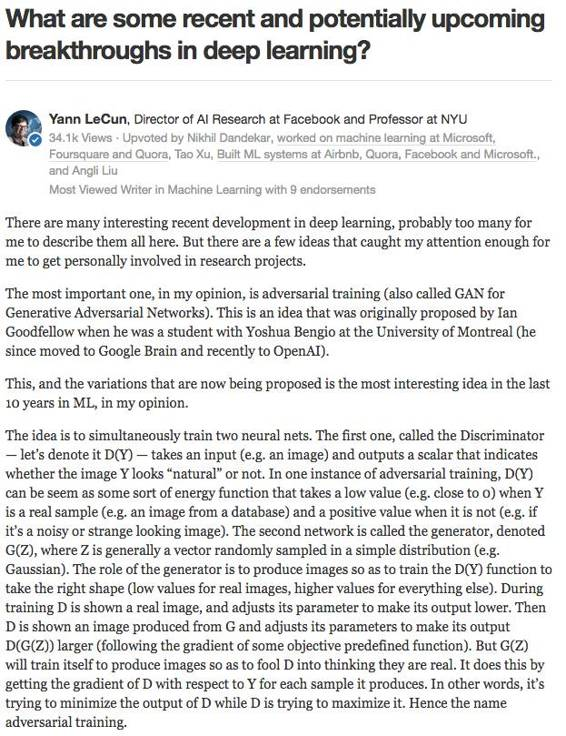 

*Yann LeCun 在这篇 Quora 博文中介绍了对抗性训练。(博文地址：_https://www.quora.com/What-are-some-recent-and-potentially-upcoming-breakthroughs-in-deep-learning/answer/Yann-LeCun?srid=nZuy_ (https://www.quora.com/What-are-some-recent-and-potentially-upcoming-breakthroughs-in-deep-learning/answer/Yann-LeCun?srid=nZuy)）*

*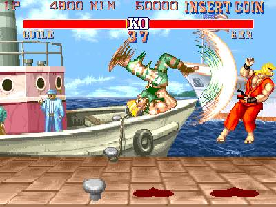* 

*EyeScream 博文中的对抗训练的街头霸王游戏类比（Street Fighter analogy for adversarial networks）。（博文地址：http://soumith.ch/eyescream/）这些网络互相争斗并且一起发展进步，就像两个玩对战游戏的人类。*  

**[ML-Heavy] 生成对抗网络（Generative Adversarial Net ，GAN）的架构**

这个理念起初是在 Ian Goodfellow 等人的开创性论文「Generative Adversarial Nets（GANs）」 中提出的，论文于 2014 年的神经信息处理系统会议（Neural Information Processing Systems，NIPS）上发表。我们定义一个样本和一个大家都熟知的分布，把它表示为 pz。这篇博文剩下的部分，我们都会用 pz 来表示一个－1 到 1（包括－1 和 1）之间的均匀分布。我们用 z~ pz 来表示从这个分布中取样出一个数字。如果 pz 是五维的，我们可以通过 numpy 用一行 Python 代码表示：

> *z = np.random.uniform(-1, 1, 5)array([ 0.77356483,  0.95258473, -0.18345086,  0.69224724, -0.34718733])*

*现在我们就有了一个可以轻松从中取样的简单分布了，我们可以定义一个函数 G(z)，这个函数可以从原始概率分布中生成样本点。*

> *def G(z):*
> 
> *   ...*
> 
> *   return imageSamplez = np.random.uniform(-1, 1, 5)imageSample = G(z)*

所以我们怎么来定义 G(z)以让它一个输入向量，并返回一个图像？我们将使用一个深度神经网络。有许多很棒的介绍深神经网络的基础知识，所以我不在这里说了。我的推荐是斯坦福的 CS231n （http://cs231n.github.io/）课程，Ian Goodfellow 等人的 深度学习相关书籍（http://www.deeplearningbook.org/），图像内核可视化解释 （http://setosa.io/ev/image-kernels/）和卷积算法指南（ convolution arithmetic guide ）

有很多通过深度学习构建 G(z)的方法。最早那篇生成对抗网络论文提出了这个理念，一个训练流程，和初步的实验性结果。后续很多研究都建立在这个理念上，现在有了很大进展。最近一篇论文 「用深度卷积生成对抗网络进行非监督表征学习（Unsupervised Representation Learning with Deep Convolutional Generative Adversarial Networks）」中就提出了一个新方法，该论文由 Radford, Luke Metz, 和 Soumith Chintala 在 2016 年的学习表示国际会议（International Conference on Learning Representations）上发表。它提出了用微步幅（fractionally-strided）卷积进行图像上采样（upsample）的卷积 生成对抗网络（ DCGAN）。

什么是微步幅卷积，它们又是如何进行图像上采样的呢？Vincent Dumoulin 和 Francesco Visin 的论文「深度学习的卷积算法指南（A guide to convolution arithmetic for deep learning）」和 conv_arithmetic（https://github.com/vdumoulin/conv_arithmetic） 是一个写的很好的对深度学习卷积算法的介绍。这个可视化做的非常棒，很直观的展现了微步幅卷积是如何工作的。首先，确保你能理解一个正常的卷积是如何在输入空间（蓝色）滑过一个内核并产生输出空间（绿色）的。这里，输出比输入小。（如果不理解，请参阅 the CS231n CNN section (http://cs231n.github.io/convolutional-networks/) 章节或卷积算法指南。

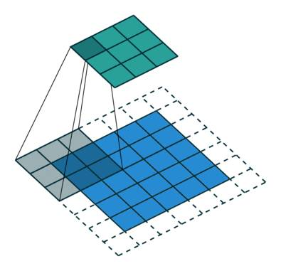 *一个从输入（蓝色）到输出（绿色）的卷积示意图。图像来源： vdumoulin/conv_arithmetic *

接下来，假设你有一个 3x3 的输入。我们的目标是上采样，因此输出更大些。 你可以把为步幅卷积解释成扩展像素点，这样像素点之间就填充了很多 0。然后在这个扩大后的空间上卷积，就会导致更大的输出。这里，输出是 5x5。

 

*从输入（蓝）到输出（绿）的微步幅卷积示意图。图像来源：vdumoulin/conv_arithmetic *

这里写一个边注，上采样的卷积层有很多名字：全卷积（full convolution），网络内上采样（ in-network upsampling），微步幅卷积（fractionally-strided convolution），反向卷积（backwards convolution），去卷积（deconvolution），上卷积（upconvolution），以及转置卷积（transposed convolution）。用「去卷积」这个术语是非常不推荐的，因为这是一个过载的术语：在数学运算或计算机视觉中的其他应用有着完全不同的含义。

现在我们有了微步幅卷积作为积木，我们终于可以表示 G(z) 了，它用一个向量 z~ p_z 作为输入，并输出一个 64x64x3 的 RGB 图像。

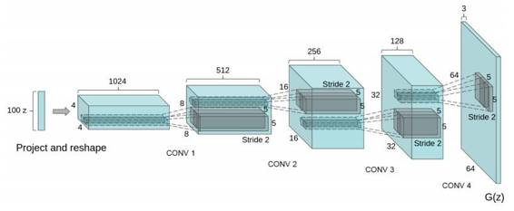*一种用 DCGAN 构建生成器 G(z) 的方法。图像来源：DCGAN paper*  

DCGAN 论文还展现了其他的技巧，还有对 DCGAN 训练的调节方法，比如用批归一化（batch normalization）或 leaky ReLU。

**用 G(z) 产生伪图像**

让我们暂停，感激一下这个 G(z) 方程有多强大吧。那篇 DCGAN 论文解释了如何在一个卧室图像数据集中训练 DCGAN。接着对 G(z）取样，就可以产生出伪图片—生成器认为的卧室样貌。这些图片都不在原始数据集中！

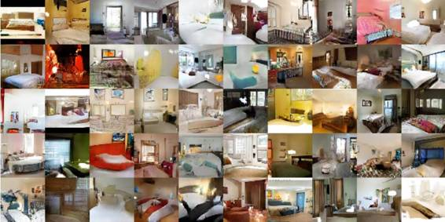 

*用 DCGAN 生成卧室图像。图片来源：DCGAN paper*

而且你也可以在 z 输入空间中进行向量算法。接下来是在一个被训练得可以生成脸部图像的网络上。

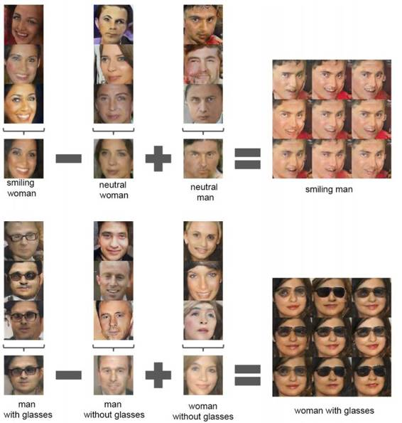

*用 DCGAN 的脸部算法。图片来源：DCGAN paper *

**[ML-Heavy]训练 DCGANs**

现在我们已经定义了 G(z)，并且见识到了这个方程有多强大，我们该如何训练它呢？我们需要找到很多潜在变量。这就是需要用到对抗网络理念的地方了。

首先让我们定义一些标识符。把我们数据的（未知）概率分布定义成 pdata。我们也可以把 G(z) （z~pz）解释成从一个概率分布中提取样本点，让我们把它叫做生成概率分布，pg。

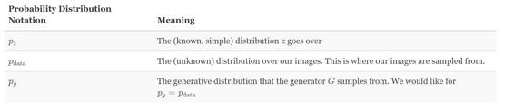

鉴别器网络 D(x) 输入某个图像 x，并返回图像 x 从 pdata 中取样的概率。当图像是来自于 pdata 时，鉴别器应该能返回一个接近 1 的值，而如果图像时伪造的，比如从 pg 取样的图像，鉴别器应该能返回一个接近 0 的值。在 DCGAN 中，D(x) 是一个传统卷积网络。

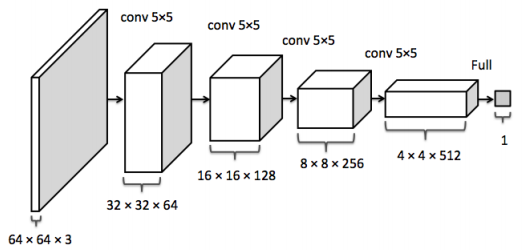 *鉴别器卷积网络。图像来源：inpainting paper *

训练鉴别器 D(x) 的目标是：

1\. 对于真实数据分布 x~ pdata 中的每个图像最大化 D(x)。

2\. 对于来自非真实数据分布 x≁ pdata 的每个图像把 D(x) 最小化。

训练生成器 G(z) 的目标是生成那些可以欺骗 D 的样本。生成器输出的是一个图像，而且可以用作鉴别器的输入。因此生成器想要最大化 D(G(z))，或者同样的最小化 （1-D(G(z)），因为 D 是估值范围在 0 和 1 之间的概率分布。

正如那篇论文中展示的，对抗网络的训练是通过以下的极大极小游戏完成的。第一个条件的期望遍历了真实数据分布和的样本，第二个条件的期望遍历 G(z)~pg 中的样本。

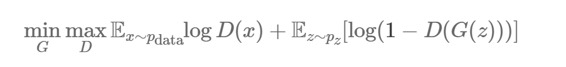

我们对 D 和 G 的训练将通过取得期望值梯度并考虑它们的参数进行。我们知道如何快速计算这个表达式的每个部分。期望值是在尺寸 m 的微型批次中计算的，内部最大值可以用梯度步估算出来。k=1 被证明有利于训练。

把  θd 作为鉴别器的参数，θg 作为生成器的参数。θd 和 θg 的梯度可以通过反向传播计算出来，因为 D 和 G 是用容易理解的神经元网络成分定义的。这是 GAN 中的训练算法。理想情况下一旦这一步完成后，pg=pdata，因此 G(z) 就能从 pdata 中产生出新的样本点。

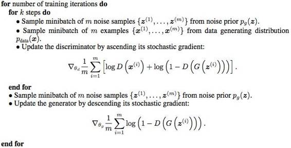

*GAN paper 里的 GAN 训练算法*

**已有的 GAN 和 DCGAN 实现方法**

GitHub 上有很多好的 GAN 和 DCGAN 实现方法： 

*   goodfeli/adversarial (https://github.com/goodfeli/adversarial): GAN 论文作者放出的 Theano GAN 实现方法。 tqchen/mxnet-gan (https://github.com/tqchen/mxnet-gan): 非正式 MXNet GAN 实现。

*   Newmu/dcgan_code (https://github.com/Newmu/dcgan_code): DCGAN 论文作者放出的 Theano DCGAN 实现方法。

*   soumith/dcgan.torch (https://github.com/soumith/dcgan.torch): DCGAN 论文作者之一（Soumith Chintala）放出的 Torch DCGAN 实现方法。

*   carpedm20/DCGAN-tensorflow (https://github.com/carpedm20/DCGAN-tensorflow): 非正式 TensorFlow DCGANU 实现。

*   openai/improved-gan (https://github.com/openai/improved-gan):  OpenAI  (https://arxiv.org/abs/1606.03498)第一篇论文背后的代码。大幅修正了 carpedm20/DCGAN-tensorflow。

*   mattya/chainer-DCGAN (https://github.com/mattya/chainer-DCGAN):非正式 Chainer DCGAN 实现。

*   jacobgil/keras-dcgan (https://github.com/jacobgil/keras-dcgan):  非正式（也不完整）Keras DCGAN 实现。

接着，我们将在 carpedm20/DCGAN-tensorflow (https://github.com/carpedm20/DCGAN-tensorflow)进行构建。

**[ML-Heavy]TensorFlow 上的 DCGANs**

这部分的实现方法在我的 GitHub 资源库中（bamos/dcgan-completion.tensorflow (https://github.com/bamos/dcgan-completion.tensorflow) ）我在这里着重强调这部分的代码来自 Taehoon Kim 的资源库（ carpedm20/DCGAN-tensorflow (https://github.com/carpedm20/DCGAN-tensorflow) ）。在这里用我的资源库，这样在下个环节我们就能轻松运用图片修复的部分了。

这个过程大部分都在一个叫做 DCGAN 的 Python 类（class）中（model.py (https://github.com/bamos/dcgan-completion.tensorflow/blob/master/model.py)）。像这样把所有东西都放在一个类中非常有用，因为训练后中间状态可以被保存起来，以便后面使用。

首先让我们定义生成器和鉴别器。linear, conv2d_transpose, conv2d, 和 lrelu 函数都是在 ops.py (https://github.com/bamos/dcgan-completion.tensorflow/blob/master/ops.py) 中定义的。

> *def generator(self, z, y=None):*
> 
> *    self.z_, self.h0_w, self.h0_b = linear(z, self.gf_dim*8*4*4,*
> 
> *                                           'g_h0_lin', with_w=True)*
> 
> *    self.h0 = tf.reshape(self.z_, [-1, 4, 4, self.gf_dim * 8])*
> 
> *    h0 = tf.nn.relu(self.g_bn0(self.h0))*
> 
> *    self.h1, self.h1_w, self.h1_b = conv2d_transpose(h0,*
> 
> *        [self.batch_size, 8, 8, self.gf_dim*4], name='g_h1', with_w=True)*
> 
> *    h1 = tf.nn.relu(self.g_bn1(self.h1))*
> 
> *    h2, self.h2_w, self.h2_b = conv2d_transpose(h1,*
> 
> *        [self.batch_size, 16, 16, self.gf_dim*2], name='g_h2', with_w=True)*
> 
> *    h2 = tf.nn.relu(self.g_bn2(h2))*
> 
> *    h3, self.h3_w, self.h3_b = conv2d_transpose(h2,*
> 
> *        [self.batch_size, 32, 32, self.gf_dim*1], name='g_h3', with_w=True)*
> 
> *    h3 = tf.nn.relu(self.g_bn3(h3))*
> 
> *    h4, self.h4_w, self.h4_b = conv2d_transpose(h3,*
> 
> *        [self.batch_size, 64, 64, 3], name='g_h4', with_w=True)*
> 
> *    return tf.nn.tanh(h4) def  discriminator(self, image, reuse=False, y=None):*
> 
> *      if reuse:*
> 
> *        tf.get_variable_scope().reuse_variables()*
> 
> *    h0 = lrelu(conv2d(image, self.df_dim, name='d_h0_conv'))*
> 
> *    h1 = lrelu(self.d_bn1(conv2d(h0, self.df_dim*2, name='d_h1_conv')))*
> 
> *    h2 = lrelu(self.d_bn2(conv2d(h1, self.df_dim*4, name='d_h2_conv')))*
> 
> *    h3 = lrelu(self.d_bn3(conv2d(h2, self.df_dim*8, name='d_h3_conv')))*
> 
> *    h4 = linear(tf.reshape(h3, [-1, 8192]), 1, 'd_h3_lin')*
> 
> *    return tf.nn.sigmoid(h4), h4*

当我们初始化这个类时，我们就用这些函数创造了模型。我们需要两种版本的鉴别器，他们共享（或再使用）同样的参数。一个用于来自数据分布的小批图像，另一个用于来自生成器的小批图像。

> *self.G = self.generator(self.z)self.D, self.D_logits = self.discriminator(self.images)self.D_, self.D_logits_ = self.discriminator(self.G, reuse=True)*

接着，我们将定义损失函数。在这里不用求和（sums），我们用 D 的预测和我想让它更好地工作而对它的期望之间的交叉熵（ cross entropy (https://en.wikipedia.org/wiki/Cross_entropy)）。鉴别器想让来自真实数据的预测都为 1，而来自生成器的假造数据都为 0。生成器想让鉴别器的所有预测都为 1.

> *self.d_loss_real = tf.reduce_mean(*
> 
> *    tf.nn.sigmoid_cross_entropy_with_logits(self.D_logits,*
> 
> *                                            tf.ones_like(self.D)))self.d_loss_fake = tf.reduce_mean(*
> 
> *    tf.nn.sigmoid_cross_entropy_with_logits(self.D_logits_,*
> 
> *                                            tf.zeros_like(self.D_)))self.d_loss = self.d_loss_real + self.d_loss_fakeself.g_loss = tf.reduce_mean(*
> 
> *    tf.nn.sigmoid_cross_entropy_with_logits(self.D_logits_,*
> 
> *                                            tf.ones_like(self.D_)))*

分别从每个模型中收集变量，让它们可以被分开训练。  

> *t_vars = tf.trainable_variables()self.d_vars = [var for var in t_vars if 'd_' in var.name]self.g_vars = [var for var in t_vars if 'g_' in var.name]*

现在我们准备好优化参数了，我们要用的是 ADAM (https://arxiv.org/abs/1412.6980)，这是一种适应的非凸优化方法，通常用于现代深度学习中。ADAM 经常会与 SGD 竞争，而且通常不需要手动调节学习速率，动量，及其他超参数（hyper-parameter）。

> *d_optim = tf.train.AdamOptimizer(config.learning_rate, beta1=config.beta1) \*
> 
> *                    .minimize(self.d_loss, var_list=self.d_vars)g_optim = tf.train.AdamOptimizer(config.learning_rate, beta1=config.beta1) \*
> 
> *                    .minimize(self.g_loss, var_list=self.g_vars)*

我们准备好遍历数据了。在每一个时期，我们在一个小批图片中取样，运行优化器升级网络。有趣的是，如果 G 只更新了一次，鉴别器的损耗就不会为零。而且，我认为最后对 d_loss_fake 和 d_loss_real 函数的额外调用引发了一点不必要的计算，而且是多余的，因为这些值已经作为 d_optim 和 g_optim 的一部分计算过了。作为 TensorFlow 中的一项练习，你可以试着用这个部分去优化，并给原始 repo 发送一个 PR 。  

> *for epoch in xrange(config.epoch):*
> 
> *    ...*
> 
> *    for idx in xrange(0, batch_idxs):*
> 
> *        batch_images = ...*
> 
> *        batch_z = np.random.uniform(-1, 1, [config.batch_size, self.z_dim]) \*
> 
> *                    .astype(np.float32)*
> 
> *        # Update D network*
> 
> *        ＃更新一个 D 网络*
> 
> *        _, summary_str = self.sess.run([d_optim, self.d_sum],*
> 
> *            feed_dict={ self.images: batch_images, self.z: batch_z })*
> 
> *        # Update G network*
> 
> *        ＃更新一个 G 网络*
> 
> *        _, summary_str = self.sess.run([g_optim, self.g_sum],*
> 
> *            feed_dict={ self.z: batch_z })*
> 
> *        # Run g_optim twice to make sure that d_loss does not go to zero**
> 
> *        # (different from paper)*
> 
> *       ＃运行两次*g_optim 以确保 d_loss 不会变成 0*
> 
> *       ＃（与论文里不一样）*
> 
> *        _, summary_str = self.sess.run([g_optim, self.g_sum],*
> 
> *            feed_dict={ self.z: batch_z })*
> 
> *        errD_fake = self.d_loss_fake.eval({self.z: batch_z})*
> 
> *        errD_real = self.d_loss_real.eval({self.images: batch_images})*
> 
> *        errG = self.g_loss.eval({self.z: batch_z})*

这就完成了！当然完整代码有更多注释，你可以在 model.py (https://github.com/bamos/dcgan-completion.tensorflow/blob/master/model.py) 上查看。

**在你自己的图像上运行 DCGAN**

这部分的实现方法在我的 GitHub 资源库中（bamos/dcgan-completion.tensorflow (https://github.com/bamos/dcgan-completion.tensorflow) ）我在这里着重强调这部分的代码来自 Taehoon Kim 的资源库（ carpedm20/DCGAN-tensorflow (https://github.com/carpedm20/DCGAN-tensorflow) ）。我们在这里用我的资源库，这样在下个环节我们就能轻松运用图片修复的部分了。这里有一点警告，如果你没有装载了 CUDA 的 GPU，用这个部分的代码训练神经网络可能会非常慢。

如果下面的部分你用不起来请发信息给我！

首先让我们把我的 bamos/dcgan-completion.tensorflow (https://github.com/bamos/dcgan-completion.tensorflow) 和 OpenFace (http://cmusatyalab.github.io/openface) 资源库复制过来。我们要用 OpenFace 的 Python-only 部分预处理图像。不要担心，你不需要安装 OpenFace 的 Torch 附属。为这个创造一个新的工作目录，并复制资源库：

> *git clone https://github.com/cmusatyalab/openface.git*
> 
> *git clone https://github.com/bamos/dcgan-completion.tensorflow.git*

下一步，安装 OpenFace 的 Python 库，这样我们就可以预处理图像了。OpenFace 现在用的是 Python 2,但如果你感兴趣的话，你把它做成 Python 3 可兼容的话我也很开心，别忘了发送一个这里提到的 PR。如果你用的不是虚拟环境，你应该在运行 setup.py 时用 sudo 去全局安装 OpenFace。  

> *cd openface*
> 
> *pip2 install -r requirements.txt*
> 
> *python2 setup.py installcd ..*

接着下载一个脸部图像数据集。你有没有标签都无所谓，我们会扔掉它们的。这里列出部分可选择的：: MS-Celeb-1M , CelebA ，CASIA-WebFace , FaceScrub, LFW (http://vis-www.cs.umass.edu/lfw/), 以及 MegaFace 。把数据集放入  dcgan-completion.tensorflow/data/your-dataset/raw 中，表明这个数据集是未经加工的图片。现在我们就用 OpenFace 的排列工具把图像与处理成 64x64 的。

> *./openface/util/align-dlib.py data/dcgan-completion.tensorflow/data/your-dataset/raw align innerEyesAndBottomLip data/dcgan-completion.tensorflow/data/your-dataset/aligned --size 64*

最后我们就把排列好的图像目录平铺，这样它就只会包含图像而没有子目录了。

> *cd dcgan-completion.tensorflow/data/your-dataset/aligned*
> 
> *find . -name ' .png' -exec mv {} . \;*
> 
> *find . -type d -empty -deletecd ../../..*

我们准备好训练 DCGAN 了。在安装了 TensorFlow  以后，开始训练。  

> *./train-dcgan.py --dataset ./data/your-dataset/aligned --epoch 20*

你可以在 samples 目录中查看来自生成器的随机取样图像看起来是什么样子。我在 CASIA-WebFace 和 FaceScrub 数据集上训练，因为我手头就有它们。在 14 个迭代周期后，我的图像看起来是这样的：

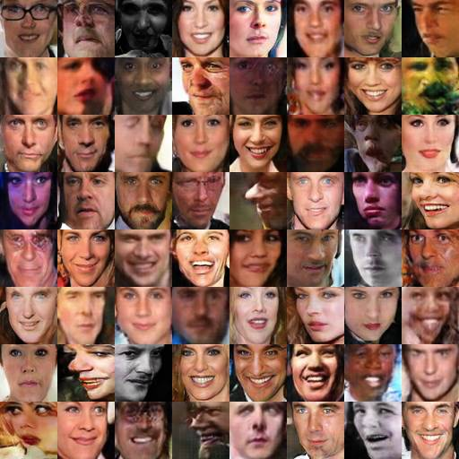
*训练 14 个迭代周期后，我的 DCGAN 中的样本，数据集结合了 CASIA-WebFace 和 FaceScrub。*

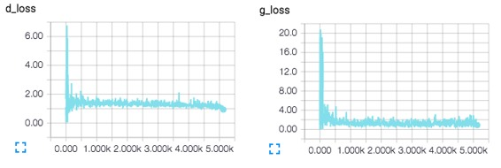
*TensorBoard 损耗的可视化，将在训练中实时更新。*

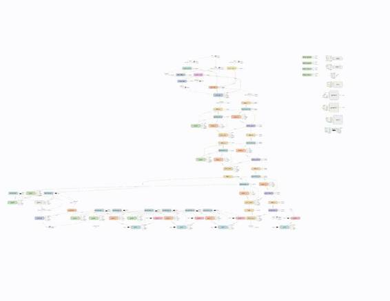
*DCGAN 网络的 TensorBoard 可视化。*

**第三步：找到修复图像的最佳伪造图片**

**用 DCGANs 修复图像**

现在我们就有了一个训练好的鉴别器 D(x) 和生成器 G(z)，那如何用它们来修复图像呢？这个环节我要介绍的是 Raymond Yeh 和 Chen Chen 等人的论文 「知觉和环境缺失下对图像的语义修复（Semantic Image Inpainting with Perceptual and Contextual Losses）」中提出的技术，这篇论文刚刚于 2016 年 7 月 26 日在 arXiv 上发表。

对于有些图像的修复，在像素点上进行 D(y) 最大化确实是一种合理但却不管用的方法。这会产生一些既不是来自数据分布 pdata 也不是来自生成的分布 pg 中的结果。我们想要的是 y 在生成分布上的合理映射。

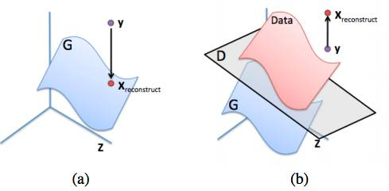

*(a): y 在生成分布（蓝色）上的理想重建*

*(b): 试图只通过最大化 D(y) 重建 y 的失败例子。图像来源：inpainting paper *

**[ML-Heavy] pg 上映射的损失函数**

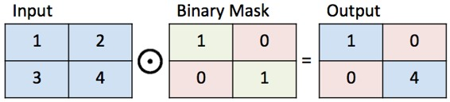

*一个二进制标记的示意说明图*

接下来，假设我们找到了一张来自生成器 G(ẑ ) （对某些 ẑ  的）的图像，它给出了一种对缺失部分的合理重构。那么补全后的像素点 (1−M)⊙G(ẑ )(1−M)⊙G(ẑ ) 就可以被加到原始像素点中，生成出重构后的图像：

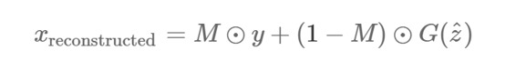 现在我们所需要寻找的就是一些能够很好修复图像的 ẑ 。为了找到 ẑ ，让我们重新审视下本文一开始（在 DCGAN 那部分写到的）我们想要复原环境和感知信息的目标。我们将通过对一个任意的 z~ p_z 定义损耗函数做到这点。这些损耗函数的值更小就意味着 z 对于修复图像更合适。

环境缺失：为了保持与输入图像同样的环境信息，要确保已知输入图像 y 中的已知像素位置与 G(z) 中的像素位置相近。如果 G(z) 没有产生出一个与已知像素点相似的图像，我们就要惩罚它。正式的方法是从 G(z) 中 element-wise 减去 y 中的像素点，然后观察它们有多大差别：

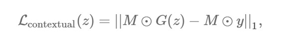 

||x||1=∑i|xi|||x||1=∑i|xi| 是某些向量 x 的 ℓt 标准。  ℓ2 标准是另一个合理的选择，但那篇图像修复论文说  ℓ1 标准在实际应用中效果更好。在这个理想的情况下，所有已知位置的像素点在 y 和 G(z) 之间都是一样的。所以对已知像素点 

G(z)i−yi= 0，因而 Lcontextual(z)=0。

知觉缺失：为了复原出一张看起来很真实的图像，我们要让鉴别器确信这张图像看起来是真的。我们要用的是与训练 DCGAN 时同样的标准：

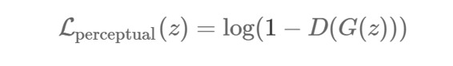 最终我们就会准备好用环境缺失和直觉缺失的结合来寻找  ẑ 了：

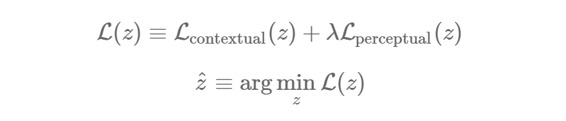
  λ 是一个控制输入环节缺失如何与直觉缺失相联系的超参数。（我用了默认的  λ=0.1，而且还没有太多改变它。）接着就跟前面一样，重构后的图像用 y （G(ẑ )）填补了缺失值：

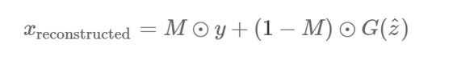
那篇图像修复论文也用了泊松混合使重构后的图像变得平滑。

**用 DCGAN 修复图像的 Tensorflow 部署**

这一环节展示了我添加到 bamos/dcgan-completion.tensorflow (https://github.com/bamos/dcgan-completion.tensorflow) ，修正了 Kim 图像修复的 carpedm20/DCGAN-tensorflow (https://github.com/carpedm20/DCGAN-tensorflow)。

我们可以重新把很多已存在的变量用于修复。唯一加入的新变量就是一个修复标记：

> *self.mask = tf.placeholder(tf.float32, [None] + self.image_shape, name='mask')*

我们要通过梯度下降法（gradient descent）迭代地解决 argminzL(z)，梯度为∇zL(z)。 TensorFlow 的自动分化可以自动为我们计算出这个，一旦我们定义了损耗函数！所以这整个用 DCGANs 修复的理念可以通过在已有的 DCGAN 上加入四行 TensorFlow 代码来实现。（当然我们还需要一些非 TensorFlow 代码。）

> *self.contextual_loss = tf.reduce_sum(*
> 
> *    tf.contrib.layers.flatten(*
> 
> *        tf.abs(tf.mul(self.mask, self.G) - tf.mul(self.mask, self.images))), 1)self.perceptual_loss = self.g_lossself.complete_loss = self.contextual_loss + self.lam*self.perceptual_lossself.grad_complete_loss = tf.gradients(self.complete_loss, self.z)*

接着，让我们定义一个标记。我已经在图像中心位置加了一个，但你可以自由添加其他的，比如一个随机标记，并把提出一个 pull 请求。  

> *  if config.maskType == 'center':*
> 
> *    scale = 0.25*
> 
> *    asser (scale <= 0.5)*
> 
> *    mask = np.ones(self.image_shape)*
> 
> *    sz = self.image_size*
> 
> *    l = int(self.image_size*scale)*
> 
> *    u = int(self.image_size*(1.0-scale))*
> 
> *    mask[l:u, l:u, :] = 0.0*

我们要用 minibatche 和动量把 z 映射到 [-1,1]范围内来进行梯度下降。 

> * for idx in xrange(0, batch_idxs):*
> 
> *    batch_images = ...*
> 
> *    batch_mask = np.resize(mask, [self.batch_size] + self.image_shape)*
> 
> *    zhats = np.random.uniform(-1, 1, size=(self.batch_size, self.z_dim))*
> 
> *    v = 0*
> 
> *    for i in xrange(config.nIter):*
> 
> *        fd = {*
> 
> *            self.z: zhats,*
> 
> *            self.mask: batch_mask,*
> 
> *            self.images: batch_images,*
> 
> *        }*
> 
> *        run = [self.complete_loss, self.grad_complete_loss, self.G]*
> 
> *        loss, g, G_imgs = self.sess.run(run, feed_dict=fd)*
> 
> *        v_prev = np.copy(v)*
> 
> *        v = config.momentum v - config.lrg[0]*
> 
> *        zhats += -config.momentum  v_prev + (1+config.momentum)*v*
> 
> *        np.clip(zhats, -1, 1)*

**修复你的图像**  

选择一些要修复的图像，然后把它们放到 dcgan-completion.tensorflow/your-test-data/raw 中。在 asdcgan-completion.tensorflow/your-test-data/aligned 之前把它们排列好。我随机从 LFW 中选取了一些图像来做。

你可以用以下代码运行修复指令：

> *./complete.py ./data/your-test-data/aligned/***** --outDir outputImages*

这会运行起来并周期性的输出修复过的图像给 —outDir。你可以用 ImageMagick 从中生成一个 gif 图像：

> *cd outputImages*
> 
> *convert -delay 10 -loop 0 before.png completed/   .png completion.gif*

最终的图像修复。这些图像的中心都是自动生成的。相关源代码在 https://github.com/bamos/dcgan-completion.tensorflow 。这些并没有被监管！我是从 LFW 数据集中随机选取了一个图像子集。  

**结论**

本文讲述了修复图像的方法：

1\. 把图像解析成一个概率分布中的样本点

2\. 生成伪图像

3\. 找到修复所需的最佳伪图像

本文用的例子是脸部图像，但 DCGANs 也可以被训练做其他类型的图像修复。一般来说训练 GAN 有困难，现在还不知道如何在特定对象类上训练它们，也不知道如何在大图片上训练。但这是一个很有前景的模式，非常期待 GAN 研究日后的新进展。

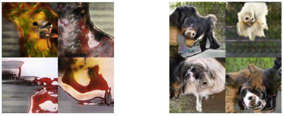 

*ImageNet 上的 DCGAN 样本（左）和改进后的 GAN 样本（右，本文中为涉及到），表明我们还没有理解如何对每种类型图像运用 GAN 。图像来源：improved GAN paper 。*

***©本文由机器之心编译，***转载请联系本公众号获得授权***。***

✄------------------------------------------------

**加入机器之心（全职记者/实习生）：hr@almosthuman.cn**

**投稿或寻求报道：editor@almosthuman.cn**

**广告&商务合作：bd@almosthuman.cn**

**点击阅读原文，下载论文↓↓↓****