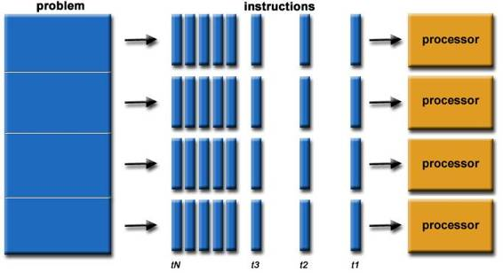
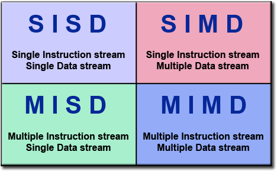
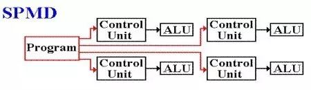
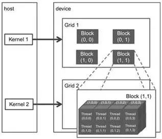
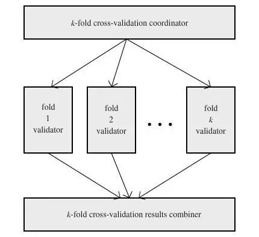

# 深度 | 机器学习中的并行计算：GPU、CUDA 和实际应用

选自 KDnuggets

**作者：Matthew Mayo**

**机器之心编译**

**参与：吴攀、李亚洲**

> *如果机器学习任务无法使用并行处理，那么经济价值就无法得到体现，但是并行可能是一件比较麻烦的事。这篇文章对基于 GPU 的并行和 CUDA 框架进行了介绍性的概述，并且还谈到了作者对实际实现并行的一些想法。*

传统上（不管这里的传统到底是什么意思），机器学习是在一个单处理器环境中执行的，其中算法的瓶颈可能会导致模型处理过程中出现极大的延迟——从训练到分类、再到距离和误差计算等等。除了最近对神经网络训练的利用，许多机器学习（包括 scikit-learn 这样现成的库和开发者自己实现的算法）都没有使用到并行处理。

这种并行处理（在这里是指在共享内存架构上的并行执行）的缺乏妨碍了我们使用大量并发式执行的线程（concurrently-executing threads），这些线程可以分别执行不同的任务以实现有经济价值的性能表现。缺乏并行性的原因是多种多样的，其中至少有一点是：并行编程（parallel programming）很难。事实也确实如此。

*图 1：并行问题的大概形式*

当然，并行处理不是万能魔法，并不是对每一种情形都适用；另外在将并行处理整合进某个项目中时，还要考虑实际和理论上的算法设计问题。但是，因为大数据（Big Data）包含了非常大量的数据，其相关的问题也正越来越依赖于常规的机器学习，所以考虑到并行可能在算法执行的时间节省等问题上所带来的价值，其所可能具有的麻烦就是值得我们去面对的了。

**在图形处理器（GPU）上的通用计算**

在适当情况中最常用的并行以及这篇文章的重点是使用图形处理单元上的通用计算（GPGPU），这种方法是利用现代高端图形处理器（GPU）的大量处理内核来同时执行计算成本高的任务。尽管并非所有的机器学习任务（或其它软件任务的集合）都受益于 GPGPU，但毫无疑问目前已有大量的高计算成本和高时间成本的任务可以享受到 GPGPU 的优势。修改算法以使其中一些特定的任务可使用 GPU 并行能够为任务的性能表现和完成速度带来显著的提升。

*图 2： Flynn 分类法。左上：单指令流单数据流（SISD）；左下：多指令流多数据流（MISD）；右上：单指令流多数据流（SIMD）；右下：多指令流多数据流（MIMD）*

GPGPU 范式符合 Flynn 分类法中的「单程序多数据（SPMD）」架构，这不同于传统的多核 CPU 计算范式。

*图 3：MIMD 的单程序多数据（SPMD）分支*

应该指出的是，尽管这些修改无疑能有利于处理非常大的数据集（这就是大数据（Big Data）的意思），但它们的实现对小得多的数据也能有很好的效果。一些特定的任务可能不管数据大小如何，其计算成本和时间成本都很高。将这些并不必需串行处理的任务并行化也能在小数据上带来好处。

机器学习算法还可以通过并行处理具有许多相同算法的常见任务来实现性能提升，比如执行矩阵乘法（许多分类任务会用到）、回归、聚类技术、以及特别有价值的线性回归。对于这种在任务执行延迟上的理论加速，还需要说明的一点是：Amdahl 定律说明在整个任务的执行上的理论加速会随着每个系统的资源的增量提升而增加。但是，不管整体的提升幅度如何，理论上的加速都会受到不能受益于并行改进的任务组分的限制。所以它存在一个极限，就像木桶只能装符合最短木板的那么多水一样。

要更深入地了解通用并行计算，请参考来自劳伦斯利物摩尔国家实验室 Blaise Barney 的详细介绍《Introduction to Parallel Computing》：https://computing.llnl.gov/tutorials/parallel_comp/

**CUDA 并行编程框架**

来自英伟达的 CUDA 并行编程框架是 GPGPU 范式的一种特定的实现。CUDA 曾经是 Compute Unified Device Architecture（计算统一设备架构）的缩写，但英伟达放弃了这种解释，现在就仅使用 CUDA。这种架构可以使用通过 GPU 加速（GPGPU 的另一种说法）的机器学习并行化，它需要特别的条件才能有效地管理可用资源和提供最大化的执行速度增益。

CUDA 在技术上是一种异构计算环境，也就是说它利用了同时在 CPU 和 GPU 上的协调计算。CUDA 架构由主机（host）和设备（device）组成；其中主机是指传统的 CPU，而设备则是指带有大量算术单元的处理器，通常是 GPU。CUDA 提供了传统编程语言的扩展（CUDA 捆绑的原生语言是 C，但也移植或加入了许多其它语言）、可以创建核（kernel，核是指并行执行的函数）。

当一个核被加载时，它会被大量 CUDA 设备的线程同时执行，其中的某个集合可以被称为一个线程块（block of threads），块可以集聚为网格（grid）。线程在块中被排布成三维布局的形式，然后块又在网格中被排布成三维的形式。图 4 给出了这些关系和布局。一个核（kernel）所部属的线程、块和网格的总数量是由该核被加载的主机上所执行的程序员的代码所策略性地规定的，这要基于给定的情况的要求。

重要的是，主机和设备都有自己的内存空间，这些空间是彼此独立的。一个 CUDA 设备只有一个全局内存空间。加载核和产生大量用于计算的设备线程的首要条件是将所需的数据从主机复制到设备内存。一旦计算完成，还必须按相反的方向将结果复制回去。这都是通过 CUDA 扩展来实现的，并且从程序员的视角来看，这都发生在一个非常抽象的层面上。

当管理设备的内存时，给核分配正确的块是很关键的；太少会导致计算能力缺乏，而太多的话则会浪费线程——多余的线程可以被分配给其它同时执行的核。举个例子，在 k-fold 交叉验证建模过程中，这可能会导致分配给特定 fold 的的线程太少，从而导致比预期耗时更长的验证过程。

相对地，这也可能导致在 k-fold 交叉验证建模过程中分配了过多的线程，从而让很多线程无法得到使用，进而延长了所有 fold 完成它们的模型验证所需的时间。

幸运的是，设备内存（包括被分配给块和最终的核的线程的数量）的管理是可以被用户定义的（但存在上限，比如每个块最多 1024 个线程）。CUDA 也提供了将这种管理半自动化的聪明方法，让内存管理函数可以将数学表达式用作参数，这样就可以，比如说，在执行的核就能计算出一个数组或矩阵这样的数据结构的大小，然后分配适合其计算的内存大小和维度。

*图 4： CUDA 网格组织*

我们提倡并行化的线性回归的一个方面是矩阵乘法——考虑一下矩阵乘法及其在 CUDA 架构上的实现。不考虑矩阵的大小，在高层面上我们假设在设备全局内存中有两个矩阵 M 和 N 相乘，另外还有用于结果矩阵 P 的空间。然后我们将矩阵 M 和 N 复制到设备。

为了简单，我们假设所有矩阵都可以放进一个块中，我们每个块线程都能计算 P 的一个元素。要完成这个计算，每个线程都载入 M 的一行和 N 的一列，计算出点积并将其存储为 P 的对应元素。因为每一个点积都是并行计算出来的，那么其执行矩阵乘法的总时间就是其执行单个点积计算所用的时间。计算完成后，矩阵 P 被从设备内存复制回主机内存，其在这里可以继续被串行代码使用。通常情况下，这样的一次核运算之后，设备内存会解除分配（deallocation）

这是一个高层面的概述。在实际情况下还需要执行一些额外的任务，比如确定块的大小。这也是一个简单的特定案例；但是尽管这种内存管理和设备计算技术必定根据算法的不同而会有所不同，但也可在多种不同的任务之上概括成：确定可并行化的计算、分配设备内存、复制数据到设备、执行并行化的计算、复制结果回主机、继续执行串行代码。注意这里的内存分配和数据复制开销可能会很容易变成瓶颈——这些过程可能会妨碍某些计算时间上的节省。

**机器学习中的算法应用**

给定适当的数据、算法实现的知识，结合自己的意图，你就能在机器学习中的并行处理上进行无限的尝试。当然，就像前面提到的那样，确定代码的并行部分是最难的任务，在给定的算法中就没这种问题。

一个比较好的起始点是矩阵乘法，就像上面一样，它是实现线性回归算法的很好的方法。在 GPU 上实现线性回归可参加论文：Performance improvement of data mining in Weka through GPU acceleration。该论文注重对速度的增加，而且提出了一些对概念化并行算法的其他洞见。

另一个机器学习中使用的、已经成熟的并行任务是距离计算（distance calculation）。欧几里得距离是在大量算法上反复计算所需的一个非常常见的度量，包括 k-值簇。因为逐个迭代的单独距离计算不依赖于同一迭代的其他计算，这些计算可并行进行（如果我们不将内存管理的花费作为统筹的瓶颈。）

 

*图 5：k-fold 交叉验证*

虽然上面提到的这些统计任务可能从执行效率上得到好处，还有机器学习数据流的其他方面可能产生更大的收益。机器学习模型验证中使用的一个常见的评估手段是 k-fold 交叉验证，涉及到密度，不需要数据集分割的连续处理。k-fold 交叉验证（k-fold cross-validation）是模型建立的确定性方法（deterministic method），通过省去数据集的一个 k 分割片段进行验证，或者说是 fold。在所有的 k-1 分割上训练，并使用剩下的第 k 个分割片段测试。然后重复这一过程 k 次，结合所有的预测误差结果并在一个混合模型中进行平均。这种方法提供了可变性，可以尽可能的产生最准确的预测模型。

在顺序进行这一模型验证时，相对来说有些耗时间，特别是在每个 fold 都配对一个计算成本昂贵的算法任务时，比如线性回归矩阵相乘。k-fold 交叉验证是预测给定机器学习算法误差率的标准方法，试图来增加验证的速度。

对 Python 使用的考虑超出了算法设计的范围，涉及到优化本地代码和相比于并行实现的运行时间，这超出了本文的讨论范围。

在任何情景下都能利用无限的计算资源需要算法上的思考，这与机器学习没什么不同。有了明智的思考，深入了解自己想做什么，再加上工具集和文档，你想象不到自己能做到哪一步。并行计算、GPU 和传统机器学习会成为你的好朋友。

******©本文为机器之心编译文章，***转载请联系本公众号获得授权******。***

✄------------------------------------------------

**加入机器之心（全职记者/实习生）：hr@almosthuman.cn**

**投稿或寻求报道：editor@almosthuman.cn**

**广告&商务合作：bd@almosthuman.cn**