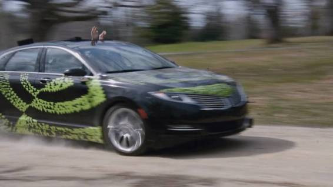
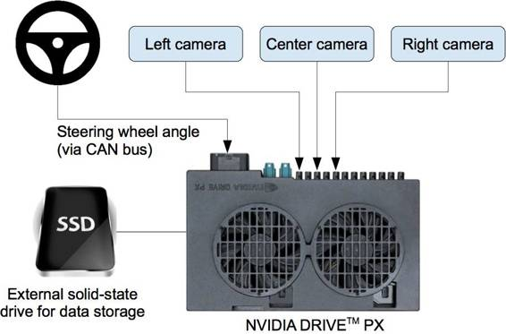
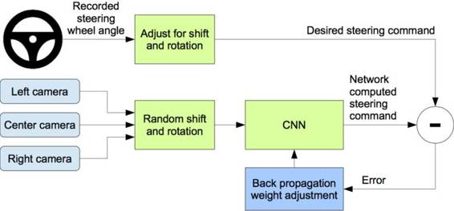
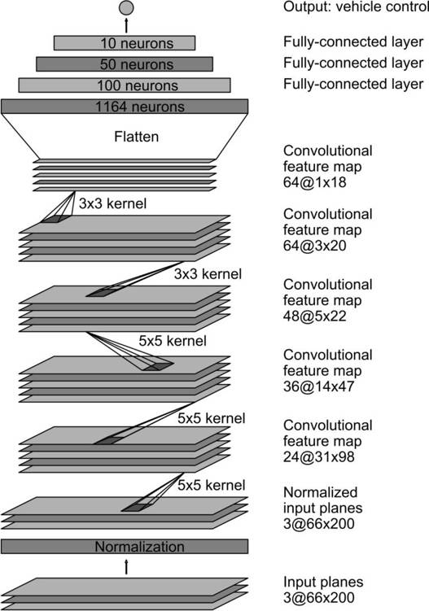
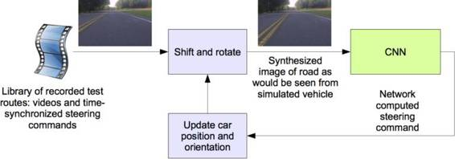
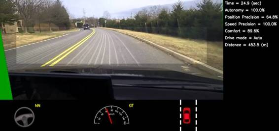
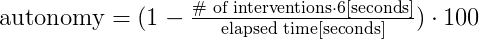
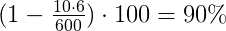
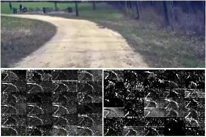
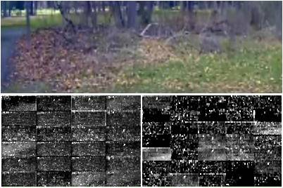

# 深度 | 英伟达自动驾驶技术解读：用于自动驾驶汽车的端到端深度学习（附论文）

选自 NVIDIA

**作者：Mariusz Bojarski, Ben Firner, Beat Flepp, Larry Jackel, Urs Muller and Karol Zieba**

**机器之心编译**

**参与：Rick、吴攀、李亚洲**

在新型汽车应用中，我们使用卷积神经网络（CNN）将从前向摄像机得到的原始图像映射成自动驾驶汽车的驾驶命令。这种强大的端到端方法意味着只需要极少的来自人类的训练数据，该系统就能学会驾驶，且不管有没有车道标志，也不管是在地方道路上还是在高速公路上。该系统还能在停车场或未铺好的道路等没有明显视觉指引的地方运行。

 

*图 1：英伟达的行驶中的自动驾驶汽车*

我们使用了一个运行 Torch 7 的 NVIDIA DevBox 来设计用于训练的端到端的学习系统。一台也带有 Torch 7 的 NVIDIA DRIVETM PX 自动驾驶计算机被用于确定行驶路线——以 30 帧每秒（FPS）的速度运行。该系统被训练用于自动学习必要处理步骤的内部表征，比如在只有人类转向角度作为训练信号的情况下，检测有用的道路特征。我们从未明确地训练它用于检测道路轮廓等事物。与运用车道标记检测、路径规划和控制等确切的问题分解方法相反，我们的端到端系统会同时优化所有处理步骤。

我们相信端到端的学习可以带来更好的性能以及更小巧的系统。性能的提升是来内部组件的自我优化，以最大限度地提高整体系统的性能，而不是优化人类所选择的中间标准，比如车道线检测。为了人类理解的方便而选择这样的标准是可以理解的，虽然它不会自动保证最大化的系统性能。因为系统学习解决这一问题只需最小数量的处理步骤，所以更小的网络是可能的。

本文基于 NVIDIA 的论文《End to End Learning for Self-Driving Cars》。

**处理视觉数据的卷积神经网络**

卷积神经网络已经彻底改变了计算模式识别过程。在它得到广泛采用之前，大多数模式识别任务还是使用人工提取特征并放入分类器的初始阶段。卷积神经网络的重要突破在于现在可以从训练样本中自动学习特征。当它被应用在图像识别任务中时则尤其强大，因为卷积运算会捕获图像的二维特点。与该运算总数相比，使用卷积核（convolution kernel）扫描一张完整图像所需要学习的参数相对较少。

尽管拥有特征学习的卷积神经网络已投入商业应用 20 余年，但由于两项重要的进展，其使用者近年来才出现数量激增。第一个是带有标签的大数据集的发展，比如 ImageNet 大规模视觉识别挑战赛（ImageNet Large Scale Visual Recognition Challenge / ILSVRC）目前被广泛用于训练和验证。第二个是卷积神经网络学习算法现在可以部署在大规模并行图形处理单元（GPU）上，这能极大地提升学习与推理能力。

我们这里所描述的卷积神经网络超越了基本的模式识别。我们开发的系统会学习自动驾驶所需的整个处理进程。这个项目的基础成果实际上是美国国防部高级研究项目局（DARPA） 于 10 年前完成的、被称作 DARPA Autonomous Vehicle （DAVE）的播种项目——一辆小型无线电控制（RC）汽车行驶过一条由垃圾填充的小路。DAVE 在与人类驾驶环境类似但不完全相同的环境中训练了几个小时。训练数据包括来自两个摄像机的视频以及人类操作员所发送的转向命令。

DAVE 在许多方面是受到 Dean A. Pomerleau 的开创性工作的启发，他于 1989 年构建了神经网络中的自动驾驶陆地载具（ALVINN：Autonomous Land Vehicle in a Neural Network ）系统。ALVINN 是 DAVE 的前身，它提供了这样一个概念的原始证明：即端到端训练的神经网络某天或许能够在公共道路上驾驶汽车。DAVE 证明了端到端学习的潜力，并且它确实被用来解释启动  DARPA 应用于地面机器人的学习（DARPA Learning Applied to Ground Robots / LAGR ）项目的原因，但是 DAVE 的表现并不足以令人相信它能够完全替代越野驾驶更模块化的方法。（DAVE 在复杂环境中的事故平均间距约为 20 米。）

大约一年前我们开始尝试去改善原始的 DAVE，并建立了一个用于公共道路行驶的强大系统。基于对这些特征的观察，这项工作的主要动机是为了免去识别专为人类标注的特征的需要，如车道标记、护栏，或其他汽车，并免于建立一个「if, then, else」规则集合。我们很高兴能够分享这一新工作的初步结果，它有个合适的名字：DAVE–2。

**DAVE–2 系统**

图 2 显示了一个简化的 DAVE-2 训练数据采集系统方框图。三架摄像机安装在数据采集汽车的挡风玻璃后面，而来自摄像机的时间戳视频是与人类驾驶员的转向角度同时被捕获的。转向命令是通过进入车辆的控制器区域网络（Controller Area Network / CAN）总线得到。为了使我们的系统独立于汽车的外形，我们将转向命令表示为 1/r，其中 r 代表每米的转弯半径。我们使用 1/r 而不是 r 以防止直线驾驶时的奇点（直线行驶的转弯半径为无穷大）。1/r 从左转弯（负值）转变到右转弯（正值）时平滑地通过零点。

 

*图 2：数据采集系统概览*

训练数据包含视频采样得到的单一图像，搭配相应的转向命令（1/r）。只有来自人类驾驶员的数据是不足以用来训练的；网络还必须学习如何从任何错误中恢复，否则该汽车就将慢慢偏移道路。因此训练数据还扩充了额外的图像，这些图像显示了远离车道中心的偏离程度以及不同道路方向上的转动。

两个特定偏离中心的变化图像可由左右两个摄像机捕获。摄像机和所有转动之间的额外偏移是通过最近的摄像机的图像的视角变换（viewpoint transformation）进行模拟的。

精确的视角变换需要 3D 场景知识，而我们没有这些知识，因此只能做近似变换——假设水平线以下的所有点都在平地上，而水平线以上的所有点在无限远。这种方法在平面地形上产生的效果很好，但对于一个更完整的渲染，它还引入了地表以上物体的畸变，比如汽车、电线杆、树木和建筑物。幸运的是，这些畸变不会给网络训练带来大问题。变换后的图像的转向标签会在两秒内被迅速调整到正确驾驶汽车时回到的期望位置和方向。

图 3 显示了我们的训练系统框图。图像被送入一个卷积神经网络，然后计算一个被推荐的转向命令。这个被推荐的转向命令会与该图像的期望命令相比较，卷积神经网络的权重就会被调整以使其实际输出更接近期望输出。权重调整是使用 Torch 7 机器学习包中所实现的反向传播完成的。

一旦训练完成，网络就能够从单中心摄像机（single center camera）的视频图像中生成转向命令。图 4 展示了这个配置。

 

*图 4：训练过的网络用于从单中心前向摄像机中生成转向命令。*

**数据收集**

训练数据是通过在各式道路以及多样的照明和天气条件组合中驾驶汽车来收集的。我们收集了伊利诺伊、密歇根、宾夕法尼亚和纽约的高速公路数据以及新泽西中部的地面街道数据。其他道路类型包括（有以及没有车道标线的）双车道公路、带有停泊车辆的小区道路、隧道和未铺好的道路。数据是在晴朗、多云、有雾、下雪和下雨天气中收集的，包括白天和夜间。在某些情况下太阳在低空中，会导致来自道路表面反射以及挡风玻散射的眩光。

捕获数据使用的是我们的线控测试车辆——一辆 2016 年的 Lincoln MKZ 或者 2013 年的 Ford Focus ，两辆车的摄像机被置于类似的相应位置。我们的系统独立于任何特定的车辆样式或模型。我们鼓励司机保持充分的注意力，否则要么就照往常一样驾驶。截至 2016 年 3 月 28 日，共收集到约 72 小时的驾驶数据。

**网络架构**

我们训练网络的权重以尽量减少转向命令输出之间的均方误差（mean-squared error），无论它是由网络、人类驾驶员的命令所引起，还是由为了图像的去中心化和旋转而做出调整的转向命令（参见后面的「增强」一节）所引起。图 5 展示了该 9 层网络的架构，其中包括一个归一化层（normalization layer）、5 个卷积层和 3 个完全连接的层。这张输入图像被分割成 YUV 平面并被传递到网络中。

 

*图 5：卷积神经网络架构。该网络有大约 2700 万个连接和 25 万个参数。*

网络的第一层执行图像归一化。这个归一化器（normalizer）是硬编码的且不是在学习过程中被调整的。在网络中执行归一化允许归一化方案被网络架构更改，并通过 GPU 处理得到加速。

卷积层被设计用于进行特征提取，并通过一系列多样化层配置的实验被经验性地选择。然后我们在头三个卷积层中使用带有一个 2×2 步幅（stride）和一个 5×5 核（kernel）的步幅卷积（strided convolutions），在最后的两个卷积层中使用一个有着 3×3 核大小的非步幅卷积。

我们在这五个卷积层后面加三个全连接层（fully connected layer），得到一个最终的输出控制值，也就是逆转弯半径（inverse-turning-radius）。这个全连接层被设计用作一个转向控制器的转向功能，但我们注意到通过端到端地训练系统，要想清楚地区分网络功能的哪个部分主要作为特征提取器、哪个部分作为控制器，这是不可能的。

**训练细节**

**数据选择**

训练一个神经网络的第一步是选择所使用的帧。我们收集到的数据被标记为道路类型、天气状况和司机的活动（保持车道、转换车道、转弯等等）。要训练一个卷积神经网络进行车道跟随，我们只需选择司机保持在那条车道的位置数据，并放弃其余数据。然后我们以每秒 10 帧（FPS）的速度取样视频，因为较高的采样率会包含高度相似的图片，因此不能提供更多额外的有用信息。为了消除直线驾驶的偏差，训练数据包含了相当大一部分表征道路曲线的帧。

**增强**

选择了最后的帧集合之后，我们通过添加人工偏移和转动来增加数据，教网络如何从一个不利位置或方向中恢复。这些扰动的大小是从一个正态分布中随机选择的。这个分布具有零均值，且其标准偏差是我们所测量的人类驾驶员的两倍。（如前所述）由于级数的增加，人为增强数据确实增加会不需要的内容。

**仿真**

在一个训练过的卷积神经网络用于道路测试之前，我们首先通过仿真评估网络的性能。图 6 展示了仿真系统的一个简化框图，而图 7 展示了一张交互模式下的模拟器截图。

 

*图 6：驾驶模拟器框图*

该模拟器从连接到一辆人类驾驶的数据采集车的前向车载摄像机获取预先录制的视频，并生成近似于卷积神经网络替代人类驾驶车辆情况的图像。由于人类司机不总是在车道中心驾驶，我们必须手动校准车道中心，因为它是与模拟器使用的每一帧视频相联系。我们称之为「ground truth」。

模拟器转换原始图像是出于对 ground truth 偏离的考虑。注意这种转换也包括人类实际驾驶路径和 ground truth 之间的任何矛盾。这个变换是通过先前所描述的同一方法完成的。

该模拟器会访问所记录的测试视频及其捕获视频时的同步转向命令。该模拟器会发送测试视频（已为 ground truth 上的任何偏移进行了调整）的第一帧作为训练的 CNN 的输入，然后其会返回该帧的一个转向命令。卷积神经网络转向命令和所记录的人类驾驶员命令一道，被送进模拟车辆的动态模型中以更新其位置和方向。

 

*图 7：交互模式中的模拟器截图。参见性能指标的注解文本。由于视点变换，左边的绿色区块是未知区域。水平线以下突出的宽矩形是被发送到卷积神经网络的区域。*

然后该模拟器修改测试视频的下一帧使图像出现，仿佛车辆处于跟随卷积神经网络的转向命令后所到达的位置。接着这个新的图像被送到卷积神经网络中，如此以往重复进行。

该模拟器会记录偏心距（从车到车道中心的距离）、偏航和虚拟汽车的行程。当偏心距超过一米就会触发一次虚拟人类干预，而虚拟车辆的位置和方向会被重置，以匹配原始测试视频相应帧的 ground truth。

**评估**

我们的网络评估分两个步骤：首先是在仿真过程，然后是在道路测试过程。

在仿真中，我们的网络在模拟器中向一套预先录制好的的测试路线提供转向命令，该路线对应在新泽西州的蒙茅斯县驾驶大约共三小时、100 英里的行程。测试数据是在不同照明和天气条件下获得的，包括公路、当地道路和住宅街道。

我们通过计算模拟车辆偏离中心线超过一米时所触发的模拟人类干预数量，来评估网络（自主）驾驶车辆的时间占比。我们假设现实生活中的一个实际干预总共需要六秒：这是人类重新掌控车辆、重新确定中心、然后重新启动自动驾驶模式所需的时间。我们通过干预措施计数来计算自主性百分比，将它乘以 6 秒再除以模拟测试所消耗的时间，然后用 1 减去这一结果：

 

所以，如果我们在 600 秒内有 10 次干预，则自主值为：

 

**道路测试**

当训练过的网络已经在模拟器上表现出良好性能之后，我们就在测试汽车上的 DRIVE PX 中加载网络并将其用于道路测试。对于这些测试，我们将汽车执行自动驾驶的时间占比作为性能测量的标准。这个时间不包括变道以及从一条路到另一条路的转弯。对于在新泽西州蒙茅斯县的一次典型驾驶而言，从我们位于霍姆德尔的办公室开到 Atlantic Highlands，几乎 98% 的时间是处于自动驾驶状态。我们还驱车在花园州高速公路（一个带有上下坡道的多车道高速公路）上连续无障碍行驶了 10 英里。

这是一段我们在不同条件下驾驶测试车辆的视频：

**内部卷积神经网络状态的可视化**

 

*图 8：卷积神经网络如何「看」一条尚未铺好的路。顶部：发送到卷积神经网络的相机图像子集。左下方：第一层特征映射的激活（Activation ）。右下方：第二层特征映射激活。这表明卷积神经网络已经学会自己检测有用的道路特征，即在只有人类转向角度作为训练信号的情况下。我们从未明确训练它来检测道路轮廓。*

图 8 和图 9 展示了两个不同示例输入的头两层特征映射的激活，一条尚未铺砌的路和一片森林。在未铺好道路的示例中，特征映射激活清晰地显示出道路轮廓，而森林示例中的特征映射大多含有噪声，亦即卷积神经网络在这幅图像中没有发现有用信息。

这表明卷积神经网络已学会自己检测有用的道路特征，即在只提供人类转向角度作为训练信号的情况下。例如我们从未明确地训练它来检测道路轮廓。

 

*图 9：没有道路的示例图像。头两个特征映射的激活似乎大多含有噪声，即卷积神经网络没有识别出这张图像中的任何有用的特征。*

**结论**

我们的实验表明，卷积神经网络能够在没有人工分解道路或车道线检测、语义抽象、路径规划与控制的情况下，学习接下来的整个车道与道路任务。不到一百小时驾驶时长的少量训练数据，对于训练汽车在不同条件下的行驶来说足够了——比如在高速公路、当地和住宅道路上，在阳光、多云和下雨的情况下。卷积神经网络能够从一个非常稀疏的训练信号（只有转向信号）中学习有意义的道路特征。

该系统能从示例中学习检测道路的轮廓，而且不需要训练过程中的精确标签。但在提高系统的稳健性和提高网络内部处理过程的可视化程度上还有更多的工作要做。

**参考文献：**

*1\. Y. LeCun, B. Boser, J. S. Denker, D. Henderson, R. E. Howard, W. Hubbard, and L. D. Jackel. Backprop- agation applied to handwritten zip code recognition. Neural Computation, 1(4):541–551, Winter 1989\. URL: http://yann.lecun.org/exdb/publis/pdf/lecun-89e.pdf.*

*2\. Alex Krizhevsky, Ilya Sutskever, and Geoffrey E. Hinton. Imagenet classification with deep convolutional neural networks. In F. Pereira, C. J. C. Burges, L. Bottou, and K. Q. Weinberger, editors, Advances in Neural Information Processing Systems 25, pages 1097–1105\. Curran Associates, Inc., 2012\. URL: http://papers.nips.cc/paper/ 4824-imagenet-classification-with-deep-convolutional-neural-networks. pdf.*

*3\. L. D. Jackel, D. Sharman, Stenard C. E., Strom B. I., , and D Zuckert. Optical character recognition for self-service banking. AT&T Technical Journal, 74(1):16–24, 1995.*

*4\. Large scale visual recognition challenge (ILSVRC). URL: http://www.image-net.org/ challenges/LSVRC/.*

*5\. Net-Scale Technologies, Inc. Autonomous off-road vehicle control using end-to-end learning, July 2004\. Final technical report. URL: http://net-scale.com/doc/net-scale-dave-report.pdf.*

*6\. Dean A. Pomerleau. ALVINN, an autonomous land vehicle in a neural network. Technical report, Carnegie Mellon University, 1989\. URL: http://repository.cmu.edu/cgi/viewcontent. cgi?article=2874&context=compsci.*

*7\. Danwei Wang and Feng Qi. Trajectory planning for a four-wheel-steering vehicle. In Proceedings of the 2001 IEEE International Conference on Robotics & Automation, May 21–26 2001\. URL: http: //www.ntu.edu.sg/home/edwwang/confpapers/wdwicar01.pdf.*

***©本文由机器之心编译，***转载请联系本公众号获得授权***。***

✄------------------------------------------------

**加入机器之心（全职记者/实习生）：hr@almosthuman.cn**

**投稿或寻求报道：editor@almosthuman.cn**

**广告&商务合作：bd@almosthuman.cn**

**点击「阅读原文」，下载论文↓↓↓**