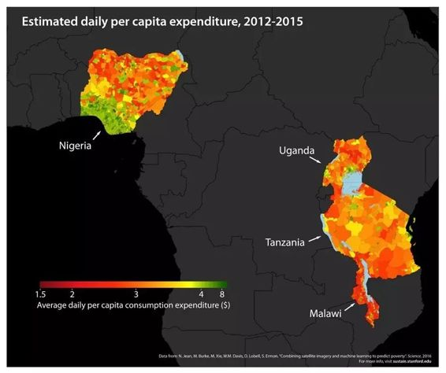
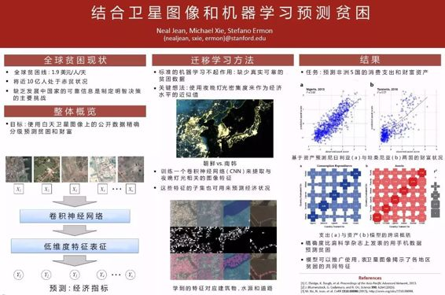

# 深度 | Science：斯坦福大学用迁移学习预测非洲贫困状况

选自 Science、MotherBoard

**机器之心编译**

**参与：**吴攀**、杜夏德**

> *由于缺少真实可靠的数据，预测全球贫困水平很困难。来自斯坦福大学的计算机科学研究团队结合卫星图像和机器学习方法来预测全球各地区贫穷状况。因为缺乏有效数据，无法使用标准的机器学习方法。该团队另辟蹊径使采用迁移学习方法，把对经济水平的预测迁移到夜晚灯光密集程度上来。成功预测了非洲五国的经济状况。*

援助非洲脱贫是一个非常艰巨的任务，充斥着官僚主义和文牍主义。但在许多非洲国家中，糟糕的数据或缺乏数据会让资金分配变得更加麻烦。

「与贫困做斗争一直以来都是现代世界的一个巨大目标，」斯坦福大学工程学院计算机科学博士生 Neal Jean 说，「这是联合国《 2030 年可持续发展议程》的首要目标，但主要的挑战是没有足够的可靠数据。当你不知道贫穷的人在哪里时，要帮助他们脱贫真的是很困难。」

这正是 Jean 和其他五位计算机科学家希望使用卫星图像和机器学习模型去解决的根本问题。他们今天发表在《Science》上的新研究为可以预测关于五个非洲国家（尼日利亚、乌干达、坦桑尼亚、卢旺达和马拉维）的贫困信息的算法提供了概念验证。

*斯坦福大学的这些研究者将高精度卫星图像和强大的机器学习算法结合起来预测尼日利亚、乌干达、坦桑尼亚、卢旺达和马拉维的贫困*

以安哥拉为例。这个国家已经从葡萄牙独立了 40 年了，但其两年之前才进行殖民时代后的第一次人口普查。这个非洲国家有不可思议地丰富的原油储量，但连续 27 年的内战之后，该国一半的人口都生活在贫困之中。不幸的是，因为对他们的经济生活的数据非常缺乏，创造能帮助安哥拉最贫困的群体的项目几乎是不可能的，因为没人知道需要些什么。

因为腐败和冲突问题，国家政府常常在报告自己国家的不平等上遮遮掩掩。据世界银行的报告称，非洲 59 个国家中有 39 个在 2000 年到 2010 年间仅完成了不到两次与贫困相关的人口调查。在这些国家中，其中 14 个根本没有任何数据，而且大部分已经收集到的数据也永远不会公开开放。

几十年来，研究者们一直都在使用其它替代数据集衡量贫困，比如社交媒体、网络搜索查询和移动网络使用量。比如，卢旺达 2014 年有 72% 的人有移动接入，研究者们就能基于该国的电信数据绘制他们的位置分布图。尽管这类的非传统方法能提供很多信息，但该研究指出，由于对专有信息的依赖，它们也带来了隐私和可扩展性的问题。

与此同时，传统的入户调查这样的收集工作成本太高了，可能耗费数千亿美元，而且常常受阻于国内动荡。非洲国家常常依靠捐助进行人口普查，而非自己拨款，因为很多国家负担不起这样的开销。

但高精度的卫星图像——你可以在谷歌地图上通过「卫星视角（satellite view）」看到的那种图像——是公开可用的，而且没有地理限制，还是免费的。而且正如该研究所指出的那样，其中也包含了丰富的贫困数据，只要你知道怎么将其读取出来。

使用卫星图像评估财富集中度（estimate concentrations）并不是什么新闻了。其他科学家已经确认「夜灯」（即人造光污染）可以做发展中国家经济活动的指标。从理论上讲，更高的亮度意味着更多基础设置、更高的发展水平和更多的财富。尽管值得提及的是，其它模型难以区分极端低光照水平和零光照水平。同样的原因，在人口密集的地方，夜灯也没有多大用处。

而这项研究的新颖之处在于：该算法能够根据通过查看卫星摄像学习模式，并基于这些模式弥合数据的缺口。据 Jean 称，他们的方法能从白天的卫星图像中识别出大约 4096 个经济指标，包括道路、市区和水道。通过识别这些特征，该算法能够预测哪些区域可能在夜晚有较高的亮度。

Jean 补充说：「我们的基本方法涉及到一种被称为『迁移学习（transfer learning）』的机器学习技术，这是一种通过尝试解决简单问题来获得困难问题的解决方案的方法——在我们的例子中（困难的问题）是根据卫星图像预测贫困。当你解决简单问题后，你能学到可以迁移的东西，从而帮助你解决更为困难的问题。」

在该团队看来，预测光照水平而非其它财富指标是很重要的，因为夜光在发展中国家经济指标中得到了最多的研究。未来，非政府组织（NGO）也许可将该算法用来绘制世界各地的贫困分布地图。和其它方法相比，该机器学习模型还能帮助加强透明性，因为它并不依赖于任何专有的数据集。

但是，该技术仍有其限制，例如谷歌地图中卫星图像的更新频率不稳定。而且该算法也不是完美的。据该研究成，尽管其超越了其它数据收集方法，但该算法的预测也只能做到「相对准确」。

只通过可从太空中探测到的闪烁灯光发现最贫穷的人的这种方式存在一些致命的缺陷——将他们的国家领导者或国际社会的对他们的救助任务委派给了一台机器。

Jean 说他最终计划让他们的研究开源，而且也正在与多个组织洽谈在实际应用中对他们的算法进行测试。「如果我们可以为他们提供高精度的贫困分布地图，他们就可以将它们包含进已有运作的区域中，并最终为他们的资金分发提供信息。」

2012 年，世界银行估计非洲大约有 3.3 亿人目前生活在贫困线以下，每天的生活费低于 1.9 美元。尽管技术和人道主义上已有很多进步，但非洲生活在极端贫困中的人口自 1990 年来已经几乎增多了 1 亿人！

「更好的数据将能带来更好的决策和更好的生活，」世界银行首席经济学家 Luc Christiaensen 说，「这不仅是关乎数量，数据的质量也很重要。」

*   **论文：结合卫星图像和机器学习来预测贫困（Combining satellite imagery and machine learning to predict poverty）**

 

摘要：发展中国家的经济生活的可靠数据仍然很少，这给研究这些成果和设计改善它们的政策造成了阻碍。在这里我们提出了一种准确的、并不昂贵的、可扩展的用于从高精度卫星图像中评估消费支出和资产财富的昂发。我们使用了来自五个非洲国家——尼日利亚、坦桑尼亚、乌干达、马拉维和卢旺达——的调查和卫星数据，然后发现了可以如何训练卷积神经网络识别可以解释多达 75% 的地方一级（local-level）的经济成果的方法。我们的方法仅需要公开可用的数据，可以改变追踪和定位发展中国家贫困的方式。这也说明了强大的机器学习方法可以如何被用在只有有限训练数据的环境中，说明该方法在许多科学领域都有广泛的应用潜力。

******©本文由机器之心编译，机器之心系今日头条签约作者，本文首发于头条号，***转载请联系本公众号获得授权******。***

✄------------------------------------------------

**加入机器之心（全职记者/实习生）：hr@almosthuman.cn**

**投稿或寻求报道：editor@almosthuman.cn**

**广告&商务合作：bd@almosthuman.cn**